<!---
# This file is auto-generated. Do not edit.
# cspell:disable
--->
# Performance Report

```mermaid
xychart-beta
    title Files Per Second by Day
    y-axis Files per Second
    x-axis Date [Jan-24, Jan-26, Jan-27, Jan-31, Feb-1, Feb-2, Feb-3, Feb-4, Feb-6, Feb-7, Feb-8, Feb-9, Feb-10, Feb-11, Feb-12, Feb-14, Feb-15, Feb-16, Feb-17, Feb-19, Feb-20, Feb-21, Feb-22]
    bar [190.32, 191.51, 190.41, 192.01, 191.89, 188.72, 191.38, 188.90, 190.72, 190.17, 190.44, 190.91, 190.55, 190.54, 188.86, 190.65, 191.15, 192.54, 190.97, 189.21, 190.95, 191.93, 189.13]
    line [20.01, 19.80, 18.94, 17.77, 19.48, 18.59, 18.27, 20.00, 20.26, 18.55, 19.66, 20.05, 18.72, 19.96, 20.29, 18.59, 19.07, 20.25, 18.95, 19.76, 18.01, 18.46, 20.08]
    line [26.06, 26.20, 24.97, 23.09, 24.19, 23.67, 25.80, 25.02, 24.57, 25.83, 26.53, 27.12, 25.19, 24.73, 26.32, 25.72, 25.93, 26.65, 24.45, 25.52, 23.53, 25.65, 26.07]
    line [69.89, 68.59, 68.16, 64.96, 64.42, 71.54, 66.41, 68.48, 67.32, 68.66, 69.54, 66.78, 64.72, 66.96, 67.81, 67.54, 69.24, 69.14, 67.84, 76.41, 70.89, 67.31, 70.35]
    line [106.72, 105.14, 103.83, 105.85, 104.82, 108.27, 101.16, 101.71, 96.80, 105.17, 106.78, 104.49, 88.12, 105.95, 95.68, 105.24, 108.38, 96.07, 105.42, 104.57, 104.52, 96.66, 107.11]
    line [128.54, 132.65, 129.67, 126.00, 129.13, 135.02, 129.21, 131.37, 130.21, 127.48, 133.83, 127.77, 122.88, 128.37, 135.10, 130.41, 132.90, 121.26, 129.83, 131.86, 128.62, 131.04, 134.96]
    line [150.15, 146.49, 146.96, 143.93, 149.76, 150.71, 139.56, 149.35, 149.31, 151.26, 147.89, 143.35, 146.05, 148.59, 146.97, 147.88, 152.57, 150.80, 149.13, 152.26, 152.78, 149.55, 143.73]
    line [261.87, 267.56, 251.76, 251.39, 257.09, 256.60, 252.24, 257.13, 261.45, 265.63, 258.24, 253.80, 254.33, 238.72, 270.54, 256.71, 261.76, 251.74, 255.44, 255.70, 246.95, 250.90, 257.83]
    line [226.67, 217.21, 209.84, 210.58, 224.80, 219.16, 222.44, 214.46, 210.98, 218.39, 222.45, 224.30, 218.74, 221.76, 200.54, 218.78, 219.30, 216.79, 209.78, 203.99, 220.72, 225.56, 211.74]
    line [55.10, 53.59, 53.02, 57.11, 52.81, 55.66, 56.60, 51.29, 52.77, 57.05, 53.25, 56.05, 58.16, 56.27, 53.18, 53.98, 54.67, 55.62, 52.95, 56.33, 56.16, 52.87, 49.30]
    line [102.16, 102.14, 102.53, 103.49, 99.40, 99.16, 97.64, 98.18, 103.70, 106.20, 99.99, 97.22, 103.26, 104.26, 101.58, 98.06, 97.55, 103.52, 102.20, 104.64, 105.41, 96.15, 98.31]
    line [86.06, 83.34, 81.63, 80.82, 83.46, 83.98, 85.68, 83.63, 81.75, 82.99, 80.30, 81.36, 82.63, 82.18, 80.51, 83.91, 83.57, 87.71, 81.51, 80.83, 78.91, 82.42, 85.06]
    line [330.62, 332.64, 332.86, 330.58, 325.66, 323.17, 336.90, 335.91, 322.03, 323.49, 318.09, 297.24, 321.28, 332.16, 332.97, 319.43, 324.88, 322.69, 320.99, 329.84, 297.30, 325.03, 327.91]
    line [24.29, 23.65, 23.65, 21.57, 23.77, 24.71, 24.15, 24.26, 23.40, 25.18, 24.34, 21.29, 24.41, 23.32, 24.52, 23.95, 23.93, 26.14, 23.05, 24.64, 20.92, 22.32, 24.21]
    line [232.80, 236.05, 231.31, 219.07, 234.91, 232.08, 226.54, 219.34, 230.80, 225.22, 227.18, 223.96, 236.18, 221.89, 211.43, 221.91, 216.06, 220.67, 225.17, 231.02, 220.24, 226.17, 219.68]
    line [15.03, 15.29, 14.84, 15.62, 14.38, 14.96, 14.97, 15.27, 14.50, 15.88, 15.38, 15.78, 13.95, 14.61, 15.64, 15.09, 14.85, 15.30, 15.16, 14.06, 14.46, 15.41, 15.20]
    line [34.02, 34.09, 33.87, 34.29, 34.92, 32.72, 32.24, 34.39, 32.11, 29.25, 34.28, 34.27, 30.99, 32.76, 34.39, 34.12, 31.87, 32.51, 34.43, 31.35, 34.71, 33.66, 33.89]
    line [47.53, 47.48, 45.26, 47.60, 46.28, 48.66, 45.03, 44.68, 43.73, 45.57, 47.74, 41.63, 41.21, 45.64, 48.81, 44.68, 43.13, 46.03, 46.35, 45.95, 47.66, 45.50, 42.44]
    line [193.91, 185.17, 181.80, 175.63, 188.19, 178.84, 190.27, 179.88, 183.71, 188.14, 181.32, 186.40, 168.60, 184.20, 174.99, 182.26, 184.13, 178.63, 177.91, 178.13, 170.26, 181.98, 181.28]
    line [90.73, 88.98, 87.79, 92.24, 85.84, 87.34, 84.11, 87.49, 86.37, 87.72, 85.83, 80.71, 86.83, 85.89, 88.80, 88.35, 86.20, 79.88, 88.50, 88.86, 89.95, 85.47, 86.74]
    line [218.17, 216.51, 216.11, 223.69, 217.62, 221.92, 210.52, 217.06, 217.75, 221.18, 215.63, 217.27, 218.63, 215.55, 219.85, 215.87, 211.04, 214.14, 215.28, 213.09, 213.97, 220.46, 206.14]
    line [238.38, 229.34, 231.07, 215.86, 227.49, 237.43, 233.36, 227.18, 233.42, 233.14, 230.84, 225.21, 232.83, 240.89, 231.65, 231.34, 231.21, 244.19, 223.55, 239.70, 229.90, 235.21, 234.42]
    line [129.59, 130.75, 126.15, 128.28, 128.07, 127.23, 125.91, 129.12, 126.49, 131.65, 129.27, 131.48, 127.09, 130.68, 129.17, 127.78, 130.44, 128.86, 131.22, 132.26, 123.16, 133.27, 134.61]
    line [202.65, 197.73, 197.86, 185.13, 193.14, 197.96, 188.03, 184.87, 192.18, 186.89, 188.37, 189.97, 197.93, 196.64, 199.99, 198.18, 196.78, 191.66, 183.24, 198.97, 195.69, 196.29, 199.65]
    line [174.86, 177.54, 174.66, 177.76, 179.20, 178.55, 179.09, 179.41, 173.82, 171.95, 172.64, 171.28, 176.43, 175.80, 180.86, 176.28, 173.64, 175.63, 176.43, 178.51, 182.28, 170.09, 179.26]
    line [269.34, 261.80, 260.28, 260.12, 259.24, 266.03, 264.66, 253.81, 264.19, 262.88, 255.12, 259.81, 256.65, 259.10, 261.07, 258.76, 261.47, 267.24, 254.70, 257.67, 260.94, 258.83, 268.25]
    line [204.49, 217.13, 213.62, 216.87, 219.73, 217.00, 217.80, 206.42, 216.86, 217.40, 212.93, 213.99, 216.37, 207.17, 209.51, 213.52, 203.34, 215.88, 213.12, 205.73, 212.95, 211.55, 211.06]
    line [244.81, 248.38, 241.40, 249.14, 241.45, 239.07, 239.51, 243.53, 244.90, 249.62, 243.56, 245.16, 248.01, 245.77, 245.71, 246.33, 249.20, 246.02, 244.24, 231.62, 249.13, 242.45, 243.15]
    line [39.56, 40.89, 38.42, 41.91, 40.21, 40.30, 38.59, 39.97, 40.70, 38.75, 38.14, 39.24, 39.45, 39.06, 40.44, 38.93, 40.19, 35.66, 39.21, 40.89, 39.79, 40.82, 36.88]
    line [83.63, 82.99, 83.39, 81.99, 83.50, 81.95, 82.10, 83.95, 83.89, 81.23, 83.38, 84.02, 78.63, 78.33, 84.47, 83.13, 83.66, 80.84, 83.02, 84.44, 80.37, 87.47, 84.69]
    line [178.27, 178.37, 173.24, 175.53, 174.36, 175.31, 176.60, 177.03, 168.50, 172.68, 169.57, 174.00, 174.69, 174.76, 142.58, 173.78, 169.32, 168.80, 179.63, 179.91, 171.61, 176.10, 177.19]
    line [353.32, 354.47, 340.16, 355.36, 343.22, 341.35, 343.34, 343.75, 345.17, 341.37, 358.57, 359.43, 367.04, 357.06, 346.78, 363.25, 359.22, 355.34, 343.44, 363.00, 335.36, 339.22, 332.27]
    line [221.41, 212.75, 215.81, 222.32, 209.91, 217.01, 216.15, 212.32, 213.20, 215.93, 213.93, 215.54, 211.99, 212.34, 214.45, 216.77, 218.28, 216.31, 214.05, 214.67, 213.49, 218.19, 207.92]
    line [425.03, 422.04, 415.46, 422.79, 413.85, 411.47, 422.24, 425.96, 422.90, 426.77, 417.49, 413.10, 427.18, 415.79, 423.61, 413.93, 415.75, 423.97, 415.82, 402.21, 417.90, 421.85, 419.94]
    line [195.95, 192.00, 189.33, 196.17, 191.05, 192.93, 192.90, 193.43, 182.93, 188.24, 197.74, 194.04, 183.39, 196.97, 181.19, 192.15, 188.44, 188.43, 193.17, 194.32, 195.93, 197.80, 185.59]
    line [136.02, 132.00, 133.67, 130.01, 133.77, 131.00, 132.25, 127.77, 131.87, 132.83, 130.24, 129.37, 135.96, 133.33, 120.48, 131.69, 126.77, 128.95, 131.05, 132.77, 134.30, 133.46, 129.90]
    line [125.81, 130.48, 125.23, 130.52, 121.85, 125.25, 129.66, 129.52, 125.44, 125.65, 123.91, 126.45, 124.46, 122.70, 126.21, 125.01, 121.92, 124.63, 126.05, 123.51, 125.30, 123.36, 128.34]
    line [82.74, 85.67, 76.62, 69.80, 79.78, 83.19, 79.99, 81.38, 78.37, 78.87, 76.33, 81.76, 73.03, 78.44, 82.16, 76.45, 81.35, 81.75, 78.06, 74.92, 73.32, 81.29, 81.91]
    line [259.27, 265.80, 263.72, 257.16, 251.63, 250.02, 261.80, 245.30, 263.91, 261.35, 263.52, 260.14, 262.60, 262.38, 253.84, 256.03, 271.88, 272.11, 262.81, 268.41, 258.56, 256.27, 252.10]
    line [384.07, 389.49, 375.11, 344.39, 377.92, 368.78, 357.60, 388.25, 362.18, 363.07, 369.70, 375.89, 360.98, 379.16, 371.95, 380.17, 380.03, 383.65, 403.62, 329.33, 387.65, 379.15, 392.41]
    line [37.80, 38.01, 36.89, 36.96, 37.04, 36.98, 36.58, 36.57, 37.20, 37.62, 37.00, 38.62, 38.34, 38.10, 37.49, 36.82, 37.56, 36.77, 36.33, 37.40, 36.62, 38.51, 37.36]
    line [49.53, 48.99, 48.58, 48.96, 48.60, 48.80, 46.86, 44.78, 49.77, 46.58, 46.37, 48.10, 48.71, 50.07, 49.29, 45.43, 50.01, 33.04, 44.04, 44.67, 46.36, 48.18, 47.11]
    line [233.44, 228.13, 220.74, 229.98, 223.23, 220.66, 222.78, 222.35, 231.30, 222.88, 223.28, 209.50, 215.15, 218.83, 217.74, 220.20, 225.26, 234.21, 221.97, 226.10, 219.20, 223.30, 228.62]
    line [6.94, 6.67, 6.54, 6.62, 6.41, 6.91, 6.36, 6.58, 6.71, 6.80, 6.54, 6.62, 5.96, 6.86, 6.86, 6.52, 6.16, 6.48, 6.78, 6.24, 6.45, 6.67, 6.95]
    line [138.61, 141.46, 138.59, 143.14, 142.73, 142.84, 131.70, 135.60, 134.90, 137.77, 133.55, 139.08, 139.48, 135.67, 138.79, 139.27, 140.69, 136.31, 141.26, 136.95, 140.26, 134.61, 143.87]
    line [126.29, 124.09, 118.58, 122.01, 124.68, 121.40, 124.27, 121.00, 122.72, 124.94, 121.83, 120.56, 119.51, 117.66, 126.41, 120.64, 118.92, 126.15, 122.12, 122.32, 119.71, 119.61, 120.41]
    line [240.84, 231.74, 230.60, 238.25, 234.41, 226.71, 230.40, 229.74, 237.81, 232.23, 224.57, 237.26, 238.90, 231.61, 222.35, 235.22, 226.17, 229.70, 226.87, 232.74, 235.31, 224.47, 236.01]
    line [167.30, 165.36, 160.46, 164.87, 161.06, 158.29, 161.96, 164.85, 164.28, 164.40, 159.10, 159.22, 159.55, 156.17, 168.86, 156.43, 163.15, 147.05, 161.97, 157.72, 155.61, 153.59, 166.61]
    line [205.03, 203.50, 200.03, 203.99, 203.12, 208.67, 201.18, 195.78, 203.73, 196.42, 202.06, 200.13, 204.90, 199.89, 202.61, 200.63, 203.97, 207.62, 204.11, 196.35, 204.19, 205.00, 205.49]
    line [100.22, 98.35, 98.09, 97.24, 99.79, 99.21, 94.63, 98.63, 99.54, 99.93, 96.90, 95.85, 100.02, 98.95, 99.68, 93.47, 96.18, 99.12, 97.35, 97.51, 101.87, 100.27, 95.52]
    line [167.02, 174.50, 177.97, 180.67, 179.91, 166.82, 180.26, 174.86, 175.68, 174.32, 177.53, 181.20, 174.17, 176.92, 176.20, 178.74, 179.75, 180.11, 177.55, 173.68, 176.25, 178.32, 170.74]
```

Daily Performance

Time to Process Files

| Repository                                      | Elapsed | Min/Avg/Max           |   SD | SD Graph                |
| ----------------------------------------------- | ------: | :-------------------: | ---: | ----------------------- |
| AdaDoom3/AdaDoom3                    |    2.76 | 2.6 /   2.8 /   2.9   | 0.07 | `    ┣━━┻━━●━━┻━━┫    ` |
| alexiosc/megistos                    |    6.85 | 6.6 /   7.1 /   7.8   | 0.24 | `    ┣━━●━━╋━━┻━━┫    ` |
| apollographql/apollo-server          |    2.58 | 2.4 /   2.5 /   2.9   | 0.12 | `    ┣━━┻━━╋━●┻━━┫    ` |
| aspnetboilerplate/aspnetboilerplate  |    8.52 | 8.3 /   8.8 /   9.9   | 0.24 | `    ┣━━●━━╋━━┻━━┫    ` |
| aws-amplify/docs                     |   11.82 | 11.4 /  11.8 /  12.5  | 0.24 | `    ┣━━┻━━╋●━┻━━┫    ` |
| Azure/azure-rest-api-specs           |    9.69 | 8.6 /   9.4 /  11.2   | 0.46 | `    ┣━━┻━━╋━●┻━━┫    ` |
| bitjson/typescript-starter           |    1.00 | 1.0 /   1.0 /   1.2   | 0.06 | `     ┣━┻●━╋━━┻━┫     ` |
| caddyserver/caddy                    |    3.40 | 3.1 /   3.4 /   3.7   | 0.13 | `    ┣━━┻━━╋●━┻━━┫    ` |
| canada-ca/open-source-logiciel-libre |    1.01 | 1.0 /   1.1 /   1.2   | 0.06 | `     ┣━●━━╋━━┻━┫     ` |
| chef/chef                            |    5.24 | 5.0 /   5.4 /   5.9   | 0.19 | `    ┣━━┻●━╋━━┻━━┫    ` |
| dart-lang/sdk                        |   53.47 | 50.2 /  54.3 /  60.2  | 1.47 | `  ┣━━━┻━●━╋━━━┻━━━┫  ` |
| django/django                        |   13.90 | 12.8 /  13.5 /  14.4  | 0.37 | `    ┣━━┻━━╋━━┻●━┫    ` |
| eslint/eslint                        |    9.99 | 9.2 /   9.5 /  10.3   | 0.24 | `    ┣━━┻━━╋━━┻━━●    ` |
| exonum/exonum                        |    3.28 | 3.2 /   3.4 /   3.6   | 0.10 | `    ┣━━┻●━╋━━┻━━┫    ` |
| flutter/samples                      |   14.45 | 13.4 /  14.3 /  17.4  | 0.59 | `   ┣━━━┻━━╋●━┻━━━┫   ` |
| gitbucket/gitbucket                  |    3.07 | 3.0 /   3.2 /   3.4   | 0.11 | `    ┣━━●━━╋━━┻━━┫    ` |
| googleapis/google-cloud-cpp          |  123.96 | 115.2 / 119.3 / 135.3 | 3.73 | `  ┣━━━┻━━━╋━━━┻●━━┫  ` |
| graphql/express-graphql              |    1.07 | 1.0 /   1.1 /   1.3   | 0.07 | `     ┣━┻━●╋━━┻━┫     ` |
| graphql/graphql-js                   |    2.56 | 2.5 /   2.7 /   3.1   | 0.10 | `    ┣━━●━━╋━━┻━━┫    ` |
| graphql/graphql-relay-js             |    1.07 | 1.0 /   1.1 /   1.3   | 0.07 | `     ┣━┻━●╋━━┻━┫     ` |
| graphql/graphql-spec                 |    1.25 | 1.2 /   1.3 /   1.4   | 0.05 | `     ┣━┻━●╋━━┻━┫     ` |
| iluwatar/java-design-patterns        |   11.37 | 10.8 /  11.4 /  12.3  | 0.35 | `    ┣━━┻━●╋━━┻━━┫    ` |
| ktaranov/sqlserver-kit               |    5.79 | 5.5 /   5.9 /   6.9   | 0.22 | `    ┣━━┻●━╋━━┻━━┫    ` |
| liriliri/licia                       |    3.66 | 3.4 /   3.8 /   4.4   | 0.17 | `    ┣━━●━━╋━━┻━━┫    ` |
| MartinThoma/LaTeX-examples           |    5.97 | 5.8 /   6.1 /   6.7   | 0.19 | `    ┣━━┻●━╋━━┻━━┫    ` |
| mdx-js/mdx                           |    1.72 | 1.4 /   1.8 /   2.1   | 0.11 | `    ┣━━┻●━╋━━┻━━┫    ` |
| microsoft/TypeScript-Website         |    5.29 | 4.9 /   5.1 /   5.9   | 0.19 | `    ┣━━┻━━╋━●┻━━┫    ` |
| MicrosoftDocs/PowerShell-Docs        |   20.39 | 19.3 /  20.1 /  22.0  | 0.56 | `   ┣━━━┻━━╋━●┻━━━┫   ` |
| neovim/nvim-lspconfig                |    3.86 | 3.8 /   4.0 /   4.6   | 0.16 | `    ┣━━┻●━╋━━┻━━┫    ` |
| pagekit/pagekit                      |    3.50 | 3.3 /   3.4 /   3.9   | 0.15 | `    ┣━━┻━━╋━●┻━━┫    ` |
| php/php-src                          |   23.81 | 22.1 /  23.2 /  28.7  | 0.94 | `   ┣━━━┻━━╋━●┻━━━┫   ` |
| plasticrake/tplink-smarthome-api     |    1.32 | 1.2 /   1.3 /   1.9   | 0.10 | `     ┣━┻━━●━━┻━┫     ` |
| prettier/prettier                    |    8.02 | 7.1 /   7.5 /   8.1   | 0.25 | `    ┣━━┻━━╋━━┻━━●    ` |
| pycontribs/jira                      |    1.60 | 1.3 /   1.5 /   1.7   | 0.09 | `     ┣━┻━━╋━━┻●┫     ` |
| RustPython/RustPython                |    6.26 | 5.7 /   6.1 /   7.1   | 0.23 | `    ┣━━┻━━╋━●┻━━┫    ` |
| shoelace-style/shoelace              |    2.63 | 2.6 /   2.7 /   3.1   | 0.11 | `    ┣━━●━━╋━━┻━━┫    ` |
| slint-ui/slint                       |   13.20 | 12.1 /  12.8 /  14.1  | 0.46 | `   ┣━━━┻━━╋━━●━━━┫   ` |
| SoftwareBrothers/admin-bro           |    2.43 | 2.3 /   2.4 /   2.7   | 0.10 | `    ┣━━┻━━●━━┻━━┫    ` |
| sveltejs/svelte                      |   20.13 | 19.5 /  20.0 /  21.0  | 0.36 | `   ┣━━━┻━━╋●━┻━━━┫   ` |
| TheAlgorithms/Python                 |    5.43 | 5.2 /   5.5 /   6.4   | 0.22 | `    ┣━━┻━●╋━━┻━━┫    ` |
| twbs/bootstrap                       |    1.68 | 1.5 /   1.7 /   2.0   | 0.08 | `     ┣━┻●━╋━━┻━┫     ` |
| typescript-cheatsheets/react         |    1.44 | 1.3 /   1.3 /   1.5   | 0.06 | `     ┣━┻━━╋━━┻●┫     ` |
| typescript-eslint/typescript-eslint  |    3.98 | 3.8 /   4.0 /   4.5   | 0.18 | `    ┣━━┻━●╋━━┻━━┫    ` |
| vitest-dev/vitest                    |   10.77 | 9.9 /  10.8 /  11.7   | 0.41 | `    ┣━━┻━━●━━┻━━┫    ` |
| w3c/aria-practices                   |    3.08 | 3.1 /   3.2 /   3.6   | 0.12 | `    ┣━●┻━━╋━━┻━━┫    ` |
| w3c/specberus                        |    1.84 | 1.8 /   1.9 /   2.2   | 0.10 | `    ┣━━┻●━╋━━┻━━┫    ` |
| webdeveric/webpack-assets-manifest   |    1.30 | 1.0 /   1.2 /   1.4   | 0.08 | `     ┣━┻━━╋━━●━┫     ` |
| webpack/webpack                      |    5.20 | 4.7 /   5.0 /   5.6   | 0.20 | `    ┣━━┻━━╋━━●━━┫    ` |
| wireapp/wire-desktop                 |    1.30 | 1.2 /   1.3 /   1.6   | 0.09 | `     ┣━┻━●╋━━┻━┫     ` |
| wireapp/wire-webapp                  |   11.23 | 10.3 /  10.8 /  11.8  | 0.36 | `    ┣━━┻━━╋━━┻●━┫    ` |

Note:
- Elapsed time is in seconds.

Files per Second over Time

| Repository                                      | Files |    Sec |    Fps |    Rel | Trend Fps              |    N |
| ----------------------------------------------- | ----: | -----: | -----: | -----: | ---------------------- | ---: |
| AdaDoom3/AdaDoom3                    |   103 |   2.76 |  37.36 |  0.27% | `██▇▇█▇▅▇▆▆▇▇▆▅▆▇▆██▇` |   55 |
| alexiosc/megistos                    |   583 |   6.85 |  85.06 |  2.86% | `▅▆▅▆▆▅▇▆▇▇█▅█▅▇▆▅▇▅▇` |   55 |
| apollographql/apollo-server          |   254 |   2.58 |  98.31 | -2.64% | `▅▇▇██▇▃█▅▆▇▄▇▇▇██▆▄▆` |   55 |
| aspnetboilerplate/aspnetboilerplate  |  2286 |   8.52 | 268.25 |  3.04% | `▇▇▇▆▇▇▇▇▇▇▆██▆▇▇▇▆██` |   55 |
| aws-amplify/docs                     |  2874 |  11.82 | 243.15 | -0.41% | `▇▇▇▇▇▇▇▇▇▆█▇▇▇▇▅▇▇▆▆` |   55 |
| Azure/azure-rest-api-specs           |  2444 |   9.69 | 252.10 | -3.19% | `▅▇█▆▇▆▇▅▅▇███▇▇▇▆█▅▆` |   55 |
| bitjson/typescript-starter           |    20 |   1.00 |  20.08 |  4.22% | `▇▆██▇█▇▇▆▃█▄█▇▅▇▅▄▇█` |   55 |
| caddyserver/caddy                    |   295 |   3.40 |  86.74 | -0.28% | `▃▇▇▆▇▇█▆▇█▇▆▄▆█▇█▅▇▇` |   55 |
| canada-ca/open-source-logiciel-libre |     7 |   1.01 |   6.95 |  5.43% | `▇▃▆▇█▇▆▃▇▆▄▄▅▆▇▄▅█▄▇` |   55 |
| chef/chef                            |  1199 |   5.24 | 228.62 |  2.53% | `▅▅▆▅▇▆▇▆▆▆█▆█▅▇▇▆▇▆▇` |   55 |
| dart-lang/sdk                        | 10988 |  53.47 | 205.49 |  1.80% | `▇█▆█▆▇▆▇▇▇█▇█▇█▆█▇██` |   55 |
| django/django                        |  2891 |  13.90 | 207.92 | -3.30% | `▇▆▇▇▄▆██▇▅█▆▇▇▅▇▆▇▇▅` |   55 |
| eslint/eslint                        |  2060 |   9.99 | 206.14 | -4.81% | `█▇▇▅▇▇█▆▇▆█▄▆▆█▆▆█▇▅` |   55 |
| exonum/exonum                        |   421 |   3.28 | 128.34 |  2.14% | `▇▇▇▅▆▇▇█▇▄▇▅▇█▆▆▇▇▆█` |   55 |
| flutter/samples                      |  2561 |  14.45 | 177.19 |  2.04% | `▇▇▇▇█▃▇█▇▇▇▆▆███▇███` |   55 |
| gitbucket/gitbucket                  |   414 |   3.07 | 134.96 |  3.66% | `█▅▆▆▇█▆▇█▇▇█▄▇▆▇▆▇▇█` |   55 |
| googleapis/google-cloud-cpp          | 21165 | 123.96 | 170.74 | -3.40% | `█▇▇▇█▇▇█▇▇▇██▇▇▆▇▆█▆` |   55 |
| graphql/express-graphql              |    26 |   1.07 |  24.21 |  1.99% | `▂▇▇▆▄▇▇█▅▅▇▆█▆▄▇▃▄▆▆` |   55 |
| graphql/graphql-js                   |   368 |   2.56 | 143.87 |  4.22% | `▆▇▇▅▆▆▅▆▇█▇▇▆▇▇▆▇▅▆▇` |   55 |
| graphql/graphql-relay-js             |    28 |   1.07 |  26.07 |  2.85% | `█▆▆▄▆▇▆▅▆█▆▇▇▄▇▆▄▆▆▇` |   55 |
| graphql/graphql-spec                 |    19 |   1.25 |  15.20 |  1.22% | `█▄▇▄▇█▇▆▇▇▅█▇▇▇▅▅█▇▇` |   55 |
| iluwatar/java-design-patterns        |  2039 |  11.37 | 179.26 |  1.96% | `▅▇▆▇▇█▇█▆▇▅▇▇▇▆▇█▆▄▇` |   55 |
| ktaranov/sqlserver-kit               |   490 |   5.79 |  84.69 |  2.13% | `▇▅▃▆▆▇▇▆▅█▆▆▆▇▆▇▅▇█▇` |   55 |
| liriliri/licia                       |  1437 |   3.66 | 392.41 |  4.56% | `▆▅▄▆▇▅▅▆▆▆▆▅▆▆█▃▆▆▆▇` |   55 |
| MartinThoma/LaTeX-examples           |  1409 |   5.97 | 236.01 |  1.98% | `███▇▆▅█▇█▆▆▆▆▆▆▇▇▆▅▇` |   55 |
| mdx-js/mdx                           |   141 |   1.72 |  81.91 |  3.56% | `█▅▇▇▆██▅▆▅█▇█▅▇▅▅▇██` |   55 |
| microsoft/TypeScript-Website         |   761 |   5.29 | 143.73 | -2.89% | `▆▆█▆▇▇▇▇▆▇█▇▇▇▇██▇▇▆` |   55 |
| MicrosoftDocs/PowerShell-Docs        |  2648 |  20.39 | 129.90 | -1.40% | `▅██▇▇▄▆█▇▇▄▇▆▇▇▇██▇▆` |   55 |
| neovim/nvim-lspconfig                |   770 |   3.86 | 199.65 |  2.99% | `▆▇▇▇▇▇▇██▆▇▇▆▆▅▇▇▇▇▇` |   55 |
| pagekit/pagekit                      |   741 |   3.50 | 211.74 | -2.57% | `█▇██▇▄█▅█▇█▆▇▄█▅▇██▆` |   55 |
| php/php-src                          |  2274 |  23.81 |  95.52 | -2.49% | `▆██▇▇█▇▂▇█▇▆▇▇▇▇███▇` |   55 |
| plasticrake/tplink-smarthome-api     |    62 |   1.32 |  47.11 | -0.85% | `▆▇▇█▇▇▅▅▇▇█▇▂▅▆▆▆█▆▇` |   55 |
| prettier/prettier                    |  2664 |   8.02 | 332.27 | -4.93% | `▆█▇▆▇▆▇█▇█▇▇▇▅▆▇▅▄▆▄` |   55 |
| pycontribs/jira                      |    79 |   1.60 |  49.30 | -9.07% | `▇█▆█▇▆▇▆▅▇▅█▇▅▆▇▇▃█▄` |   55 |
| RustPython/RustPython                |   754 |   6.26 | 120.41 | -1.00% | `▇▆▅▇▆█▇▇▆▇▆▆█▇█▇▇▆▇▇` |   55 |
| shoelace-style/shoelace              |   439 |   2.63 | 166.61 |  3.64% | `▇▆▆▅▆█▄▆▆▇▆█▄▇▇▆▆▇▃█` |   55 |
| slint-ui/slint                       |  2786 |  13.20 | 211.06 | -1.01% | `▇██▇▄▇█▇█▇▇▅██▇▆▇█▆▇` |   55 |
| SoftwareBrothers/admin-bro           |   441 |   2.43 | 181.28 | -0.86% | `█▅▇▇█▆▇▅█▇▇▇▆█▄▆▅▇▇▇` |   55 |
| sveltejs/svelte                      |  8453 |  20.13 | 419.94 |  0.35% | `▇██▇▅█▇▇▆▇▇▇█▆▇▅▇▇█▇` |   55 |
| TheAlgorithms/Python                 |  1401 |   5.43 | 257.83 |  0.67% | `▇▆▃█▃█▆▇▆█▇▇▆▆▇▇▆▆▆▇` |   55 |
| twbs/bootstrap                       |   118 |   1.68 |  70.35 |  3.32% | `▆▄▆▆▄▅▄▅▆▆▆▆▆▅▆█▆▅▅▆` |   55 |
| typescript-cheatsheets/react         |    53 |   1.44 |  36.88 | -6.50% | `▇▆▇▇▄▇▆▇▆▄▆█▃▆▇▇▇▇█▄` |   55 |
| typescript-eslint/typescript-eslint  |  1306 |   3.98 | 327.91 |  0.60% | `▄▆▆▆█▇▅▇▆▆▅█▆▇▅▇▄▆▇▇` |   55 |
| vitest-dev/vitest                    |  2525 |  10.77 | 234.42 |  1.17% | `▄▆▆█▆▅▅▅▆▆▅▆▇▅▄▆▅▅▇▆` |   55 |
| w3c/aria-practices                   |   414 |   3.08 | 134.61 |  4.58% | `▇▆▇▇▇▇▇▆▆▆█▆▇▇▇█▅███` |   55 |
| w3c/specberus                        |   197 |   1.84 | 107.11 |  3.43% | `█▃█▇▇▅▆▇▇▇██▅▇▇▇▇▄▆█` |   55 |
| webdeveric/webpack-assets-manifest   |    55 |   1.30 |  42.44 | -7.08% | `▄▄█▃██▆▆▆▅▄▆▇▇▇▆▇█▄▅` |   55 |
| webpack/webpack                      |  1143 |   5.20 | 219.68 | -3.29% | `▇█▅▅█▅▆▇▅▆▇▃▆█▆▇▆█▆▆` |   55 |
| wireapp/wire-desktop                 |    44 |   1.30 |  33.89 |  1.36% | `▇▅▅▄█▇▅▇▇▇▄▆▆▇▆▅▇▆▆▆` |   55 |
| wireapp/wire-webapp                  |  2084 |  11.23 | 185.59 | -3.37% | `▆▅██▇▅▇█▆▇▆▇▆▆█▇███▆` |   54 |

Data Throughput

| Repository                                      | Files |    Sec |     Kps |    Rel | Trend Kps              |    N |
| ----------------------------------------------- | ----: | -----: | ------: | -----: | ---------------------- | ---: |
| AdaDoom3/AdaDoom3                    |   103 |   2.76 |  794.04 |  0.27% | `██▇▇█▇▅▇▆▆▇▇▆▅▆▇▆██▇` |   55 |
| alexiosc/megistos                    |   583 |   6.85 |  668.39 |  2.86% | `▅▆▅▆▆▅▇▆▇▇█▅█▅▇▆▅▇▅▇` |   55 |
| apollographql/apollo-server          |   254 |   2.58 |  807.78 | -2.40% | `▅▇▇██▇▃█▅▆▇▄▇▇▇██▆▄▆` |   55 |
| aspnetboilerplate/aspnetboilerplate  |  2286 |   8.52 |  652.66 |  3.04% | `▇▇▇▆▇▇▇▇▇▇▆██▆▇▇▇▆██` |   55 |
| aws-amplify/docs                     |  2874 |  11.82 |  850.19 | -0.38% | `▇▇▇▇▇▇▇▇▇▆█▇▇▇▇▅▇▇▆▇` |   55 |
| Azure/azure-rest-api-specs           |  2444 |   9.69 |  660.78 | -3.60% | `▅▇█▆▇▆▇▅▅▇███▇▇▇▆▇▅▆` |   55 |
| bitjson/typescript-starter           |    20 |   1.00 |   80.33 |  4.22% | `▇▆██▇█▇▇▆▃█▄█▇▅▇▅▄▇█` |   55 |
| caddyserver/caddy                    |   295 |   3.40 |  757.43 | -0.58% | `▃▇▇▆▇▇█▆▇█▇▆▄▆█▇█▅▇▇` |   55 |
| canada-ca/open-source-logiciel-libre |     7 |   1.01 |   57.55 |  5.43% | `▇▃▆▇█▇▆▃▇▆▄▄▅▆▇▄▅█▄▇` |   55 |
| chef/chef                            |  1199 |   5.24 | 1072.56 |  2.56% | `▅▅▆▅▇▆▇▆▆▆█▆█▅▇▇▆▇▆▇` |   55 |
| dart-lang/sdk                        | 10988 |  53.47 | 1397.09 |  1.81% | `▇█▆█▆▇▇▇▇▇█▇█▇█▆█▇██` |   55 |
| django/django                        |  2891 |  13.90 | 1313.74 | -3.18% | `▇▆▇▇▄▆██▇▆█▆▇▇▅▇▆▇▇▅` |   55 |
| eslint/eslint                        |  2060 |   9.99 | 1430.84 | -4.67% | `▇▇▇▅▇▇█▅▇▆█▄▆▆█▆▆█▇▅` |   55 |
| exonum/exonum                        |   421 |   3.28 | 1227.60 |  2.14% | `▇▇▇▅▆▇▇█▇▄▇▅▇█▆▆▇▇▆█` |   55 |
| flutter/samples                      |  2561 |  14.45 | 1496.66 | -0.83% | `▇██▇█▃▇█▇█▇▆▆███▆▇▇▇` |   55 |
| gitbucket/gitbucket                  |   414 |   3.07 |  617.11 |  3.93% | `█▅▆▆▇█▆▇█▇▇█▄▇▆▇▆▇▇█` |   55 |
| googleapis/google-cloud-cpp          | 21165 | 123.96 | 1387.34 | -3.55% | `█▇▇▇█▇▇█▇▇▇██▇▇▆▇▆█▆` |   55 |
| graphql/express-graphql              |    26 |   1.07 |  110.79 |  1.99% | `▂▇▇▆▄▇▇█▅▅▇▆█▆▄▇▃▄▆▆` |   55 |
| graphql/graphql-js                   |   368 |   2.56 |  837.82 |  4.33% | `▆▇▇▅▆▆▅▆▇█▇▇▆▇▇▆▇▅▆█` |   55 |
| graphql/graphql-relay-js             |    28 |   1.07 |  102.43 |  2.85% | `█▆▆▄▆▇▆▅▆█▆▇▇▄▇▆▄▆▆▇` |   55 |
| graphql/graphql-spec                 |    19 |   1.25 |  507.35 |  1.22% | `█▄▇▄▇█▇▆▇▇▅█▇▇▇▅▅█▇▇` |   55 |
| iluwatar/java-design-patterns        |  2039 |  11.37 |  554.57 |  2.01% | `▅▇▆▇▇█▇█▆▇▅▇▇▇▆▇█▆▄▇` |   55 |
| ktaranov/sqlserver-kit               |   490 |   5.79 | 1280.26 |  2.07% | `▇▅▃▆▆▇▇▆▅█▆▆▆▇▆▇▅▇█▇` |   55 |
| liriliri/licia                       |  1437 |   3.66 |  467.51 |  4.56% | `▆▅▄▆▇▅▅▆▆▆▆▅▆▆█▃▆▆▆▇` |   55 |
| MartinThoma/LaTeX-examples           |  1409 |   5.97 |  487.43 |  1.98% | `███▇▆▅█▇█▆▆▆▆▆▆▇▇▆▅▇` |   55 |
| mdx-js/mdx                           |   141 |   1.72 |  380.49 |  3.56% | `█▅▇▇▆██▅▆▅█▇█▅▇▅▅▇██` |   55 |
| microsoft/TypeScript-Website         |   761 |   5.29 |  994.03 | -2.91% | `▆▆█▆▇▇▇▇▆▇█▇▇▇▇██▇▇▆` |   55 |
| MicrosoftDocs/PowerShell-Docs        |  2648 |  20.39 | 1358.13 | -1.39% | `▅██▇▇▄▆█▇▇▄▇▆▇▇▇██▇▆` |   55 |
| neovim/nvim-lspconfig                |   770 |   3.86 |  380.11 |  4.42% | `▆▇▇▇▇▇▇██▆▇▇▇▆▅█▇▇▇█` |   55 |
| pagekit/pagekit                      |   741 |   3.50 |  441.49 | -2.57% | `█▇██▇▄█▅█▇█▆▇▄█▅▇██▆` |   55 |
| php/php-src                          |  2274 |  23.81 | 1662.48 | -2.67% | `▆██▇▇█▇▂▇█▇▆▇▇▇▇███▇` |   55 |
| plasticrake/tplink-smarthome-api     |    62 |   1.32 |  254.57 | -0.85% | `▆▇▇█▇▇▅▅▇▇█▇▂▅▆▆▆█▆▇` |   55 |
| prettier/prettier                    |  2664 |   8.02 |  457.12 | -5.64% | `▆█▇▆▇▆▇█▇█▇▇▆▄▆▇▅▄▆▄` |   55 |
| pycontribs/jira                      |    79 |   1.60 |  349.46 | -9.07% | `▇█▆█▇▆▇▆▅▇▅█▇▅▆▇▇▃█▄` |   55 |
| RustPython/RustPython                |   754 |   6.26 | 1755.27 |  5.81% | `▇▇▆▇▇█▇▇▆▇▇▇█▇█▇▇▇▇▇` |   55 |
| shoelace-style/shoelace              |   439 |   2.63 |  804.96 |  3.64% | `▇▆▆▅▆█▄▆▆▇▆█▄▇▇▆▆▇▃█` |   55 |
| slint-ui/slint                       |  2786 |  13.20 | 1309.85 | -1.33% | `▇██▇▄▇█▇█▇▇▅██▇▆▇█▆▇` |   55 |
| SoftwareBrothers/admin-bro           |   441 |   2.43 |  399.56 | -0.86% | `█▅▇▇█▆▇▅█▇▇▇▆█▄▆▅▇▇▇` |   55 |
| sveltejs/svelte                      |  8453 |  20.13 |  283.22 |  0.61% | `▇██▇▅█▇▇▆▇▇▇█▆█▅▇▇██` |   55 |
| TheAlgorithms/Python                 |  1401 |   5.43 |  656.45 |  0.67% | `▇▆▃█▃█▆▇▆█▇▇▆▆▇▇▆▆▆▇` |   55 |
| twbs/bootstrap                       |   118 |   1.68 |  577.73 |  3.32% | `▆▄▆▆▄▅▄▅▆▆▆▆▆▅▆█▆▅▅▆` |   55 |
| typescript-cheatsheets/react         |    53 |   1.44 |  273.43 | -6.29% | `▇▆▇▇▄▇▆▇▆▄▆█▃▆▇█▇▇█▄` |   55 |
| typescript-eslint/typescript-eslint  |  1306 |   3.98 | 1729.96 |  0.81% | `▄▆▆▆█▇▅▇▆▆▅█▆▇▅▇▄▆▇▇` |   55 |
| vitest-dev/vitest                    |  2525 |  10.77 |  704.27 |  2.46% | `▅▆▆█▆▆▅▅▆▆▅▆▇▅▄▆▅▅▇▆` |   55 |
| w3c/aria-practices                   |   414 |   3.08 | 1257.36 |  4.58% | `▇▆▇▇▇▇▇▆▆▆█▆▇▇▇█▅███` |   55 |
| w3c/specberus                        |   197 |   1.84 |  339.80 |  3.64% | `█▃█▇▇▅▆▇▇▇██▅▇▇▇▇▄▆█` |   55 |
| webdeveric/webpack-assets-manifest   |    55 |   1.30 |   97.22 | -7.08% | `▄▄█▃██▆▆▆▅▄▆▇▇▇▆▇█▄▅` |   55 |
| webpack/webpack                      |  1143 |   5.20 | 1026.31 | -2.98% | `▇█▅▅█▅▆▇▅▆▇▃▆█▆▇▆█▆▆` |   55 |
| wireapp/wire-desktop                 |    44 |   1.30 |  150.95 |  1.36% | `▇▅▅▄█▇▅▇▇▇▄▆▆▇▆▅▇▆▆▆` |   55 |
| wireapp/wire-webapp                  |  2084 |  11.23 |  722.07 | -3.44% | `▆▅██▇▅▇█▆▇▆▇▆▆█▇███▆` |   54 |

