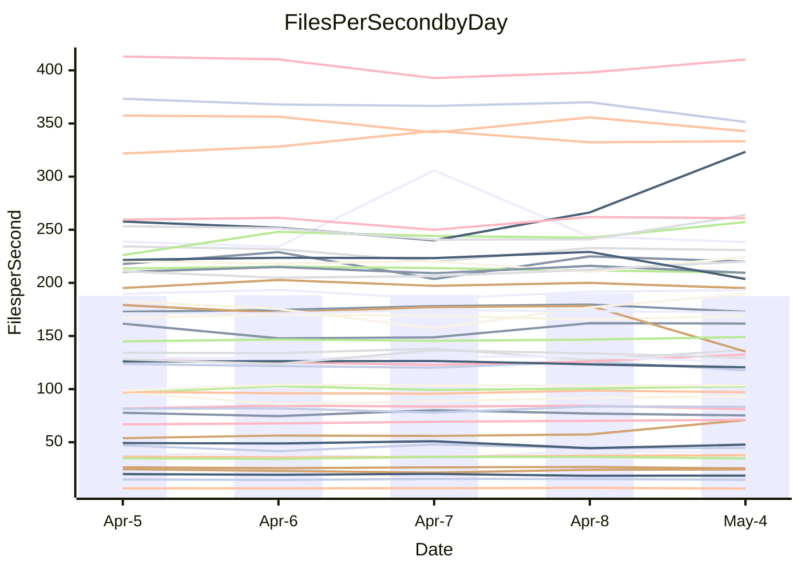

<!---
# This file is auto-generated. Do not edit.
# cspell:disable
--->
# Performance Report

Daily Performance

```mermaid
xychart-beta
    title Files Per Second by Day
    y-axis Files per Second
    x-axis Date [Apr-5, Apr-6, Apr-7, Apr-8, May-4]
    bar [187.81, 188.42, 188.59, 189.84, 187.47]
    line [161.59, 147.84, 148.71, 162.06, 161.69]
    line [6.57, 6.61, 6.73, 7.00, 6.40]
    line [234.26, 231.70, 219.86, 232.88, 230.80]
    line [96.40, 102.92, 99.21, 100.52, 102.60]
    line [24.56, 23.07, 21.40, 24.14, 24.44]
    line [123.74, 121.73, 120.16, 125.96, 117.80]
    line [81.81, 84.38, 83.54, 84.32, 81.09]
    line [20.02, 19.41, 20.18, 18.41, 18.63]
    line [97.23, 85.82, 88.62, 91.77, 93.23]
    line [238.81, 234.08, 305.83, 243.57, 238.37]
    line [77.73, 74.56, 80.16, 77.02, 75.26]
    line [97.44, 96.14, 95.65, 98.60, 97.04]
    line [134.19, 133.87, 138.14, 127.32, 136.94]
    line [226.17, 248.01, 244.17, 242.46, 257.25]
    line [53.82, 56.32, 55.94, 57.36, 70.98]
    line [14.95, 14.57, 15.50, 15.41, 14.68]
    line [127.91, 125.16, 122.83, 125.98, 132.65]
    line [257.73, 251.87, 240.02, 266.31, 323.33]
    line [166.95, 170.01, 169.14, 165.39, 168.99]
    line [38.93, 38.36, 35.23, 41.88, 40.18]
    line [217.73, 228.96, 203.68, 224.92, 220.04]
    line [36.40, 35.82, 36.18, 37.44, 37.77]
    line [253.34, 251.40, 240.71, 240.89, 263.78]
    line [213.52, 215.27, 213.92, 211.68, 209.62]
    line [26.46, 25.57, 26.37, 26.75, 25.39]
    line [47.13, 41.53, 47.88, 44.28, 44.62]
    line [66.87, 67.74, 69.26, 70.15, 71.14]
    line [126.05, 126.20, 126.46, 123.33, 120.53]
    line [220.41, 218.02, 220.27, 210.30, 224.37]
    line [129.75, 128.69, 130.72, 130.46, 125.38]
    line [172.81, 174.46, 178.10, 179.62, 172.72]
    line [357.50, 356.42, 341.55, 355.72, 342.75]
    line [128.14, 123.76, 136.62, 133.64, 129.52]
    line [34.80, 34.26, 36.10, 36.17, 34.78]
    line [179.11, 171.90, 177.30, 178.37, 135.30]
    line [81.46, 81.94, 77.93, 83.70, 83.36]
    line [259.51, 261.27, 249.89, 261.98, 260.90]
    line [49.22, 48.87, 50.93, 44.38, 47.76]
    line [182.89, 175.34, 157.18, 176.94, 189.57]
    line [171.27, 171.33, 174.25, 173.31, 172.19]
    line [210.20, 214.91, 209.11, 216.00, 209.47]
    line [321.72, 328.23, 343.02, 332.37, 333.23]
    line [210.95, 204.79, 206.43, 212.35, 220.16]
    line [144.90, 146.68, 145.47, 146.56, 149.08]
    line [195.13, 202.74, 197.17, 200.02, 195.02]
    line [373.30, 367.91, 366.55, 370.00, 351.49]
    line [413.02, 410.36, 392.72, 397.99, 410.28]
    line [221.62, 223.63, 223.28, 229.16, 203.64]
    line [98.55, 104.22, 103.59, 103.12, 103.61]
    line [189.55, 193.41, 185.15, 191.53, 193.36]
```

Time to Process Files

| Repository                                      | Elapsed | Min/Avg/Max           |   SD | SD Graph                |
| ----------------------------------------------- | ------: | :-------------------: | ---: | ----------------------- |
| AdaDoom3/AdaDoom3                    |    2.73 | 2.8 /   2.8 /   3.0   | 0.06 | `    ┣●━┻━━╋━━┻━━┫    ` |
| alexiosc/megistos                    |    7.19 | 6.8 /   7.0 /   7.3   | 0.16 | `    ┣━━┻━━╋━━●━━┫    ` |
| apollographql/apollo-server          |    2.49 | 2.4 /   2.6 /   2.9   | 0.14 | `    ┣━━┻●━╋━━┻━━┫    ` |
| aspnetboilerplate/aspnetboilerplate  |    8.76 | 8.7 /   8.8 /   9.1   | 0.17 | `    ┣━━┻━●╋━━┻━━┫    ` |
| aws-amplify/docs                     |   12.41 | 9.6 /  12.0 /  12.9   | 0.95 | `   ┣━━┻━━━╋━●━┻━━┫   ` |
| Azure/azure-rest-api-specs           |    9.45 | 9.4 /  10.0 /  10.3   | 0.30 | `   ┣●━━┻━━╋━━┻━━━┫   ` |
| bitjson/typescript-starter           |    1.07 | 0.9 /   1.0 /   1.1   | 0.04 | `     ┣━┻━━╋━━┻●┫     ` |
| caddyserver/caddy                    |    3.34 | 2.6 /   3.3 /   3.7   | 0.29 | `    ┣━━┻━━●━━┻━━┫    ` |
| canada-ca/open-source-logiciel-libre |    1.09 | 1.0 /   1.1 /   1.1   | 0.04 | `     ┣━┻━━╋━━●━┫     ` |
| chef/chef                            |    5.06 | 5.2 /   5.4 /   5.6   | 0.14 | `   ●┣━━┻━━╋━━┻━━┫    ` |
| dart-lang/sdk                        |   58.29 | 54.7 /  56.5 /  61.5  | 2.04 | `  ┣━━━┻━━━╋━━━●━━━┫  ` |
| django/django                        |   13.20 | 13.4 /  13.9 /  14.5  | 0.33 | `   ●━━━┻━━╋━━┻━━━┫   ` |
| eslint/eslint                        |    9.87 | 9.5 /   9.7 /  10.2   | 0.23 | `    ┣━━┻━━╋━●┻━━┫    ` |
| exonum/exonum                        |    3.49 | 3.3 /   3.3 /   3.4   | 0.04 | `     ┣━┻━━╋━━┻━┫    ●` |
| flutter/samples                      |   12.53 | 13.7 /  14.1 /  14.7  | 0.28 | `●     ┣━┻━╋━┻━┫      ` |
| gitbucket/gitbucket                  |    3.20 | 3.0 /   3.2 /   3.6   | 0.18 | `    ┣━━┻━━●━━┻━━┫    ` |
| googleapis/google-cloud-cpp          |  121.53 | 119.1 / 121.0 / 123.8 | 1.49 | `  ┣━━━┻━━━╋●━━┻━━━┫  ` |
| graphql/express-graphql              |    1.06 | 1.0 /   1.1 /   1.3   | 0.09 | `    ┣━━┻━●╋━━┻━━┫    ` |
| graphql/graphql-js                   |    2.71 | 2.7 /   2.8 /   2.9   | 0.09 | `    ┣━━┻●━╋━━┻━━┫    ` |
| graphql/graphql-relay-js             |    1.10 | 1.0 /   1.1 /   1.1   | 0.03 | `     ┣━┻━━╋━━●━┫     ` |
| graphql/graphql-spec                 |    1.29 | 1.2 /   1.3 /   1.4   | 0.06 | `    ┣━━┻━━╋●━┻━━┫    ` |
| iluwatar/java-design-patterns        |   11.93 | 11.5 /  11.8 /  12.2  | 0.25 | `   ┣━━━┻━━╋━●┻━━━┫   ` |
| ktaranov/sqlserver-kit               |    5.88 | 5.6 /   6.0 /   6.4   | 0.23 | `    ┣━━┻●━╋━━┻━━┫    ` |
| liriliri/licia                       |    4.09 | 3.8 /   3.9 /   4.0   | 0.07 | `    ┣━━┻━━╋━━┻━━┫  ● ` |
| MartinThoma/LaTeX-examples           |    6.10 | 5.7 /   6.1 /   6.4   | 0.19 | `    ┣━━┻━━●━━┻━━┫    ` |
| mdx-js/mdx                           |    1.86 | 1.7 /   1.8 /   2.0   | 0.09 | `    ┣━━┻━━╋●━┻━━┫    ` |
| microsoft/TypeScript-Website         |    5.13 | 5.0 /   5.2 /   5.6   | 0.16 | `    ┣━━┻━●╋━━┻━━┫    ` |
| MicrosoftDocs/PowerShell-Docs        |   24.92 | 19.9 /  20.4 /  21.6  | 0.52 | `        ┣┻╋┻┫       ●` |
| neovim/nvim-lspconfig                |    5.05 | 4.9 /   5.0 /   5.2   | 0.11 | `    ┣━━┻━━╋●━┻━━┫    ` |
| pagekit/pagekit                      |    3.30 | 3.3 /   3.4 /   3.5   | 0.06 | `    ┣━●┻━━╋━━┻━━┫    ` |
| php/php-src                          |   23.60 | 23.0 /  23.5 /  24.0  | 0.34 | `   ┣━━━┻━━╋━●┻━━━┫   ` |
| plasticrake/tplink-smarthome-api     |    1.30 | 1.2 /   1.3 /   1.4   | 0.06 | `    ┣━━┻━━╋●━┻━━┫    ` |
| prettier/prettier                    |    7.80 | 7.4 /   7.5 /   7.8   | 0.13 | `    ┣━━┻━━╋━━┻━━┫●   ` |
| pycontribs/jira                      |    1.13 | 1.4 /   1.4 /   1.6   | 0.06 | `●     ┣━┻━╋━┻━┫      ` |
| RustPython/RustPython                |    6.69 | 6.1 /   6.2 /   6.4   | 0.09 | `      ┣━┻━╋━┻━┫     ●` |
| shoelace-style/shoelace              |    2.72 | 2.6 /   2.8 /   3.1   | 0.13 | `    ┣━━┻●━╋━━┻━━┫    ` |
| slint-ui/slint                       |   14.11 | 13.0 /  13.4 /  13.6  | 0.19 | `    ┣━━┻━━╋━━┻━━┫   ●` |
| SoftwareBrothers/admin-bro           |    2.33 | 2.3 /   2.5 /   2.8   | 0.13 | `    ┣━●┻━━╋━━┻━━┫    ` |
| sveltejs/svelte                      |   21.31 | 20.6 /  21.3 /  22.1  | 0.52 | `   ┣━━┻━━━●━━━┻━━┫   ` |
| TheAlgorithms/Python                 |    4.35 | 5.3 /   5.5 /   5.9   | 0.19 | `●      ┣┻━╋━┻┫       ` |
| twbs/bootstrap                       |    1.66 | 1.7 /   1.7 /   1.9   | 0.07 | `    ┣━━●━━╋━━┻━━┫    ` |
| typescript-cheatsheets/react         |    1.32 | 1.3 /   1.4 /   1.5   | 0.08 | `    ┣━━┻●━╋━━┻━━┫    ` |
| typescript-eslint/typescript-eslint  |    3.97 | 3.9 /   4.0 /   4.2   | 0.11 | `    ┣━━┻●━╋━━┻━━┫    ` |
| vitest-dev/vitest                    |   10.34 | 10.3 /  11.1 /  13.3  | 0.87 | `   ┣━━┻●━━╋━━━┻━━┫   ` |
| w3c/aria-practices                   |    3.12 | 3.1 /   3.3 /   3.5   | 0.11 | `    ┣━●┻━━╋━━┻━━┫    ` |
| w3c/specberus                        |    1.90 | 1.8 /   2.0 /   2.1   | 0.08 | `    ┣━━┻●━╋━━┻━━┫    ` |
| webdeveric/webpack-assets-manifest   |    1.23 | 1.1 /   1.2 /   1.3   | 0.07 | `    ┣━━┻━━╋●━┻━━┫    ` |
| webpack/webpack                      |    5.26 | 5.0 /   5.2 /   5.6   | 0.25 | `    ┣━━┻━━●━━┻━━┫    ` |
| wireapp/wire-desktop                 |    1.29 | 1.2 /   1.3 /   1.3   | 0.04 | `     ┣━┻━━╋●━┻━┫     ` |
| wireapp/wire-webapp                  |   11.51 | 11.0 /  11.3 /  12.1  | 0.40 | `   ┣━━━┻━━╋●━┻━━━┫   ` |

Note:
- Elapsed time is in seconds.

Files per Second over Time

| Repository                                      | Files |    Sec |    Fps |     Rel | Trend Fps   |    N |
| ----------------------------------------------- | ----: | -----: | -----: | ------: | ----------- | ---: |
| AdaDoom3/AdaDoom3                    |   103 |   2.73 |  37.77 |   3.88% | `▇▇▆▆▇▅▆██` |    8 |
| alexiosc/megistos                    |   583 |   7.19 |  81.09 |  -2.28% | `▅▅▇▇▇█▇▇▆` |    8 |
| apollographql/apollo-server          |   255 |   2.49 | 102.60 |   3.74% | `▇▄▃▇▆█▆▇▇` |    8 |
| aspnetboilerplate/aspnetboilerplate  |  2286 |   8.76 | 260.90 |   0.71% | `▆█████▅██` |    8 |
| aws-amplify/docs                     |  2959 |  12.41 | 238.37 |  -3.34% | `▃▃▃▃▂▃█▃▃` |    8 |
| Azure/azure-rest-api-specs           |  2493 |   9.45 | 263.78 |   5.63% | `▅▆▆█▇▅▄▄█` |    8 |
| bitjson/typescript-starter           |    20 |   1.07 |  18.63 |  -5.37% | `█▆▅▅▆▄▆▃▄` |    8 |
| caddyserver/caddy                    |   311 |   3.34 |  93.23 |   0.66% | `▄█▄▃▃▂▃▄▄` |    8 |
| canada-ca/open-source-logiciel-libre |     7 |   1.09 |   6.40 |  -3.80% | `▇▇▄▆▆▆▇█▅` |    8 |
| chef/chef                            |  1030 |   5.06 | 203.64 |  -8.79% | `▅▇▅▇▅█▆█▂` |    8 |
| dart-lang/sdk                        | 11367 |  58.29 | 195.02 |  -1.46% | `▆█▇▄██▇▇▆` |    8 |
| django/django                        |  2906 |  13.20 | 220.16 |   5.33% | `▆▅▇▇▆▄▆▇█` |    8 |
| eslint/eslint                        |  2068 |   9.87 | 209.47 |  -1.18% | `█▅▇▇██▆█▇` |    8 |
| exonum/exonum                        |   421 |   3.49 | 120.53 |  -4.19% | `▇█▇█▇██▆▅` |    8 |
| flutter/samples                      |  1695 |  12.53 | 135.30 | -23.56% | `▇▇▇█▅▆▇▇ ` |    8 |
| gitbucket/gitbucket                  |   415 |   3.20 | 129.52 |   0.56% | `▆▅▇▇▃▇█▇▆` |    8 |
| googleapis/google-cloud-cpp          | 20926 | 121.53 | 172.19 |   0.16% | `▇▇▇██▆██▇` |    8 |
| graphql/express-graphql              |    26 |   1.06 |  24.44 |   2.96% | `▇▇█▆▂█▄▆▇` |    8 |
| graphql/graphql-js                   |   371 |   2.71 | 136.94 |   2.39% | `▅█▅▇▅██▄▇` |    8 |
| graphql/graphql-relay-js             |    28 |   1.10 |  25.39 |  -3.33% | `▅▇██▆▅▇▇▅` |    8 |
| graphql/graphql-spec                 |    19 |   1.29 |  14.68 |  -1.99% | `▆▇█▃▅▆▇▇▆` |    8 |
| iluwatar/java-design-patterns        |  2061 |  11.93 | 172.72 |  -1.16% | `▅▇▇▆▇▇██▆` |    8 |
| ktaranov/sqlserver-kit               |   490 |   5.88 |  83.36 |   2.38% | `▆█▄▆▆▆▄▇▇` |    8 |
| liriliri/licia                       |  1437 |   4.09 | 351.49 |  -5.18% | `██▅▇▆▆▆▇▄` |    8 |
| MartinThoma/LaTeX-examples           |  1409 |   6.10 | 230.80 |  -0.37% | `▅█▆▇▆▆▄▆▆` |    8 |
| mdx-js/mdx                           |   140 |   1.86 |  75.26 |  -2.45% | `█▇▄█▆▄▇▆▅` |    8 |
| microsoft/TypeScript-Website         |   765 |   5.13 | 149.08 |   2.37% | `█▄▆██▇▇▇█` |    8 |
| MicrosoftDocs/PowerShell-Docs        |  3125 |  24.92 | 125.38 |  -3.32% | `███▅▇▆▇▇▆` |    8 |
| neovim/nvim-lspconfig                |   853 |   5.05 | 168.99 |   0.71% | `▇▇▅▇▇█▇▆▇` |    8 |
| pagekit/pagekit                      |   741 |   3.30 | 224.37 |   2.67% | `█▇▇█▇▇▇▅█` |    8 |
| php/php-src                          |  2290 |  23.60 |  97.04 |   0.00% | `█▇▇█▇▆▆█▇` |    8 |
| plasticrake/tplink-smarthome-api     |    62 |   1.30 |  47.76 |  -2.02% | `█▇▇▆▅██▄▆` |    8 |
| prettier/prettier                    |  2674 |   7.80 | 342.75 |  -3.45% | `██▇▇▇█▅▇▅` |    8 |
| pycontribs/jira                      |    80 |   1.13 |  70.98 |  28.70% | `▄▂▃▃▄▄▄▄█` |    8 |
| RustPython/RustPython                |   788 |   6.69 | 117.80 |  -4.28% | `▇▇█▇▇▆▆█▅` |    8 |
| shoelace-style/shoelace              |   440 |   2.72 | 161.69 |   3.25% | `▇▆█▇▅▃▅▇▇` |    8 |
| slint-ui/slint                       |  2957 |  14.11 | 209.62 |  -1.95% | `▆█▆▆█▆▇▆▆` |    8 |
| SoftwareBrothers/admin-bro           |   441 |   2.33 | 189.57 |   7.07% | `██▆▆▆▅▃▆█` |    8 |
| sveltejs/svelte                      |  8742 |  21.31 | 410.28 |   0.57% | `▆█▇██▆▅▆▇` |    8 |
| TheAlgorithms/Python                 |  1407 |   4.35 | 323.33 |  26.73% | `▄▄▃▄▃▃▂▄█` |    8 |
| twbs/bootstrap                       |   118 |   1.66 |  71.14 |   4.93% | `▆▄█▆▇▆▇██` |    8 |
| typescript-cheatsheets/react         |    53 |   1.32 |  40.18 |   3.82% | `▇▆▇▄▆▅▃█▇` |    8 |
| typescript-eslint/typescript-eslint  |  1323 |   3.97 | 333.23 |   1.80% | `▄▅▅▇▆▆█▇▇` |    8 |
| vitest-dev/vitest                    |  2661 |  10.34 | 257.25 |   9.04% | `▇▆▆▂▇█▇▇█` |    8 |
| w3c/aria-practices                   |   414 |   3.12 | 132.65 |   4.99% | `██▄▇▇▅▅▆█` |    8 |
| w3c/specberus                        |   197 |   1.90 | 103.61 |   2.41% | `▇▆▄▄▆█▇▇▇` |    8 |
| webdeveric/webpack-assets-manifest   |    55 |   1.23 |  44.62 |  -1.87% | `▇█▆█▃▄█▅▆` |    8 |
| webpack/webpack                      |  1158 |   5.26 | 220.04 |   0.16% | `▄▇█▅▇█▄▇▆` |    8 |
| wireapp/wire-desktop                 |    45 |   1.29 |  34.78 |  -0.63% | `▅▇▆▇▅▇██▆` |    8 |
| wireapp/wire-webapp                  |  2226 |  11.51 | 193.36 |   1.65% | `▇▇▄█▇█▆▇▇` |    8 |

Data Throughput

| Repository                                      | Files |    Sec |     Kps |     Rel | Trend Kps   |    N |
| ----------------------------------------------- | ----: | -----: | ------: | ------: | ----------- | ---: |
| AdaDoom3/AdaDoom3                    |   103 |   2.73 |  802.63 |   3.88% | `▇▇▆▆▇▅▆██` |    8 |
| alexiosc/megistos                    |   583 |   7.19 |  637.19 |  -2.28% | `▅▅▇▇▇█▇▇▆` |    8 |
| apollographql/apollo-server          |   255 |   2.49 |  847.36 |   3.83% | `▇▄▃▇▆█▆▇▇` |    8 |
| aspnetboilerplate/aspnetboilerplate  |  2286 |   8.76 |  634.80 |   0.71% | `▆█████▅██` |    8 |
| aws-amplify/docs                     |  2959 |  12.41 |  860.82 |  -0.73% | `▃▃▃▃▂▃█▃▄` |    8 |
| Azure/azure-rest-api-specs           |  2493 |   9.45 |  787.73 |   7.06% | `▅▆▅█▆▅▄▄█` |    8 |
| bitjson/typescript-starter           |    20 |   1.07 |   74.50 |  -5.37% | `█▆▅▅▆▄▆▃▄` |    8 |
| caddyserver/caddy                    |   311 |   3.34 |  834.61 |   1.13% | `▄█▄▃▃▂▃▄▄` |    8 |
| canada-ca/open-source-logiciel-libre |     7 |   1.09 |   53.03 |  -3.80% | `▇▇▄▆▆▆▇█▅` |    8 |
| chef/chef                            |  1030 |   5.06 |  994.46 |  -5.10% | `▅▇▅▇▅█▆█▄` |    8 |
| dart-lang/sdk                        | 11367 |  58.29 | 1331.93 |  -0.45% | `▆█▇▄██▇▇▇` |    8 |
| django/django                        |  2906 |  13.20 | 1402.00 |   5.85% | `▆▅▇▇▆▄▅▇█` |    8 |
| eslint/eslint                        |  2068 |   9.87 | 1456.90 |  -1.04% | `█▅▇▇██▆█▇` |    8 |
| exonum/exonum                        |   421 |   3.49 | 1152.92 |  -4.19% | `▇█▇█▇██▆▅` |    8 |
| flutter/samples                      |  1695 |  12.53 |  809.80 | -46.93% | `▇▇▇█▅▆▇▇ ` |    8 |
| gitbucket/gitbucket                  |   415 |   3.20 |  600.79 |   0.86% | `▆▅▇▇▃▇█▇▇` |    8 |
| googleapis/google-cloud-cpp          | 20926 | 121.53 | 1469.56 |   1.02% | `▇▇▇██▆███` |    8 |
| graphql/express-graphql              |    26 |   1.06 |  111.88 |   2.96% | `▇▇█▆▂█▄▆▇` |    8 |
| graphql/graphql-js                   |   371 |   2.71 |  811.32 |   3.52% | `▅█▅▇▅██▄█` |    8 |
| graphql/graphql-relay-js             |    28 |   1.10 |   99.73 |  -3.33% | `▅▇██▆▅▇▇▅` |    8 |
| graphql/graphql-spec                 |    19 |   1.29 |  489.90 |  -1.99% | `▆▇█▃▅▆▇▇▆` |    8 |
| iluwatar/java-design-patterns        |  2061 |  11.93 |  532.40 |  -1.14% | `▅▇▇▆▇▇██▆` |    8 |
| ktaranov/sqlserver-kit               |   490 |   5.88 | 1262.79 |   2.38% | `▆█▄▆▆▆▄▇▇` |    8 |
| liriliri/licia                       |  1437 |   4.09 |  418.76 |  -5.18% | `██▅▇▆▆▆▇▄` |    8 |
| MartinThoma/LaTeX-examples           |  1409 |   6.10 |  476.66 |  -0.37% | `▅█▆▇▆▆▄▆▆` |    8 |
| mdx-js/mdx                           |   140 |   1.86 |  352.63 |  -2.30% | `█▇▄█▆▄▇▆▅` |    8 |
| microsoft/TypeScript-Website         |   765 |   5.13 | 1026.83 |   1.88% | `█▄▆██▇▇▇█` |    8 |
| MicrosoftDocs/PowerShell-Docs        |  3125 |  24.92 | 1337.61 |  -1.52% | `███▅▇▆▇▇▆` |    8 |
| neovim/nvim-lspconfig                |   853 |   5.05 |  493.11 |   9.05% | `▆▆▄▅▅▆▅▅█` |    8 |
| pagekit/pagekit                      |   741 |   3.30 |  467.83 |   2.67% | `█▇▇█▇▇▇▅█` |    8 |
| php/php-src                          |  2290 |  23.60 | 1705.64 |   0.72% | `█▇▇█▇▆▆█▇` |    8 |
| plasticrake/tplink-smarthome-api     |    62 |   1.30 |  258.04 |  -2.02% | `█▇▇▆▅██▄▆` |    8 |
| prettier/prettier                    |  2674 |   7.80 |  470.68 |  -3.56% | `██▇▇▇█▅▇▅` |    8 |
| pycontribs/jira                      |    80 |   1.13 |  501.27 |  28.22% | `▄▂▃▃▄▄▄▄█` |    8 |
| RustPython/RustPython                |   788 |   6.69 | 1879.83 |  -2.72% | `▇▇▇▇▇▆▆█▅` |    8 |
| shoelace-style/shoelace              |   440 |   2.72 |  780.50 |   3.25% | `▇▆█▇▅▃▅▇▇` |    8 |
| slint-ui/slint                       |  2957 |  14.11 | 1307.61 |  -2.05% | `▆█▆▆█▆▇▆▆` |    8 |
| SoftwareBrothers/admin-bro           |   441 |   2.33 |  417.82 |   7.07% | `██▆▆▆▅▃▆█` |    8 |
| sveltejs/svelte                      |  8742 |  21.31 |  278.40 |   0.63% | `▆█▇██▆▅▆▇` |    8 |
| TheAlgorithms/Python                 |  1407 |   4.35 |  825.67 |  26.73% | `▄▄▃▄▃▃▂▄█` |    8 |
| twbs/bootstrap                       |   118 |   1.66 |  584.19 |   4.93% | `▆▄█▆▇▆▇██` |    8 |
| typescript-cheatsheets/react         |    53 |   1.32 |  297.90 |   3.82% | `▇▆▇▄▆▅▃█▇` |    8 |
| typescript-eslint/typescript-eslint  |  1323 |   3.97 | 1802.15 |   4.58% | `▅▅▅▇▆▆█▇█` |    8 |
| vitest-dev/vitest                    |  2661 |  10.34 |  812.44 |  12.71% | `▆▅▅▂▆▇▆▆█` |    8 |
| w3c/aria-practices                   |   414 |   3.12 | 1239.31 |   5.01% | `██▄▇▇▅▅▆█` |    8 |
| w3c/specberus                        |   197 |   1.90 |  339.21 |   1.78% | `▇▆▄▄▆█▇▇▇` |    8 |
| webdeveric/webpack-assets-manifest   |    55 |   1.23 |  102.21 |  -1.87% | `▇█▆█▃▄█▅▆` |    8 |
| webpack/webpack                      |  1158 |   5.26 | 1072.06 |   3.81% | `▄▇▇▅▇█▄▇█` |    8 |
| wireapp/wire-desktop                 |    45 |   1.29 |  153.03 |  -0.63% | `▅▇▆▇▅▇██▆` |    8 |
| wireapp/wire-webapp                  |  2226 |  11.51 |  796.35 |   4.50% | `▇▇▄▇▆█▆▇█` |    8 |

