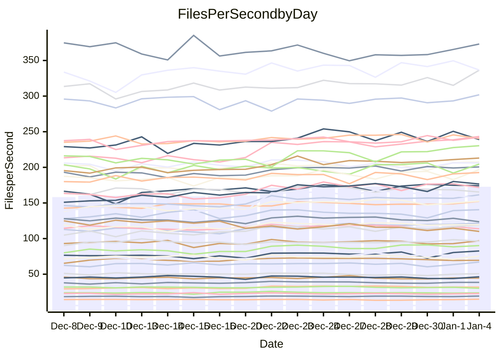

<!---
# This file is auto-generated. Do not edit.
# cspell:disable
--->
# Performance Report

Daily Performance

```mermaid
xychart-beta
    title Files Per Second by Day
    y-axis Files per Second
    x-axis Date [Dec-8, Dec-9, Dec-10, Dec-13, Dec-14, Dec-15, Dec-16, Dec-20, Dec-22, Dec-23, Dec-24, Dec-27, Dec-28, Dec-29, Dec-30, Jan-1, Jan-4]
    bar [158.24, 160.26, 160.13, 162.46, 160.30, 159.32, 159.99, 160.32, 171.41, 173.30, 173.54, 170.88, 173.10, 172.87, 170.63, 172.55, 172.76]
    line [18.49, 18.92, 19.04, 18.41, 18.71, 17.35, 18.44, 18.66, 19.39, 19.24, 18.95, 18.61, 19.20, 19.16, 18.64, 18.56, 19.30]
    line [142.70, 144.08, 143.97, 142.44, 148.72, 148.74, 148.66, 145.81, 145.83, 151.65, 150.82, 149.41, 147.54, 148.32, 148.24, 148.81, 152.37]
    line [51.18, 48.94, 51.93, 50.78, 49.91, 50.66, 50.34, 50.02, 51.61, 51.21, 51.38, 49.64, 48.60, 49.52, 48.09, 50.03, 50.79]
    line [23.99, 23.97, 23.56, 24.27, 23.97, 21.89, 24.77, 24.75, 25.98, 24.78, 24.02, 24.07, 23.90, 24.05, 23.79, 23.47, 23.82]
    line [93.03, 94.71, 95.93, 94.05, 97.42, 87.40, 93.20, 92.02, 98.77, 95.06, 94.41, 95.55, 97.07, 96.22, 92.57, 92.92, 96.98]
    line [112.86, 110.11, 114.79, 114.58, 111.22, 109.33, 106.79, 113.91, 116.30, 113.89, 119.27, 121.25, 119.32, 118.60, 119.88, 120.18, 121.63]
    line [114.43, 117.93, 116.17, 113.85, 113.19, 111.86, 113.23, 116.22, 119.95, 116.76, 117.75, 118.71, 118.58, 117.32, 112.42, 116.77, 113.73]
    line [166.49, 162.27, 148.64, 164.74, 167.10, 169.90, 168.25, 171.20, 165.98, 169.49, 175.43, 173.51, 166.13, 173.69, 176.28, 174.86, 174.24]
    line [202.32, 202.37, 184.12, 199.02, 199.50, 195.58, 198.56, 202.04, 205.76, 202.04, 203.32, 201.04, 202.44, 203.10, 195.80, 206.74, 207.35]
    line [206.03, 204.37, 194.91, 205.14, 200.36, 207.64, 202.85, 200.31, 210.29, 210.04, 207.76, 200.78, 205.77, 199.55, 199.57, 206.34, 206.13]
    line [193.15, 186.55, 193.19, 192.23, 185.43, 191.26, 188.26, 189.10, 196.56, 199.42, 199.83, 198.90, 201.82, 194.83, 201.20, 199.08, 200.62]
    line [29.50, 29.81, 30.70, 31.34, 29.78, 30.86, 29.89, 30.20, 33.22, 32.90, 33.40, 32.96, 33.38, 32.90, 31.64, 32.05, 31.85]
    line [313.58, 317.30, 295.96, 306.54, 308.67, 318.29, 308.47, 312.68, 311.01, 311.87, 322.19, 317.56, 317.24, 315.38, 325.99, 315.10, 336.38]
    line [203.69, 197.75, 183.65, 201.42, 192.31, 202.71, 196.90, 201.49, 199.06, 199.67, 194.62, 190.28, 203.79, 203.98, 206.16, 191.99, 204.56]
    line [65.32, 69.78, 72.32, 70.99, 69.49, 68.20, 68.29, 71.18, 72.28, 72.81, 72.16, 72.22, 72.29, 71.63, 70.43, 69.31, 69.51]
    line [127.82, 130.48, 134.87, 129.94, 136.83, 140.59, 128.00, 132.13, 140.04, 140.36, 136.98, 135.57, 135.50, 134.25, 129.01, 139.25, 140.58]
    line [213.42, 215.72, 212.77, 206.57, 216.35, 210.81, 207.51, 213.81, 235.09, 232.12, 236.13, 235.71, 228.72, 232.65, 236.79, 238.66, 243.31]
    line [76.65, 75.94, 76.12, 76.57, 75.62, 71.86, 75.70, 72.52, 79.52, 79.75, 79.57, 78.19, 78.53, 81.17, 72.47, 80.44, 82.66]
    line [187.46, 185.27, 181.05, 182.93, 185.74, 173.94, 185.68, 184.19, 188.28, 188.11, 196.54, 189.53, 183.55, 193.13, 194.30, 182.73, 196.88]
    line [70.99, 71.64, 73.38, 70.10, 71.99, 68.96, 71.11, 72.00, 74.62, 76.21, 75.66, 76.28, 80.16, 75.45, 77.29, 76.83, 73.79]
    line [128.02, 124.91, 128.75, 126.25, 125.99, 122.54, 125.77, 120.95, 129.07, 131.35, 128.71, 129.73, 130.21, 126.25, 125.32, 128.46, 123.55]
    line [14.37, 14.53, 14.61, 14.25, 14.42, 14.66, 14.20, 14.14, 14.58, 14.66, 13.81, 14.51, 13.39, 13.58, 14.12, 14.33, 14.91]
    line [104.81, 110.68, 102.65, 110.81, 107.51, 105.11, 109.29, 110.23, 118.20, 116.66, 113.51, 116.56, 110.18, 116.43, 113.57, 116.81, 119.02]
    line [80.02, 85.30, 82.71, 84.32, 82.91, 77.95, 81.87, 81.89, 89.30, 90.84, 89.17, 86.07, 86.04, 90.94, 91.20, 88.38, 90.21]
    line [195.46, 191.88, 199.25, 200.18, 192.55, 195.85, 196.96, 197.31, 203.68, 215.88, 203.82, 209.47, 208.55, 206.80, 208.32, 210.94, 213.05]
    line [146.38, 144.41, 148.76, 149.26, 148.44, 146.25, 144.57, 148.51, 160.26, 155.20, 157.30, 154.76, 157.76, 156.45, 156.97, 156.48, 161.47]
    line [22.93, 23.26, 21.71, 22.48, 22.26, 24.16, 21.86, 22.99, 23.86, 22.95, 22.15, 22.59, 22.93, 22.71, 21.96, 22.43, 22.83]
    line [229.14, 227.27, 231.37, 242.80, 219.56, 233.62, 231.32, 236.32, 236.26, 240.94, 253.96, 249.85, 237.45, 249.30, 236.26, 250.59, 238.99]
    line [119.17, 112.82, 116.99, 116.61, 109.61, 115.93, 113.66, 115.36, 122.68, 121.26, 119.81, 119.36, 122.21, 121.33, 118.71, 119.46, 119.43]
    line [333.69, 321.17, 305.21, 329.78, 336.28, 339.96, 335.03, 330.81, 346.52, 335.23, 343.48, 342.97, 326.49, 346.96, 341.41, 349.59, 336.61]
    line [37.87, 36.13, 38.10, 36.47, 38.38, 37.81, 37.32, 38.13, 39.99, 39.24, 39.22, 39.13, 37.99, 37.43, 37.30, 38.53, 38.49]
    line [235.13, 236.77, 244.11, 232.83, 233.41, 237.39, 235.87, 236.73, 241.85, 239.59, 240.67, 245.15, 245.04, 246.20, 235.52, 245.54, 240.52]
    line [164.08, 161.66, 171.02, 169.99, 161.97, 169.28, 168.79, 164.45, 163.90, 173.08, 173.52, 171.67, 165.07, 170.82, 168.89, 168.46, 165.37]
    line [31.99, 31.99, 30.84, 32.08, 31.89, 31.67, 31.01, 31.00, 31.79, 31.95, 32.72, 33.00, 31.56, 31.04, 31.19, 31.58, 30.23]
    line [124.96, 118.90, 125.77, 122.50, 124.97, 121.63, 124.44, 114.40, 117.66, 113.42, 116.57, 120.86, 116.04, 115.61, 111.25, 114.64, 110.01]
    line [295.84, 293.27, 283.38, 296.25, 298.40, 299.27, 280.90, 293.45, 278.89, 296.00, 294.23, 289.77, 295.71, 297.33, 290.64, 293.31, 301.85]
    line [163.37, 162.01, 157.69, 162.41, 162.92, 155.61, 157.24, 162.25, 174.81, 169.46, 179.44, 172.82, 176.92, 167.34, 176.43, 176.94, 171.67]
    line [150.95, 152.99, 153.72, 160.91, 157.90, 164.74, 161.04, 164.69, 164.20, 175.57, 172.74, 173.87, 177.24, 172.99, 166.08, 180.17, 176.64]
    line [71.59, 73.55, 75.54, 73.95, 75.07, 76.77, 72.26, 69.84, 77.03, 74.27, 74.27, 73.83, 75.96, 75.41, 73.52, 70.94, 75.34]
    line [6.00, 6.03, 6.11, 5.69, 6.12, 5.85, 6.27, 5.94, 6.19, 6.23, 6.06, 5.80, 6.19, 6.04, 6.09, 6.29, 6.04]
    line [374.69, 369.34, 374.83, 359.05, 350.76, 385.22, 356.23, 361.41, 363.52, 371.74, 360.07, 349.58, 358.00, 357.09, 358.22, 365.46, 373.09]
    line [179.95, 179.31, 188.38, 180.77, 185.77, 186.35, 184.33, 182.33, 191.53, 189.75, 189.98, 177.07, 192.83, 190.79, 182.79, 190.84, 192.65]
    line [90.09, 95.39, 94.62, 99.56, 95.79, 93.99, 95.03, 91.66, 95.50, 94.32, 94.29, 94.73, 94.34, 95.29, 95.11, 98.41, 96.39]
    line [216.21, 215.29, 206.31, 212.61, 210.51, 204.56, 210.18, 211.34, 200.66, 223.22, 223.16, 220.54, 207.84, 221.69, 222.09, 227.69, 230.34]
    line [46.02, 43.67, 43.68, 45.02, 45.75, 43.43, 44.94, 44.85, 45.35, 43.98, 45.75, 48.03, 44.47, 43.53, 43.39, 44.67, 44.59]
    line [62.39, 60.36, 64.84, 65.11, 62.93, 65.98, 63.02, 64.70, 64.39, 64.92, 64.92, 65.76, 63.97, 65.18, 60.36, 63.48, 67.10]
    line [237.38, 239.25, 224.99, 230.85, 236.16, 237.46, 237.06, 237.81, 238.36, 240.26, 242.42, 235.97, 234.05, 235.94, 244.60, 237.90, 242.20]
    line [44.87, 45.90, 44.67, 46.00, 48.05, 47.07, 45.85, 42.75, 47.52, 47.21, 45.81, 45.88, 45.34, 46.09, 44.04, 43.96, 46.33]
    line [138.09, 144.82, 146.07, 144.49, 139.02, 141.78, 142.36, 140.50, 151.95, 150.33, 152.02, 150.72, 154.90, 153.82, 147.24, 149.99, 152.66]
    line [139.19, 142.56, 144.70, 146.06, 142.91, 137.61, 141.27, 139.39, 164.22, 164.25, 165.65, 160.55, 167.52, 164.35, 162.61, 160.21, 157.24]
```

Time to Process Files

| Repository                                      | Elapsed | Min/Avg/Max           |    SD | SD Graph                |
| ----------------------------------------------- | ------: | :-------------------: | ----: | ----------------------- |
| AdaDoom3/AdaDoom3                    |    3.34 | 3.0 /   3.3 /   3.6   |  0.16 | `    ┣━━┻━━╋●━┻━━┫    ` |
| alexiosc/megistos                    |    7.59 | 7.4 /   7.9 /   8.8   |  0.31 | `    ┣━━●━━╋━━┻━━┫    ` |
| apollographql/apollo-server          |    2.62 | 2.5 /   2.7 /   2.9   |  0.10 | `     ┣━┻●━╋━━┻━┫     ` |
| aspnetboilerplate/aspnetboilerplate  |    9.31 | 9.4 /  10.2 /  12.5   |  0.63 | `    ┣━●┻━━╋━━┻━━┫    ` |
| aws-amplify/docs                     |   12.49 | 12.4 /  13.3 /  15.9  |  0.65 | `    ┣━●┻━━╋━━┻━━┫    ` |
| Azure/azure-rest-api-specs           |    9.78 | 9.7 /  10.3 /  11.0   |  0.35 | `    ┣━●┻━━╋━━┻━━┫    ` |
| bitjson/typescript-starter           |    1.03 | 1.0 /   1.1 /   1.2   |  0.03 | `     ┣━●┻━╋━┻━━┫     ` |
| caddyserver/caddy                    |    3.59 | 3.4 /   3.8 /   4.3   |  0.18 | `    ┣━━┻●━╋━━┻━━┫    ` |
| canada-ca/open-source-logiciel-libre |    1.12 | 1.1 /   1.2 /   1.3   |  0.04 | `     ┣━━●━╋━┻━━┫     ` |
| chef/chef                            |    5.88 | 5.7 /   6.0 /   6.8   |  0.27 | `    ┣━━┻●━╋━━┻━━┫    ` |
| dart-lang/sdk                        |   62.50 | 58.8 /  65.4 /  75.3  |  3.70 | `  ┣━━━┻●━━╋━━━┻━━━┫  ` |
| django/django                        |   14.87 | 14.4 /  15.4 /  16.6  |  0.53 | `    ┣━━●━━╋━━┻━━┫    ` |
| eslint/eslint                        |   10.53 | 9.9 /  10.6 /  11.2   |  0.35 | `    ┣━━┻━●╋━━┻━━┫    ` |
| exonum/exonum                        |    3.78 | 3.5 /   3.6 /   3.9   |  0.10 | `     ┣━┻━━╋━━┻●┫     ` |
| flutter/samples                      |   15.95 | 15.6 /  16.5 /  17.7  |  0.61 | `    ┣━━●━━╋━━┻━━┫    ` |
| gitbucket/gitbucket                  |    3.48 | 3.3 /   3.5 /   3.8   |  0.12 | `     ┣━┻━●╋━━┻━┫     ` |
| googleapis/google-cloud-cpp          |  134.61 | 123.1 / 137.3 / 155.9 | 10.19 | `  ┣━━━┻━━●╋━━━┻━━━┫  ` |
| graphql/express-graphql              |    1.15 | 1.1 /   1.2 /   1.4   |  0.06 | `     ┣━┻━━●━━┻━┫     ` |
| graphql/graphql-js                   |    2.88 | 2.8 /   2.9 /   3.2   |  0.10 | `     ┣━┻━●╋━━┻━┫     ` |
| graphql/graphql-relay-js             |    1.18 | 1.1 /   1.2 /   1.3   |  0.05 | `     ┣━┻━━╋●━┻━┫     ` |
| graphql/graphql-spec                 |    1.27 | 1.2 /   1.3 /   1.5   |  0.05 | `     ┣━●━━╋━━┻━┫     ` |
| iluwatar/java-design-patterns        |   12.62 | 12.1 /  13.1 /  14.4  |  0.53 | `    ┣━━●━━╋━━┻━━┫    ` |
| ktaranov/sqlserver-kit               |    6.68 | 6.1 /   6.6 /   7.3   |  0.30 | `    ┣━━┻━━╋●━┻━━┫    ` |
| liriliri/licia                       |    4.33 | 4.1 /   4.3 /   4.7   |  0.15 | `    ┣━━┻━━╋●━┻━━┫    ` |
| MartinThoma/LaTeX-examples           |    6.89 | 6.7 /   7.0 /   7.7   |  0.18 | `    ┣━━┻●━╋━━┻━━┫    ` |
| mdx-js/mdx                           |    2.11 | 1.9 /   2.0 /   2.2   |  0.08 | `     ┣━┻━━╋━━●━┫     ` |
| microsoft/TypeScript-Website         |    5.41 | 5.3 /   5.7 /   6.2   |  0.23 | `    ┣━━●━━╋━━┻━━┫    ` |
| MicrosoftDocs/PowerShell-Docs        |   22.00 | 21.5 /  23.5 /  26.1  |  1.04 | `   ┣━●━┻━━╋━━┻━━━┫   ` |
| neovim/nvim-lspconfig                |    4.35 | 4.3 /   4.5 /   5.1   |  0.16 | `    ┣━━●━━╋━━┻━━┫    ` |
| pagekit/pagekit                      |    3.69 | 3.4 /   3.6 /   4.0   |  0.11 | `     ┣━┻━━╋●━┻━┫     ` |
| php/php-src                          |   25.24 | 24.7 /  26.3 /  29.7  |  1.29 | `   ┣━━━●━━╋━━┻━━━┫   ` |
| plasticrake/tplink-smarthome-api     |    1.30 | 1.3 /   1.4 /   1.6   |  0.05 | `     ┣━●━━╋━━┻━┫     ` |
| prettier/prettier                    |    7.41 | 7.4 /   7.8 /   8.3   |  0.22 | `    ●━━┻━━╋━━┻━━┫    ` |
| pycontribs/jira                      |    1.56 | 1.5 /   1.6 /   1.7   |  0.05 | `     ┣━┻━●╋━━┻━┫     ` |
| RustPython/RustPython                |    6.18 | 5.5 /   6.0 /   6.9   |  0.31 | `    ┣━━┻━━╋●━┻━━┫    ` |
| shoelace-style/shoelace              |    2.85 | 2.8 /   3.0 /   3.3   |  0.10 | `     ┣━●━━╋━━┻━┫     ` |
| slint-ui/slint                       |   13.50 | 13.6 /  14.1 /  15.8  |  0.46 | `    ┣━●┻━━╋━━┻━━┫    ` |
| SoftwareBrothers/admin-bro           |    2.62 | 2.5 /   2.6 /   2.8   |  0.09 | `     ┣━┻━━●━━┻━┫     ` |
| sveltejs/svelte                      |   21.89 | 21.1 /  22.8 /  24.7  |  0.75 | `    ┣━●┻━━╋━━┻━━┫    ` |
| TheAlgorithms/Python                 |    6.00 | 5.6 /   5.8 /   6.3   |  0.18 | `    ┣━━┻━━╋━━●━━┫    ` |
| twbs/bootstrap                       |    1.79 | 1.7 /   1.8 /   2.1   |  0.07 | `     ┣━┻●━╋━━┻━┫     ` |
| typescript-cheatsheets/react         |    1.36 | 1.3 /   1.4 /   1.7   |  0.07 | `     ┣━┻━●╋━━┻━┫     ` |
| typescript-eslint/typescript-eslint  |    4.29 | 4.3 /   4.4 /   4.9   |  0.13 | `    ┣━━●━━╋━━┻━━┫    ` |
| vitest-dev/vitest                    |    9.82 | 9.4 /  10.1 /  11.6   |  0.47 | `    ┣━━┻●━╋━━┻━━┫    ` |
| w3c/aria-practices                   |    3.46 | 3.4 /   3.6 /   4.0   |  0.18 | `    ┣━━┻●━╋━━┻━━┫    ` |
| w3c/specberus                        |    2.07 | 1.9 /   2.1 /   2.3   |  0.07 | `     ┣━┻━━●━━┻━┫     ` |
| webdeveric/webpack-assets-manifest   |    1.24 | 1.1 /   1.2 /   1.3   |  0.05 | `     ┣━┻━━╋●━┻━┫     ` |
| webpack/webpack                      |    5.33 | 5.2 /   5.6 /   6.1   |  0.24 | `    ┣━━●━━╋━━┻━━┫    ` |
| wireapp/wire-desktop                 |    1.44 | 1.3 /   1.4 /   1.6   |  0.06 | `     ┣━┻━━╋━●┻━┫     ` |
| wireapp/wire-webapp                  |   11.00 | 9.9 /  10.7 /  12.0   |  0.55 | `    ┣━━┻━━╋●━┻━━┫    ` |

Note:
- Elapsed time is in seconds.

Files per Second over Time

| Repository                                      | Files |    Sec |    Fps |    Rel | Trend Fps              |    N |
| ----------------------------------------------- | ----: | -----: | -----: | -----: | ---------------------- | ---: |
| AdaDoom3/AdaDoom3                    |   103 |   3.34 |  30.80 | -2.71% | `▇▇███▇█▇▇███▇▅▇▆▆▇▇▅` |   39 |
| alexiosc/megistos                    |   583 |   7.59 |  76.80 |  4.34% | `▇▅▆▇▇▅▇▅▅▇▇▅█▇▅▅▅▄▆▇` |   39 |
| apollographql/apollo-server          |   253 |   2.62 |  96.56 |  2.21% | `▅▇▄▇█▇█▆▇▇▇█▆▇▅▄▇▇▇▇` |   39 |
| aspnetboilerplate/aspnetboilerplate  |  2286 |   9.31 | 245.57 |  9.15% | `▇▇▇▇▇▇▇▇▇▇▇▇▇▇▇▇█▇██` |   39 |
| aws-amplify/docs                     |  2874 |  12.49 | 230.19 |  6.23% | `▇▇▇▆▇▇▇▆▇▅▇▇▇▇▇▇████` |   39 |
| Azure/azure-rest-api-specs           |  2438 |   9.78 | 249.20 |  4.88% | `▇██▆▇█▆▇▅▆▅▆▇█▇██▄▆█` |   39 |
| bitjson/typescript-starter           |    20 |   1.03 |  19.49 |  3.84% | `▅▇▆▆▆▆▆▅▆▆▅▆█▆▅▅▅▆▆▇` |   39 |
| caddyserver/caddy                    |   290 |   3.59 |  80.70 |  4.14% | `▇▇▆▆▇▆▆▅▇▆▇▇▇▃▆▆▇▇█▇` |   39 |
| canada-ca/open-source-logiciel-libre |     7 |   1.12 |   6.25 |  3.04% | `▇█▆▇▇▆▆▅▄▇▆▇▆▆▇▇██▅▇` |   39 |
| chef/chef                            |  1196 |   5.88 | 203.26 |  2.61% | `▇▆█▃▆▇█▅▃▇▇█▇█▇▃▆▇█▇` |   39 |
| dart-lang/sdk                        | 10901 |  62.50 | 174.42 |  4.37% | `▇▇▇▆▆▇▆▇▇▇▇▅▇▅▆▆██▇▇` |   39 |
| django/django                        |  2891 |  14.87 | 194.37 |  3.45% | `▅▇█▇▇█▇▅▆▅▇▆▇█▆▅▆▄█▇` |   39 |
| eslint/eslint                        |  2062 |  10.53 | 195.80 |  0.50% | `▇▆▇▆▆▇▇▇▆▇▇▆▅▆█▇▆▇█▆` |   39 |
| exonum/exonum                        |   421 |   3.78 | 111.35 | -4.08% | `▅█▇█▇▇██▇█▆▇█▆▅▆▇█▇▅` |   39 |
| flutter/samples                      |  2441 |  15.95 | 153.09 |  4.02% | `▇▆▆▇█▇█▅████▇▆▆▇▇▆▇▇` |   39 |
| gitbucket/gitbucket                  |   413 |   3.48 | 118.53 |  0.52% | `█▇▇▇▇▇▇▆▇██▇▇▇▆▆█▇▇▇` |   39 |
| googleapis/google-cloud-cpp          | 21013 | 134.61 | 156.10 |  1.51% | `▇▆▇▇█▇█▆▇██▇▇▆▇▇▆▇▆▆` |   39 |
| graphql/express-graphql              |    26 |   1.15 |  22.57 | -0.26% | `▇▇▄██▅▇▇▇▇▇▇▇▇▅▆▇█▇▇` |   39 |
| graphql/graphql-js                   |   368 |   2.88 | 127.81 |  0.74% | `███▆▆▇█▇▇▇▄▇▇▅▇▆▇▇▄▇` |   39 |
| graphql/graphql-relay-js             |    28 |   1.18 |  23.75 | -1.86% | `▆█▆▆▆▇█▅▅▆▆▇▅▅▆▃▄█▆▆` |   39 |
| graphql/graphql-spec                 |    19 |   1.27 |  14.92 |  4.69% | `▇▇▆▇▄▄▆▆█▅▃▆▆▆▆▇▅█▇█` |   39 |
| iluwatar/java-design-patterns        |  1992 |  12.62 | 157.84 |  3.44% | `▆▆▆▆▇▇▆▇▅▇▇▆▆▇▇▆▆▇█▇` |   39 |
| ktaranov/sqlserver-kit               |   489 |   6.68 |  73.25 | -1.06% | `▇▅▇▆▆▆▇▆▇█▅▇▇▇▇▇▇▆▆▅` |   39 |
| liriliri/licia                       |  1437 |   4.33 | 331.94 | -1.64% | `█▅██▇▆██▆▆██▇▇▇▇██▇▆` |   39 |
| MartinThoma/LaTeX-examples           |  1409 |   6.89 | 204.52 |  1.55% | `▇▇▇▇▆▇▆▆▇▇▆▇▇▅▆▇▇██▇` |   39 |
| mdx-js/mdx                           |   141 |   2.11 |  66.84 | -5.38% | `▇▇█▇▇▅▇▅█▇▅▇▇▆▅▅▆▅▇▄` |   39 |
| microsoft/TypeScript-Website         |   761 |   5.41 | 140.54 |  4.51% | `█▇█▇▅▇▅▇█▆▇▇▅▆▃▇▇███` |   39 |
| MicrosoftDocs/PowerShell-Docs        |  2639 |  22.00 | 119.94 |  6.59% | `▆▇▅▆▇▆▇▆▇▅▆▇▇▆▆▇▅█▇▇` |   39 |
| neovim/nvim-lspconfig                |   766 |   4.35 | 176.02 |  3.60% | `▆▇▇███▇▇▇▆▇▇█▇█▇█▇▇█` |   39 |
| pagekit/pagekit                      |   741 |   3.69 | 200.97 | -1.59% | `▇▇▇█▆▆▇▄▇▇▄▆▆▅▆▆▇▇█▆` |   39 |
| php/php-src                          |  2265 |  25.24 |  89.75 |  4.12% | `██▇▇▇█▆▅▇▆█████▇▇▇█▇` |   39 |
| plasticrake/tplink-smarthome-api     |    62 |   1.30 |  47.63 |  4.40% | `██▆█▇▇▆█▇▇█▇▆▅▆▅▆▆▆█` |   39 |
| prettier/prettier                    |  2497 |   7.41 | 337.14 |  7.13% | `▅▆▇█▇▄▆▇▅▆▆▆▆▇▇▅▆▆██` |   39 |
| pycontribs/jira                      |    79 |   1.56 |  50.62 |  0.66% | `█▅█▇█▇▇▇▅▅▆▆▇▄▆▆█▆▇▇` |   39 |
| RustPython/RustPython                |   716 |   6.18 | 115.89 | -1.94% | `▇▇▆██▅███▇▇▇▆▄▆▆▆▇▃▇` |   39 |
| shoelace-style/shoelace              |   439 |   2.85 | 153.85 |  4.08% | `█████▇▇▇▇▇▇▆█▇▇▆▇▇▇█` |   39 |
| slint-ui/slint                       |  2628 |  13.50 | 194.73 |  4.78% | `▇▇█▇▇▇▇▃▅██▇▇▆▇▇█▇▇█` |   39 |
| SoftwareBrothers/admin-bro           |   441 |   2.62 | 168.47 |  0.11% | `▇▇▇█▇███▅▆▆▇██▅▆▇▇▅▆` |   39 |
| sveltejs/svelte                      |  8241 |  21.89 | 376.52 |  4.00% | `▇▇▅▆█▇▅▄▇▆▅█▅▇▆█▇▇▇█` |   39 |
| TheAlgorithms/Python                 |  1399 |   6.00 | 233.02 | -2.82% | `█▄▇█▅▆█▇▇▇▇▇█▅▇▇█▇█▅` |   39 |
| twbs/bootstrap                       |   118 |   1.79 |  65.89 |  2.86% | `▇▇▇▆▆▆▇▇▇▆▇▇▇▃▇▅▆██▇` |   39 |
| typescript-cheatsheets/react         |    53 |   1.36 |  38.85 |  1.83% | `▇████▇▇█▇▇▅▇▇▇▆▆█▇▇▇` |   39 |
| typescript-eslint/typescript-eslint  |  1294 |   4.29 | 301.82 |  3.28% | `█▆▇█▇█▇▆▆▇██▇▇▇▇█▆██` |   39 |
| vitest-dev/vitest                    |  2429 |   9.82 | 247.47 |  3.36% | `▅▆▇███▇▇▇▆▇▇█▅▇▇▇▇▅▇` |   39 |
| w3c/aria-practices                   |   414 |   3.46 | 119.72 |  3.65% | `▃▇█▆█▇██▇▇▇█▆▇▇▆███▇` |   39 |
| w3c/specberus                        |   197 |   2.07 |  95.08 |  0.10% | `▇▅▄▆▆▇▆▆▆▆▇▅▆▆▆▇█▆▇▆` |   39 |
| webdeveric/webpack-assets-manifest   |    55 |   1.24 |  44.28 | -1.46% | `▅▃▆▅▄▅▆▄█▄▅▄▃▄▄▃▅▅▅▄` |   39 |
| webpack/webpack                      |  1139 |   5.33 | 213.83 |  5.24% | `██▇▅█▄▆▇█▇▅▇▇▇▇▆▇█▇█` |   39 |
| wireapp/wire-desktop                 |    44 |   1.44 |  30.51 | -3.79% | `█▃█▆▆▇▇▆▇▆▆▅▅▅▆▆▅▆▄▅` |   39 |
| wireapp/wire-webapp                  |  1811 |  11.00 | 164.71 | -2.17% | `▅▇▇█▇█▇▇▅▇▆█▄▇▇▇█▇▇▅` |   39 |

Data Throughput

| Repository                                      | Files |    Sec |     Kps |    Rel | Trend Kps              |    N |
| ----------------------------------------------- | ----: | -----: | ------: | -----: | ---------------------- | ---: |
| AdaDoom3/AdaDoom3                    |   103 |   3.34 |  654.56 | -2.71% | `▇▇███▇█▇▇███▇▅▇▆▆▇▇▅` |   39 |
| alexiosc/megistos                    |   583 |   7.59 |  603.48 |  4.34% | `▇▅▆▇▇▅▇▅▅▇▇▅█▇▅▅▅▄▆▇` |   39 |
| apollographql/apollo-server          |   253 |   2.62 |  790.06 |  2.21% | `▅▇▄▇█▇█▆▇▇▇█▆▇▅▄▇▇▇▇` |   39 |
| aspnetboilerplate/aspnetboilerplate  |  2286 |   9.31 |  597.49 |  9.15% | `▇▇▇▇▇▇▇▇▇▇▇▇▇▇▇▇█▇██` |   39 |
| aws-amplify/docs                     |  2874 |  12.49 |  804.54 |  6.24% | `▇▇▇▆▇▇▇▆▇▅▇▇▇▇▇▇████` |   39 |
| Azure/azure-rest-api-specs           |  2438 |   9.78 |  658.67 |  4.76% | `▇██▆▇█▆▇▅▆▅▆▇█▇██▄▆█` |   39 |
| bitjson/typescript-starter           |    20 |   1.03 |   77.96 |  3.84% | `▅▇▆▆▆▆▆▅▆▆▅▆█▆▅▅▅▆▆▇` |   39 |
| caddyserver/caddy                    |   290 |   3.59 |  706.24 |  4.30% | `▇▇▆▆▇▆▆▅▇▆▇▇▇▃▆▆▇▇█▇` |   39 |
| canada-ca/open-source-logiciel-libre |     7 |   1.12 |   51.76 |  3.04% | `▇█▆▇▇▆▆▅▄▇▆▇▆▆▇▇██▅▇` |   39 |
| chef/chef                            |  1196 |   5.88 |  943.72 |  2.47% | `▇▆█▃▆▇█▅▃▇▇█▇█▇▃▆▇█▇` |   39 |
| dart-lang/sdk                        | 10901 |  62.50 | 1182.43 |  4.36% | `▇▇▇▆▆▇▆▇▇▇▇▅▇▅▆▆██▇▇` |   39 |
| django/django                        |  2891 |  14.87 | 1223.92 |  3.51% | `▅▇█▇▇█▇▆▆▅▇▆▇█▆▅▆▄█▇` |   39 |
| eslint/eslint                        |  2062 |  10.53 | 1349.59 |  0.63% | `▇▆▇▆▆▇▇▇▆▇▇▆▅▆█▇▆▇█▆` |   39 |
| exonum/exonum                        |   421 |   3.78 | 1065.09 | -4.08% | `▅█▇█▇▇██▇█▆▇█▆▅▆▇█▇▅` |   39 |
| flutter/samples                      |  2441 |  15.95 | 1345.06 |  3.66% | `▇▆▆▇█▇█▅████▇▆▆▇▇▆▇▇` |   39 |
| gitbucket/gitbucket                  |   413 |   3.48 |  539.29 |  0.55% | `█▇▇▇▇▇▇▆▇██▇▇▇▆▆█▇▇▇` |   39 |
| googleapis/google-cloud-cpp          | 21013 | 134.61 | 1270.54 |  1.46% | `▇▆▇▇█▇█▅▇██▇▇▆▇▇▆▇▆▆` |   39 |
| graphql/express-graphql              |    26 |   1.15 |  103.29 | -0.26% | `▇▇▄██▅▇▇▇▇▇▇▇▇▅▆▇█▇▇` |   39 |
| graphql/graphql-js                   |   368 |   2.88 |  741.83 |  0.74% | `███▆▆▇█▇▇▇▄▇▇▅▇▆▇▇▄▇` |   39 |
| graphql/graphql-relay-js             |    28 |   1.18 |   93.29 | -1.86% | `▆█▆▆▆▇█▅▅▆▆▇▅▅▆▃▄█▆▆` |   39 |
| graphql/graphql-spec                 |    19 |   1.27 |  497.86 |  4.69% | `▇▇▆▇▄▄▆▆█▅▃▆▆▆▆▇▅█▇█` |   39 |
| iluwatar/java-design-patterns        |  1992 |  12.62 |  487.87 |  3.44% | `▆▆▆▆▇▇▆▇▅▇▇▆▆▇▇▆▆▇█▇` |   39 |
| ktaranov/sqlserver-kit               |   489 |   6.68 | 1109.28 | -1.06% | `▇▅▇▆▆▆▇▆▇█▅▇▇▇▇▇▇▆▆▅` |   39 |
| liriliri/licia                       |  1437 |   4.33 |  395.46 | -1.64% | `█▅██▇▆██▆▆██▇▇▇▇██▇▆` |   39 |
| MartinThoma/LaTeX-examples           |  1409 |   6.89 |  422.38 |  1.55% | `▇▇▇▇▆▇▆▆▇▇▆▇▇▅▆▇▇██▇` |   39 |
| mdx-js/mdx                           |   141 |   2.11 |  310.48 | -5.38% | `▇▇█▇▇▅▇▅█▇▅▇▇▆▅▅▆▅▇▄` |   39 |
| microsoft/TypeScript-Website         |   761 |   5.41 |  972.16 |  4.51% | `█▇█▇▅▇▅▇█▆▇▇▅▆▃▇▇███` |   39 |
| MicrosoftDocs/PowerShell-Docs        |  2639 |  22.00 | 1251.21 |  6.60% | `▆▇▅▆▇▆▇▆▇▅▆▇▇▆▆▇▅█▇▇` |   39 |
| neovim/nvim-lspconfig                |   766 |   4.35 |  328.37 |  3.62% | `▆▇▇███▇▇▇▆▇▇█▇█▇█▇▇█` |   39 |
| pagekit/pagekit                      |   741 |   3.69 |  419.03 | -1.59% | `▇▇▇█▆▆▇▄▇▇▄▆▆▅▆▆▇▇█▆` |   39 |
| php/php-src                          |  2265 |  25.24 | 1571.49 |  4.08% | `██▇▇▇█▆▅▇▆█████▇▇▇█▇` |   39 |
| plasticrake/tplink-smarthome-api     |    62 |   1.30 |  257.35 |  4.40% | `██▆█▇▇▆█▇▇█▇▆▅▆▅▆▆▆█` |   39 |
| prettier/prettier                    |  2497 |   7.41 |  482.96 |  7.51% | `▅▆▇▇▆▄▆▆▅▆▆▆▆▇▇▅▆▆██` |   39 |
| pycontribs/jira                      |    79 |   1.56 |  358.83 |  0.66% | `█▅█▇█▇▇▇▅▅▆▆▇▄▆▆█▆▇▇` |   39 |
| RustPython/RustPython                |   716 |   6.18 | 1318.46 |  1.92% | `▇▇▆██▅███▇▇█▇▅▇▇▇█▄▇` |   39 |
| shoelace-style/shoelace              |   439 |   2.85 |  743.32 |  4.08% | `█████▇▇▇▇▇▇▆█▇▇▆▇▇▇█` |   39 |
| slint-ui/slint                       |  2628 |  13.50 | 1202.94 |  4.63% | `▇▇█▇▇▇▇▃▅██▇▇▆▇▇█▇▇█` |   39 |
| SoftwareBrothers/admin-bro           |   441 |   2.62 |  371.33 |  0.11% | `▇▇▇█▇███▅▆▆▇██▅▆▇▇▅▆` |   39 |
| sveltejs/svelte                      |  8241 |  21.89 |  252.75 |  3.98% | `▇▇▅▆█▇▅▄▇▆▅█▅▇▆█▇▇▇█` |   39 |
| TheAlgorithms/Python                 |  1399 |   6.00 |  593.11 | -2.80% | `█▅▇█▅▆█▇▇▇▇▇█▅▇▇█▇█▅` |   39 |
| twbs/bootstrap                       |   118 |   1.79 |  541.05 |  2.86% | `▇▇▇▆▆▆▇▇▇▆▇▇▇▃▇▅▆██▇` |   39 |
| typescript-cheatsheets/react         |    53 |   1.36 |  287.33 |  1.83% | `▇████▇▇█▇▇▅▇▇▇▆▆█▇▇▇` |   39 |
| typescript-eslint/typescript-eslint  |  1294 |   4.29 | 1564.63 |  3.53% | `█▆▇█▇█▇▆▆▇██▇▇▇▇█▆██` |   39 |
| vitest-dev/vitest                    |  2429 |   9.82 |  539.15 |  3.39% | `▅▆▇███▇▇▇▆▇▇█▅▇▇▇▇▅▇` |   39 |
| w3c/aria-practices                   |   414 |   3.46 | 1116.19 |  3.65% | `▃▇█▆█▇██▇▇▇█▆▇▇▆███▇` |   39 |
| w3c/specberus                        |   197 |   2.07 |  300.67 |  0.10% | `▇▅▄▆▆▇▆▆▆▆▇▅▆▆▆▇█▆▇▆` |   39 |
| webdeveric/webpack-assets-manifest   |    55 |   1.24 |  101.45 | -1.46% | `▅▃▆▅▄▅▆▄█▄▅▄▃▄▄▃▅▅▅▄` |   39 |
| webpack/webpack                      |  1139 |   5.33 |  987.87 |  5.45% | `██▇▆█▄▆▇█▇▅▇▇▇▇▆▇█▇█` |   39 |
| wireapp/wire-desktop                 |    44 |   1.44 |  135.89 | -3.57% | `█▃█▆▆▇▇▆▇▆▆▅▅▅▆▆▅▆▄▅` |   39 |
| wireapp/wire-webapp                  |  1811 |  11.00 |  619.46 | -1.38% | `▅▇▇█▇█▇▇▅▇▆█▄▇▇▇█▇█▅` |   39 |

