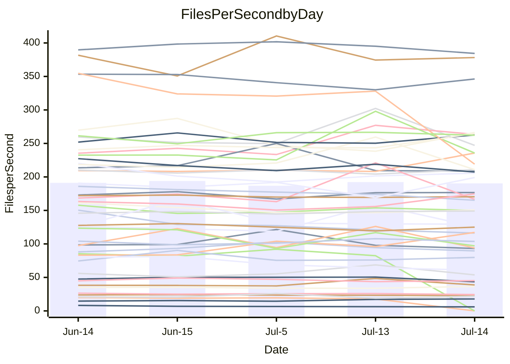

<!---
# This file is auto-generated. Do not edit.
# cspell:disable
--->
# Performance Report

Daily Performance

```mermaid
xychart-beta
    title Files Per Second by Day
    y-axis Files per Second
    x-axis Date [Jun-14, Jun-15, Jul-5, Jul-13, Jul-14]
    bar [191.12, 193.90, 186.85, 192.31, 190.41]
    line [98.55, 99.04, 121.46, 97.93, 93.20]
    line [19.91, 18.97, 19.46, 17.82, 0.00]
    line [259.60, 251.39, 249.74, 302.24, 247.12]
    line [85.34, 81.59, 92.06, 82.41, 0.00]
    line [38.26, 38.06, 37.33, 48.47, 38.78]
    line [88.07, 93.31, 102.97, 94.47, 89.61]
    line [235.41, 242.68, 233.42, 277.07, 263.46]
    line [8.24, 6.81, 6.57, 6.29, 5.99]
    line [269.77, 287.34, 247.09, 238.39, 266.35]
    line [126.17, 122.75, 118.72, 158.48, 125.71]
    line [213.64, 216.83, 249.94, 209.39, 208.66]
    line [209.33, 208.22, 209.98, 208.19, 235.62]
    line [210.20, 205.78, 210.72, 204.20, 210.89]
    line [157.77, 145.55, 147.25, 153.81, 149.95]
    line [23.82, 24.25, 23.61, 23.34, 23.13]
    line [150.40, 129.14, 127.24, 120.84, 116.19]
    line [26.48, 25.01, 25.58, 25.88, 24.35]
    line [14.65, 15.42, 14.44, 17.18, 17.79]
    line [161.35, 154.33, 147.06, 146.76, 150.64]
    line [220.12, 201.30, 192.47, 201.45, 205.63]
    line [173.03, 177.99, 166.99, 176.39, 176.66]
    line [83.17, 83.60, 104.04, 96.02, 117.19]
    line [145.81, 148.34, 144.57, 148.29, 149.04]
    line [232.54, 232.69, 225.39, 298.01, 235.70]
    line [381.64, 350.78, 410.40, 374.43, 378.19]
    line [74.53, 90.33, 75.44, 76.00, 79.85]
    line [168.46, 174.35, 163.07, 221.06, 166.51]
    line [47.54, 50.24, 50.17, 50.42, 43.48]
    line [218.65, 214.39, 220.82, 259.46, 210.89]
    line [125.76, 165.92, 130.91, 129.95, 129.48]
    line [353.38, 352.89, 340.70, 330.04, 346.23]
    line [97.48, 122.92, 94.49, 126.09, 93.95]
    line [55.98, 50.73, 55.28, 68.71, 53.74]
    line [123.50, 121.07, 93.33, 116.87, 97.14]
    line [172.10, 172.90, 169.94, 169.41, 170.43]
    line [185.95, 181.08, 177.29, 174.01, 165.19]
    line [163.34, 159.60, 150.47, 155.87, 174.78]
    line [251.95, 265.72, 251.57, 250.26, 262.67]
    line [240.44, 247.10, 243.88, 243.47, 264.83]
    line [79.92, 81.44, 68.91, 64.41, 60.79]
    line [389.62, 398.36, 401.72, 395.07, 384.35]
    line [354.69, 323.95, 320.66, 328.06, 219.05]
    line [20.77, 20.56, 26.00, 18.90, 21.75]
    line [261.42, 249.50, 266.02, 266.63, 262.26]
    line [127.61, 130.38, 124.96, 119.39, 125.03]
    line [104.15, 98.74, 101.09, 107.84, 103.69]
    line [44.93, 49.08, 47.14, 43.65, 45.21]
    line [227.27, 217.03, 209.38, 218.96, 207.36]
    line [34.98, 35.43, 33.94, 33.78, 36.48]
    line [190.66, 184.43, 191.84, 169.05, 199.09]
```

Time to Process Files

| Repository                                      | Elapsed | Min/Avg/Max           |   SD | SD Graph                |
| ----------------------------------------------- | ------: | :-------------------: | ---: | ----------------------- |
| AdaDoom3/AdaDoom3                    |    2.66 | 2.1 /   2.6 /   2.8   | 0.20 | `    ┣━━┻━━●━━┻━━┫    ` |
| alexiosc/megistos                    |    7.07 | 5.3 /   6.7 /   7.1   | 0.58 | `   ┣━━━┻━━╋━●┻━━━┫   ` |
| apollographql/apollo-server          |    2.75 | 1.5 /   2.5 /   2.7   | 0.35 | `    ┣━━┻━━╋━━●━━┫    ` |
| aspnetboilerplate/aspnetboilerplate  |    9.26 | 7.6 /   8.8 /   9.3   | 0.55 | `   ┣━━━┻━━╋━━●━━━┫   ` |
| aws-amplify/docs                     |   11.25 | 10.7 /  12.3 /  13.3  | 0.71 | `   ┣━●━┻━━╋━━┻━━━┫   ` |
| Azure/azure-rest-api-specs           |    9.47 | 7.6 /   9.7 /  10.5   | 0.97 | `   ┣━━━┻━●╋━━┻━━━┫   ` |
| bitjson/typescript-starter           |    1.12 | 0.9 /   1.0 /   1.3   | 0.13 | `    ┣━━┻━━╋━●┻━━┫    ` |
| caddyserver/caddy                    |    3.59 | 2.7 /   3.4 /   3.7   | 0.28 | `    ┣━━┻━━╋━●┻━━┫    ` |
| canada-ca/open-source-logiciel-libre |    1.17 | 0.6 /   1.0 /   1.1   | 0.15 | `    ┣━━┻━━╋━━●━━┫    ` |
| chef/chef                            |    4.39 | 4.7 /   4.9 /   5.1   | 0.11 | `●     ┣━┻━╋━┻━┫      ` |
| dart-lang/sdk                        |   56.04 | 44.7 /  56.5 /  63.1  | 4.87 | `  ┣━━━┻━━━●━━━┻━━━┫  ` |
| django/django                        |   14.04 | 8.6 /  13.2 /  14.6   | 1.77 | `   ┣━━┻━━━╋━●━┻━━┫   ` |
| eslint/eslint                        |    9.86 | 9.6 /  10.0 /  10.2   | 0.22 | `    ┣━━┻━●╋━━┻━━┫    ` |
| exonum/exonum                        |    3.35 | 2.7 /   3.3 /   3.7   | 0.28 | `    ┣━━┻━━●━━┻━━┫    ` |
| flutter/samples                      |   11.31 | 9.0 /  11.3 /  12.4   | 0.94 | `   ┣━━━┻━━●━━┻━━━┫   ` |
| gitbucket/gitbucket                  |    3.59 | 2.5 /   3.1 /   3.5   | 0.35 | `    ┣━━┻━━╋━━┻●━┫    ` |
| googleapis/google-cloud-cpp          |  123.94 | 121.4 / 124.5 / 126.5 | 1.76 | `  ┣━━━┻━━●╋━━━┻━━━┫  ` |
| graphql/express-graphql              |    1.12 | 1.1 /   1.1 /   1.2   | 0.03 | `     ┣━┻━━╋━●┻━┫     ` |
| graphql/graphql-js                   |    3.65 | 2.9 /   3.6 /   3.9   | 0.29 | `    ┣━━┻━━●━━┻━━┫    ` |
| graphql/graphql-relay-js             |    1.15 | 1.0 /   1.1 /   1.1   | 0.03 | `     ┣━┻━━╋━━┻━┫●    ` |
| graphql/graphql-spec                 |    1.07 | 1.1 /   1.3 /   1.3   | 0.07 | `  ●  ┣━┻━━╋━━┻━┫     ` |
| iluwatar/java-design-patterns        |   11.82 | 11.6 /  12.2 /  12.6  | 0.35 | `   ┣━━━●━━╋━━┻━━━┫   ` |
| ktaranov/sqlserver-kit               |    4.18 | 3.5 /   5.4 /   5.9   | 0.77 | `   ┣━●━┻━━╋━━┻━━━┫   ` |
| liriliri/licia                       |    3.80 | 3.0 /   3.7 /   4.1   | 0.30 | `    ┣━━┻━━╋●━┻━━┫    ` |
| MartinThoma/LaTeX-examples           |    5.98 | 4.7 /   6.0 /   6.4   | 0.49 | `    ┣━━┻━━●━━┻━━┫    ` |
| mdx-js/mdx                           |    1.74 | 1.5 /   1.8 /   1.9   | 0.11 | `    ┣━━┻●━╋━━┻━━┫    ` |
| microsoft/TypeScript-Website         |    5.13 | 5.0 /   5.2 /   5.6   | 0.18 | `    ┣━━┻●━╋━━┻━━┫    ` |
| MicrosoftDocs/PowerShell-Docs        |   24.14 | 18.8 /  23.6 /  25.5  | 1.91 | `   ┣━━┻━━━╋●━━┻━━┫   ` |
| neovim/nvim-lspconfig                |    5.21 | 3.9 /   5.0 /   5.5   | 0.44 | `    ┣━━┻━━╋●━┻━━┫    ` |
| pagekit/pagekit                      |    3.51 | 2.9 /   3.3 /   3.5   | 0.18 | `    ┣━━┻━━╋━━●━━┫    ` |
| php/php-src                          |   24.61 | 18.3 /  22.6 /  24.8  | 2.50 | `  ┣━━━┻━━━╋━━●┻━━━┫  ` |
| plasticrake/tplink-smarthome-api     |    1.43 | 1.0 /   1.3 /   1.5   | 0.11 | `    ┣━━┻━━╋━━┻●━┫    ` |
| prettier/prettier                    |    7.64 | 7.4 /   7.7 /   8.1   | 0.19 | `    ┣━━┻●━╋━━┻━━┫    ` |
| pycontribs/jira                      |    1.49 | 1.2 /   1.4 /   1.6   | 0.12 | `    ┣━━┻━━╋━●┻━━┫    ` |
| RustPython/RustPython                |    8.79 | 6.5 /   7.5 /   8.9   | 1.05 | `   ┣━━━┻━━╋━━┻●━━┫   ` |
| shoelace-style/shoelace              |    2.52 | 2.7 /   2.8 /   3.0   | 0.11 | `  ● ┣━━┻━━╋━━┻━━┫    ` |
| slint-ui/slint                       |   13.12 | 13.4 /  13.9 /  14.2  | 0.29 | `  ●┣━━━┻━━╋━━┻━━━┫   ` |
| SoftwareBrothers/admin-bro           |    2.67 | 2.4 /   2.4 /   2.7   | 0.10 | `    ┣━━┻━━╋━━┻━━┫●   ` |
| sveltejs/svelte                      |   23.19 | 21.7 /  22.5 /  23.1  | 0.37 | `   ┣━━━┻━━╋━━┻━━●┫   ` |
| TheAlgorithms/Python                 |    5.37 | 5.3 /   5.6 /   5.8   | 0.16 | `    ┣━●┻━━╋━━┻━━┫    ` |
| twbs/bootstrap                       |    1.94 | 1.3 /   1.6 /   1.8   | 0.17 | `    ┣━━┻━━╋━━┻━━●    ` |
| typescript-cheatsheets/react         |    1.10 | 0.7 /   1.1 /   1.3   | 0.17 | `    ┣━━┻━━●━━┻━━┫    ` |
| typescript-eslint/typescript-eslint  |    3.95 | 3.1 /   4.0 /   4.3   | 0.36 | `    ┣━━┻━━●━━┻━━┫    ` |
| vitest-dev/vitest                    |   10.39 | 10.1 /  10.4 /  10.9  | 0.23 | `    ┣━━┻━━●━━┻━━┫    ` |
| w3c/aria-practices                   |    3.34 | 3.2 /   3.3 /   3.5   | 0.13 | `    ┣━━┻━━╋●━┻━━┫    ` |
| w3c/specberus                        |    1.83 | 1.8 /   1.9 /   2.1   | 0.10 | `    ┣━━┻●━╋━━┻━━┫    ` |
| webdeveric/webpack-assets-manifest   |    1.22 | 1.1 /   1.2 /   1.3   | 0.06 | `     ┣━┻━━╋●━┻━┫     ` |
| webpack/webpack                      |    6.01 | 4.5 /   5.6 /   6.1   | 0.43 | `    ┣━━┻━━╋━━●━━┫    ` |
| wireapp/wire-desktop                 |    1.34 | 1.2 /   1.3 /   1.4   | 0.04 | `     ┣━┻━━╋━━┻●┫     ` |
| wireapp/wire-webapp                  |   12.16 | 11.5 /  12.2 /  13.9  | 0.68 | `   ┣━━━┻━━●━━┻━━━┫   ` |

Note:
- Elapsed time is in seconds.

Files per Second over Time

| Repository                                      | Files |    Sec |    Fps |     Rel | Trend Fps   |    N |
| ----------------------------------------------- | ----: | -----: | -----: | ------: | ----------- | ---: |
| AdaDoom3/AdaDoom3                    |   103 |   2.66 |  38.78 |  -0.98% | `▄▃▂▃▃▃▂█▃` |    8 |
| alexiosc/megistos                    |   583 |   7.07 |  82.41 |  -6.01% | `▃▃▃▂█▂▃▂`  |    7 |
| apollographql/apollo-server          |   256 |   2.75 |  93.20 | -13.00% | `▂▁▂▂█▂▂▂▁` |    8 |
| aspnetboilerplate/aspnetboilerplate  |  2288 |   9.26 | 247.12 |  -5.03% | `▅▃▄▃▃▃▄█▃` |    8 |
| aws-amplify/docs                     |  2965 |  11.25 | 263.46 |   9.42% | `▃▄▄▅▃▄▄█▇` |    8 |
| Azure/azure-rest-api-specs           |  2522 |   9.47 | 266.35 |   2.62% | `▂█▃▅▃▃▂▂▄` |    8 |
| bitjson/typescript-starter           |    20 |   1.12 |  17.82 |  -8.98% | `▄▆▅▄█▅▂▄`  |    7 |
| caddyserver/caddy                    |   322 |   3.59 |  89.61 |  -5.79% | `▂▃▂▃▃▄█▄▃` |    8 |
| canada-ca/open-source-logiciel-libre |     7 |   1.17 |   5.99 | -16.66% | `▂▂█▂▂▂▂▁▁` |    8 |
| chef/chef                            |  1034 |   4.39 | 235.62 |  12.58% | `▄▆▃▄▅▄▄▄█` |    8 |
| dart-lang/sdk                        | 11524 |  56.04 | 205.63 |   0.28% | `▃▄█▄▂▃▃▄▄` |    8 |
| django/django                        |  2929 |  14.04 | 208.66 |  -8.13% | `▂▂▂▂▂▁█▂▂` |    8 |
| eslint/eslint                        |  2080 |   9.86 | 210.89 |   0.86% | `▅▆█▆█▇▆▅▇` |    8 |
| exonum/exonum                        |   421 |   3.35 | 125.71 |  -1.01% | `▃▃▄▃▃▂▃█▄` |    8 |
| flutter/samples                      |  1696 |  11.31 | 149.95 |  -1.22% | `█▂▃▃▃▃▃▄▄` |    8 |
| gitbucket/gitbucket                  |   417 |   3.59 | 116.19 | -14.16% | `▂▇█▃▃▃▃▂▁` |    8 |
| googleapis/google-cloud-cpp          | 21123 | 123.94 | 170.43 |  -0.37% | `█▆▇▇▆▇▆▆▇` |    8 |
| graphql/express-graphql              |    26 |   1.12 |  23.13 |  -2.56% | `▅█▆▇▆▄█▆▅` |    8 |
| graphql/graphql-js                   |   550 |   3.65 | 150.64 |  -1.73% | `▃█▃▄▃▂▄▃▃` |    8 |
| graphql/graphql-relay-js             |    28 |   1.15 |  24.35 |  -5.93% | `▆▆█▄▆▄▆▆▃` |    8 |
| graphql/graphql-spec                 |    19 |   1.07 |  17.79 |  18.75% | `▄▄▃▅▃▄▃▇█` |    8 |
| iluwatar/java-design-patterns        |  2089 |  11.82 | 176.66 |   2.83% | `▆▆██▅▅▅▇▇` |    8 |
| ktaranov/sqlserver-kit               |   490 |   4.18 | 117.19 |  26.48% | `▂▁▂▂▂█▂▃▆` |    8 |
| liriliri/licia                       |  1438 |   3.80 | 378.19 |  -2.44% | `▃▄▃▂█▄▃▃▃` |    8 |
| MartinThoma/LaTeX-examples           |  1409 |   5.98 | 235.70 |  -0.99% | `▃▃▃▃▂▃▂█▃` |    8 |
| mdx-js/mdx                           |   139 |   1.74 |  79.85 |   3.66% | `▄▃▃█▃▄▄▄▅` |    8 |
| microsoft/TypeScript-Website         |   765 |   5.13 | 149.04 |   2.10% | `█▇▄▇▅▆▇▇▇` |    8 |
| MicrosoftDocs/PowerShell-Docs        |  3126 |  24.14 | 129.48 |  -2.82% | `▂▃▃█▄▄▃▃▃` |    8 |
| neovim/nvim-lspconfig                |   867 |   5.21 | 166.51 |  -4.17% | `▃▃▃▄▃▂▃█▃` |    8 |
| pagekit/pagekit                      |   741 |   3.51 | 210.89 |  -5.87% | `▃▄▄▃▄▄▄█▃` |    8 |
| php/php-src                          |  2312 |  24.61 |  93.95 |  -8.88% | `▃▄▂█▃▂▂█▂` |    8 |
| plasticrake/tplink-smarthome-api     |    62 |   1.43 |  43.48 | -11.67% | `▃▄▄▅▂█▄▅▂` |    8 |
| prettier/prettier                    |  2645 |   7.64 | 346.23 |   0.17% | `█▇██▆█▄▅▇` |    8 |
| pycontribs/jira                      |    80 |   1.49 |  53.74 |  -5.15% | `▄▄▄▂▄▂▅█▃` |    8 |
| RustPython/RustPython                |   854 |   8.79 |  97.14 | -12.53% | `███▇▂▂▃▇▃` |    8 |
| shoelace-style/shoelace              |   440 |   2.52 | 174.78 |  11.24% | `▆▆▅▅▄▃▄▅█` |    8 |
| slint-ui/slint                       |  3475 |  13.12 | 264.83 |   9.01% | `▄▅▆▆▅▆▅▅█` |    8 |
| SoftwareBrothers/admin-bro           |   441 |   2.67 | 165.19 |  -8.53% | `███▇█▆▄▅▄` |    8 |
| sveltejs/svelte                      |  8913 |  23.19 | 384.35 |  -2.93% | `▆▅▆▇█▇▇▆▅` |    8 |
| TheAlgorithms/Python                 |  1411 |   5.37 | 262.67 |   3.69% | `▆▇▅██▄▅▆█` |    8 |
| twbs/bootstrap                       |   118 |   1.94 |  60.79 | -17.90% | `▃█▆▆▃▃▃▂▁` |    8 |
| typescript-cheatsheets/react         |    24 |   1.10 |  21.75 |  -3.19% | `▂▂▂▂▂▂█▁▂` |    8 |
| typescript-eslint/typescript-eslint  |   865 |   3.95 | 219.05 | -34.57% | `▂█▃▃▂▄▂▃ ` |    8 |
| vitest-dev/vitest                    |  2725 |  10.39 | 262.26 |  -0.02% | `▇▆▇▅▆▇█▇▇` |    8 |
| w3c/aria-practices                   |   417 |   3.34 | 125.03 |  -0.72% | `▇▇▇██▄▇▅▆` |    8 |
| w3c/specberus                        |   190 |   1.83 | 103.69 |   0.88% | `█▆▇▅█▇▃█▇` |    8 |
| webdeveric/webpack-assets-manifest   |    55 |   1.22 |  45.21 |  -1.98% | `▃▆▇█▇▇▇▅▆` |    8 |
| webpack/webpack                      |  1247 |   6.01 | 207.36 |  -4.99% | `█▃▃▄▃▃▂▄▃` |    8 |
| wireapp/wire-desktop                 |    49 |   1.34 |  36.48 |   5.76% | `▇▇▆▇▇▆▄▅█` |    8 |
| wireapp/wire-webapp                  |  2421 |  12.16 | 199.09 |   6.11% | `▇█▆▆█▇▆▃█` |    8 |

Data Throughput

| Repository                                      | Files |    Sec |     Kps |     Rel | Trend Kps   |    N |
| ----------------------------------------------- | ----: | -----: | ------: | ------: | ----------- | ---: |
| AdaDoom3/AdaDoom3                    |   103 |   2.66 |  824.08 |  -0.98% | `▄▃▂▃▃▃▂█▃` |    8 |
| alexiosc/megistos                    |   583 |   7.07 |  647.55 |  -6.01% | `▃▃▃▂█▂▃▂`  |    7 |
| apollographql/apollo-server          |   256 |   2.75 |  767.45 | -13.30% | `▂▁▂▂█▂▂▂▁` |    8 |
| aspnetboilerplate/aspnetboilerplate  |  2288 |   9.26 |  604.09 |  -4.81% | `▅▃▄▃▃▃▄█▃` |    8 |
| aws-amplify/docs                     |  2965 |  11.25 |  953.44 |   9.50% | `▃▄▄▅▃▄▄█▇` |    8 |
| Azure/azure-rest-api-specs           |  2522 |   9.47 |  812.66 |   2.62% | `▂█▃▅▃▃▂▂▄` |    8 |
| bitjson/typescript-starter           |    20 |   1.12 |   71.30 |  -8.98% | `▄▆▅▄█▅▂▄`  |    7 |
| caddyserver/caddy                    |   322 |   3.59 |  815.70 |  -5.26% | `▂▃▂▃▃▄█▄▃` |    8 |
| canada-ca/open-source-logiciel-libre |     7 |   1.17 |   49.65 | -16.66% | `▂▂█▂▂▂▂▁▁` |    8 |
| chef/chef                            |  1034 |   4.39 | 1156.69 |  12.63% | `▄▆▃▄▅▄▄▄█` |    8 |
| dart-lang/sdk                        | 11524 |  56.04 | 1404.37 |   0.32% | `▃▄█▄▂▃▃▄▄` |    8 |
| django/django                        |  2929 |  14.04 | 1339.61 |  -8.09% | `▂▂▂▂▂▁█▂▂` |    8 |
| eslint/eslint                        |  2080 |   9.86 | 1476.96 |   1.42% | `▅▆█▆█▇▆▅▇` |    8 |
| exonum/exonum                        |   421 |   3.35 | 1202.42 |  -1.01% | `▃▃▄▃▃▂▃█▄` |    8 |
| flutter/samples                      |  1696 |  11.31 |  897.21 |  -1.24% | `█▂▃▃▃▃▃▄▄` |    8 |
| gitbucket/gitbucket                  |   417 |   3.59 |  555.03 | -14.09% | `▂▇█▃▃▃▃▂▁` |    8 |
| googleapis/google-cloud-cpp          | 21123 | 123.94 | 1479.60 |   0.19% | `█▆▇▇▆▇▆▇▇` |    8 |
| graphql/express-graphql              |    26 |   1.12 |  105.87 |  -2.56% | `▅█▆▇▆▄█▆▅` |    8 |
| graphql/graphql-js                   |   550 |   3.65 | 1121.55 |  -1.30% | `▃█▃▄▃▂▄▃▄` |    8 |
| graphql/graphql-relay-js             |    28 |   1.15 |   95.66 |  -5.93% | `▆▆█▄▆▄▆▆▃` |    8 |
| graphql/graphql-spec                 |    19 |   1.07 |  595.66 |  18.75% | `▄▄▃▅▃▄▃▇█` |    8 |
| iluwatar/java-design-patterns        |  2089 |  11.82 |  544.44 |   2.85% | `▆▆██▅▅▅▇▇` |    8 |
| ktaranov/sqlserver-kit               |   490 |   4.18 | 1775.28 |  26.48% | `▂▁▂▂▂█▂▃▆` |    8 |
| liriliri/licia                       |  1438 |   3.80 |  451.30 |  -2.44% | `▃▄▃▂█▄▃▃▃` |    8 |
| MartinThoma/LaTeX-examples           |  1409 |   5.98 |  486.78 |  -0.99% | `▃▃▃▃▂▃▂█▃` |    8 |
| mdx-js/mdx                           |   139 |   1.74 |  376.28 |   4.54% | `▄▃▃█▃▃▄▄▅` |    8 |
| microsoft/TypeScript-Website         |   765 |   5.13 | 1027.51 |   2.15% | `█▇▄▇▅▆▇▇▇` |    8 |
| MicrosoftDocs/PowerShell-Docs        |  3126 |  24.14 | 1381.52 |  -2.73% | `▂▃▃█▄▄▃▃▃` |    8 |
| neovim/nvim-lspconfig                |   867 |   5.21 |  487.83 |  -4.17% | `▃▃▃▄▃▂▃█▃` |    8 |
| pagekit/pagekit                      |   741 |   3.51 |  439.71 |  -5.87% | `▃▄▄▃▄▄▄█▃` |    8 |
| php/php-src                          |  2312 |  24.61 | 1650.02 |  -8.98% | `▃▄▂█▃▂▂█▂` |    8 |
| plasticrake/tplink-smarthome-api     |    62 |   1.43 |  234.93 | -11.67% | `▃▄▄▅▂█▄▅▂` |    8 |
| prettier/prettier                    |  2645 |   7.64 |  491.67 |   2.07% | `▇▅▇▆▇█▅▅▇` |    8 |
| pycontribs/jira                      |    80 |   1.49 |  379.53 |  -5.15% | `▄▄▄▂▄▂▅█▃` |    8 |
| RustPython/RustPython                |   854 |   8.79 | 2124.65 |   1.19% | `▃▃▂▂▃▃▄█▄` |    8 |
| shoelace-style/shoelace              |   440 |   2.52 |  844.10 |  11.24% | `▆▆▅▅▄▃▄▅█` |    8 |
| slint-ui/slint                       |  3475 |  13.12 | 1402.28 |   9.67% | `▄▄▆▅▅▅▄▅█` |    8 |
| SoftwareBrothers/admin-bro           |   441 |   2.67 |  364.10 |  -8.53% | `███▇█▆▄▅▄` |    8 |
| sveltejs/svelte                      |  8913 |  23.19 |  262.87 |  -2.85% | `▆▅▆▇█▇▇▆▅` |    8 |
| TheAlgorithms/Python                 |  1411 |   5.37 |  671.47 |   3.69% | `▆▇▅██▄▅▆█` |    8 |
| twbs/bootstrap                       |   118 |   1.94 |  498.68 | -17.90% | `▃█▆▆▃▃▃▂▁` |    8 |
| typescript-cheatsheets/react         |    24 |   1.10 |  196.68 |  -3.19% | `▂▂▂▂▂▂█▁▂` |    8 |
| typescript-eslint/typescript-eslint  |   865 |   3.95 |  734.38 | -59.86% | `▂█▃▃▂▄▂▃ ` |    8 |
| vitest-dev/vitest                    |  2725 |  10.39 |  735.78 |   2.76% | `▅▄▅▃▇███▇` |    8 |
| w3c/aria-practices                   |   417 |   3.34 | 1175.63 |  -0.40% | `▇▇▇██▄█▅▇` |    8 |
| w3c/specberus                        |   190 |   1.83 |  338.90 |   1.13% | `█▆▇▅█▇▃█▇` |    8 |
| webdeveric/webpack-assets-manifest   |    55 |   1.22 |  103.56 |  -1.98% | `▃▆▇█▇▇▇▅▆` |    8 |
| webpack/webpack                      |  1247 |   6.01 | 1168.68 |  -0.07% | `█▃▂▄▃▃▃▄▄` |    8 |
| wireapp/wire-desktop                 |    49 |   1.34 |  159.34 |   2.64% | `██▇██▇▄▆█` |    8 |
| wireapp/wire-webapp                  |  2421 |  12.16 |  823.35 |   5.87% | `▇█▆▆█▇▆▃█` |    8 |

