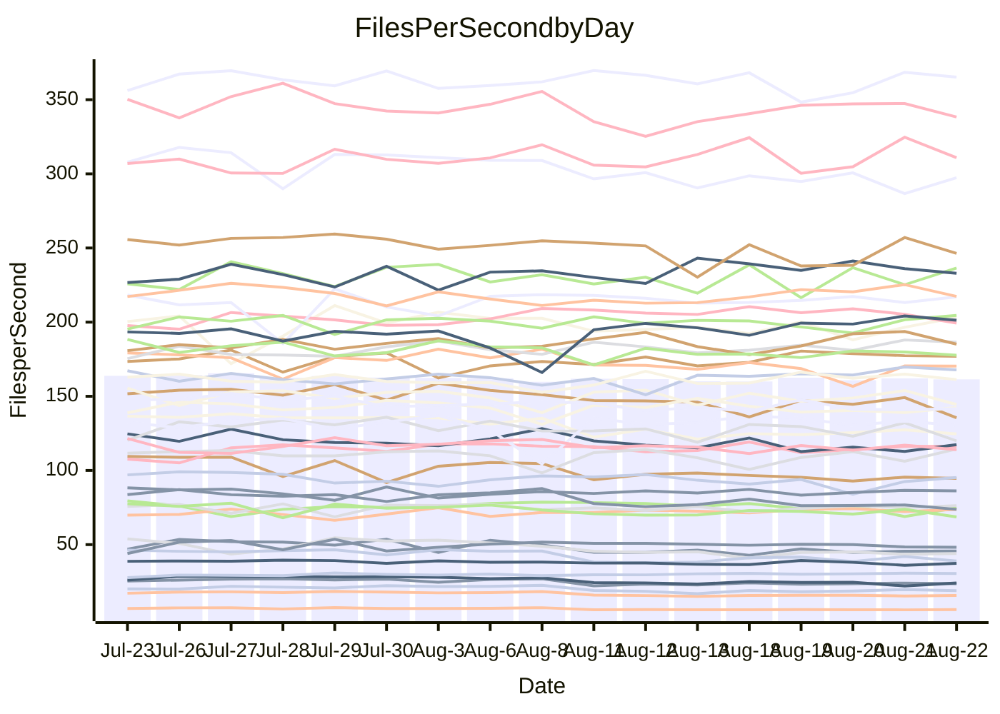

<!---
# This file is auto-generated. Do not edit.
# cspell:disable
--->
# Performance Report

## Daily Performance

```mermaid
xychart-beta
    title Files Per Second by Day
    y-axis Files per Second
    x-axis Date [Jul-23, Jul-26, Jul-27, Jul-28, Jul-29, Jul-30, Aug-3, Aug-6, Aug-8, Aug-11, Aug-12, Aug-13, Aug-18, Aug-19, Aug-20, Aug-21, Aug-22]
    bar [163.82, 164.32, 165.56, 162.55, 163.67, 162.66, 162.42, 162.15, 159.78, 161.87, 161.59, 160.12, 160.00, 162.54, 160.82, 162.11, 161.43]
    line [46.96, 53.48, 52.00, 51.65, 49.61, 53.65, 44.73, 52.88, 49.80, 44.85, 44.73, 46.28, 42.85, 47.12, 44.69, 45.57, 45.72]
    line [17.20, 17.96, 18.17, 17.67, 18.43, 18.02, 17.45, 17.65, 18.37, 15.99, 15.64, 15.11, 15.67, 15.78, 15.86, 15.35, 15.67]
    line [53.86, 50.78, 43.58, 47.06, 54.57, 52.43, 53.03, 51.13, 48.90, 45.53, 44.69, 45.18, 40.85, 44.70, 45.09, 43.47, 44.01]
    line [79.56, 76.05, 68.90, 73.77, 75.65, 74.99, 75.71, 77.66, 78.66, 78.35, 77.65, 75.86, 77.65, 74.07, 76.09, 68.93, 74.80]
    line [109.47, 108.84, 109.00, 95.94, 106.70, 91.83, 102.88, 105.40, 104.69, 93.74, 97.45, 98.22, 96.65, 95.35, 92.84, 95.49, 94.63]
    line [46.24, 45.49, 45.13, 45.94, 46.54, 43.06, 46.57, 45.56, 45.66, 38.22, 37.79, 38.23, 41.09, 41.54, 38.59, 41.99, 38.89]
    line [107.68, 105.10, 115.28, 117.30, 115.27, 112.83, 117.78, 117.94, 116.33, 116.04, 112.64, 113.43, 119.19, 111.93, 114.00, 116.17, 116.28]
    line [124.69, 119.65, 127.83, 120.71, 118.86, 118.39, 116.67, 121.26, 128.17, 119.97, 117.10, 115.21, 121.90, 112.74, 115.76, 112.80, 117.40]
    line [136.61, 135.79, 138.26, 135.57, 135.43, 135.66, 135.43, 131.19, 135.23, 122.44, 127.81, 121.17, 124.81, 124.18, 125.47, 127.40, 124.60]
    line [307.91, 317.83, 314.26, 289.97, 313.11, 312.72, 310.96, 309.18, 308.97, 296.59, 300.81, 290.46, 298.69, 294.82, 300.68, 286.71, 297.35]
    line [43.97, 51.67, 52.73, 46.52, 53.63, 45.66, 48.27, 50.39, 51.68, 50.89, 50.88, 50.22, 49.59, 50.25, 50.03, 48.40, 48.22]
    line [69.86, 70.37, 73.91, 70.30, 66.36, 70.57, 74.92, 69.05, 71.64, 71.63, 73.23, 72.55, 71.44, 73.71, 74.27, 72.25, 73.67]
    line [120.40, 132.81, 129.34, 133.97, 130.74, 135.91, 126.83, 133.33, 126.61, 126.72, 128.04, 119.05, 131.02, 129.61, 123.08, 132.18, 119.93]
    line [225.84, 222.04, 240.74, 232.71, 223.95, 236.98, 238.93, 227.08, 231.94, 225.75, 230.29, 219.53, 238.65, 216.52, 236.75, 225.24, 236.50]
    line [173.49, 175.22, 181.17, 166.29, 176.78, 179.24, 162.30, 170.51, 173.47, 171.46, 176.49, 170.50, 172.92, 180.52, 178.78, 177.41, 176.99]
    line [97.00, 99.07, 98.61, 97.42, 91.49, 92.79, 89.32, 93.72, 96.32, 95.66, 97.25, 93.41, 90.83, 93.92, 83.91, 92.53, 95.25]
    line [350.21, 337.72, 352.09, 361.09, 347.33, 342.33, 341.03, 346.90, 355.56, 335.17, 325.27, 335.20, 340.52, 346.23, 347.14, 347.41, 338.31]
    line [38.75, 38.94, 38.82, 39.51, 39.23, 37.37, 39.03, 38.14, 38.18, 37.54, 37.60, 36.71, 36.51, 39.25, 38.04, 36.06, 37.40]
    line [200.38, 204.18, 172.00, 190.59, 211.20, 199.37, 206.67, 202.54, 202.61, 193.89, 195.05, 196.60, 192.32, 200.16, 188.13, 196.57, 203.20]
    line [132.41, 128.75, 133.45, 135.04, 127.98, 132.62, 137.05, 127.16, 104.34, 135.34, 130.97, 132.26, 136.82, 135.16, 130.52, 133.31, 130.43]
    line [25.46, 26.08, 26.71, 26.98, 26.19, 26.72, 24.58, 26.54, 27.00, 22.24, 23.36, 22.81, 24.23, 23.27, 23.59, 24.08, 23.61]
    line [6.94, 7.34, 7.37, 6.62, 7.52, 6.92, 6.91, 7.06, 7.47, 6.09, 6.22, 6.12, 6.05, 6.23, 6.09, 6.02, 6.16]
    line [75.74, 77.07, 71.05, 77.49, 68.74, 76.65, 76.34, 76.92, 73.53, 74.78, 72.96, 75.57, 72.13, 74.31, 76.20, 74.98, 76.30]
    line [77.55, 75.81, 77.91, 68.05, 77.31, 74.56, 75.13, 76.66, 73.32, 70.77, 69.86, 70.01, 73.04, 72.36, 70.62, 73.83, 68.67]
    line [151.75, 154.10, 154.75, 150.75, 157.93, 147.43, 158.79, 154.00, 151.10, 147.11, 146.86, 146.10, 136.12, 147.29, 144.63, 149.12, 135.51]
    line [20.15, 20.04, 21.91, 21.31, 20.80, 22.35, 21.72, 21.80, 22.54, 19.07, 18.54, 16.95, 19.10, 18.27, 18.74, 19.65, 18.95]
    line [197.73, 195.25, 206.51, 204.03, 201.53, 197.81, 198.32, 202.22, 209.23, 208.13, 206.12, 205.21, 210.46, 206.31, 208.96, 205.28, 199.35]
    line [26.08, 28.71, 28.53, 28.56, 28.21, 28.32, 27.98, 27.09, 27.59, 24.33, 24.19, 23.40, 25.07, 24.48, 24.64, 22.11, 24.10]
    line [155.48, 143.79, 152.94, 153.75, 148.60, 152.63, 153.39, 148.93, 139.04, 152.86, 154.13, 144.07, 152.10, 146.68, 148.87, 153.90, 144.47]
    line [218.25, 211.67, 213.25, 185.65, 222.45, 210.28, 204.15, 217.44, 218.55, 218.05, 216.13, 212.80, 213.27, 214.61, 217.28, 213.25, 217.09]
    line [83.67, 87.12, 83.64, 82.58, 83.71, 79.08, 83.62, 84.88, 87.82, 77.70, 75.58, 76.94, 80.70, 76.26, 76.41, 76.73, 73.77]
    line [179.23, 177.92, 175.97, 161.59, 176.09, 174.17, 181.77, 175.87, 181.75, 171.06, 170.80, 168.18, 172.80, 168.69, 156.73, 170.52, 170.35]
    line [175.39, 183.80, 178.20, 177.82, 176.95, 183.37, 187.31, 181.39, 178.30, 186.48, 183.29, 179.27, 181.07, 184.49, 180.99, 187.99, 186.47]
    line [195.30, 203.49, 200.63, 204.54, 191.76, 201.55, 202.60, 200.71, 195.89, 203.57, 199.20, 201.23, 200.81, 196.78, 192.62, 201.64, 204.58]
    line [180.78, 184.81, 182.65, 188.37, 181.75, 185.70, 188.91, 182.68, 183.70, 188.70, 193.07, 183.50, 178.10, 183.95, 192.12, 193.67, 185.15]
    line [27.77, 29.48, 29.26, 29.06, 30.88, 29.94, 29.48, 30.19, 29.03, 29.67, 29.60, 30.33, 30.62, 30.06, 30.32, 30.71, 30.48]
    line [306.96, 309.97, 300.54, 300.28, 316.56, 309.78, 307.09, 310.74, 319.60, 305.87, 304.71, 313.08, 324.40, 300.37, 304.78, 324.68, 310.90]
    line [226.70, 229.01, 239.01, 232.02, 223.69, 237.66, 221.63, 233.74, 234.59, 230.11, 226.13, 243.15, 239.31, 234.89, 241.23, 236.06, 232.97]
    line [138.82, 146.01, 144.90, 140.82, 142.51, 147.27, 145.58, 142.12, 131.06, 143.98, 142.41, 148.62, 143.28, 139.37, 140.53, 139.04, 142.42]
    line [356.16, 367.24, 369.57, 363.41, 359.37, 369.40, 357.63, 359.56, 362.02, 369.62, 366.45, 360.63, 368.14, 348.34, 354.65, 368.47, 365.23]
    line [88.29, 86.90, 87.47, 84.26, 79.87, 88.81, 81.39, 83.97, 85.77, 84.48, 86.21, 84.78, 87.25, 83.34, 85.16, 86.61, 86.22]
    line [217.24, 221.48, 226.19, 223.44, 219.34, 210.97, 220.37, 215.62, 211.22, 214.76, 212.79, 213.14, 217.00, 221.94, 220.45, 225.30, 217.37]
    line [111.58, 112.75, 113.47, 109.84, 109.80, 112.55, 113.19, 109.88, 98.38, 112.00, 114.17, 108.57, 100.66, 108.77, 112.72, 106.20, 114.49]
    line [188.32, 179.58, 184.08, 186.53, 177.20, 179.37, 187.46, 183.38, 182.66, 171.17, 182.41, 178.32, 178.57, 176.08, 180.57, 179.89, 177.71]
    line [255.68, 251.95, 256.48, 257.08, 259.44, 255.93, 249.24, 251.79, 254.83, 253.26, 251.44, 230.32, 252.21, 237.84, 238.36, 257.03, 246.40]
    line [167.25, 160.14, 165.42, 161.19, 158.31, 161.70, 164.91, 162.58, 157.48, 162.05, 151.08, 164.19, 163.52, 165.17, 164.35, 169.78, 167.82]
    line [121.57, 112.16, 111.54, 116.14, 122.06, 116.65, 117.60, 120.09, 120.85, 115.35, 116.69, 115.74, 111.39, 116.78, 113.71, 117.01, 114.02]
    line [193.41, 192.42, 195.47, 187.19, 193.79, 191.90, 194.07, 182.58, 166.07, 194.86, 199.17, 196.17, 191.14, 199.41, 198.71, 204.15, 201.33]
    line [162.86, 164.94, 160.13, 159.49, 164.72, 159.99, 159.02, 159.32, 152.64, 157.58, 166.90, 158.63, 158.95, 166.31, 162.23, 164.91, 161.29]
    line [147.86, 147.77, 151.94, 147.31, 150.10, 142.92, 143.82, 144.85, 146.35, 145.37, 140.27, 142.62, 139.83, 147.55, 141.21, 140.96, 141.60]
```

## Time to Process Files

| Repository                                      | Elapsed | Min/Avg/Max           |   SD | SD Graph                |
| ----------------------------------------------- | ------: | :-------------------: | ---: | ----------------------- |
| AdaDoom3/AdaDoom3                    |    3.35 | 3.3 /   3.5 /   3.7   | 0.09 | `    ┣━━●━━╋━━┻━━┫    ` |
| alexiosc/megistos                    |    7.45 | 7.4 /   7.8 /   8.5   | 0.26 | `    ┣━●┻━━╋━━┻━━┫    ` |
| apollographql/apollo-server          |    2.57 | 2.5 /   2.7 /   3.3   | 0.15 | `    ┣━━┻●━╋━━┻━━┫    ` |
| aspnetboilerplate/aspnetboilerplate  |   10.54 | 10.1 /  10.7 /  12.2  | 0.39 | `    ┣━━┻━●╋━━┻━━┫    ` |
| aws-amplify/docs                     |   13.30 | 12.7 /  13.2 /  14.2  | 0.40 | `    ┣━━┻━━╋●━┻━━┫    ` |
| Azure/azure-rest-api-specs           |   10.06 | 9.4 /   9.8 /  11.3   | 0.43 | `    ┣━━┻━━╋━●┻━━┫    ` |
| bitjson/typescript-starter           |    1.04 | 0.9 /   1.0 /   1.3   | 0.09 | `     ┣━┻━━╋●━┻━┫     ` |
| caddyserver/caddy                    |    3.65 | 3.6 /   3.8 /   4.1   | 0.15 | `    ┣━━┻●━╋━━┻━━┫    ` |
| canada-ca/open-source-logiciel-libre |    1.15 | 0.9 /   1.1 /   1.2   | 0.08 | `     ┣━┻━━╋━━●━┫     ` |
| chef/chef                            |    6.12 | 5.8 /   6.2 /   7.7   | 0.38 | `    ┣━━┻━●╋━━┻━━┫    ` |
| dart-lang/sdk                        |   66.55 | 63.3 /  66.7 /  70.4  | 1.79 | `  ┣━━━┻━━━●━━━┻━━━┫  ` |
| django/django                        |   14.88 | 14.8 /  15.6 /  16.4  | 0.37 | `    ●━━┻━━╋━━┻━━┫    ` |
| eslint/eslint                        |   11.28 | 10.6 /  11.2 /  12.0  | 0.34 | `    ┣━━┻━━╋●━┻━━┫    ` |
| exonum/exonum                        |    3.81 | 3.4 /   3.6 /   4.0   | 0.14 | `    ┣━━┻━━╋━━┻●━┫    ` |
| flutter/samples                      |   17.68 | 16.4 /  17.1 /  18.7  | 0.53 | `   ┣━━━┻━━╋━━●━━━┫   ` |
| gitbucket/gitbucket                  |    3.47 | 3.5 /   3.6 /   3.9   | 0.14 | `    ┣━━●━━╋━━┻━━┫    ` |
| googleapis/google-cloud-cpp          |  154.87 | 135.4 / 142.5 / 155.3 | 4.99 | `  ┣━━━┻━━━╋━━━┻━━━┫ ●` |
| graphql/express-graphql              |    1.09 | 1.0 /   1.1 /   1.2   | 0.07 | `     ┣━┻━━╋●━┻━┫     ` |
| graphql/graphql-js                   |    2.94 | 2.6 /   2.8 /   3.2   | 0.14 | `    ┣━━┻━━╋━●┻━━┫    ` |
| graphql/graphql-relay-js             |    1.17 | 0.9 /   1.1 /   1.3   | 0.09 | `     ┣━┻━━╋━●┻━┫     ` |
| graphql/graphql-spec                 |    1.03 | 0.9 /   1.0 /   1.1   | 0.07 | `     ┣━┻━━╋━●┻━┫     ` |
| iluwatar/java-design-patterns        |   13.24 | 12.6 /  13.4 /  15.2  | 0.61 | `    ┣━━┻━●╋━━┻━━┫    ` |
| ktaranov/sqlserver-kit               |    6.57 | 6.5 /   6.8 /   7.4   | 0.24 | `    ┣━━●━━╋━━┻━━┫    ` |
| liriliri/licia                       |    4.24 | 4.0 /   4.2 /   4.6   | 0.13 | `    ┣━━┻━━╋●━┻━━┫    ` |
| MartinThoma/LaTeX-examples           |    6.81 | 6.8 /   7.0 /   7.5   | 0.16 | `    ┣━●┻━━╋━━┻━━┫    ` |
| mdx-js/mdx                           |    1.99 | 1.8 /   1.9 /   2.2   | 0.10 | `     ┣━┻━━╋●━┻━┫     ` |
| microsoft/TypeScript-Website         |    5.92 | 5.5 /   5.8 /   7.3   | 0.34 | `    ┣━━┻━━╋●━┻━━┫    ` |
| MicrosoftDocs/PowerShell-Docs        |   23.80 | 23.2 /  24.5 /  27.5  | 0.94 | `   ┣━━━┻●━╋━━┻━━━┫   ` |
| neovim/nvim-lspconfig                |    4.19 | 4.1 /   4.3 /   4.7   | 0.14 | `    ┣━━┻●━╋━━┻━━┫    ` |
| pagekit/pagekit                      |    3.80 | 3.5 /   3.6 /   4.0   | 0.10 | `    ┣━━┻━━╋━━┻●━┫    ` |
| php/php-src                          |   28.41 | 25.4 /  26.7 /  29.7  | 1.06 | `   ┣━━━┻━━╋━━┻━●━┫   ` |
| plasticrake/tplink-smarthome-api     |    1.34 | 1.1 /   1.3 /   1.4   | 0.10 | `     ┣━┻━━╋●━┻━┫     ` |
| prettier/prettier                    |    7.25 | 7.0 /   7.4 /   8.1   | 0.22 | `    ┣━━┻●━╋━━┻━━┫    ` |
| pycontribs/jira                      |    1.73 | 1.5 /   1.6 /   1.8   | 0.08 | `     ┣━┻━━╋━━┻━●     ` |
| RustPython/RustPython                |    6.21 | 5.0 /   5.3 /   5.8   | 0.23 | `     ┣━┻━━╋━━┻━┫    ●` |
| shoelace-style/shoelace              |    2.93 | 2.7 /   3.0 /   3.7   | 0.19 | `    ┣━━┻━●╋━━┻━━┫    ` |
| slint-ui/slint                       |   13.03 | 11.7 /  12.4 /  14.7  | 0.54 | `    ┣━━┻━━╋━━┻●━┫    ` |
| SoftwareBrothers/admin-bro           |    2.55 | 2.4 /   2.6 /   3.0   | 0.11 | `    ┣━━┻━━●━━┻━━┫    ` |
| sveltejs/svelte                      |   21.28 | 20.8 /  21.4 /  23.0  | 0.46 | `   ┣━━━┻━●╋━━┻━━━┫   ` |
| TheAlgorithms/Python                 |    6.27 | 5.6 /   6.0 /   6.9   | 0.28 | `    ┣━━┻━━╋━━●━━┫    ` |
| twbs/bootstrap                       |    1.70 | 1.3 /   1.5 /   1.6   | 0.08 | `     ┣━┻━━╋━━┻━┫ ●   ` |
| typescript-cheatsheets/react         |    1.44 | 1.3 /   1.4 /   1.5   | 0.05 | `     ┣━┻━━╋━●┻━┫     ` |
| typescript-eslint/typescript-eslint  |    4.40 | 4.0 /   4.2 /   4.5   | 0.13 | `    ┣━━┻━━╋━━┻●━┫    ` |
| vitest-dev/vitest                    |    9.66 | 8.9 /   9.5 /  11.1   | 0.46 | `    ┣━━┻━━╋●━┻━━┫    ` |
| w3c/aria-practices                   |    3.36 | 3.2 /   3.5 /   3.8   | 0.13 | `    ┣━━┻●━╋━━┻━━┫    ` |
| w3c/specberus                        |    2.18 | 1.9 /   2.0 /   2.6   | 0.15 | `    ┣━━┻━━╋━●┻━━┫    ` |
| webdeveric/webpack-assets-manifest   |    1.23 | 1.0 /   1.1 /   1.3   | 0.09 | `     ┣━┻━━╋━●┻━┫     ` |
| webpack/webpack                      |    5.45 | 5.3 /   5.6 /   6.5   | 0.25 | `    ┣━━┻●━╋━━┻━━┫    ` |
| wireapp/wire-desktop                 |    1.23 | 0.9 /   1.0 /   1.3   | 0.10 | `     ┣━┻━━╋━━┻━●     ` |
| wireapp/wire-webapp                  |   11.00 | 10.8 /  11.3 /  13.3  | 0.50 | `    ┣━━┻●━╋━━┻━━┫    ` |

Note:
- Elapsed time is in seconds.

## Files per Second over Time

| Repository                                      | Files |    Sec |    Fps |     Rel | Trend Fps              |    N |
| ----------------------------------------------- | ----: | -----: | -----: | ------: | ---------------------- | ---: |
| AdaDoom3/AdaDoom3                    |   103 |   3.35 |  30.79 |   3.09% | `▇▇▆▅▇█▇▅██▇█▇▇█▇█▇██` |   29 |
| alexiosc/megistos                    |   583 |   7.45 |  78.27 |   4.40% | `▇▇▆▆▅█▆▇▄▆▇▅▇▆▇▇▇▆▇█` |   29 |
| apollographql/apollo-server          |   252 |   2.57 |  97.88 |   4.07% | `▇▇███▇████▆▆▇▇▂▇▇▇▇█` |   29 |
| aspnetboilerplate/aspnetboilerplate  |  2286 |  10.54 | 216.92 |   1.28% | `▇▇▇██▆▇▆██▆▇▇▇▇█▇▇█▇` |   29 |
| aws-amplify/docs                     |  2871 |  13.30 | 215.90 |  -0.65% | `▇▄▆▇▅▆▇▆▄▇▅▇▇██▇█▇▇▆` |   29 |
| Azure/azure-rest-api-specs           |  2443 |  10.06 | 242.90 |  -2.66% | `█████▇▇▇█▇▃██▄▆▆█▇▇▆` |   29 |
| bitjson/typescript-starter           |    20 |   1.04 |  19.23 |  -3.13% | `▇██▅▄▅▅▄▄▄▂▅▃▅▄▅▅▅▅▅` |   29 |
| caddyserver/caddy                    |   285 |   3.65 |  78.14 |   2.99% | `█▆██▇██▇▇▆▇▇▄█▇▇▄▅▆█` |   29 |
| canada-ca/open-source-logiciel-libre |     7 |   1.15 |   6.09 |  -7.43% | `▇▇█▄▃▃▄▄▄▄▃▃▃▄▃▃▃▄▄▃` |   29 |
| chef/chef                            |  1207 |   6.12 | 197.10 |   1.72% | `▇▇▃▇▆▇▇█▇▇▇▆▇█▇▇█▇█▇` |   29 |
| dart-lang/sdk                        | 10790 |  66.55 | 162.13 |   0.47% | `▄▆▄▆▄▅█▇▇▆▅▆█▇▆▇▇▅▇▆` |   29 |
| django/django                        |  2852 |  14.88 | 191.64 |   5.10% | `▇▅▅▆▆█▆▆▆▆▄▆▅█▅▆▇▆▆█` |   29 |
| eslint/eslint                        |  2090 |  11.28 | 185.35 |  -0.49% | `▇▅▆▇▆▇▆██▆▅▅▄██▇▇▆▆▆` |   29 |
| exonum/exonum                        |   421 |   3.81 | 110.56 |  -5.03% | `▆█▇▇▄▆▅▆▇▅▆▅▇▆▅▆▆▆▆▅` |   29 |
| flutter/samples                      |  2438 |  17.68 | 137.87 |  -3.53% | `▇█▄▇█▆▆▇▆██▇▆▆▅▇▆▆█▅` |   29 |
| gitbucket/gitbucket                  |   413 |   3.47 | 118.88 |   4.18% | `██▇█▇▆▅▅█▇▆█▅▆█▅▇█▆█` |   29 |
| googleapis/google-cloud-cpp          | 20603 | 154.87 | 133.03 |  -8.05% | `▆▇▇▇▅█▆▆▄▆▇▅█▇▄█▆▆█▄` |   29 |
| graphql/express-graphql              |    26 |   1.09 |  23.96 |  -2.61% | `███▃▃▄▄▃▅▄▃▅▄▅▄▅▅▅▄▅` |   29 |
| graphql/graphql-js                   |   364 |   2.94 | 123.97 |  -4.06% | `███▅▆▄▆▆▇▆▃▆▆▅▆▆▆▆▆▅` |   29 |
| graphql/graphql-relay-js             |    28 |   1.17 |  24.02 |  -6.93% | `▇██▅▅▄▄▅▅▄▄▆▅▅▅▆▃▄▅▅` |   29 |
| graphql/graphql-spec                 |    16 |   1.03 |  15.60 |  -6.35% | `▇██▅▅▅▃▅▅▃▄▄▄▄▄▅▄▄▄▄` |   29 |
| iluwatar/java-design-patterns        |  1992 |  13.24 | 150.51 |   0.76% | `▇▄▅█▆▇▇█▇▆▅▇▇▅▆▇▇▇▃▇` |   29 |
| ktaranov/sqlserver-kit               |   489 |   6.57 |  74.39 |   3.62% | `▆▄▆▆▇▆██▆▆█▆▇███▇▇▇█` |   29 |
| liriliri/licia                       |  1437 |   4.24 | 338.52 |  -0.95% | `███▆▆▆▇▄▅▆▆▇█▇▇█▇▆▆▆` |   29 |
| MartinThoma/LaTeX-examples           |  1409 |   6.81 | 206.91 |   3.43% | `▇▇▆▇█▆▇▇▅▆▇▇▆▅▆▄▇▆██` |   29 |
| mdx-js/mdx                           |   141 |   1.99 |  70.68 |  -2.86% | `██▇▆▆▅▆▃▆▅▆▇▆▇▄▇▇▄▅▆` |   29 |
| microsoft/TypeScript-Website         |   761 |   5.92 | 128.60 |  -1.92% | `▆▆▂████▆█▆███▇▆█▇▇▇▇` |   29 |
| MicrosoftDocs/PowerShell-Docs        |  2708 |  23.80 | 113.77 |   2.73% | `▆▇▃▇▇▇▇▇█▆▆▄▅▇▆█▅█▇▇` |   29 |
| neovim/nvim-lspconfig                |   752 |   4.19 | 179.43 |   2.85% | `▄▇▇▅▇▆█▆▇▆▆▆██▇█▇█▆█` |   29 |
| pagekit/pagekit                      |   741 |   3.80 | 195.10 |  -4.31% | `▅▇███▇▇▇▇▆██▆█▇█▇▇▆▅` |   29 |
| php/php-src                          |  2281 |  28.41 |  80.28 |  -6.17% | `▇█▇▇▆▅▇▆█▅▇▇▄▇▇▆▇██▅` |   29 |
| plasticrake/tplink-smarthome-api     |    62 |   1.34 |  46.16 |  -3.82% | `█▇▆▄▄▃▃▄▄▄▄▃▅▅▃▄▄▄▄▄` |   29 |
| prettier/prettier                    |  2286 |   7.25 | 315.50 |   2.15% | `▇▇█▇▆▅▅▆▆▆██▄▇▆▆█▇▆▇` |   29 |
| pycontribs/jira                      |    79 |   1.73 |  45.71 |  -8.31% | `█▆▇▆▇▇▇▆█▅█▆▇▆▆▆▅▇▅▄` |   29 |
| RustPython/RustPython                |   683 |   6.21 | 109.91 | -14.46% | `▇█▆▄█▆▆▆▇▄▄▇▆▇▄▆▇▄▇▂` |   29 |
| shoelace-style/shoelace              |   439 |   2.93 | 149.86 |   1.31% | `████▇██▇▇▇▇▆▇▇▇▇█▆▂█` |   29 |
| slint-ui/slint                       |  2230 |  13.03 | 171.16 |  -5.01% | `█▇█▇▃█▇▇█▇▇▇▅█▇▇▇█▇▆` |   29 |
| SoftwareBrothers/admin-bro           |   441 |   2.55 | 172.85 |   0.61% | `▇██▇▆▇▇▆▇▆▆▇▆▆▃▆▆▇▆▇` |   29 |
| sveltejs/svelte                      |  7799 |  21.28 | 366.41 |   0.99% | `▇▆▇████▇█▆▇█▇▄▆▇██▇█` |   29 |
| TheAlgorithms/Python                 |  1390 |   6.27 | 221.78 |  -5.02% | `▆▇▇▇█▃▇▆▃█▇▇▆▇▇█▇▇▇▅` |   29 |
| twbs/bootstrap                       |   118 |   1.70 |  69.61 | -13.00% | `▅██▄▅▅▅▃▃▄▅▆▅▄▄▅▄▅▃▂` |   29 |
| typescript-cheatsheets/react         |    53 |   1.44 |  36.75 |  -3.28% | `█▇▇▇█▅▇▇▅▅▆▅██▆▇▅█▅▆` |   29 |
| typescript-eslint/typescript-eslint  |  1279 |   4.40 | 290.58 |  -4.08% | `███▅▇▇▇▇▇▄▇▇▇▅▇▇▅▇▇▆` |   29 |
| vitest-dev/vitest                    |  2193 |   9.66 | 227.08 |  -1.03% | `▇▇▇▆▆▇▆▇▇▆▅█▃▇▇█▆██▆` |   29 |
| w3c/aria-practices                   |   409 |   3.36 | 121.73 |   2.61% | `▆▇█▆▆▆▅▅▆▅▅▇▃▅▄▆▄▅▄▆` |   29 |
| w3c/specberus                        |   198 |   2.18 |  90.89 |  -8.41% | `█▇█▆▅▅▆▆▇▆▆▆▅▇▆▅▆▆▆▅` |   29 |
| webdeveric/webpack-assets-manifest   |    54 |   1.23 |  43.88 |  -7.37% | `██▇▅▆▅▅▅▄▅▅▃▅▄▅▅▄▄▄▄` |   29 |
| webpack/webpack                      |  1111 |   5.45 | 203.84 |   3.18% | `▆██▇▅▇▇▆▆▇▆▆▇▇▇▄▇▇██` |   29 |
| wireapp/wire-desktop                 |    43 |   1.23 |  34.97 | -16.82% | `███▃▄▆▅▆▂▅▄▆▆▆▆▄▆▅▆▃` |   29 |
| wireapp/wire-webapp                  |  1828 |  11.00 | 166.16 |   2.45% | `▇▆▆█▆▇▇▅▃▇█▇█▇▇▇████` |   29 |

## Data Throughput

| Repository                                      | Files |    Sec |     Kps |     Rel | Trend Kps              |    N |
| ----------------------------------------------- | ----: | -----: | ------: | ------: | ---------------------- | ---: |
| AdaDoom3/AdaDoom3                    |   103 |   3.35 |  654.30 |   3.09% | `▇▇▆▅▇█▇▅██▇█▇▇█▇█▇██` |   29 |
| alexiosc/megistos                    |   583 |   7.45 |  615.00 |   4.40% | `▇▇▆▆▅█▆▇▄▆▇▅▇▆▇▇▇▆▇█` |   29 |
| apollographql/apollo-server          |   252 |   2.57 |  787.32 |   4.07% | `▇▇███▇████▆▆▇▇▂▇▇▇▇█` |   29 |
| aspnetboilerplate/aspnetboilerplate  |  2286 |  10.54 |  527.69 |   1.83% | `▇▇▇██▆▇▇██▆▇▇▇▇█▇▇█▇` |   29 |
| aws-amplify/docs                     |  2871 |  13.30 |  753.87 |  -0.59% | `▇▄▆▇▅▆▇▆▄▇▅▇▇██▇█▇▇▆` |   29 |
| Azure/azure-rest-api-specs           |  2443 |  10.06 |  646.17 |  -2.75% | `█▇███▇▇▇█▇▃██▄▆▆█▇▇▆` |   29 |
| bitjson/typescript-starter           |    20 |   1.04 |   76.93 |  -3.13% | `▇██▅▄▅▅▄▄▄▂▅▃▅▄▅▅▅▅▅` |   29 |
| caddyserver/caddy                    |   285 |   3.65 |  666.25 |   3.15% | `█▆██▇██▇▇▇▇▇▄█▇▇▄▅▆█` |   29 |
| canada-ca/open-source-logiciel-libre |     7 |   1.15 |   50.45 |  -7.43% | `▇▇█▄▃▃▄▄▄▄▃▃▃▄▃▃▃▄▄▃` |   29 |
| chef/chef                            |  1207 |   6.12 |  910.23 |   1.76% | `▇▇▃▇▆▇▇█▇▇▇▆▇█▇▇█▇█▇` |   29 |
| dart-lang/sdk                        | 10790 |  66.55 | 1093.49 |   0.10% | `▄▇▄▆▄▅█▇▇▆▅▅█▇▆▆▇▅▇▆` |   29 |
| django/django                        |  2852 |  14.88 | 1201.81 |   5.35% | `▇▅▅▆▆█▆▆▆▆▄▆▅█▆▆▇▆▆█` |   29 |
| eslint/eslint                        |  2090 |  11.28 | 1346.64 |  -0.42% | `▇▅▆▇▆▇▆██▆▅▅▄██▇▇▆▆▆` |   29 |
| exonum/exonum                        |   421 |   3.81 | 1057.54 |  -5.03% | `▆█▇▇▄▆▅▆▇▅▆▅▇▆▅▆▆▆▆▅` |   29 |
| flutter/samples                      |  2438 |  17.68 | 1218.93 |  -3.10% | `▇█▄▇█▆▆▇▆██▇▆▆▆▇▆▇█▆` |   29 |
| gitbucket/gitbucket                  |   413 |   3.47 |  540.29 |   4.30% | `██▇█▇▆▅▅█▇▆█▅▆█▅▇█▆█` |   29 |
| googleapis/google-cloud-cpp          | 20603 | 154.87 | 1073.66 |  -7.84% | `▆▇▇▇▅█▆▆▄▆▇▅█▇▄█▆▆█▄` |   29 |
| graphql/express-graphql              |    26 |   1.09 |  109.66 |  -2.61% | `███▃▃▄▄▃▅▄▃▅▄▅▄▅▅▅▄▅` |   29 |
| graphql/graphql-js                   |   364 |   2.94 |  712.51 |  -4.06% | `███▅▆▄▆▆▇▆▃▆▆▅▆▆▆▆▆▅` |   29 |
| graphql/graphql-relay-js             |    28 |   1.17 |   94.35 |  -6.93% | `▇██▅▅▄▄▅▅▄▄▆▅▅▅▆▃▄▅▅` |   29 |
| graphql/graphql-spec                 |    16 |   1.03 |  565.38 |  -6.35% | `▇██▅▅▅▃▅▅▃▄▄▄▄▄▅▄▄▄▄` |   29 |
| iluwatar/java-design-patterns        |  1992 |  13.24 |  465.19 |   0.76% | `▇▄▅█▆▇▇█▇▆▅▇▇▅▆▇▇▇▃▇` |   29 |
| ktaranov/sqlserver-kit               |   489 |   6.57 | 1126.10 |   3.62% | `▆▄▆▆▇▆██▆▆█▆▇███▇▇▇█` |   29 |
| liriliri/licia                       |  1437 |   4.24 |  403.30 |  -0.95% | `███▆▆▆▇▄▅▆▆▇█▇▇█▇▆▆▆` |   29 |
| MartinThoma/LaTeX-examples           |  1409 |   6.81 |  427.34 |   3.43% | `▇▇▆▇█▆▇▇▅▆▇▇▆▅▆▄▇▆██` |   29 |
| mdx-js/mdx                           |   141 |   1.99 |  328.86 |  -2.78% | `██▇▆▆▅▆▃▆▅▆▇▆▇▄▇▇▄▅▆` |   29 |
| microsoft/TypeScript-Website         |   761 |   5.92 |  889.35 |  -1.85% | `▆▆▂████▆█▆███▇▆█▇▇▇▇` |   29 |
| MicrosoftDocs/PowerShell-Docs        |  2708 |  23.80 | 1169.45 |   2.74% | `▆▇▃▇▇▇▇▇█▆▆▄▅▇▆█▅█▇▇` |   29 |
| neovim/nvim-lspconfig                |   752 |   4.19 |  292.06 |   3.64% | `▄▇▆▅▇▆█▆▇▆▆▆██▇█▇█▆█` |   29 |
| pagekit/pagekit                      |   741 |   3.80 |  406.79 |  -4.31% | `▅▇███▇▇▇▇▆██▆█▇█▇▇▆▅` |   29 |
| php/php-src                          |  2281 |  28.41 | 1397.56 |  -5.98% | `▇▇▆▆▆▅▇▆█▆▇▇▄▇▇▆▇██▅` |   29 |
| plasticrake/tplink-smarthome-api     |    62 |   1.34 |  249.43 |  -3.82% | `█▇▆▄▄▃▃▄▄▄▄▃▅▅▃▄▄▄▄▄` |   29 |
| prettier/prettier                    |  2286 |   7.25 |  447.59 |   2.08% | `▇▇█▇▆▅▆▆▆▆██▄▇▆▆█▇▆▇` |   29 |
| pycontribs/jira                      |    79 |   1.73 |  324.04 |  -8.41% | `█▆▇▆▇▇▇▆█▅█▆▇▆▆▆▅▇▅▄` |   29 |
| RustPython/RustPython                |   683 |   6.21 |  862.22 | -14.46% | `▇█▆▄█▆▆▆▇▄▄▇▆▇▄▆▇▄▇▂` |   29 |
| shoelace-style/shoelace              |   439 |   2.93 |  724.06 |   1.31% | `████▇██▇▇▇▇▆▇▇▇▇█▆▂█` |   29 |
| slint-ui/slint                       |  2230 |  13.03 | 1114.44 |  -4.97% | `█▇█▇▃█▇▇█▇▇▇▅█▇▇▇█▇▆` |   29 |
| SoftwareBrothers/admin-bro           |   441 |   2.55 |  380.99 |   0.61% | `▇██▇▆▇▇▆▇▆▆▇▆▆▃▆▆▇▆▇` |   29 |
| sveltejs/svelte                      |  7799 |  21.28 |  245.29 |   0.97% | `▇▆▇████▇█▆▇█▆▄▆▇██▇█` |   29 |
| TheAlgorithms/Python                 |  1390 |   6.27 |  562.91 |  -5.02% | `▆▇▇▇█▃▇▆▃█▇▇▆▇▇█▇▇▇▅` |   29 |
| twbs/bootstrap                       |   118 |   1.70 |  571.63 | -13.00% | `▅██▄▅▅▅▃▃▄▅▆▅▄▄▅▄▅▃▂` |   29 |
| typescript-cheatsheets/react         |    53 |   1.44 |  268.37 |  -3.28% | `█▇▇▇█▅▇▇▅▅▆▅██▆▇▅█▅▆` |   29 |
| typescript-eslint/typescript-eslint  |  1279 |   4.40 | 1479.92 |  -4.20% | `███▅▇▇▇▇▇▄▇▇▇▅▇▇▅▇▇▆` |   29 |
| vitest-dev/vitest                    |  2193 |   9.66 |  510.17 |  -0.19% | `▆▇▇▆▆▇▆▇▇▆▅█▃▇▇█▆██▆` |   29 |
| w3c/aria-practices                   |   409 |   3.36 | 1132.82 |   2.63% | `▆▇█▆▆▆▅▅▆▅▅▇▃▅▄▆▄▅▄▆` |   29 |
| w3c/specberus                        |   198 |   2.18 |  285.53 |  -7.80% | `█▇█▆▅▅▆▆▇▆▆▆▅▇▆▅▆▆▆▅` |   29 |
| webdeveric/webpack-assets-manifest   |    54 |   1.23 |  103.21 |  -7.13% | `██▇▅▆▅▅▅▄▅▅▃▅▄▅▅▄▄▄▄` |   29 |
| webpack/webpack                      |  1111 |   5.45 |  924.71 |   3.35% | `▆██▇▅▇▇▆▆▇▆▆▇▇▇▄▇███` |   29 |
| wireapp/wire-desktop                 |    43 |   1.23 |  154.53 | -16.82% | `███▃▄▆▅▆▂▅▄▆▆▆▆▄▆▅▆▃` |   29 |
| wireapp/wire-webapp                  |  1828 |  11.00 |  593.94 |   2.63% | `▇▆▆█▆▇▇▅▃▇█▇█▇▇▇████` |   29 |

