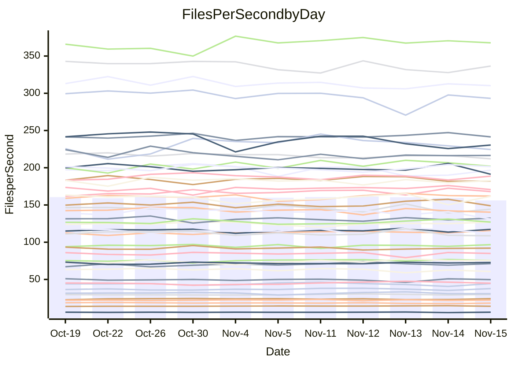

<!---
# This file is auto-generated. Do not edit.
# cspell:disable
--->
# Performance Report

## Daily Performance

```mermaid
xychart-beta
    title Files Per Second by Day
    y-axis Files per Second
    x-axis Date [Oct-19, Oct-22, Oct-26, Oct-30, Nov-4, Nov-5, Nov-11, Nov-12, Nov-13, Nov-14, Nov-15]
    bar [160.58, 159.03, 162.88, 161.94, 160.02, 159.72, 160.65, 161.35, 160.47, 159.54, 156.19]
    line [50.97, 49.03, 49.37, 49.99, 48.68, 50.03, 50.42, 49.00, 46.22, 50.88, 49.74]
    line [112.56, 109.04, 112.63, 110.40, 113.53, 112.85, 114.15, 114.65, 113.36, 112.62, 115.79]
    line [146.50, 146.67, 144.85, 145.45, 142.42, 149.63, 145.08, 140.78, 151.35, 139.20, 144.37]
    line [93.97, 96.00, 95.45, 97.05, 93.17, 96.79, 91.80, 95.95, 95.87, 94.48, 96.67]
    line [22.78, 23.92, 24.17, 24.43, 23.95, 24.20, 23.49, 24.08, 23.00, 23.06, 24.22]
    line [36.49, 37.33, 35.82, 35.71, 36.86, 36.50, 38.05, 38.19, 36.99, 35.25, 37.70]
    line [161.71, 165.23, 164.80, 170.61, 165.61, 166.70, 169.45, 169.81, 163.46, 172.46, 167.96]
    line [6.02, 5.75, 6.03, 5.80, 6.05, 5.91, 5.92, 6.05, 6.23, 5.47, 6.04]
    line [63.29, 63.79, 65.07, 62.75, 64.51, 61.69, 64.67, 63.79, 59.02, 62.70, 60.63]
    line [197.32, 196.05, 201.96, 205.39, 201.71, 188.42, 200.46, 201.07, 189.10, 190.06, 196.66]
    line [67.05, 71.08, 67.00, 69.09, 70.86, 69.37, 70.88, 73.81, 71.09, 69.11, 71.27]
    line [18.69, 19.00, 18.63, 18.25, 18.44, 18.38, 18.23, 18.67, 17.83, 17.56, 18.18]
    line [29.58, 29.31, 29.41, 29.14, 29.07, 29.19, 29.96, 30.60, 29.98, 29.13, 29.83]
    line [75.28, 74.51, 76.18, 72.03, 75.21, 76.09, 76.34, 76.58, 74.79, 76.80, 75.55]
    line [93.37, 90.70, 90.60, 95.53, 91.04, 92.11, 93.46, 89.53, 90.84, 91.64, 92.04]
    line [44.15, 44.08, 44.42, 42.24, 42.88, 45.37, 46.20, 44.50, 43.23, 40.60, 44.42]
    line [173.59, 168.67, 172.42, 163.25, 173.61, 171.18, 172.63, 173.35, 172.14, 176.09, 170.66]
    line [115.01, 116.88, 116.53, 117.43, 111.89, 115.01, 116.13, 115.22, 119.08, 113.54, 117.28]
    line [123.99, 125.15, 124.19, 127.28, 126.86, 123.18, 120.25, 124.45, 125.35, 124.99, 127.05]
    line [118.00, 116.85, 112.16, 115.50, 114.45, 114.87, 117.85, 109.38, 119.29, 116.46, 112.38]
    line [131.49, 131.59, 135.21, 125.70, 130.73, 132.76, 130.23, 128.16, 133.01, 129.97, 132.32]
    line [22.11, 22.28, 21.78, 22.12, 22.59, 22.34, 23.16, 21.54, 22.68, 21.85, 22.19]
    line [342.86, 339.81, 339.82, 342.79, 342.26, 331.64, 327.21, 343.58, 331.81, 327.76, 336.58]
    line [199.89, 192.85, 204.98, 198.27, 207.58, 199.26, 209.84, 202.01, 209.99, 206.66, 202.03]
    line [149.81, 152.74, 149.93, 153.73, 146.39, 151.10, 147.79, 148.60, 155.08, 157.59, 148.95]
    line [299.41, 303.13, 300.22, 304.34, 292.89, 299.81, 300.08, 293.90, 270.62, 297.75, 293.14]
    line [45.18, 45.07, 44.31, 42.25, 43.22, 43.49, 45.34, 46.46, 47.61, 46.36, 44.93]
    line [199.93, 205.59, 201.31, 195.27, 197.35, 200.31, 199.19, 197.63, 196.85, 205.77, 191.27]
    line [72.64, 71.96, 76.44, 72.80, 69.62, 72.93, 75.62, 73.39, 77.86, 75.46, 75.58]
    line [201.34, 199.55, 196.07, 204.60, 201.12, 199.63, 197.18, 194.05, 198.31, 204.17, 201.47]
    line [241.48, 239.78, 242.41, 246.20, 236.64, 241.81, 241.59, 241.14, 243.55, 247.17, 241.45]
    line [158.95, 162.77, 161.40, 160.02, 163.60, 155.05, 157.20, 162.55, 165.62, 162.61, 161.95]
    line [218.31, 220.10, 215.49, 219.14, 217.54, 217.64, 213.57, 213.32, 216.11, 216.43, 211.93]
    line [126.74, 126.46, 125.04, 131.49, 128.05, 124.13, 124.73, 125.27, 128.39, 131.06, 127.05]
    line [183.26, 189.47, 184.23, 177.36, 184.49, 185.72, 182.94, 188.28, 187.98, 181.73, 182.15]
    line [225.66, 211.47, 218.53, 239.32, 235.17, 233.67, 245.24, 236.50, 233.98, 229.39, 224.49]
    line [183.18, 184.56, 191.17, 193.23, 189.38, 187.47, 183.93, 189.93, 188.83, 183.53, 188.72]
    line [73.27, 70.11, 70.57, 73.22, 72.23, 71.32, 71.25, 71.08, 73.06, 72.16, 72.72]
    line [183.04, 175.20, 187.18, 183.23, 185.22, 182.14, 183.42, 176.89, 184.07, 179.92, 182.65]
    line [313.03, 322.37, 310.93, 322.55, 309.17, 313.73, 314.69, 307.18, 306.00, 312.70, 310.23]
    line [224.21, 213.97, 229.01, 220.21, 215.36, 210.66, 218.14, 212.13, 216.95, 216.28, 216.54]
    line [142.44, 143.06, 146.69, 146.59, 140.40, 143.02, 143.74, 136.69, 145.20, 142.11, 140.27]
    line [111.02, 113.95, 113.80, 114.69, 109.15, 112.48, 109.72, 110.55, 118.02, 109.29, 108.60]
    line [365.93, 359.34, 360.33, 349.95, 376.67, 367.68, 370.64, 374.87, 367.41, 370.51, 367.75]
    line [13.81, 14.01, 14.02, 13.97, 14.18, 14.33, 14.26, 14.23, 14.49, 14.71, 14.03]
    line [31.44, 31.67, 31.78, 32.41, 31.83, 29.14, 30.76, 32.43, 33.35, 30.87, 30.80]
    line [86.03, 83.62, 82.78, 86.40, 85.26, 84.18, 85.13, 86.07, 79.22, 86.18, 84.89]
    line [241.58, 245.56, 247.95, 245.41, 221.31, 234.75, 242.27, 242.37, 232.19, 225.67, 230.51]
    line [163.29, 160.80, 161.82, 160.48, 151.46, 156.36, 158.02, 161.56, 165.28, 150.34, 161.67]
    line [139.08, 136.76, 146.14, 142.74, 143.48, 140.52, 140.72, 142.75, 136.72, 140.92, 131.07]
```

## Time to Process Files

| Repository                                      | Elapsed | Min/Avg/Max           |    SD | SD Graph                |
| ----------------------------------------------- | ------: | :-------------------: | ----: | ----------------------- |
| AdaDoom3/AdaDoom3                    |    3.77 | 3.3 /   3.5 /   3.7   |  0.10 | `     ┣━┻━━╋━━┻━┫  ●  ` |
| alexiosc/megistos                    |    7.70 | 7.3 /   7.9 /   8.7   |  0.35 | `    ┣━━┻●━╋━━┻━━┫    ` |
| apollographql/apollo-server          |    2.67 | 2.6 /   2.8 /   3.2   |  0.12 | `     ┣━┻●━╋━━┻━┫     ` |
| aspnetboilerplate/aspnetboilerplate  |   10.43 | 10.3 /  10.6 /  11.8  |  0.35 | `    ┣━━┻━●╋━━┻━━┫    ` |
| aws-amplify/docs                     |   13.61 | 12.4 /  13.2 /  14.8  |  0.53 | `    ┣━━┻━━╋━●┻━━┫    ` |
| Azure/azure-rest-api-specs           |   10.71 | 9.6 /  10.0 /  11.0   |  0.34 | `    ┣━━┻━━╋━━┻━━●    ` |
| bitjson/typescript-starter           |    1.15 | 1.0 /   1.1 /   1.1   |  0.03 | `     ┣━━┻━╋━┻━━●     ` |
| caddyserver/caddy                    |    3.93 | 3.6 /   3.8 /   4.0   |  0.08 | `     ┣━┻━━╋━━┻●┫     ` |
| canada-ca/open-source-logiciel-libre |    1.11 | 1.1 /   1.2 /   1.3   |  0.04 | `     ┣●━┻━╋━┻━━┫     ` |
| chef/chef                            |    6.35 | 5.7 /   6.0 /   6.4   |  0.17 | `    ┣━━┻━━╋━━┻━━●    ` |
| dart-lang/sdk                        |   66.02 | 63.7 /  67.3 /  72.3  |  2.17 | `   ┣━━┻━●━╋━━━┻━━┫   ` |
| django/django                        |   15.81 | 14.9 /  15.8 /  17.2  |  0.53 | `    ┣━━┻━━●━━┻━━┫    ` |
| eslint/eslint                        |   11.08 | 10.7 /  11.2 /  11.8  |  0.35 | `    ┣━━┻━●╋━━┻━━┫    ` |
| exonum/exonum                        |    4.10 | 3.5 /   3.7 /   4.0   |  0.12 | `     ┣━┻━━╋━━┻━┫    ●` |
| flutter/samples                      |   16.49 | 16.0 /  16.9 /  19.0  |  0.59 | `    ┣━━┻●━╋━━┻━━┫    ` |
| gitbucket/gitbucket                  |    3.44 | 3.5 /   3.7 /   3.9   |  0.11 | `     ●━┻━━╋━━┻━┫     ` |
| googleapis/google-cloud-cpp          |  147.43 | 139.9 / 150.4 / 209.7 | 12.65 | `  ┣━━━┻━━●╋━━━┻━━━┫  ` |
| graphql/express-graphql              |    1.21 | 1.1 /   1.2 /   1.3   |  0.04 | `     ┣━━┻━╋━●━━┫     ` |
| graphql/graphql-js                   |    2.92 | 2.8 /   2.9 /   3.2   |  0.10 | `     ┣━┻━●╋━━┻━┫     ` |
| graphql/graphql-relay-js             |    1.20 | 1.1 /   1.2 /   1.2   |  0.04 | `     ┣━━┻━╋━●━━┫     ` |
| graphql/graphql-spec                 |    1.52 | 1.3 /   1.3 /   1.4   |  0.04 | `      ┣━┻━╋━┻━┫     ●` |
| iluwatar/java-design-patterns        |   13.77 | 12.6 /  13.3 /  14.4  |  0.36 | `    ┣━━┻━━╋━━┻●━┫    ` |
| ktaranov/sqlserver-kit               |    6.62 | 6.6 /   6.8 /   7.1   |  0.16 | `    ┣━●┻━━╋━━┻━━┫    ` |
| liriliri/licia                       |    4.28 | 4.1 /   4.3 /   4.6   |  0.12 | `     ┣━┻━━●━━┻━┫     ` |
| MartinThoma/LaTeX-examples           |    7.07 | 6.8 /   7.1 /   7.9   |  0.24 | `    ┣━━┻━━●━━┻━━┫    ` |
| mdx-js/mdx                           |    1.96 | 1.9 /   2.0 /   2.2   |  0.08 | `     ┣━┻●━╋━━┻━┫     ` |
| microsoft/TypeScript-Website         |    5.77 | 5.5 /   5.8 /   6.5   |  0.18 | `    ┣━━┻━━●━━┻━━┫    ` |
| MicrosoftDocs/PowerShell-Docs        |   24.55 | 22.9 /  24.3 /  26.2  |  0.79 | `    ┣━━┻━━╋●━┻━━┫    ` |
| neovim/nvim-lspconfig                |    4.44 | 4.3 /   4.4 /   4.6   |  0.08 | `     ┣━┻━━╋●━┻━┫     ` |
| pagekit/pagekit                      |    3.74 | 3.5 /   3.7 /   4.0   |  0.13 | `     ┣━┻━━╋━●┻━┫     ` |
| php/php-src                          |   26.56 | 25.9 /  26.9 /  28.6  |  0.83 | `    ┣━━┻━●╋━━┻━━┫    ` |
| plasticrake/tplink-smarthome-api     |    1.43 | 1.3 /   1.4 /   1.5   |  0.05 | `     ┣━━┻━╋━●━━┫     ` |
| prettier/prettier                    |    7.85 | 7.2 /   7.7 /   8.3   |  0.22 | `    ┣━━┻━━╋━●┻━━┫    ` |
| pycontribs/jira                      |    1.61 | 1.5 /   1.6 /   1.7   |  0.06 | `     ┣━┻━━╋●━┻━┫     ` |
| RustPython/RustPython                |    5.39 | 5.2 /   5.5 /   6.0   |  0.22 | `    ┣━━┻━●╋━━┻━━┫    ` |
| shoelace-style/shoelace              |    3.00 | 2.9 /   3.0 /   3.2   |  0.09 | `     ┣━┻━●╋━━┻━┫     ` |
| slint-ui/slint                       |   13.93 | 13.3 /  13.8 /  14.5  |  0.36 | `    ┣━━┻━━╋●━┻━━┫    ` |
| SoftwareBrothers/admin-bro           |    2.60 | 2.5 /   2.6 /   2.9   |  0.07 | `     ┣━┻●━╋━━┻━┫     ` |
| sveltejs/svelte                      |   22.35 | 20.8 /  21.8 /  22.9  |  0.46 | `    ┣━━┻━━╋━━●━━┫    ` |
| TheAlgorithms/Python                 |    5.90 | 5.6 /   5.8 /   6.1   |  0.11 | `     ┣━┻━━╋━━●━┫     ` |
| twbs/bootstrap                       |    1.96 | 1.8 /   1.9 /   2.4   |  0.12 | `     ┣━┻━━╋━●┻━┫     ` |
| typescript-cheatsheets/react         |    1.34 | 1.3 /   1.4 /   1.6   |  0.06 | `     ┣●┻━━╋━━┻━┫     ` |
| typescript-eslint/typescript-eslint  |    4.51 | 4.2 /   4.3 /   4.7   |  0.12 | `     ┣━┻━━╋━━┻●┫     ` |
| vitest-dev/vitest                    |   10.95 | 9.2 /   9.9 /  10.9   |  0.48 | `    ┣━━┻━━╋━━┻━━●    ` |
| w3c/aria-practices                   |    3.46 | 3.4 /   3.6 /   3.8   |  0.09 | `     ┣●┻━━╋━━┻━┫     ` |
| w3c/specberus                        |    2.02 | 2.0 /   2.1 /   2.2   |  0.05 | `     ┣━┻●━╋━━┻━┫     ` |
| webdeveric/webpack-assets-manifest   |    1.22 | 1.2 /   1.2 /   1.4   |  0.05 | `     ┣━━┻●╋━┻━━┫     ` |
| webpack/webpack                      |    5.91 | 5.5 /   5.8 /   6.7   |  0.23 | `    ┣━━┻━━╋━●┻━━┫    ` |
| wireapp/wire-desktop                 |    1.48 | 1.4 /   1.5 /   1.7   |  0.08 | `     ┣━┻━━●━━┻━┫     ` |
| wireapp/wire-webapp                  |   11.07 | 10.6 /  11.1 /  12.3  |  0.45 | `    ┣━━┻━━●━━┻━━┫    ` |

Note:
- Elapsed time is in seconds.

## Files per Second over Time

| Repository                                      | Files |    Sec |    Fps |     Rel | Trend Fps              |    N |
| ----------------------------------------------- | ----: | -----: | -----: | ------: | ---------------------- | ---: |
| AdaDoom3/AdaDoom3                    |   103 |   3.77 |  27.35 |  -7.92% | `▅▅▅▅▅▄▅▆▇▇▄▇▆▇▆▅▇█▆▃` |   26 |
| alexiosc/megistos                    |   583 |   7.70 |  75.72 |   2.44% | `▆▆▃▅▄▄██▇█▇▆▇▅█▇▆██▇` |   26 |
| apollographql/apollo-server          |   253 |   2.67 |  94.68 |   3.25% | `▆█▇▆█▇▅▇██▆██▃▆▇▇▇▆█` |   26 |
| aspnetboilerplate/aspnetboilerplate  |  2286 |  10.43 | 219.10 |   1.57% | `██▇█▇▇█▆▆▇▆▄██▇▇▅█▅█` |   26 |
| aws-amplify/docs                     |  2871 |  13.61 | 210.96 |  -3.10% | `█▇▇▅▇▆▆▃█▇▅▆▅▆▆▆▇▇▅▅` |   26 |
| Azure/azure-rest-api-specs           |  2365 |  10.71 | 220.88 |  -7.37% | `██▄▅▆▇█▆▇███▇█▆▅▆▇▇▄` |   26 |
| bitjson/typescript-starter           |    20 |   1.15 |  17.43 |  -5.58% | `▆▆▇▇▅██▆▅▆██▇▇▅▅▇▇▆▄` |   26 |
| caddyserver/caddy                    |   288 |   3.93 |  73.29 |  -3.24% | `▇▄▅▇▆▆█▇▇▇▆▇▅█▆▇▇▆▇▅` |   26 |
| canada-ca/open-source-logiciel-libre |     7 |   1.11 |   6.32 |   6.17% | `▆▅▇▇▇▄▅▇▆▄█▇█▅█▃▆▅▇█` |   26 |
| chef/chef                            |  1191 |   6.35 | 187.49 |  -5.83% | `▆▆▇▆▅█▇▇▆█▆▅▇█▆█▆▇▄▄` |   26 |
| dart-lang/sdk                        | 10747 |  66.02 | 162.79 |   2.14% | `▆▇▆▄▅▇▆▅▇▇▆▇▇▇█▄▆█▇▇` |   26 |
| django/django                        |  2885 |  15.81 | 182.48 |   0.17% | `█▆▇▇▇▄▇▇▆▇▇▆▆▄▇▆▆█▅▆` |   26 |
| eslint/eslint                        |  2099 |  11.08 | 189.40 |   1.04% | `▇▇▅█▆▇▄▇▅▇▄▆█▆▆▅▆▆▇▇` |   26 |
| exonum/exonum                        |   421 |   4.10 | 102.78 | -10.69% | `▅▇▆▇▅▇█▇██▇▇▅▄█▇▇▆▇▃` |   26 |
| flutter/samples                      |  2400 |  16.49 | 145.52 |   2.34% | `█▇▇▆█▆▇▆▇▇▆▇▃▆▇▇▅▆▆▇` |   26 |
| gitbucket/gitbucket                  |   413 |   3.44 | 120.08 |   6.27% | `▅▅▅▇▅▇▄▇▆▇▆▇▅▇▆▆▄▇██` |   26 |
| googleapis/google-cloud-cpp          | 20952 | 147.43 | 142.12 |   1.76% | `█▇█▇▇▇█▇▇▇█▇██▇▇▂█▇▇` |   26 |
| graphql/express-graphql              |    26 |   1.21 |  21.46 |  -3.60% | `▅▅▅▆▅▅▅▅▅█▆▃▄▅▆▅▄▅▇▄` |   26 |
| graphql/graphql-js                   |   368 |   2.92 | 125.97 |   1.24% | `▆█▇█▇▇▅▆▆▄▇██▄▇▇▇█▇▇` |   26 |
| graphql/graphql-relay-js             |    28 |   1.20 |  23.36 |  -2.04% | `▇▇▇▅▅▆█▆▆▅▅▆▇▆▅▅▆▇▇▅` |   26 |
| graphql/graphql-spec                 |    19 |   1.52 |  12.48 | -12.16% | `▆▆▇▆▇▆▇█▇▆▇█▅▆▇██▇█▂` |   26 |
| iluwatar/java-design-patterns        |  1992 |  13.77 | 144.70 |  -3.74% | `▅▇▄▇▆▇▇▇▅▆▆▅▆▇██▇▇▆▅` |   26 |
| ktaranov/sqlserver-kit               |   489 |   6.62 |  73.90 |   3.09% | `▇▇▇▇▆▇▅▇▇▅▆█▆▅▇▇▇▆▇█` |   26 |
| liriliri/licia                       |  1437 |   4.28 | 335.95 |  -0.33% | `███▇█▆▆▆▄█▆▇██▆▆▆▇█▇` |   26 |
| MartinThoma/LaTeX-examples           |  1409 |   7.07 | 199.17 |  -0.02% | `▆█▇▇▆▇██▇▆▆█▆▃▇█▇▇█▇` |   26 |
| mdx-js/mdx                           |   141 |   1.96 |  71.80 |   2.57% | `▅▆▆▇▆▇▅▅▇▇▆███▇▆▇▅█▇` |   26 |
| microsoft/TypeScript-Website         |   761 |   5.77 | 131.83 |   0.31% | `█▅▆▇█▇▆▆▆▆▇▇▃▇▇▆▇▆▇▇` |   26 |
| MicrosoftDocs/PowerShell-Docs        |  2708 |  24.55 | 110.31 |  -1.01% | `▇▇▅▆▇▇▅▆▅▅▆█▆▄█▅▅▄▅▆` |   26 |
| neovim/nvim-lspconfig                |   759 |   4.44 | 171.03 |  -0.48% | `▇▅▇█▇▇▆▇▇▇█▇▇█▇█▆▇▇▇` |   26 |
| pagekit/pagekit                      |   741 |   3.74 | 198.19 |  -2.28% | `▆▆█▇▅▇▅▇█▇█▇▇▅█▇▇▇▆▆` |   26 |
| php/php-src                          |  2262 |  26.56 |  85.16 |   0.61% | `▅▇▇▆▇█▅▆▇▆▇█▇▇▄▇█▇▅▇` |   26 |
| plasticrake/tplink-smarthome-api     |    62 |   1.43 |  43.47 |  -3.14% | `▇▄▄▅▅▄▅▆▆█▆▇▇▇█▇▇▅▇▅` |   26 |
| prettier/prettier                    |  2421 |   7.85 | 308.58 |  -1.30% | `██▆▇▇▇▆▇▆▇▇▇▄▆▆▇▆▇▆▆` |   26 |
| pycontribs/jira                      |    79 |   1.61 |  49.11 |  -1.15% | `█▆▆▅▄█▆▇▇█▆▅▅▇▄▇▇▆▆▆` |   26 |
| RustPython/RustPython                |   693 |   5.39 | 128.45 |   1.77% | `██▇▆▇▃▆▆▇▇▄▅▆▇▇█▆▆▇▇` |   26 |
| shoelace-style/shoelace              |   439 |   3.00 | 146.24 |   0.70% | `▆▆▇▄▇█▆▆▇▆▆▄▅▅█▄▆▄▇▆` |   26 |
| slint-ui/slint                       |  2565 |  13.93 | 184.15 |  -0.22% | `█▅▆▇█▆▅█▆▅▇█▇▇▇▆▅▆▇▆` |   26 |
| SoftwareBrothers/admin-bro           |   441 |   2.60 | 169.61 |   1.74% | `▆▇▇▆▇▇▆▇█▆▇█▇▇▆█▇▆▆▇` |   26 |
| sveltejs/svelte                      |  8053 |  22.35 | 360.37 |  -1.96% | `▆▄█▆▆▆▆▇▆▆█▇▇▇▆▇▆▆█▅` |   26 |
| TheAlgorithms/Python                 |  1399 |   5.90 | 237.08 |  -1.93% | `▇█▅▆▆▇█▆▇▆█▅██▇█▇▆█▆` |   26 |
| twbs/bootstrap                       |   118 |   1.96 |  60.14 |  -4.70% | `█▇█▇▇▇▆▇██▇▇█▇▅▇██▂▆` |   26 |
| typescript-cheatsheets/react         |    53 |   1.34 |  39.53 |   7.15% | `▅▅▄▇▇▅▆▄▇▆▇▆▇█▆▄▆▆▆█` |   26 |
| typescript-eslint/typescript-eslint  |  1285 |   4.51 | 285.24 |  -4.09% | `▆█▇▆▇▇▇▇▇█▇▆▆█▄▇▇▆▇▅` |   26 |
| vitest-dev/vitest                    |  2339 |  10.95 | 213.63 |  -7.32% | `▅▇▇▅▅▇▆▆█▇█▆▆▇▆▆▄▅▇▄` |   26 |
| w3c/aria-practices                   |   414 |   3.46 | 119.56 |   3.42% | `▇▇▆▄▇▅▅▇▇█▅▇▇▅█▆█▆▆█` |   26 |
| w3c/specberus                        |   197 |   2.02 |  97.36 |   2.32% | `███▄▇███▅▇▅▇▇█▇▇█▇▇█` |   26 |
| webdeveric/webpack-assets-manifest   |    55 |   1.22 |  45.22 |   2.08% | `▅▄▅▄▇▆▇▇▇▆█▅▆▇▅▃█▅▄▆` |   26 |
| webpack/webpack                      |  1141 |   5.91 | 193.18 |  -2.08% | `▇█▇▇▇▆▃▆▆█▇▇█▇▆▆▇▇▇▆` |   26 |
| wireapp/wire-desktop                 |    46 |   1.48 |  31.04 |  -0.55% | `▇▇▇▆▅▄▃█▆▆▆▇█▇█▆▅█▅▆` |   26 |
| wireapp/wire-webapp                  |  1783 |  11.07 | 161.10 |   0.49% | `▆▇▇█▄▇▇▃▇▄▇█▅██▇▇▇█▇` |   26 |

## Data Throughput

| Repository                                      | Files |    Sec |     Kps |     Rel | Trend Kps              |    N |
| ----------------------------------------------- | ----: | -----: | ------: | ------: | ---------------------- | ---: |
| AdaDoom3/AdaDoom3                    |   103 |   3.77 |  581.35 |  -7.92% | `▅▅▅▅▅▄▅▆▇▇▄▇▆▇▆▅▇█▆▃` |   26 |
| alexiosc/megistos                    |   583 |   7.70 |  594.96 |   2.44% | `▆▆▃▅▄▄██▇█▇▆▇▅█▇▆██▇` |   26 |
| apollographql/apollo-server          |   253 |   2.67 |  773.52 |   3.75% | `▆█▇▆█▇▅▇██▆██▃▆▇▇▇▆█` |   26 |
| aspnetboilerplate/aspnetboilerplate  |  2286 |  10.43 |  533.08 |   1.57% | `██▇█▇▇█▆▆▇▆▄██▇▇▅█▅█` |   26 |
| aws-amplify/docs                     |  2871 |  13.61 |  736.48 |  -3.10% | `█▇▇▅▇▆▆▃█▇▅▆▅▆▆▆▇▇▅▅` |   26 |
| Azure/azure-rest-api-specs           |  2365 |  10.71 |  600.06 |  -6.89% | `██▄▅▆▇█▆▇███▇█▆▅▆▇▇▄` |   26 |
| bitjson/typescript-starter           |    20 |   1.15 |   69.72 |  -5.58% | `▆▆▇▇▅██▆▅▆██▇▇▅▅▇▇▆▄` |   26 |
| caddyserver/caddy                    |   288 |   3.93 |  635.71 |  -3.09% | `▇▄▅▇▆▆█▇▇▇▆▇▅█▆▇▇▆▇▅` |   26 |
| canada-ca/open-source-logiciel-libre |     7 |   1.11 |   52.33 |   6.17% | `▆▅▇▇▇▄▅▇▆▄█▇█▅█▃▆▅▇█` |   26 |
| chef/chef                            |  1191 |   6.35 |  868.99 |  -5.76% | `▆▆▇▆▅█▇▇▆█▆▅▇█▆█▆▇▄▄` |   26 |
| dart-lang/sdk                        | 10747 |  66.02 | 1110.92 |   2.22% | `▆▇▅▄▅▇▆▅▇▇▆▇▇▇█▅▆█▇▇` |   26 |
| django/django                        |  2885 |  15.81 | 1145.24 |   0.10% | `█▆▇▇▇▄▇▇▆▇▇▆▆▄▇▆▆█▅▆` |   26 |
| eslint/eslint                        |  2099 |  11.08 | 1358.62 |   0.90% | `▇▇▅█▆▇▄▇▅▇▄▅█▆▆▅▆▆▇▇` |   26 |
| exonum/exonum                        |   421 |   4.10 |  983.14 | -10.69% | `▅▇▆▇▅▇█▇██▇▇▅▄█▇▇▆▇▃` |   26 |
| flutter/samples                      |  2400 |  16.49 | 1298.57 |   2.34% | `█▇▇▆█▆▇▆▇▇▆▇▃▆▇▇▅▆▆▇` |   26 |
| gitbucket/gitbucket                  |   413 |   3.44 |  545.76 |   6.26% | `▅▅▅▇▅▇▄▇▆▇▆▇▅▇▆▆▄▇██` |   26 |
| googleapis/google-cloud-cpp          | 20952 | 147.43 | 1157.56 |   1.96% | `███▇▇▇█▇▇▇█▇██▇▇▂█▇▇` |   26 |
| graphql/express-graphql              |    26 |   1.21 |   98.22 |  -3.60% | `▅▅▅▆▅▅▅▅▅█▆▃▄▅▆▅▄▅▇▄` |   26 |
| graphql/graphql-js                   |   368 |   2.92 |  731.19 |   1.45% | `▅▇▇█▇▇▅▆▆▄▇██▄▇▇▇█▇▇` |   26 |
| graphql/graphql-relay-js             |    28 |   1.20 |   91.78 |  -2.04% | `▇▇▇▅▅▆█▆▆▅▅▆▇▆▅▅▆▇▇▅` |   26 |
| graphql/graphql-spec                 |    19 |   1.52 |  416.52 | -12.16% | `▆▆▇▆▇▆▇█▇▆▇█▅▆▇██▇█▂` |   26 |
| iluwatar/java-design-patterns        |  1992 |  13.77 |  447.26 |  -3.74% | `▅▇▄▇▆▇▇▇▅▆▆▅▆▇██▇▇▆▅` |   26 |
| ktaranov/sqlserver-kit               |   489 |   6.62 | 1119.11 |   3.09% | `▇▇▇▇▆▇▅▇▇▅▆█▆▅▇▇▇▆▇█` |   26 |
| liriliri/licia                       |  1437 |   4.28 |  400.24 |  -0.33% | `███▇█▆▆▆▄█▆▇██▆▆▆▇█▇` |   26 |
| MartinThoma/LaTeX-examples           |  1409 |   7.07 |  411.35 |  -0.02% | `▆█▇▇▆▇██▇▆▆█▆▃▇█▇▇█▇` |   26 |
| mdx-js/mdx                           |   141 |   1.96 |  334.07 |   2.57% | `▅▆▆▇▆▇▅▅▇▇▆███▇▆▇▅█▇` |   26 |
| microsoft/TypeScript-Website         |   761 |   5.77 |  911.93 |   0.32% | `█▅▆▇█▇▆▆▆▆▇▇▃▇▇▆▇▆▇▇` |   26 |
| MicrosoftDocs/PowerShell-Docs        |  2708 |  24.55 | 1135.89 |  -0.99% | `▇▇▅▆▇▇▅▆▅▅▆█▆▄█▅▅▄▅▆` |   26 |
| neovim/nvim-lspconfig                |   759 |   4.44 |  286.18 |  -0.40% | `▇▅▇█▇▇▆▇▇▇█▇▇█▇█▆▇▇▇` |   26 |
| pagekit/pagekit                      |   741 |   3.74 |  413.22 |  -2.28% | `▆▆█▇▅▇▅▇█▇█▇▇▅█▇▇▇▆▆` |   26 |
| php/php-src                          |  2262 |  26.56 | 1490.29 |   0.65% | `▅▇▇▆▇█▅▆▇▆▇█▇▇▄▇█▇▅▇` |   26 |
| plasticrake/tplink-smarthome-api     |    62 |   1.43 |  234.89 |  -3.14% | `▇▄▄▅▅▄▅▆▆█▆▇▇▇█▇▇▅▇▅` |   26 |
| prettier/prettier                    |  2421 |   7.85 |  428.52 |  -1.58% | `██▅▆▆▇▆▇▆▇▇▇▄▆▆▆▆▆▆▆` |   26 |
| pycontribs/jira                      |    79 |   1.61 |  348.13 |  -1.15% | `█▆▆▅▄█▆▇▇█▆▅▅▇▄▇▇▆▆▆` |   26 |
| RustPython/RustPython                |   693 |   5.39 | 1068.77 |   3.50% | `▇▇█▇█▄▇▇█▇▄▆▇▇▇█▇▇▇▇` |   26 |
| shoelace-style/shoelace              |   439 |   3.00 |  706.54 |   0.70% | `▆▆▇▄▇█▆▆▇▆▆▄▅▅█▄▆▄▇▆` |   26 |
| slint-ui/slint                       |  2565 |  13.93 | 1135.81 |  -0.09% | `█▅▆▇█▆▅█▆▆▇█▇▇▇▆▅▆▇▇` |   26 |
| SoftwareBrothers/admin-bro           |   441 |   2.60 |  373.84 |   1.74% | `▆▇▇▆▇▇▆▇█▆▇█▇▇▆█▇▆▆▇` |   26 |
| sveltejs/svelte                      |  8053 |  22.35 |  240.39 |  -1.99% | `▆▄█▆▆▆▆▇▆▆▇▇▇▇▆▆▆▆█▅` |   26 |
| TheAlgorithms/Python                 |  1399 |   5.90 |  602.96 |  -1.93% | `▇█▅▆▆▇█▆▇▆█▅██▇█▇▆█▆` |   26 |
| twbs/bootstrap                       |   118 |   1.96 |  493.82 |  -4.65% | `█▇█▇▇▇▆▇██▇▇█▇▅▇██▂▆` |   26 |
| typescript-cheatsheets/react         |    53 |   1.34 |  292.39 |   7.15% | `▅▅▄▇▇▅▆▄▇▆▇▆▇█▆▄▆▆▆█` |   26 |
| typescript-eslint/typescript-eslint  |  1285 |   4.51 | 1470.35 |  -3.97% | `▆█▇▅▇▇▇▇▇█▇▆▆█▄▇▇▆▇▅` |   26 |
| vitest-dev/vitest                    |  2339 |  10.95 |  458.86 |  -9.38% | `▆██▆▆█▆▆▇▆█▆▅▇▆▅▃▅▇▃` |   26 |
| w3c/aria-practices                   |   414 |   3.46 | 1114.78 |   3.42% | `▇▇▆▄▇▅▅▇▇█▅▇▇▅█▆█▆▆█` |   26 |
| w3c/specberus                        |   197 |   2.02 |  307.88 |   2.32% | `███▄▇███▅▇▅▇▇█▇▇█▇▇█` |   26 |
| webdeveric/webpack-assets-manifest   |    55 |   1.22 |  104.42 |   2.08% | `▅▄▅▄▇▆▇▇▇▆█▅▆▇▅▃█▅▄▆` |   26 |
| webpack/webpack                      |  1141 |   5.91 |  880.91 |  -1.91% | `▇█▇▇▇▆▃▅▆█▇▇█▇▆▆▇▇▇▆` |   26 |
| wireapp/wire-desktop                 |    46 |   1.48 |  173.44 |  -0.55% | `▇▇▇▆▅▄▃█▆▆▆▇█▇█▆▅█▅▆` |   26 |
| wireapp/wire-webapp                  |  1783 |  11.07 |  595.80 |   0.61% | `▆▇▇█▄▇▇▃▇▄▇█▅██▇▇▇█▇` |   26 |

