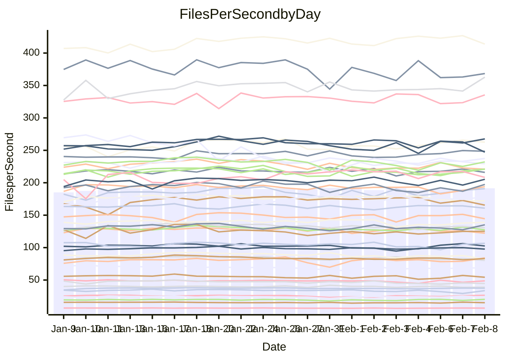

<!---
# This file is auto-generated. Do not edit.
# cspell:disable
--->
# Performance Report

Daily Performance

```mermaid
xychart-beta
    title Files Per Second by Day
    y-axis Files per Second
    x-axis Date [Jan-9, Jan-10, Jan-11, Jan-13, Jan-16, Jan-17, Jan-18, Jan-20, Jan-22, Jan-24, Jan-26, Jan-27, Jan-31, Feb-1, Feb-2, Feb-3, Feb-4, Feb-6, Feb-7, Feb-8]
    bar [185.19, 187.45, 188.92, 191.86, 190.29, 191.94, 196.32, 194.86, 191.82, 190.32, 191.51, 190.41, 192.01, 191.89, 188.72, 191.38, 188.90, 190.72, 190.17, 191.52]
    line [213.46, 218.16, 220.17, 217.65, 213.84, 219.82, 216.50, 223.77, 218.30, 218.17, 216.51, 216.11, 223.69, 217.62, 221.92, 210.52, 217.06, 217.75, 221.18, 215.97]
    line [223.95, 228.77, 221.68, 228.59, 230.59, 232.51, 236.40, 229.96, 235.68, 233.44, 228.13, 220.74, 229.98, 223.23, 220.66, 222.78, 222.35, 231.30, 222.88, 220.88]
    line [80.93, 84.19, 83.66, 81.75, 85.70, 86.11, 85.86, 86.06, 84.27, 86.06, 83.34, 81.63, 80.82, 83.46, 83.98, 85.68, 83.63, 81.75, 82.99, 80.11]
    line [19.36, 19.05, 20.04, 19.27, 20.18, 19.35, 20.14, 20.01, 18.93, 20.01, 19.80, 18.94, 17.77, 19.48, 18.59, 18.27, 20.00, 20.26, 18.55, 20.16]
    line [55.75, 56.48, 57.02, 56.66, 55.93, 59.24, 56.01, 55.67, 55.20, 55.10, 53.59, 53.02, 57.11, 52.81, 55.66, 56.60, 51.29, 52.77, 57.05, 54.26]
    line [34.45, 32.48, 34.06, 34.46, 35.93, 33.32, 35.23, 35.39, 34.93, 34.02, 34.09, 33.87, 34.29, 34.92, 32.72, 32.24, 34.39, 32.11, 29.25, 33.64]
    line [50.43, 48.76, 50.39, 48.56, 48.63, 49.92, 47.96, 48.91, 48.82, 49.53, 48.99, 48.58, 48.96, 48.60, 48.80, 46.86, 44.78, 49.77, 46.58, 48.68]
    line [101.99, 101.23, 103.65, 103.42, 102.46, 106.20, 105.37, 102.12, 105.87, 102.16, 102.14, 102.53, 103.49, 99.40, 99.16, 97.64, 98.18, 103.70, 106.20, 102.51]
    line [256.22, 256.06, 239.94, 250.86, 255.23, 249.00, 265.06, 266.25, 265.39, 261.87, 267.56, 251.76, 251.39, 257.09, 256.60, 252.24, 257.13, 261.45, 265.63, 262.59]
    line [231.09, 232.21, 230.83, 222.60, 231.13, 231.51, 240.11, 237.40, 232.15, 240.84, 231.74, 230.60, 238.25, 234.41, 226.71, 230.40, 229.74, 237.81, 232.23, 229.31]
    line [374.70, 389.29, 376.57, 388.49, 375.32, 366.20, 389.54, 377.40, 385.33, 384.07, 389.49, 375.11, 344.39, 377.92, 368.78, 357.60, 388.25, 362.18, 363.07, 368.37]
    line [122.80, 129.73, 128.79, 126.07, 129.88, 128.08, 130.23, 129.79, 127.22, 125.81, 130.48, 125.23, 130.52, 121.85, 125.25, 129.66, 129.52, 125.44, 125.65, 122.23]
    line [40.03, 40.97, 40.73, 40.14, 39.37, 40.16, 40.57, 39.99, 39.45, 39.56, 40.89, 38.42, 41.91, 40.21, 40.30, 38.59, 39.97, 40.70, 38.75, 39.00]
    line [126.14, 130.00, 129.60, 128.50, 127.21, 130.68, 134.03, 132.53, 130.75, 129.59, 130.75, 126.15, 128.28, 128.07, 127.23, 125.91, 129.12, 126.49, 131.65, 127.35]
    line [127.71, 114.20, 134.12, 122.32, 127.81, 135.76, 135.82, 124.24, 127.06, 126.29, 124.09, 118.58, 122.01, 124.68, 121.40, 124.27, 121.00, 122.72, 124.94, 125.12]
    line [182.37, 173.15, 184.83, 185.84, 185.90, 183.93, 185.28, 191.50, 191.17, 193.91, 185.17, 181.80, 175.63, 188.19, 178.84, 190.27, 179.88, 183.71, 188.14, 190.88]
    line [6.86, 6.90, 6.81, 6.66, 6.97, 6.64, 6.91, 6.72, 6.67, 6.94, 6.67, 6.54, 6.62, 6.41, 6.91, 6.36, 6.58, 6.71, 6.80, 6.65]
    line [257.18, 256.97, 252.12, 251.26, 250.15, 255.66, 262.96, 271.72, 264.80, 259.27, 265.80, 263.72, 257.16, 251.63, 250.02, 261.80, 245.30, 263.91, 261.35, 267.62]
    line [170.50, 178.84, 176.33, 177.89, 180.64, 176.54, 181.96, 178.88, 180.40, 174.86, 177.54, 174.66, 177.76, 179.20, 178.55, 179.09, 179.41, 173.82, 171.95, 172.20]
    line [71.19, 73.13, 70.56, 71.46, 69.64, 73.60, 68.98, 70.36, 68.71, 69.89, 68.59, 68.16, 64.96, 64.42, 71.54, 66.41, 68.48, 67.32, 68.66, 68.64]
    line [240.46, 239.34, 239.80, 239.93, 238.57, 236.32, 249.26, 244.81, 244.90, 244.81, 248.38, 241.40, 249.14, 241.45, 239.07, 239.51, 243.53, 244.90, 249.62, 248.59]
    line [186.67, 196.90, 196.60, 194.03, 194.99, 192.23, 197.19, 192.71, 195.01, 195.95, 192.00, 189.33, 196.17, 191.05, 192.93, 192.90, 193.43, 182.93, 188.24, 193.97]
    line [127.78, 131.45, 132.46, 133.58, 134.83, 138.33, 137.42, 133.67, 135.32, 136.02, 132.00, 133.67, 130.01, 133.77, 131.00, 132.25, 127.77, 131.87, 132.83, 130.76]
    line [212.88, 219.97, 208.62, 218.28, 221.67, 222.50, 222.49, 221.50, 215.62, 221.41, 212.75, 215.81, 222.32, 209.91, 217.01, 216.15, 212.32, 213.20, 215.93, 221.21]
    line [167.66, 162.55, 150.60, 169.56, 173.92, 177.33, 173.32, 178.23, 175.77, 178.27, 178.37, 173.24, 175.53, 174.36, 175.31, 176.60, 177.03, 168.50, 172.68, 165.47]
    line [107.59, 107.79, 102.30, 102.07, 100.69, 106.54, 108.37, 107.20, 104.26, 106.72, 105.14, 103.83, 105.85, 104.82, 108.27, 101.16, 101.71, 96.80, 105.17, 106.65]
    line [25.37, 26.38, 26.59, 26.51, 25.26, 25.41, 25.96, 26.49, 25.80, 26.06, 26.20, 24.97, 23.09, 24.19, 23.67, 25.80, 25.02, 24.57, 25.83, 26.53]
    line [95.27, 97.94, 97.30, 98.25, 99.69, 99.56, 100.21, 102.10, 97.82, 100.22, 98.35, 98.09, 97.24, 99.79, 99.21, 94.63, 98.63, 99.54, 99.93, 97.75]
    line [88.38, 87.15, 87.31, 87.18, 90.31, 92.11, 92.40, 91.04, 90.36, 90.73, 88.98, 87.79, 92.24, 85.84, 87.34, 84.11, 87.49, 86.37, 87.72, 82.14]
    line [269.41, 273.80, 263.96, 272.92, 261.41, 256.94, 266.46, 233.73, 255.35, 238.38, 229.34, 231.07, 215.86, 227.49, 237.43, 233.36, 227.18, 233.42, 233.14, 237.47]
    line [129.36, 128.91, 133.62, 132.89, 135.43, 131.64, 136.76, 137.40, 132.80, 128.54, 132.65, 129.67, 126.00, 129.13, 135.02, 129.21, 131.37, 130.21, 127.48, 135.23]
    line [147.37, 149.33, 150.95, 149.18, 146.30, 139.07, 151.18, 153.74, 153.12, 150.15, 146.49, 146.96, 143.93, 149.76, 150.71, 139.56, 149.35, 149.31, 151.26, 144.50]
    line [48.43, 43.80, 48.21, 48.57, 48.55, 50.09, 48.39, 47.34, 47.51, 47.53, 47.48, 45.26, 47.60, 46.28, 48.66, 45.03, 44.68, 43.73, 45.57, 44.62]
    line [213.91, 219.61, 218.24, 213.27, 217.66, 218.45, 221.48, 225.59, 221.54, 226.67, 217.21, 209.84, 210.58, 224.80, 219.16, 222.44, 214.46, 210.98, 218.39, 220.90]
    line [15.66, 15.79, 15.64, 15.80, 15.80, 16.00, 15.45, 15.24, 15.02, 15.03, 15.29, 14.84, 15.62, 14.38, 14.96, 14.97, 15.27, 14.50, 15.88, 15.01]
    line [163.45, 163.04, 162.47, 164.23, 164.63, 167.70, 160.91, 159.45, 163.50, 167.30, 165.36, 160.46, 164.87, 161.06, 158.29, 161.96, 164.85, 164.28, 164.40, 160.82]
    line [325.37, 329.28, 331.31, 322.95, 325.07, 320.94, 337.71, 314.28, 338.34, 330.62, 332.64, 332.86, 330.58, 325.66, 323.17, 336.90, 335.91, 322.03, 323.49, 335.52]
    line [251.84, 257.31, 259.03, 255.67, 262.65, 261.59, 266.80, 267.02, 266.61, 269.34, 261.80, 260.28, 260.12, 259.24, 266.03, 264.66, 253.81, 264.19, 262.88, 247.23]
    line [138.94, 136.24, 140.09, 141.04, 141.83, 138.27, 139.82, 139.77, 142.05, 138.61, 141.46, 138.59, 143.14, 142.73, 142.84, 131.70, 135.60, 134.90, 137.77, 138.87]
    line [24.29, 22.74, 25.52, 24.84, 24.50, 25.34, 23.52, 24.93, 24.42, 24.29, 23.65, 23.65, 21.57, 23.77, 24.71, 24.15, 24.26, 23.40, 25.18, 23.35]
    line [192.32, 196.53, 187.68, 194.19, 197.24, 195.66, 200.40, 198.68, 192.03, 202.65, 197.73, 197.86, 185.13, 193.14, 197.96, 188.03, 184.87, 192.18, 186.89, 197.41]
    line [75.80, 79.70, 78.59, 81.33, 81.33, 81.07, 83.41, 80.33, 81.35, 82.74, 85.67, 76.62, 69.80, 79.78, 83.19, 79.99, 81.38, 78.37, 78.87, 84.05]
    line [327.56, 357.94, 329.89, 337.22, 342.27, 345.00, 356.14, 349.54, 352.62, 353.32, 354.47, 340.16, 355.36, 343.22, 341.35, 343.34, 343.75, 345.17, 341.37, 362.79]
    line [227.16, 232.86, 230.33, 232.89, 233.09, 238.38, 239.45, 235.23, 231.97, 232.80, 236.05, 231.31, 219.07, 234.91, 232.08, 226.54, 219.34, 230.80, 225.22, 232.23]
    line [80.97, 83.22, 85.10, 84.24, 85.04, 88.54, 87.62, 86.00, 85.64, 83.63, 82.99, 83.39, 81.99, 83.50, 81.95, 82.10, 83.95, 83.89, 81.23, 83.09]
    line [34.68, 36.83, 37.61, 37.83, 37.29, 37.79, 38.08, 37.68, 37.40, 37.80, 38.01, 36.89, 36.96, 37.04, 36.98, 36.58, 36.57, 37.20, 37.62, 37.38]
    line [204.85, 175.41, 212.66, 215.89, 200.52, 199.18, 198.97, 206.74, 209.26, 204.49, 217.13, 213.62, 216.87, 219.73, 217.00, 217.80, 206.42, 216.86, 217.40, 208.26]
    line [194.07, 204.27, 201.52, 203.28, 190.39, 203.06, 207.16, 206.41, 203.60, 205.03, 203.50, 200.03, 203.99, 203.12, 208.67, 201.18, 195.78, 203.73, 196.42, 205.39]
    line [407.03, 408.32, 400.13, 413.71, 402.27, 405.88, 422.55, 417.95, 422.87, 425.03, 422.04, 415.46, 422.79, 413.85, 411.47, 422.24, 425.96, 422.90, 426.77, 413.77]
    line [166.03, 166.95, 174.59, 178.01, 176.93, 175.50, 183.23, 181.65, 172.80, 167.02, 174.50, 177.97, 180.67, 179.91, 166.82, 180.26, 174.86, 175.68, 174.32, 178.38]
```

Time to Process Files

| Repository                                      | Elapsed | Min/Avg/Max           |   SD | SD Graph                |
| ----------------------------------------------- | ------: | :-------------------: | ---: | ----------------------- |
| AdaDoom3/AdaDoom3                    |    2.75 | 2.6 /   2.8 /   3.0   | 0.08 | `    ┣━━┻━●╋━━┻━━┫    ` |
| alexiosc/megistos                    |    6.85 | 6.6 /   7.0 /   7.8   | 0.25 | `    ┣━━┻●━╋━━┻━━┫    ` |
| apollographql/apollo-server          |    2.52 | 2.3 /   2.5 /   2.7   | 0.10 | `    ┣━━┻━━╋●━┻━━┫    ` |
| aspnetboilerplate/aspnetboilerplate  |    8.68 | 8.3 /   8.8 /   9.9   | 0.27 | `    ┣━━┻━●╋━━┻━━┫    ` |
| aws-amplify/docs                     |   11.48 | 11.3 /  11.8 /  12.5  | 0.27 | `    ┣━●┻━━╋━━┻━━┫    ` |
| Azure/azure-rest-api-specs           |    8.85 | 8.6 /   9.4 /  11.2   | 0.46 | `    ┣━●┻━━╋━━┻━━┫    ` |
| bitjson/typescript-starter           |    0.99 | 1.0 /   1.0 /   1.2   | 0.06 | `     ┣━┻●━╋━━┻━┫     ` |
| caddyserver/caddy                    |    3.50 | 3.1 /   3.3 /   3.6   | 0.12 | `    ┣━━┻━━╋━━┻━●┫    ` |
| canada-ca/open-source-logiciel-libre |    1.03 | 1.0 /   1.0 /   1.2   | 0.05 | `     ┣━┻━●╋━━┻━┫     ` |
| chef/chef                            |    5.38 | 5.0 /   5.3 /   5.9   | 0.20 | `    ┣━━┻━━╋●━┻━━┫    ` |
| dart-lang/sdk                        |   53.62 | 50.2 /  54.3 /  60.2  | 1.74 | `  ┣━━━┻━●━╋━━━┻━━━┫  ` |
| django/django                        |   13.16 | 12.6 /  13.4 /  14.9  | 0.41 | `    ┣━━┻●━╋━━┻━━┫    ` |
| eslint/eslint                        |    9.56 | 9.0 /   9.5 /  10.1   | 0.25 | `    ┣━━┻━━╋●━┻━━┫    ` |
| exonum/exonum                        |    3.31 | 3.2 /   3.3 /   3.8   | 0.11 | `    ┣━━┻━━●━━┻━━┫    ` |
| flutter/samples                      |   14.88 | 13.4 /  14.3 /  22.6  | 1.19 | `   ┣━━━┻━━╋━●┻━━━┫   ` |
| gitbucket/gitbucket                  |    3.05 | 3.0 /   3.1 /   3.4   | 0.11 | `    ┣━━┻●━╋━━┻━━┫    ` |
| googleapis/google-cloud-cpp          |  116.22 | 113.8 / 119.7 / 135.3 | 4.60 | `  ┣━━━┻●━━╋━━━┻━━━┫  ` |
| graphql/express-graphql              |    1.18 | 1.0 /   1.1 /   1.3   | 0.06 | `     ┣━┻━━╋━━┻━●     ` |
| graphql/graphql-js                   |    2.50 | 2.5 /   2.6 /   3.1   | 0.10 | `    ┣━●┻━━╋━━┻━━┫    ` |
| graphql/graphql-relay-js             |    1.07 | 1.0 /   1.1 /   1.3   | 0.06 | `     ┣━┻━●╋━━┻━┫     ` |
| graphql/graphql-spec                 |    1.35 | 1.2 /   1.2 /   1.4   | 0.06 | `     ┣━┻━━╋━━┻━●     ` |
| iluwatar/java-design-patterns        |   11.53 | 10.8 /  11.3 /  12.0  | 0.32 | `    ┣━━┻━━╋━━●━━┫    ` |
| ktaranov/sqlserver-kit               |    5.94 | 5.5 /   5.8 /   6.3   | 0.19 | `    ┣━━┻━━╋━●┻━━┫    ` |
| liriliri/licia                       |    3.68 | 3.6 /   3.8 /   4.2   | 0.16 | `    ┣━━●━━╋━━┻━━┫    ` |
| MartinThoma/LaTeX-examples           |    6.15 | 5.8 /   6.1 /   6.5   | 0.17 | `    ┣━━┻━━╋●━┻━━┫    ` |
| mdx-js/mdx                           |    1.67 | 1.4 /   1.8 /   2.2   | 0.11 | `     ┣━┻●━╋━━┻━┫     ` |
| microsoft/TypeScript-Website         |    5.19 | 4.9 /   5.1 /   5.9   | 0.20 | `    ┣━━┻━━╋●━┻━━┫    ` |
| MicrosoftDocs/PowerShell-Docs        |   20.06 | 19.1 /  19.9 /  21.6  | 0.54 | `   ┣━━━┻━━╋●━┻━━━┫   ` |
| neovim/nvim-lspconfig                |    3.79 | 3.8 /   4.0 /   4.6   | 0.15 | `    ┣━━●━━╋━━┻━━┫    ` |
| pagekit/pagekit                      |    3.42 | 3.2 /   3.4 /   3.9   | 0.14 | `    ┣━━┻━━●━━┻━━┫    ` |
| php/php-src                          |   23.04 | 21.7 /  23.0 /  24.8  | 0.68 | `   ┣━━━┻━━●━━┻━━━┫   ` |
| plasticrake/tplink-smarthome-api     |    1.26 | 1.2 /   1.3 /   1.5   | 0.05 | `     ┣━┻━●╋━━┻━┫     ` |
| prettier/prettier                    |    7.32 | 7.0 /   7.5 /   8.1   | 0.29 | `    ┣━━┻●━╋━━┻━━┫    ` |
| pycontribs/jira                      |    1.45 | 1.3 /   1.4 /   1.7   | 0.08 | `     ┣━┻━━●━━┻━┫     ` |
| RustPython/RustPython                |    6.10 | 5.2 /   5.9 /   7.1   | 0.35 | `    ┣━━┻━━╋━●┻━━┫    ` |
| shoelace-style/shoelace              |    2.67 | 2.6 /   2.7 /   3.0   | 0.09 | `    ┣━━┻━●╋━━┻━━┫    ` |
| slint-ui/slint                       |   12.58 | 11.8 /  12.8 /  15.0  | 0.58 | `   ┣━━━┻━●╋━━┻━━━┫   ` |
| SoftwareBrothers/admin-bro           |    2.30 | 2.3 /   2.4 /   2.7   | 0.09 | `    ┣━━┻●━╋━━┻━━┫    ` |
| sveltejs/svelte                      |   20.16 | 19.3 /  20.0 /  21.5  | 0.41 | `   ┣━━━┻━━╋━●┻━━━┫   ` |
| TheAlgorithms/Python                 |    5.33 | 5.2 /   5.4 /   6.3   | 0.20 | `    ┣━━┻●━╋━━┻━━┫    ` |
| twbs/bootstrap                       |    1.69 | 1.6 /   1.7 /   2.0   | 0.08 | `     ┣━┻━●╋━━┻━┫     ` |
| typescript-cheatsheets/react         |    1.32 | 1.3 /   1.3 /   1.5   | 0.05 | `     ┣━┻━●╋━━┻━┫     ` |
| typescript-eslint/typescript-eslint  |    3.92 | 3.8 /   4.0 /   5.0   | 0.18 | `    ┣━━┻━●╋━━┻━━┫    ` |
| vitest-dev/vitest                    |   10.45 | 8.5 /  10.2 /  11.7   | 0.83 | `   ┣━━━┻━━╋●━┻━━━┫   ` |
| w3c/aria-practices                   |    3.13 | 3.0 /   3.2 /   3.6   | 0.13 | `    ┣━━┻●━╋━━┻━━┫    ` |
| w3c/specberus                        |    1.83 | 1.8 /   1.9 /   2.1   | 0.09 | `     ┣━┻●━╋━━┻━┫     ` |
| webdeveric/webpack-assets-manifest   |    1.30 | 1.0 /   1.2 /   1.4   | 0.08 | `     ┣━┻━━╋━━┻●┫     ` |
| webpack/webpack                      |    4.89 | 4.7 /   4.9 /   5.5   | 0.17 | `    ┣━━┻━●╋━━┻━━┫    ` |
| wireapp/wire-desktop                 |    1.34 | 1.2 /   1.3 /   1.6   | 0.08 | `     ┣━┻━━╋●━┻━┫     ` |
| wireapp/wire-webapp                  |   10.87 | 9.1 /  10.6 /  11.8   | 0.58 | `    ┣━━┻━━╋━●┻━━┫    ` |

Note:
- Elapsed time is in seconds.

Files per Second over Time

| Repository                                      | Files |    Sec |    Fps |    Rel | Trend Fps              |    N |
| ----------------------------------------------- | ----: | -----: | -----: | -----: | ---------------------- | ---: |
| AdaDoom3/AdaDoom3                    |   103 |   2.75 |  37.50 |  0.95% | `▅▆▆▆▆▅▇▆▅▆▆▆▅▇▅▇▅█▆▇` |   58 |
| alexiosc/megistos                    |   583 |   6.85 |  85.13 |  2.01% | `▇▆█▆▇▇▇█▆█▇█▅▅▅▇▇▆▃▇` |   58 |
| apollographql/apollo-server          |   254 |   2.52 | 100.88 | -1.44% | `█▇▄▆▇█▄▅▆▄▆▄▆▇▇▇██▇▆` |   58 |
| aspnetboilerplate/aspnetboilerplate  |  2286 |   8.68 | 263.33 |  0.90% | `▆▆▆▆▇▇▇▆█▇▆▅▆▇▇▇▇▇▃▇` |   58 |
| aws-amplify/docs                     |  2874 |  11.48 | 250.43 |  3.05% | `▆▇▆▆▆▇▅▆▆▆█▄▇▇▆▇█▇▇█` |   58 |
| Azure/azure-rest-api-specs           |  2444 |   8.85 | 276.19 |  6.49% | `█▆▃▆█▅▆▆█▆▅▆▅▇▆█▆▇▆█` |   58 |
| bitjson/typescript-starter           |    20 |   0.99 |  20.24 |  4.02% | `▅▅█▇▅▇▄▃▇▅▇█▇██▇▇▄▇█` |   58 |
| caddyserver/caddy                    |   291 |   3.50 |  83.22 | -5.82% | `▅█▆▄▆█▄▅▆▄▄▇▇▇▆▅▇▅▄▄` |   58 |
| canada-ca/open-source-logiciel-libre |     7 |   1.03 |   6.81 |  1.79% | `▅▆▅▄▇▆█▃▆▆▇█▃▆▆▇▇▆▆▇` |   58 |
| chef/chef                            |  1199 |   5.38 | 222.76 | -1.72% | `▃▇▅▇▆▆▆▆▇▅█▆▄▇█▇▅▇▆▆` |   58 |
| dart-lang/sdk                        | 10978 |  53.62 | 204.75 |  1.59% | `▆▆▇▆▆█▅▆▆▅▆▄▆▆▆▆▆▄▆▆` |   58 |
| django/django                        |  2890 |  13.16 | 219.56 |  1.49% | `▅█▅▆▆█▆▆▇▇▆▇▆▇█▅▇▇█▇` |   58 |
| eslint/eslint                        |  2060 |   9.56 | 215.54 | -0.91% | `██▇▆███▄▇▆▆▇█▆▇█▇█▇▆` |   58 |
| exonum/exonum                        |   421 |   3.31 | 127.05 |  0.00% | `▆█▆▅▇▇▆█▇██▇█▇▇▆▆▇▅▇` |   58 |
| flutter/samples                      |  2474 |  14.88 | 166.30 | -3.67% | `██▇█▇▇███▇██▇▇▇▇▇█▇▇` |   58 |
| gitbucket/gitbucket                  |   414 |   3.05 | 135.94 |  3.07% | `▇▅▅▇▆▇█▇▄▇▆▆█▄█▇▅▆▇█` |   58 |
| googleapis/google-cloud-cpp          | 21024 | 116.22 | 180.91 |  2.89% | `▇████▃▇█▇██▅██▇▆▆▇▇█` |   58 |
| graphql/express-graphql              |    26 |   1.18 |  21.98 | -9.19% | `▆▄▇▆▅▇▇▆▇▆▇▇▅▂▇▇█▇▇▄` |   58 |
| graphql/graphql-js                   |   368 |   2.50 | 147.08 |  5.77% | `▇▇▇█▇█▇▆▃▆▅▇▆▆▆▅▆▆▅█` |   58 |
| graphql/graphql-relay-js             |    28 |   1.07 |  26.16 |  2.49% | `█▄▇▅▄▅▅▇▇▇▄▇▇█▅▄▇▇█▇` |   58 |
| graphql/graphql-spec                 |    19 |   1.35 |  14.07 | -7.75% | `▆▇▅▆▄█▄█▆▅▇▅▇▄▇▄███▄` |   58 |
| iluwatar/java-design-patterns        |  1992 |  11.53 | 172.71 | -2.42% | `█▇▇█▇█▇██▇██▇▅▇▆▆▅▆▆` |   58 |
| ktaranov/sqlserver-kit               |   490 |   5.94 |  82.44 | -1.76% | `█▆█▆▇█▅▆▆▇▇▆██▆▇▅▇▇▆` |   58 |
| liriliri/licia                       |  1437 |   3.68 | 390.24 |  3.70% | `▆▄█▇▆▇▅▆▆▄███▆▆▄▄▇▄█` |   58 |
| MartinThoma/LaTeX-examples           |  1409 |   6.15 | 228.93 | -1.51% | `▇███▅▆▅▅▆█▇▇▅█▇▇▅█▆▆` |   58 |
| mdx-js/mdx                           |   141 |   1.67 |  84.40 |  5.48% | `▇▄▆▇▇█▇▆▇▇▆███▅▆▇▆██` |   58 |
| microsoft/TypeScript-Website         |   761 |   5.19 | 146.54 | -1.34% | `▄▆█▇▇█▇█▅▃▇█▇██▆██▆▇` |   58 |
| MicrosoftDocs/PowerShell-Docs        |  2647 |  20.06 | 131.94 | -0.66% | `▇▆█▇▆▆▇▇▇▆▆▆▅▆▇▇▇▇▆▇` |   58 |
| neovim/nvim-lspconfig                |   769 |   3.79 | 203.03 |  4.49% | `▇▅▇█▆█▇▇▆▅▅▃█▆▇▇▅▆▆█` |   58 |
| pagekit/pagekit                      |   741 |   3.42 | 216.53 | -0.55% | `▅▆▇██▇▇█▇▇▆█▅▃▇▇▇▇█▇` |   58 |
| php/php-src                          |  2267 |  23.04 |  98.41 | -0.18% | `▄▆▇▇▇▆▇▅▆▄▇▇▆▇▆██▆▆▇` |   58 |
| plasticrake/tplink-smarthome-api     |    62 |   1.26 |  49.16 |  1.12% | `▆▇▆▇▇█▆▇▃▇▃▅▆▇██▇▄▆▇` |   58 |
| prettier/prettier                    |  2653 |   7.32 | 362.34 |  5.23% | `▆▇█▇▄▇▅▆▅▇▇▆▆▆▇▆▅▇██` |   58 |
| pycontribs/jira                      |    79 |   1.45 |  54.41 | -0.93% | `▅█▆▅▆▇▇█▇▇▇▃▅▅▅▇▇█▆▆` |   58 |
| RustPython/RustPython                |   746 |   6.10 | 122.25 | -2.09% | `▇▇▇█▇▇▆▇█▇▇▆▆▇▆█▇██▇` |   58 |
| shoelace-style/shoelace              |   439 |   2.67 | 164.26 |  1.00% | `▇▇▇▅▇▅▆▇▇▅█▅▇▅▇█▇▇▅▇` |   58 |
| slint-ui/slint                       |  2724 |  12.58 | 216.48 |  2.97% | `▇▇█▇██▇▇██▇▅▇█▇██▇▅▇` |   58 |
| SoftwareBrothers/admin-bro           |   441 |   2.30 | 191.46 |  3.28% | `█▅▇█▇▇▅█▇█▇▆▅█▇▅▇▇██` |   58 |
| sveltejs/svelte                      |  8367 |  20.16 | 415.05 | -0.30% | `▇▇▇▆▇▇▆▇████▇▇▇███▇▇` |   58 |
| TheAlgorithms/Python                 |  1401 |   5.33 | 263.03 |  2.11% | `▆▆█▇▆▇▇▅▇▇▇▇▆▇▇███▇█` |   58 |
| twbs/bootstrap                       |   118 |   1.69 |  69.70 |  0.97% | `▇▅▇▅▃█▇▆▄▇▇▅▇▅▆▇▇▆▆▇` |   58 |
| typescript-cheatsheets/react         |    53 |   1.32 |  40.09 |  0.74% | `▆█▇▇▇▇▇▆▅▆█▆▆█▇▇▅▇▅▇` |   58 |
| typescript-eslint/typescript-eslint  |  1307 |   3.92 | 333.54 |  1.46% | `█▇█▆▇▇▆▇█▇██▆▇▇▅▅██▇` |   58 |
| vitest-dev/vitest                    |  2498 |  10.45 | 238.96 | -1.97% | `▆▄▆▆▅█▆▆▇▇▆▇▄▇▆▇▇▇▇▇` |   58 |
| w3c/aria-practices                   |   414 |   3.13 | 132.32 |  2.78% | `▄▇▆▇▇▅██▇▅▇█▇▆█▅██▅█` |   58 |
| w3c/specberus                        |   197 |   1.83 | 107.57 |  3.12% | `▇▇▇█▆██▇▄██▃▇▆▄▄█▇▇█` |   58 |
| webdeveric/webpack-assets-manifest   |    55 |   1.30 |  42.44 | -9.40% | `▄▇▇▇▆█▇▄▆▇▄█▅▇▅▄▅▇▇▄` |   58 |
| webpack/webpack                      |  1139 |   4.89 | 232.92 |  0.67% | `▇▅▇██▇▇▆▆▇▄▅▇█▇▇█▅▇▇` |   58 |
| wireapp/wire-desktop                 |    44 |   1.34 |  32.81 | -3.56% | `█▇▇█▇█▄▄▅▇▇▇▇▅█▄▂▅▇▆` |   58 |
| wireapp/wire-webapp                  |  2071 |  10.87 | 190.44 | -0.97% | `▆▇▇█▅▆▅█▇▇▆▇▆▇▄▆▅▇█▆` |   57 |

Data Throughput

| Repository                                      | Files |    Sec |     Kps |    Rel | Trend Kps              |    N |
| ----------------------------------------------- | ----: | -----: | ------: | -----: | ---------------------- | ---: |
| AdaDoom3/AdaDoom3                    |   103 |   2.75 |  797.05 |  0.95% | `▅▆▆▆▆▅▇▆▅▆▆▆▅▇▅▇▅█▆▇` |   58 |
| alexiosc/megistos                    |   583 |   6.85 |  668.91 |  2.01% | `▇▆█▆▇▇▇█▆█▇█▅▅▅▇▇▆▃▇` |   58 |
| apollographql/apollo-server          |   254 |   2.52 |  825.73 | -1.42% | `█▇▄▆▇█▄▅▆▄▆▄▆▇▇▇██▇▆` |   58 |
| aspnetboilerplate/aspnetboilerplate  |  2286 |   8.68 |  640.70 |  0.90% | `▆▆▆▆▇▇▇▆█▇▆▅▆▇▇▇▇▇▃▇` |   58 |
| aws-amplify/docs                     |  2874 |  11.48 |  875.29 |  3.05% | `▆▇▆▆▆▇▅▆▆▆█▄▇▇▆▇█▇▇█` |   58 |
| Azure/azure-rest-api-specs           |  2444 |   8.85 |  723.35 |  5.90% | `█▆▃▆█▅▆▆█▆▄▆▅▇▆█▆▇▆█` |   58 |
| bitjson/typescript-starter           |    20 |   0.99 |   80.95 |  4.02% | `▅▅█▇▅▇▄▃▇▅▇█▇██▇▇▄▇█` |   58 |
| caddyserver/caddy                    |   291 |   3.50 |  729.24 | -5.86% | `▅█▆▄▆█▄▅▆▄▄▇▇▇▆▅▇▅▄▄` |   58 |
| canada-ca/open-source-logiciel-libre |     7 |   1.03 |   56.46 |  1.79% | `▅▆▅▄▇▆█▃▆▆▇█▃▆▆▇▇▆▆▇` |   58 |
| chef/chef                            |  1199 |   5.38 | 1044.89 | -1.24% | `▃▇▅▇▆▆▆▆▇▅█▆▄▇█▇▅▇▆▆` |   58 |
| dart-lang/sdk                        | 10978 |  53.62 | 1390.23 |  1.66% | `▆▆▆▆▆█▅▆▆▅▆▄▆▆▆▆▆▄▆▆` |   58 |
| django/django                        |  2890 |  13.16 | 1385.26 |  1.55% | `▅█▅▆▆█▆▆▇▇▆▇▆▇█▅▇▇█▇` |   58 |
| eslint/eslint                        |  2060 |   9.56 | 1494.23 | -0.74% | `██▇▆███▄▇▆▆▇█▆▇█▇█▇▇` |   58 |
| exonum/exonum                        |   421 |   3.31 | 1215.29 |  0.00% | `▆█▆▅▇▇▆█▇██▇█▇▇▆▆▇▅▇` |   58 |
| flutter/samples                      |  2474 |  14.88 | 1445.55 | -4.45% | `██▇█▇▇██▇▇▇█▇▇▆▇▇▇▆▇` |   58 |
| gitbucket/gitbucket                  |   414 |   3.05 |  619.30 |  3.06% | `▇▅▅▇▆▇█▇▄▇▆▆█▄█▇▅▆▇█` |   58 |
| googleapis/google-cloud-cpp          | 21024 | 116.22 | 1473.54 |  2.89% | `▇████▃▇█▇██▅██▇▆▆▇▇█` |   58 |
| graphql/express-graphql              |    26 |   1.18 |  100.58 | -9.19% | `▆▄▇▆▅▇▇▆▇▆▇▇▅▂▇▇█▇▇▄` |   58 |
| graphql/graphql-js                   |   368 |   2.50 |  856.08 |  5.87% | `▇▇▇█▇█▇▆▃▆▅▇▆▆▆▅▆▆▅█` |   58 |
| graphql/graphql-relay-js             |    28 |   1.07 |  102.77 |  2.49% | `█▄▇▅▄▅▅▇▇▇▄▇▇█▅▄▇▇█▇` |   58 |
| graphql/graphql-spec                 |    19 |   1.35 |  469.34 | -7.75% | `▆▇▅▆▄█▄█▆▅▇▅▇▄▇▄███▄` |   58 |
| iluwatar/java-design-patterns        |  1992 |  11.53 |  533.82 | -2.42% | `█▇▇█▇█▇██▇██▇▅▇▆▆▅▆▆` |   58 |
| ktaranov/sqlserver-kit               |   490 |   5.94 | 1246.18 | -1.89% | `█▆█▆▇█▅▆▆▇▇▆██▆▇▄▇▇▆` |   58 |
| liriliri/licia                       |  1437 |   3.68 |  464.92 |  3.70% | `▆▄█▇▆▇▅▆▆▄███▆▆▄▄▇▄█` |   58 |
| MartinThoma/LaTeX-examples           |  1409 |   6.15 |  472.81 | -1.51% | `▇███▅▆▅▅▆█▇▇▅█▇▇▅█▆▆` |   58 |
| mdx-js/mdx                           |   141 |   1.67 |  392.07 |  5.48% | `▇▄▆▇▇█▇▆▇▇▆███▅▆▇▆██` |   58 |
| microsoft/TypeScript-Website         |   761 |   5.19 | 1013.63 | -1.34% | `▄▆█▇▇█▇█▅▃▇█▇██▆██▆▇` |   58 |
| MicrosoftDocs/PowerShell-Docs        |  2647 |  20.06 | 1379.61 | -0.62% | `▇▆█▇▆▆▇█▇▆▆▆▅▆▇▇▇▇▆▇` |   58 |
| neovim/nvim-lspconfig                |   769 |   3.79 |  381.50 |  5.16% | `▆▅▆▇▅█▇▇▆▅▅▃█▆▇▇▅▆▆█` |   58 |
| pagekit/pagekit                      |   741 |   3.42 |  451.47 | -0.55% | `▅▆▇██▇▇█▇▇▆█▅▃▇▇▇▇█▇` |   58 |
| php/php-src                          |  2267 |  23.04 | 1717.18 | -0.32% | `▄▆▇▇▇▆▇▅▆▄▇▇▆▇▆██▆▆▇` |   58 |
| plasticrake/tplink-smarthome-api     |    62 |   1.26 |  265.62 |  1.12% | `▆▇▆▇▇█▆▇▃▇▃▅▆▇██▇▄▆▇` |   58 |
| prettier/prettier                    |  2653 |   7.32 |  499.32 |  3.10% | `▆██▇▄▇▄▆▅▇▆▆▆▆▇▅▅▆██` |   58 |
| pycontribs/jira                      |    79 |   1.45 |  385.69 | -0.93% | `▅█▆▅▆▇▇█▇▇▇▃▅▅▅▇▇█▆▆` |   58 |
| RustPython/RustPython                |   746 |   6.10 | 1631.51 |  3.16% | `▆▆▇▇▇█▆▇██▇▆▇▇▆█▇██▇` |   58 |
| shoelace-style/shoelace              |   439 |   2.67 |  793.60 |  1.00% | `▇▇▇▅▇▅▆▇▇▅█▅▇▅▇█▇▇▅▇` |   58 |
| slint-ui/slint                       |  2724 |  12.58 | 1353.25 |  3.62% | `▇▇█▇██▇███▇▅▇█▇██▇▆█` |   58 |
| SoftwareBrothers/admin-bro           |   441 |   2.30 |  421.99 |  3.28% | `█▅▇█▇▇▅█▇█▇▆▅█▇▅▇▇██` |   58 |
| sveltejs/svelte                      |  8367 |  20.16 |  279.53 | -0.11% | `▇▇▇▆▇▇▆▇████▇▇▇███▇▇` |   58 |
| TheAlgorithms/Python                 |  1401 |   5.33 |  669.68 |  2.10% | `▆▆█▇▆▇▇▅▇▇▇▇▆▇▇███▇█` |   58 |
| twbs/bootstrap                       |   118 |   1.69 |  572.33 |  0.97% | `▇▅▇▅▃█▇▆▄▇▇▅▇▅▆▇▇▆▆▇` |   58 |
| typescript-cheatsheets/react         |    53 |   1.32 |  296.54 |  0.74% | `▆█▇▇▇▇▇▆▅▆█▆▆█▇▇▅▇▅▇` |   58 |
| typescript-eslint/typescript-eslint  |  1307 |   3.92 | 1755.76 |  2.09% | `█▇█▆▇▇▆▇█▇██▆▇▇▅▅██▇` |   58 |
| vitest-dev/vitest                    |  2498 |  10.45 |  704.43 |  8.01% | `▆▅▇▇▆█▇▆▇▇▆▇▆█▆▇▇▇▇█` |   58 |
| w3c/aria-practices                   |   414 |   3.13 | 1235.92 |  2.87% | `▄▇▆▇▇▅██▇▅▇█▇▆█▅██▅█` |   58 |
| w3c/specberus                        |   197 |   1.83 |  340.18 |  3.12% | `▇▇▇█▆██▇▄██▃▇▆▄▄█▇▇█` |   58 |
| webdeveric/webpack-assets-manifest   |    55 |   1.30 |   97.24 | -9.40% | `▄▇▇▇▆█▇▄▆▇▄█▅▇▅▄▅▇▇▄` |   58 |
| webpack/webpack                      |  1139 |   4.89 | 1083.41 |  0.90% | `▇▅▇██▇▇▆▆▇▄▆▇█▇▇█▅▇▇` |   58 |
| wireapp/wire-desktop                 |    44 |   1.34 |  146.17 | -3.56% | `█▇▇█▇█▄▄▅▇▇▇▇▅█▄▂▅▇▆` |   58 |
| wireapp/wire-webapp                  |  2071 |  10.87 |  739.33 | -0.54% | `▆███▆▆▅█▇▇▆▇▆▇▄▆▅▇█▆` |   57 |

