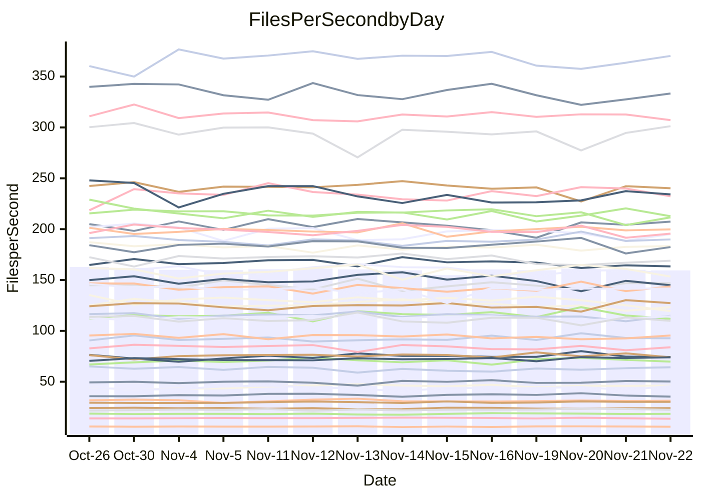

<!---
# This file is auto-generated. Do not edit.
# cspell:disable
--->
# Performance Report

## Daily Performance

```mermaid
xychart-beta
    title Files Per Second by Day
    y-axis Files per Second
    x-axis Date [Oct-26, Oct-30, Nov-4, Nov-5, Nov-11, Nov-12, Nov-13, Nov-14, Nov-15, Nov-16, Nov-19, Nov-20, Nov-21, Nov-22]
    bar [162.88, 161.94, 160.02, 159.72, 160.65, 161.35, 160.47, 159.54, 154.79, 160.46, 159.61, 161.30, 160.06, 159.48]
    line [35.82, 35.71, 36.86, 36.50, 38.05, 38.19, 36.99, 35.25, 37.09, 37.76, 37.04, 38.77, 36.43, 35.38]
    line [6.03, 5.80, 6.05, 5.91, 5.92, 6.05, 6.23, 5.47, 5.95, 5.52, 6.13, 6.21, 6.06, 5.81]
    line [144.85, 145.45, 142.42, 149.63, 145.08, 140.78, 151.35, 139.20, 143.75, 147.85, 144.42, 140.89, 146.99, 146.85]
    line [18.63, 18.25, 18.44, 18.38, 18.23, 18.67, 17.83, 17.56, 18.43, 19.15, 18.91, 18.65, 18.27, 18.46]
    line [24.17, 24.43, 23.95, 24.20, 23.49, 24.08, 23.00, 23.06, 24.50, 24.34, 23.62, 23.53, 24.02, 24.04]
    line [90.60, 95.53, 91.04, 92.11, 93.46, 89.53, 90.84, 91.64, 91.15, 95.31, 91.02, 97.72, 93.01, 92.81]
    line [14.02, 13.97, 14.18, 14.33, 14.26, 14.23, 14.49, 14.71, 14.55, 14.39, 13.95, 14.60, 14.17, 13.61]
    line [164.80, 170.61, 165.61, 166.70, 169.45, 169.81, 163.46, 172.46, 167.41, 168.34, 167.09, 161.78, 164.45, 163.39]
    line [44.31, 42.25, 43.22, 43.49, 45.34, 46.46, 47.61, 46.36, 45.42, 47.07, 44.45, 46.03, 45.93, 46.17]
    line [44.42, 42.24, 42.88, 45.37, 46.20, 44.50, 43.23, 40.60, 44.15, 43.48, 43.70, 44.83, 41.94, 45.73]
    line [204.98, 198.27, 207.58, 199.26, 209.84, 202.01, 209.99, 206.66, 203.31, 199.00, 191.59, 206.65, 204.27, 207.43]
    line [95.45, 97.05, 93.17, 96.79, 91.80, 95.95, 95.87, 94.48, 96.44, 92.65, 94.10, 91.76, 92.63, 95.44]
    line [21.78, 22.12, 22.59, 22.34, 23.16, 21.54, 22.68, 21.85, 22.43, 22.45, 22.56, 23.60, 23.23, 22.36]
    line [67.00, 69.09, 70.86, 69.37, 70.88, 73.81, 71.09, 69.11, 71.10, 66.81, 72.11, 73.56, 71.52, 69.76]
    line [242.41, 246.20, 236.64, 241.81, 241.59, 241.14, 243.55, 247.17, 242.91, 239.70, 241.02, 227.21, 242.23, 240.21]
    line [65.07, 62.75, 64.51, 61.69, 64.67, 63.79, 59.02, 62.70, 60.80, 59.91, 63.00, 61.76, 63.34, 64.22]
    line [310.93, 322.55, 309.17, 313.73, 314.69, 307.18, 306.00, 312.70, 310.78, 315.06, 310.37, 312.90, 312.74, 307.20]
    line [76.44, 72.80, 69.62, 72.93, 75.62, 73.39, 77.86, 75.46, 75.53, 74.48, 74.42, 80.12, 74.68, 74.32]
    line [125.04, 131.49, 128.05, 124.13, 124.73, 125.27, 128.39, 131.06, 126.59, 126.76, 123.53, 124.94, 119.79, 123.33]
    line [201.96, 205.39, 201.71, 188.42, 200.46, 201.07, 189.10, 190.06, 197.82, 199.09, 198.24, 196.06, 188.63, 195.05]
    line [49.37, 49.99, 48.68, 50.03, 50.42, 49.00, 46.22, 50.88, 49.95, 51.56, 48.83, 49.01, 50.78, 50.30]
    line [201.31, 195.27, 197.35, 200.31, 199.19, 197.63, 196.85, 205.77, 192.52, 197.76, 200.10, 202.32, 198.81, 199.83]
    line [172.42, 163.25, 173.61, 171.18, 172.63, 173.35, 172.14, 176.09, 170.54, 174.05, 165.70, 164.60, 166.98, 168.94]
    line [112.16, 115.50, 114.45, 114.87, 117.85, 109.38, 119.29, 116.46, 115.59, 118.49, 113.54, 123.36, 115.17, 111.79]
    line [76.18, 72.03, 75.21, 76.09, 76.34, 76.58, 74.79, 76.80, 76.30, 73.76, 78.85, 74.91, 77.93, 74.04]
    line [116.53, 117.43, 111.89, 115.01, 116.13, 115.22, 119.08, 113.54, 116.51, 115.21, 113.92, 114.16, 109.46, 114.96]
    line [196.07, 204.60, 201.12, 199.63, 197.18, 194.05, 198.31, 204.17, 202.23, 197.34, 197.09, 203.42, 191.56, 195.57]
    line [70.57, 73.22, 72.23, 71.32, 71.25, 71.08, 73.06, 72.16, 72.33, 73.39, 70.13, 74.26, 73.25, 74.02]
    line [135.21, 125.70, 130.73, 132.76, 130.23, 128.16, 133.01, 129.97, 132.49, 129.80, 133.61, 130.16, 125.21, 119.39]
    line [112.63, 110.40, 113.53, 112.85, 114.15, 114.65, 113.36, 112.62, 114.36, 114.33, 111.99, 110.22, 112.37, 114.31]
    line [339.82, 342.79, 342.26, 331.64, 327.21, 343.58, 331.81, 327.76, 336.79, 342.94, 331.62, 322.15, 327.54, 333.35]
    line [31.78, 32.41, 31.83, 29.14, 30.76, 32.43, 33.35, 30.87, 30.71, 30.55, 30.97, 31.56, 31.09, 31.34]
    line [300.22, 304.34, 292.89, 299.81, 300.08, 293.90, 270.62, 297.75, 295.78, 293.19, 296.08, 277.37, 294.62, 301.20]
    line [215.49, 219.14, 217.54, 217.64, 213.57, 213.32, 216.11, 216.43, 209.55, 217.83, 207.54, 213.34, 220.45, 212.72]
    line [29.41, 29.14, 29.07, 29.19, 29.96, 30.60, 29.98, 29.13, 30.65, 29.20, 29.66, 30.68, 30.21, 30.24]
    line [191.17, 193.23, 189.38, 187.47, 183.93, 189.93, 188.83, 183.53, 188.50, 187.66, 189.71, 197.63, 188.37, 189.89]
    line [218.53, 239.32, 235.17, 233.67, 245.24, 236.50, 233.98, 229.39, 228.12, 237.34, 232.45, 241.31, 240.00, 232.34]
    line [149.93, 153.73, 146.39, 151.10, 147.79, 148.60, 155.08, 157.59, 150.36, 154.26, 148.98, 139.01, 149.20, 144.84]
    line [187.18, 183.23, 185.22, 182.14, 183.42, 176.89, 184.07, 179.92, 182.71, 181.97, 184.63, 178.93, 182.57, 183.38]
    line [161.40, 160.02, 163.60, 155.05, 157.20, 162.55, 165.62, 162.61, 162.23, 156.96, 154.28, 159.13, 159.89, 156.21]
    line [184.23, 177.36, 184.49, 185.72, 182.94, 188.28, 187.98, 181.73, 181.49, 184.66, 187.81, 191.42, 176.14, 182.40]
    line [146.69, 146.59, 140.40, 143.02, 143.74, 136.69, 145.20, 142.11, 138.52, 142.01, 139.48, 148.36, 139.11, 143.68]
    line [113.80, 114.69, 109.15, 112.48, 109.72, 110.55, 118.02, 109.29, 108.02, 112.93, 112.97, 105.44, 113.26, 109.80]
    line [229.01, 220.21, 215.36, 210.66, 218.14, 212.13, 216.95, 216.28, 218.40, 219.59, 212.75, 216.58, 203.96, 211.61]
    line [124.19, 127.28, 126.86, 123.18, 120.25, 124.45, 125.35, 124.99, 127.41, 122.93, 123.56, 118.96, 130.24, 127.33]
    line [360.33, 349.95, 376.67, 367.68, 370.64, 374.87, 367.41, 370.51, 370.21, 374.24, 360.74, 357.55, 363.60, 370.27]
    line [82.78, 86.40, 85.26, 84.18, 85.13, 86.07, 79.22, 86.18, 84.80, 82.10, 81.80, 85.25, 80.99, 83.88]
    line [247.95, 245.41, 221.31, 234.75, 242.27, 242.37, 232.19, 225.67, 233.72, 226.18, 226.48, 228.27, 237.35, 234.15]
    line [161.82, 160.48, 151.46, 156.36, 158.02, 161.56, 165.28, 150.34, 161.29, 153.65, 159.58, 164.91, 160.94, 153.40]
    line [146.14, 142.74, 143.48, 140.52, 140.72, 142.75, 136.72, 140.92, 127.38, 142.26, 140.32, 141.64, 141.43, 141.73]
```

## Time to Process Files

| Repository                                      | Elapsed | Min/Avg/Max           |    SD | SD Graph                |
| ----------------------------------------------- | ------: | :-------------------: | ----: | ----------------------- |
| AdaDoom3/AdaDoom3                    |    3.36 | 3.3 /   3.5 /   3.7   |  0.09 | `     ┣━●━━╋━━┻━┫     ` |
| alexiosc/megistos                    |    7.84 | 7.3 /   7.8 /   8.7   |  0.32 | `    ┣━━┻━━●━━┻━━┫    ` |
| apollographql/apollo-server          |    2.84 | 2.6 /   2.8 /   3.2   |  0.12 | `     ┣━┻━━╋━●┻━┫     ` |
| aspnetboilerplate/aspnetboilerplate  |   10.62 | 10.3 /  10.7 /  11.8  |  0.34 | `    ┣━━┻━●╋━━┻━━┫    ` |
| aws-amplify/docs                     |   13.43 | 12.4 /  13.3 /  14.8  |  0.53 | `    ┣━━┻━━╋●━┻━━┫    ` |
| Azure/azure-rest-api-specs           |   10.30 | 9.6 /  10.1 /  11.2   |  0.39 | `    ┣━━┻━━╋●━┻━━┫    ` |
| bitjson/typescript-starter           |    1.08 | 1.0 /   1.1 /   1.1   |  0.03 | `     ┣━━┻━●━┻━━┫     ` |
| caddyserver/caddy                    |    3.90 | 3.4 /   3.8 /   4.0   |  0.11 | `     ┣━┻━━╋━━●━┫     ` |
| canada-ca/open-source-logiciel-libre |    1.22 | 1.1 /   1.2 /   1.3   |  0.04 | `     ┣━━┻━╋━●━━┫     ` |
| chef/chef                            |    6.05 | 5.7 /   6.0 /   6.4   |  0.16 | `    ┣━━┻━━╋●━┻━━┫    ` |
| dart-lang/sdk                        |   72.35 | 63.7 /  67.6 /  72.3  |  2.07 | `   ┣━━┻━━━╋━━━┻━━┫●  ` |
| django/django                        |   15.55 | 14.9 /  15.8 /  17.2  |  0.47 | `    ┣━━┻●━╋━━┻━━┫    ` |
| eslint/eslint                        |   11.11 | 10.6 /  11.1 /  11.8  |  0.34 | `    ┣━━┻━━●━━┻━━┫    ` |
| exonum/exonum                        |    3.70 | 3.4 /   3.7 /   4.0   |  0.13 | `     ┣━┻━━●━━┻━┫     ` |
| flutter/samples                      |   16.45 | 16.0 /  17.0 /  19.0  |  0.60 | `    ┣━━●━━╋━━┻━━┫    ` |
| gitbucket/gitbucket                  |    3.56 | 3.5 /   3.7 /   3.9   |  0.10 | `     ┣━●━━╋━━┻━┫     ` |
| googleapis/google-cloud-cpp          |  149.20 | 139.9 / 149.8 / 209.7 | 11.75 | `  ┣━━━┻━━━●━━━┻━━━┫  ` |
| graphql/express-graphql              |    1.09 | 1.1 /   1.2 /   1.3   |  0.05 | `     ┣●━┻━╋━┻━━┫     ` |
| graphql/graphql-js                   |    2.85 | 2.8 /   3.0 /   3.2   |  0.11 | `     ┣━●━━╋━━┻━┫     ` |
| graphql/graphql-relay-js             |    1.20 | 1.1 /   1.2 /   1.2   |  0.03 | `     ┣━━┻━╋━┻●━┫     ` |
| graphql/graphql-spec                 |    1.49 | 1.3 /   1.3 /   1.4   |  0.03 | `     ┣━━┻━╋━┻━━┫    ●` |
| iluwatar/java-design-patterns        |   14.36 | 12.6 /  13.3 /  14.4  |  0.40 | `    ┣━━┻━━╋━━┻━━┫ ●  ` |
| ktaranov/sqlserver-kit               |    6.70 | 6.5 /   6.8 /   7.3   |  0.19 | `    ┣━━┻●━╋━━┻━━┫    ` |
| liriliri/licia                       |    4.49 | 4.1 /   4.3 /   4.6   |  0.12 | `     ┣━┻━━╋━━┻●┫     ` |
| MartinThoma/LaTeX-examples           |    7.44 | 6.8 /   7.1 /   7.9   |  0.26 | `    ┣━━┻━━╋━━┻●━┫    ` |
| mdx-js/mdx                           |    2.02 | 1.9 /   2.0 /   2.2   |  0.07 | `     ┣━┻━━╋●━┻━┫     ` |
| microsoft/TypeScript-Website         |    6.76 | 5.5 /   5.8 /   6.5   |  0.19 | `      ┣━┻━╋━┻━┫     ●` |
| MicrosoftDocs/PowerShell-Docs        |   26.14 | 22.9 /  24.3 /  26.2  |  0.81 | `    ┣━━┻━━╋━━┻━━┫●   ` |
| neovim/nvim-lspconfig                |    4.54 | 4.3 /   4.5 /   4.7   |  0.10 | `     ┣━┻━━╋━●┻━┫     ` |
| pagekit/pagekit                      |    3.58 | 3.5 /   3.7 /   4.3   |  0.15 | `     ┣━┻━●╋━━┻━┫     ` |
| php/php-src                          |   26.27 | 25.9 /  27.1 /  29.3  |  0.88 | `   ┣━━━●━━╋━━┻━━━┫   ` |
| plasticrake/tplink-smarthome-api     |    1.38 | 1.3 /   1.4 /   1.5   |  0.05 | `     ┣━┻━━●━━┻━┫     ` |
| prettier/prettier                    |    7.76 | 7.2 /   7.8 /   8.3   |  0.18 | `    ┣━━┻━━●━━┻━━┫    ` |
| pycontribs/jira                      |    1.58 | 1.5 /   1.6 /   1.7   |  0.07 | `     ┣━┻━━●━━┻━┫     ` |
| RustPython/RustPython                |    5.76 | 5.2 /   5.6 /   6.0   |  0.23 | `    ┣━━┻━━╋━━●━━┫    ` |
| shoelace-style/shoelace              |    2.98 | 2.9 /   3.0 /   3.2   |  0.09 | `     ┣━┻●━╋━━┻━┫     ` |
| slint-ui/slint                       |   14.34 | 13.3 /  13.9 /  15.0  |  0.38 | `    ┣━━┻━━╋━━┻●━┫    ` |
| SoftwareBrothers/admin-bro           |    2.78 | 2.5 /   2.6 /   2.8   |  0.06 | `     ┣━┻━━╋━━┻━┫●    ` |
| sveltejs/svelte                      |   22.02 | 20.8 /  21.9 /  22.9  |  0.48 | `    ┣━━┻━━╋●━┻━━┫    ` |
| TheAlgorithms/Python                 |    5.74 | 5.6 /   5.8 /   6.2   |  0.13 | `    ┣━━┻━●╋━━┻━━┫    ` |
| twbs/bootstrap                       |    1.84 | 1.8 /   1.9 /   2.4   |  0.11 | `     ┣━┻━●╋━━┻━┫     ` |
| typescript-cheatsheets/react         |    1.43 | 1.3 /   1.4 /   1.6   |  0.06 | `     ┣━┻━━●━━┻━┫     ` |
| typescript-eslint/typescript-eslint  |    4.23 | 4.2 /   4.4 /   4.7   |  0.12 | `     ┣━●━━╋━━┻━┫     ` |
| vitest-dev/vitest                    |    9.92 | 9.2 /   9.9 /  10.9   |  0.45 | `    ┣━━┻━━●━━┻━━┫    ` |
| w3c/aria-practices                   |    3.70 | 3.4 /   3.6 /   3.8   |  0.10 | `     ┣━┻━━╋━●┻━┫     ` |
| w3c/specberus                        |    2.00 | 2.0 /   2.1 /   2.2   |  0.06 | `     ┣●┻━━╋━━┻━┫     ` |
| webdeveric/webpack-assets-manifest   |    1.22 | 1.2 /   1.2 /   1.4   |  0.05 | `     ┣━━┻●╋━┻━━┫     ` |
| webpack/webpack                      |    5.66 | 5.5 /   5.8 /   6.7   |  0.23 | `    ┣━━┻●━╋━━┻━━┫    ` |
| wireapp/wire-desktop                 |    1.37 | 1.3 /   1.5 /   1.7   |  0.09 | `     ┣━┻●━╋━━┻━┫     ` |
| wireapp/wire-webapp                  |   11.12 | 10.6 /  11.2 /  12.6  |  0.52 | `    ┣━━┻━●╋━━┻━━┫    ` |

Note:
- Elapsed time is in seconds.

## Files per Second over Time

| Repository                                      | Files |    Sec |    Fps |     Rel | Trend Fps              |    N |
| ----------------------------------------------- | ----: | -----: | -----: | ------: | ---------------------- | ---: |
| AdaDoom3/AdaDoom3                    |   103 |   3.36 |  30.62 |   2.78% | `▇▄▇▆▇▆▅▇█▆▅▆▅▇▅▇▇▆▆▇` |   30 |
| alexiosc/megistos                    |   583 |   7.84 |  74.41 |  -0.16% | `▇▆▆▆▄▇▆▅▇▇▆▆▆▆▅█▆▆▆▆` |   30 |
| apollographql/apollo-server          |   253 |   2.84 |  89.03 |  -3.32% | `▇▆▇▇▃▆▆▇▇▅▇▆▆█▆█▇▇█▆` |   30 |
| aspnetboilerplate/aspnetboilerplate  |  2286 |  10.62 | 215.34 |   0.54% | `▇▆▄██▇▇▅█▅▇▆▆▆▅▇██▆▇` |   30 |
| aws-amplify/docs                     |  2871 |  13.43 | 213.73 |  -0.81% | `█▅▆▆▆▇▇██▆█▇▇▇▅▇▄▆▆▇` |   30 |
| Azure/azure-rest-api-specs           |  2365 |  10.30 | 229.62 |  -2.40% | `███▇█▆▅▆▇▇▅▃▇▄▇▆▇▆▇▆` |   30 |
| bitjson/typescript-starter           |    20 |   1.08 |  18.49 |   0.08% | `▅▇▇▇▆▅▄▆▇▆██▆▇█▇▅▆▆▆` |   30 |
| caddyserver/caddy                    |   288 |   3.90 |  73.88 |  -3.16% | `▅▅▆▄▆▅▅▅▅▅▄▅▆▆█▅▆▆▄▄` |   30 |
| canada-ca/open-source-logiciel-libre |     7 |   1.22 |   5.76 |  -3.72% | `▄▇▆█▅▇▃▆▅▇▄▆▇▇█▇▆▇▆▅` |   30 |
| chef/chef                            |  1191 |   6.05 | 196.96 |  -0.97% | `█▆▅▇█▆█▆▇▄▆▇▇█▇▇█▅▇▆` |   30 |
| dart-lang/sdk                        | 10778 |  72.35 | 148.96 |  -6.30% | `▇▆▇▇▇█▄▆█▇▅▅▇▇███▆▆▄` |   30 |
| django/django                        |  2885 |  15.55 | 185.53 |   1.52% | `▇▇▆▆▄▇▆▆█▅▆▇▇▇▅▆▇▆▆▇` |   30 |
| eslint/eslint                        |  2089 |  11.11 | 188.03 |  -0.47% | `▇▄▅█▆▆▅▆▆▇▆██▅▆█▅▇▇▆` |   30 |
| exonum/exonum                        |   421 |   3.70 | 113.93 |  -0.66% | `▇▆▆▄▃▇▆▆▆▆▇▄▆▅▆█▆▆▄▆` |   30 |
| flutter/samples                      |  2400 |  16.45 | 145.90 |   2.95% | `█▆▇▃▆▇▇▅▇▆▇█▅▅▆█▇▆▇█` |   30 |
| gitbucket/gitbucket                  |   413 |   3.56 | 116.09 |   2.68% | `█▆█▆▇▇▆▅▇█▇▆▄▇▇▅▆▆▆▇` |   30 |
| googleapis/google-cloud-cpp          | 20955 | 149.20 | 140.45 |   0.05% | `██▇██▇▇▂█▇█▇▇█▇██▇█▇` |   30 |
| graphql/express-graphql              |    26 |   1.09 |  23.83 |   6.45% | `█▆▃▄▅▆▅▄▅▇▅▃▇▅▇▇▇▆▃▇` |   30 |
| graphql/graphql-js                   |   368 |   2.85 | 129.06 |   3.66% | `▄▇▇▇▄▆▆▇▇▇▆▇▄▇▆▅▇█▇▇` |   30 |
| graphql/graphql-relay-js             |    28 |   1.20 |  23.26 |  -2.96% | `▆▆▇▇▆▅▅▇██▇▅▄█▇▆▆▇█▅` |   30 |
| graphql/graphql-spec                 |    19 |   1.49 |  12.78 | -10.36% | `▆▇█▅▆▇██▇█▇▅▅▇▆█▆▇▇▃` |   30 |
| iluwatar/java-design-patterns        |  1992 |  14.36 | 138.69 |  -7.38% | `▆▆▅▆▇██▇▇▆▇▇▇▆▆▄▆▇▇▄` |   30 |
| ktaranov/sqlserver-kit               |   489 |   6.70 |  72.95 |   1.62% | `▅▆█▆▅▇▇▇▆▇▇█▆▄▅█▇██▇` |   30 |
| liriliri/licia                       |  1437 |   4.49 | 320.01 |  -4.46% | `█▆▇██▆▆▆▇██▅▇▇▆▅▆▆█▅` |   30 |
| MartinThoma/LaTeX-examples           |  1409 |   7.44 | 189.38 |  -4.52% | `▆▆█▆▃▇█▇▇█▆▇▇▆▅▇▇▄▇▅` |   30 |
| mdx-js/mdx                           |   141 |   2.02 |  69.92 |  -0.97% | `▇▆███▇▆▇▅█▅▆▇█▇██▆▆▆` |   30 |
| microsoft/TypeScript-Website         |   761 |   6.76 | 112.60 | -14.06% | `▆▇█▃▇▇▆▇▇▇▆▇▇▇█▆▄▆▅▂` |   30 |
| MicrosoftDocs/PowerShell-Docs        |  2708 |  26.14 | 103.60 |  -7.20% | `▅▆█▆▄█▅▅▄▅▇▆▆▇▆▄▆▇█▄` |   30 |
| neovim/nvim-lspconfig                |   760 |   4.54 | 167.40 |  -1.84% | `▇█▇▇█▇█▆▇▇█▆▅▅▆▅▆▆▇▆` |   30 |
| pagekit/pagekit                      |   741 |   3.58 | 206.97 |   2.19% | `▇█▇▇▆█▇▇▇▆▆▃▇▆▅▇█▆▇▇` |   30 |
| php/php-src                          |  2262 |  26.27 |  86.11 |   2.77% | `▇▇██▇▅███▅▆▄▆▆▇▇▆▅▆█` |   30 |
| plasticrake/tplink-smarthome-api     |    62 |   1.38 |  45.06 |   0.04% | `█▆▇▇▇█▇▇▅▇█▅▆▇▆▇▆▇█▆` |   30 |
| prettier/prettier                    |  2426 |   7.76 | 312.77 |   0.44% | `███▄▇▆▇▇█▇██▇▇▇▇█▇▆▇` |   30 |
| pycontribs/jira                      |    79 |   1.58 |  49.91 |   0.56% | `▇▅▅▅▇▄▇▇▆▅▇▄▆█▃▅▆▇▆▆` |   30 |
| RustPython/RustPython                |   703 |   5.76 | 121.98 |  -2.64% | `▇▄▆▇▇▇█▇▇▇▇▅▆▇▇▆▅▅▆▆` |   30 |
| shoelace-style/shoelace              |   439 |   2.98 | 147.49 |   1.73% | `▆▆▄▆▆█▅▆▅▇▇▇▆▇▄▅▇▇▇▇` |   30 |
| slint-ui/slint                       |  2570 |  14.34 | 179.21 |  -2.87% | `▆▇█▇▇▇▆▅▆▇▇▇▆█▇█▄▆▇▆` |   30 |
| SoftwareBrothers/admin-bro           |   441 |   2.78 | 158.53 |  -5.16% | `▆▇█▇█▆██▇▇▇█▇▆▆▅█▄▇▅` |   30 |
| sveltejs/svelte                      |  8068 |  22.02 | 366.37 |  -0.23% | `▇█▇▇▇▆▇▆▆█▇▆▆▆▅▅▆▆▇▆` |   30 |
| TheAlgorithms/Python                 |  1399 |   5.74 | 243.80 |   1.11% | `▆█▅██▇█▇▆█▆▆▆▇▇▄▇▇▆▇` |   30 |
| twbs/bootstrap                       |   118 |   1.84 |  64.03 |   1.73% | `█▇▇█▇▅▇██▂▆▅▇██▆▆█▇▇` |   30 |
| typescript-cheatsheets/react         |    53 |   1.43 |  37.09 |   0.59% | `▆▇▆▇█▆▄▆▆▆▆▄▆▆▇▇▅▆▃▆` |   30 |
| typescript-eslint/typescript-eslint  |  1290 |   4.23 | 305.29 |   3.27% | `█▇▆▆█▄▇▇▆▇▆▇▇▇▇▅▆▇▇█` |   30 |
| vitest-dev/vitest                    |  2338 |   9.92 | 235.60 |   0.82% | `▇█▆▆▇▆▆▄▅▇▇▇▆▄▇▇▇▇▆▆` |   30 |
| w3c/aria-practices                   |   414 |   3.70 | 111.98 |  -2.59% | `█▅▇▇▅█▆█▆▆▆▇█▄▆▆▅▄▇▅` |   30 |
| w3c/specberus                        |   197 |   2.00 |  98.55 |   4.17% | `▇▅▇▇█▇▇█▇▇▆▇▇▅▇▅▄█▆█` |   30 |
| webdeveric/webpack-assets-manifest   |    55 |   1.22 |  45.05 |   2.03% | `▆█▅▆▇▅▃█▅▄▅▆▄▅▆▆▄▅▇▆` |   30 |
| webpack/webpack                      |  1143 |   5.66 | 201.81 |   2.63% | `█▇▇█▇▆▆▇▇▇▇▆▇▇▇▇▆▅▅▇` |   30 |
| wireapp/wire-desktop                 |    43 |   1.37 |  31.31 |   0.62% | `▆▆▇█▇█▆▅█▅▆▇▇▄▇▇▇▆▇▆` |   30 |
| wireapp/wire-webapp                  |  1783 |  11.12 | 160.29 |   0.79% | `▄▇█▅██▇▇▇█▆▇▇▃▅▇▆▇▅▇` |   30 |

## Data Throughput

| Repository                                      | Files |    Sec |     Kps |     Rel | Trend Kps              |    N |
| ----------------------------------------------- | ----: | -----: | ------: | ------: | ---------------------- | ---: |
| AdaDoom3/AdaDoom3                    |   103 |   3.36 |  650.83 |   2.78% | `▇▄▇▆▇▆▅▇█▆▅▆▅▇▅▇▇▆▆▇` |   30 |
| alexiosc/megistos                    |   583 |   7.84 |  584.67 |  -0.16% | `▇▆▆▆▄▇▆▅▇▇▆▆▆▆▅█▆▆▆▆` |   30 |
| apollographql/apollo-server          |   253 |   2.84 |  727.35 |  -3.16% | `▇▆▇▇▃▆▆▇▇▅▇▆▆█▆█▇▇█▆` |   30 |
| aspnetboilerplate/aspnetboilerplate  |  2286 |  10.62 |  523.93 |   0.54% | `▇▆▄██▇▇▅█▅▇▆▆▆▅▇██▆▇` |   30 |
| aws-amplify/docs                     |  2871 |  13.43 |  745.94 |  -0.83% | `█▅▆▆▆▇▇██▆█▇▇▇▅▇▄▆▆▇` |   30 |
| Azure/azure-rest-api-specs           |  2365 |  10.30 |  624.77 |  -2.11% | `███▇█▆▅▆▇▇▅▃▇▄▇▆▇▇▇▆` |   30 |
| bitjson/typescript-starter           |    20 |   1.08 |   73.97 |   0.08% | `▅▇▇▇▆▅▄▆▇▆██▆▇█▇▅▆▆▆` |   30 |
| caddyserver/caddy                    |   288 |   3.90 |  641.56 |  -3.08% | `▅▅▆▄▆▅▅▅▅▅▄▅▆▆█▅▆▆▄▄` |   30 |
| canada-ca/open-source-logiciel-libre |     7 |   1.22 |   47.69 |  -3.72% | `▄▇▆█▅▇▃▆▅▇▄▆▇▇█▇▆▇▆▅` |   30 |
| chef/chef                            |  1191 |   6.05 |  914.52 |  -0.83% | `█▆▅▇█▆█▆▇▄▆▇▇█▇▇█▅▇▆` |   30 |
| dart-lang/sdk                        | 10778 |  72.35 | 1018.35 |  -6.13% | `▇▆▇▇▇█▅▆█▇▅▅▇▇███▆▆▄` |   30 |
| django/django                        |  2885 |  15.55 | 1164.79 |   1.48% | `▇▇▆▆▄▇▆▆█▅▆▇▇▇▅▆▇▆▆▇` |   30 |
| eslint/eslint                        |  2089 |  11.11 | 1275.97 |  -4.52% | `▇▅▆█▇▇▆▆▆▇▇▆▆▃▅▆▄▆▅▅` |   30 |
| exonum/exonum                        |   421 |   3.70 | 1089.78 |  -0.66% | `▇▆▆▄▃▇▆▆▆▆▇▄▆▅▆█▆▆▄▆` |   30 |
| flutter/samples                      |  2400 |  16.45 | 1301.96 |   2.95% | `█▆▇▃▆▇▇▅▇▆▇█▅▅▆█▇▆▇█` |   30 |
| gitbucket/gitbucket                  |   413 |   3.56 |  527.62 |   2.68% | `█▆█▆▇▇▆▅▇█▇▆▄▇▇▅▆▆▆▇` |   30 |
| googleapis/google-cloud-cpp          | 20955 | 149.20 | 1144.18 |   0.20% | `██▇██▇▇▂█▇█▇▇█▇██▇█▇` |   30 |
| graphql/express-graphql              |    26 |   1.09 |  109.07 |   6.45% | `█▆▃▄▅▆▅▄▅▇▅▃▇▅▇▇▇▆▃▇` |   30 |
| graphql/graphql-js                   |   368 |   2.85 |  749.13 |   3.72% | `▄▇▇▇▄▆▆▇▇▇▆▇▄▇▆▅▇█▇▇` |   30 |
| graphql/graphql-relay-js             |    28 |   1.20 |   91.39 |  -2.96% | `▆▆▇▇▆▅▅▇██▇▅▄█▇▆▆▇█▅` |   30 |
| graphql/graphql-spec                 |    19 |   1.49 |  426.33 | -10.36% | `▆▇█▅▆▇██▇█▇▅▅▇▆█▆▇▇▃` |   30 |
| iluwatar/java-design-patterns        |  1992 |  14.36 |  428.66 |  -7.38% | `▆▆▅▆▇██▇▇▆▇▇▇▆▆▄▆▇▇▄` |   30 |
| ktaranov/sqlserver-kit               |   489 |   6.70 | 1104.73 |   1.62% | `▅▆█▆▅▇▇▇▆▇▇█▆▄▅█▇██▇` |   30 |
| liriliri/licia                       |  1437 |   4.49 |  381.26 |  -4.46% | `█▆▇██▆▆▆▇██▅▇▇▆▅▆▆█▅` |   30 |
| MartinThoma/LaTeX-examples           |  1409 |   7.44 |  391.13 |  -4.52% | `▆▆█▆▃▇█▇▇█▆▇▇▆▅▇▇▄▇▅` |   30 |
| mdx-js/mdx                           |   141 |   2.02 |  325.32 |  -0.97% | `▇▆███▇▆▇▅█▅▆▇█▇██▆▆▆` |   30 |
| microsoft/TypeScript-Website         |   761 |   6.76 |  778.85 | -14.06% | `▆▇█▃▇▇▆▇▇▇▆▇▇▇█▆▄▆▅▂` |   30 |
| MicrosoftDocs/PowerShell-Docs        |  2708 |  26.14 | 1066.81 |  -7.19% | `▅▆█▆▄█▅▅▄▅▇▆▆▇▆▄▆▇█▄` |   30 |
| neovim/nvim-lspconfig                |   760 |   4.54 |  310.79 |   5.92% | `▅▆▅▅▆▅▆▄▅▅▅█▇▇▇▇▇▇██` |   30 |
| pagekit/pagekit                      |   741 |   3.58 |  431.53 |   2.19% | `▇█▇▇▆█▇▇▇▆▆▃▇▆▅▇█▆▇▇` |   30 |
| php/php-src                          |  2262 |  26.27 | 1509.60 |   2.91% | `▇▇██▇▅███▅▆▄▆▆▇▇▆▅▆█` |   30 |
| plasticrake/tplink-smarthome-api     |    62 |   1.38 |  243.47 |   0.04% | `█▆▇▇▇█▇▇▅▇█▅▆▇▆▇▆▇█▆` |   30 |
| prettier/prettier                    |  2426 |   7.76 |  433.69 |   0.22% | `███▄▇▆▇▇█▇██▇▇▆▇█▇▆▇` |   30 |
| pycontribs/jira                      |    79 |   1.58 |  353.77 |   0.56% | `▇▅▅▅▇▄▇▇▆▅▇▄▆█▃▅▆▇▆▆` |   30 |
| RustPython/RustPython                |   703 |   5.76 | 1245.49 |  13.44% | `▄▃▃▄▄▄▅▄▄▄▄▇████▇▇█▇` |   30 |
| shoelace-style/shoelace              |   439 |   2.98 |  712.60 |   1.73% | `▆▆▄▆▆█▅▆▅▇▇▇▆▇▄▅▇▇▇▇` |   30 |
| slint-ui/slint                       |  2570 |  14.34 | 1109.62 |  -2.54% | `▆▇█▇▇▇▆▅▆▇▇▇▆█▇█▄▆▇▆` |   30 |
| SoftwareBrothers/admin-bro           |   441 |   2.78 |  349.41 |  -5.16% | `▆▇█▇█▆██▇▇▇█▇▆▆▅█▄▇▅` |   30 |
| sveltejs/svelte                      |  8068 |  22.02 |  244.31 |  -0.28% | `▇█▇▇▇▆▇▆▆█▇▆▆▆▅▅▆▆▇▆` |   30 |
| TheAlgorithms/Python                 |  1399 |   5.74 |  620.03 |   1.11% | `▆█▅██▇█▇▆█▆▆▆▇▇▄▇▇▆▇` |   30 |
| twbs/bootstrap                       |   118 |   1.84 |  525.76 |   1.77% | `█▇▇█▇▅▇██▂▆▅▇██▆▆█▇▇` |   30 |
| typescript-cheatsheets/react         |    53 |   1.43 |  274.35 |   0.59% | `▆▇▆▇█▆▄▆▆▆▆▄▆▆▇▇▅▆▃▆` |   30 |
| typescript-eslint/typescript-eslint  |  1290 |   4.23 | 1576.37 |   3.48% | `█▇▆▆█▄▇▇▆▇▆▇▇▇▇▅▆█▇█` |   30 |
| vitest-dev/vitest                    |  2338 |   9.92 |  506.16 |  -0.39% | `▆█▆▅▇▆▅▃▅▇▆▇▅▃▇▇▇▇▅▆` |   30 |
| w3c/aria-practices                   |   414 |   3.70 | 1044.08 |  -2.59% | `█▅▇▇▅█▆█▆▆▆▇█▄▆▆▅▄▇▅` |   30 |
| w3c/specberus                        |   197 |   2.00 |  311.66 |   4.17% | `▇▅▇▇█▇▇█▇▇▆▇▇▅▇▅▄█▆█` |   30 |
| webdeveric/webpack-assets-manifest   |    55 |   1.22 |  104.02 |   2.03% | `▆█▅▆▇▅▃█▅▄▅▆▄▅▆▆▄▅▇▆` |   30 |
| webpack/webpack                      |  1143 |   5.66 |  921.67 |   2.90% | `█▇▇█▇▆▆▇▇▇▇▆▇▇▇▇▆▅▅▇` |   30 |
| wireapp/wire-desktop                 |    43 |   1.37 |  138.34 | -15.72% | `▆▇██▇█▇▆█▆▇▃▄▂▃▃▃▃▃▃` |   30 |
| wireapp/wire-webapp                  |  1783 |  11.12 |  593.51 |   0.94% | `▄▇█▅██▇▇▇█▆▇▇▃▅▇▆▇▅▇` |   30 |

