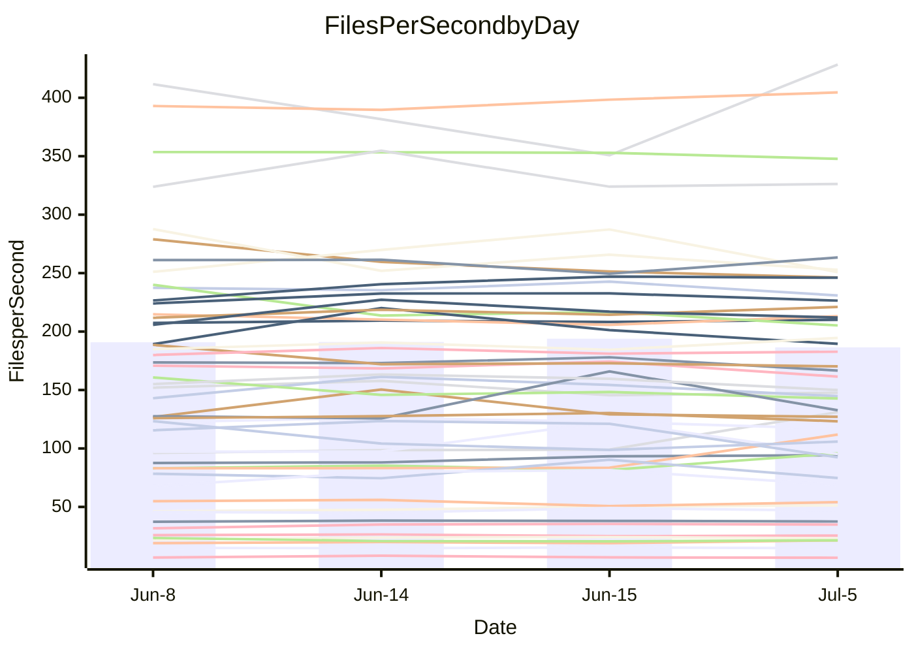

<!---
# This file is auto-generated. Do not edit.
# cspell:disable
--->
# Performance Report

Daily Performance

```mermaid
xychart-beta
    title Files Per Second by Day
    y-axis Files per Second
    x-axis Date [Jun-8, Jun-14, Jun-15, Jul-5]
    bar [190.81, 191.12, 193.90, 186.44]
    line [87.60, 88.07, 93.31, 94.23]
    line [19.01, 19.91, 18.97, 21.44]
    line [96.25, 98.55, 99.04, 131.09]
    line [83.02, 85.34, 81.59, 95.84]
    line [278.90, 259.60, 251.39, 246.20]
    line [237.41, 235.41, 242.68, 230.86]
    line [6.70, 8.24, 6.81, 6.52]
    line [207.37, 209.33, 208.22, 210.06]
    line [251.08, 269.77, 287.34, 250.80]
    line [122.50, 126.17, 122.75, 116.89]
    line [37.33, 38.26, 38.06, 37.52]
    line [214.78, 210.20, 205.78, 213.12]
    line [151.99, 157.77, 145.55, 147.67]
    line [240.01, 213.64, 216.83, 205.22]
    line [126.80, 150.40, 129.14, 127.10]
    line [142.96, 161.35, 154.33, 144.69]
    line [25.84, 26.48, 25.01, 25.48]
    line [189.21, 220.12, 201.30, 189.52]
    line [21.85, 23.82, 24.25, 23.14]
    line [15.02, 14.65, 15.42, 14.57]
    line [173.63, 173.03, 177.99, 166.62]
    line [83.05, 83.17, 83.60, 111.89]
    line [411.63, 381.64, 350.78, 428.40]
    line [160.74, 145.81, 148.34, 142.72]
    line [211.77, 218.65, 214.39, 221.04]
    line [78.36, 74.53, 90.33, 74.73]
    line [170.78, 168.46, 174.35, 161.44]
    line [224.05, 232.54, 232.69, 226.47]
    line [46.28, 47.54, 50.24, 51.30]
    line [97.18, 97.48, 122.92, 95.17]
    line [127.50, 125.76, 165.92, 132.71]
    line [54.91, 55.98, 50.73, 54.02]
    line [155.04, 163.34, 159.60, 149.95]
    line [353.54, 353.38, 352.89, 347.76]
    line [188.61, 172.10, 172.90, 170.22]
    line [115.54, 123.50, 121.07, 92.47]
    line [179.92, 185.95, 181.08, 182.76]
    line [226.60, 240.44, 247.10, 246.03]
    line [287.65, 251.95, 265.72, 252.85]
    line [67.74, 79.92, 81.44, 68.93]
    line [261.13, 261.42, 249.50, 263.35]
    line [392.96, 389.62, 398.36, 404.53]
    line [323.78, 354.69, 323.95, 326.24]
    line [23.44, 20.77, 20.56, 21.43]
    line [125.89, 127.61, 130.38, 123.24]
    line [123.34, 104.15, 98.74, 105.85]
    line [31.73, 34.98, 35.43, 34.87]
    line [205.74, 227.27, 217.03, 211.98]
    line [184.92, 190.66, 184.43, 194.55]
    line [45.74, 44.93, 49.08, 46.79]
```

Time to Process Files

| Repository                                      | Elapsed | Min/Avg/Max          |   SD | SD Graph                |
| ----------------------------------------------- | ------: | :------------------: | ---: | ----------------------- |
| AdaDoom3/AdaDoom3                    |    2.73 | 2.6 /   2.7 /   2.8  | 0.05 | `     ┣━┻━━●━━┻━┫     ` |
| alexiosc/megistos                    |    7.09 | 5.3 /   6.8 /   7.2  | 0.56 | `    ┣━━┻━━╋━●┻━━┫    ` |
| apollographql/apollo-server          |    2.62 | 1.5 /   2.5 /   2.8  | 0.36 | `    ┣━━┻━━╋●━┻━━┫    ` |
| aspnetboilerplate/aspnetboilerplate  |    9.35 | 7.3 /   8.7 /   9.2  | 0.58 | `    ┣━━┻━━╋━━●━━┫    ` |
| aws-amplify/docs                     |   12.40 | 12.2 /  12.6 /  13.3 | 0.33 | `    ┣━━┻●━╋━━┻━━┫    ` |
| Azure/azure-rest-api-specs           |    9.90 | 7.6 /   9.6 /  10.7  | 0.97 | `    ┣━━┻━━╋●━┻━━┫    ` |
| bitjson/typescript-starter           |    1.03 | 0.9 /   1.0 /   1.1  | 0.08 | `     ┣━┻━━╋●━┻━┫     ` |
| caddyserver/caddy                    |    3.40 | 3.4 /   3.5 /   3.7  | 0.10 | `     ┣●┻━━╋━━┻━┫     ` |
| canada-ca/open-source-logiciel-libre |    1.09 | 0.6 /   1.0 /   1.1  | 0.14 | `     ┣━┻━━╋━●┻━┫     ` |
| chef/chef                            |    4.93 | 4.7 /   5.0 /   5.1  | 0.14 | `    ┣━━┻━━●━━┻━━┫    ` |
| dart-lang/sdk                        |   58.40 | 44.7 /  57.7 /  70.0 | 6.66 | `  ┣━━━┻━━━●━━━┻━━━┫  ` |
| django/django                        |   14.61 | 10.4 /  13.2 /  13.9 | 1.08 | `    ┣━━┻━━╋━━┻●━┫    ` |
| eslint/eslint                        |    9.91 | 9.6 /   9.8 /  10.1  | 0.23 | `    ┣━━┻━━╋●━┻━━┫    ` |
| exonum/exonum                        |    3.66 | 3.3 /   3.4 /   3.6  | 0.10 | `     ┣━┻━━╋━━┻━┫ ●   ` |
| flutter/samples                      |   11.49 | 9.0 /  11.2 /  12.4  | 0.93 | `    ┣━━┻━━╋●━┻━━┫    ` |
| gitbucket/gitbucket                  |    3.25 | 2.5 /   3.1 /   3.4  | 0.34 | `    ┣━━┻━━╋●━┻━━┫    ` |
| googleapis/google-cloud-cpp          |  124.30 | 95.3 / 119.9 / 126.5 | 9.53 | `  ┣━━━┻━━━╋━●━┻━━━┫  ` |
| graphql/express-graphql              |    1.15 | 1.1 /   1.1 /   1.3  | 0.09 | `     ┣━┻━━╋●━┻━┫     ` |
| graphql/graphql-js                   |    3.91 | 2.6 /   3.3 /   3.8  | 0.42 | `    ┣━━┻━━╋━━┻●━┫    ` |
| graphql/graphql-relay-js             |    1.12 | 1.0 /   1.1 /   1.1  | 0.04 | `     ┣━┻━━╋━━●━┫     ` |
| graphql/graphql-spec                 |    1.27 | 1.2 /   1.3 /   1.3  | 0.04 | `     ┣━┻━●╋━━┻━┫     ` |
| iluwatar/java-design-patterns        |   12.45 | 11.6 /  12.0 /  12.6 | 0.36 | `    ┣━━┻━━╋━━●━━┫    ` |
| ktaranov/sqlserver-kit               |    3.52 | 5.8 /   5.9 /   6.0  | 0.07 | `●        ┣┻┫         ` |
| liriliri/licia                       |    3.79 | 3.0 /   3.6 /   4.1  | 0.39 | `    ┣━━┻━━╋●━┻━━┫    ` |
| MartinThoma/LaTeX-examples           |    6.02 | 6.0 /   6.2 /   6.4  | 0.17 | `    ┣━━●━━╋━━┻━━┫    ` |
| mdx-js/mdx                           |    1.84 | 1.5 /   1.8 /   1.9  | 0.11 | `     ┣━┻━━╋●━┻━┫     ` |
| microsoft/TypeScript-Website         |    5.25 | 4.1 /   5.1 /   5.6  | 0.43 | `    ┣━━┻━━╋●━┻━━┫    ` |
| MicrosoftDocs/PowerShell-Docs        |   23.54 | 18.8 /  23.8 /  26.4 | 2.14 | `   ┣━━━┻━━●━━┻━━━┫   ` |
| neovim/nvim-lspconfig                |    5.46 | 4.9 /   5.1 /   5.3  | 0.13 | `    ┣━━┻━━╋━━┻━━┫ ●  ` |
| pagekit/pagekit                      |    3.33 | 3.3 /   3.4 /   3.6  | 0.08 | `     ┣●┻━━╋━━┻━┫     ` |
| php/php-src                          |   24.81 | 18.7 /  23.0 /  24.5 | 1.73 | `   ┣━━━┻━━╋━━┻●━━┫   ` |
| plasticrake/tplink-smarthome-api     |    1.03 | 1.2 /   1.3 /   1.5  | 0.07 | `●    ┣━┻━━╋━━┻━┫     ` |
| prettier/prettier                    |    7.43 | 7.3 /   7.7 /   7.8  | 0.16 | `    ┣━●┻━━╋━━┻━━┫    ` |
| pycontribs/jira                      |    1.57 | 1.4 /   1.5 /   1.6  | 0.07 | `     ┣━┻━━╋━━┻●┫     ` |
| RustPython/RustPython                |    8.93 | 6.5 /   7.0 /   8.9  | 0.75 | `    ┣━━┻━━╋━━┻━━┫ ●  ` |
| shoelace-style/shoelace              |    2.96 | 2.7 /   2.8 /   2.9  | 0.09 | `     ┣━┻━━╋━━┻━●     ` |
| slint-ui/slint                       |   13.85 | 13.4 /  13.9 /  14.5 | 0.37 | `    ┣━━┻━●╋━━┻━━┫    ` |
| SoftwareBrothers/admin-bro           |    2.46 | 2.4 /   2.4 /   2.5  | 0.05 | `     ┣━┻━━╋━━●━┫     ` |
| sveltejs/svelte                      |   22.27 | 21.7 /  22.5 /  23.2 | 0.49 | `    ┣━━┻━●╋━━┻━━┫    ` |
| TheAlgorithms/Python                 |    5.80 | 4.1 /   5.3 /   5.7  | 0.48 | `    ┣━━┻━━╋━━●━━┫    ` |
| twbs/bootstrap                       |    1.72 | 1.3 /   1.6 /   1.8  | 0.17 | `     ┣━┻━━╋━●┻━┫     ` |
| typescript-cheatsheets/react         |    1.11 | 0.9 /   1.1 /   1.2  | 0.09 | `     ┣━┻━━●━━┻━┫     ` |
| typescript-eslint/typescript-eslint  |    3.89 | 3.1 /   4.0 /   4.3  | 0.34 | `    ┣━━┻━●╋━━┻━━┫    ` |
| vitest-dev/vitest                    |   10.22 | 10.1 /  10.4 /  10.9 | 0.25 | `    ┣━━●━━╋━━┻━━┫    ` |
| w3c/aria-practices                   |    3.54 | 3.2 /   3.3 /   3.3  | 0.04 | `       ┣┻━╋━┻┫      ●` |
| w3c/specberus                        |    1.86 | 1.2 /   1.8 /   2.0  | 0.25 | `    ┣━━┻━━●━━┻━━┫    ` |
| webdeveric/webpack-assets-manifest   |    1.17 | 1.1 /   1.2 /   1.3  | 0.06 | `     ┣━┻━●╋━━┻━┫     ` |
| webpack/webpack                      |    5.82 | 4.5 /   5.6 /   5.9  | 0.41 | `    ┣━━┻━━╋━●┻━━┫    ` |
| wireapp/wire-desktop                 |    1.27 | 1.2 /   1.3 /   1.6  | 0.10 | `     ┣━┻━●╋━━┻━┫     ` |
| wireapp/wire-webapp                  |   12.13 | 11.5 /  12.0 /  12.3 | 0.28 | `    ┣━━┻━━╋━●┻━━┫    ` |

Note:
- Elapsed time is in seconds.

Files per Second over Time

| Repository                                      | Files |    Sec |    Fps |     Rel | Trend Fps   |    N |
| ----------------------------------------------- | ----: | -----: | -----: | ------: | ----------- | ---: |
| AdaDoom3/AdaDoom3                    |   103 |   2.73 |  37.70 |  -0.20% | `▅▇▅█▇▆▇▆▆` |    8 |
| alexiosc/megistos                    |   583 |   7.09 |  82.27 |  -5.44% | `▂▃▃▃▃▃▂█▃` |    8 |
| apollographql/apollo-server          |   255 |   2.62 |  97.37 |  -8.17% | `▁▂▂▂▂▂▂█▂` |    8 |
| aspnetboilerplate/aspnetboilerplate  |  2288 |   9.35 | 244.75 |  -7.40% | `▄█▄▄▃▄▃▃▂` |    8 |
| aws-amplify/docs                     |  2959 |  12.40 | 238.72 |   1.36% | `▇▇▇▆▇██▅▇` |    8 |
| Azure/azure-rest-api-specs           |  2491 |   9.90 | 251.69 |  -4.11% | `▂▃▄▂█▃▆▃▃` |    8 |
| bitjson/typescript-starter           |    20 |   1.03 |  19.35 |  -2.80% | `▂▄▄▃▆▅▃█▄` |    8 |
| caddyserver/caddy                    |   322 |   3.40 |  94.66 |   6.05% | `▅▅▅▄▇▅███` |    8 |
| canada-ca/open-source-logiciel-libre |     7 |   1.09 |   6.40 | -12.12% | `▂▁▂▂▂█▂▂▁` |    8 |
| chef/chef                            |  1032 |   4.93 | 209.46 |   0.40% | `▇▄▅▅█▅▆▆▆` |    8 |
| dart-lang/sdk                        | 11492 |  58.40 | 196.79 |  -2.31% | `▄▂▄▄▄█▄▃▄` |    8 |
| django/django                        |  2927 |  14.61 | 200.38 | -10.34% | `▃▃█▃▃▂▃▂▁` |    8 |
| eslint/eslint                        |  2080 |   9.91 | 209.97 |  -1.02% | `█▇█▅▆█▅█▆` |    8 |
| exonum/exonum                        |   421 |   3.66 | 115.15 |  -6.70% | `▆▇▄▇▆█▆▅▄` |    8 |
| flutter/samples                      |  1696 |  11.49 | 147.55 |  -3.45% | `▄▄▄█▂▃▃▃▃` |    8 |
| gitbucket/gitbucket                  |   417 |   3.25 | 128.34 |  -5.51% | `▃▃▂▂▇█▃▃▃` |    8 |
| googleapis/google-cloud-cpp          | 21314 | 124.30 | 171.48 |  -3.66% | `▂▃█▃▂▃▃▂▃` |    8 |
| graphql/express-graphql              |    26 |   1.15 |  22.53 |  -2.58% | `▃▃█▆█▇█▇▅` |    8 |
| graphql/graphql-js                   |   550 |   3.91 | 140.80 |  -7.36% | `▃▂▅▄█▃▄▄▃` |    8 |
| graphql/graphql-relay-js             |    28 |   1.12 |  24.90 |  -4.24% | `▅▄█▆▆█▅▆▄` |    8 |
| graphql/graphql-spec                 |    19 |   1.27 |  14.95 |   0.84% | `▇▆█▇▇▄█▅▇` |    8 |
| iluwatar/java-design-patterns        |  2089 |  12.45 | 167.78 |  -2.98% | `█▆▆▆▆██▅▅` |    8 |
| ktaranov/sqlserver-kit               |   490 |   3.52 | 139.01 |  66.73% | `▂▁▂▂▂▂▂▂█` |    8 |
| liriliri/licia                       |  1438 |   3.79 | 379.56 |  -5.34% | `█▃▃▃▄▃▂█▃` |    8 |
| MartinThoma/LaTeX-examples           |  1409 |   6.02 | 234.07 |   2.81% | `▅▅██▇██▅█` |    8 |
| mdx-js/mdx                           |   139 |   1.84 |  75.69 |  -2.78% | `▅▄▄▄▃▃█▃▄` |    8 |
| microsoft/TypeScript-Website         |   765 |   5.25 | 145.67 |  -3.51% | `▄█▃▄▃▂▃▂▃` |    8 |
| MicrosoftDocs/PowerShell-Docs        |  3126 |  23.54 | 132.77 |   0.36% | `▄▃▂▃▃▃█▄▄` |    8 |
| neovim/nvim-lspconfig                |   863 |   5.46 | 158.01 |  -6.84% | `█▇▆▇▇▅█▅▃` |    8 |
| pagekit/pagekit                      |   741 |   3.33 | 222.66 |   3.26% | `▇▅▆▆██▆▇█` |    8 |
| php/php-src                          |  2311 |  24.81 |  93.16 |  -7.32% | `▃▃▃▃▄▂█▃▂` |    8 |
| plasticrake/tplink-smarthome-api     |    62 |   1.03 |  60.01 |  28.26% | `▃▄▃▃▄▄▅▂█` |    8 |
| prettier/prettier                    |  2629 |   7.43 | 353.98 |   0.59% | `▆█▆▇▆▇▆▅▆` |    8 |
| pycontribs/jira                      |    80 |   1.57 |  50.82 |  -7.74% | `▄█▇█▇▇▄█▄` |    8 |
| RustPython/RustPython                |   824 |   8.93 |  92.24 | -20.73% | `▅▆████▇▂▂` |    8 |
| shoelace-style/shoelace              |   440 |   2.96 | 148.45 |  -6.21% | `▇▄▅██▇▇▅▄` |    8 |
| slint-ui/slint                       |  3410 |  13.85 | 246.24 |   4.01% | `▄▅▅▆▇████` |    8 |
| SoftwareBrothers/admin-bro           |   441 |   2.46 | 178.93 |  -2.31% | `▇▇▅███▇█▆` |    8 |
| sveltejs/svelte                      |  8900 |  22.27 | 399.72 |   1.34% | `▇▅█▆▅▆▇█▇` |    8 |
| TheAlgorithms/Python                 |  1411 |   5.80 | 243.07 |  -9.44% | `█▂▃▂▃▂▃▃▂` |    8 |
| twbs/bootstrap                       |   118 |   1.72 |  68.65 |  -7.48% | `▄▂▃▃█▆▆▃▃` |    8 |
| typescript-cheatsheets/react         |    24 |   1.11 |  21.55 |  -1.17% | `▃▃█▃▂▂▂▃▃` |    8 |
| typescript-eslint/typescript-eslint  |  1323 |   3.89 | 340.07 |   1.83% | `▃▃▃▂█▃▃▂▄` |    8 |
| vitest-dev/vitest                    |  2730 |  10.22 | 267.20 |   2.94% | `██▆▇▆▇▅▇█` |    8 |
| w3c/aria-practices                   |   417 |   3.54 | 117.79 |  -7.57% | `▆▇▆▇▇▇█▇▃` |    8 |
| w3c/specberus                        |   196 |   1.86 | 105.45 |  -4.94% | `█▁▂▂▂▂▂▂▂` |    8 |
| webdeveric/webpack-assets-manifest   |    55 |   1.17 |  46.81 |   1.81% | `▆▇▅▃▆▇█▇▇` |    8 |
| webpack/webpack                      |  1237 |   5.82 | 212.38 |  -1.66% | `▂▃▄█▄▃▄▄▄` |    8 |
| wireapp/wire-desktop                 |    44 |   1.27 |  34.57 |   2.16% | `▆▃▆██▇██▇` |    8 |
| wireapp/wire-webapp                  |  2342 |  12.13 | 193.01 |   2.45% | `▅▇▅▇█▅▅█▇` |    8 |

Data Throughput

| Repository                                      | Files |    Sec |     Kps |     Rel | Trend Kps   |    N |
| ----------------------------------------------- | ----: | -----: | ------: | ------: | ----------- | ---: |
| AdaDoom3/AdaDoom3                    |   103 |   2.73 |  801.13 |  -0.20% | `▅▇▅█▇▆▇▆▆` |    8 |
| alexiosc/megistos                    |   583 |   7.09 |  646.47 |  -5.44% | `▂▃▃▃▃▃▂█▃` |    8 |
| apollographql/apollo-server          |   255 |   2.62 |  804.51 |  -8.17% | `▁▂▂▂▂▂▂█▂` |    8 |
| aspnetboilerplate/aspnetboilerplate  |  2288 |   9.35 |  598.30 |  -7.02% | `▄█▄▄▃▄▃▃▂` |    8 |
| aws-amplify/docs                     |  2959 |  12.40 |  863.25 |   1.36% | `▇▇▇▆▇██▅▇` |    8 |
| Azure/azure-rest-api-specs           |  2491 |   9.90 |  769.71 |  -3.37% | `▂▃▄▂█▃▆▃▃` |    8 |
| bitjson/typescript-starter           |    20 |   1.03 |   77.40 |  -2.80% | `▂▄▄▃▆▅▃█▄` |    8 |
| caddyserver/caddy                    |   322 |   3.40 |  857.57 |   6.50% | `▅▄▅▄▇▅▇██` |    8 |
| canada-ca/open-source-logiciel-libre |     7 |   1.09 |   53.02 | -12.12% | `▂▁▂▂▂█▂▂▁` |    8 |
| chef/chef                            |  1032 |   4.93 | 1028.22 |   0.52% | `▇▄▅▅█▅▆▆▆` |    8 |
| dart-lang/sdk                        | 11492 |  58.40 | 1343.82 |  -2.30% | `▄▂▄▄▄█▄▃▄` |    8 |
| django/django                        |  2927 |  14.61 | 1286.47 | -10.25% | `▃▃█▃▃▂▃▂▁` |    8 |
| eslint/eslint                        |  2080 |   9.91 | 1463.72 |  -0.85% | `█▇█▅▆█▅█▇` |    8 |
| exonum/exonum                        |   421 |   3.66 | 1101.44 |  -6.70% | `▆▇▄▇▆█▆▅▄` |    8 |
| flutter/samples                      |  1696 |  11.49 |  882.89 |  -3.47% | `▄▄▄█▂▃▃▃▃` |    8 |
| gitbucket/gitbucket                  |   417 |   3.25 |  613.06 |  -5.38% | `▃▃▂▂▇█▃▃▃` |    8 |
| googleapis/google-cloud-cpp          | 21314 | 124.30 | 1483.48 |  -3.10% | `▂▃█▃▂▃▃▃▃` |    8 |
| graphql/express-graphql              |    26 |   1.15 |  103.12 |  -2.58% | `▃▃█▆█▇█▇▅` |    8 |
| graphql/graphql-js                   |   550 |   3.91 | 1047.53 |  -2.47% | `▂▁▆▅█▅▅▅▄` |    8 |
| graphql/graphql-relay-js             |    28 |   1.12 |   97.82 |  -4.24% | `▅▄█▆▆█▅▆▄` |    8 |
| graphql/graphql-spec                 |    19 |   1.27 |  500.46 |   0.92% | `▇▆█▇▇▄█▅▇` |    8 |
| iluwatar/java-design-patterns        |  2089 |  12.45 |  516.98 |  -2.98% | `█▆▆▆▆██▅▅` |    8 |
| ktaranov/sqlserver-kit               |   490 |   3.52 | 2105.91 |  66.73% | `▂▁▂▂▂▂▂▂█` |    8 |
| liriliri/licia                       |  1438 |   3.79 |  452.94 |  -5.34% | `█▃▃▃▄▃▂█▃` |    8 |
| MartinThoma/LaTeX-examples           |  1409 |   6.02 |  483.43 |   2.81% | `▅▅██▇██▅█` |    8 |
| mdx-js/mdx                           |   139 |   1.84 |  353.38 |  -2.92% | `▅▄▄▄▃▃█▃▃` |    8 |
| microsoft/TypeScript-Website         |   765 |   5.25 | 1004.29 |  -3.43% | `▄█▃▄▃▂▃▂▃` |    8 |
| MicrosoftDocs/PowerShell-Docs        |  3126 |  23.54 | 1415.53 |   0.39% | `▄▃▂▃▃▃█▄▄` |    8 |
| neovim/nvim-lspconfig                |   863 |   5.46 |  462.68 |  -6.93% | `█▇▆▇▇▅█▅▃` |    8 |
| pagekit/pagekit                      |   741 |   3.33 |  464.26 |   3.26% | `▇▅▆▆██▆▇█` |    8 |
| php/php-src                          |  2311 |  24.81 | 1635.89 |  -7.49% | `▃▃▃▃▄▂█▃▂` |    8 |
| plasticrake/tplink-smarthome-api     |    62 |   1.03 |  324.24 |  28.26% | `▃▄▃▃▄▄▅▂█` |    8 |
| prettier/prettier                    |  2629 |   7.43 |  503.57 |   4.11% | `▅█▅▆▅▆▆▆█` |    8 |
| pycontribs/jira                      |    80 |   1.57 |  358.90 |  -7.74% | `▄█▇█▇▇▄█▄` |    8 |
| RustPython/RustPython                |   824 |   8.93 | 2054.59 |   3.89% | `▄▆▇▇▇▆▆██` |    8 |
| shoelace-style/shoelace              |   440 |   2.96 |  716.93 |  -6.21% | `▇▄▅██▇▇▅▄` |    8 |
| slint-ui/slint                       |  3410 |  13.85 | 1295.49 |   4.14% | `▄▅▅▆▇████` |    8 |
| SoftwareBrothers/admin-bro           |   441 |   2.46 |  394.37 |  -2.31% | `▇▇▅███▇█▆` |    8 |
| sveltejs/svelte                      |  8900 |  22.27 |  273.42 |   1.66% | `▆▅█▆▅▆▇█▇` |    8 |
| TheAlgorithms/Python                 |  1411 |   5.80 |  621.36 |  -9.41% | `█▂▃▂▃▂▃▃▂` |    8 |
| twbs/bootstrap                       |   118 |   1.72 |  563.20 |  -7.50% | `▄▂▃▃█▆▆▃▃` |    8 |
| typescript-cheatsheets/react         |    24 |   1.11 |  194.89 |  -1.06% | `▃▃█▃▂▂▂▃▃` |    8 |
| typescript-eslint/typescript-eslint  |  1323 |   3.89 | 1862.79 |   2.41% | `▃▃▃▂█▃▃▂▄` |    8 |
| vitest-dev/vitest                    |  2730 |  10.22 |  752.28 |   9.40% | `▅▅▄▅▅▅▄▇█` |    8 |
| w3c/aria-practices                   |   417 |   3.54 | 1107.60 |  -7.05% | `▆▇▆▇▇▇██▃` |    8 |
| w3c/specberus                        |   196 |   1.86 |  343.79 |  -4.94% | `█▁▂▂▂▂▂▂▂` |    8 |
| webdeveric/webpack-assets-manifest   |    55 |   1.17 |  107.25 |   1.81% | `▆▇▅▃▆▇█▇▇` |    8 |
| webpack/webpack                      |  1237 |   5.82 | 1144.32 |   0.58% | `▂▃▄█▄▄▄▄▄` |    8 |
| wireapp/wire-desktop                 |    44 |   1.27 |  155.59 |   2.68% | `▆▃▇██▇██▇` |    8 |
| wireapp/wire-webapp                  |  2342 |  12.13 |  799.17 |   2.08% | `▅▇▅▇█▅▅█▇` |    8 |

