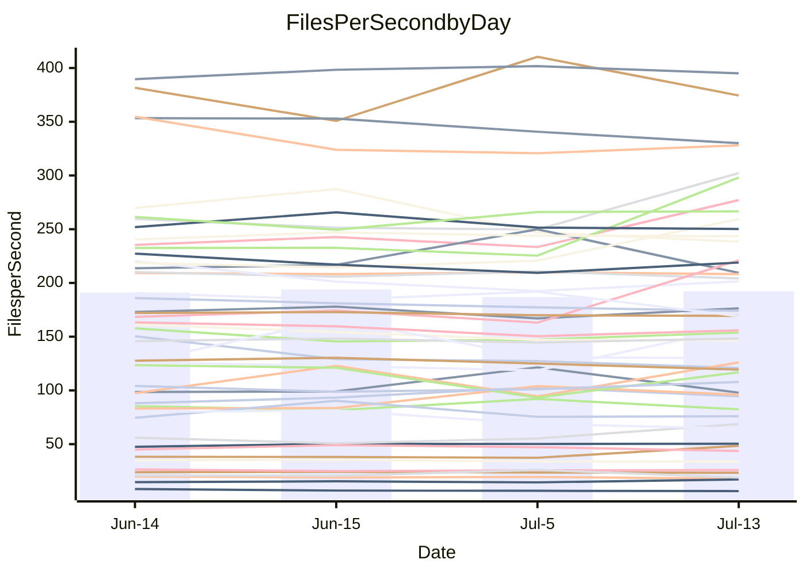

<!---
# This file is auto-generated. Do not edit.
# cspell:disable
--->
# Performance Report

Daily Performance

```mermaid
xychart-beta
    title Files Per Second by Day
    y-axis Files per Second
    x-axis Date [Jun-14, Jun-15, Jul-5, Jul-13]
    bar [191.12, 193.90, 186.85, 192.31]
    line [98.55, 99.04, 121.46, 97.93]
    line [19.91, 18.97, 19.46, 17.82]
    line [259.60, 251.39, 249.74, 302.24]
    line [85.34, 81.59, 92.06, 82.41]
    line [38.26, 38.06, 37.33, 48.47]
    line [88.07, 93.31, 102.97, 94.47]
    line [235.41, 242.68, 233.42, 277.07]
    line [8.24, 6.81, 6.57, 6.29]
    line [269.77, 287.34, 247.09, 238.39]
    line [126.17, 122.75, 118.72, 158.48]
    line [213.64, 216.83, 249.94, 209.39]
    line [209.33, 208.22, 209.98, 208.19]
    line [210.20, 205.78, 210.72, 204.20]
    line [157.77, 145.55, 147.25, 153.81]
    line [23.82, 24.25, 23.61, 23.34]
    line [150.40, 129.14, 127.24, 120.84]
    line [26.48, 25.01, 25.58, 25.88]
    line [14.65, 15.42, 14.44, 17.18]
    line [161.35, 154.33, 147.06, 146.76]
    line [220.12, 201.30, 192.47, 201.45]
    line [173.03, 177.99, 166.99, 176.39]
    line [83.17, 83.60, 104.04, 96.02]
    line [145.81, 148.34, 144.57, 148.29]
    line [232.54, 232.69, 225.39, 298.01]
    line [381.64, 350.78, 410.40, 374.43]
    line [74.53, 90.33, 75.44, 76.00]
    line [168.46, 174.35, 163.07, 221.06]
    line [47.54, 50.24, 50.17, 50.42]
    line [218.65, 214.39, 220.82, 259.46]
    line [125.76, 165.92, 130.91, 129.95]
    line [353.38, 352.89, 340.70, 330.04]
    line [97.48, 122.92, 94.49, 126.09]
    line [55.98, 50.73, 55.28, 68.71]
    line [123.50, 121.07, 93.33, 116.87]
    line [172.10, 172.90, 169.94, 169.41]
    line [185.95, 181.08, 177.29, 174.01]
    line [163.34, 159.60, 150.47, 155.87]
    line [251.95, 265.72, 251.57, 250.26]
    line [240.44, 247.10, 243.88, 243.47]
    line [79.92, 81.44, 68.91, 64.41]
    line [389.62, 398.36, 401.72, 395.07]
    line [354.69, 323.95, 320.66, 328.06]
    line [20.77, 20.56, 26.00, 18.90]
    line [261.42, 249.50, 266.02, 266.63]
    line [127.61, 130.38, 124.96, 119.39]
    line [104.15, 98.74, 101.09, 107.84]
    line [44.93, 49.08, 47.14, 43.65]
    line [227.27, 217.03, 209.38, 218.96]
    line [34.98, 35.43, 33.94, 33.78]
    line [190.66, 184.43, 191.84, 169.05]
```

Time to Process Files

| Repository                                      | Elapsed | Min/Avg/Max           |   SD | SD Graph                |
| ----------------------------------------------- | ------: | :-------------------: | ---: | ----------------------- |
| AdaDoom3/AdaDoom3                    |    2.12 | 2.6 /   2.7 /   2.8   | 0.05 | `●       ┣┻╋┻┫        ` |
| alexiosc/megistos                    |    7.07 | 5.3 /   6.7 /   7.1   | 0.58 | `   ┣━━━┻━━╋━●┻━━━┫   ` |
| apollographql/apollo-server          |    2.60 | 1.5 /   2.4 /   2.7   | 0.36 | `    ┣━━┻━━╋●━┻━━┫    ` |
| aspnetboilerplate/aspnetboilerplate  |    7.57 | 8.5 /   9.0 /   9.3   | 0.29 | `●     ┣━┻━╋━┻━┫      ` |
| aws-amplify/docs                     |   10.68 | 12.2 /  12.6 /  13.3  | 0.36 | `●     ┣━┻━╋━┻━┫      ` |
| Azure/azure-rest-api-specs           |   10.45 | 7.6 /   9.6 /  10.5   | 0.99 | `   ┣━━━┻━━╋━━●━━━┫   ` |
| bitjson/typescript-starter           |    1.12 | 0.9 /   1.0 /   1.3   | 0.13 | `    ┣━━┻━━╋━●┻━━┫    ` |
| caddyserver/caddy                    |    3.41 | 2.7 /   3.4 /   3.7   | 0.30 | `    ┣━━┻━━●━━┻━━┫    ` |
| canada-ca/open-source-logiciel-libre |    1.11 | 0.6 /   1.0 /   1.1   | 0.15 | `    ┣━━┻━━╋━●┻━━┫    ` |
| chef/chef                            |    4.96 | 4.7 /   4.9 /   5.1   | 0.12 | `    ┣━━┻━━╋●━┻━━┫    ` |
| dart-lang/sdk                        |   57.05 | 44.7 /  56.4 /  63.1  | 5.20 | `  ┣━━━┻━━━╋●━━┻━━━┫  ` |
| django/django                        |   13.98 | 8.6 /  13.1 /  14.6   | 1.86 | `   ┣━━┻━━━╋━●━┻━━┫   ` |
| eslint/eslint                        |   10.19 | 9.6 /   9.9 /  10.1   | 0.21 | `    ┣━━┻━━╋━━┻●━┫    ` |
| exonum/exonum                        |    2.66 | 3.3 /   3.4 /   3.7   | 0.12 | `●      ┣┻━╋━┻┫       ` |
| flutter/samples                      |   11.03 | 9.0 /  11.3 /  12.4   | 1.00 | `   ┣━━━┻━●╋━━┻━━━┫   ` |
| gitbucket/gitbucket                  |    3.45 | 2.5 /   3.1 /   3.4   | 0.35 | `    ┣━━┻━━╋━━●━━┫    ` |
| googleapis/google-cloud-cpp          |  125.81 | 121.4 / 124.3 / 126.5 | 1.80 | `  ┣━━━┻━━━╋━━●┻━━━┫  ` |
| graphql/express-graphql              |    1.11 | 1.1 /   1.1 /   1.2   | 0.04 | `     ┣━┻━━╋━●┻━┫     ` |
| graphql/graphql-js                   |    3.75 | 2.9 /   3.6 /   3.9   | 0.30 | `    ┣━━┻━━╋━●┻━━┫    ` |
| graphql/graphql-relay-js             |    1.08 | 1.0 /   1.1 /   1.1   | 0.03 | `     ┣━┻━━●━━┻━┫     ` |
| graphql/graphql-spec                 |    1.11 | 1.2 /   1.3 /   1.3   | 0.04 | `●    ┣━━┻━╋━┻━━┫     ` |
| iluwatar/java-design-patterns        |   11.84 | 11.6 /  12.2 /  12.6  | 0.36 | `   ┣━━━●━━╋━━┻━━━┫   ` |
| ktaranov/sqlserver-kit               |    5.10 | 3.5 /   5.5 /   5.9   | 0.81 | `   ┣━━━┻●━╋━━┻━━━┫   ` |
| liriliri/licia                       |    3.84 | 3.0 /   3.7 /   4.1   | 0.31 | `    ┣━━┻━━╋●━┻━━┫    ` |
| MartinThoma/LaTeX-examples           |    4.73 | 6.0 /   6.1 /   6.4   | 0.15 | `●       ┣┻╋┻┫        ` |
| mdx-js/mdx                           |    1.83 | 1.5 /   1.8 /   1.9   | 0.11 | `    ┣━━┻━━●━━┻━━┫    ` |
| microsoft/TypeScript-Website         |    5.16 | 5.0 /   5.3 /   5.6   | 0.19 | `    ┣━━┻●━╋━━┻━━┫    ` |
| MicrosoftDocs/PowerShell-Docs        |   24.05 | 18.8 /  23.6 /  25.5  | 2.04 | `   ┣━━┻━━━╋●━━┻━━┫   ` |
| neovim/nvim-lspconfig                |    3.90 | 4.9 /   5.2 /   5.5   | 0.16 | `●      ┣━┻╋┻━┫       ` |
| pagekit/pagekit                      |    2.86 | 3.3 /   3.4 /   3.5   | 0.05 | `●       ┣┻╋┻┫        ` |
| php/php-src                          |   18.33 | 18.7 /  23.3 /  24.8  | 2.03 | ` ● ┣━━┻━━━╋━━━┻━━┫   ` |
| plasticrake/tplink-smarthome-api     |    1.23 | 1.0 /   1.3 /   1.5   | 0.12 | `    ┣━━┻━●╋━━┻━━┫    ` |
| prettier/prettier                    |    7.97 | 7.4 /   7.7 /   8.1   | 0.18 | `    ┣━━┻━━╋━━┻━●┫    ` |
| pycontribs/jira                      |    1.16 | 1.4 /   1.5 /   1.6   | 0.08 | `●    ┣━┻━━╋━━┻━┫     ` |
| RustPython/RustPython                |    7.05 | 6.5 /   7.6 /   8.9   | 1.11 | `   ┣━━━┻●━╋━━┻━━━┫   ` |
| shoelace-style/shoelace              |    2.82 | 2.7 /   2.8 /   3.0   | 0.11 | `    ┣━━┻━━╋●━┻━━┫    ` |
| slint-ui/slint                       |   14.01 | 13.4 /  13.8 /  14.2  | 0.30 | `   ┣━━━┻━━╋━●┻━━━┫   ` |
| SoftwareBrothers/admin-bro           |    2.53 | 2.4 /   2.4 /   2.7   | 0.10 | `    ┣━━┻━━╋━━●━━┫    ` |
| sveltejs/svelte                      |   22.53 | 21.7 /  22.5 /  23.1  | 0.40 | `   ┣━━━┻━━╋●━┻━━━┫   ` |
| TheAlgorithms/Python                 |    5.64 | 5.3 /   5.6 /   5.8   | 0.17 | `    ┣━━┻━━╋●━┻━━┫    ` |
| twbs/bootstrap                       |    1.83 | 1.3 /   1.6 /   1.7   | 0.16 | `    ┣━━┻━━╋━━┻●━┫    ` |
| typescript-cheatsheets/react         |    1.27 | 0.7 /   1.1 /   1.2   | 0.16 | `    ┣━━┻━━╋━━●━━┫    ` |
| typescript-eslint/typescript-eslint  |    4.03 | 3.1 /   4.0 /   4.3   | 0.38 | `    ┣━━┻━━●━━┻━━┫    ` |
| vitest-dev/vitest                    |   10.24 | 10.1 /  10.4 /  10.9  | 0.24 | `    ┣━━┻●━╋━━┻━━┫    ` |
| w3c/aria-practices                   |    3.49 | 3.2 /   3.3 /   3.5   | 0.11 | `    ┣━━┻━━╋━━┻━━●    ` |
| w3c/specberus                        |    1.82 | 1.8 /   1.9 /   2.1   | 0.10 | `    ┣━━●━━╋━━┻━━┫    ` |
| webdeveric/webpack-assets-manifest   |    1.26 | 1.1 /   1.2 /   1.3   | 0.06 | `     ┣━┻━━╋━━●━┫     ` |
| webpack/webpack                      |    5.65 | 4.5 /   5.6 /   6.1   | 0.46 | `    ┣━━┻━━●━━┻━━┫    ` |
| wireapp/wire-desktop                 |    1.30 | 1.2 /   1.3 /   1.4   | 0.04 | `     ┣━┻━━╋━●┻━┫     ` |
| wireapp/wire-webapp                  |   13.85 | 11.5 /  12.0 /  12.6  | 0.33 | `      ┣━┻━╋━┻━┫     ●` |

Note:
- Elapsed time is in seconds.

Files per Second over Time

| Repository                                      | Files |    Sec |    Fps |     Rel | Trend Fps  |    N |
| ----------------------------------------------- | ----: | -----: | -----: | ------: | ---------- | ---: |
| AdaDoom3/AdaDoom3                    |   103 |   2.12 |  48.47 |  28.13% | `▄▃▂▃▃▃▂█` |    7 |
| alexiosc/megistos                    |   583 |   7.07 |  82.41 |  -6.01% | `▃▃▃▂█▂▃▂` |    7 |
| apollographql/apollo-server          |   255 |   2.60 |  97.93 |  -9.69% | `▂▁▂▂█▂▂▂` |    7 |
| aspnetboilerplate/aspnetboilerplate  |  2288 |   7.57 | 302.24 |  18.90% | `▅▃▄▃▃▃▄█` |    7 |
| aws-amplify/docs                     |  2959 |  10.68 | 277.07 |  17.61% | `▃▄▄▅▃▄▄█` |    7 |
| Azure/azure-rest-api-specs           |  2491 |  10.45 | 238.39 |  -9.21% | `▂█▃▅▃▃▂▂` |    7 |
| bitjson/typescript-starter           |    20 |   1.12 |  17.82 |  -8.98% | `▄▆▅▄█▅▂▄` |    7 |
| caddyserver/caddy                    |   322 |   3.41 |  94.47 |  -0.78% | `▂▃▂▃▃▄█▄` |    7 |
| canada-ca/open-source-logiciel-libre |     7 |   1.11 |   6.29 | -14.02% | `▂▂█▂▂▁▂▁` |    7 |
| chef/chef                            |  1032 |   4.96 | 208.19 |  -0.60% | `▅█▅▆▆▆▆▆` |    7 |
| dart-lang/sdk                        | 11492 |  57.05 | 201.45 |  -2.01% | `▃▄█▄▂▃▃▄` |    7 |
| django/django                        |  2927 |  13.98 | 209.39 |  -8.82% | `▂▂▂▂▂▁█▂` |    7 |
| eslint/eslint                        |  2080 |  10.19 | 204.20 |  -2.67% | `▅▆█▆█▇▆▅` |    7 |
| exonum/exonum                        |   421 |   2.66 | 158.48 |  29.38% | `▃▃▄▃▃▂▃█` |    7 |
| flutter/samples                      |  1696 |  11.03 | 153.81 |   1.52% | `█▂▃▃▃▃▃▄` |    7 |
| gitbucket/gitbucket                  |   417 |   3.45 | 120.84 | -12.08% | `▂▇█▃▃▃▃▂` |    7 |
| googleapis/google-cloud-cpp          | 21314 | 125.81 | 169.41 |  -1.10% | `█▆▇▇▆▇▆▆` |    7 |
| graphql/express-graphql              |    26 |   1.11 |  23.34 |  -1.93% | `▅█▆▇▆▄█▆` |    7 |
| graphql/graphql-js                   |   550 |   3.75 | 146.76 |  -4.84% | `▃█▃▄▃▂▄▃` |    7 |
| graphql/graphql-relay-js             |    28 |   1.08 |  25.88 |   0.00% | `▆▆█▄▆▄▆▆` |    7 |
| graphql/graphql-spec                 |    19 |   1.11 |  17.18 |  17.07% | `▄▄▃▅▃▄▃█` |    7 |
| iluwatar/java-design-patterns        |  2089 |  11.84 | 176.39 |   3.06% | `▆▆██▅▅▅▇` |    7 |
| ktaranov/sqlserver-kit               |   490 |   5.10 |  96.02 |   4.18% | `▂▁▂▂▂█▂▃` |    7 |
| liriliri/licia                       |  1438 |   3.84 | 374.43 |  -3.88% | `▃▄▃▂█▄▃▃` |    7 |
| MartinThoma/LaTeX-examples           |  1409 |   4.73 | 298.01 |  29.85% | `▃▃▃▃▂▃▂█` |    7 |
| mdx-js/mdx                           |   139 |   1.83 |  76.00 |  -1.52% | `▄▃▃█▃▄▄▄` |    7 |
| microsoft/TypeScript-Website         |   765 |   5.16 | 148.29 |   1.82% | `█▇▄▇▅▆▇▇` |    7 |
| MicrosoftDocs/PowerShell-Docs        |  3126 |  24.05 | 129.95 |  -2.81% | `▂▃▃█▄▄▃▃` |    7 |
| neovim/nvim-lspconfig                |   863 |   3.90 | 221.06 |  32.37% | `▃▃▃▄▃▂▃█` |    7 |
| pagekit/pagekit                      |   741 |   2.86 | 259.46 |  18.49% | `▃▄▄▃▄▄▄█` |    7 |
| php/php-src                          |  2311 |  18.33 | 126.09 |  26.31% | `▃▄▂█▃▂▂█` |    7 |
| plasticrake/tplink-smarthome-api     |    62 |   1.23 |  50.42 |   2.79% | `▃▄▄▅▂█▄▅` |    7 |
| prettier/prettier                    |  2629 |   7.97 | 330.04 |  -5.13% | `█▇██▆█▄▅` |    7 |
| pycontribs/jira                      |    80 |   1.16 |  68.71 |  25.08% | `▄▄▄▂▄▂▅█` |    7 |
| RustPython/RustPython                |   824 |   7.05 | 116.87 |   6.03% | `███▇▂▂▃▇` |    7 |
| shoelace-style/shoelace              |   440 |   2.82 | 155.87 |  -0.90% | `██▇▇▅▄▅▆` |    7 |
| slint-ui/slint                       |  3410 |  14.01 | 243.47 |   0.25% | `▅▆████▆▇` |    7 |
| SoftwareBrothers/admin-bro           |   441 |   2.53 | 174.01 |  -4.15% | `███▇█▆▄▅` |    7 |
| sveltejs/svelte                      |  8900 |  22.53 | 395.07 |  -0.25% | `▆▅▆▇█▇▇▆` |    7 |
| TheAlgorithms/Python                 |  1411 |   5.64 | 250.26 |  -1.38% | `▆▇▅██▄▅▆` |    7 |
| twbs/bootstrap                       |   118 |   1.83 |  64.41 | -14.60% | `▂█▆▆▃▂▂▁` |    7 |
| typescript-cheatsheets/react         |    24 |   1.27 |  18.90 | -17.77% | `▂▁▁▂▂▂█▁` |    7 |
| typescript-eslint/typescript-eslint  |  1323 |   4.03 | 328.06 |  -2.28% | `▂█▃▃▂▄▂▃` |    7 |
| vitest-dev/vitest                    |  2730 |  10.24 | 266.63 |   1.89% | `▇▆▇▅▆▇█▇` |    7 |
| w3c/aria-practices                   |   417 |   3.49 | 119.39 |  -5.90% | `▇▇▇██▄▇▅` |    7 |
| w3c/specberus                        |   196 |   1.82 | 107.84 |   5.66% | `█▆▇▅█▇▃█` |    7 |
| webdeveric/webpack-assets-manifest   |    55 |   1.26 |  43.65 |  -6.08% | `▃▆▇█▇▇▇▅` |    7 |
| webpack/webpack                      |  1237 |   5.65 | 218.96 |   0.37% | `█▃▃▄▃▃▂▄` |    7 |
| wireapp/wire-desktop                 |    44 |   1.30 |  33.78 |  -2.37% | `██▇██▇▄▆` |    7 |
| wireapp/wire-webapp                  |  2342 |  13.85 | 169.05 | -11.16% | `▇█▅▅█▇▆▁` |    7 |

Data Throughput

| Repository                                      | Files |    Sec |     Kps |     Rel | Trend Kps  |    N |
| ----------------------------------------------- | ----: | -----: | ------: | ------: | ---------- | ---: |
| AdaDoom3/AdaDoom3                    |   103 |   2.12 | 1030.14 |  28.13% | `▄▃▂▃▃▃▂█` |    7 |
| alexiosc/megistos                    |   583 |   7.07 |  647.55 |  -6.01% | `▃▃▃▂█▂▃▂` |    7 |
| apollographql/apollo-server          |   255 |   2.60 |  809.16 |  -9.69% | `▂▁▂▂█▂▂▂` |    7 |
| aspnetboilerplate/aspnetboilerplate  |  2288 |   7.57 |  738.82 |  19.22% | `▅▃▄▃▃▃▄█` |    7 |
| aws-amplify/docs                     |  2959 |  10.68 | 1001.92 |  17.61% | `▃▄▄▅▃▄▄█` |    7 |
| Azure/azure-rest-api-specs           |  2491 |  10.45 |  729.06 |  -8.97% | `▂█▃▅▃▃▂▂` |    7 |
| bitjson/typescript-starter           |    20 |   1.12 |   71.30 |  -8.98% | `▄▆▅▄█▅▂▄` |    7 |
| caddyserver/caddy                    |   322 |   3.41 |  855.80 |  -0.69% | `▂▃▂▃▃▄█▄` |    7 |
| canada-ca/open-source-logiciel-libre |     7 |   1.11 |   52.14 | -14.02% | `▂▂█▂▂▁▂▁` |    7 |
| chef/chef                            |  1032 |   4.96 | 1021.98 |  -0.56% | `▅█▅▆▆▆▆▆` |    7 |
| dart-lang/sdk                        | 11492 |  57.05 | 1375.67 |  -1.98% | `▃▄█▄▂▃▃▄` |    7 |
| django/django                        |  2927 |  13.98 | 1344.34 |  -8.77% | `▂▂▂▂▂▁█▂` |    7 |
| eslint/eslint                        |  2080 |  10.19 | 1423.50 |  -2.56% | `▅▆█▆█▇▆▅` |    7 |
| exonum/exonum                        |   421 |   2.66 | 1515.89 |  29.38% | `▃▃▄▃▃▂▃█` |    7 |
| flutter/samples                      |  1696 |  11.03 |  920.33 |   1.50% | `█▂▃▃▃▃▃▄` |    7 |
| gitbucket/gitbucket                  |   417 |   3.45 |  577.24 | -12.00% | `▂▇█▃▃▃▃▂` |    7 |
| googleapis/google-cloud-cpp          | 21314 | 125.81 | 1465.63 |  -0.87% | `█▆▇▇▆▇▆▇` |    7 |
| graphql/express-graphql              |    26 |   1.11 |  106.81 |  -1.93% | `▅█▆▇▆▄█▆` |    7 |
| graphql/graphql-js                   |   550 |   3.75 | 1091.90 |  -4.44% | `▃█▃▄▃▂▄▃` |    7 |
| graphql/graphql-relay-js             |    28 |   1.08 |  101.69 |   0.00% | `▆▆█▄▆▄▆▆` |    7 |
| graphql/graphql-spec                 |    19 |   1.11 |  574.95 |  17.07% | `▄▄▃▅▃▄▃█` |    7 |
| iluwatar/java-design-patterns        |  2089 |  11.84 |  543.54 |   3.07% | `▆▆██▅▅▅▇` |    7 |
| ktaranov/sqlserver-kit               |   490 |   5.10 | 1454.66 |   4.18% | `▂▁▂▂▂█▂▃` |    7 |
| liriliri/licia                       |  1438 |   3.84 |  446.81 |  -3.88% | `▃▄▃▂█▄▃▃` |    7 |
| MartinThoma/LaTeX-examples           |  1409 |   4.73 |  615.48 |  29.85% | `▃▃▃▃▂▃▂█` |    7 |
| mdx-js/mdx                           |   139 |   1.83 |  354.85 |  -1.61% | `▄▃▃█▃▃▄▄` |    7 |
| microsoft/TypeScript-Website         |   765 |   5.16 | 1022.34 |   1.88% | `█▇▄▇▅▆▇▇` |    7 |
| MicrosoftDocs/PowerShell-Docs        |  3126 |  24.05 | 1385.50 |  -2.79% | `▂▃▃█▄▄▃▃` |    7 |
| neovim/nvim-lspconfig                |   863 |   3.90 |  647.29 |  32.29% | `▃▃▃▄▃▂▃█` |    7 |
| pagekit/pagekit                      |   741 |   2.86 |  540.97 |  18.49% | `▃▄▄▃▄▄▄█` |    7 |
| php/php-src                          |  2311 |  18.33 | 2214.23 |  26.13% | `▃▄▂█▃▂▂█` |    7 |
| plasticrake/tplink-smarthome-api     |    62 |   1.23 |  272.44 |   2.79% | `▃▄▄▅▂█▄▅` |    7 |
| prettier/prettier                    |  2629 |   7.97 |  469.52 |  -2.87% | `▇▅▇▆▇█▅▅` |    7 |
| pycontribs/jira                      |    80 |   1.16 |  485.27 |  25.08% | `▄▄▄▂▄▂▅█` |    7 |
| RustPython/RustPython                |   824 |   7.05 | 2603.36 |  28.40% | `▃▃▂▂▃▃▄█` |    7 |
| shoelace-style/shoelace              |   440 |   2.82 |  752.80 |  -0.90% | `██▇▇▅▄▅▆` |    7 |
| slint-ui/slint                       |  3410 |  14.01 | 1280.91 |   0.21% | `▅▆████▆▇` |    7 |
| SoftwareBrothers/admin-bro           |   441 |   2.53 |  383.53 |  -4.15% | `███▇█▆▄▅` |    7 |
| sveltejs/svelte                      |  8900 |  22.53 |  270.25 |  -0.14% | `▆▅▆▇█▇▇▆` |    7 |
| TheAlgorithms/Python                 |  1411 |   5.64 |  639.76 |  -1.38% | `▆▇▅██▄▅▆` |    7 |
| twbs/bootstrap                       |   118 |   1.83 |  528.37 | -14.60% | `▂█▆▆▃▂▂▁` |    7 |
| typescript-cheatsheets/react         |    24 |   1.27 |  170.86 | -17.77% | `▂▁▁▂▂▂█▁` |    7 |
| typescript-eslint/typescript-eslint  |  1323 |   4.03 | 1797.03 |  -2.02% | `▂█▃▃▂▄▂▃` |    7 |
| vitest-dev/vitest                    |  2730 |  10.24 |  750.66 |   5.57% | `▅▄▅▃▇███` |    7 |
| w3c/aria-practices                   |   417 |   3.49 | 1122.59 |  -5.55% | `▇▇▇██▄█▅` |    7 |
| w3c/specberus                        |   196 |   1.82 |  351.59 |   5.66% | `█▆▇▅█▇▃█` |    7 |
| webdeveric/webpack-assets-manifest   |    55 |   1.26 |   99.99 |  -6.08% | `▃▆▇█▇▇▇▅` |    7 |
| webpack/webpack                      |  1237 |   5.65 | 1179.75 |   1.00% | `█▃▂▄▃▃▃▄` |    7 |
| wireapp/wire-desktop                 |    44 |   1.30 |  152.01 |  -2.37% | `██▇██▇▄▆` |    7 |
| wireapp/wire-webapp                  |  2342 |  13.85 |  699.93 | -11.27% | `▇█▅▅█▇▆▁` |    7 |

