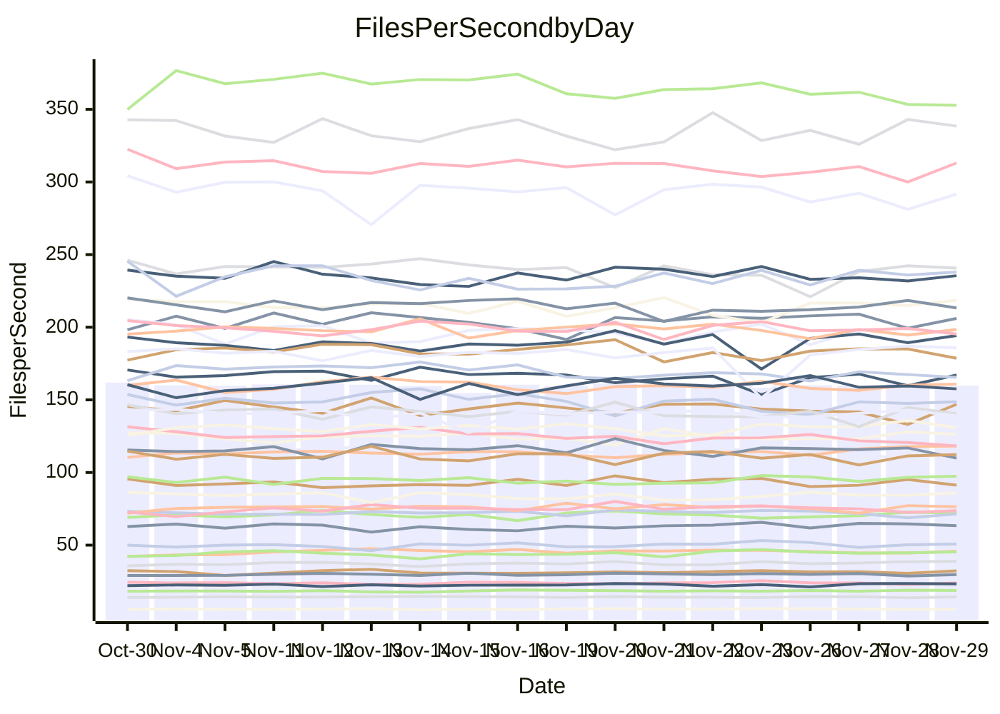

<!---
# This file is auto-generated. Do not edit.
# cspell:disable
--->
# Performance Report

## Daily Performance

```mermaid
xychart-beta
    title Files Per Second by Day
    y-axis Files per Second
    x-axis Date [Oct-30, Nov-4, Nov-5, Nov-11, Nov-12, Nov-13, Nov-14, Nov-15, Nov-16, Nov-19, Nov-20, Nov-21, Nov-22, Nov-23, Nov-26, Nov-27, Nov-28, Nov-29]
    bar [161.94, 160.02, 159.72, 160.65, 161.35, 160.47, 159.54, 154.79, 160.46, 159.61, 161.30, 160.06, 161.07, 158.38, 160.01, 159.51, 160.85, 159.72]
    line [198.27, 207.58, 199.26, 209.84, 202.01, 209.99, 206.66, 203.31, 199.00, 191.59, 206.65, 204.27, 207.11, 206.14, 207.83, 208.99, 199.30, 206.04]
    line [42.25, 43.22, 43.49, 45.34, 46.46, 47.61, 46.36, 45.42, 47.07, 44.45, 46.03, 45.93, 46.58, 46.39, 45.62, 44.62, 44.61, 45.83]
    line [13.97, 14.18, 14.33, 14.26, 14.23, 14.49, 14.71, 14.55, 14.39, 13.95, 14.60, 14.17, 14.18, 13.95, 14.61, 14.49, 13.79, 14.37]
    line [18.25, 18.44, 18.38, 18.23, 18.67, 17.83, 17.56, 18.43, 19.15, 18.91, 18.65, 18.27, 18.52, 18.27, 18.83, 18.32, 19.02, 18.82]
    line [95.53, 91.04, 92.11, 93.46, 89.53, 90.84, 91.64, 91.15, 95.31, 91.02, 97.72, 93.01, 95.37, 95.97, 90.32, 91.22, 95.22, 91.27]
    line [49.99, 48.68, 50.03, 50.42, 49.00, 46.22, 50.88, 49.95, 51.56, 48.83, 49.01, 50.78, 50.67, 53.20, 51.79, 48.42, 50.26, 50.76]
    line [24.43, 23.95, 24.20, 23.49, 24.08, 23.00, 23.06, 24.50, 24.34, 23.62, 23.53, 24.02, 24.23, 25.56, 24.09, 24.00, 22.97, 23.91]
    line [22.12, 22.59, 22.34, 23.16, 21.54, 22.68, 21.85, 22.43, 22.45, 22.56, 23.60, 23.23, 21.70, 22.82, 21.29, 23.51, 23.57, 23.36]
    line [127.28, 126.86, 123.18, 120.25, 124.45, 125.35, 124.99, 127.41, 122.93, 123.56, 118.96, 130.24, 124.88, 123.12, 123.27, 123.12, 128.04, 126.25]
    line [117.43, 111.89, 115.01, 116.13, 115.22, 119.08, 113.54, 116.51, 115.21, 113.92, 114.16, 109.46, 116.44, 115.65, 119.47, 113.07, 108.78, 115.17]
    line [62.75, 64.51, 61.69, 64.67, 63.79, 59.02, 62.70, 60.80, 59.91, 63.00, 61.76, 63.34, 63.78, 65.76, 61.80, 64.96, 64.67, 63.44]
    line [110.40, 113.53, 112.85, 114.15, 114.65, 113.36, 112.62, 114.36, 114.33, 111.99, 110.22, 112.37, 113.80, 114.46, 111.80, 116.19, 117.82, 118.22]
    line [35.71, 36.86, 36.50, 38.05, 38.19, 36.99, 35.25, 37.09, 37.76, 37.04, 38.77, 36.43, 36.55, 38.70, 37.18, 37.74, 38.63, 38.89]
    line [69.09, 70.86, 69.37, 70.88, 73.81, 71.09, 69.11, 71.10, 66.81, 72.11, 73.56, 71.52, 70.73, 68.53, 69.45, 70.29, 72.76, 72.13]
    line [145.45, 142.42, 149.63, 145.08, 140.78, 151.35, 139.20, 143.75, 147.85, 144.42, 140.89, 146.99, 147.16, 143.68, 142.26, 141.63, 133.10, 146.97]
    line [73.22, 72.23, 71.32, 71.25, 71.08, 73.06, 72.16, 72.33, 73.39, 70.13, 74.26, 73.25, 72.41, 73.90, 73.49, 71.80, 68.80, 71.45]
    line [131.49, 128.05, 124.13, 124.73, 125.27, 128.39, 131.06, 126.59, 126.76, 123.53, 124.94, 119.79, 123.77, 123.92, 126.14, 121.82, 120.62, 118.33]
    line [170.61, 165.61, 166.70, 169.45, 169.81, 163.46, 172.46, 167.41, 168.34, 167.09, 161.78, 164.45, 166.41, 153.59, 165.34, 167.76, 159.74, 167.12]
    line [125.70, 130.73, 132.76, 130.23, 128.16, 133.01, 129.97, 132.49, 129.80, 133.61, 130.16, 125.21, 125.92, 133.37, 131.47, 131.60, 135.88, 130.88]
    line [205.39, 201.71, 188.42, 200.46, 201.07, 189.10, 190.06, 197.82, 199.09, 198.24, 196.06, 188.63, 196.64, 202.22, 187.96, 198.52, 194.49, 198.32]
    line [115.50, 114.45, 114.87, 117.85, 109.38, 119.29, 116.46, 115.59, 118.49, 113.54, 123.36, 115.17, 111.11, 117.00, 116.48, 115.76, 116.91, 109.90]
    line [72.03, 75.21, 76.09, 76.34, 76.58, 74.79, 76.80, 76.30, 73.76, 78.85, 74.91, 77.93, 75.92, 76.91, 75.07, 72.02, 77.23, 76.41]
    line [246.20, 236.64, 241.81, 241.59, 241.14, 243.55, 247.17, 242.91, 239.70, 241.02, 227.21, 242.23, 236.13, 235.78, 220.97, 238.24, 242.33, 240.75]
    line [97.05, 93.17, 96.79, 91.80, 95.95, 95.87, 94.48, 96.44, 92.65, 94.10, 91.76, 92.63, 92.88, 97.96, 96.91, 93.91, 96.71, 97.44]
    line [32.41, 31.83, 29.14, 30.76, 32.43, 33.35, 30.87, 30.71, 30.55, 30.97, 31.56, 31.09, 31.75, 32.47, 31.60, 31.68, 30.55, 32.35]
    line [163.25, 173.61, 171.18, 172.63, 173.35, 172.14, 176.09, 170.54, 174.05, 165.70, 164.60, 166.98, 168.69, 167.81, 163.00, 169.37, 167.40, 165.51]
    line [72.80, 69.62, 72.93, 75.62, 73.39, 77.86, 75.46, 75.53, 74.48, 74.42, 80.12, 74.68, 76.58, 77.00, 75.69, 74.97, 72.54, 73.70]
    line [193.23, 189.38, 187.47, 183.93, 189.93, 188.83, 183.53, 188.50, 187.66, 189.71, 197.63, 188.37, 194.96, 171.19, 192.32, 195.34, 189.35, 194.25]
    line [219.14, 217.54, 217.64, 213.57, 213.32, 216.11, 216.43, 209.55, 217.83, 207.54, 213.34, 220.45, 208.25, 203.01, 216.67, 216.64, 214.89, 218.57]
    line [304.34, 292.89, 299.81, 300.08, 293.90, 270.62, 297.75, 295.78, 293.19, 296.08, 277.37, 294.62, 298.41, 296.48, 286.19, 292.24, 281.16, 291.67]
    line [29.14, 29.07, 29.19, 29.96, 30.60, 29.98, 29.13, 30.65, 29.20, 29.66, 30.68, 30.21, 29.67, 30.46, 29.86, 30.48, 28.76, 29.72]
    line [195.27, 197.35, 200.31, 199.19, 197.63, 196.85, 205.77, 192.52, 197.76, 200.10, 202.32, 198.81, 202.16, 197.78, 192.08, 198.49, 194.68, 198.45]
    line [342.79, 342.26, 331.64, 327.21, 343.58, 331.81, 327.76, 336.79, 342.94, 331.62, 322.15, 327.54, 347.69, 328.52, 335.50, 325.97, 342.99, 338.44]
    line [42.24, 42.88, 45.37, 46.20, 44.50, 43.23, 40.60, 44.15, 43.48, 43.70, 44.83, 41.94, 45.87, 46.91, 45.25, 44.50, 44.73, 45.38]
    line [177.36, 184.49, 185.72, 182.94, 188.28, 187.98, 181.73, 181.49, 184.66, 187.81, 191.42, 176.14, 182.60, 177.02, 183.57, 185.12, 185.03, 178.63]
    line [153.73, 146.39, 151.10, 147.79, 148.60, 155.08, 157.59, 150.36, 154.26, 148.98, 139.01, 149.20, 150.38, 142.14, 139.88, 148.61, 147.55, 148.64]
    line [204.60, 201.12, 199.63, 197.18, 194.05, 198.31, 204.17, 202.23, 197.34, 197.09, 203.42, 191.56, 201.26, 203.88, 197.62, 198.09, 199.18, 195.39]
    line [239.32, 235.17, 233.67, 245.24, 236.50, 233.98, 229.39, 228.12, 237.34, 232.45, 241.31, 240.00, 234.88, 241.77, 233.01, 234.04, 231.90, 235.48]
    line [5.80, 6.05, 5.91, 5.92, 6.05, 6.23, 5.47, 5.95, 5.52, 6.13, 6.21, 6.06, 6.00, 6.29, 6.16, 6.03, 5.90, 5.92]
    line [183.23, 185.22, 182.14, 183.42, 176.89, 184.07, 179.92, 182.71, 181.97, 184.63, 178.93, 182.57, 185.79, 151.12, 180.91, 184.73, 187.07, 185.78]
    line [220.21, 215.36, 210.66, 218.14, 212.13, 216.95, 216.28, 218.40, 219.59, 212.75, 216.58, 203.96, 211.74, 210.99, 212.04, 213.89, 218.50, 213.27]
    line [160.02, 163.60, 155.05, 157.20, 162.55, 165.62, 162.61, 162.23, 156.96, 154.28, 159.13, 159.89, 158.58, 162.75, 157.87, 156.54, 160.15, 160.89]
    line [146.59, 140.40, 143.02, 143.74, 136.69, 145.20, 142.11, 138.52, 142.01, 139.48, 148.36, 139.11, 138.55, 138.37, 142.22, 131.52, 144.79, 140.40]
    line [349.95, 376.67, 367.68, 370.64, 374.87, 367.41, 370.51, 370.21, 374.24, 360.74, 357.55, 363.60, 364.19, 368.22, 360.42, 361.78, 353.39, 352.78]
    line [114.69, 109.15, 112.48, 109.72, 110.55, 118.02, 109.29, 108.02, 112.93, 112.97, 105.44, 113.26, 114.47, 109.88, 112.40, 105.21, 111.47, 112.28]
    line [245.41, 221.31, 234.75, 242.27, 242.37, 232.19, 225.67, 233.72, 226.18, 226.48, 228.27, 237.35, 230.05, 239.20, 229.08, 239.26, 235.89, 238.01]
    line [322.55, 309.17, 313.73, 314.69, 307.18, 306.00, 312.70, 310.78, 315.06, 310.37, 312.90, 312.74, 307.69, 303.77, 306.69, 310.59, 299.95, 313.09]
    line [160.48, 151.46, 156.36, 158.02, 161.56, 165.28, 150.34, 161.29, 153.65, 159.58, 164.91, 160.94, 159.52, 161.45, 166.78, 158.69, 159.56, 157.57]
    line [86.40, 85.26, 84.18, 85.13, 86.07, 79.22, 86.18, 84.80, 82.10, 81.80, 85.25, 80.99, 81.28, 83.53, 86.46, 84.38, 84.35, 86.00]
    line [142.74, 143.48, 140.52, 140.72, 142.75, 136.72, 140.92, 127.38, 142.26, 140.32, 141.64, 141.43, 143.12, 138.28, 138.39, 140.67, 142.96, 138.93]
```

## Time to Process Files

| Repository                                      | Elapsed | Min/Avg/Max           |    SD | SD Graph                |
| ----------------------------------------------- | ------: | :-------------------: | ----: | ----------------------- |
| AdaDoom3/AdaDoom3                    |    3.38 | 3.3 /   3.5 /   3.8   |  0.10 | `     ┣━┻●━╋━━┻━┫     ` |
| alexiosc/megistos                    |    7.88 | 7.3 /   7.8 /   8.7   |  0.29 | `    ┣━━┻━━●━━┻━━┫    ` |
| apollographql/apollo-server          |    3.01 | 2.6 /   2.7 /   3.2   |  0.12 | `     ┣━┻━━╋━━┻━┫●    ` |
| aspnetboilerplate/aspnetboilerplate  |   10.54 | 10.3 /  10.7 /  11.8  |  0.34 | `    ┣━━┻━●╋━━┻━━┫    ` |
| aws-amplify/docs                     |   13.38 | 12.6 /  13.4 /  14.8  |  0.43 | `    ┣━━┻━━●━━┻━━┫    ` |
| Azure/azure-rest-api-specs           |    9.61 | 9.6 /  10.1 /  11.2   |  0.38 | `    ┣━●┻━━╋━━┻━━┫    ` |
| bitjson/typescript-starter           |    1.02 | 1.0 /   1.1 /   1.2   |  0.04 | `     ┣●━┻━╋━┻━━┫     ` |
| caddyserver/caddy                    |    3.79 | 3.4 /   3.8 /   4.2   |  0.14 | `     ┣━┻━━●━━┻━┫     ` |
| canada-ca/open-source-logiciel-libre |    1.20 | 1.1 /   1.2 /   1.3   |  0.05 | `     ┣━━┻━╋━●━━┫     ` |
| chef/chef                            |    5.87 | 5.8 /   6.0 /   6.5   |  0.17 | `    ┣━━┻●━╋━━┻━━┫    ` |
| dart-lang/sdk                        |   68.67 | 64.2 /  67.6 /  72.3  |  1.88 | `   ┣━━┻━━━╋━●━┻━━┫   ` |
| django/django                        |   15.32 | 14.9 /  15.9 /  19.1  |  0.69 | `    ┣━━┻●━╋━━┻━━┫    ` |
| eslint/eslint                        |   10.65 | 10.5 /  11.1 /  12.2  |  0.40 | `    ┣━━●━━╋━━┻━━┫    ` |
| exonum/exonum                        |    3.81 | 3.4 /   3.7 /   4.0   |  0.12 | `     ┣━┻━━╋━━●━┫     ` |
| flutter/samples                      |   16.93 | 16.0 /  17.1 /  21.1  |  0.86 | `    ┣━━┻━●╋━━┻━━┫    ` |
| gitbucket/gitbucket                  |    3.47 | 3.5 /   3.6 /   3.9   |  0.11 | `     ┣●┻━━╋━━┻━┫     ` |
| googleapis/google-cloud-cpp          |  147.05 | 142.0 / 150.4 / 209.7 | 10.64 | `  ┣━━━┻━━●╋━━━┻━━━┫  ` |
| graphql/express-graphql              |    1.12 | 1.1 /   1.2 /   1.4   |  0.07 | `     ┣━┻━●╋━━┻━┫     ` |
| graphql/graphql-js                   |    2.90 | 2.8 /   3.0 /   3.2   |  0.10 | `     ┣━┻━●╋━━┻━┫     ` |
| graphql/graphql-relay-js             |    1.13 | 1.1 /   1.2 /   1.3   |  0.04 | `     ┣━━●━╋━┻━━┫     ` |
| graphql/graphql-spec                 |    1.33 | 1.3 /   1.3 /   1.5   |  0.04 | `     ┣━━┻━●━┻━━┫     ` |
| iluwatar/java-design-patterns        |   13.60 | 12.6 /  13.4 /  14.9  |  0.44 | `    ┣━━┻━━╋●━┻━━┫    ` |
| ktaranov/sqlserver-kit               |    6.74 | 6.5 /   6.8 /   7.3   |  0.19 | `    ┣━━┻━●╋━━┻━━┫    ` |
| liriliri/licia                       |    4.26 | 4.1 /   4.3 /   4.6   |  0.12 | `     ┣━┻━●╋━━┻━┫     ` |
| MartinThoma/LaTeX-examples           |    7.04 | 6.8 /   7.1 /   7.9   |  0.23 | `    ┣━━┻━●╋━━┻━━┫    ` |
| mdx-js/mdx                           |    1.94 | 1.9 /   2.0 /   2.1   |  0.06 | `     ┣━┻●━╋━━┻━┫     ` |
| microsoft/TypeScript-Website         |    5.84 | 5.5 /   5.8 /   6.5   |  0.19 | `    ┣━━┻━━●━━┻━━┫    ` |
| MicrosoftDocs/PowerShell-Docs        |   24.97 | 22.9 /  24.4 /  26.2  |  0.84 | `   ┣━━━┻━━╋━●┻━━━┫   ` |
| neovim/nvim-lspconfig                |    4.50 | 4.3 /   4.5 /   4.9   |  0.12 | `     ┣━┻━━●━━┻━┫     ` |
| pagekit/pagekit                      |    3.60 | 3.4 /   3.7 /   4.3   |  0.15 | `     ┣━┻━●╋━━┻━┫     ` |
| php/php-src                          |   26.63 | 25.5 /  27.0 /  29.3  |  0.90 | `   ┣━━━┻━●╋━━┻━━━┫   ` |
| plasticrake/tplink-smarthome-api     |    1.39 | 1.3 /   1.4 /   1.5   |  0.05 | `     ┣━┻━━╋●━┻━┫     ` |
| prettier/prettier                    |    7.86 | 7.4 /   7.8 /   8.3   |  0.17 | `    ┣━━┻━━╋●━┻━━┫    ` |
| pycontribs/jira                      |    1.54 | 1.5 /   1.6 /   1.7   |  0.06 | `     ┣━┻●━╋━━┻━┫     ` |
| RustPython/RustPython                |    6.07 | 5.2 /   5.6 /   6.3   |  0.24 | `    ┣━━┻━━╋━━┻━●┫    ` |
| shoelace-style/shoelace              |    3.00 | 2.9 /   3.1 /   3.7   |  0.14 | `     ┣━┻━●╋━━┻━┫     ` |
| slint-ui/slint                       |   14.16 | 13.4 /  14.0 /  15.0  |  0.37 | `    ┣━━┻━━╋━●┻━━┫    ` |
| SoftwareBrothers/admin-bro           |    2.66 | 2.5 /   2.7 /   2.9   |  0.07 | `     ┣━┻━━●━━┻━┫     ` |
| sveltejs/svelte                      |   22.82 | 20.8 /  22.1 /  23.0  |  0.52 | `    ┣━━┻━━╋━━┻━●┫    ` |
| TheAlgorithms/Python                 |    5.71 | 5.6 /   5.9 /   6.4   |  0.18 | `    ┣━━┻●━╋━━┻━━┫    ` |
| twbs/bootstrap                       |    1.84 | 1.8 /   1.9 /   2.4   |  0.10 | `     ┣━┻━●╋━━┻━┫     ` |
| typescript-cheatsheets/react         |    1.38 | 1.3 /   1.4 /   1.6   |  0.06 | `     ┣━┻●━╋━━┻━┫     ` |
| typescript-eslint/typescript-eslint  |    4.45 | 4.2 /   4.4 /   4.7   |  0.13 | `     ┣━┻━━╋●━┻━┫     ` |
| vitest-dev/vitest                    |    9.79 | 9.2 /   9.9 /  10.9   |  0.38 | `    ┣━━┻━●╋━━┻━━┫    ` |
| w3c/aria-practices                   |    3.55 | 3.4 /   3.6 /   3.9   |  0.12 | `     ┣━┻●━╋━━┻━┫     ` |
| w3c/specberus                        |    2.02 | 2.0 /   2.1 /   2.2   |  0.06 | `     ┣━●━━╋━━┻━┫     ` |
| webdeveric/webpack-assets-manifest   |    1.17 | 1.2 /   1.2 /   1.4   |  0.05 | `     ┣●┻━━╋━━┻━┫     ` |
| webpack/webpack                      |    5.90 | 5.5 /   5.8 /   6.7   |  0.22 | `    ┣━━┻━━╋●━┻━━┫    ` |
| wireapp/wire-desktop                 |    1.32 | 1.3 /   1.4 /   1.7   |  0.10 | `     ┣━●━━╋━━┻━┫     ` |
| wireapp/wire-webapp                  |   10.92 | 10.6 /  11.2 /  12.6  |  0.52 | `    ┣━━┻●━╋━━┻━━┫    ` |

Note:
- Elapsed time is in seconds.

## Files per Second over Time

| Repository                                      | Files |    Sec |    Fps |    Rel | Trend Fps              |    N |
| ----------------------------------------------- | ----: | -----: | -----: | -----: | ---------------------- | ---: |
| AdaDoom3/AdaDoom3                    |   103 |   3.38 |  30.46 |  2.17% | `▆▆▆█▆██▆▇▆█▆█▇██▄▇▆█` |   37 |
| alexiosc/megistos                    |   583 |   7.88 |  74.02 | -0.67% | `▆▆▆▆▅█▆▆▆█▇▆▇▆▆▆▅▅▅▆` |   37 |
| apollographql/apollo-server          |   253 |   3.01 |  84.16 | -9.06% | `▇▆▆▇▆█▇▇█▇▇▅▇▆▅▇▇▇█▄` |   37 |
| aspnetboilerplate/aspnetboilerplate  |  2286 |  10.54 | 216.99 |  1.35% | `█▆▆▆▆▇██▆▆▅▇██▆██▆█▇` |   37 |
| aws-amplify/docs                     |  2871 |  13.38 | 214.65 |  0.32% | `█▇▇▇▅▇▄▆▆▇▆▇▆▆▇▇█▇▆▇` |   37 |
| Azure/azure-rest-api-specs           |  2365 |   9.61 | 246.21 |  5.29% | `▅▃▇▄▇▆▇▇▇▅▇▇▄▇▇▇▇▆▆█` |   37 |
| bitjson/typescript-starter           |    20 |   1.02 |  19.52 |  5.56% | `██▆▇▇▇▆▆▆▇▆▇▇▃██▇█▆█` |   37 |
| caddyserver/caddy                    |   288 |   3.79 |  76.06 |  0.07% | `▅▆▆▆█▅▆▆▅▆▆▄▆▃▃▆▆▆▆▆` |   37 |
| canada-ca/open-source-logiciel-libre |     7 |   1.20 |   5.84 | -2.55% | `▄▆▇▇█▇▆▇▆▇██▆▆▆▇▇▄▆▅` |   37 |
| chef/chef                            |  1191 |   5.87 | 202.81 |  2.44% | `▇▇▇█▇▇█▅▇▇▇▇▄█▇▆▅▇▆▇` |   37 |
| dart-lang/sdk                        | 10778 |  68.67 | 156.96 | -1.45% | `▅▅▇▇▇▇▇▆▆▇▇██▆▆▆▆▇▆▆` |   37 |
| django/django                        |  2885 |  15.32 | 188.27 |  3.41% | `▇███▆▇█▇▇█▃▇▇▇█▇██▇█` |   37 |
| eslint/eslint                        |  2089 |  10.65 | 196.19 |  3.63% | `▆▇█▅▆█▅▇▇█▃▆▇▇▇██▅▇█` |   37 |
| exonum/exonum                        |   421 |   3.81 | 110.59 | -3.88% | `▇▄▆▅▆█▆▆▄▅▆▆▇▅▆▆▇▆▄▅` |   37 |
| flutter/samples                      |  2400 |  16.93 | 141.73 |  0.98% | `▇█▆▆▇█▇▆▇▆▆█▆▂▆▇▇█▇▇` |   37 |
| gitbucket/gitbucket                  |   413 |   3.47 | 118.87 |  4.50% | `▇▆▄▇▇▅▆▆▆▇▇▇▅▆██▇███` |   37 |
| googleapis/google-cloud-cpp          | 20955 | 147.05 | 142.50 |  1.89% | `█▇▇█▇██▇██▇▆███▇██▇█` |   37 |
| graphql/express-graphql              |    26 |   1.12 |  23.23 |  2.88% | `▆▅█▆██▇▇▅▆▇█▂▇▇█▇█▇▇` |   37 |
| graphql/graphql-js                   |   368 |   2.90 | 126.82 |  1.84% | `▆▇▄▇▆▅▇█▇▆▆▇▅▄▇▇▇█▇▇` |   37 |
| graphql/graphql-relay-js             |    28 |   1.13 |  24.72 |  3.34% | `▇▅▄▇▆▆▆▆▇▆█▇▆▆▅▇▃▆▅▇` |   37 |
| graphql/graphql-spec                 |    19 |   1.33 |  14.30 |  0.17% | `▇▅▆▇▆█▇▇▇▆▆███▇██▄▇▇` |   37 |
| iluwatar/java-design-patterns        |  1992 |  13.60 | 146.43 | -1.60% | `██▇▆▆▅▆█▇▇▅▄▆▇▇▇▇▆▇▆` |   37 |
| ktaranov/sqlserver-kit               |   489 |   6.74 |  72.56 |  1.09% | `▇█▆▄▅█▇██▅█▇█▇▆▆▅▅▆▇` |   37 |
| liriliri/licia                       |  1437 |   4.26 | 337.32 |  0.80% | `▇▅▇▇▆▅▆▆██▆▇▆▇▄▆▇█▇▇` |   37 |
| MartinThoma/LaTeX-examples           |  1409 |   7.04 | 200.25 |  0.87% | `▇▇█▇▆██▄█▇█▆█▇▆█▇▇▆▇` |   37 |
| mdx-js/mdx                           |   141 |   1.94 |  72.76 |  2.57% | `▄▆██▇██▆▆▇▅▇▄▅▇▆█▇▇█` |   37 |
| microsoft/TypeScript-Website         |   761 |   5.84 | 130.42 | -0.40% | `▆▇▇▇█▆▄▆▅▅▇▆▇▆▅█▇█▇▆` |   37 |
| MicrosoftDocs/PowerShell-Docs        |  2708 |  24.97 | 108.45 | -2.37% | `▇▇▇█▇▅▆██▇▆▇▇▄▅▅▆██▆` |   37 |
| neovim/nvim-lspconfig                |   760 |   4.50 | 168.89 | -0.25% | `█▇▆▅▆▆▆▇▇▆▇▇▄▆▇█▇▆▅▇` |   37 |
| pagekit/pagekit                      |   741 |   3.60 | 205.73 |  1.21% | `▆▃▆▆▅▇▇▆▇▇▇▇▇▇█▇▅▆▇▇` |   37 |
| php/php-src                          |  2262 |  26.63 |  84.95 |  1.02% | `▆▄▆▅▇▇▅▅▅▅▆█▇▅█▆▅█▇▇` |   37 |
| plasticrake/tplink-smarthome-api     |    62 |   1.39 |  44.45 | -1.65% | `█▅▆▇▆▇▆██▇▇▇▇▅▅▇▇▅█▆` |   37 |
| prettier/prettier                    |  2426 |   7.86 | 308.60 | -0.62% | `██▇▇▇▇█▇▆█▆▇▆▇▇▇▅▆█▇` |   37 |
| pycontribs/jira                      |    79 |   1.54 |  51.31 |  2.94% | `▇▄▆█▃▅▆▇▆▆██▆▄▅▇▇▆▆▇` |   37 |
| RustPython/RustPython                |   703 |   6.07 | 115.78 | -7.08% | `█▆▇▇█▇▆▆▇▇▇█▇▄██▇▅▆▅` |   37 |
| shoelace-style/shoelace              |   439 |   3.00 | 146.49 |  1.70% | `██▇█▆▇████▇▆██▇▆█▃██` |   37 |
| slint-ui/slint                       |  2570 |  14.16 | 181.51 | -1.34% | `▇▇▆█▇█▄▆▇▆▅▆▇▇▇▆█▆▅▆` |   37 |
| SoftwareBrothers/admin-bro           |   441 |   2.66 | 165.96 | -0.32% | `▇█▇▆▆▆█▅▇▆▄▇▆▇▇█▆▅▇▇` |   37 |
| sveltejs/svelte                      |  8068 |  22.82 | 353.53 | -3.27% | `█▇▇▇▅▆▇▇█▆▇▆▇▇▆▇▅▆▅▅` |   37 |
| TheAlgorithms/Python                 |  1399 |   5.71 | 244.95 |  2.34% | `▇▇▇█▇▅▇█▆▆▆▄▄█▄██▇▆█` |   37 |
| twbs/bootstrap                       |   118 |   1.84 |  63.98 |  1.49% | `▆▅▇██▇▇██▇█▇▆▇████▇▇` |   37 |
| typescript-cheatsheets/react         |    53 |   1.38 |  38.34 |  2.70% | `▆▄▆▆▇▇▅▆▃█▇▆▆▇▆▆█▆█▇` |   37 |
| typescript-eslint/typescript-eslint  |  1290 |   4.45 | 290.10 | -1.25% | `▇▇▇▇█▅▆█▇█▇▆▆▇▅█▄▆▇▇` |   37 |
| vitest-dev/vitest                    |  2338 |   9.79 | 238.92 |  1.60% | `▇█▆▄████▆██▆▇▇█▆▆▇▆█` |   37 |
| w3c/aria-practices                   |   414 |   3.55 | 116.73 |  1.88% | `▇▇█▅▆▆▅▅█▇▇███▄▇▅▄▆▇` |   37 |
| w3c/specberus                        |   197 |   2.02 |  97.67 |  2.98% | `▆▇▇▅▇▅▄█▆▆█▇█▇▆▆▇███` |   37 |
| webdeveric/webpack-assets-manifest   |    55 |   1.17 |  46.91 |  5.79% | `▆▆▄▆▇▇▄▅█▇█▇▇▅█▆▅█▆█` |   37 |
| webpack/webpack                      |  1143 |   5.90 | 193.84 | -1.26% | `▇▆█▇▇▇▆▅▆██▆▅▇▇▇▆▇█▆` |   37 |
| wireapp/wire-desktop                 |    43 |   1.32 |  32.54 |  4.31% | `▆▇█▄▇▇▇▆▇▇█▆█▇▇█▅▇██` |   37 |
| wireapp/wire-webapp                  |  1783 |  10.92 | 163.27 |  2.76% | `▆██▃▅▇▇█▆██▆▇█▄▇▇▇▇█` |   37 |

## Data Throughput

| Repository                                      | Files |    Sec |     Kps |    Rel | Trend Kps              |    N |
| ----------------------------------------------- | ----: | -----: | ------: | -----: | ---------------------- | ---: |
| AdaDoom3/AdaDoom3                    |   103 |   3.38 |  647.45 |  2.17% | `▆▆▆█▆██▆▇▆█▆█▇██▄▇▆█` |   37 |
| alexiosc/megistos                    |   583 |   7.88 |  581.64 | -0.67% | `▆▆▆▆▅█▆▆▆█▇▆▇▆▆▆▅▅▅▆` |   37 |
| apollographql/apollo-server          |   253 |   3.01 |  687.56 | -9.05% | `▇▆▆▇▆█▇▇█▇▇▅▇▆▅▇▇▇█▄` |   37 |
| aspnetboilerplate/aspnetboilerplate  |  2286 |  10.54 |  527.95 |  1.35% | `█▆▆▆▆▇██▆▆▅▇██▆██▆█▇` |   37 |
| aws-amplify/docs                     |  2871 |  13.38 |  749.15 |  0.30% | `█▇▇▇▅▇▄▆▆▇▆▇▆▆▇▇█▇▆▇` |   37 |
| Azure/azure-rest-api-specs           |  2365 |   9.61 |  669.93 |  5.41% | `▅▃▇▄▇▆▇▇▇▅▇▇▄▇▇▇▇▆▆█` |   37 |
| bitjson/typescript-starter           |    20 |   1.02 |   78.07 |  5.56% | `██▆▇▇▇▆▆▆▇▆▇▇▃██▇█▆█` |   37 |
| caddyserver/caddy                    |   288 |   3.79 |  660.51 |  0.14% | `▅▆▆▆█▅▆▆▅▆▆▄▆▃▃▆▆▆▆▆` |   37 |
| canada-ca/open-source-logiciel-libre |     7 |   1.20 |   48.41 | -2.55% | `▄▆▇▇█▇▆▇▆▇██▆▆▆▇▇▄▆▅` |   37 |
| chef/chef                            |  1191 |   5.87 |  941.68 |  2.54% | `▆▇▇█▇▇█▅▇▇▇▇▄█▇▆▅▇▆▇` |   37 |
| dart-lang/sdk                        | 10778 |  68.67 | 1073.05 | -1.34% | `▅▅▇▇▇▇▇▆▆▇▇██▆▆▆▆▇▆▆` |   37 |
| django/django                        |  2885 |  15.32 | 1182.03 |  3.39% | `▇███▆▇█▇▇█▃▇▇▇█▇██▇█` |   37 |
| eslint/eslint                        |  2089 |  10.65 | 1331.35 |  0.66% | `█▇█▅▆█▅▇▇█▃▆▇▇▇██▅▇█` |   37 |
| exonum/exonum                        |   421 |   3.81 | 1057.85 | -3.88% | `▇▄▆▅▆█▆▆▄▅▆▆▇▅▆▆▇▆▄▅` |   37 |
| flutter/samples                      |  2400 |  16.93 | 1264.79 |  0.98% | `▇█▆▆▇█▇▆▇▆▆█▆▂▆▇▇█▇▇` |   37 |
| gitbucket/gitbucket                  |   413 |   3.47 |  540.26 |  4.50% | `▇▆▄▇▇▅▆▆▆▇▇▇▅▆██▇███` |   37 |
| googleapis/google-cloud-cpp          | 20955 | 147.05 | 1160.95 |  2.00% | `█▇▇█▇██▇██▇▆███▇██▇█` |   37 |
| graphql/express-graphql              |    26 |   1.12 |  106.30 |  2.88% | `▆▅█▆██▇▇▅▆▇█▂▇▇█▇█▇▇` |   37 |
| graphql/graphql-js                   |   368 |   2.90 |  736.13 |  1.85% | `▆▇▄▇▆▅▇█▇▆▆▇▅▄▇▇▇█▇▇` |   37 |
| graphql/graphql-relay-js             |    28 |   1.13 |   97.11 |  3.34% | `▇▅▄▇▆▆▆▆▇▆█▇▆▆▅▇▃▆▅▇` |   37 |
| graphql/graphql-spec                 |    19 |   1.33 |  477.09 |  0.17% | `▇▅▆▇▆█▇▇▇▆▆███▇██▄▇▇` |   37 |
| iluwatar/java-design-patterns        |  1992 |  13.60 |  452.60 | -1.60% | `██▇▆▆▅▆█▇▇▅▄▆▇▇▇▇▆▇▆` |   37 |
| ktaranov/sqlserver-kit               |   489 |   6.74 | 1098.85 |  1.09% | `▇█▆▄▅█▇██▅█▇█▇▆▆▅▅▆▇` |   37 |
| liriliri/licia                       |  1437 |   4.26 |  401.87 |  0.80% | `▇▅▇▇▆▅▆▆██▆▇▆▇▄▆▇█▇▇` |   37 |
| MartinThoma/LaTeX-examples           |  1409 |   7.04 |  413.58 |  0.87% | `▇▇█▇▆██▄█▇█▆█▇▆█▇▇▆▇` |   37 |
| mdx-js/mdx                           |   141 |   1.94 |  338.50 |  2.57% | `▄▆██▇██▆▆▇▅▇▄▅▇▆█▇▇█` |   37 |
| microsoft/TypeScript-Website         |   761 |   5.84 |  902.14 | -0.40% | `▆▇▇▇█▆▄▆▅▅▇▆▇▆▅█▇█▇▆` |   37 |
| MicrosoftDocs/PowerShell-Docs        |  2708 |  24.97 | 1116.70 | -2.37% | `▇▇▇█▇▅▆██▇▆▇▇▄▅▅▆██▆` |   37 |
| neovim/nvim-lspconfig                |   760 |   4.50 |  313.55 |  5.17% | `▅▇▇▆▇▇▇▇█▇▇█▅▇███▇▆▇` |   37 |
| pagekit/pagekit                      |   741 |   3.60 |  428.96 |  1.21% | `▆▃▆▆▅▇▇▆▇▇▇▇▇▇█▇▅▆▇▇` |   37 |
| php/php-src                          |  2262 |  26.63 | 1489.32 |  1.09% | `▅▄▆▅▇▇▅▅▅▅▆█▇▅█▆▅█▇▇` |   37 |
| plasticrake/tplink-smarthome-api     |    62 |   1.39 |  240.16 | -1.65% | `█▅▆▇▆▇▆██▇▇▇▇▅▅▇▇▅█▆` |   37 |
| prettier/prettier                    |  2426 |   7.86 |  427.92 | -0.72% | `██▇▇▇▇█▇▆█▆▇▆▇▇▇▅▆█▇` |   37 |
| pycontribs/jira                      |    79 |   1.54 |  363.71 |  2.94% | `▇▄▆█▃▅▆▇▆▆██▆▄▅▇▇▆▆▇` |   37 |
| RustPython/RustPython                |   703 |   6.07 | 1182.17 |  2.94% | `▄▆▇███▇▇█▇▇██▅███▆▇▆` |   37 |
| shoelace-style/shoelace              |   439 |   3.00 |  707.75 |  1.70% | `██▇█▆▇████▇▆██▇▆█▃██` |   37 |
| slint-ui/slint                       |  2570 |  14.16 | 1123.90 | -1.12% | `▇▇▆█▇█▄▆▇▆▅▆▇▇▇▆█▆▅▆` |   37 |
| SoftwareBrothers/admin-bro           |   441 |   2.66 |  365.78 | -0.32% | `▇█▇▆▆▆█▅▇▆▄▇▆▇▇█▆▅▇▇` |   37 |
| sveltejs/svelte                      |  8068 |  22.82 |  235.75 | -3.30% | `█▇▇▇▅▆▇▇█▆▇▆▇▇▆▇▅▆▅▅` |   37 |
| TheAlgorithms/Python                 |  1399 |   5.71 |  622.96 |  2.34% | `▇▇▇█▇▅▇█▆▆▆▄▄█▄██▇▆█` |   37 |
| twbs/bootstrap                       |   118 |   1.84 |  525.36 |  1.51% | `▆▅▇██▇▇██▇█▇▆▇████▇▇` |   37 |
| typescript-cheatsheets/react         |    53 |   1.38 |  283.56 |  2.70% | `▆▄▆▆▇▇▅▆▃█▇▆▆▇▆▆█▆█▇` |   37 |
| typescript-eslint/typescript-eslint  |  1290 |   4.45 | 1497.94 | -1.11% | `▇▇▇▇█▅▆█▇█▇▆▆▇▅█▅▆▇▇` |   37 |
| vitest-dev/vitest                    |  2338 |   9.79 |  513.31 |  0.97% | `▇█▆▄████▆██▆▇▇█▆▆▇▆█` |   37 |
| w3c/aria-practices                   |   414 |   3.55 | 1088.38 |  1.88% | `▇▇█▅▆▆▅▅█▇▇███▄▇▅▄▆▇` |   37 |
| w3c/specberus                        |   197 |   2.02 |  308.89 |  2.98% | `▆▇▇▅▇▅▄█▆▆█▇█▇▆▆▇███` |   37 |
| webdeveric/webpack-assets-manifest   |    55 |   1.17 |  108.33 |  5.79% | `▆▆▄▆▇▇▄▅█▇█▇▇▅█▆▅█▆█` |   37 |
| webpack/webpack                      |  1143 |   5.90 |  885.25 | -1.08% | `▇▆██▇▇▆▆▆██▆▅▇▇▇▆▇█▆` |   37 |
| wireapp/wire-desktop                 |    43 |   1.32 |  143.78 | -8.09% | `█▄▅▂▄▄▄▄▄▄▅▃▅▄▄▅▃▄▄▅` |   37 |
| wireapp/wire-webapp                  |  1783 |  10.92 |  604.53 |  2.85% | `▆██▃▅▇▇█▆██▆▇█▄▇▇▇▇█` |   37 |

