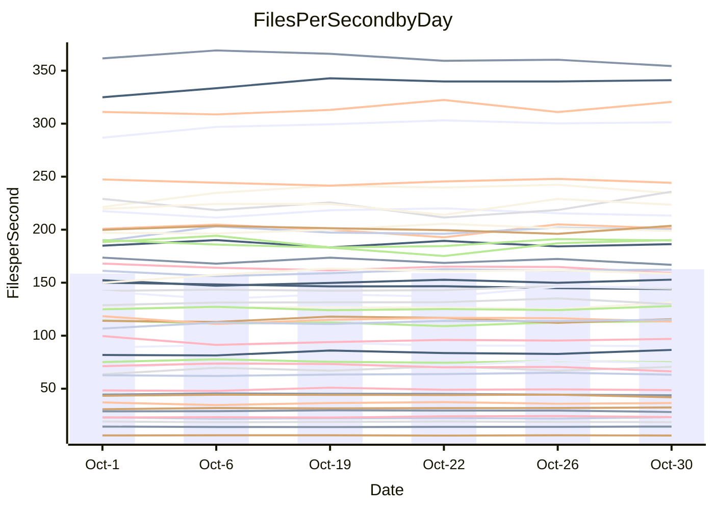

<!---
# This file is auto-generated. Do not edit.
# cspell:disable
--->
# Performance Report

## Daily Performance

```mermaid
xychart-beta
    title Files Per Second by Day
    y-axis Files per Second
    x-axis Date [Oct-1, Oct-6, Oct-19, Oct-22, Oct-26, Oct-30]
    bar [158.54, 157.78, 160.58, 159.03, 162.88, 162.58]
    line [14.24, 13.86, 13.81, 14.01, 14.02, 14.27]
    line [200.83, 204.79, 199.89, 192.85, 204.98, 201.28]
    line [63.55, 69.72, 67.05, 71.08, 67.00, 70.58]
    line [114.39, 111.42, 112.56, 109.04, 112.63, 113.54]
    line [5.92, 6.00, 6.02, 5.75, 6.03, 5.82]
    line [22.93, 21.69, 22.11, 22.28, 21.78, 23.08]
    line [22.85, 23.16, 22.78, 23.92, 24.17, 23.26]
    line [150.02, 148.37, 146.50, 146.67, 144.85, 143.95]
    line [125.90, 126.66, 126.74, 126.46, 125.04, 131.46]
    line [88.83, 91.13, 93.37, 90.70, 90.60, 90.12]
    line [44.41, 45.48, 45.18, 45.07, 44.31, 43.79]
    line [37.04, 34.53, 36.49, 37.33, 35.82, 36.46]
    line [18.99, 18.38, 18.69, 19.00, 18.63, 18.48]
    line [124.85, 127.28, 123.99, 125.15, 124.19, 127.94]
    line [113.99, 112.94, 118.00, 116.85, 112.16, 115.67]
    line [62.65, 62.01, 63.29, 63.79, 65.07, 63.21]
    line [99.59, 91.34, 93.97, 96.00, 95.45, 96.96]
    line [324.92, 333.43, 342.86, 339.81, 339.82, 341.06]
    line [221.42, 234.66, 241.48, 239.78, 242.41, 234.43]
    line [217.51, 211.32, 218.31, 220.10, 215.49, 213.26]
    line [173.65, 167.92, 173.59, 168.67, 172.42, 166.81]
    line [118.39, 111.00, 115.01, 116.88, 116.53, 113.27]
    line [229.06, 218.48, 225.66, 211.47, 218.53, 235.85]
    line [75.07, 77.78, 75.28, 74.51, 76.18, 74.87]
    line [30.62, 31.79, 31.44, 31.67, 31.78, 32.24]
    line [189.24, 203.08, 197.32, 196.05, 201.96, 199.91]
    line [168.02, 164.09, 161.71, 165.23, 164.80, 159.03]
    line [184.88, 190.21, 183.26, 189.47, 184.23, 186.30]
    line [197.08, 196.39, 199.93, 205.59, 201.31, 198.91]
    line [69.38, 74.54, 72.64, 71.96, 76.44, 74.01]
    line [28.67, 28.81, 29.58, 29.31, 29.41, 28.00]
    line [311.05, 308.73, 313.03, 322.37, 310.93, 320.56]
    line [142.24, 143.38, 142.44, 143.06, 146.69, 144.31]
    line [190.16, 185.98, 183.04, 175.20, 187.18, 190.25]
    line [199.85, 203.55, 201.34, 199.55, 196.07, 203.70]
    line [106.75, 112.35, 111.02, 113.95, 113.80, 115.07]
    line [71.27, 73.77, 73.27, 70.11, 70.57, 66.30]
    line [152.29, 147.14, 149.81, 152.74, 149.93, 152.84]
    line [219.58, 224.28, 224.21, 213.97, 229.01, 223.52]
    line [286.74, 296.93, 299.41, 303.13, 300.22, 301.32]
    line [361.56, 369.11, 365.93, 359.34, 360.33, 354.36]
    line [247.38, 244.34, 241.58, 245.56, 247.95, 244.22]
    line [128.76, 131.24, 131.49, 131.59, 135.21, 129.72]
    line [188.26, 194.31, 183.18, 184.56, 191.17, 189.83]
    line [43.36, 44.34, 44.15, 44.08, 44.42, 41.93]
    line [161.21, 156.12, 158.95, 162.77, 161.40, 162.25]
    line [48.37, 47.88, 50.97, 49.03, 49.37, 48.66]
    line [81.78, 81.41, 86.03, 83.62, 82.78, 86.57]
    line [149.87, 157.33, 163.29, 160.80, 161.82, 158.47]
    line [141.74, 134.66, 139.08, 136.76, 146.14, 145.96]
```

## Time to Process Files

| Repository                                      | Elapsed | Min/Avg/Max           |   SD | SD Graph                |
| ----------------------------------------------- | ------: | :-------------------: | ---: | ----------------------- |
| AdaDoom3/AdaDoom3                    |    3.84 | 3.4 /   3.5 /   3.7   | 0.09 | `     ┣━┻━━╋━━┻━┫    ●` |
| alexiosc/megistos                    |    7.75 | 7.3 /   8.0 /   8.6   | 0.34 | `    ┣━━┻●━╋━━┻━━┫    ` |
| apollographql/apollo-server          |    2.99 | 2.6 /   2.8 /   3.0   | 0.10 | `     ┣━┻━━╋━━┻━┫●    ` |
| aspnetboilerplate/aspnetboilerplate  |   11.02 | 10.3 /  10.5 /  10.9  | 0.21 | `    ┣━━┻━━╋━━┻━━┫●   ` |
| aws-amplify/docs                     |   12.66 | 12.4 /  12.9 /  13.9  | 0.44 | `    ┣━━┻●━╋━━┻━━┫    ` |
| Azure/azure-rest-api-specs           |    9.78 | 9.6 /  10.0 /  10.7   | 0.28 | `    ┣━━┻●━╋━━┻━━┫    ` |
| bitjson/typescript-starter           |    1.07 | 1.0 /   1.1 /   1.1   | 0.02 | `     ┣━━┻━●━┻━━┫     ` |
| caddyserver/caddy                    |    3.71 | 3.7 /   3.8 /   4.0   | 0.09 | `     ┣━●━━╋━━┻━┫     ` |
| canada-ca/open-source-logiciel-libre |    1.20 | 1.1 /   1.2 /   1.3   | 0.03 | `     ┣━┻━━╋●━┻━┫     ` |
| chef/chef                            |    5.88 | 5.7 /   6.0 /   6.4   | 0.18 | `    ┣━━┻●━╋━━┻━━┫    ` |
| dart-lang/sdk                        |   68.41 | 63.7 /  66.9 /  73.2  | 2.60 | `  ┣━━━┻━━━╋━●━┻━━━┫  ` |
| django/django                        |   14.58 | 14.9 /  15.6 /  16.5  | 0.50 | `   ●┣━━┻━━╋━━┻━━┫    ` |
| eslint/eslint                        |   11.25 | 10.7 /  11.1 /  11.8  | 0.36 | `    ┣━━┻━━╋●━┻━━┫    ` |
| exonum/exonum                        |    3.63 | 3.5 /   3.7 /   3.8   | 0.09 | `     ┣━┻━●╋━━┻━┫     ` |
| flutter/samples                      |   16.90 | 16.2 /  16.7 /  17.2  | 0.31 | `    ┣━━┻━━╋━●┻━━┫    ` |
| gitbucket/gitbucket                  |    3.54 | 3.5 /   3.7 /   3.8   | 0.09 | `     ●━┻━━╋━━┻━┫     ` |
| googleapis/google-cloud-cpp          |  139.44 | 139.9 / 148.4 / 165.8 | 6.88 | `  ┣━━●┻━━━╋━━━┻━━━┫  ` |
| graphql/express-graphql              |    1.08 | 1.1 /   1.2 /   1.2   | 0.03 | `   ● ┣━┻━━╋━━┻━┫     ` |
| graphql/graphql-js                   |    2.83 | 2.8 /   2.9 /   3.1   | 0.08 | `     ┣━●━━╋━━┻━┫     ` |
| graphql/graphql-relay-js             |    1.27 | 1.1 /   1.2 /   1.3   | 0.04 | `     ┣━┻━━╋━━┻●┫     ` |
| graphql/graphql-spec                 |    1.30 | 1.3 /   1.4 /   1.4   | 0.04 | `     ┣●┻━━╋━━┻━┫     ` |
| iluwatar/java-design-patterns        |   13.11 | 12.8 /  13.2 /  13.8  | 0.27 | `    ┣━━┻━●╋━━┻━━┫    ` |
| ktaranov/sqlserver-kit               |    8.23 | 6.6 /   6.8 /   7.1   | 0.18 | `       ┣━┻╋┻━┫      ●` |
| liriliri/licia                       |    4.23 | 4.1 /   4.3 /   4.4   | 0.09 | `    ┣━━┻━●╋━━┻━━┫    ` |
| MartinThoma/LaTeX-examples           |    6.95 | 6.8 /   7.0 /   7.6   | 0.21 | `    ┣━━┻━●╋━━┻━━┫    ` |
| mdx-js/mdx                           |    1.96 | 2.0 /   2.1 /   2.3   | 0.10 | `     ┣━●━━╋━━┻━┫     ` |
| microsoft/TypeScript-Website         |    5.69 | 5.6 /   5.8 /   6.1   | 0.16 | `    ┣━━┻●━╋━━┻━━┫    ` |
| MicrosoftDocs/PowerShell-Docs        |   23.46 | 23.3 /  24.2 /  27.2  | 0.99 | `   ┣━━━●━━╋━━┻━━━┫   ` |
| neovim/nvim-lspconfig                |    4.46 | 4.3 /   4.4 /   4.7   | 0.11 | `    ┣━━┻━━●━━┻━━┫    ` |
| pagekit/pagekit                      |    3.63 | 3.5 /   3.7 /   4.0   | 0.14 | `    ┣━━┻━●╋━━┻━━┫    ` |
| php/php-src                          |   26.39 | 26.3 /  27.5 /  30.2  | 1.15 | `   ┣━━━●━━╋━━┻━━━┫   ` |
| plasticrake/tplink-smarthome-api     |    1.37 | 1.3 /   1.4 /   1.5   | 0.04 | `     ┣━┻━●╋━━┻━┫     ` |
| prettier/prettier                    |    7.45 | 7.2 /   7.5 /   7.8   | 0.16 | `    ┣━━┻━●╋━━┻━━┫    ` |
| pycontribs/jira                      |    1.67 | 1.5 /   1.6 /   1.7   | 0.06 | `     ┣━┻━━╋━━●━┫     ` |
| RustPython/RustPython                |    5.24 | 5.2 /   5.4 /   5.8   | 0.19 | `    ┣━━●━━╋━━┻━━┫    ` |
| shoelace-style/shoelace              |    3.08 | 2.9 /   3.0 /   3.1   | 0.05 | `     ┣━┻━━╋━━┻━●     ` |
| slint-ui/slint                       |   13.02 | 13.1 /  13.7 /  14.4  | 0.41 | `    ┣●━┻━━╋━━┻━━┫    ` |
| SoftwareBrothers/admin-bro           |    2.99 | 2.6 /   2.7 /   2.9   | 0.08 | `     ┣━┻━━╋━━┻━┫    ●` |
| sveltejs/svelte                      |   22.34 | 21.4 /  22.0 /  22.9  | 0.44 | `    ┣━━┻━━╋━●┻━━┫    ` |
| TheAlgorithms/Python                 |    6.28 | 5.7 /   5.9 /   6.6   | 0.24 | `    ┣━━┻━━╋━━┻━●┫    ` |
| twbs/bootstrap                       |    1.85 | 1.8 /   1.9 /   2.0   | 0.05 | `     ┣━┻━━●━━┻━┫     ` |
| typescript-cheatsheets/react         |    1.42 | 1.4 /   1.5 /   1.6   | 0.06 | `     ┣━┻●━╋━━┻━┫     ` |
| typescript-eslint/typescript-eslint  |    4.31 | 4.2 /   4.3 /   4.5   | 0.09 | `     ┣━┻━━●━━┻━┫     ` |
| vitest-dev/vitest                    |    9.52 | 9.2 /  10.1 /  10.9   | 0.47 | `    ┣━●┻━━╋━━┻━━┫    ` |
| w3c/aria-practices                   |    3.79 | 3.5 /   3.6 /   3.7   | 0.10 | `     ┣━┻━━╋━━┻━┫●    ` |
| w3c/specberus                        |    2.03 | 2.0 /   2.1 /   2.3   | 0.07 | `     ┣━┻━●╋━━┻━┫     ` |
| webdeveric/webpack-assets-manifest   |    1.32 | 1.2 /   1.2 /   1.3   | 0.03 | `     ┣━━┻━╋━┻━━┫ ●   ` |
| webpack/webpack                      |    5.85 | 5.4 /   5.7 /   6.1   | 0.17 | `    ┣━━┻━━╋━━●━━┫    ` |
| wireapp/wire-desktop                 |    1.43 | 1.4 /   1.4 /   1.5   | 0.04 | `     ┣━┻━━●━━┻━┫     ` |
| wireapp/wire-webapp                  |   10.83 | 10.7 /  11.2 /  12.5  | 0.45 | `    ┣━━●━━╋━━┻━━┫    ` |

Note:
- Elapsed time is in seconds.

## Files per Second over Time

| Repository                                      | Files |    Sec |    Fps |     Rel | Trend Fps        |    N |
| ----------------------------------------------- | ----: | -----: | -----: | ------: | ---------------- | ---: |
| AdaDoom3/AdaDoom3                    |   103 |   3.84 |  26.85 |  -8.06% | `▆▆█▅██▆█▆█▇▇▇▃` |   13 |
| alexiosc/megistos                    |   583 |   7.75 |  75.21 |   2.73% | `▄▃▆▆▅▇▃▄▅█▆▅▅▆` |   13 |
| apollographql/apollo-server          |   253 |   2.99 |  84.71 |  -7.36% | `▇▄▇▅▇█▆▇▅▅▇▆█▄` |   13 |
| aspnetboilerplate/aspnetboilerplate  |  2286 |  11.02 | 207.39 |  -4.34% | `█▆▅▆▆███▇▆▆█▇▅` |   13 |
| aws-amplify/docs                     |  2871 |  12.66 | 226.83 |   1.84% | `▅█▆▇▇▇▆▇▄█▇█▆▇` |   13 |
| Azure/azure-rest-api-specs           |  2376 |   9.78 | 243.04 |  -0.91% | `▇▇▆▇▄▇▇▅█▇█▇▇▆` |   13 |
| bitjson/typescript-starter           |    20 |   1.07 |  18.72 |   0.17% | `▇█▆▆▅▇█▇█▇▇▅▅▇` |   13 |
| caddyserver/caddy                    |   288 |   3.71 |  77.71 |   2.96% | `▇▆██▇▆▇▆▆▇▇█▅█` |   13 |
| canada-ca/open-source-logiciel-libre |     7 |   1.20 |   5.85 |  -1.71% | `█▅█▇▇█▇▄▇██▇▆▆` |   13 |
| chef/chef                            |  1191 |   5.88 | 202.55 |   1.39% | `▅▆▇▄▇▆▇█▇▆█▆▅▇` |   13 |
| dart-lang/sdk                        | 10703 |  68.41 | 156.45 |  -1.83% | `▆▃▇▅▇▇██▆█▇▆▇▆` |   13 |
| django/django                        |  2877 |  14.58 | 197.28 |   7.01% | `▇▇▆▆▅▄▇▄▄▆▆▇▅█` |   13 |
| eslint/eslint                        |  2098 |  11.25 | 186.43 |  -1.10% | `█▅██▅▅▇▇▄▇▇▇█▆` |   13 |
| exonum/exonum                        |   421 |   3.63 | 115.84 |   0.83% | `▅▇▅▆██▇▆█▆▆▅▇▇` |   13 |
| flutter/samples                      |  2400 |  16.90 | 142.02 |  -1.34% | `▆▆▇▆▆▆▇█▅█▇██▆` |   13 |
| gitbucket/gitbucket                  |   413 |   3.54 | 116.68 |   4.20% | `█▆▆▅▅▅█▅▅▇▆▅▅█` |   13 |
| googleapis/google-cloud-cpp          | 20799 | 139.44 | 149.17 |   6.27% | `▆▇▇▃▆▅▆▇▄▇██▇█` |   13 |
| graphql/express-graphql              |    26 |   1.08 |  24.03 |   8.64% | `▇▆▄▆▅▅▅▇▄▄▅▆▅█` |   13 |
| graphql/graphql-js                   |   364 |   2.83 | 128.61 |   2.80% | `▆▇█▇█▇▅▆█▆█▅██` |   13 |
| graphql/graphql-relay-js             |    28 |   1.27 |  22.09 |  -5.88% | `▇▄▆▅▅▆▅█▅▇▇██▄` |   13 |
| graphql/graphql-spec                 |    19 |   1.30 |  14.57 |   4.23% | `▇▇▇▅▅▆▆▅▇▄█▆▆█` |   13 |
| iluwatar/java-design-patterns        |  1992 |  13.11 | 151.94 |   0.91% | `▇▇▆▆▆▇▆█▇█▇▅█▇` |   13 |
| ktaranov/sqlserver-kit               |   489 |   8.23 |  59.39 | -17.42% | `▇▅█▇██▇▅▆▆▅▇▇ ` |   13 |
| liriliri/licia                       |  1437 |   4.23 | 339.33 |   0.55% | `▅▅▅▇█▇█▇▇█▆▇▇▇` |   13 |
| MartinThoma/LaTeX-examples           |  1409 |   6.95 | 202.80 |   1.29% | `▆█▇█▇█▆▇▆▄█▆█▇` |   13 |
| mdx-js/mdx                           |   141 |   1.96 |  72.06 |   6.47% | `▃▆▇▇▅▇▆█▇▅▇▆▇█` |   13 |
| microsoft/TypeScript-Website         |   761 |   5.69 | 133.73 |   1.73% | `▅▆▅█▆▆▇▆▇▇██▅▇` |   13 |
| MicrosoftDocs/PowerShell-Docs        |  2708 |  23.46 | 115.45 |   3.13% | `█▃▇▇▇▆▆▇██▆███` |   13 |
| neovim/nvim-lspconfig                |   759 |   4.46 | 170.36 |  -0.32% | `▇█▇▅██▆▅▇▇▇▇▅▇` |   13 |
| pagekit/pagekit                      |   741 |   3.63 | 204.28 |   1.76% | `▆▆█▆▇█▄▅▅▇█▇▆▇` |   13 |
| php/php-src                          |  2289 |  26.39 |  86.75 |   3.80% | `▅▇▄█▇███▅▇▆▆██` |   13 |
| plasticrake/tplink-smarthome-api     |    62 |   1.37 |  45.34 |   1.51% | `▇▆███▆█▇█▆▅█▅▇` |   13 |
| prettier/prettier                    |  2374 |   7.45 | 318.58 |   1.54% | `▆▆▅▆▆▆▆█▇▅▅██▇` |   13 |
| pycontribs/jira                      |    79 |   1.67 |  47.33 |  -4.10% | `▅▅▆▄█▆▇▆▅▄▆█▆▄` |   13 |
| RustPython/RustPython                |   688 |   5.24 | 131.42 |   3.87% | `▅▇▆▆▅▇▆▄█▅▄███` |   13 |
| shoelace-style/shoelace              |   439 |   3.08 | 142.45 |  -3.03% | `█▇▇▇▇▇▆▇▇▇▅▇▆▅` |   13 |
| slint-ui/slint                       |  2543 |  13.02 | 195.24 |   5.36% | `▆▆▇▇▄▇▆▇▆▄▆▇▄█` |   13 |
| SoftwareBrothers/admin-bro           |   441 |   2.99 | 147.45 | -10.63% | `▇██▅▇▇▄▇▆▇▇▆█▃` |   13 |
| sveltejs/svelte                      |  8016 |  22.34 | 358.77 |  -0.95% | `▆▇▇█▇▇█▇▆▆▆▇▅▆` |   13 |
| TheAlgorithms/Python                 |  1399 |   6.28 | 222.67 |  -6.31% | `▆▃▇▆▇▇█▇▇█▇██▅` |   13 |
| twbs/bootstrap                       |   118 |   1.85 |  63.67 |   0.37% | `▅▇▆▅▄▇█▇▆▇█▇▆▆` |   13 |
| typescript-cheatsheets/react         |    53 |   1.42 |  37.22 |   2.85% | `▇▇▃▇▇▇▇█▇█▄▆▆▇` |   13 |
| typescript-eslint/typescript-eslint  |  1285 |   4.31 | 298.31 |   0.03% | `▅▅▇▆▇▇▇█▇██▆█▇` |   13 |
| vitest-dev/vitest                    |  2212 |   9.52 | 232.38 |   4.53% | `█▅▄▆▅▇▆▅▄▄▅▆█▇` |   13 |
| w3c/aria-practices                   |   414 |   3.79 | 109.10 |  -5.73% | `██▅▅▆▅██▆▇▆█▇▄` |   13 |
| w3c/specberus                        |   197 |   2.03 |  96.86 |   1.62% | `▇█▃▆▆▅▆▇▆▆▆▇▇▇` |   13 |
| webdeveric/webpack-assets-manifest   |    55 |   1.32 |  41.63 |  -5.31% | `▆▅▆▇▅▇▇▇▆█▆▆▄▄` |   13 |
| webpack/webpack                      |  1137 |   5.85 | 194.43 |  -2.03% | `▄▆▇█▆█▆▇▆█▇▇█▆` |   13 |
| wireapp/wire-desktop                 |    46 |   1.43 |  32.06 |   1.60% | `▄▅▅█▇▆▅▇▆▅█▇▇▇` |   13 |
| wireapp/wire-webapp                  |  1781 |  10.83 | 164.47 |   2.73% | `█▆▄█▇▆▇▇█▇█▆▇█` |   13 |

## Data Throughput

| Repository                                      | Files |    Sec |     Kps |     Rel | Trend Kps        |    N |
| ----------------------------------------------- | ----: | -----: | ------: | ------: | ---------------- | ---: |
| AdaDoom3/AdaDoom3                    |   103 |   3.84 |  570.70 |  -8.06% | `▆▆█▅██▆█▆█▇▇▇▃` |   13 |
| alexiosc/megistos                    |   583 |   7.75 |  591.00 |   2.73% | `▄▃▆▆▅▇▃▄▅█▆▅▅▆` |   13 |
| apollographql/apollo-server          |   253 |   2.99 |  690.72 |  -6.20% | `▇▄▇▅▇█▆▇▅▅▆▆█▄` |   13 |
| aspnetboilerplate/aspnetboilerplate  |  2286 |  11.02 |  504.60 |  -4.34% | `█▆▅▆▆███▇▆▆█▇▅` |   13 |
| aws-amplify/docs                     |  2871 |  12.66 |  791.80 |   1.83% | `▅█▆▇▇▇▆▇▄█▇█▆▇` |   13 |
| Azure/azure-rest-api-specs           |  2376 |   9.78 |  659.86 |   0.77% | `▇▆▅▇▄▇▇▅█▇█▇▇▇` |   13 |
| bitjson/typescript-starter           |    20 |   1.07 |   74.88 |   0.17% | `▇█▆▆▅▇█▇█▇▇▅▅▇` |   13 |
| caddyserver/caddy                    |   288 |   3.71 |  673.72 |   3.68% | `▇▅█▇▆▅▇▆▆▇▇█▅█` |   13 |
| canada-ca/open-source-logiciel-libre |     7 |   1.20 |   48.43 |  -1.71% | `█▅█▇▇█▇▄▇██▇▆▆` |   13 |
| chef/chef                            |  1191 |   5.88 |  938.79 |   1.69% | `▅▆▇▄▇▆▆█▇▆█▆▆▇` |   13 |
| dart-lang/sdk                        | 10703 |  68.41 | 1065.39 |  -2.07% | `▆▃▇▅▇▇██▆█▇▆▇▆` |   13 |
| django/django                        |  2877 |  14.58 | 1239.96 |   7.18% | `▆▇▆▆▅▄▇▄▄▆▆▇▅█` |   13 |
| eslint/eslint                        |  2098 |  11.25 | 1340.38 |  -1.22% | `█▅██▅▅▇▇▄▇▇▇█▆` |   13 |
| exonum/exonum                        |   421 |   3.63 | 1108.04 |   0.83% | `▅▇▅▆██▇▆█▆▆▅▇▇` |   13 |
| flutter/samples                      |  2400 |  16.90 | 1267.39 |  -1.34% | `▆▆▇▆▆▆▇█▅█▇██▆` |   13 |
| gitbucket/gitbucket                  |   413 |   3.54 |  530.27 |   4.17% | `█▆▆▅▅▅█▅▅▇▆▅▅█` |   13 |
| googleapis/google-cloud-cpp          | 20799 | 139.44 | 1211.65 |   6.27% | `▆▇▇▃▆▅▆▇▄▇██▇█` |   13 |
| graphql/express-graphql              |    26 |   1.08 |  110.00 |   8.64% | `▇▆▄▆▅▅▅▇▄▄▅▆▅█` |   13 |
| graphql/graphql-js                   |   364 |   2.83 |  743.40 |   3.12% | `▆▇█▇▇▇▄▆█▆█▅██` |   13 |
| graphql/graphql-relay-js             |    28 |   1.27 |   86.78 |  -5.88% | `▇▄▆▅▅▆▅█▅▇▇██▄` |   13 |
| graphql/graphql-spec                 |    19 |   1.30 |  486.08 |   4.23% | `▇▇▇▅▅▆▆▅▇▄█▆▆█` |   13 |
| iluwatar/java-design-patterns        |  1992 |  13.11 |  469.63 |   0.91% | `▇▇▆▆▆▇▆█▇█▇▅█▇` |   13 |
| ktaranov/sqlserver-kit               |   489 |   8.23 |  899.24 | -17.42% | `▇▅█▇██▇▅▆▆▅▇▇ ` |   13 |
| liriliri/licia                       |  1437 |   4.23 |  404.26 |   0.55% | `▅▅▅▇█▇█▇▇█▆▇▇▇` |   13 |
| MartinThoma/LaTeX-examples           |  1409 |   6.95 |  418.83 |   1.29% | `▆█▇█▇█▆▇▆▄█▆█▇` |   13 |
| mdx-js/mdx                           |   141 |   1.96 |  335.28 |   6.47% | `▃▆▇▇▅▇▆█▇▅▇▆▇█` |   13 |
| microsoft/TypeScript-Website         |   761 |   5.69 |  925.05 |   1.74% | `▅▆▅█▆▆▇▆▇▇██▅▇` |   13 |
| MicrosoftDocs/PowerShell-Docs        |  2708 |  23.46 | 1188.22 |   3.15% | `▇▃▇▇▇▆▆▇██▆███` |   13 |
| neovim/nvim-lspconfig                |   759 |   4.46 |  284.61 |  -0.08% | `▇█▇▅██▆▅▇▇▇▇▅▇` |   13 |
| pagekit/pagekit                      |   741 |   3.63 |  425.92 |   1.76% | `▆▆█▆▇█▄▅▅▇█▇▆▇` |   13 |
| php/php-src                          |  2289 |  26.39 | 1515.24 |   3.97% | `▅▇▄█▇███▅▇▆▆██` |   13 |
| plasticrake/tplink-smarthome-api     |    62 |   1.37 |  244.98 |   1.51% | `▇▆███▆█▇█▆▅█▅▇` |   13 |
| prettier/prettier                    |  2374 |   7.45 |  445.12 |   1.31% | `▆▆▆▆▆▆▆█▇▅▅██▇` |   13 |
| pycontribs/jira                      |    79 |   1.67 |  335.51 |  -4.10% | `▅▅▆▄█▆▇▆▅▄▆█▆▄` |   13 |
| RustPython/RustPython                |   688 |   5.24 | 1048.10 |   4.67% | `▅▇▆▆▅▇▆▄█▅▄███` |   13 |
| shoelace-style/shoelace              |   439 |   3.08 |  688.23 |  -3.03% | `█▇▇▇▇▇▆▇▇▇▅▇▆▅` |   13 |
| slint-ui/slint                       |  2543 |  13.02 | 1204.25 |   5.67% | `▆▆▇▇▄▆▆▇▆▄▆▇▄█` |   13 |
| SoftwareBrothers/admin-bro           |   441 |   2.99 |  324.98 | -10.63% | `▇██▅▇▇▄▇▆▇▇▆█▃` |   13 |
| sveltejs/svelte                      |  8016 |  22.34 |  239.09 |  -1.14% | `▆▇▇█▇▇█▇▆▆▆▇▅▆` |   13 |
| TheAlgorithms/Python                 |  1399 |   6.28 |  566.31 |  -6.28% | `▆▃▇▆▇▇█▇▇█▇██▅` |   13 |
| twbs/bootstrap                       |   118 |   1.85 |  522.35 |   0.37% | `▅▇▆▅▄▇█▇▆▇█▇▆▆` |   13 |
| typescript-cheatsheets/react         |    53 |   1.42 |  275.28 |   2.85% | `▇▇▃▇▇▇▇█▇█▄▆▆▇` |   13 |
| typescript-eslint/typescript-eslint  |  1285 |   4.31 | 1533.78 |   0.10% | `▅▅▇▆▇▇▇█▇██▆█▇` |   13 |
| vitest-dev/vitest                    |  2212 |   9.52 |  518.86 |   3.73% | `█▆▅▆▅▇▆▅▄▄▅▆█▇` |   13 |
| w3c/aria-practices                   |   414 |   3.79 | 1017.25 |  -5.73% | `██▅▅▆▅██▆▇▆█▇▄` |   13 |
| w3c/specberus                        |   197 |   2.03 |  306.32 |   1.80% | `▇█▃▆▆▆▆▇▆▆▆▇▇▇` |   13 |
| webdeveric/webpack-assets-manifest   |    55 |   1.32 |   96.12 |  -5.71% | `▆▆▇▇▅▇▇▇▆█▆▆▄▄` |   13 |
| webpack/webpack                      |  1137 |   5.85 |  879.47 |  -2.72% | `▄▆▇█▆█▆▆▆█▇▇█▆` |   13 |
| wireapp/wire-desktop                 |    46 |   1.43 |  179.13 |   5.66% | `▂▃▂█▇▇▆▇▇▆█▇█▇` |   13 |
| wireapp/wire-webapp                  |  1781 |  10.83 |  607.18 |   3.43% | `▇▆▃█▇▆▇▇█▇█▇▇█` |   13 |

