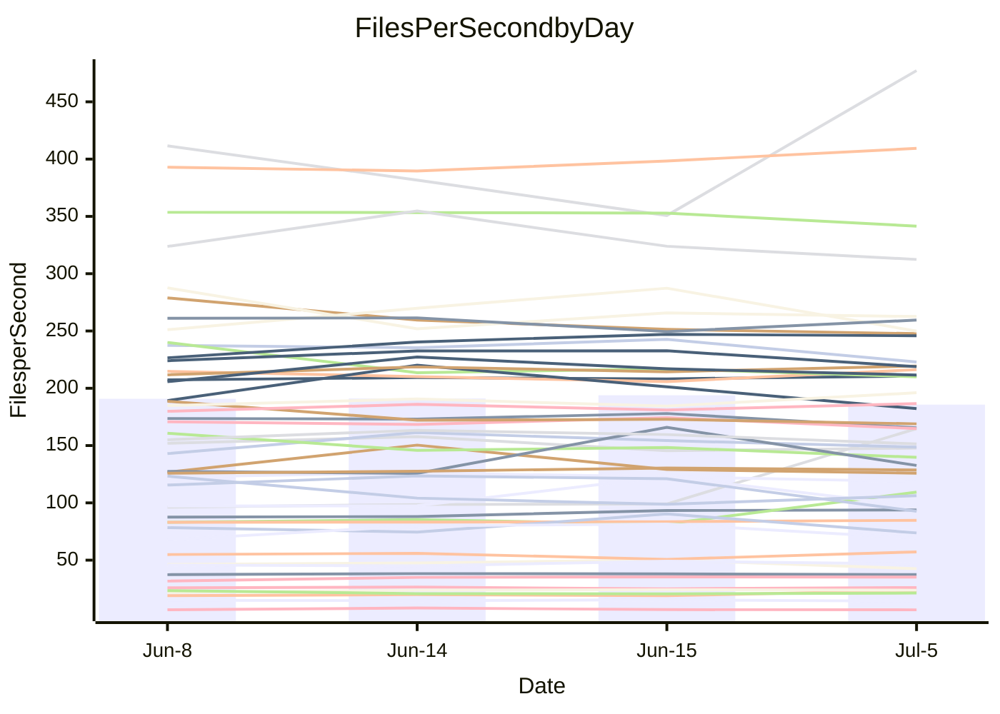

<!---
# This file is auto-generated. Do not edit.
# cspell:disable
--->
# Performance Report

Daily Performance

```mermaid
xychart-beta
    title Files Per Second by Day
    y-axis Files per Second
    x-axis Date [Jun-8, Jun-14, Jun-15, Jul-5]
    bar [190.81, 191.12, 193.90, 185.73]
    line [87.60, 88.07, 93.31, 93.80]
    line [19.01, 19.91, 18.97, 23.53]
    line [96.25, 98.55, 99.04, 164.82]
    line [83.02, 85.34, 81.59, 109.42]
    line [278.90, 259.60, 251.39, 247.65]
    line [237.41, 235.41, 242.68, 222.99]
    line [6.70, 8.24, 6.81, 6.64]
    line [207.37, 209.33, 208.22, 210.67]
    line [251.08, 269.77, 287.34, 249.92]
    line [122.50, 126.17, 122.75, 118.64]
    line [37.33, 38.26, 38.06, 37.35]
    line [214.78, 210.20, 205.78, 216.28]
    line [151.99, 157.77, 145.55, 147.78]
    line [240.01, 213.64, 216.83, 210.05]
    line [126.80, 150.40, 129.14, 125.87]
    line [142.96, 161.35, 154.33, 148.59]
    line [25.84, 26.48, 25.01, 26.06]
    line [189.21, 220.12, 201.30, 182.25]
    line [21.85, 23.82, 24.25, 23.76]
    line [15.02, 14.65, 15.42, 14.18]
    line [173.63, 173.03, 177.99, 165.46]
    line [83.05, 83.17, 83.60, 84.77]
    line [411.63, 381.64, 350.78, 477.25]
    line [160.74, 145.81, 148.34, 139.76]
    line [211.77, 218.65, 214.39, 219.42]
    line [78.36, 74.53, 90.33, 73.78]
    line [170.78, 168.46, 174.35, 164.88]
    line [224.05, 232.54, 232.69, 218.87]
    line [46.28, 47.54, 50.24, 42.58]
    line [97.18, 97.48, 122.92, 97.19]
    line [127.50, 125.76, 165.92, 132.65]
    line [54.91, 55.98, 50.73, 57.23]
    line [155.04, 163.34, 159.60, 151.46]
    line [353.54, 353.38, 352.89, 341.53]
    line [188.61, 172.10, 172.90, 168.97]
    line [115.54, 123.50, 121.07, 92.70]
    line [179.92, 185.95, 181.08, 186.60]
    line [226.60, 240.44, 247.10, 245.81]
    line [287.65, 251.95, 265.72, 262.63]
    line [67.74, 79.92, 81.44, 69.20]
    line [261.13, 261.42, 249.50, 259.50]
    line [392.96, 389.62, 398.36, 409.34]
    line [323.78, 354.69, 323.95, 312.42]
    line [23.44, 20.77, 20.56, 21.31]
    line [125.89, 127.61, 130.38, 128.69]
    line [123.34, 104.15, 98.74, 106.25]
    line [31.73, 34.98, 35.43, 35.17]
    line [205.74, 227.27, 217.03, 211.59]
    line [184.92, 190.66, 184.43, 196.08]
    line [45.74, 44.93, 49.08, 46.76]
```

Time to Process Files

| Repository                                      | Elapsed | Min/Avg/Max          |   SD | SD Graph                |
| ----------------------------------------------- | ------: | :------------------: | ---: | ----------------------- |
| AdaDoom3/AdaDoom3                    |    2.76 | 2.6 /   2.7 /   2.8  | 0.06 | `     ┣━┻━━╋━●┻━┫     ` |
| alexiosc/megistos                    |    5.33 | 6.8 /   7.0 /   7.2  | 0.16 | `●       ┣┻╋┻┫        ` |
| apollographql/apollo-server          |    1.55 | 2.5 /   2.6 /   2.8  | 0.09 | `●       ┣┻╋┻┫        ` |
| aspnetboilerplate/aspnetboilerplate  |    9.24 | 7.3 /   8.6 /   9.2  | 0.58 | `    ┣━━┻━━╋━━●━━┫    ` |
| aws-amplify/docs                     |   13.27 | 12.2 /  12.5 /  12.9 | 0.21 | `    ┣━━┻━━╋━━┻━━┫   ●` |
| Azure/azure-rest-api-specs           |    9.97 | 7.6 /   9.5 /  10.7  | 1.02 | `    ┣━━┻━━╋●━┻━━┫    ` |
| bitjson/typescript-starter           |    0.85 | 0.9 /   1.0 /   1.1  | 0.05 | ` ●   ┣━┻━━╋━━┻━┫     ` |
| caddyserver/caddy                    |    3.43 | 3.4 /   3.5 /   3.7  | 0.10 | `     ┣━●━━╋━━┻━┫     ` |
| canada-ca/open-source-logiciel-libre |    1.05 | 0.6 /   1.0 /   1.1  | 0.15 | `     ┣━┻━━╋●━┻━┫     ` |
| chef/chef                            |    4.90 | 4.7 /   5.0 /   5.1  | 0.14 | `    ┣━━┻━●╋━━┻━━┫    ` |
| dart-lang/sdk                        |   63.06 | 44.7 /  56.9 /  70.0 | 6.78 | `  ┣━━━┻━━━╋━━━●━━━┫  ` |
| django/django                        |   13.93 | 10.4 /  13.1 /  13.9 | 1.11 | `    ┣━━┻━━╋━━●━━┫    ` |
| eslint/eslint                        |    9.62 | 9.6 /   9.8 /  10.1  | 0.23 | `    ┣━━●━━╋━━┻━━┫    ` |
| exonum/exonum                        |    3.55 | 3.3 /   3.4 /   3.6  | 0.09 | `     ┣━┻━━╋━━┻●┫     ` |
| flutter/samples                      |   11.48 | 9.0 /  11.1 /  12.4  | 0.99 | `    ┣━━┻━━╋●━┻━━┫    ` |
| gitbucket/gitbucket                  |    3.31 | 2.5 /   3.1 /   3.4  | 0.35 | `    ┣━━┻━━╋━●┻━━┫    ` |
| googleapis/google-cloud-cpp          |  126.14 | 95.3 / 119.1 / 126.5 | 9.88 | `  ┣━━━┻━━━╋━━●┻━━━┫  ` |
| graphql/express-graphql              |    1.09 | 1.1 /   1.1 /   1.3  | 0.09 | `     ┣━┻━●╋━━┻━┫     ` |
| graphql/graphql-js                   |    3.70 | 2.6 /   3.3 /   3.8  | 0.42 | `    ┣━━┻━━╋━━●━━┫    ` |
| graphql/graphql-relay-js             |    1.07 | 1.0 /   1.1 /   1.1  | 0.04 | `     ┣━┻━━●━━┻━┫     ` |
| graphql/graphql-spec                 |    1.34 | 1.2 /   1.3 /   1.3  | 0.04 | `     ┣━┻━━╋━━┻●┫     ` |
| iluwatar/java-design-patterns        |   12.63 | 11.6 /  12.0 /  12.3 | 0.30 | `    ┣━━┻━━╋━━┻━━┫●   ` |
| ktaranov/sqlserver-kit               |    5.78 | 5.8 /   5.9 /   6.0  | 0.06 | `     ●━┻━━╋━━┻━┫     ` |
| liriliri/licia                       |    3.01 | 3.0 /   3.7 /   4.1  | 0.33 | `    ●━━┻━━╋━━┻━━┫    ` |
| MartinThoma/LaTeX-examples           |    6.44 | 6.0 /   6.2 /   6.4  | 0.15 | `    ┣━━┻━━╋━━┻━●┫    ` |
| mdx-js/mdx                           |    1.88 | 1.5 /   1.8 /   1.9  | 0.11 | `     ┣━┻━━╋━●┻━┫     ` |
| microsoft/TypeScript-Website         |    5.47 | 4.1 /   5.1 /   5.6  | 0.44 | `    ┣━━┻━━╋━━●━━┫    ` |
| MicrosoftDocs/PowerShell-Docs        |   23.57 | 18.8 /  23.9 /  26.4 | 2.28 | `   ┣━━━┻━━●━━┻━━━┫   ` |
| neovim/nvim-lspconfig                |    5.23 | 4.9 /   5.1 /   5.3  | 0.13 | `    ┣━━┻━━╋━━┻●━┫    ` |
| pagekit/pagekit                      |    3.38 | 3.3 /   3.4 /   3.6  | 0.08 | `     ┣━┻●━╋━━┻━┫     ` |
| php/php-src                          |   23.78 | 18.7 /  22.9 /  24.5 | 1.82 | `   ┣━━━┻━━╋━●┻━━━┫   ` |
| plasticrake/tplink-smarthome-api     |    1.46 | 1.2 /   1.3 /   1.4  | 0.06 | `     ┣━┻━━╋━━┻━┫ ●   ` |
| prettier/prettier                    |    7.70 | 7.3 /   7.6 /   7.8  | 0.17 | `    ┣━━┻━━╋●━┻━━┫    ` |
| pycontribs/jira                      |    1.40 | 1.4 /   1.5 /   1.6  | 0.07 | `     ┣━┻●━╋━━┻━┫     ` |
| RustPython/RustPython                |    8.89 | 6.5 /   6.7 /   7.2  | 0.21 | `        ┣┻╋┻┫       ●` |
| shoelace-style/shoelace              |    2.91 | 2.7 /   2.8 /   2.9  | 0.09 | `     ┣━┻━━╋━━┻●┫     ` |
| slint-ui/slint                       |   13.87 | 13.4 /  13.9 /  14.5 | 0.39 | `    ┣━━┻━━●━━┻━━┫    ` |
| SoftwareBrothers/admin-bro           |    2.36 | 2.4 /   2.4 /   2.5  | 0.05 | `     ┣━●━━╋━━┻━┫     ` |
| sveltejs/svelte                      |   21.74 | 22.0 /  22.6 /  23.2 | 0.43 | `    ●━━┻━━╋━━┻━━┫    ` |
| TheAlgorithms/Python                 |    5.37 | 4.1 /   5.3 /   5.7  | 0.51 | `    ┣━━┻━━●━━┻━━┫    ` |
| twbs/bootstrap                       |    1.71 | 1.3 /   1.6 /   1.8  | 0.18 | `     ┣━┻━━╋━●┻━┫     ` |
| typescript-cheatsheets/react         |    1.13 | 0.9 /   1.1 /   1.2  | 0.10 | `     ┣━┻━━●━━┻━┫     ` |
| typescript-eslint/typescript-eslint  |    4.23 | 3.1 /   4.0 /   4.3  | 0.35 | `    ┣━━┻━━╋━●┻━━┫    ` |
| vitest-dev/vitest                    |   10.52 | 10.1 /  10.4 /  10.9 | 0.26 | `    ┣━━┻━━╋●━┻━━┫    ` |
| w3c/aria-practices                   |    3.24 | 3.2 /   3.3 /   3.3  | 0.04 | `     ┣━┻━●╋━━┻━┫     ` |
| w3c/specberus                        |    1.84 | 1.2 /   1.8 /   2.0  | 0.27 | `    ┣━━┻━━●━━┻━━┫    ` |
| webdeveric/webpack-assets-manifest   |    1.18 | 1.1 /   1.2 /   1.3  | 0.06 | `     ┣━┻━●╋━━┻━┫     ` |
| webpack/webpack                      |    5.85 | 4.5 /   5.5 /   5.9  | 0.43 | `    ┣━━┻━━╋━●┻━━┫    ` |
| wireapp/wire-desktop                 |    1.25 | 1.2 /   1.3 /   1.6  | 0.11 | `     ┣━┻●━╋━━┻━┫     ` |
| wireapp/wire-webapp                  |   11.94 | 11.5 /  12.0 /  12.3 | 0.30 | `    ┣━━┻━━●━━┻━━┫    ` |

Note:
- Elapsed time is in seconds.

Files per Second over Time

| Repository                                      | Files |    Sec |    Fps |     Rel | Trend Fps  |    N |
| ----------------------------------------------- | ----: | -----: | -----: | ------: | ---------- | ---: |
| AdaDoom3/AdaDoom3                    |   103 |   2.76 |  37.35 |  -1.28% | `▅▇▅█▇▆▇▆` |    7 |
| alexiosc/megistos                    |   583 |   5.33 | 109.42 |  30.55% | `▂▃▃▃▃▃▂█` |    7 |
| apollographql/apollo-server          |   255 |   1.55 | 164.82 |  68.82% | `▁▂▂▂▂▂▂█` |    7 |
| aspnetboilerplate/aspnetboilerplate  |  2288 |   9.24 | 247.65 |  -7.14% | `▄█▄▄▃▄▃▃` |    7 |
| aws-amplify/docs                     |  2959 |  13.27 | 222.99 |  -6.03% | `▇▇▇▅▇▇█▄` |    7 |
| Azure/azure-rest-api-specs           |  2491 |   9.97 | 249.92 |  -5.43% | `▂▃▄▂█▃▆▃` |    7 |
| bitjson/typescript-starter           |    20 |   0.85 |  23.53 |  21.34% | `▂▄▄▃▆▅▃█` |    7 |
| caddyserver/caddy                    |   322 |   3.43 |  93.80 |   5.85% | `▅▅▆▄▇▅██` |    7 |
| canada-ca/open-source-logiciel-libre |     7 |   1.05 |   6.64 |  -9.90% | `▂▁▂▂▂█▂▂` |    7 |
| chef/chef                            |  1032 |   4.90 | 210.67 |   1.12% | `▇▄▅▅█▅▆▆` |    7 |
| dart-lang/sdk                        | 11492 |  63.06 | 182.25 | -10.74% | `▄▂▄▄▄█▄▃` |    7 |
| django/django                        |  2927 |  13.93 | 210.05 |  -6.81% | `▃▃█▃▃▂▃▂` |    7 |
| eslint/eslint                        |  2080 |   9.62 | 216.28 |   2.25% | `█▇█▅▆█▅█` |    7 |
| exonum/exonum                        |   421 |   3.55 | 118.64 |  -4.40% | `▆▇▄▇▆█▆▅` |    7 |
| flutter/samples                      |  1696 |  11.48 | 147.78 |  -3.75% | `▄▄▄█▂▃▃▃` |    7 |
| gitbucket/gitbucket                  |   417 |   3.31 | 125.87 |  -8.29% | `▃▃▂▂▇█▃▃` |    7 |
| googleapis/google-cloud-cpp          | 21314 | 126.14 | 168.97 |  -5.76% | `▂▃█▃▂▃▃▂` |    7 |
| graphql/express-graphql              |    26 |   1.09 |  23.76 |   3.11% | `▃▃█▆█▇█▇` |    7 |
| graphql/graphql-js                   |   550 |   3.70 | 148.59 |  -2.55% | `▃▂▅▄█▃▄▄` |    7 |
| graphql/graphql-relay-js             |    28 |   1.07 |  26.06 |   0.26% | `▅▄█▆▆█▅▆` |    7 |
| graphql/graphql-spec                 |    19 |   1.34 |  14.18 |  -4.94% | `▇▆█▇▇▄█▅` |    7 |
| iluwatar/java-design-patterns        |  2089 |  12.63 | 165.46 |  -4.90% | `█▆▅▅▅██▄` |    7 |
| ktaranov/sqlserver-kit               |   490 |   5.78 |  84.77 |   1.91% | `▇▆█▇▇▇▇█` |    7 |
| liriliri/licia                       |  1438 |   3.01 | 477.25 |  22.34% | `█▃▃▃▄▃▂█` |    7 |
| MartinThoma/LaTeX-examples           |  1409 |   6.44 | 218.87 |  -4.39% | `▅▅▇█▇██▅` |    7 |
| mdx-js/mdx                           |   139 |   1.88 |  73.78 |  -5.93% | `▅▄▄▄▃▃█▃` |    7 |
| microsoft/TypeScript-Website         |   765 |   5.47 | 139.76 |  -8.40% | `▄█▃▄▃▂▃▂` |    7 |
| MicrosoftDocs/PowerShell-Docs        |  3126 |  23.57 | 132.65 |   0.31% | `▄▃▂▃▃▃█▄` |    7 |
| neovim/nvim-lspconfig                |   863 |   5.23 | 164.88 |  -3.18% | `█▇▆▇▇▅█▅` |    7 |
| pagekit/pagekit                      |   741 |   3.38 | 219.42 |   2.02% | `▇▅▆▆██▆█` |    7 |
| php/php-src                          |  2311 |  23.78 |  97.19 |  -3.76% | `▃▃▃▃▄▂█▃` |    7 |
| plasticrake/tplink-smarthome-api     |    62 |   1.46 |  42.58 | -10.14% | `▅▇▄▅▇▇█▃` |    7 |
| prettier/prettier                    |  2629 |   7.70 | 341.53 |  -3.35% | `▅█▅▇▅▇▆▅` |    7 |
| pycontribs/jira                      |    80 |   1.40 |  57.23 |   4.48% | `▄█▇█▇▇▄█` |    7 |
| RustPython/RustPython                |   824 |   8.89 |  92.70 | -22.58% | `▄▅███▇▇ ` |    7 |
| shoelace-style/shoelace              |   440 |   2.91 | 151.46 |  -4.89% | `▇▄▅██▇▇▅` |    7 |
| slint-ui/slint                       |  3410 |  13.87 | 245.81 |   4.40% | `▄▅▅▆▇███` |    7 |
| SoftwareBrothers/admin-bro           |   441 |   2.36 | 186.60 |   2.15% | `▇▇▅███▇█` |    7 |
| sveltejs/svelte                      |  8900 |  21.74 | 409.34 |   4.34% | `▇▅█▆▅▆▇█` |    7 |
| TheAlgorithms/Python                 |  1411 |   5.37 | 262.63 |  -2.45% | `█▂▃▂▃▂▃▃` |    7 |
| twbs/bootstrap                       |   118 |   1.71 |  69.20 |  -7.64% | `▄▂▃▃█▆▆▃` |    7 |
| typescript-cheatsheets/react         |    24 |   1.13 |  21.31 |  -2.60% | `▃▃█▃▂▂▂▃` |    7 |
| typescript-eslint/typescript-eslint  |  1323 |   4.23 | 312.42 |  -7.31% | `▃▃▃▂█▃▃▂` |    7 |
| vitest-dev/vitest                    |  2730 |  10.52 | 259.50 |  -0.04% | `██▆█▇█▅▇` |    7 |
| w3c/aria-practices                   |   417 |   3.24 | 128.69 |   1.12% | `▆▇▆▇▇▇█▇` |    7 |
| w3c/specberus                        |   196 |   1.84 | 106.25 |  -4.79% | `█▁▂▂▂▂▂▂` |    7 |
| webdeveric/webpack-assets-manifest   |    55 |   1.18 |  46.76 |   1.94% | `▆▇▅▃▆▇█▇` |    7 |
| webpack/webpack                      |  1237 |   5.85 | 211.59 |  -2.30% | `▂▃▄█▄▃▄▄` |    7 |
| wireapp/wire-desktop                 |    44 |   1.25 |  35.17 |   4.52% | `▆▃▆██▇██` |    7 |
| wireapp/wire-webapp                  |  2342 |  11.94 | 196.08 |   4.68% | `▅▇▅▇█▅▅█` |    7 |

Data Throughput

| Repository                                      | Files |    Sec |     Kps |     Rel | Trend Kps  |    N |
| ----------------------------------------------- | ----: | -----: | ------: | ------: | ---------- | ---: |
| AdaDoom3/AdaDoom3                    |   103 |   2.76 |  793.69 |  -1.28% | `▅▇▅█▇▆▇▆` |    7 |
| alexiosc/megistos                    |   583 |   5.33 |  859.75 |  30.55% | `▂▃▃▃▃▃▂█` |    7 |
| apollographql/apollo-server          |   255 |   1.55 | 1361.89 |  68.82% | `▁▂▂▂▂▂▂█` |    7 |
| aspnetboilerplate/aspnetboilerplate  |  2288 |   9.24 |  605.38 |  -6.71% | `▄█▄▄▃▄▃▃` |    7 |
| aws-amplify/docs                     |  2959 |  13.27 |  806.34 |  -6.03% | `▇▇▇▅▇▇█▄` |    7 |
| Azure/azure-rest-api-specs           |  2491 |   9.97 |  764.32 |  -4.59% | `▂▃▄▂█▃▆▃` |    7 |
| bitjson/typescript-starter           |    20 |   0.85 |   94.10 |  21.34% | `▂▄▄▃▆▅▃█` |    7 |
| caddyserver/caddy                    |   322 |   3.43 |  849.74 |   6.36% | `▅▅▅▄▇▅██` |    7 |
| canada-ca/open-source-logiciel-libre |     7 |   1.05 |   55.04 |  -9.90% | `▂▁▂▂▂█▂▂` |    7 |
| chef/chef                            |  1032 |   4.90 | 1034.15 |   1.25% | `▇▄▅▅█▅▆▆` |    7 |
| dart-lang/sdk                        | 11492 |  63.06 | 1244.53 | -10.73% | `▄▂▄▄▄█▄▃` |    7 |
| django/django                        |  2927 |  13.93 | 1348.59 |  -6.71% | `▃▃█▃▃▂▃▂` |    7 |
| eslint/eslint                        |  2080 |   9.62 | 1507.72 |   2.44% | `█▇█▅▆█▅█` |    7 |
| exonum/exonum                        |   421 |   3.55 | 1134.83 |  -4.40% | `▆▇▄▇▆█▆▅` |    7 |
| flutter/samples                      |  1696 |  11.48 |  884.26 |  -3.78% | `▄▄▄█▂▃▃▃` |    7 |
| gitbucket/gitbucket                  |   417 |   3.31 |  601.28 |  -8.14% | `▃▃▂▂▇█▃▃` |    7 |
| googleapis/google-cloud-cpp          | 21314 | 126.14 | 1461.77 |  -5.13% | `▂▃█▃▂▃▃▃` |    7 |
| graphql/express-graphql              |    26 |   1.09 |  108.73 |   3.11% | `▃▃█▆█▇█▇` |    7 |
| graphql/graphql-js                   |   550 |   3.70 | 1105.48 |   3.35% | `▂▁▆▅█▅▅▅` |    7 |
| graphql/graphql-relay-js             |    28 |   1.07 |  102.38 |   0.26% | `▅▄█▆▆█▅▆` |    7 |
| graphql/graphql-spec                 |    19 |   1.34 |  474.70 |  -4.86% | `▇▆█▇▇▄█▅` |    7 |
| iluwatar/java-design-patterns        |  2089 |  12.63 |  509.86 |  -4.90% | `█▆▅▅▅██▄` |    7 |
| ktaranov/sqlserver-kit               |   490 |   5.78 | 1284.19 |   1.91% | `▇▆█▇▇▇▇█` |    7 |
| liriliri/licia                       |  1438 |   3.01 |  569.51 |  22.34% | `█▃▃▃▄▃▂█` |    7 |
| MartinThoma/LaTeX-examples           |  1409 |   6.44 |  452.03 |  -4.39% | `▅▅▇█▇██▅` |    7 |
| mdx-js/mdx                           |   139 |   1.88 |  344.47 |  -6.09% | `▅▄▄▄▃▃█▃` |    7 |
| microsoft/TypeScript-Website         |   765 |   5.47 |  963.51 |  -8.31% | `▄█▃▄▃▂▃▂` |    7 |
| MicrosoftDocs/PowerShell-Docs        |  3126 |  23.57 | 1414.24 |   0.34% | `▄▃▂▃▃▃█▄` |    7 |
| neovim/nvim-lspconfig                |   863 |   5.23 |  482.78 |  -3.29% | `█▇▆▇▇▅█▅` |    7 |
| pagekit/pagekit                      |   741 |   3.38 |  457.51 |   2.02% | `▇▅▆▆██▆█` |    7 |
| php/php-src                          |  2311 |  23.78 | 1706.66 |  -3.97% | `▃▃▃▃▄▂█▃` |    7 |
| plasticrake/tplink-smarthome-api     |    62 |   1.46 |  230.08 | -10.14% | `▅▇▄▅▇▇█▃` |    7 |
| prettier/prettier                    |  2629 |   7.70 |  485.85 |   0.51% | `▅█▅▆▅▆▆▆` |    7 |
| pycontribs/jira                      |    80 |   1.40 |  404.16 |   4.48% | `▄█▇█▇▇▄█` |    7 |
| RustPython/RustPython                |   824 |   8.89 | 2065.01 |   5.09% | `▄▆▇▇▇▆▆█` |    7 |
| shoelace-style/shoelace              |   440 |   2.91 |  731.46 |  -4.89% | `▇▄▅██▇▇▅` |    7 |
| slint-ui/slint                       |  3410 |  13.87 | 1293.21 |   4.54% | `▄▅▅▆▇███` |    7 |
| SoftwareBrothers/admin-bro           |   441 |   2.36 |  411.28 |   2.15% | `▇▇▅███▇█` |    7 |
| sveltejs/svelte                      |  8900 |  21.74 |  280.01 |   4.72% | `▆▅█▆▅▆▇█` |    7 |
| TheAlgorithms/Python                 |  1411 |   5.37 |  671.38 |  -2.41% | `█▂▃▂▃▂▃▃` |    7 |
| twbs/bootstrap                       |   118 |   1.71 |  567.64 |  -7.66% | `▄▂▃▃█▆▆▃` |    7 |
| typescript-cheatsheets/react         |    24 |   1.13 |  192.70 |  -2.48% | `▃▃█▃▂▂▂▃` |    7 |
| typescript-eslint/typescript-eslint  |  1323 |   4.23 | 1711.33 |  -6.71% | `▃▃▃▂█▃▃▂` |    7 |
| vitest-dev/vitest                    |  2730 |  10.52 |  730.59 |   7.20% | `▆▆▅▆▅▆▄█` |    7 |
| w3c/aria-practices                   |   417 |   3.24 | 1210.03 |   1.77% | `▆▇▆▇▇▇██` |    7 |
| w3c/specberus                        |   196 |   1.84 |  346.41 |  -4.79% | `█▁▂▂▂▂▂▂` |    7 |
| webdeveric/webpack-assets-manifest   |    55 |   1.18 |  107.12 |   1.94% | `▆▇▅▃▆▇█▇` |    7 |
| webpack/webpack                      |  1237 |   5.85 | 1140.04 |   0.24% | `▂▃▄█▄▄▄▄` |    7 |
| wireapp/wire-desktop                 |    44 |   1.25 |  158.29 |   5.14% | `▆▃▇██▇██` |    7 |
| wireapp/wire-webapp                  |  2342 |  11.94 |  811.86 |   4.25% | `▅▇▅▇█▅▅█` |    7 |

