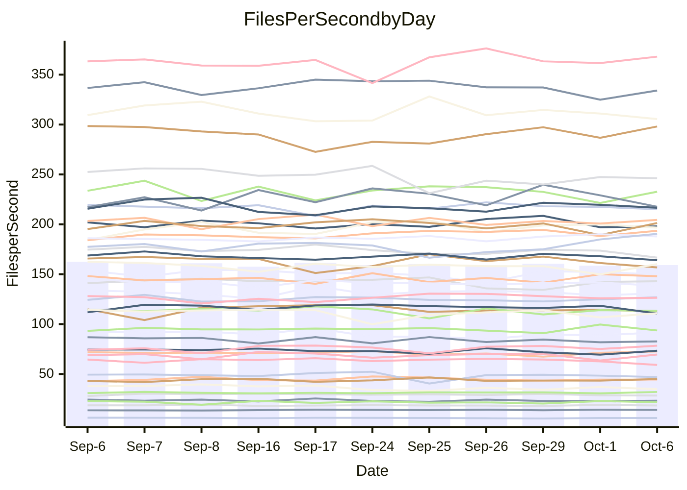

<!---
# This file is auto-generated. Do not edit.
# cspell:disable
--->
# Performance Report

## Daily Performance

```mermaid
xychart-beta
    title Files Per Second by Day
    y-axis Files per Second
    x-axis Date [Sep-6, Sep-7, Sep-8, Sep-16, Sep-17, Sep-24, Sep-25, Sep-26, Sep-29, Oct-1, Oct-6]
    bar [162.34, 161.56, 160.97, 157.55, 161.35, 159.12, 160.20, 158.85, 160.46, 158.54, 159.20]
    line [24.42, 23.30, 24.35, 22.54, 25.54, 23.00, 22.21, 24.38, 23.05, 22.85, 23.25]
    line [42.91, 44.10, 47.18, 43.88, 43.41, 47.56, 46.43, 44.28, 43.43, 44.41, 44.45]
    line [18.65, 18.65, 19.33, 18.07, 18.42, 18.78, 18.52, 18.42, 18.07, 18.99, 18.50]
    line [22.85, 22.27, 19.18, 23.11, 21.10, 22.62, 21.27, 21.60, 20.47, 22.93, 21.65]
    line [114.93, 104.04, 116.42, 117.89, 118.96, 119.04, 112.27, 113.64, 113.59, 114.39, 113.02]
    line [6.20, 6.14, 6.11, 5.78, 6.14, 6.07, 5.98, 5.68, 5.41, 5.92, 5.98]
    line [64.50, 61.26, 64.86, 63.96, 65.83, 62.91, 64.44, 65.18, 64.56, 62.65, 59.15]
    line [201.97, 197.12, 203.70, 201.07, 195.90, 200.29, 197.49, 205.32, 208.45, 197.08, 197.95]
    line [37.82, 37.98, 39.62, 37.64, 38.51, 33.90, 33.12, 36.15, 34.22, 37.04, 34.83]
    line [133.80, 132.37, 129.87, 125.28, 138.07, 129.51, 132.51, 133.16, 132.31, 128.76, 130.99]
    line [13.63, 13.57, 13.40, 13.81, 14.35, 14.04, 13.83, 14.23, 13.74, 14.24, 14.01]
    line [71.94, 71.15, 71.34, 71.01, 71.23, 73.00, 69.32, 70.55, 67.39, 71.27, 72.56]
    line [174.59, 177.44, 173.15, 174.36, 179.74, 174.18, 170.43, 170.45, 174.63, 173.65, 166.61]
    line [114.46, 112.83, 115.47, 113.56, 117.79, 114.76, 105.80, 115.76, 109.67, 113.99, 113.25]
    line [298.52, 297.48, 293.09, 290.03, 272.63, 282.67, 280.96, 290.36, 297.31, 286.74, 298.04]
    line [124.27, 129.39, 122.55, 122.88, 127.08, 126.63, 124.32, 123.86, 122.76, 124.85, 126.84]
    line [68.94, 69.89, 64.77, 72.12, 70.50, 66.34, 68.88, 70.01, 70.14, 63.55, 69.51]
    line [111.85, 119.40, 118.51, 114.20, 118.71, 119.64, 118.05, 116.99, 116.24, 118.39, 110.70]
    line [184.22, 194.88, 202.40, 191.56, 190.37, 202.02, 203.87, 192.01, 198.88, 199.85, 196.70]
    line [92.55, 91.52, 92.79, 89.51, 95.95, 87.21, 87.42, 84.85, 89.53, 88.83, 91.60]
    line [336.60, 342.41, 329.55, 336.36, 345.01, 343.35, 343.97, 337.30, 337.13, 324.92, 334.06]
    line [203.39, 206.55, 195.11, 205.27, 209.68, 198.18, 206.47, 199.39, 203.39, 200.83, 204.46]
    line [27.92, 30.43, 29.89, 30.21, 29.92, 29.23, 29.70, 28.98, 30.17, 28.67, 28.43]
    line [233.61, 243.66, 223.35, 237.82, 223.98, 233.86, 238.09, 237.21, 232.50, 221.42, 232.66]
    line [195.23, 203.47, 198.25, 196.22, 201.98, 205.02, 201.39, 195.94, 200.94, 189.24, 201.33]
    line [219.44, 217.73, 216.08, 219.15, 208.36, 218.68, 215.66, 222.06, 218.14, 217.51, 215.18]
    line [128.13, 127.03, 120.72, 125.41, 122.07, 126.43, 130.53, 130.33, 127.99, 125.90, 126.38]
    line [74.43, 74.58, 74.02, 75.50, 72.83, 73.03, 70.23, 75.87, 71.80, 69.38, 73.36]
    line [309.43, 319.09, 322.91, 311.02, 303.26, 304.00, 328.11, 309.34, 314.63, 311.05, 305.50]
    line [153.87, 147.46, 154.39, 153.96, 150.40, 151.64, 148.32, 141.41, 152.96, 152.29, 149.74]
    line [217.15, 227.16, 213.82, 234.37, 222.15, 235.99, 230.67, 219.04, 239.66, 229.06, 217.68]
    line [184.03, 189.81, 189.01, 187.14, 185.91, 190.99, 193.37, 192.37, 194.39, 188.26, 193.54]
    line [141.02, 143.66, 145.59, 142.94, 143.60, 144.39, 146.81, 135.80, 134.31, 142.24, 142.95]
    line [30.88, 32.09, 31.08, 30.60, 31.19, 30.72, 31.67, 31.52, 31.59, 30.62, 32.05]
    line [165.73, 167.27, 165.39, 165.37, 151.18, 158.06, 170.07, 163.11, 167.69, 161.21, 156.81]
    line [49.35, 49.58, 48.85, 47.97, 51.02, 52.29, 40.48, 48.89, 49.28, 48.37, 46.96]
    line [363.32, 365.30, 359.11, 358.89, 364.75, 341.57, 367.34, 376.26, 363.37, 361.56, 368.04]
    line [215.63, 224.82, 226.65, 212.42, 209.15, 217.97, 216.10, 212.71, 221.60, 219.58, 216.65]
    line [114.35, 112.51, 113.70, 114.44, 114.03, 99.84, 109.30, 111.81, 113.74, 106.75, 110.96]
    line [186.05, 185.31, 184.47, 182.86, 186.84, 185.48, 188.32, 183.01, 187.77, 190.16, 187.85]
    line [86.90, 85.78, 86.18, 80.59, 86.98, 80.71, 87.03, 82.08, 84.54, 81.78, 82.68]
    line [148.18, 143.83, 145.01, 146.41, 140.36, 151.00, 142.17, 146.26, 141.54, 150.02, 147.97]
    line [252.44, 256.07, 255.58, 248.63, 249.79, 258.60, 231.14, 243.74, 239.90, 247.38, 246.25]
    line [93.19, 96.28, 94.70, 94.66, 95.59, 94.92, 96.04, 93.49, 90.93, 99.59, 93.68]
    line [43.01, 41.97, 44.80, 45.26, 42.13, 43.68, 46.57, 43.13, 43.45, 43.36, 44.99]
    line [177.43, 180.28, 172.77, 180.61, 181.38, 178.77, 166.50, 172.24, 175.00, 184.88, 190.46]
    line [74.33, 75.84, 70.78, 78.20, 78.52, 76.56, 70.74, 77.36, 78.18, 75.07, 78.39]
    line [168.71, 172.84, 167.97, 166.22, 164.57, 167.61, 170.71, 164.68, 170.44, 168.02, 164.04]
    line [162.42, 161.26, 158.45, 152.45, 160.47, 157.19, 159.48, 158.08, 158.04, 149.87, 160.11]
    line [146.03, 141.67, 142.57, 136.52, 144.05, 141.65, 140.89, 139.38, 141.22, 141.74, 138.40]
```

## Time to Process Files

| Repository                                      | Elapsed | Min/Avg/Max           |   SD | SD Graph                |
| ----------------------------------------------- | ------: | :-------------------: | ---: | ----------------------- |
| AdaDoom3/AdaDoom3                    |    3.72 | 3.4 /   3.5 /   4.5   | 0.26 | `    ┣━━┻━━╋━●┻━━┫    ` |
| alexiosc/megistos                    |    8.21 | 7.5 /   7.9 /   8.6   | 0.24 | `    ┣━━┻━━╋━━●━━┫    ` |
| apollographql/apollo-server          |    2.72 | 2.6 /   2.8 /   3.0   | 0.12 | `     ┣━┻●━╋━━┻━┫     ` |
| aspnetboilerplate/aspnetboilerplate  |   10.26 | 10.2 /  10.5 /  11.0  | 0.21 | `    ┣━●┻━━╋━━┻━━┫    ` |
| aws-amplify/docs                     |   14.25 | 12.5 /  13.2 /  14.2  | 0.47 | `    ┣━━┻━━╋━━┻━━┫●   ` |
| Azure/azure-rest-api-specs           |    9.83 | 9.5 /   9.9 /  10.6   | 0.31 | `    ┣━━┻━━●━━┻━━┫    ` |
| bitjson/typescript-starter           |    1.07 | 1.0 /   1.1 /   1.1   | 0.02 | `     ┣━━┻●╋━┻━━┫     ` |
| caddyserver/caddy                    |    3.59 | 3.6 /   3.8 /   4.0   | 0.13 | `    ┣━●┻━━╋━━┻━━┫    ` |
| canada-ca/open-source-logiciel-libre |    1.18 | 1.1 /   1.2 /   1.3   | 0.05 | `     ┣━┻━━●━━┻━┫     ` |
| chef/chef                            |    6.00 | 5.8 /   6.0 /   6.4   | 0.16 | `    ┣━━┻━●╋━━┻━━┫    ` |
| dart-lang/sdk                        |   64.21 | 64.8 /  67.9 /  73.2  | 2.22 | `   ┣●━┻━━━╋━━━┻━━┫   ` |
| django/django                        |   15.01 | 15.0 /  15.4 /  16.1  | 0.29 | `    ┣━●┻━━╋━━┻━━┫    ` |
| eslint/eslint                        |   10.90 | 10.7 /  11.1 /  11.8  | 0.29 | `    ┣━━┻●━╋━━┻━━┫    ` |
| exonum/exonum                        |    3.70 | 3.6 /   3.7 /   4.0   | 0.10 | `     ┣━┻━━●━━┻━┫     ` |
| flutter/samples                      |   16.89 | 16.3 /  16.9 /  18.6  | 0.53 | `    ┣━━┻━━●━━┻━━┫    ` |
| gitbucket/gitbucket                  |    3.55 | 3.5 /   3.6 /   4.0   | 0.15 | `    ┣━━┻●━╋━━┻━━┫    ` |
| googleapis/google-cloud-cpp          |  142.39 | 139.0 / 147.6 / 165.8 | 6.74 | `  ┣━━━┻●━━╋━━━┻━━━┫  ` |
| graphql/express-graphql              |    1.21 | 1.1 /   1.2 /   1.4   | 0.06 | `     ┣━┻━━╋●━┻━┫     ` |
| graphql/graphql-js                   |    2.89 | 2.7 /   2.9 /   3.1   | 0.08 | `     ┣━┻━●╋━━┻━┫     ` |
| graphql/graphql-relay-js             |    1.19 | 1.1 /   1.2 /   1.3   | 0.06 | `     ┣━┻━━●━━┻━┫     ` |
| graphql/graphql-spec                 |    1.33 | 1.3 /   1.4 /   1.4   | 0.04 | `     ┣━┻━●╋━━┻━┫     ` |
| iluwatar/java-design-patterns        |   12.86 | 12.8 /  13.3 /  14.9  | 0.48 | `    ┣━━●━━╋━━┻━━┫    ` |
| ktaranov/sqlserver-kit               |    6.97 | 6.6 /   6.9 /   7.3   | 0.18 | `    ┣━━┻━━╋━●┻━━┫    ` |
| liriliri/licia                       |    4.29 | 4.1 /   4.3 /   4.4   | 0.09 | `    ┣━━┻━━●━━┻━━┫    ` |
| MartinThoma/LaTeX-examples           |    7.70 | 6.9 /   7.2 /   7.8   | 0.27 | `    ┣━━┻━━╋━━┻━●┫    ` |
| mdx-js/mdx                           |    2.04 | 1.9 /   2.1 /   2.3   | 0.09 | `     ┣━┻━━●━━┻━┫     ` |
| microsoft/TypeScript-Website         |    5.83 | 5.5 /   5.8 /   6.5   | 0.22 | `    ┣━━┻━━●━━┻━━┫    ` |
| MicrosoftDocs/PowerShell-Docs        |   25.04 | 23.3 /  24.3 /  27.2  | 1.08 | `   ┣━━━┻━━╋━●┻━━━┫   ` |
| neovim/nvim-lspconfig                |    4.64 | 4.2 /   4.4 /   4.7   | 0.10 | `    ┣━━┻━━╋━━┻━━┫●   ` |
| pagekit/pagekit                      |    3.64 | 3.5 /   3.6 /   3.8   | 0.07 | `     ┣━┻━━●━━┻━┫     ` |
| php/php-src                          |   27.00 | 25.7 /  27.4 /  30.2  | 1.22 | `   ┣━━━┻━●╋━━┻━━━┫   ` |
| plasticrake/tplink-smarthome-api     |    1.46 | 1.3 /   1.4 /   1.6   | 0.07 | `     ┣━┻━━╋━━●━┫     ` |
| prettier/prettier                    |    7.81 | 7.0 /   7.4 /   7.9   | 0.26 | `    ┣━━┻━━╋━━┻━●┫    ` |
| pycontribs/jira                      |    1.75 | 1.5 /   1.6 /   2.0   | 0.10 | `     ┣━┻━━╋━━●━┫     ` |
| RustPython/RustPython                |    5.47 | 5.2 /   5.4 /   5.7   | 0.13 | `    ┣━━┻━━╋●━┻━━┫    ` |
| shoelace-style/shoelace              |    2.98 | 2.9 /   3.0 /   3.1   | 0.07 | `     ┣━┻━●╋━━┻━┫     ` |
| slint-ui/slint                       |   13.19 | 12.2 /  13.0 /  14.4  | 0.56 | `    ┣━━┻━━╋●━┻━━┫    ` |
| SoftwareBrothers/admin-bro           |    2.69 | 2.5 /   2.6 /   2.8   | 0.06 | `     ┣━┻━━╋━●┻━┫     ` |
| sveltejs/svelte                      |   21.71 | 20.8 /  21.7 /  23.2  | 0.50 | `    ┣━━┻━━●━━┻━━┫    ` |
| TheAlgorithms/Python                 |    6.11 | 5.7 /   6.0 /   6.6   | 0.22 | `    ┣━━┻━━╋━●┻━━┫    ` |
| twbs/bootstrap                       |    2.21 | 1.8 /   1.9 /   2.0   | 0.05 | `       ┣┻━╋━┻┫      ●` |
| typescript-cheatsheets/react         |    1.50 | 1.3 /   1.5 /   1.6   | 0.08 | `     ┣━┻━━╋●━┻━┫     ` |
| typescript-eslint/typescript-eslint  |    4.27 | 4.3 /   4.4 /   4.7   | 0.13 | `    ┣━━●━━╋━━┻━━┫    ` |
| vitest-dev/vitest                    |   10.45 | 9.2 /   9.9 /  12.0   | 0.71 | `    ┣━━┻━━╋━●┻━━┫    ` |
| w3c/aria-practices                   |    3.76 | 3.4 /   3.6 /   3.8   | 0.11 | `    ┣━━┻━━╋━━┻━●┫    ` |
| w3c/specberus                        |    2.00 | 2.0 /   2.1 /   2.3   | 0.07 | `     ┣●┻━━╋━━┻━┫     ` |
| webdeveric/webpack-assets-manifest   |    1.19 | 1.2 /   1.2 /   1.3   | 0.04 | `     ┣━●━━╋━━┻━┫     ` |
| webpack/webpack                      |    5.63 | 5.3 /   5.6 /   6.1   | 0.18 | `    ┣━━┻━━●━━┻━━┫    ` |
| wireapp/wire-desktop                 |    1.41 | 1.3 /   1.4 /   1.4   | 0.03 | `     ┣━┻━━╋━●┻━┫     ` |
| wireapp/wire-webapp                  |   11.22 | 10.7 /  11.2 /  12.5  | 0.46 | `    ┣━━┻━━●━━┻━━┫    ` |

Note:
- Elapsed time is in seconds.

## Files per Second over Time

| Repository                                      | Files |    Sec |    Fps |     Rel | Trend Fps             |    N |
| ----------------------------------------------- | ----: | -----: | -----: | ------: | --------------------- | ---: |
| AdaDoom3/AdaDoom3                    |   103 |   3.72 |  27.68 |  -5.44% | `█▂███▇███▇▇▆██▆▇▇▆▆` |   18 |
| alexiosc/megistos                    |   583 |   8.21 |  70.99 |  -3.56% | `▇▆▇▇▇▇█▆▆▆▅█▇▆▅▄▇▇▅` |   18 |
| apollographql/apollo-server          |   252 |   2.72 |  92.54 |   2.68% | `▇▇▆▅█▇▅▆█▅▅▅▃▆▇▄▇▆▇` |   18 |
| aspnetboilerplate/aspnetboilerplate  |  2286 |  10.26 | 222.89 |   2.59% | `▇▇█▆▇▆▆█▅▇▆▇█▇▇▆▅▆█` |   18 |
| aws-amplify/docs                     |  2871 |  14.25 | 201.41 |  -7.66% | `▇▄▇▇██▅▆▅▆▆▆▄▇▅█▇█▄` |   18 |
| Azure/azure-rest-api-specs           |  2459 |   9.83 | 250.06 |   0.63% | `▇█▇████▆▇█▄▅▆▅▇▆▅▇▇` |   18 |
| bitjson/typescript-starter           |    20 |   1.07 |  18.73 |   0.90% | `▇▆▇▇▆█▄▆▆▇▆▆▆▅▇█▆▆▇` |   18 |
| caddyserver/caddy                    |   286 |   3.59 |  79.62 |   4.90% | `▅▅▆▅▇▄▇██▇▄█▆▇▇▅▇▇█` |   18 |
| canada-ca/open-source-logiciel-libre |     7 |   1.18 |   5.93 |  -0.51% | `████▇▇█▃█▇▇▄▆▃▇▅▇▇▆` |   18 |
| chef/chef                            |  1207 |   6.00 | 201.07 |   0.38% | `█▇▇▇▅▇▇▇▆▇▆█▇█▅▆▇▄▇` |   18 |
| dart-lang/sdk                        | 10637 |  64.21 | 165.67 |   5.04% | `█▇█▇█▇▆▄▇▆▇▇▆▆▆▄█▅█` |   18 |
| django/django                        |  2876 |  15.01 | 191.57 |   3.07% | `▅▇██▆▆▆▆▇▇▇▅▇▇▇█▇▇█` |   18 |
| eslint/eslint                        |  2093 |  10.90 | 191.99 |   1.36% | `▄▆▇▇▇▇▅▇▆▇██▇██▅███` |   18 |
| exonum/exonum                        |   421 |   3.70 | 113.87 |   0.23% | `▇▇▇▇▆▇▇▆█▇▄█▇▅▆▇▆▇▇` |   18 |
| flutter/samples                      |  2400 |  16.89 | 142.10 |   0.15% | `▆█▆▇██▇▇▇██▄▇▅▇▇▇▇▇` |   18 |
| gitbucket/gitbucket                  |   413 |   3.55 | 116.21 |   2.15% | `█▅█▄▄▇█▇██▆▇▆▆▇▆▆▆▇` |   18 |
| googleapis/google-cloud-cpp          | 20772 | 142.39 | 145.88 |   3.53% | `█▆█▇▆▇▃▇▇▇▆▆▆▆▆▇▇▃▇` |   18 |
| graphql/express-graphql              |    26 |   1.21 |  21.57 |  -2.07% | `▇▇▇▆▇▃▆█▅▇▅▅▆▄▇▇▅▆▅` |   18 |
| graphql/graphql-js                   |   364 |   2.89 | 125.97 |   0.66% | `▄▆▇█▆▅▅▆▇▆▆▅▇▅▆▆▇▆▆` |   18 |
| graphql/graphql-relay-js             |    28 |   1.19 |  23.45 |  -0.43% | `▇▆█▆▅▇▃▆█▅▄▇▆▅▆▄▆▅▆` |   18 |
| graphql/graphql-spec                 |    19 |   1.33 |  14.31 |   3.19% | `▄▇▇▆▆▅█▅█▇▇██▆███▆█` |   18 |
| iluwatar/java-design-patterns        |  1992 |  12.86 | 154.95 |   3.16% | `▇██▅▇███▇▇▇▇▃█▇▇▆▆█` |   18 |
| ktaranov/sqlserver-kit               |   489 |   6.97 |  70.15 |  -1.63% | `▆▇█▇▅▆▆▇▆▇▅▅▇▄▇▆█▇▆` |   18 |
| liriliri/licia                       |  1437 |   4.29 | 335.30 |  -0.37% | `▇▇▆▇█▆▅████▇▆▇▅▅▅▇▇` |   18 |
| MartinThoma/LaTeX-examples           |  1409 |   7.70 | 182.99 |  -6.26% | `▄▄▅▆▇█▆▅▅██▆▅▇▆███▄` |   18 |
| mdx-js/mdx                           |   141 |   2.04 |  69.08 |   0.44% | `▆▆▆▆▇▅▆█▇▅▆▇▆▇▃▅▆▆▆` |   18 |
| microsoft/TypeScript-Website         |   761 |   5.83 | 130.47 |  -0.71% | `█▇▇▇▇▆▇▃█▆▇▆█▇▆▆▆█▆` |   18 |
| MicrosoftDocs/PowerShell-Docs        |  2708 |  25.04 | 108.17 |  -3.10% | `▇██▇█▇█▇▇▃▆▇▇▇█▃▇▇▆` |   18 |
| neovim/nvim-lspconfig                |   761 |   4.64 | 163.98 |  -5.50% | `▇▆█▇█▇▇▇█▇▆▅▆▇▆▇▆▄▄` |   18 |
| pagekit/pagekit                      |   741 |   3.64 | 203.81 |   0.33% | `▆█▆█▇▅█▇█▆▇▅▆▇▆▆█▆▇` |   18 |
| php/php-src                          |  2300 |  27.00 |  85.20 |   1.60% | `▇▇█▇▇▇▆▄▇▅▇▇▅▆▅▆▃▇▇` |   18 |
| plasticrake/tplink-smarthome-api     |    62 |   1.46 |  42.37 |  -4.79% | `▃▆▆▆▆██▄▅█▇▇▅▅▆▆▇▇▅` |   18 |
| prettier/prettier                    |  2336 |   7.81 | 299.04 |  -4.22% | `▆▄█▆██▆▆▅▅█▄█▇▆▆▆▆▅` |   18 |
| pycontribs/jira                      |    79 |   1.75 |  45.12 |  -7.21% | `▇█▆▆█▆▆▆██▂▆▇▇▆▆▇▅▅` |   18 |
| RustPython/RustPython                |   688 |   5.47 | 125.81 |  -0.80% | `▇▇▇▇▆▄▅▆▅▆▇█▆▇▅▇▆▆▆` |   18 |
| shoelace-style/shoelace              |   439 |   2.98 | 147.18 |   0.57% | `█▆█▇▅▆▇▇▅█▅▆▇▅█▇▇▇▇` |   18 |
| slint-ui/slint                       |  2519 |  13.19 | 190.96 |   6.65% | `▆▆▅▆▆▅▆▇▆▆▄▅▄▅▇▇█▇█` |   18 |
| SoftwareBrothers/admin-bro           |   441 |   2.69 | 163.94 |  -2.26% | `▇▇▇▇█▇▅▇▆▆▇▅▇▇▆▇▇▄▆` |   18 |
| sveltejs/svelte                      |  7945 |  21.71 | 365.91 |   0.58% | `▇▆▆▆▇▆▆▅▆▄▇█▇▆▆▆▇▇▇` |   18 |
| TheAlgorithms/Python                 |  1396 |   6.11 | 228.66 |  -2.05% | `▆█▆██▅▇▇▅▇▇▇▇▆▆▃▇▆▆` |   18 |
| twbs/bootstrap                       |   118 |   2.21 |  53.44 | -16.08% | `▆█▇▇▄▇▆▇█▆▇▇█▇▅▇▆▅▁` |   18 |
| typescript-cheatsheets/react         |    53 |   1.50 |  35.43 |  -3.29% | `▇▇▇█▆█▇▆▇▄▃▅▆▄▆▆▃▆▅` |   18 |
| typescript-eslint/typescript-eslint  |  1282 |   4.27 | 300.25 |   3.04% | `█████▇▅█▄▆▅▅██▆▆█▇█` |   18 |
| vitest-dev/vitest                    |  2257 |  10.45 | 216.08 |  -3.97% | `▇▂█▆█▅▇█▆█▇▄███▆▅▆▆` |   18 |
| w3c/aria-practices                   |   414 |   3.76 | 110.09 |  -5.03% | `▄▇▅▇█▇▆▆██▇█▆▇▇▇▅▅▅` |   18 |
| w3c/specberus                        |   197 |   2.00 |  98.38 |   4.01% | `▆▆▅▆▇▆▆▆▆▆▆▅▆▅▇█▃▆▇` |   18 |
| webdeveric/webpack-assets-manifest   |    55 |   1.19 |  46.30 |   6.05% | `▇▅▄▄▄▇▇▇▅▆█▅▅▆▆▅▆▇█` |   18 |
| webpack/webpack                      |  1114 |   5.63 | 197.84 |  -0.23% | `▇▅▆▆█▆▆▆▇▇▇▅▇▇▄▆▆▇▆` |   18 |
| wireapp/wire-desktop                 |    46 |   1.41 |  32.57 |   4.31% | `▅▄▇▆█▆▅▅▆▅▆▅▇▆▅▆▅██` |   18 |
| wireapp/wire-webapp                  |  1775 |  11.22 | 158.19 |  -3.01% | `▇▇▇▇█▇▇▇▄▆██▆█▇▆▃▇▆` |   18 |

## Data Throughput

| Repository                                      | Files |    Sec |     Kps |     Rel | Trend Kps             |    N |
| ----------------------------------------------- | ----: | -----: | ------: | ------: | --------------------- | ---: |
| AdaDoom3/AdaDoom3                    |   103 |   3.72 |  588.20 |  -5.44% | `█▂███▇███▇▇▆██▆▇▇▆▆` |   18 |
| alexiosc/megistos                    |   583 |   8.21 |  557.81 |  -3.56% | `▇▆▇▇▇▇█▆▆▆▅█▇▆▅▄▇▇▅` |   18 |
| apollographql/apollo-server          |   252 |   2.72 |  744.34 |   2.68% | `▇▇▆▅█▇▅▆█▅▅▅▃▆▇▄▇▆▇` |   18 |
| aspnetboilerplate/aspnetboilerplate  |  2286 |  10.26 |  542.31 |   2.59% | `▇▇█▆▇▆▆█▅▇▆▇█▇▇▆▅▆█` |   18 |
| aws-amplify/docs                     |  2871 |  14.25 |  703.08 |  -7.68% | `▇▄▇▇██▅▆▅▆▆▆▄▇▅█▇█▄` |   18 |
| Azure/azure-rest-api-specs           |  2459 |   9.83 |  665.15 |   1.28% | `▇█▇████▅▇█▄▅▆▅▇▆▅▇▇` |   18 |
| bitjson/typescript-starter           |    20 |   1.07 |   74.91 |   0.90% | `▇▆▇▇▆█▄▆▆▇▆▆▆▅▇█▆▆▇` |   18 |
| caddyserver/caddy                    |   286 |   3.59 |  681.25 |   5.05% | `▅▅▆▅▇▄▇▇▇▇▄█▆▇▇▅▇▇█` |   18 |
| canada-ca/open-source-logiciel-libre |     7 |   1.18 |   49.16 |  -0.51% | `████▇▇█▃█▇▇▄▆▃▇▅▇▇▆` |   18 |
| chef/chef                            |  1207 |   6.00 |  927.57 |   0.30% | `█▇▇▇▅▇▇▇▆▇▆█▇█▅▆▇▄▇` |   18 |
| dart-lang/sdk                        | 10637 |  64.21 | 1131.53 |   5.08% | `▇▆█▆▇▆▆▄▇▆▇▇▇▇▆▄█▅█` |   18 |
| django/django                        |  2876 |  15.01 | 1200.73 |   3.05% | `▅▇██▆▆▆▆▇▇▇▅▇▇▇█▇▇█` |   18 |
| eslint/eslint                        |  2093 |  10.90 | 1383.74 |   1.21% | `▅▆▇█▇▇▅▇▆▇██▇██▅██▇` |   18 |
| exonum/exonum                        |   421 |   3.70 | 1089.24 |   0.23% | `▇▇▇▇▆▇▇▆█▇▄█▇▅▆▇▆▇▇` |   18 |
| flutter/samples                      |  2400 |  16.89 | 1268.03 |   0.15% | `▆█▆▇██▇▇▇██▄▇▅▇▇▇▇▇` |   18 |
| gitbucket/gitbucket                  |   413 |   3.55 |  528.43 |   2.19% | `█▅█▄▄▇█▇██▆▇▆▆▇▆▆▆▇` |   18 |
| googleapis/google-cloud-cpp          | 20772 | 142.39 | 1183.91 |   3.70% | `█▆█▇▆▇▄█▇▇▆▆▆▇▆█▇▃█` |   18 |
| graphql/express-graphql              |    26 |   1.21 |   98.71 |  -2.07% | `▇▇▇▆▇▃▆█▅▇▅▅▆▄▇▇▅▆▅` |   18 |
| graphql/graphql-js                   |   364 |   2.89 |  724.00 |   0.66% | `▄▆▇█▆▅▅▆▇▆▆▅▇▅▆▆▇▆▆` |   18 |
| graphql/graphql-relay-js             |    28 |   1.19 |   92.11 |  -0.43% | `▇▆█▆▅▇▃▆█▅▄▇▆▅▆▄▆▅▆` |   18 |
| graphql/graphql-spec                 |    19 |   1.33 |  477.57 |   3.78% | `▄▇▆▆▅▆█▅█▇▇██▇███▆█` |   18 |
| iluwatar/java-design-patterns        |  1992 |  12.86 |  478.94 |   3.16% | `▇██▅▇███▇▇▇▇▃█▇▇▆▆█` |   18 |
| ktaranov/sqlserver-kit               |   489 |   6.97 | 1062.15 |  -1.63% | `▆▇█▇▅▆▆▇▆▇▅▅▇▄▇▆█▇▆` |   18 |
| liriliri/licia                       |  1437 |   4.29 |  399.47 |  -0.37% | `▇▇▆▇█▆▅████▇▆▇▅▅▅▇▇` |   18 |
| MartinThoma/LaTeX-examples           |  1409 |   7.70 |  377.92 |  -6.26% | `▄▄▅▆▇█▆▅▅██▆▅▇▆███▄` |   18 |
| mdx-js/mdx                           |   141 |   2.04 |  321.41 |   0.44% | `▆▆▆▆▇▅▆█▇▅▆▇▆▇▃▅▆▆▆` |   18 |
| microsoft/TypeScript-Website         |   761 |   5.83 |  902.34 |  -0.71% | `█▇▇▇▇▆▇▃█▆▇▆█▇▆▆▆█▆` |   18 |
| MicrosoftDocs/PowerShell-Docs        |  2708 |  25.04 | 1112.82 |  -3.08% | `▇██▇█▇█▇▇▃▆▇▇▇█▃▇▇▆` |   18 |
| neovim/nvim-lspconfig                |   761 |   4.64 |  273.02 |  -4.82% | `▇▆█▇█▇▇▇█▇▆▆▇▇▆█▇▅▅` |   18 |
| pagekit/pagekit                      |   741 |   3.64 |  424.96 |   0.33% | `▆█▆█▇▅█▇█▆▇▅▆▇▆▆█▆▇` |   18 |
| php/php-src                          |  2300 |  27.00 | 1480.77 |   1.56% | `▇▇█▇▇▇▆▄▇▅▇▇▄▆▅▆▃▇▇` |   18 |
| plasticrake/tplink-smarthome-api     |    62 |   1.46 |  228.93 |  -4.79% | `▃▆▆▆▆██▄▅█▇▇▅▅▆▆▇▇▅` |   18 |
| prettier/prettier                    |  2336 |   7.81 |  419.37 |  -4.89% | `▆▄█▆██▆▆▅▅█▄▇▆▆▆▅▆▄` |   18 |
| pycontribs/jira                      |    79 |   1.75 |  319.85 |  -7.21% | `▇█▆▆█▆▆▆██▂▆▇▇▆▆▇▅▅` |   18 |
| RustPython/RustPython                |   688 |   5.47 |  993.89 |  -0.60% | `▆▆▇▇▆▄▅▆▅▆▇█▆▇▅▇▆▆▆` |   18 |
| shoelace-style/shoelace              |   439 |   2.98 |  711.10 |   0.57% | `█▆█▇▅▆▇▇▅█▅▆▇▅█▇▇▇▇` |   18 |
| slint-ui/slint                       |  2519 |  13.19 | 1171.19 |   1.81% | `█▇▆▇█▆▇██▇▄▆▅▄▆▆█▇▇` |   18 |
| SoftwareBrothers/admin-bro           |   441 |   2.69 |  361.34 |  -2.26% | `▇▇▇▇█▇▅▇▆▆▇▅▇▇▆▇▇▄▆` |   18 |
| sveltejs/svelte                      |  7945 |  21.71 |  244.51 |   0.48% | `▇▆▆▆▇▆▆▅▆▄▇█▇▆▆▆▇▇▆` |   18 |
| TheAlgorithms/Python                 |  1396 |   6.11 |  581.32 |  -2.01% | `▆█▆██▅▇▇▅▇▇█▇▆▆▃▇▆▆` |   18 |
| twbs/bootstrap                       |   118 |   2.21 |  438.40 | -16.08% | `▆█▇▇▄▇▆▇█▆▇▇█▇▅▇▆▅▁` |   18 |
| typescript-cheatsheets/react         |    53 |   1.50 |  262.08 |  -3.29% | `▇▇▇█▆█▇▆▇▄▃▅▆▄▆▆▃▆▅` |   18 |
| typescript-eslint/typescript-eslint  |  1282 |   4.27 | 1536.62 |   3.13% | `███▇█▇▅█▄▆▅▅██▆▆█▇█` |   18 |
| vitest-dev/vitest                    |  2257 |  10.45 |  484.23 |  -4.38% | `▇▂█▆█▅▇█▆█▇▄███▆▆▆▆` |   18 |
| w3c/aria-practices                   |   414 |   3.76 | 1026.43 |  -4.94% | `▄▇▅▇█▇▆▆▇█▇█▆▇▇█▅▅▅` |   18 |
| w3c/specberus                        |   197 |   2.00 |  310.11 |   4.35% | `▆▆▅▆▇▆▆▆▆▆▆▅▆▅▇█▃▆▇` |   18 |
| webdeveric/webpack-assets-manifest   |    55 |   1.19 |  106.91 |   4.23% | `▇▅▄▄▄▇▇▇▅▆█▅▅▆▆▅▆▆▇` |   18 |
| webpack/webpack                      |  1114 |   5.63 |  903.95 |   0.33% | `▆▅▆▆█▆▆▆▇▇▇▅▆▇▄▆▇█▆` |   18 |
| wireapp/wire-desktop                 |    46 |   1.41 |  181.99 |  27.25% | `▃▂▃▃▄▃▂▃▃▃▄▃▄▄▃▃▃██` |   18 |
| wireapp/wire-webapp                  |  1775 |  11.22 |  581.17 |  -0.70% | `▇▇▇▇▇▇▇▇▄▆██▆█▇▆▃█▆` |   18 |

