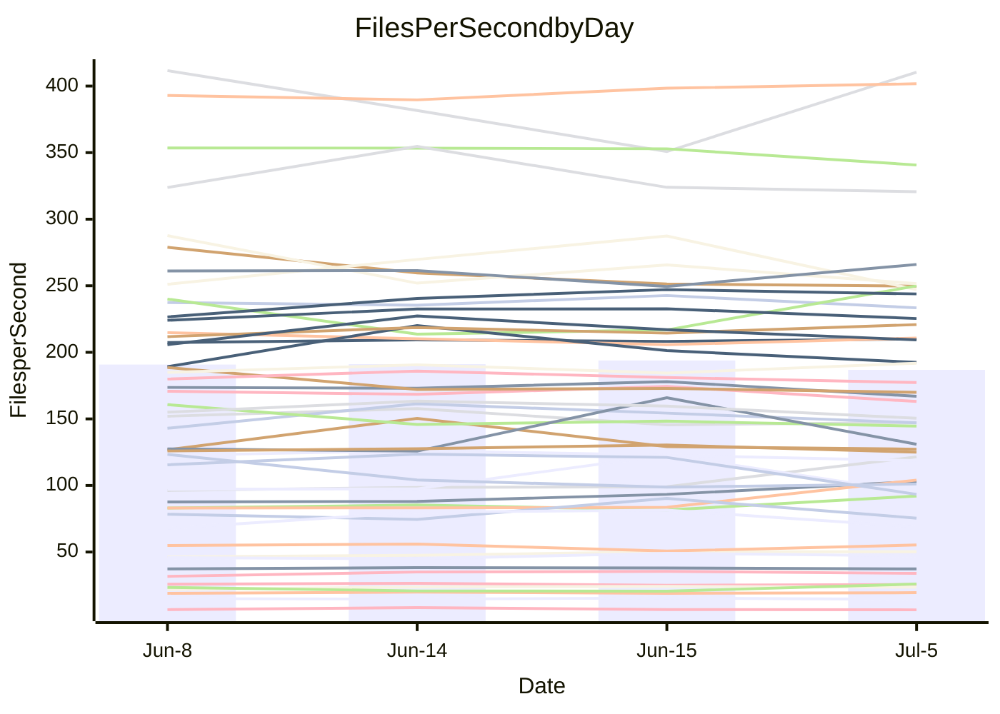

<!---
# This file is auto-generated. Do not edit.
# cspell:disable
--->
# Performance Report

Daily Performance

```mermaid
xychart-beta
    title Files Per Second by Day
    y-axis Files per Second
    x-axis Date [Jun-8, Jun-14, Jun-15, Jul-5]
    bar [190.81, 191.12, 193.90, 186.85]
    line [87.60, 88.07, 93.31, 102.97]
    line [19.01, 19.91, 18.97, 19.46]
    line [96.25, 98.55, 99.04, 121.46]
    line [83.02, 85.34, 81.59, 92.06]
    line [278.90, 259.60, 251.39, 249.74]
    line [237.41, 235.41, 242.68, 233.42]
    line [6.70, 8.24, 6.81, 6.57]
    line [207.37, 209.33, 208.22, 209.98]
    line [251.08, 269.77, 287.34, 247.09]
    line [122.50, 126.17, 122.75, 118.72]
    line [37.33, 38.26, 38.06, 37.33]
    line [214.78, 210.20, 205.78, 210.72]
    line [151.99, 157.77, 145.55, 147.25]
    line [240.01, 213.64, 216.83, 249.94]
    line [126.80, 150.40, 129.14, 127.24]
    line [142.96, 161.35, 154.33, 147.06]
    line [25.84, 26.48, 25.01, 25.58]
    line [189.21, 220.12, 201.30, 192.47]
    line [21.85, 23.82, 24.25, 23.61]
    line [15.02, 14.65, 15.42, 14.44]
    line [173.63, 173.03, 177.99, 166.99]
    line [83.05, 83.17, 83.60, 104.04]
    line [411.63, 381.64, 350.78, 410.40]
    line [160.74, 145.81, 148.34, 144.57]
    line [211.77, 218.65, 214.39, 220.82]
    line [78.36, 74.53, 90.33, 75.44]
    line [170.78, 168.46, 174.35, 163.07]
    line [224.05, 232.54, 232.69, 225.39]
    line [46.28, 47.54, 50.24, 50.17]
    line [97.18, 97.48, 122.92, 94.49]
    line [127.50, 125.76, 165.92, 130.91]
    line [54.91, 55.98, 50.73, 55.28]
    line [155.04, 163.34, 159.60, 150.47]
    line [353.54, 353.38, 352.89, 340.70]
    line [188.61, 172.10, 172.90, 169.94]
    line [115.54, 123.50, 121.07, 93.33]
    line [179.92, 185.95, 181.08, 177.29]
    line [226.60, 240.44, 247.10, 243.88]
    line [287.65, 251.95, 265.72, 251.57]
    line [67.74, 79.92, 81.44, 68.91]
    line [261.13, 261.42, 249.50, 266.02]
    line [392.96, 389.62, 398.36, 401.72]
    line [323.78, 354.69, 323.95, 320.66]
    line [23.44, 20.77, 20.56, 26.00]
    line [125.89, 127.61, 130.38, 124.96]
    line [123.34, 104.15, 98.74, 101.09]
    line [31.73, 34.98, 35.43, 33.94]
    line [205.74, 227.27, 217.03, 209.38]
    line [184.92, 190.66, 184.43, 191.84]
    line [45.74, 44.93, 49.08, 47.14]
```

Time to Process Files

| Repository                                      | Elapsed | Min/Avg/Max          |   SD | SD Graph                |
| ----------------------------------------------- | ------: | :------------------: | ---: | ----------------------- |
| AdaDoom3/AdaDoom3                    |    2.79 | 2.6 /   2.7 /   2.8  | 0.05 | `     ┣━┻━━╋━━●━┫     ` |
| alexiosc/megistos                    |    6.90 | 5.3 /   6.8 /   7.2  | 0.54 | `    ┣━━┻━━╋●━┻━━┫    ` |
| apollographql/apollo-server          |    2.49 | 1.5 /   2.5 /   2.8  | 0.35 | `    ┣━━┻━━●━━┻━━┫    ` |
| aspnetboilerplate/aspnetboilerplate  |    8.91 | 7.3 /   8.8 /   9.3  | 0.59 | `    ┣━━┻━━╋●━┻━━┫    ` |
| aws-amplify/docs                     |   12.40 | 12.2 /  12.6 /  13.3 | 0.32 | `    ┣━━┻━●╋━━┻━━┫    ` |
| Azure/azure-rest-api-specs           |   10.39 | 7.6 /   9.6 /  10.7  | 0.92 | `    ┣━━┻━━╋━━●━━┫    ` |
| bitjson/typescript-starter           |    1.29 | 0.9 /   1.0 /   1.1  | 0.08 | `     ┣━┻━━╋━━┻━┫   ● ` |
| caddyserver/caddy                    |    2.67 | 3.4 /   3.5 /   3.7  | 0.10 | `●       ┣┻╋┻┫        ` |
| canada-ca/open-source-logiciel-libre |    1.05 | 0.6 /   1.0 /   1.1  | 0.13 | `     ┣━┻━━╋●━┻━┫     ` |
| chef/chef                            |    4.92 | 4.7 /   4.9 /   5.1  | 0.13 | `    ┣━━┻━●╋━━┻━━┫    ` |
| dart-lang/sdk                        |   57.93 | 44.7 /  57.8 /  70.0 | 6.28 | `  ┣━━━┻━━━●━━━┻━━━┫  ` |
| django/django                        |    8.62 | 10.4 /  13.3 /  14.6 | 1.11 | `●    ┣━━┻━╋━┻━━┫     ` |
| eslint/eslint                        |   10.10 | 9.6 /   9.8 /  10.1  | 0.22 | `    ┣━━┻━━╋━━┻●━┫    ` |
| exonum/exonum                        |    3.44 | 3.3 /   3.4 /   3.7  | 0.12 | `    ┣━━┻━━●━━┻━━┫    ` |
| flutter/samples                      |   11.58 | 9.0 /  11.2 /  12.4  | 0.88 | `    ┣━━┻━━╋●━┻━━┫    ` |
| gitbucket/gitbucket                  |    3.27 | 2.5 /   3.1 /   3.4  | 0.32 | `    ┣━━┻━━╋●━┻━━┫    ` |
| googleapis/google-cloud-cpp          |  125.83 | 95.3 / 120.4 / 126.5 | 9.09 | `  ┣━━━┻━━━╋━●━┻━━━┫  ` |
| graphql/express-graphql              |    1.06 | 1.1 /   1.1 /   1.3  | 0.08 | `     ┣━┻●━╋━━┻━┫     ` |
| graphql/graphql-js                   |    3.62 | 2.6 /   3.4 /   3.9  | 0.44 | `    ┣━━┻━━╋━●┻━━┫    ` |
| graphql/graphql-relay-js             |    1.09 | 1.0 /   1.1 /   1.1  | 0.04 | `     ┣━┻━━●━━┻━┫     ` |
| graphql/graphql-spec                 |    1.34 | 1.2 /   1.3 /   1.3  | 0.04 | `     ┣━┻━━╋━━┻●┫     ` |
| iluwatar/java-design-patterns        |   12.46 | 11.6 /  12.1 /  12.6 | 0.36 | `    ┣━━┻━━╋━━●━━┫    ` |
| ktaranov/sqlserver-kit               |    5.55 | 3.5 /   5.6 /   6.0  | 0.74 | `    ┣━━┻━━●━━┻━━┫    ` |
| liriliri/licia                       |    3.84 | 3.0 /   3.6 /   4.1  | 0.37 | `    ┣━━┻━━╋●━┻━━┫    ` |
| MartinThoma/LaTeX-examples           |    6.31 | 6.0 /   6.2 /   6.4  | 0.17 | `    ┣━━┻━━╋━●┻━━┫    ` |
| mdx-js/mdx                           |    1.81 | 1.5 /   1.8 /   1.9  | 0.10 | `     ┣━┻━━●━━┻━┫     ` |
| microsoft/TypeScript-Website         |    5.16 | 4.1 /   5.1 /   5.6  | 0.41 | `    ┣━━┻━━●━━┻━━┫    ` |
| MicrosoftDocs/PowerShell-Docs        |   24.55 | 18.8 /  23.8 /  26.4 | 2.02 | `   ┣━━━┻━━╋●━┻━━━┫   ` |
| neovim/nvim-lspconfig                |    5.19 | 4.9 /   5.1 /   5.5  | 0.17 | `    ┣━━┻━━╋●━┻━━┫    ` |
| pagekit/pagekit                      |    3.36 | 3.3 /   3.4 /   3.6  | 0.08 | `     ┣━┻●━╋━━┻━┫     ` |
| php/php-src                          |   24.82 | 18.7 /  23.2 /  24.8 | 1.73 | `   ┣━━━┻━━╋━━●━━━┫   ` |
| plasticrake/tplink-smarthome-api     |    1.29 | 1.0 /   1.3 /   1.5  | 0.11 | `     ┣━┻━━●━━┻━┫     ` |
| prettier/prettier                    |    8.05 | 7.3 /   7.6 /   7.8  | 0.17 | `    ┣━━┻━━╋━━┻━━┫●   ` |
| pycontribs/jira                      |    1.38 | 1.4 /   1.5 /   1.6  | 0.08 | `     ┣━●━━╋━━┻━┫     ` |
| RustPython/RustPython                |    8.67 | 6.5 /   7.2 /   8.9  | 0.94 | `    ┣━━┻━━╋━━┻━●┫    ` |
| shoelace-style/shoelace              |    2.90 | 2.7 /   2.8 /   3.0  | 0.11 | `     ┣━┻━━╋━━●━┫     ` |
| slint-ui/slint                       |   14.23 | 13.4 /  13.9 /  14.5 | 0.35 | `    ┣━━┻━━╋━━●━━┫    ` |
| SoftwareBrothers/admin-bro           |    2.65 | 2.4 /   2.4 /   2.5  | 0.05 | `     ┣━━┻━╋━┻━━┫    ●` |
| sveltejs/svelte                      |   22.47 | 21.7 /  22.5 /  23.2 | 0.47 | `    ┣━━┻━━●━━┻━━┫    ` |
| TheAlgorithms/Python                 |    5.67 | 4.1 /   5.4 /   5.8  | 0.48 | `    ┣━━┻━━╋━●┻━━┫    ` |
| twbs/bootstrap                       |    1.71 | 1.3 /   1.6 /   1.8  | 0.16 | `     ┣━┻━━╋━●┻━┫     ` |
| typescript-cheatsheets/react         |    0.68 | 0.9 /   1.1 /   1.2  | 0.09 | `●     ┣━┻━╋━┻━┫      ` |
| typescript-eslint/typescript-eslint  |    4.27 | 3.1 /   4.0 /   4.3  | 0.33 | `    ┣━━┻━━╋━━●━━┫    ` |
| vitest-dev/vitest                    |   10.06 | 10.1 /  10.4 /  10.9 | 0.24 | `    ┣━●┻━━╋━━┻━━┫    ` |
| w3c/aria-practices                   |    3.25 | 3.2 /   3.3 /   3.5  | 0.10 | `     ┣━┻━●╋━━┻━┫     ` |
| w3c/specberus                        |    2.14 | 1.2 /   1.8 /   2.0  | 0.24 | `    ┣━━┻━━╋━━┻●━┫    ` |
| webdeveric/webpack-assets-manifest   |    1.15 | 1.1 /   1.2 /   1.3  | 0.05 | `     ┣━┻●━╋━━┻━┫     ` |
| webpack/webpack                      |    6.06 | 4.5 /   5.6 /   5.9  | 0.40 | `    ┣━━┻━━╋━━●━━┫    ` |
| wireapp/wire-desktop                 |    1.37 | 1.2 /   1.3 /   1.6  | 0.10 | `     ┣━┻━━╋━●┻━┫     ` |
| wireapp/wire-webapp                  |   12.56 | 11.5 /  12.0 /  12.3 | 0.27 | `    ┣━━┻━━╋━━┻━━┫●   ` |

Note:
- Elapsed time is in seconds.

Files per Second over Time

| Repository                                      | Files |    Sec |    Fps |     Rel | Trend Fps    |    N |
| ----------------------------------------------- | ----: | -----: | -----: | ------: | ------------ | ---: |
| AdaDoom3/AdaDoom3                    |   103 |   2.79 |  36.96 |  -2.14% | `▅▇▅█▇▆▇▆▆▅` |    9 |
| alexiosc/megistos                    |   583 |   6.90 |  84.50 |  -2.30% | `▂▃▃▃▃▃▂█▃▃` |    9 |
| apollographql/apollo-server          |   255 |   2.49 | 102.21 |  -2.73% | `▁▂▂▂▂▂▂█▂▂` |    9 |
| aspnetboilerplate/aspnetboilerplate  |  2288 |   8.91 | 256.81 |  -2.03% | `▄█▄▄▃▄▃▃▃▄` |    9 |
| aws-amplify/docs                     |  2959 |  12.40 | 238.54 |   1.13% | `▇▇▇▆▇██▅▇▇` |    9 |
| Azure/azure-rest-api-specs           |  2491 |  10.39 | 239.67 |  -8.27% | `▂▃▄▂█▃▆▃▃▂` |    9 |
| bitjson/typescript-starter           |    20 |   1.29 |  15.51 | -21.85% | `▂▄▄▃▆▅▃█▄ ` |    9 |
| caddyserver/caddy                    |   322 |   2.67 | 120.46 |  34.04% | `▂▂▂▂▃▂▃▃▄█` |    9 |
| canada-ca/open-source-logiciel-libre |     7 |   1.05 |   6.67 |  -7.18% | `▂▂▂▂▂█▂▂▁▂` |    9 |
| chef/chef                            |  1032 |   4.92 | 209.82 |   0.53% | `▇▄▅▅█▅▆▆▆▆` |    9 |
| dart-lang/sdk                        | 11492 |  57.93 | 198.37 |  -1.27% | `▄▂▄▄▄█▄▃▄▄` |    9 |
| django/django                        |  2927 |   8.62 | 339.39 |  53.63% | `▂▂▅▂▂▂▂▂▁█` |    9 |
| eslint/eslint                        |  2080 |  10.10 | 205.92 |  -2.82% | `█▇█▅▆█▅█▆▅` |    9 |
| exonum/exonum                        |   421 |   3.44 | 122.37 |  -0.11% | `▆▇▅▇▆█▆▅▄▆` |    9 |
| flutter/samples                      |  1696 |  11.58 | 146.40 |  -3.84% | `▄▄▄█▂▃▃▃▃▃` |    9 |
| gitbucket/gitbucket                  |   417 |   3.27 | 127.50 |  -5.55% | `▃▃▂▂▇█▃▃▃▃` |    9 |
| googleapis/google-cloud-cpp          | 21314 | 125.83 | 169.39 |  -4.45% | `▂▃█▃▂▃▃▂▃▂` |    9 |
| graphql/express-graphql              |    26 |   1.06 |  24.55 |   6.47% | `▃▃█▆█▇█▇▅█` |    9 |
| graphql/graphql-js                   |   550 |   3.62 | 151.79 |   0.69% | `▃▂▅▄█▃▄▄▃▄` |    9 |
| graphql/graphql-relay-js             |    28 |   1.09 |  25.77 |  -0.42% | `▅▄█▆▆█▅▆▄▆` |    9 |
| graphql/graphql-spec                 |    19 |   1.34 |  14.19 |  -4.35% | `▇▆█▇▇▄█▅▇▅` |    9 |
| iluwatar/java-design-patterns        |  2089 |  12.46 | 167.72 |  -2.69% | `█▆▆▆▆██▅▅▅` |    9 |
| ktaranov/sqlserver-kit               |   490 |   5.55 |  88.33 |  -1.37% | `▂▁▂▂▂▂▂▂█▂` |    9 |
| liriliri/licia                       |  1438 |   3.84 | 374.39 |  -6.07% | `█▃▃▃▄▃▂█▃▃` |    9 |
| MartinThoma/LaTeX-examples           |  1409 |   6.31 | 223.23 |  -2.26% | `▅▅██▇██▅█▆` |    9 |
| mdx-js/mdx                           |   139 |   1.81 |  76.85 |  -0.97% | `▅▄▄▄▃▃█▃▄▄` |    9 |
| microsoft/TypeScript-Website         |   765 |   5.16 | 148.28 |  -1.39% | `▄█▃▄▃▂▃▂▃▃` |    9 |
| MicrosoftDocs/PowerShell-Docs        |  3126 |  24.55 | 127.31 |  -3.81% | `▄▃▂▃▃▃█▄▄▃` |    9 |
| neovim/nvim-lspconfig                |   863 |   5.19 | 166.34 |  -1.18% | `██▆▇▇▅█▆▄▆` |    9 |
| pagekit/pagekit                      |   741 |   3.36 | 220.37 |   1.83% | `▇▅▆▆██▆▇██` |    9 |
| php/php-src                          |  2311 |  24.82 |  93.11 |  -6.60% | `▃▃▃▃▄▂█▃▂▂` |    9 |
| plasticrake/tplink-smarthome-api     |    62 |   1.29 |  47.93 |  -0.67% | `▃▄▃▃▄▄▅▂█▄` |    9 |
| prettier/prettier                    |  2629 |   8.05 | 326.58 |  -7.26% | `▆█▆▇▆▇▆▅▆▃` |    9 |
| pycontribs/jira                      |    80 |   1.38 |  57.79 |   5.84% | `▄█▇█▇▇▄█▄█` |    9 |
| RustPython/RustPython                |   824 |   8.67 |  95.06 | -16.38% | `▅▆████▇▂▂▃` |    9 |
| shoelace-style/shoelace              |   440 |   2.90 | 151.52 |  -3.60% | `▇▅▅██▇▇▅▄▅` |    9 |
| slint-ui/slint                       |  3410 |  14.23 | 239.60 |   0.75% | `▄▅▅▆▇████▇` |    9 |
| SoftwareBrothers/admin-bro           |   441 |   2.65 | 166.34 |  -8.95% | `▇▇▅███▇█▆▃` |    9 |
| sveltejs/svelte                      |  8900 |  22.47 | 396.10 |   0.27% | `▇▅█▆▅▆▇█▇▇` |    9 |
| TheAlgorithms/Python                 |  1411 |   5.67 | 249.02 |  -6.24% | `█▃▃▂▃▂▃▃▂▂` |    9 |
| twbs/bootstrap                       |   118 |   1.71 |  68.87 |  -6.40% | `▄▂▃▃█▆▆▃▃▃` |    9 |
| typescript-cheatsheets/react         |    24 |   0.68 |  35.13 |  61.27% | `▂▂▅▂▁▁▂▂▂█` |    9 |
| typescript-eslint/typescript-eslint  |  1323 |   4.27 | 309.50 |  -7.51% | `▃▃▃▂█▃▃▂▄▂` |    9 |
| vitest-dev/vitest                    |  2730 |  10.06 | 271.34 |   4.19% | `▇▇▅▇▆▇▅▆▇█` |    9 |
| w3c/aria-practices                   |   417 |   3.25 | 128.40 |   1.61% | `▆▇▇▇▇▇██▄▇` |    9 |
| w3c/specberus                        |   196 |   2.14 |  91.55 | -17.02% | `█▁▂▂▂▂▂▂▂▁` |    9 |
| webdeveric/webpack-assets-manifest   |    55 |   1.15 |  47.86 |   3.88% | `▆▇▅▃▆▇█▇▇▇` |    9 |
| webpack/webpack                      |  1237 |   6.06 | 204.18 |  -5.28% | `▂▃▄█▄▃▄▄▄▃` |    9 |
| wireapp/wire-desktop                 |    44 |   1.37 |  32.08 |  -5.43% | `▆▃▆██▇██▇▅` |    9 |
| wireapp/wire-webapp                  |  2342 |  12.56 | 186.43 |  -1.32% | `▅▇▅▇█▅▅█▇▆` |    9 |

Data Throughput

| Repository                                      | Files |    Sec |     Kps |     Rel | Trend Kps    |    N |
| ----------------------------------------------- | ----: | -----: | ------: | ------: | ------------ | ---: |
| AdaDoom3/AdaDoom3                    |   103 |   2.79 |  785.38 |  -2.14% | `▅▇▅█▇▆▇▆▆▅` |    9 |
| alexiosc/megistos                    |   583 |   6.90 |  663.96 |  -2.30% | `▂▃▃▃▃▃▂█▃▃` |    9 |
| apollographql/apollo-server          |   255 |   2.49 |  844.50 |  -2.73% | `▁▂▂▂▂▂▂█▂▂` |    9 |
| aspnetboilerplate/aspnetboilerplate  |  2288 |   8.91 |  627.78 |  -1.67% | `▄█▄▄▃▄▃▃▃▄` |    9 |
| aws-amplify/docs                     |  2959 |  12.40 |  862.59 |   1.13% | `▇▇▇▆▇██▅▇▇` |    9 |
| Azure/azure-rest-api-specs           |  2491 |  10.39 |  732.97 |  -7.63% | `▂▃▄▂█▃▆▃▃▃` |    9 |
| bitjson/typescript-starter           |    20 |   1.29 |   62.03 | -21.85% | `▂▄▄▃▆▅▃█▄ ` |    9 |
| caddyserver/caddy                    |   322 |   2.67 | 1091.23 |  34.54% | `▂▂▂▂▃▂▃▃▄█` |    9 |
| canada-ca/open-source-logiciel-libre |     7 |   1.05 |   55.25 |  -7.18% | `▂▂▂▂▂█▂▂▁▂` |    9 |
| chef/chef                            |  1032 |   4.92 | 1029.98 |   0.63% | `▇▄▅▅█▅▆▆▆▆` |    9 |
| dart-lang/sdk                        | 11492 |  57.93 | 1354.64 |  -1.26% | `▄▂▄▄▄█▄▃▄▄` |    9 |
| django/django                        |  2927 |   8.62 | 2178.99 |  53.77% | `▂▂▅▂▂▂▂▂▁█` |    9 |
| eslint/eslint                        |  2080 |  10.10 | 1435.49 |  -2.67% | `█▇█▅▆█▅█▇▆` |    9 |
| exonum/exonum                        |   421 |   3.44 | 1170.47 |  -0.11% | `▆▇▅▇▆█▆▅▄▆` |    9 |
| flutter/samples                      |  1696 |  11.58 |  875.99 |  -3.86% | `▄▄▄█▂▃▃▃▃▃` |    9 |
| gitbucket/gitbucket                  |   417 |   3.27 |  609.06 |  -5.43% | `▃▃▂▂▇█▃▃▃▃` |    9 |
| googleapis/google-cloud-cpp          | 21314 | 125.83 | 1465.42 |  -3.95% | `▂▃█▃▂▃▃▃▃▃` |    9 |
| graphql/express-graphql              |    26 |   1.06 |  112.38 |   6.47% | `▃▃█▆█▇█▇▅█` |    9 |
| graphql/graphql-js                   |   550 |   3.62 | 1129.29 |   5.43% | `▂▁▆▅█▅▅▅▄▅` |    9 |
| graphql/graphql-relay-js             |    28 |   1.09 |  101.24 |  -0.42% | `▅▄█▆▆█▅▆▄▆` |    9 |
| graphql/graphql-spec                 |    19 |   1.34 |  475.13 |  -4.29% | `▇▆█▇▇▄█▅▇▅` |    9 |
| iluwatar/java-design-patterns        |  2089 |  12.46 |  516.81 |  -2.69% | `█▆▆▆▆██▅▅▅` |    9 |
| ktaranov/sqlserver-kit               |   490 |   5.55 | 1338.09 |  -1.37% | `▂▁▂▂▂▂▂▂█▂` |    9 |
| liriliri/licia                       |  1438 |   3.84 |  446.77 |  -6.07% | `█▃▃▃▄▃▂█▃▃` |    9 |
| MartinThoma/LaTeX-examples           |  1409 |   6.31 |  461.03 |  -2.26% | `▅▅██▇██▅█▆` |    9 |
| mdx-js/mdx                           |   139 |   1.81 |  358.84 |  -1.10% | `▅▄▄▄▃▃█▃▃▄` |    9 |
| microsoft/TypeScript-Website         |   765 |   5.16 | 1022.29 |  -1.32% | `▄█▃▄▃▂▃▂▃▃` |    9 |
| MicrosoftDocs/PowerShell-Docs        |  3126 |  24.55 | 1357.33 |  -3.78% | `▄▃▂▃▃▃█▄▄▃` |    9 |
| neovim/nvim-lspconfig                |   863 |   5.19 |  487.06 |  -1.27% | `██▆▇▇▆█▆▄▆` |    9 |
| pagekit/pagekit                      |   741 |   3.36 |  459.47 |   1.83% | `▇▅▆▆██▆▇██` |    9 |
| php/php-src                          |  2311 |  24.82 | 1635.05 |  -6.76% | `▃▃▃▃▄▂█▃▂▂` |    9 |
| plasticrake/tplink-smarthome-api     |    62 |   1.29 |  258.98 |  -0.67% | `▃▄▃▃▄▄▅▂█▄` |    9 |
| prettier/prettier                    |  2629 |   8.05 |  464.59 |  -4.39% | `▅█▅▆▅▆▆▆█▄` |    9 |
| pycontribs/jira                      |    80 |   1.38 |  408.17 |   5.84% | `▄█▇█▇▇▄█▄█` |    9 |
| RustPython/RustPython                |   824 |   8.67 | 2117.55 |   6.62% | `▄▅▆▆▆▆▅▇▇█` |    9 |
| shoelace-style/shoelace              |   440 |   2.90 |  731.78 |  -3.60% | `▇▅▅██▇▇▅▄▅` |    9 |
| slint-ui/slint                       |  3410 |  14.23 | 1260.54 |   0.86% | `▄▅▅▆▇████▇` |    9 |
| SoftwareBrothers/admin-bro           |   441 |   2.65 |  366.62 |  -8.95% | `▇▇▅███▇█▆▃` |    9 |
| sveltejs/svelte                      |  8900 |  22.47 |  270.95 |   0.55% | `▆▅█▆▅▆▇█▇▇` |    9 |
| TheAlgorithms/Python                 |  1411 |   5.67 |  636.57 |  -6.21% | `█▃▃▂▃▂▃▃▂▂` |    9 |
| twbs/bootstrap                       |   118 |   1.71 |  565.00 |  -6.42% | `▄▂▃▃█▆▆▃▃▃` |    9 |
| typescript-cheatsheets/react         |    24 |   0.68 |  317.62 |  61.43% | `▂▂▅▂▁▁▂▂▂█` |    9 |
| typescript-eslint/typescript-eslint  |  1323 |   4.27 | 1695.38 |  -7.04% | `▃▃▃▂█▃▃▂▄▂` |    9 |
| vitest-dev/vitest                    |  2730 |  10.06 |  763.94 |   9.94% | `▅▅▄▅▄▅▃▇██` |    9 |
| w3c/aria-practices                   |   417 |   3.25 | 1207.34 |   2.12% | `▆▇▆▇▇▇██▄█` |    9 |
| w3c/specberus                        |   196 |   2.14 |  298.48 | -17.02% | `█▁▂▂▂▂▂▂▂▁` |    9 |
| webdeveric/webpack-assets-manifest   |    55 |   1.15 |  109.64 |   3.88% | `▆▇▅▃▆▇█▇▇▇` |    9 |
| webpack/webpack                      |  1237 |   6.06 | 1100.13 |  -3.36% | `▂▃▄█▄▄▄▄▄▄` |    9 |
| wireapp/wire-desktop                 |    44 |   1.37 |  144.37 |  -5.00% | `▆▃▇██▇██▇▆` |    9 |
| wireapp/wire-webapp                  |  2342 |  12.56 |  771.92 |  -1.63% | `▅▇▅▇█▅▅█▇▆` |    9 |

