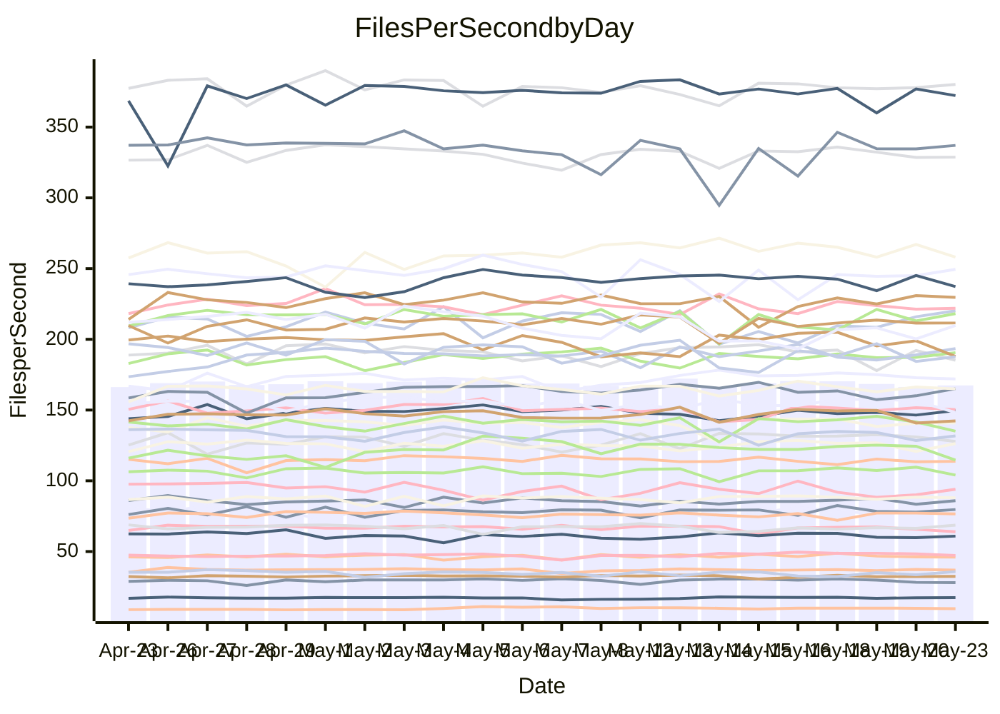

<!---
# This file is auto-generated. Do not edit.
# cspell:disable
--->
# Performance Report

## Daily Performance

```mermaid
xychart-beta
    title Files Per Second by Day
    y-axis Files per Second
    x-axis Date [Apr-23, Apr-26, Apr-27, Apr-28, Apr-29, May-1, May-2, May-3, May-4, May-5, May-6, May-7, May-8, May-12, May-13, May-14, May-15, May-16, May-18, May-19, May-20, May-23]
    bar [166.24, 169.01, 170.16, 167.72, 168.26, 170.38, 169.01, 170.05, 171.31, 172.25, 168.76, 168.77, 167.13, 166.34, 172.19, 166.30, 168.97, 170.53, 170.36, 168.47, 166.35, 167.43]
    line [28.89, 29.69, 29.35, 26.00, 29.94, 28.66, 29.87, 29.89, 29.90, 30.63, 29.61, 30.78, 29.56, 26.75, 29.76, 30.51, 30.52, 29.81, 30.62, 29.84, 28.21, 27.98]
    line [8.91, 9.11, 9.06, 9.11, 8.79, 9.00, 8.99, 8.88, 9.78, 11.13, 10.60, 11.02, 9.75, 10.31, 10.27, 9.90, 9.33, 9.97, 9.95, 10.01, 9.91, 9.59]
    line [125.27, 134.01, 118.75, 126.75, 125.77, 131.11, 130.91, 124.35, 133.34, 128.67, 125.58, 120.28, 125.23, 133.35, 122.61, 133.53, 133.12, 131.47, 131.60, 132.60, 130.97, 127.82]
    line [106.34, 107.51, 106.82, 102.05, 108.57, 108.98, 105.49, 105.90, 105.47, 109.94, 105.06, 105.36, 103.03, 108.06, 108.54, 99.38, 107.08, 107.13, 109.20, 107.30, 109.63, 104.03]
    line [32.35, 31.41, 32.91, 32.62, 32.00, 32.63, 32.93, 33.20, 32.65, 32.77, 32.53, 31.97, 33.01, 32.72, 33.28, 32.89, 30.56, 31.82, 33.25, 32.21, 32.32, 32.41]
    line [208.16, 215.76, 214.38, 202.09, 208.91, 219.25, 211.42, 207.33, 223.10, 201.06, 212.88, 218.82, 217.59, 205.57, 220.26, 196.51, 205.48, 197.40, 209.57, 208.50, 215.95, 220.22]
    line [218.17, 224.25, 228.38, 223.81, 225.34, 235.83, 224.43, 224.65, 222.96, 217.40, 224.19, 230.80, 224.16, 221.99, 217.52, 232.11, 221.53, 218.22, 226.74, 223.86, 221.34, 221.97]
    line [143.90, 145.46, 153.88, 143.81, 147.85, 151.13, 149.15, 148.97, 151.07, 153.63, 148.86, 150.06, 152.60, 147.69, 147.02, 142.52, 145.54, 149.90, 147.54, 148.35, 146.43, 149.62]
    line [120.53, 127.62, 125.93, 128.76, 126.48, 126.12, 120.58, 126.57, 124.39, 128.28, 123.01, 125.83, 124.94, 124.68, 121.17, 123.75, 127.64, 128.53, 126.42, 126.77, 120.74, 126.34]
    line [80.78, 78.25, 82.40, 76.38, 78.02, 72.12, 80.73, 81.56, 78.72, 82.39, 74.80, 84.51, 74.07, 79.58, 78.43, 72.10, 77.35, 81.14, 78.37, 76.94, 80.65, 77.27]
    line [76.15, 80.49, 75.89, 81.68, 74.20, 81.33, 74.27, 79.01, 79.45, 78.07, 77.48, 79.46, 79.26, 73.82, 79.33, 79.19, 79.44, 75.54, 82.49, 78.33, 77.90, 79.70]
    line [35.42, 38.72, 37.36, 36.85, 37.16, 37.23, 37.33, 37.90, 37.24, 37.02, 37.71, 34.42, 36.40, 36.66, 37.79, 37.24, 36.68, 36.93, 37.19, 36.50, 37.36, 36.90]
    line [188.84, 190.27, 195.78, 182.52, 195.47, 196.70, 190.41, 194.88, 192.14, 191.15, 184.78, 188.37, 180.73, 189.93, 194.03, 194.59, 196.19, 191.05, 192.47, 177.89, 192.16, 185.24]
    line [182.89, 189.73, 192.45, 181.80, 185.66, 187.70, 177.84, 183.57, 189.30, 186.49, 189.50, 191.09, 193.75, 184.57, 179.69, 190.06, 187.90, 186.22, 189.65, 187.06, 187.21, 190.60]
    line [214.06, 233.07, 227.94, 226.06, 222.41, 228.73, 232.92, 224.51, 227.70, 232.93, 226.46, 225.43, 231.26, 225.21, 225.16, 230.32, 208.51, 223.18, 229.26, 224.98, 230.86, 229.66]
    line [35.32, 35.34, 37.17, 36.51, 35.39, 35.94, 31.83, 34.32, 35.63, 35.19, 33.85, 35.17, 32.43, 35.78, 32.88, 35.46, 35.61, 32.66, 32.30, 35.13, 33.62, 35.80]
    line [150.49, 156.46, 147.81, 149.46, 151.58, 147.82, 149.77, 153.96, 153.88, 158.20, 149.58, 150.37, 151.41, 148.91, 151.04, 141.64, 143.30, 152.80, 151.43, 149.63, 151.63, 150.34]
    line [16.92, 17.80, 17.29, 17.00, 17.03, 17.60, 17.41, 17.38, 17.67, 17.14, 17.24, 15.74, 16.24, 16.32, 16.77, 17.92, 17.71, 17.58, 17.65, 16.96, 17.30, 17.42]
    line [257.43, 268.34, 260.98, 261.96, 251.80, 236.87, 261.43, 249.40, 258.94, 259.40, 261.01, 258.08, 266.61, 268.20, 264.65, 271.47, 262.16, 268.02, 265.09, 258.04, 267.05, 258.13]
    line [154.14, 156.31, 156.21, 156.28, 149.14, 155.19, 158.71, 159.29, 155.74, 156.77, 151.80, 157.52, 149.72, 154.32, 150.31, 157.94, 153.23, 153.21, 157.46, 157.66, 156.52, 148.27]
    line [86.07, 89.56, 85.94, 83.19, 85.07, 85.64, 86.50, 81.12, 88.42, 84.35, 87.89, 85.94, 85.35, 82.11, 85.57, 83.56, 85.40, 85.46, 86.28, 87.70, 83.40, 85.96]
    line [73.58, 77.25, 76.75, 74.06, 78.23, 77.68, 77.02, 78.67, 77.33, 75.83, 73.91, 76.48, 76.11, 75.68, 77.38, 75.72, 74.53, 76.86, 72.12, 77.17, 77.17, 76.57]
    line [377.40, 383.08, 384.18, 364.78, 379.69, 389.95, 376.34, 383.36, 382.91, 364.75, 378.73, 377.82, 374.56, 379.30, 373.05, 365.07, 381.01, 380.59, 377.82, 377.10, 377.94, 380.13]
    line [209.32, 216.82, 220.49, 217.39, 217.33, 217.58, 210.97, 221.09, 216.34, 217.43, 218.03, 212.25, 221.08, 208.07, 219.61, 196.71, 217.50, 208.81, 206.53, 221.15, 213.00, 218.15]
    line [209.72, 197.36, 209.18, 213.77, 206.60, 207.06, 215.10, 212.20, 214.75, 212.93, 210.19, 214.72, 210.67, 217.29, 215.75, 197.30, 214.87, 209.14, 211.55, 213.63, 211.52, 211.53]
    line [173.56, 177.31, 180.43, 188.88, 190.75, 193.82, 191.55, 190.04, 189.74, 188.33, 189.19, 188.21, 191.59, 179.93, 194.66, 187.78, 191.72, 196.34, 187.34, 185.35, 189.04, 193.41]
    line [64.86, 68.62, 67.74, 67.95, 68.04, 66.51, 66.52, 67.87, 67.35, 67.61, 65.75, 68.53, 65.54, 67.95, 67.86, 67.59, 62.41, 66.69, 67.14, 67.37, 65.68, 63.99]
    line [62.50, 62.36, 63.83, 62.70, 65.36, 59.30, 61.32, 60.96, 56.18, 61.99, 60.65, 62.26, 59.47, 58.65, 60.35, 63.19, 61.20, 62.95, 62.89, 60.12, 59.81, 60.90]
    line [137.71, 134.50, 144.52, 138.50, 142.73, 142.58, 141.74, 139.12, 142.98, 140.71, 141.26, 137.69, 141.28, 143.08, 139.04, 127.38, 143.64, 143.63, 143.64, 138.45, 140.67, 140.88]
    line [166.93, 163.53, 176.05, 166.53, 173.80, 174.60, 176.01, 171.22, 172.54, 171.25, 173.73, 162.92, 167.61, 169.50, 174.44, 178.32, 174.09, 174.49, 176.32, 175.06, 172.88, 172.01]
    line [158.56, 163.17, 162.49, 147.86, 158.64, 158.76, 162.55, 166.05, 166.53, 166.66, 167.25, 163.16, 162.00, 164.14, 168.22, 165.47, 169.61, 162.55, 163.57, 157.32, 160.08, 165.10]
    line [115.13, 112.07, 115.89, 105.71, 114.28, 114.99, 114.25, 117.78, 117.04, 115.86, 113.71, 118.02, 115.63, 115.50, 113.50, 113.65, 116.71, 113.77, 111.44, 115.40, 113.43, 113.76]
    line [326.60, 326.89, 337.11, 325.09, 333.51, 337.53, 336.18, 334.66, 333.07, 330.78, 324.57, 319.53, 330.60, 334.33, 332.82, 320.86, 333.17, 332.61, 335.87, 332.27, 328.58, 328.75]
    line [141.60, 138.78, 140.13, 136.72, 143.22, 138.30, 135.10, 140.53, 145.72, 140.66, 143.38, 141.69, 142.26, 139.20, 144.62, 127.45, 143.99, 141.77, 143.07, 145.59, 141.58, 135.09]
    line [199.52, 202.33, 198.33, 200.17, 201.21, 199.69, 199.23, 201.79, 203.98, 192.56, 202.66, 197.87, 187.68, 190.41, 187.82, 203.06, 199.79, 204.27, 205.03, 195.35, 198.93, 187.97]
    line [196.87, 194.18, 188.58, 197.42, 188.78, 199.80, 198.62, 182.61, 194.34, 196.11, 194.71, 183.16, 188.24, 195.81, 199.38, 179.78, 176.57, 191.99, 188.23, 196.89, 184.41, 187.69]
    line [97.61, 97.80, 98.14, 98.79, 94.90, 95.85, 92.03, 98.95, 93.32, 86.35, 92.49, 96.24, 86.60, 91.17, 98.66, 94.02, 90.96, 99.83, 91.94, 88.40, 90.08, 94.00]
    line [368.51, 322.56, 379.15, 370.19, 379.79, 365.55, 379.36, 378.80, 375.67, 374.39, 375.98, 374.25, 373.94, 382.33, 383.40, 373.36, 376.94, 373.43, 377.39, 360.07, 376.99, 372.29]
    line [86.67, 88.50, 84.93, 88.85, 87.16, 89.19, 81.96, 89.10, 82.29, 89.33, 87.86, 88.80, 87.73, 86.71, 84.47, 88.90, 88.97, 89.34, 88.33, 86.97, 88.46, 88.02]
    line [245.72, 249.53, 246.35, 243.55, 244.05, 251.97, 248.55, 245.13, 249.84, 259.47, 252.93, 247.93, 229.85, 256.31, 245.89, 226.73, 248.94, 227.93, 245.76, 244.49, 245.02, 249.46]
    line [337.12, 337.38, 342.40, 337.39, 338.82, 338.54, 338.13, 347.37, 334.59, 337.26, 333.23, 330.51, 316.32, 340.62, 334.56, 294.73, 334.87, 315.41, 346.35, 334.68, 334.65, 337.09]
    line [46.18, 45.75, 47.55, 46.20, 48.11, 46.34, 47.50, 47.88, 43.90, 46.29, 47.39, 44.01, 47.86, 45.93, 47.77, 45.98, 48.12, 46.48, 48.80, 46.77, 46.21, 46.04]
    line [68.84, 65.99, 67.08, 67.28, 68.56, 68.82, 67.85, 66.15, 68.38, 62.17, 67.55, 67.67, 67.56, 69.77, 67.94, 63.43, 64.29, 66.74, 65.81, 66.84, 66.34, 68.61]
    line [116.03, 121.63, 117.57, 115.16, 117.71, 109.46, 120.11, 122.11, 121.82, 131.63, 130.15, 127.70, 119.16, 125.90, 125.82, 123.46, 122.18, 122.11, 124.34, 125.23, 124.43, 114.70]
    line [142.38, 146.96, 147.34, 146.66, 146.46, 150.91, 147.43, 145.71, 148.91, 149.51, 144.70, 144.28, 144.31, 146.80, 151.99, 141.37, 146.91, 150.57, 149.37, 149.78, 140.84, 142.33]
    line [136.15, 136.56, 135.99, 135.68, 131.24, 131.06, 128.00, 134.10, 138.12, 133.91, 128.09, 134.94, 136.31, 128.69, 133.43, 136.60, 125.12, 133.23, 134.94, 134.09, 128.45, 131.71]
    line [47.43, 46.81, 46.39, 46.77, 46.87, 47.22, 48.49, 47.46, 47.88, 48.28, 46.64, 43.98, 47.22, 47.37, 46.30, 48.69, 48.22, 49.55, 48.73, 48.79, 48.29, 47.26]
    line [239.31, 237.17, 238.51, 240.92, 243.57, 233.28, 229.57, 233.64, 243.55, 249.38, 245.40, 243.67, 240.25, 242.94, 244.80, 245.38, 242.84, 244.51, 242.53, 234.41, 245.11, 237.32]
    line [155.81, 166.82, 167.06, 164.95, 160.71, 167.49, 163.15, 163.16, 162.83, 172.90, 167.13, 164.53, 161.22, 166.91, 166.88, 159.89, 163.94, 170.50, 166.49, 162.92, 166.27, 164.98]
    line [211.94, 214.01, 216.12, 219.03, 213.99, 217.74, 207.96, 223.53, 219.50, 216.40, 207.90, 202.74, 200.36, 218.54, 215.87, 198.70, 198.92, 193.26, 206.82, 208.12, 200.26, 209.76]
```

## Time to Process Files

| Repository                                      | Elapsed | Min/Avg/Max           |   SD | SD Graph                |
| ----------------------------------------------- | ------: | :-------------------: | ---: | ----------------------- |
| AdaDoom3/AdaDoom3                    |    3.13 | 3.0 /   3.2 /   3.6   | 0.09 | `    ┣━━┻━●╋━━┻━━┫    ` |
| alexiosc/megistos                    |    7.21 | 7.0 /   7.5 /   8.4   | 0.28 | `    ┣━━●━━╋━━┻━━┫    ` |
| apollographql/apollo-server          |    2.36 | 2.3 /   2.4 /   2.6   | 0.08 | `     ┣━┻━●╋━━┻━┫     ` |
| aspnetboilerplate/aspnetboilerplate  |    9.92 | 9.6 /  10.1 /  10.7   | 0.25 | `    ┣━━┻●━╋━━┻━━┫    ` |
| aws-amplify/docs                     |   12.85 | 12.2 /  12.7 /  15.6  | 0.61 | `    ┣━━┻━━╋●━┻━━┫    ` |
| Azure/azure-rest-api-specs           |    8.95 | 8.7 /   9.2 /  10.3   | 0.34 | `    ┣━━●━━╋━━┻━━┫    ` |
| bitjson/typescript-starter           |    0.67 | 0.6 /   0.7 /   0.9   | 0.05 | `     ┣━┻━●╋━━┻━┫     ` |
| caddyserver/caddy                    |    3.59 | 3.2 /   3.6 /   4.1   | 0.22 | `    ┣━━┻━━●━━┻━━┫    ` |
| canada-ca/open-source-logiciel-libre |    0.67 | 0.6 /   0.7 /   0.9   | 0.06 | `     ┣━●━━╋━━┻━┫     ` |
| chef/chef                            |    5.42 | 5.2 /   5.7 /   6.6   | 0.32 | `    ┣━━●━━╋━━┻━━┫    ` |
| dart-lang/sdk                        |   61.91 | 60.6 /  63.5 /  77.4  | 2.53 | `  ┣━━━┻━●━╋━━━┻━━━┫  ` |
| django/django                        |   14.60 | 14.6 /  15.2 /  16.8  | 0.43 | `    ┣━●┻━━╋━━┻━━┫    ` |
| eslint/eslint                        |   12.27 | 10.4 /  10.9 /  12.2  | 0.42 | `    ┣━━┻━━╋━━┻━━┫   ●` |
| exonum/exonum                        |    3.24 | 3.1 /   3.3 /   3.7   | 0.17 | `    ┣━━┻━●╋━━┻━━┫    ` |
| flutter/samples                      |   17.49 | 16.6 /  17.8 /  19.6  | 0.66 | `   ┣━━━┻━●╋━━┻━━━┫   ` |
| gitbucket/gitbucket                  |    3.28 | 3.1 /   3.3 /   3.8   | 0.13 | `    ┣━━┻━●╋━━┻━━┫    ` |
| googleapis/google-cloud-cpp          |  151.75 | 127.1 / 138.2 / 153.3 | 4.66 | `   ┣━━┻━━━╋━━━┻━━┫  ●` |
| graphql/express-graphql              |    0.72 | 0.7 /   0.8 /   0.9   | 0.05 | `     ┣━┻●━╋━━┻━┫     ` |
| graphql/graphql-js                   |    2.41 | 2.2 /   2.3 /   2.5   | 0.07 | `     ┣━┻━━╋━━●━┫     ` |
| graphql/graphql-relay-js             |    0.73 | 0.7 /   0.8 /   0.9   | 0.03 | `     ┣━●┻━╋━┻━━┫     ` |
| graphql/graphql-spec                 |    0.90 | 0.8 /   0.9 /   1.1   | 0.04 | `     ┣━┻━━╋●━┻━┫     ` |
| iluwatar/java-design-patterns        |   12.73 | 12.3 /  12.9 /  15.4  | 0.50 | `    ┣━━┻━●╋━━┻━━┫    ` |
| ktaranov/sqlserver-kit               |    6.41 | 6.1 /   6.4 /   7.0   | 0.20 | `    ┣━━┻━━●━━┻━━┫    ` |
| liriliri/licia                       |    3.86 | 3.7 /   3.8 /   3.9   | 0.08 | `    ┣━━┻━━╋━●┻━━┫    ` |
| MartinThoma/LaTeX-examples           |    6.72 | 6.4 /   6.7 /   7.2   | 0.19 | `    ┣━━┻━━╋●━┻━━┫    ` |
| mdx-js/mdx                           |    1.63 | 1.5 /   1.6 /   1.8   | 0.05 | `     ┣━┻━●╋━━┻━┫     ` |
| microsoft/TypeScript-Website         |    5.47 | 5.1 /   5.4 /   6.0   | 0.20 | `    ┣━━┻━━╋●━┻━━┫    ` |
| MicrosoftDocs/PowerShell-Docs        |   23.02 | 22.3 /  23.7 /  27.7  | 0.92 | `   ┣━━━┻●━╋━━┻━━━┫   ` |
| neovim/nvim-lspconfig                |    3.77 | 3.7 /   3.9 /   4.6   | 0.15 | `    ┣━━●━━╋━━┻━━┫    ` |
| pagekit/pagekit                      |    3.32 | 3.2 /   3.5 /   4.2   | 0.15 | `    ┣━━●━━╋━━┻━━┫    ` |
| php/php-src                          |   22.45 | 21.9 /  23.8 /  30.3  | 1.78 | `   ┣━━┻●━━╋━━━┻━━┫   ` |
| plasticrake/tplink-smarthome-api     |    1.01 | 0.9 /   0.9 /   1.0   | 0.03 | `     ┣━┻━━╋━━┻━┫ ●   ` |
| prettier/prettier                    |    7.14 | 6.6 /   6.9 /   7.2   | 0.14 | `    ┣━━┻━━╋━━┻━━●    ` |
| pycontribs/jira                      |    1.34 | 1.2 /   1.3 /   1.5   | 0.06 | `     ┣━┻━━╋━●┻━┫     ` |
| RustPython/RustPython                |    4.98 | 4.5 /   4.8 /   5.3   | 0.17 | `    ┣━━┻━━╋━━┻●━┫    ` |
| shoelace-style/shoelace              |    2.50 | 2.4 /   2.6 /   2.9   | 0.10 | `    ┣━━┻●━╋━━┻━━┫    ` |
| slint-ui/slint                       |   11.80 | 10.3 /  11.3 /  12.7  | 0.56 | `    ┣━━┻━━╋━━●━━┫    ` |
| SoftwareBrothers/admin-bro           |    2.31 | 2.1 /   2.2 /   2.6   | 0.10 | `     ┣━┻━━╋━●┻━┫     ` |
| sveltejs/svelte                      |   19.24 | 18.5 /  19.6 /  22.7  | 0.58 | `   ┣━━━┻●━╋━━┻━━━┫   ` |
| TheAlgorithms/Python                 |    5.59 | 5.3 /   5.6 /   6.5   | 0.23 | `    ┣━━┻━━●━━┻━━┫    ` |
| twbs/bootstrap                       |    1.34 | 1.3 /   1.4 /   1.6   | 0.06 | `     ┣━┻━●╋━━┻━┫     ` |
| typescript-cheatsheets/react         |    1.15 | 1.1 /   1.1 /   1.3   | 0.05 | `     ┣━┻━━╋●━┻━┫     ` |
| typescript-eslint/typescript-eslint  |    3.72 | 3.6 /   3.8 /   4.3   | 0.14 | `    ┣━━┻━●╋━━┻━━┫    ` |
| vitest-dev/vitest                    |    8.88 | 8.3 /   8.6 /   9.3   | 0.22 | `    ┣━━┻━━╋━━●━━┫    ` |
| w3c/aria-practices                   |    2.96 | 2.8 /   3.1 /   3.5   | 0.15 | `    ┣━━┻●━╋━━┻━━┫    ` |
| w3c/specberus                        |    1.79 | 1.5 /   1.7 /   2.2   | 0.10 | `     ┣━┻━━╋━━●━┫     ` |
| webdeveric/webpack-assets-manifest   |    0.76 | 0.7 /   0.8 /   0.9   | 0.03 | `     ┣━●┻━╋━┻━━┫     ` |
| webpack/webpack                      |    5.11 | 4.8 /   5.2 /   6.0   | 0.27 | `    ┣━━┻●━╋━━┻━━┫    ` |
| wireapp/wire-desktop                 |    0.87 | 0.8 /   0.9 /   1.0   | 0.04 | `     ┣━●━━╋━━┻━┫     ` |
| wireapp/wire-webapp                  |   10.39 | 9.8 /  10.3 /  12.3   | 0.43 | `    ┣━━┻━━╋●━┻━━┫    ` |

Note:
- Elapsed time is in seconds.

## Files per Second over Time

| Repository                                      | Files |    Sec |    Fps |     Rel | Trend Fps              |    N |
| ----------------------------------------------- | ----: | -----: | -----: | ------: | ---------------------- | ---: |
| AdaDoom3/AdaDoom3                    |   103 |   3.13 |  32.91 |   1.39% | `▇▇█▇▇▃▆▆▇█▇▆▆▆▆█▆▇▇▇` |   47 |
| alexiosc/megistos                    |   583 |   7.21 |  80.87 |   3.64% | `▅▇▆▇▇▇▆▄█▇▆▇▆▇▅▇▇▆▇▇` |   47 |
| apollographql/apollo-server          |   254 |   2.36 | 107.63 |   1.13% | `▆▇█▄▇▇▇▇█▇▇▇████▄▆▅▇` |   48 |
| aspnetboilerplate/aspnetboilerplate  |  2255 |   9.92 | 227.28 |   1.74% | `▆▇▄█▆▇▄▇▇▇▇▆▆█▅▆▇▅▆▇` |   48 |
| aws-amplify/docs                     |  2871 |  12.85 | 223.42 |  -1.17% | `█▇▇██▂█▆▇██▆█▇███▇█▇` |   50 |
| Azure/azure-rest-api-specs           |  2370 |   8.95 | 264.72 |   1.54% | `▇█▆█▆▇█▇█▆▆▇█▇█▇▅▅█▇` |   50 |
| bitjson/typescript-starter           |    20 |   0.67 |  29.80 |   1.49% | `▅▇▇██▇▇▇██▇██▂▇█▇▃▇▇` |   47 |
| caddyserver/caddy                    |   284 |   3.59 |  79.12 |   0.36% | `▄▄█▄▆▆▆█▆▆▆▆▆▆█▇▅▆▆▆` |   49 |
| canada-ca/open-source-logiciel-libre |     7 |   0.67 |  10.42 |   7.77% | `█▇█▇▇▃█▆▇▇▇▇▇▇▆▇▆▂▇█` |   47 |
| chef/chef                            |  1204 |   5.42 | 222.07 |   4.96% | `▆▇█▅▅▇▄▆▇▆▇▆▇▇▆███▇█` |   50 |
| dart-lang/sdk                        | 10351 |  61.91 | 167.19 |   2.75% | `▇▇█▇██▇▇▇▇▅▇▆▇▇▇▇▇▇█` |   50 |
| django/django                        |  2842 |  14.60 | 194.61 |   4.08% | `▇▆▅▇█▆▇▆▆█▇▆▇▇▆▇▇█▇█` |   50 |
| eslint/eslint                        |  2064 |  12.27 | 168.19 | -11.59% | `▇▇▇▇███▆▇▇▆▃▇▅███▆▇▃` |   50 |
| exonum/exonum                        |   421 |   3.24 | 130.07 |   1.75% | `█▄▆███▇▇▆█▇█▇▆█▇▇▅▇▇` |   47 |
| flutter/samples                      |  2657 |  17.49 | 151.88 |   0.82% | `▆▇▆▅▇▄▇▇▆▇▇▆▆█▆▇▆▆█▇` |   49 |
| gitbucket/gitbucket                  |   412 |   3.28 | 125.57 |   0.64% | `▆▆▆▇█▇██▇█▇█▆▇▄▇▇▇█▇` |   50 |
| googleapis/google-cloud-cpp          | 20300 | 151.75 | 133.78 |  -8.56% | `███▅▇▆█▇▇▇▇▇▆▇▅▃█▆▅▄` |   50 |
| graphql/express-graphql              |    26 |   0.72 |  36.36 |   5.09% | `█▇▄█▇█▄▇▄▇▇██▇▂██▇▇█` |   47 |
| graphql/graphql-js                   |   351 |   2.41 | 145.59 |  -2.00% | `▆▅▇▅█▄█▆▅█▇▇▇▅▇▆▇█▇▆` |   50 |
| graphql/graphql-relay-js             |    28 |   0.73 |  38.49 |   4.26% | `▇▇█▇▇▇▇▇▇▇▇▇▇▇▇█▇█▆█` |   47 |
| graphql/graphql-spec                 |    15 |   0.90 |  16.73 |  -2.67% | `▅▅▆▇▇▇▇▆▇▇▅▆▆▆▆▇▇▅█▆` |   49 |
| iluwatar/java-design-patterns        |  1992 |  12.73 | 156.50 |   1.37% | `▇▆▇█▇▆▇▇█▇▇██▇█▆▃▇▇▇` |   49 |
| ktaranov/sqlserver-kit               |   489 |   6.41 |  76.26 |   0.28% | `▆█▆▆▅▇▇▇▄▆▇▇▇▇▇▇▇▆█▇` |   48 |
| liriliri/licia                       |  1437 |   3.86 | 372.66 |  -1.57% | `▇▇▅▅▇▇█▆▇▇▅█▇▇▅██▇▇▆` |   47 |
| MartinThoma/LaTeX-examples           |  1409 |   6.72 | 209.77 |  -0.69% | `█▇█▄▇█▇▆█▆▇▇▇▆▇▇██▅▆` |   47 |
| mdx-js/mdx                           |   141 |   1.63 |  86.57 |   1.04% | `▅▆▇▆▆█▇▆█▆██▇▆▄▇▇▆█▇` |   47 |
| microsoft/TypeScript-Website         |   763 |   5.47 | 139.45 |  -0.90% | `█▅▇▃▇▇█▆▇▇▅▆▇▇▇▄▇█▅▆` |   49 |
| MicrosoftDocs/PowerShell-Docs        |  2706 |  23.02 | 117.55 |   2.72% | `▆█▆▇█▇█▆▆▇▆█▅█▇▇▇▅██` |   50 |
| neovim/nvim-lspconfig                |   740 |   3.77 | 196.46 |   4.69% | `▆█▇▇▇▇██▇▆▆▇█▇▇▆▇▇██` |   50 |
| pagekit/pagekit                      |   741 |   3.32 | 223.44 |   3.90% | `▆█▇▅▇▆▆▆▅▆▆█▆▆▇▆▆▆▇▇` |   47 |
| php/php-src                          |  2226 |  22.45 |  99.17 |   5.74% | `▇█▇▇▅▇█▇▇▅▆▅██▅▂▆█▅█` |   50 |
| plasticrake/tplink-smarthome-api     |    62 |   1.01 |  61.26 |  -7.93% | `█▇██▃▇▇▇▇▇█▇▆▆▇▇▅▇▇▄` |   47 |
| prettier/prettier                    |  2278 |   7.14 | 319.15 |  -3.48% | `▆▇▆▅▇▇█▆▆█▆▇▅▇▅█▆▇▇▅` |   50 |
| pycontribs/jira                      |    79 |   1.34 |  59.06 |  -3.64% | `▅▅▇▇▇▆▇▇▆█▇▅▆▃▆▆▇▆▆▅` |   49 |
| RustPython/RustPython                |   674 |   4.98 | 135.30 |  -4.04% | `▅▇█▄▇█▆█▇███▇█▆▇▄█▄▅` |   50 |
| shoelace-style/shoelace              |   439 |   2.50 | 175.89 |   2.21% | `▇█▇██▇█▇▇████▇▇▇▇▇▆█` |   47 |
| slint-ui/slint                       |  2150 |  11.80 | 182.19 |  -4.74% | `▆▆█▄▅▃▅▇▇▄▇▆▇▅▄▅▇▅▅▅` |   50 |
| SoftwareBrothers/admin-bro           |   441 |   2.31 | 191.15 |  -3.61% | `▆▄▇▇▇▇▇███▇▆█▇▇▆▆▆▄▆` |   47 |
| sveltejs/svelte                      |  7372 |  19.24 | 383.06 |   2.55% | `▇█▆▇▇▇▆▇▇▇▅▆▆▇▇▇▆▆▇▇` |   49 |
| TheAlgorithms/Python                 |  1387 |   5.59 | 248.28 |   0.79% | `█▆▇▅▇▇▃▇▇▆▇▆▇█▅▇█▇▇▇` |   50 |
| twbs/bootstrap                       |   118 |   1.34 |  88.00 |   0.93% | `▇▄██▇████▇▆████▆█▆▇▇` |   50 |
| typescript-cheatsheets/react         |    53 |   1.15 |  46.06 |  -1.37% | `▆▇█▆▇█▇▆██▆▇█▇▇▃▇▇▅▆` |   47 |
| typescript-eslint/typescript-eslint  |  1265 |   3.72 | 339.73 |   1.50% | `▇▆▇▃▇▇▄▆█▇▆▇▇▆▆▇▇▇▆▇` |   50 |
| vitest-dev/vitest                    |  2092 |   8.88 | 235.46 |  -2.39% | `▇▆█▇▆▇▇▇▆█▇▄█▇▇▇▆▅█▆` |   50 |
| w3c/aria-practices                   |   405 |   2.96 | 136.80 |   3.08% | `▆▆▇█▃▇▆█▇██▆▆▃▇▇▇▇▅█` |   48 |
| w3c/specberus                        |   204 |   1.79 | 113.73 |  -6.54% | `███▇▇▇▇▇█▇█▇▇▇█▇██▂▆` |   48 |
| webdeveric/webpack-assets-manifest   |    53 |   0.76 |  69.96 |   4.20% | `█▇▇▅▄▇▆▇▆▆▆▆▆▅▇▆▆█▇█` |   49 |
| webpack/webpack                      |  1093 |   5.11 | 214.05 |   1.99% | `██▇▅▆▄▅▄▅▇▆▇▃▄▇█▆▆▇▇` |   50 |
| wireapp/wire-desktop                 |    43 |   0.87 |  49.54 |   4.47% | `▅▇▄▇█▆█▇▇▇▇▇▆▇▇▇▇▄▆▇` |   49 |
| wireapp/wire-webapp                  |  1719 |  10.39 | 165.45 |   0.50% | `▇▇▇▆▆▇█▇▇▇▇▇█▇▇▇██▅▇` |   50 |

## Data Throughput

| Repository                                      | Files |    Sec |     Kps |     Rel | Trend Kps              |    N |
| ----------------------------------------------- | ----: | -----: | ------: | ------: | ---------------------- | ---: |
| AdaDoom3/AdaDoom3                    |   103 |   3.13 |  699.51 |   1.39% | `▇▇█▇▇▃▆▆▇█▇▆▆▆▆█▆▇▇▇` |   47 |
| alexiosc/megistos                    |   583 |   7.21 |  635.46 |   3.64% | `▅▇▆▇▇▇▆▄█▇▆▇▆▇▅▇▇▆▇▇` |   47 |
| apollographql/apollo-server          |   254 |   2.36 |  853.88 |   1.21% | `▆▇█▄▇▇▇▇█▇▇▇████▄▆▅▇` |   48 |
| aspnetboilerplate/aspnetboilerplate  |  2255 |   9.92 |  534.99 |   1.74% | `▆▇▄█▆▇▄▇▇▇▇▆▆█▅▆▇▅▆▇` |   48 |
| aws-amplify/docs                     |  2871 |  12.85 |  775.38 |  -1.10% | `█▇▇██▂█▆▇██▆█▇███▇█▇` |   50 |
| Azure/azure-rest-api-specs           |  2370 |   8.95 |  723.68 |   2.34% | `▇▇▆█▆▇█▆▇▆▆▇███▇▅▆█▇` |   50 |
| bitjson/typescript-starter           |    20 |   0.67 |  119.20 |   1.49% | `▅▇▇██▇▇▇██▇██▂▇█▇▃▇▇` |   47 |
| caddyserver/caddy                    |   284 |   3.59 |  671.71 |   0.20% | `▄▄█▄▆▆▆█▆▆▆▆▆▆█▇▅▆▆▆` |   49 |
| canada-ca/open-source-logiciel-libre |     7 |   0.67 |   86.38 |   7.77% | `█▇█▇▇▃█▆▇▇▇▇▇▇▆▇▆▂▇█` |   47 |
| chef/chef                            |  1204 |   5.42 | 1021.45 |   4.96% | `▆▇█▅▅▇▄▆▇▆▇▆▇▇▆███▇█` |   50 |
| dart-lang/sdk                        | 10351 |  61.91 | 1147.12 |   2.48% | `▇▇█▇██▇▇▇▇▅▇▆▇▇▇▇▇▇█` |   50 |
| django/django                        |  2842 |  14.60 | 1205.07 |   4.01% | `▇▆▅▇█▆▇▆▆█▇▆▇▇▆▇▇█▇█` |   50 |
| eslint/eslint                        |  2064 |  12.27 | 1205.17 | -11.32% | `▇▇▇▇███▆▇▇▆▃▇▅███▆▇▃` |   50 |
| exonum/exonum                        |   421 |   3.24 | 1244.11 |   1.75% | `█▄▆███▇▇▆█▇█▇▆█▇▇▅▇▇` |   47 |
| flutter/samples                      |  2657 |  17.49 | 1252.68 |   1.26% | `▆▇▆▅▇▄▇▇▆▇▇▆▆█▆▇▆▆█▇` |   49 |
| gitbucket/gitbucket                  |   412 |   3.28 |  567.81 |   0.64% | `▆▆▆▇█▇██▇█▇█▆▇▄▇▇▇█▇` |   50 |
| googleapis/google-cloud-cpp          | 20300 | 151.75 | 1059.69 |  -8.34% | `███▅▇▆█▇▇▇▇▇▆▇▅▃█▆▅▄` |   50 |
| graphql/express-graphql              |    26 |   0.72 |  166.41 |   5.09% | `█▇▄█▇█▄▇▄▇▇██▇▂██▇▇█` |   47 |
| graphql/graphql-js                   |   351 |   2.41 |  824.98 |  -1.81% | `▆▅▇▅█▄█▆▅█▇▇▇▅▇▆▇█▇▆` |   50 |
| graphql/graphql-relay-js             |    28 |   0.73 |  151.22 |   4.26% | `▇▇█▇▇▇▇▇▇▇▇▇▇▇▇█▇█▆█` |   47 |
| graphql/graphql-spec                 |    15 |   0.90 |  622.49 |  -2.67% | `▅▅▆▇▇▇▇▆▇▇▅▆▆▆▆▇▇▅█▆` |   49 |
| iluwatar/java-design-patterns        |  1992 |  12.73 |  483.72 |   1.47% | `▇▆▆▇▇▆▇▇█▇▇██▇█▆▃▇▇▇` |   49 |
| ktaranov/sqlserver-kit               |   489 |   6.41 | 1154.20 |   0.28% | `▆█▆▆▅▇▇▇▄▆▇▇▇▇▇▇▇▆█▇` |   48 |
| liriliri/licia                       |  1437 |   3.86 |  443.98 |  -1.57% | `▇▇▅▅▇▇█▆▇▇▅█▇▇▅██▇▇▆` |   47 |
| MartinThoma/LaTeX-examples           |  1409 |   6.72 |  433.24 |  -0.69% | `█▇█▄▇█▇▆█▆▇▇▇▆▇▇██▅▆` |   47 |
| mdx-js/mdx                           |   141 |   1.63 |  402.16 |   1.04% | `▅▆▇▆▆█▇▆█▆██▇▆▄▇▇▆█▇` |   47 |
| microsoft/TypeScript-Website         |   763 |   5.47 |  961.71 |  -0.90% | `█▅▇▃▇▇█▆▇▇▅▆▇▇▇▄▇█▅▆` |   49 |
| MicrosoftDocs/PowerShell-Docs        |  2706 |  23.02 | 1208.19 |   2.74% | `▆█▆▇█▇█▆▆▇▆█▅█▇▇▇▅██` |   50 |
| neovim/nvim-lspconfig                |   740 |   3.77 |  313.00 |   4.83% | `▆█▇▇▇▇██▇▆▆▇█▇▇▆▇▇██` |   50 |
| pagekit/pagekit                      |   741 |   3.32 |  465.89 |   3.90% | `▆█▇▅▇▆▆▆▅▆▆█▆▆▇▆▆▆▇▇` |   47 |
| php/php-src                          |  2226 |  22.45 | 1466.59 |   5.72% | `▇█▇▇▅▇█▇▇▅▆▅██▅▂▆█▅█` |   50 |
| plasticrake/tplink-smarthome-api     |    62 |   1.01 |  331.02 |  -7.93% | `█▇██▃▇▇▇▇▇█▇▆▆▇▇▅▇▇▄` |   47 |
| prettier/prettier                    |  2278 |   7.14 |  445.10 |  -3.65% | `▆▇▆▅▇▇█▆▆█▆▇▅▇▅█▆▇▇▅` |   50 |
| pycontribs/jira                      |    79 |   1.34 |  420.13 |  -3.50% | `▅▅▇▇▇▆▇▇▆█▇▅▆▃▆▆▇▆▆▅` |   49 |
| RustPython/RustPython                |   674 |   4.98 | 1043.08 |  -4.01% | `▅▇█▄▇█▆█▇███▇█▆▇▄█▄▅` |   50 |
| shoelace-style/shoelace              |   439 |   2.50 |  849.78 |   2.21% | `▇█▇██▇█▇▇████▇▇▇▇▇▆█` |   47 |
| slint-ui/slint                       |  2150 |  11.80 | 1166.12 |  -4.19% | `▆▆█▄▅▃▅▇▇▄▇▆▇▅▄▅▇▅▅▅` |   50 |
| SoftwareBrothers/admin-bro           |   441 |   2.31 |  421.31 |  -3.61% | `▆▄▇▇▇▇▇███▇▆█▇▇▆▆▆▄▆` |   47 |
| sveltejs/svelte                      |  7372 |  19.24 |  254.56 |   2.66% | `▇█▆▇▇▇▆▇▇▇▅▆▆▇▇█▆▆▇▇` |   49 |
| TheAlgorithms/Python                 |  1387 |   5.59 |  629.20 |   0.90% | `█▆▇▅▇▇▃▇▇▆▇▆▇█▅▇█▇▇▇` |   50 |
| twbs/bootstrap                       |   118 |   1.34 |  719.70 |   0.95% | `▇▄██▇████▇▆████▆█▆▇▇` |   50 |
| typescript-cheatsheets/react         |    53 |   1.15 |  337.17 |  -1.37% | `▆▇█▆▇█▇▆██▆▇█▇▇▃▇▇▅▆` |   47 |
| typescript-eslint/typescript-eslint  |  1265 |   3.72 | 1763.10 |   1.97% | `▇▆▇▃▇▇▄▆█▇▆▇▇▆▆▇▇▇▆▇` |   50 |
| vitest-dev/vitest                    |  2092 |   8.88 |  507.83 |  -2.12% | `▇▆█▇▆█▇▇▆█▇▄█▇▇▇▆▅█▆` |   50 |
| w3c/aria-practices                   |   405 |   2.96 | 1270.37 |   3.08% | `▆▆▇█▃▇▆█▇██▆▆▃▇▇▇▇▅█` |   48 |
| w3c/specberus                        |   204 |   1.79 |  357.36 |  -6.54% | `███▇▇▇▇▇█▇█▇▇▇█▇██▂▆` |   48 |
| webdeveric/webpack-assets-manifest   |    53 |   0.76 |  165.01 |   4.20% | `█▇▇▅▄▇▆▇▆▆▆▆▆▅▇▆▆█▇█` |   49 |
| webpack/webpack                      |  1093 |   5.11 |  963.71 |   2.43% | `██▇▅▆▄▅▄▅▇▆▇▃▄▇█▆▇▇▇` |   50 |
| wireapp/wire-desktop                 |    43 |   0.87 |  218.90 |   4.47% | `▅▇▄▇█▆█▇▇▇▇▇▆▇▇▇▇▄▆▇` |   49 |
| wireapp/wire-webapp                  |  1719 |  10.39 |  602.03 |  -0.42% | `▇▇▇▆▆▇█▇▇▇▆▆█▇▇▇██▅▇` |   50 |

