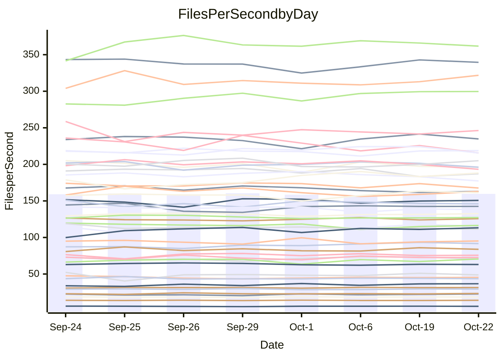

<!---
# This file is auto-generated. Do not edit.
# cspell:disable
--->
# Performance Report

## Daily Performance

```mermaid
xychart-beta
    title Files Per Second by Day
    y-axis Files per Second
    x-axis Date [Sep-24, Sep-25, Sep-26, Sep-29, Oct-1, Oct-6, Oct-19, Oct-22]
    bar [159.12, 160.20, 158.85, 160.46, 158.54, 157.78, 160.58, 159.63]
    line [167.61, 170.71, 164.68, 170.44, 168.02, 164.09, 161.71, 163.00]
    line [47.56, 46.43, 44.28, 43.43, 44.41, 45.48, 45.18, 45.33]
    line [52.29, 40.48, 48.89, 49.28, 48.37, 47.88, 50.97, 48.84]
    line [282.67, 280.96, 290.36, 297.31, 286.74, 296.93, 299.41, 299.66]
    line [14.04, 13.83, 14.23, 13.74, 14.24, 13.86, 13.81, 14.09]
    line [43.68, 46.57, 43.13, 43.45, 43.36, 44.34, 44.15, 43.61]
    line [76.56, 70.74, 77.36, 78.18, 75.07, 77.78, 75.28, 75.69]
    line [6.07, 5.98, 5.68, 5.41, 5.92, 6.00, 6.02, 5.79]
    line [205.02, 201.39, 195.94, 200.94, 189.24, 203.08, 197.32, 196.07]
    line [114.76, 105.80, 115.76, 109.67, 113.99, 112.94, 118.00, 115.52]
    line [22.62, 21.27, 21.60, 20.47, 22.93, 21.69, 22.11, 22.73]
    line [174.18, 170.43, 170.45, 174.63, 173.65, 167.92, 173.59, 167.60]
    line [73.00, 69.32, 70.55, 67.39, 71.27, 73.77, 73.27, 70.57]
    line [66.34, 68.88, 70.01, 70.14, 63.55, 69.72, 67.05, 70.59]
    line [30.72, 31.67, 31.52, 31.59, 30.62, 31.79, 31.44, 31.55]
    line [87.21, 87.42, 84.85, 89.53, 88.83, 91.13, 93.37, 91.68]
    line [73.03, 70.23, 75.87, 71.80, 69.38, 74.54, 72.64, 72.65]
    line [62.91, 64.44, 65.18, 64.56, 62.65, 62.01, 63.29, 63.06]
    line [18.78, 18.52, 18.42, 18.07, 18.99, 18.38, 18.69, 18.51]
    line [218.68, 215.66, 222.06, 218.14, 217.51, 211.32, 218.31, 218.77]
    line [343.35, 343.97, 337.30, 337.13, 324.92, 333.43, 342.86, 339.55]
    line [304.00, 328.11, 309.34, 314.63, 311.05, 308.73, 313.03, 321.85]
    line [190.99, 193.37, 192.37, 194.39, 188.26, 194.31, 183.18, 187.16]
    line [119.64, 118.05, 116.99, 116.24, 118.39, 111.00, 115.01, 116.39]
    line [126.63, 124.32, 123.86, 122.76, 124.85, 127.28, 123.99, 125.77]
    line [202.02, 203.87, 192.01, 198.88, 199.85, 203.55, 201.34, 196.12]
    line [198.18, 206.47, 199.39, 203.39, 200.83, 204.79, 199.89, 193.22]
    line [33.90, 33.12, 36.15, 34.22, 37.04, 34.53, 36.49, 36.70]
    line [129.51, 132.51, 133.16, 132.31, 128.76, 131.24, 131.49, 132.61]
    line [185.48, 188.32, 183.01, 187.77, 190.16, 185.98, 183.04, 177.30]
    line [233.86, 238.09, 237.21, 232.50, 221.42, 234.66, 241.48, 234.76]
    line [94.92, 96.04, 93.49, 90.93, 99.59, 91.34, 93.97, 95.20]
    line [200.29, 197.49, 205.32, 208.45, 197.08, 196.39, 199.93, 205.02]
    line [126.43, 130.53, 130.33, 127.99, 125.90, 126.66, 126.74, 127.23]
    line [23.00, 22.21, 24.38, 23.05, 22.85, 23.16, 22.78, 23.44]
    line [29.23, 29.70, 28.98, 30.17, 28.67, 28.81, 29.58, 29.40]
    line [235.99, 230.67, 219.04, 239.66, 229.06, 218.48, 225.66, 215.64]
    line [151.64, 148.32, 141.41, 152.96, 152.29, 147.14, 149.81, 150.65]
    line [178.77, 166.50, 172.24, 175.00, 184.88, 190.21, 183.26, 188.20]
    line [217.97, 216.10, 212.71, 221.60, 219.58, 224.28, 224.21, 215.66]
    line [144.39, 146.81, 135.80, 134.31, 142.24, 143.38, 142.44, 142.53]
    line [158.06, 170.07, 163.11, 167.69, 161.21, 156.12, 158.95, 162.97]
    line [119.04, 112.27, 113.64, 113.59, 114.39, 111.42, 112.56, 111.38]
    line [341.57, 367.34, 376.26, 363.37, 361.56, 369.11, 365.93, 361.68]
    line [80.71, 87.03, 82.08, 84.54, 81.78, 81.41, 86.03, 83.83]
    line [151.00, 142.17, 146.26, 141.54, 150.02, 148.37, 146.50, 145.98]
    line [258.60, 231.14, 243.74, 239.90, 247.38, 244.34, 241.58, 246.26]
    line [99.84, 109.30, 111.81, 113.74, 106.75, 112.35, 111.02, 113.29]
    line [157.19, 159.48, 158.08, 158.04, 149.87, 157.33, 163.29, 161.30]
    line [141.65, 140.89, 139.38, 141.22, 141.74, 134.66, 139.08, 138.18]
```

## Time to Process Files

| Repository                                      | Elapsed | Min/Avg/Max           |   SD | SD Graph                |
| ----------------------------------------------- | ------: | :-------------------: | ---: | ----------------------- |
| AdaDoom3/AdaDoom3                    |    3.48 | 3.4 /   3.5 /   3.7   | 0.11 | `    ┣━━┻━●╋━━┻━━┫    ` |
| alexiosc/megistos                    |    7.88 | 7.6 /   8.0 /   8.6   | 0.29 | `    ┣━━┻●━╋━━┻━━┫    ` |
| apollographql/apollo-server          |    2.69 | 2.6 /   2.8 /   3.0   | 0.12 | `    ┣━━●━━╋━━┻━━┫    ` |
| aspnetboilerplate/aspnetboilerplate  |   10.58 | 10.2 /  10.5 /  10.9  | 0.20 | `    ┣━━┻━━╋●━┻━━┫    ` |
| aws-amplify/docs                     |   13.11 | 12.5 /  13.1 /  13.9  | 0.44 | `    ┣━━┻━━●━━┻━━┫    ` |
| Azure/azure-rest-api-specs           |    9.89 | 9.5 /  10.1 /  10.7   | 0.33 | `    ┣━━┻●━╋━━┻━━┫    ` |
| bitjson/typescript-starter           |    1.14 | 1.0 /   1.1 /   1.1   | 0.02 | `     ┣━━┻━╋━┻━━┫  ●  ` |
| caddyserver/caddy                    |    3.69 | 3.6 /   3.8 /   4.0   | 0.11 | `    ┣━━┻●━╋━━┻━━┫    ` |
| canada-ca/open-source-logiciel-libre |    1.19 | 1.1 /   1.2 /   1.3   | 0.05 | `     ┣━┻━━●━━┻━┫     ` |
| chef/chef                            |    5.84 | 5.7 /   6.0 /   6.4   | 0.18 | `    ┣━━●━━╋━━┻━━┫    ` |
| dart-lang/sdk                        |   65.90 | 63.9 /  67.1 /  73.2  | 2.28 | `  ┣━━━┻━●━╋━━━┻━━━┫  ` |
| django/django                        |   15.85 | 14.9 /  15.6 /  16.5  | 0.49 | `    ┣━━┻━━╋●━┻━━┫    ` |
| eslint/eslint                        |   10.91 | 10.7 /  11.1 /  11.8  | 0.37 | `    ┣━━┻━●╋━━┻━━┫    ` |
| exonum/exonum                        |    3.73 | 3.5 /   3.7 /   4.0   | 0.12 | `    ┣━━┻━━╋●━┻━━┫    ` |
| flutter/samples                      |   16.96 | 16.3 /  17.0 /  18.6  | 0.57 | `    ┣━━┻━━●━━┻━━┫    ` |
| gitbucket/gitbucket                  |    3.56 | 3.5 /   3.7 /   3.8   | 0.10 | `    ┣━━●━━╋━━┻━━┫    ` |
| googleapis/google-cloud-cpp          |  147.41 | 142.5 / 149.6 / 165.8 | 5.77 | `  ┣━━━┻━●━╋━━━┻━━━┫  ` |
| graphql/express-graphql              |    1.10 | 1.1 /   1.2 /   1.3   | 0.04 | `     ●━┻━━╋━━┻━┫     ` |
| graphql/graphql-js                   |    2.87 | 2.8 /   2.9 /   3.1   | 0.07 | `     ┣━┻●━╋━━┻━┫     ` |
| graphql/graphql-relay-js             |    1.25 | 1.1 /   1.2 /   1.3   | 0.04 | `     ┣━┻━━╋━●┻━┫     ` |
| graphql/graphql-spec                 |    1.33 | 1.3 /   1.4 /   1.4   | 0.03 | `     ┣━┻●━╋━━┻━┫     ` |
| iluwatar/java-design-patterns        |   13.60 | 13.0 /  13.4 /  14.9  | 0.46 | `    ┣━━┻━━╋━●┻━━┫    ` |
| ktaranov/sqlserver-kit               |    6.84 | 6.6 /   6.8 /   7.3   | 0.21 | `    ┣━━┻━━●━━┻━━┫    ` |
| liriliri/licia                       |    4.24 | 4.1 /   4.3 /   4.4   | 0.09 | `    ┣━━┻━●╋━━┻━━┫    ` |
| MartinThoma/LaTeX-examples           |    7.45 | 6.9 /   7.1 /   7.4   | 0.17 | `    ┣━━┻━━╋━━┻━━┫●   ` |
| mdx-js/mdx                           |    2.03 | 2.0 /   2.1 /   2.3   | 0.10 | `     ┣━┻━●╋━━┻━┫     ` |
| microsoft/TypeScript-Website         |    5.65 | 5.6 /   5.8 /   6.0   | 0.12 | `    ┣━━●━━╋━━┻━━┫    ` |
| MicrosoftDocs/PowerShell-Docs        |   24.18 | 23.5 /  24.6 /  27.2  | 1.12 | `   ┣━━━┻━●╋━━┻━━━┫   ` |
| neovim/nvim-lspconfig                |    4.59 | 4.3 /   4.4 /   4.7   | 0.10 | `    ┣━━┻━━╋━━┻●━┫    ` |
| pagekit/pagekit                      |    3.82 | 3.5 /   3.7 /   4.0   | 0.13 | `    ┣━━┻━━╋━●┻━━┫    ` |
| php/php-src                          |   27.17 | 26.3 /  27.5 /  30.2  | 1.19 | `   ┣━━━┻━●╋━━┻━━━┫   ` |
| plasticrake/tplink-smarthome-api     |    1.35 | 1.3 /   1.4 /   1.4   | 0.04 | `     ┣━┻●━╋━━┻━┫     ` |
| prettier/prettier                    |    7.37 | 7.0 /   7.4 /   7.8   | 0.19 | `    ┣━━┻━●╋━━┻━━┫    ` |
| pycontribs/jira                      |    1.63 | 1.5 /   1.6 /   2.0   | 0.10 | `     ┣━┻━━●━━┻━┫     ` |
| RustPython/RustPython                |    5.34 | 5.2 /   5.4 /   5.7   | 0.15 | `    ┣━━┻━●╋━━┻━━┫    ` |
| shoelace-style/shoelace              |    3.04 | 2.9 /   3.0 /   3.1   | 0.06 | `     ┣━┻━━╋━●┻━┫     ` |
| slint-ui/slint                       |   13.68 | 12.7 /  13.5 /  14.4  | 0.44 | `    ┣━━┻━━╋●━┻━━┫    ` |
| SoftwareBrothers/admin-bro           |    2.78 | 2.6 /   2.7 /   2.9   | 0.08 | `     ┣━┻━━╋━━┻●┫     ` |
| sveltejs/svelte                      |   21.79 | 20.8 /  21.8 /  23.2  | 0.57 | `   ┣━━━┻━━●━━┻━━━┫   ` |
| TheAlgorithms/Python                 |    6.23 | 5.7 /   5.9 /   6.6   | 0.21 | `    ┣━━┻━━╋━━┻●━┫    ` |
| twbs/bootstrap                       |    1.92 | 1.8 /   1.9 /   2.0   | 0.05 | `     ┣━┻━━╋━━●━┫     ` |
| typescript-cheatsheets/react         |    1.50 | 1.4 /   1.5 /   1.6   | 0.07 | `     ┣━┻━━●━━┻━┫     ` |
| typescript-eslint/typescript-eslint  |    4.39 | 4.2 /   4.4 /   4.6   | 0.12 | `    ┣━━┻━━╋●━┻━━┫    ` |
| vitest-dev/vitest                    |   10.10 | 9.3 /  10.0 /  11.1   | 0.56 | `    ┣━━┻━━╋●━┻━━┫    ` |
| w3c/aria-practices                   |    3.59 | 3.5 /   3.6 /   3.7   | 0.10 | `    ┣━━┻━━╋●━┻━━┫    ` |
| w3c/specberus                        |    2.10 | 2.0 /   2.1 /   2.3   | 0.07 | `     ┣━┻━━╋●━┻━┫     ` |
| webdeveric/webpack-assets-manifest   |    1.29 | 1.2 /   1.2 /   1.3   | 0.03 | `     ┣━━┻━╋━┻━━●     ` |
| webpack/webpack                      |    5.75 | 5.4 /   5.7 /   6.1   | 0.18 | `    ┣━━┻━━╋●━┻━━┫    ` |
| wireapp/wire-desktop                 |    1.47 | 1.3 /   1.4 /   1.5   | 0.04 | `     ┣━┻━━╋━━●━┫     ` |
| wireapp/wire-webapp                  |   10.90 | 10.7 /  11.2 /  12.5  | 0.47 | `    ┣━━┻●━╋━━┻━━┫    ` |

Note:
- Elapsed time is in seconds.

## Files per Second over Time

| Repository                                      | Files |    Sec |    Fps |    Rel | Trend Fps         |    N |
| ----------------------------------------------- | ----: | -----: | -----: | -----: | ----------------- | ---: |
| AdaDoom3/AdaDoom3                    |   103 |   3.48 |  29.59 |  1.18% | `▇▇▄██▆▆▇▅██▆█▆▇` |   14 |
| alexiosc/megistos                    |   583 |   7.88 |  74.02 |  1.95% | `▆▅██▆▅▄▇▇▆█▄▅▇▇` |   14 |
| apollographql/apollo-server          |   252 |   2.69 |  93.64 |  4.43% | `▅▅▅▃▆▇▄▇▆▇█▆▇▅▇` |   14 |
| aspnetboilerplate/aspnetboilerplate  |  2286 |  10.58 | 216.11 | -0.78% | `▇▆██▇█▆▅▆▆███▇▇` |   14 |
| aws-amplify/docs                     |  2871 |  13.11 | 219.04 | -0.09% | `▆▆▆▄▇▅█▇███▆▇▄▆` |   14 |
| Azure/azure-rest-api-specs           |  2448 |   9.89 | 247.65 |  1.48% | `█▄▆▆▅▇▆▅▇▄▇▆▅█▇` |   14 |
| bitjson/typescript-starter           |    20 |   1.14 |  17.53 | -5.97% | `▇▆▆▆▅▇█▆▆▅▇█▇█▄` |   14 |
| caddyserver/caddy                    |   288 |   3.69 |  78.03 |  2.98% | `▇▄█▇█▇▆██▇▅▇▆▆█` |   14 |
| canada-ca/open-source-logiciel-libre |     7 |   1.19 |   5.89 |  0.19% | `█▇▅▆▄█▆█▇▇█▇▄▇▇` |   14 |
| chef/chef                            |  1191 |   5.84 | 203.89 |  1.41% | `▆▆█▇█▅▆▇▄▇▆▇█▇▇` |   14 |
| dart-lang/sdk                        | 10696 |  65.90 | 162.31 |  2.51% | `▆▇▆▆▆▆▃▇▅▇▇██▆▇` |   14 |
| django/django                        |  2877 |  15.85 | 181.52 | -1.48% | `▇▇▅▇▇▇█▇▇▅▅█▄▅▆` |   14 |
| eslint/eslint                        |  2098 |  10.91 | 192.37 |  1.73% | `▇██▇██▅██▅▅▇▇▄█` |   14 |
| exonum/exonum                        |   421 |   3.73 | 112.86 | -1.45% | `▇▄█▆▅▆▇▆▇██▇▇█▆` |   14 |
| flutter/samples                      |  2400 |  16.96 | 141.47 | -0.06% | `██▄▇▅▇▇▇▇▇▇██▆▇` |   14 |
| gitbucket/gitbucket                  |   413 |   3.56 | 116.07 |  2.87% | `█▆▇▅▆▇▆▆▅▅▅█▅▄▇` |   14 |
| googleapis/google-cloud-cpp          | 20788 | 147.41 | 141.02 |  1.45% | `▇▇▆▇▇▆██▃▇▆▇▇▅▇` |   14 |
| graphql/express-graphql              |    26 |   1.10 |  23.62 |  7.49% | `▇▅▄▆▃▇▇▄▆▆▆▆▇▅█` |   14 |
| graphql/graphql-js                   |   364 |   2.87 | 127.01 |  1.72% | `█▇▅█▆▆▇█▇█▇▅▆██` |   14 |
| graphql/graphql-relay-js             |    28 |   1.25 |  22.49 | -3.19% | `▅▄█▇▅▇▄▆▅▅▆▅█▅▅` |   14 |
| graphql/graphql-spec                 |    19 |   1.33 |  14.24 |  1.88% | `▇▆██▆▇██▅▅▇▆▆██` |   14 |
| iluwatar/java-design-patterns        |  1992 |  13.60 | 146.48 | -1.86% | `█▇▇▄███▇▇▇█▇██▇` |   14 |
| ktaranov/sqlserver-kit               |   489 |   6.84 |  71.49 | -0.00% | `▇▅▅▇▄▇▆█▇██▇▅▇▆` |   14 |
| liriliri/licia                       |  1437 |   4.24 | 339.03 |  0.48% | `██▇▆▇▅▅▅▇█▇█▇▇▇` |   14 |
| MartinThoma/LaTeX-examples           |  1409 |   7.45 | 189.25 | -5.33% | `▇█▆▅▇▆█▇███▆█▆▅` |   14 |
| mdx-js/mdx                           |   141 |   2.03 |  69.61 |  2.03% | `▆▇█▇▇▃▆▇▇▅▇▆█▇▇` |   14 |
| microsoft/TypeScript-Website         |   761 |   5.65 | 134.65 |  2.54% | `▆▇▆█▇▅▆▅█▆▇▇▆██` |   14 |
| MicrosoftDocs/PowerShell-Docs        |  2708 |  24.18 | 111.97 |  1.42% | `▄▆▇▇██▃▇▇▇▇▇▇█▇` |   14 |
| neovim/nvim-lspconfig                |   759 |   4.59 | 165.47 | -3.53% | `█▇▆▇█▇█▇▅██▆▅▇▅` |   14 |
| pagekit/pagekit                      |   741 |   3.82 | 193.96 | -3.14% | `▆▇▆▆▇▆▆█▆▇█▄▅▅▅` |   14 |
| php/php-src                          |  2289 |  27.17 |  84.25 |  0.97% | `▆█▇▅▇▅▇▄█▇███▅▇` |   14 |
| plasticrake/tplink-smarthome-api     |    62 |   1.35 |  45.84 |  1.64% | `█▇▇▄▅▆▅▆▆▇▅▇▅▇▇` |   14 |
| prettier/prettier                    |  2363 |   7.37 | 320.79 |  2.33% | `▅█▄▇▆▆▆▅▆▆▆▆█▇▇` |   14 |
| pycontribs/jira                      |    79 |   1.63 |  48.45 | -0.73% | `█▂▆▇▇▆▆▆▅█▇▇▇▆▆` |   14 |
| RustPython/RustPython                |   688 |   5.34 | 128.79 |  1.08% | `▆▇█▆▇▅▇▆▆▅▇▆▄█▇` |   14 |
| shoelace-style/shoelace              |   439 |   3.04 | 144.59 | -1.58% | `█▅▆▇▅█▇▇▇▇▇▅▇▇▆` |   14 |
| slint-ui/slint                       |  2539 |  13.68 | 185.65 |  2.18% | `▆▄▅▄▅▇▇█▇▅▇▇█▇▇` |   14 |
| SoftwareBrothers/admin-bro           |   441 |   2.78 | 158.53 | -4.25% | `▇█▆▇█▇██▅▇▇▄▇▆▅` |   14 |
| sveltejs/svelte                      |  7982 |  21.79 | 366.34 |  0.51% | `▄▇█▇▆▆▆▇▇▆▆▇▆▅▇` |   14 |
| TheAlgorithms/Python                 |  1399 |   6.23 | 224.71 | -4.53% | `▇▇█▇▇▆▃▇▆█▇██▇▅` |   14 |
| twbs/bootstrap                       |   118 |   1.92 |  61.58 | -3.03% | `▆▇▇█▇▅▇▆▅▄▇█▇▆▅` |   14 |
| typescript-cheatsheets/react         |    53 |   1.50 |  35.43 | -0.97% | `▄▄▆▇▅▇▇▃▇▇▇▇█▇▆` |   14 |
| typescript-eslint/typescript-eslint  |  1285 |   4.39 | 292.72 | -0.38% | `▅▅▅▇▇▆▅█▆▇▇▇██▆` |   14 |
| vitest-dev/vitest                    |  2261 |  10.10 | 223.97 | -0.12% | `█▇▃███▆▅▆▆▇▆▅▄▆` |   14 |
| w3c/aria-practices                   |   414 |   3.59 | 115.41 | -0.60% | `█▇█▆▇██▅▅▆▅██▆▇` |   14 |
| w3c/specberus                        |   197 |   2.10 |  93.61 | -1.06% | `▆▆▅▆▅▇█▃▆▆▅▆▇▆▆` |   14 |
| webdeveric/webpack-assets-manifest   |    55 |   1.29 |  42.66 | -3.03% | `▅█▅▅▅▅▅▆▆▅▆▆▆▅▄` |   14 |
| webpack/webpack                      |  1127 |   5.75 | 196.11 | -0.81% | `█▇▆▇▇▄▆▇█▆█▆▇▆▆` |   14 |
| wireapp/wire-desktop                 |    46 |   1.47 |  31.31 | -0.25% | `▅▆▅▇▆▄▅▅█▇▆▅▇▆▆` |   14 |
| wireapp/wire-webapp                  |  1781 |  10.90 | 163.36 |  1.24% | `▆██▆█▇▆▃▇▆▅▇▆▇▇` |   14 |

## Data Throughput

| Repository                                      | Files |    Sec |     Kps |    Rel | Trend Kps         |    N |
| ----------------------------------------------- | ----: | -----: | ------: | -----: | ----------------- | ---: |
| AdaDoom3/AdaDoom3                    |   103 |   3.48 |  628.80 |  1.18% | `▇▇▄██▆▆▇▅██▆█▆▇` |   14 |
| alexiosc/megistos                    |   583 |   7.88 |  581.62 |  1.95% | `▆▅██▆▅▄▇▇▆█▄▅▇▇` |   14 |
| apollographql/apollo-server          |   252 |   2.69 |  753.18 |  4.43% | `▅▅▅▃▆▇▄▇▆▇█▆▇▅▇` |   14 |
| aspnetboilerplate/aspnetboilerplate  |  2286 |  10.58 |  525.82 | -0.78% | `▇▆██▇█▆▅▆▆███▇▇` |   14 |
| aws-amplify/docs                     |  2871 |  13.11 |  764.62 | -0.11% | `▆▆▆▄▇▅█▇███▆▇▄▆` |   14 |
| Azure/azure-rest-api-specs           |  2448 |   9.89 |  663.53 |  2.49% | `█▄▅▆▅▇▆▅▇▄▇▇▅█▇` |   14 |
| bitjson/typescript-starter           |    20 |   1.14 |   70.13 | -5.97% | `▇▆▆▆▅▇█▆▆▅▇█▇█▄` |   14 |
| caddyserver/caddy                    |   288 |   3.69 |  676.79 |  4.27% | `▇▄█▆█▇▅█▇▆▅▇▆▆█` |   14 |
| canada-ca/open-source-logiciel-libre |     7 |   1.19 |   48.76 |  0.19% | `█▇▅▆▄█▆█▇▇█▇▄▇▇` |   14 |
| chef/chef                            |  1191 |   5.84 |  943.95 |  1.69% | `▆▆█▇█▅▆▇▄▇▆▆█▇▇` |   14 |
| dart-lang/sdk                        | 10696 |  65.90 | 1105.33 |  1.98% | `▆▇▇▆▆▆▄█▅▇▇██▆▇` |   14 |
| django/django                        |  2877 |  15.85 | 1140.78 | -1.23% | `▇▇▅▇▇▇█▇▇▅▅█▄▅▆` |   14 |
| eslint/eslint                        |  2098 |  10.91 | 1382.74 |  1.59% | `▇██▇██▅██▅▅▇▇▄▇` |   14 |
| exonum/exonum                        |   421 |   3.73 | 1079.58 | -1.45% | `▇▄█▆▅▆▇▆▇██▇▇█▆` |   14 |
| flutter/samples                      |  2400 |  16.96 | 1262.45 | -0.06% | `██▄▇▅▇▇▇▇▇▇██▆▇` |   14 |
| gitbucket/gitbucket                  |   413 |   3.56 |  527.49 |  2.84% | `█▆▇▅▆▇▆▆▅▅▅█▅▄▇` |   14 |
| googleapis/google-cloud-cpp          | 20788 | 147.41 | 1145.92 |  1.55% | `▇▇▆▇▇▆██▃▇▆▇▇▅▇` |   14 |
| graphql/express-graphql              |    26 |   1.10 |  108.13 |  7.49% | `▇▅▄▆▃▇▇▄▆▆▆▆▇▅█` |   14 |
| graphql/graphql-js                   |   364 |   2.87 |  734.14 |  2.22% | `▇▇▅█▆▆▇█▇█▇▅▆██` |   14 |
| graphql/graphql-relay-js             |    28 |   1.25 |   88.35 | -3.19% | `▅▄█▇▅▇▄▆▅▅▆▅█▅▅` |   14 |
| graphql/graphql-spec                 |    19 |   1.33 |  475.24 |  1.88% | `▇▆██▆▇██▅▅▇▆▆██` |   14 |
| iluwatar/java-design-patterns        |  1992 |  13.60 |  452.73 | -1.86% | `█▇▇▄███▇▇▇█▇██▇` |   14 |
| ktaranov/sqlserver-kit               |   489 |   6.84 | 1082.47 | -0.00% | `▇▅▅▇▄▇▆█▇██▇▅▇▆` |   14 |
| liriliri/licia                       |  1437 |   4.24 |  403.91 |  0.48% | `██▇▆▇▅▅▅▇█▇█▇▇▇` |   14 |
| MartinThoma/LaTeX-examples           |  1409 |   7.45 |  390.86 | -5.33% | `▇█▆▅▇▆█▇███▆█▆▅` |   14 |
| mdx-js/mdx                           |   141 |   2.03 |  323.87 |  2.03% | `▆▇█▇▇▃▆▇▇▅▇▆█▇▇` |   14 |
| microsoft/TypeScript-Website         |   761 |   5.65 |  931.22 |  2.54% | `▆▇▆█▇▅▆▅█▆▇▇▆██` |   14 |
| MicrosoftDocs/PowerShell-Docs        |  2708 |  24.18 | 1152.45 |  1.46% | `▄▆▇▇██▃▇▇▇▇▇▇█▇` |   14 |
| neovim/nvim-lspconfig                |   759 |   4.59 |  276.22 | -3.13% | `▇▆▆▇▇▇█▇▅██▆▅▇▅` |   14 |
| pagekit/pagekit                      |   741 |   3.82 |  404.40 | -3.14% | `▆▇▆▆▇▆▆█▆▇█▄▅▅▅` |   14 |
| php/php-src                          |  2289 |  27.17 | 1471.44 |  1.29% | `▅█▇▅▇▅▇▄█▇███▅▇` |   14 |
| plasticrake/tplink-smarthome-api     |    62 |   1.35 |  247.69 |  1.64% | `█▇▇▄▅▆▅▆▆▇▅▇▅▇▇` |   14 |
| prettier/prettier                    |  2363 |   7.37 |  448.80 |  1.91% | `▅█▄▇▆▆▆▅▆▆▆▆▇▇▇` |   14 |
| pycontribs/jira                      |    79 |   1.63 |  343.46 | -0.73% | `█▂▆▇▇▆▆▆▅█▇▇▇▆▆` |   14 |
| RustPython/RustPython                |   688 |   5.34 | 1020.22 |  1.33% | `▆▇█▆▆▅▇▆▆▅▇▆▄█▇` |   14 |
| shoelace-style/shoelace              |   439 |   3.04 |  698.57 | -1.58% | `█▅▆▇▅█▇▇▇▇▇▅▇▇▆` |   14 |
| slint-ui/slint                       |  2539 |  13.68 | 1142.69 |  0.58% | `█▅▇▆▄▇▇█▇▅▇▇█▇▇` |   14 |
| SoftwareBrothers/admin-bro           |   441 |   2.78 |  349.42 | -4.25% | `▇█▆▇█▇██▅▇▇▄▇▆▅` |   14 |
| sveltejs/svelte                      |  7982 |  21.79 |  244.48 |  0.37% | `▄▇█▇▆▆▆▇▇▆▆▇▆▅▆` |   14 |
| TheAlgorithms/Python                 |  1399 |   6.23 |  571.49 | -4.48% | `▇▇█▇▇▆▃▇▆█▇██▇▅` |   14 |
| twbs/bootstrap                       |   118 |   1.92 |  505.17 | -3.03% | `▆▇▇█▇▅▇▆▅▄▇█▇▆▅` |   14 |
| typescript-cheatsheets/react         |    53 |   1.50 |  262.01 | -0.97% | `▄▄▆▇▅▇▇▃▇▇▇▇█▇▆` |   14 |
| typescript-eslint/typescript-eslint  |  1285 |   4.39 | 1505.05 | -0.15% | `▅▅▅▇▇▅▅▇▆▇████▆` |   14 |
| vitest-dev/vitest                    |  2261 |  10.10 |  504.20 | -0.26% | `█▇▃███▆▅▆▅▇▆▅▄▆` |   14 |
| w3c/aria-practices                   |   414 |   3.59 | 1076.00 | -0.60% | `█▇█▆▇██▅▅▆▅██▆▇` |   14 |
| w3c/specberus                        |   197 |   2.10 |  296.03 | -0.67% | `▆▆▅▆▅▇█▃▆▆▆▆▇▆▆` |   14 |
| webdeveric/webpack-assets-manifest   |    55 |   1.29 |   98.51 | -4.05% | `▆█▅▅▅▅▅▆▆▄▆▆▆▅▄` |   14 |
| webpack/webpack                      |  1127 |   5.75 |  892.15 | -0.89% | `█▇▅▇▇▄▆▇█▆█▆▆▆▆` |   14 |
| wireapp/wire-desktop                 |    46 |   1.47 |  174.95 | 10.48% | `▃▃▃▃▃▂▃▂█▇▇▆▇▇▇` |   14 |
| wireapp/wire-webapp                  |  1781 |  10.90 |  602.99 |  2.88% | `▆██▅█▇▆▃█▇▆▇▇██` |   14 |

