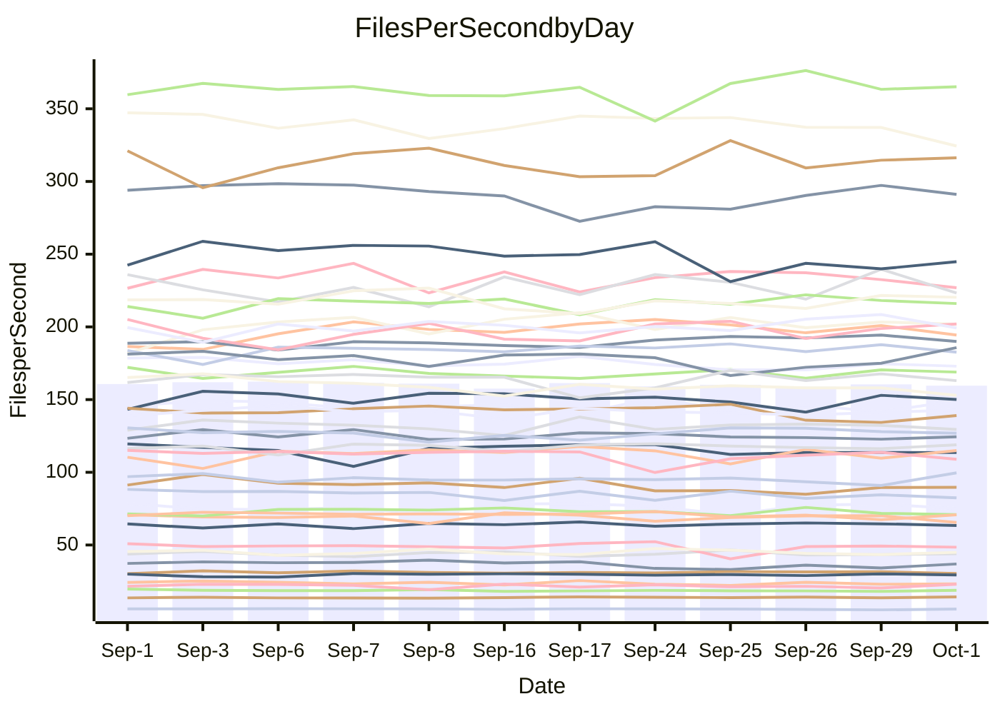

<!---
# This file is auto-generated. Do not edit.
# cspell:disable
--->
# Performance Report

## Daily Performance

```mermaid
xychart-beta
    title Files Per Second by Day
    y-axis Files per Second
    x-axis Date [Sep-1, Sep-3, Sep-6, Sep-7, Sep-8, Sep-16, Sep-17, Sep-24, Sep-25, Sep-26, Sep-29, Oct-1]
    bar [160.72, 161.93, 162.34, 161.56, 160.97, 157.55, 161.35, 159.12, 160.20, 158.85, 160.46, 159.55]
    line [37.33, 38.42, 37.82, 37.98, 39.62, 37.64, 38.51, 33.90, 33.12, 36.15, 34.22, 36.96]
    line [24.27, 25.24, 24.42, 23.30, 24.35, 22.54, 25.54, 23.00, 22.21, 24.38, 23.05, 23.25]
    line [43.81, 45.60, 43.01, 41.97, 44.80, 45.26, 42.13, 43.68, 46.57, 43.13, 43.45, 44.02]
    line [19.71, 18.88, 18.65, 18.65, 19.33, 18.07, 18.42, 18.78, 18.52, 18.42, 18.07, 18.80]
    line [30.26, 32.20, 30.88, 32.09, 31.08, 30.60, 31.19, 30.72, 31.67, 31.52, 31.59, 30.45]
    line [6.06, 6.09, 6.20, 6.14, 6.11, 5.78, 6.14, 6.07, 5.98, 5.68, 5.41, 5.96]
    line [50.89, 48.97, 49.35, 49.58, 48.85, 47.97, 51.02, 52.29, 40.48, 48.89, 49.28, 48.49]
    line [64.49, 61.65, 64.50, 61.26, 64.86, 63.96, 65.83, 62.91, 64.44, 65.18, 64.56, 63.43]
    line [45.45, 46.41, 42.91, 44.10, 47.18, 43.88, 43.41, 47.56, 46.43, 44.28, 43.43, 44.93]
    line [78.69, 74.68, 74.33, 75.84, 70.78, 78.20, 78.52, 76.56, 70.74, 77.36, 78.18, 75.05]
    line [123.39, 129.29, 124.27, 129.39, 122.55, 122.88, 127.08, 126.63, 124.32, 123.86, 122.76, 124.46]
    line [70.89, 69.29, 68.94, 69.89, 64.77, 72.12, 70.50, 66.34, 68.88, 70.01, 70.14, 65.47]
    line [128.97, 135.94, 133.80, 132.37, 129.87, 125.28, 138.07, 129.51, 132.51, 133.16, 132.31, 129.41]
    line [71.42, 69.97, 74.43, 74.58, 74.02, 75.50, 72.83, 73.03, 70.23, 75.87, 71.80, 70.86]
    line [91.22, 98.55, 92.55, 91.52, 92.79, 89.51, 95.95, 87.21, 87.42, 84.85, 89.53, 89.72]
    line [96.99, 99.11, 93.19, 96.28, 94.70, 94.66, 95.59, 94.92, 96.04, 93.49, 90.93, 99.59]
    line [226.56, 239.54, 233.61, 243.66, 223.35, 237.82, 223.98, 233.86, 238.09, 237.21, 232.50, 226.89]
    line [119.50, 117.17, 114.93, 104.04, 116.42, 117.89, 118.96, 119.04, 112.27, 113.64, 113.59, 113.56]
    line [347.17, 346.14, 336.60, 342.41, 329.55, 336.36, 345.01, 343.35, 343.97, 337.30, 337.13, 324.39]
    line [145.28, 149.46, 148.18, 143.83, 145.01, 146.41, 140.36, 151.00, 142.17, 146.26, 141.54, 149.27]
    line [293.90, 297.13, 298.52, 297.48, 293.09, 290.03, 272.63, 282.67, 280.96, 290.36, 297.31, 291.10]
    line [186.50, 184.53, 195.23, 203.47, 198.25, 196.22, 201.98, 205.02, 201.39, 195.94, 200.94, 194.39]
    line [235.92, 225.53, 217.15, 227.16, 213.82, 234.37, 222.15, 235.99, 230.67, 219.04, 239.66, 223.34]
    line [172.14, 164.57, 168.71, 172.84, 167.97, 166.22, 164.57, 167.61, 170.71, 164.68, 170.44, 168.91]
    line [13.64, 14.09, 13.63, 13.57, 13.40, 13.81, 14.35, 14.04, 13.83, 14.23, 13.74, 14.28]
    line [130.51, 127.29, 128.13, 127.03, 120.72, 125.41, 122.07, 126.43, 130.53, 130.33, 127.99, 126.89]
    line [21.60, 23.03, 22.85, 22.27, 19.18, 23.11, 21.10, 22.62, 21.27, 21.60, 20.47, 23.03]
    line [29.95, 28.16, 27.92, 30.43, 29.89, 30.21, 29.92, 29.23, 29.70, 28.98, 30.17, 29.37]
    line [181.85, 198.01, 203.39, 206.55, 195.11, 205.27, 209.68, 198.18, 206.47, 199.39, 203.39, 201.89]
    line [178.56, 179.08, 174.59, 177.44, 173.15, 174.36, 179.74, 174.18, 170.43, 170.45, 174.63, 172.96]
    line [188.75, 189.86, 184.03, 189.81, 189.01, 187.14, 185.91, 190.99, 193.37, 192.37, 194.39, 189.98]
    line [110.36, 102.65, 114.46, 112.83, 115.47, 113.56, 117.79, 114.76, 105.80, 115.76, 109.67, 114.95]
    line [116.38, 118.04, 111.85, 119.40, 118.51, 114.20, 118.71, 119.64, 118.05, 116.99, 116.24, 118.91]
    line [214.04, 205.97, 219.44, 217.73, 216.08, 219.15, 208.36, 218.68, 215.66, 222.06, 218.14, 216.05]
    line [321.08, 295.70, 309.43, 319.09, 322.91, 311.02, 303.26, 304.00, 328.11, 309.34, 314.63, 316.25]
    line [183.77, 174.20, 186.05, 185.31, 184.47, 182.86, 186.84, 185.48, 188.32, 183.01, 187.77, 182.60]
    line [205.14, 192.22, 184.22, 194.88, 202.40, 191.56, 190.37, 202.02, 203.87, 192.01, 198.88, 202.01]
    line [143.28, 155.69, 153.87, 147.46, 154.39, 153.96, 150.40, 151.64, 148.32, 141.41, 152.96, 150.04]
    line [218.57, 218.78, 215.63, 224.82, 226.65, 212.42, 209.15, 217.97, 216.10, 212.71, 221.60, 220.35]
    line [199.53, 189.39, 201.97, 197.12, 203.70, 201.07, 195.90, 200.29, 197.49, 205.32, 208.45, 199.33]
    line [181.23, 183.21, 177.43, 180.28, 172.77, 180.61, 181.38, 178.77, 166.50, 172.24, 175.00, 185.76]
    line [70.19, 72.55, 71.94, 71.15, 71.34, 71.01, 71.23, 73.00, 69.32, 70.55, 67.39, 70.77]
    line [161.76, 167.23, 165.73, 167.27, 165.39, 165.37, 151.18, 158.06, 170.07, 163.11, 167.69, 163.02]
    line [359.68, 367.46, 363.32, 365.30, 359.11, 358.89, 364.75, 341.57, 367.34, 376.26, 363.37, 365.17]
    line [144.08, 140.79, 141.02, 143.66, 145.59, 142.94, 143.60, 144.39, 146.81, 135.80, 134.31, 139.07]
    line [88.27, 86.74, 86.90, 85.78, 86.18, 80.59, 86.98, 80.71, 87.03, 82.08, 84.54, 82.46]
    line [115.12, 112.97, 114.35, 112.51, 113.70, 114.44, 114.03, 99.84, 109.30, 111.81, 113.74, 108.96]
    line [242.44, 258.87, 252.44, 256.07, 255.58, 248.63, 249.79, 258.60, 231.14, 243.74, 239.90, 244.85]
    line [165.15, 167.75, 162.42, 161.26, 158.45, 152.45, 160.47, 157.19, 159.48, 158.08, 158.04, 152.93]
    line [138.76, 142.53, 146.03, 141.67, 142.57, 136.52, 144.05, 141.65, 140.89, 139.38, 141.22, 142.80]
```

## Time to Process Files

| Repository                                      | Elapsed | Min/Avg/Max           |   SD | SD Graph                |
| ----------------------------------------------- | ------: | :-------------------: | ---: | ----------------------- |
| AdaDoom3/AdaDoom3                    |    3.35 | 3.4 /   3.5 /   4.5   | 0.26 | `    ┣━━┻●━╋━━┻━━┫    ` |
| alexiosc/megistos                    |    7.90 | 7.5 /   8.0 /   8.6   | 0.26 | `    ┣━━┻━●╋━━┻━━┫    ` |
| apollographql/apollo-server          |    2.75 | 2.6 /   2.8 /   3.0   | 0.13 | `    ┣━━┻━●╋━━┻━━┫    ` |
| aspnetboilerplate/aspnetboilerplate  |   10.73 | 10.2 /  10.5 /  11.1  | 0.23 | `    ┣━━┻━━╋━━●━━┫    ` |
| aws-amplify/docs                     |   12.94 | 12.5 /  13.2 /  14.2  | 0.45 | `    ┣━━┻●━╋━━┻━━┫    ` |
| Azure/azure-rest-api-specs           |   10.18 | 9.4 /   9.8 /  10.6   | 0.31 | `    ┣━━┻━━╋━━●━━┫    ` |
| bitjson/typescript-starter           |    1.09 | 1.0 /   1.1 /   1.1   | 0.03 | `     ┣━━┻━╋●┻━━┫     ` |
| caddyserver/caddy                    |    3.81 | 3.6 /   3.8 /   4.0   | 0.13 | `    ┣━━┻━━╋●━┻━━┫    ` |
| canada-ca/open-source-logiciel-libre |    1.16 | 1.1 /   1.2 /   1.3   | 0.06 | `     ┣━┻━●╋━━┻━┫     ` |
| chef/chef                            |    5.92 | 5.8 /   6.0 /   6.4   | 0.15 | `    ┣━━┻●━╋━━┻━━┫    ` |
| dart-lang/sdk                        |   66.42 | 64.5 /  67.6 /  73.2  | 2.24 | `  ┣━━━┻━●━╋━━━┻━━━┫  ` |
| django/django                        |   17.17 | 15.0 /  15.5 /  16.4  | 0.36 | `     ┣━━┻━╋━┻━━┫    ●` |
| eslint/eslint                        |   10.82 | 10.8 /  11.1 /  11.8  | 0.27 | `    ┣━━●━━╋━━┻━━┫    ` |
| exonum/exonum                        |    3.60 | 3.6 /   3.7 /   4.1   | 0.13 | `    ┣━━●━━╋━━┻━━┫    ` |
| flutter/samples                      |   18.08 | 16.3 /  16.9 /  18.6  | 0.53 | `    ┣━━┻━━╋━━┻━━┫●   ` |
| gitbucket/gitbucket                  |    3.69 | 3.5 /   3.6 /   4.0   | 0.16 | `    ┣━━┻━━╋●━┻━━┫    ` |
| googleapis/google-cloud-cpp          |  143.32 | 139.0 / 146.7 / 163.3 | 5.12 | `  ┣━━━┻●━━╋━━━┻━━━┫  ` |
| graphql/express-graphql              |    1.12 | 1.1 /   1.2 /   1.4   | 0.06 | `     ┣━●━━╋━━┻━┫     ` |
| graphql/graphql-js                   |    2.94 | 2.7 /   2.9 /   3.1   | 0.09 | `     ┣━┻━━╋●━┻━┫     ` |
| graphql/graphql-relay-js             |    1.16 | 1.1 /   1.2 /   1.3   | 0.06 | `     ┣━┻━●╋━━┻━┫     ` |
| graphql/graphql-spec                 |    1.32 | 1.3 /   1.3 /   1.4   | 0.04 | `     ┣━┻━●╋━━┻━┫     ` |
| iluwatar/java-design-patterns        |   13.69 | 12.8 /  13.3 /  14.9  | 0.51 | `    ┣━━┻━━╋━━●━━┫    ` |
| ktaranov/sqlserver-kit               |    7.01 | 6.6 /   6.9 /   7.3   | 0.17 | `    ┣━━┻━━╋━●┻━━┫    ` |
| liriliri/licia                       |    4.44 | 4.1 /   4.3 /   4.4   | 0.10 | `    ┣━━┻━━╋━━┻━━●    ` |
| MartinThoma/LaTeX-examples           |    6.83 | 6.9 /   7.2 /   7.8   | 0.26 | `    ┣●━┻━━╋━━┻━━┫    ` |
| mdx-js/mdx                           |    2.03 | 1.9 /   2.1 /   2.3   | 0.09 | `     ┣━┻━●╋━━┻━┫     ` |
| microsoft/TypeScript-Website         |    5.82 | 5.5 /   5.8 /   6.5   | 0.22 | `    ┣━━┻━━●━━┻━━┫    ` |
| MicrosoftDocs/PowerShell-Docs        |   23.89 | 23.3 /  24.3 /  27.2  | 1.09 | `   ┣━━━┻━●╋━━┻━━━┫   ` |
| neovim/nvim-lspconfig                |    4.44 | 4.2 /   4.3 /   4.5   | 0.09 | `    ┣━━┻━━╋━━●━━┫    ` |
| pagekit/pagekit                      |    3.63 | 3.5 /   3.7 /   4.1   | 0.12 | `    ┣━━┻━●╋━━┻━━┫    ` |
| php/php-src                          |   27.43 | 25.7 /  27.1 /  29.3  | 1.07 | `   ┣━━━┻━━╋●━┻━━━┫   ` |
| plasticrake/tplink-smarthome-api     |    1.35 | 1.3 /   1.4 /   1.6   | 0.07 | `     ┣━┻●━╋━━┻━┫     ` |
| prettier/prettier                    |    7.15 | 7.0 /   7.4 /   7.9   | 0.27 | `    ┣━━●━━╋━━┻━━┫    ` |
| pycontribs/jira                      |    1.62 | 1.5 /   1.6 /   2.0   | 0.10 | `     ┣━┻━━●━━┻━┫     ` |
| RustPython/RustPython                |    5.33 | 5.2 /   5.4 /   5.7   | 0.13 | `    ┣━━┻●━╋━━┻━━┫    ` |
| shoelace-style/shoelace              |    2.97 | 2.9 /   3.0 /   3.1   | 0.07 | `     ┣━┻━●╋━━┻━┫     ` |
| slint-ui/slint                       |   13.42 | 12.2 /  12.9 /  14.4  | 0.59 | `    ┣━━┻━━╋━━●━━┫    ` |
| SoftwareBrothers/admin-bro           |    2.58 | 2.5 /   2.6 /   2.7   | 0.06 | `     ┣━┻●━╋━━┻━┫     ` |
| sveltejs/svelte                      |   21.30 | 20.8 /  21.7 /  23.2  | 0.50 | `   ┣━━━┻●━╋━━┻━━━┫   ` |
| TheAlgorithms/Python                 |    5.87 | 5.7 /   6.0 /   6.6   | 0.23 | `    ┣━━┻●━╋━━┻━━┫    ` |
| twbs/bootstrap                       |    1.82 | 1.8 /   1.9 /   2.0   | 0.05 | `     ┣━┻●━╋━━┻━┫     ` |
| typescript-cheatsheets/react         |    1.44 | 1.3 /   1.4 /   1.6   | 0.07 | `     ┣━┻━━●━━┻━┫     ` |
| typescript-eslint/typescript-eslint  |    4.27 | 4.3 /   4.4 /   4.7   | 0.13 | `    ┣━━●━━╋━━┻━━┫    ` |
| vitest-dev/vitest                    |   10.48 | 9.2 /   9.8 /  12.0   | 0.71 | `    ┣━━┻━━╋━━●━━┫    ` |
| w3c/aria-practices                   |    3.45 | 3.4 /   3.5 /   3.8   | 0.09 | `    ┣━━┻●━╋━━┻━━┫    ` |
| w3c/specberus                        |    1.96 | 2.0 /   2.1 /   2.2   | 0.05 | `   ● ┣━┻━━╋━━┻━┫     ` |
| webdeveric/webpack-assets-manifest   |    1.19 | 1.2 /   1.2 /   1.3   | 0.04 | `     ┣━●━━╋━━┻━┫     ` |
| webpack/webpack                      |    5.44 | 5.3 /   5.7 /   6.1   | 0.20 | `    ┣━●┻━━╋━━┻━━┫    ` |
| wireapp/wire-desktop                 |    1.43 | 1.3 /   1.4 /   1.4   | 0.03 | `     ┣━┻━━╋━━┻●┫     ` |
| wireapp/wire-webapp                  |   11.01 | 10.8 /  11.2 /  12.1  | 0.34 | `    ┣━━┻●━╋━━┻━━┫    ` |

Note:
- Elapsed time is in seconds.

## Files per Second over Time

| Repository                                      | Files |    Sec |    Fps |    Rel | Trend Fps             |    N |
| ----------------------------------------------- | ----: | -----: | -----: | -----: | --------------------- | ---: |
| AdaDoom3/AdaDoom3                    |   103 |   3.35 |  30.78 |  5.05% | `█▆█▂███▇██▇▇▇▆██▆▇█` |   18 |
| alexiosc/megistos                    |   583 |   7.90 |  73.83 |  0.89% | `▅▅▇▆▇▇▇▇█▆▆▆▅█▇▆▅▄▆` |   18 |
| apollographql/apollo-server          |   252 |   2.75 |  91.51 |  1.07% | `▆█▆▆▆▄▇▆▅▆▇▄▅▄▃▅▆▄▆` |   18 |
| aspnetboilerplate/aspnetboilerplate  |  2286 |  10.73 | 213.12 | -1.84% | `▆▅▇▇█▇▇▆▆█▅▇▆▇█▇▇▆▆` |   18 |
| aws-amplify/docs                     |  2871 |  12.94 | 221.87 |  2.02% | `▆▆▇▄▇▇██▅▆▅▆▆▆▄▇▅█▇` |   18 |
| Azure/azure-rest-api-specs           |  2442 |  10.18 | 239.81 | -3.76% | `▆█▇▇▇████▆▇█▄▅▆▅▇▆▅` |   18 |
| bitjson/typescript-starter           |    20 |   1.09 |  18.41 | -1.32% | `█▆▆▆▆▆▆▇▄▆▆▆▆▆▅▅▆▇▅` |   18 |
| caddyserver/caddy                    |   286 |   3.81 |  75.02 | -1.00% | `█▆▅▆▇▅█▄███▇▄█▇█▇▆▆` |   18 |
| canada-ca/open-source-logiciel-libre |     7 |   1.16 |   6.04 |  1.22% | `▇▇████▇▇█▃█▇▇▄▆▃▇▅▇` |   18 |
| chef/chef                            |  1207 |   5.92 | 203.84 |  1.87% | `▆▄█▇▆▇▄▇▇▆▆▆▆█▇█▅▆▇` |   18 |
| dart-lang/sdk                        | 10563 |  66.42 | 159.04 |  0.19% | `██▇▆█▆▇▆▆▄▇▆▆▆▆▆▆▃▆` |   18 |
| django/django                        |  2876 |  17.17 | 167.50 | -9.50% | `▆▄▆▇██▆▇▆▆▇▇▇▅▇▇██▃` |   18 |
| eslint/eslint                        |  2093 |  10.82 | 193.41 |  2.41% | `▇▇▄▆▇▇▇▇▆▇▆▇██▇██▅█` |   18 |
| exonum/exonum                        |   421 |   3.60 | 116.88 |  3.53% | `▆▄▇▇▇▇▆▇▇▆█▇▄█▇▆▆██` |   18 |
| flutter/samples                      |  2400 |  18.08 | 132.72 | -6.39% | `▇▇▆█▆▇██▇▇▇██▄▇▅▇▇▅` |   18 |
| gitbucket/gitbucket                  |   413 |   3.69 | 111.90 | -2.30% | `█▇█▅█▄▄▇█▇██▆▇▆▆▇▆▆` |   18 |
| googleapis/google-cloud-cpp          | 20771 | 143.32 | 144.93 |  2.37% | `▆▇█▆█▇▆▇▃▇▇▆▆▆▆▆▆▇▇` |   18 |
| graphql/express-graphql              |    26 |   1.12 |  23.25 |  5.23% | `▆▇▇▇▇▆▇▃▆█▅▇▅▅▆▄▇▇▇` |   18 |
| graphql/graphql-js                   |   364 |   2.94 | 123.70 | -1.07% | `▆▇▄▆▇█▆▅▅▆▇▆▆▅▇▅▆▆▆` |   18 |
| graphql/graphql-relay-js             |    28 |   1.16 |  24.06 |  1.41% | `▇█▇▆█▆▅▇▃▆█▅▄▇▆▅▆▄▆` |   18 |
| graphql/graphql-spec                 |    19 |   1.32 |  14.36 |  3.52% | `▆▇▄▇▇▆▆▅█▅█▇▇██▆███` |   18 |
| iluwatar/java-design-patterns        |  1992 |  13.69 | 145.53 | -3.29% | `▅█▇██▅▇███▇▇▇▇▃█▇▇▆` |   18 |
| ktaranov/sqlserver-kit               |   489 |   7.01 |  69.77 | -1.79% | `▆▇▆▇██▅▇▆▇▇█▅▅▇▄▇▆▆` |   18 |
| liriliri/licia                       |  1437 |   4.44 | 323.34 | -4.34% | `██▇▇▆▇█▆▅████▇▆▇▅▅▅` |   18 |
| MartinThoma/LaTeX-examples           |  1409 |   6.83 | 206.33 |  5.99% | `█▆▄▄▅▆▆▇▆▅▅▇█▆▅▇▆██` |   18 |
| mdx-js/mdx                           |   141 |   2.03 |  69.33 |  0.73% | `▇▆▆▆▆▆▇▅▆█▇▅▆▇▆▇▃▅▆` |   18 |
| microsoft/TypeScript-Website         |   761 |   5.82 | 130.72 | -0.63% | `▆██▇▇▇▇▆▇▃█▆▇▆█▇▆▆▆` |   18 |
| MicrosoftDocs/PowerShell-Docs        |  2708 |  23.89 | 113.38 |  1.39% | `█▇▇██▇█▇█▇▇▃▆▇▇▇█▃▇` |   18 |
| neovim/nvim-lspconfig                |   761 |   4.44 | 171.57 | -1.81% | `██▇▆█▇█▆▇▇█▇▆▅▆▇▆▇▆` |   18 |
| pagekit/pagekit                      |   741 |   3.63 | 204.02 |  1.25% | `▄▆▇█▇█▇▆█▇█▆█▆▇▇▇▇▇` |   18 |
| php/php-src                          |  2299 |  27.43 |  83.81 | -0.85% | `█▇▇▇█▇▆▇▆▄▇▅▇▆▄▆▄▆▆` |   18 |
| plasticrake/tplink-smarthome-api     |    62 |   1.35 |  45.99 |  3.22% | `▇▇▃▆▆▆▆██▄▅█▇▇▅▅▆▆▇` |   18 |
| prettier/prettier                    |  2334 |   7.15 | 326.64 |  4.64% | `▇▄▆▄█▆██▆▆▅▅█▄█▇▆▆█` |   18 |
| pycontribs/jira                      |    79 |   1.62 |  48.73 | -0.27% | `▇▇▇█▆▆█▆▆▆██▂▆▇▇▆▆▆` |   18 |
| RustPython/RustPython                |   687 |   5.33 | 128.88 |  1.42% | `▇▆▇▇▇▇▆▄▅▆▅▆▇█▆▇▅▇▇` |   18 |
| shoelace-style/shoelace              |   439 |   2.97 | 147.78 |  1.05% | `▆██▆█▇▅▆▇▇▅█▅▆▇▅█▇▇` |   18 |
| slint-ui/slint                       |  2517 |  13.42 | 187.52 |  5.24% | `▇▇▇▆▅▆▇▅▆▇▇▆▄▅▅▆███` |   18 |
| SoftwareBrothers/admin-bro           |   441 |   2.58 | 170.71 |  1.49% | `█▆▇▇▆▇█▆▅▇▆▆▇▅▇▇▆▇▇` |   18 |
| sveltejs/svelte                      |  7932 |  21.30 | 372.38 |  2.53% | `▆▇▇▆▆▆▇▆▆▅▆▄▇█▇▆▆▆▇` |   18 |
| TheAlgorithms/Python                 |  1396 |   5.87 | 237.83 |  1.95% | `▆▇▆█▆██▅▇▇▅▇▇▇▇▆▆▃▇` |   18 |
| twbs/bootstrap                       |   118 |   1.82 |  64.99 |  1.88% | `▇▅▆█▇▇▄▇▆▇█▆▇▇█▇▅▇▇` |   18 |
| typescript-cheatsheets/react         |    53 |   1.44 |  36.81 | -0.55% | `▆▇▇▇▇█▆█▇▆▇▄▃▅▆▄▆▆▆` |   18 |
| typescript-eslint/typescript-eslint  |  1279 |   4.27 | 299.80 |  2.94% | `▇██████▇▆█▄▆▅▅██▆▆█` |   18 |
| vitest-dev/vitest                    |  2221 |  10.48 | 211.89 | -6.39% | `█▇▇▂█▆█▅▇█▆█▇▄███▆▅` |   18 |
| w3c/aria-practices                   |   414 |   3.45 | 119.96 |  2.87% | `▇▇▄▇▅▇█▇▆▆██▇█▆▇▇▇█` |   18 |
| w3c/specberus                        |   198 |   1.96 | 101.23 |  6.58% | `▆▇▅▅▄▆▆▆▆▆▆▆▆▄▆▄▇█`  |   17 |
| webdeveric/webpack-assets-manifest   |    54 |   1.19 |  45.34 |  3.76% | `▆▇▇▅▄▄▄▇▇▇▅▆█▅▅▆▆▅▇` |   18 |
| webpack/webpack                      |  1113 |   5.44 | 204.68 |  4.25% | `▄▄▇▅▆▆█▆▆▆▇▇▇▅▇▇▄▆▇` |   18 |
| wireapp/wire-desktop                 |    43 |   1.43 |  30.11 | -3.39% | `▅▇▆▄▇▆█▆▅▆▆▅▇▆▇▇▅▆▅` |   18 |
| wireapp/wire-webapp                  |  1835 |  11.01 | 166.64 |  1.59% | `▆▇▇▇▇▇█▇▇▇▄▅██▅█▇▅▇` |   18 |

## Data Throughput

| Repository                                      | Files |    Sec |     Kps |    Rel | Trend Kps             |    N |
| ----------------------------------------------- | ----: | -----: | ------: | -----: | --------------------- | ---: |
| AdaDoom3/AdaDoom3                    |   103 |   3.35 |  654.08 |  5.05% | `█▆█▂███▇██▇▇▇▆██▆▇█` |   18 |
| alexiosc/megistos                    |   583 |   7.90 |  580.12 |  0.89% | `▅▅▇▆▇▇▇▇█▆▆▆▅█▇▆▅▄▆` |   18 |
| apollographql/apollo-server          |   252 |   2.75 |  736.07 |  1.07% | `▆█▆▆▆▄▇▆▅▆▇▄▅▄▃▅▆▄▆` |   18 |
| aspnetboilerplate/aspnetboilerplate  |  2286 |  10.73 |  518.53 | -1.84% | `▆▅▇▇█▇▇▆▆█▅▇▆▇█▇▇▆▆` |   18 |
| aws-amplify/docs                     |  2871 |  12.94 |  774.73 |  2.02% | `▆▆▇▄▇▇██▅▆▅▆▆▆▄▇▅█▇` |   18 |
| Azure/azure-rest-api-specs           |  2442 |  10.18 |  633.89 | -3.76% | `▆█▇█▇██▇▇▅▆█▄▅▆▅▆▆▅` |   18 |
| bitjson/typescript-starter           |    20 |   1.09 |   73.66 | -1.32% | `█▆▆▆▆▆▆▇▄▆▆▆▆▆▅▅▆▇▅` |   18 |
| caddyserver/caddy                    |   286 |   3.81 |  641.86 | -0.85% | `█▆▅▆▇▅█▄███▇▄█▇█▇▆▆` |   18 |
| canada-ca/open-source-logiciel-libre |     7 |   1.16 |   50.08 |  1.22% | `▇▇████▇▇█▃█▇▇▄▆▃▇▅▇` |   18 |
| chef/chef                            |  1207 |   5.92 |  940.35 |  1.78% | `▆▄█▇▆▇▄▇▇▇▆▇▆█▇█▅▆▇` |   18 |
| dart-lang/sdk                        | 10563 |  66.42 | 1091.32 |  0.80% | `██▇▆█▆▇▆▆▄▇▆▇▇▆▆▆▄▇` |   18 |
| django/django                        |  2876 |  17.17 | 1049.67 | -9.54% | `▆▄▆▇██▆▇▆▆▇▇▇▅▇▇██▃` |   18 |
| eslint/eslint                        |  2093 |  10.82 | 1393.81 |  2.15% | `▇▇▅▆▇█▇▇▅▇▆▇██▇██▅█` |   18 |
| exonum/exonum                        |   421 |   3.60 | 1118.02 |  3.53% | `▆▄▇▇▇▇▆▇▇▆█▇▄█▇▆▆██` |   18 |
| flutter/samples                      |  2400 |  18.08 | 1184.36 | -6.39% | `▇▇▆█▆▇██▇▇▇██▄▇▅▇▇▅` |   18 |
| gitbucket/gitbucket                  |   413 |   3.69 |  508.83 | -2.26% | `█▇█▅█▄▄▇█▇██▆▇▆▆▇▆▆` |   18 |
| googleapis/google-cloud-cpp          | 20771 | 143.32 | 1175.98 |  2.56% | `▆▇█▆█▇▆▇▃█▇▇▆▆▆▆▆█▇` |   18 |
| graphql/express-graphql              |    26 |   1.12 |  106.39 |  5.23% | `▆▇▇▇▇▆▇▃▆█▅▇▅▅▆▄▇▇▇` |   18 |
| graphql/graphql-js                   |   364 |   2.94 |  710.93 | -1.07% | `▆▇▄▆▇█▆▅▅▆▇▆▆▅▇▅▆▆▆` |   18 |
| graphql/graphql-relay-js             |    28 |   1.16 |   94.52 |  1.41% | `▇█▇▆█▆▅▇▃▆█▅▄▇▆▅▆▄▆` |   18 |
| graphql/graphql-spec                 |    19 |   1.32 |  479.13 |  4.36% | `▆▇▄▇▆▆▅▆█▅█▇▇██▇███` |   18 |
| iluwatar/java-design-patterns        |  1992 |  13.69 |  449.81 | -3.29% | `▅█▇██▅▇███▇▇▇▇▃█▇▇▆` |   18 |
| ktaranov/sqlserver-kit               |   489 |   7.01 | 1056.40 | -1.79% | `▆▇▆▇██▅▇▆▇▇█▅▅▇▄▇▆▆` |   18 |
| liriliri/licia                       |  1437 |   4.44 |  385.21 | -4.34% | `██▇▇▆▇█▆▅████▇▆▇▅▅▅` |   18 |
| MartinThoma/LaTeX-examples           |  1409 |   6.83 |  426.14 |  5.99% | `█▆▄▄▅▆▆▇▆▅▅▇█▆▅▇▆██` |   18 |
| mdx-js/mdx                           |   141 |   2.03 |  322.53 |  0.73% | `▇▆▆▆▆▆▇▅▆█▇▅▆▇▆▇▃▅▆` |   18 |
| microsoft/TypeScript-Website         |   761 |   5.82 |  904.02 | -0.63% | `▆██▇▇▇▇▆▇▃█▆▇▆█▇▆▆▆` |   18 |
| MicrosoftDocs/PowerShell-Docs        |  2708 |  23.89 | 1166.32 |  1.42% | `█▇▇██▇█▇█▇▇▃▆▇▇▇█▃▇` |   18 |
| neovim/nvim-lspconfig                |   761 |   4.44 |  284.75 | -1.31% | `██▇▅▇▇█▆▇▇█▇▆▅▆▇▆█▆` |   18 |
| pagekit/pagekit                      |   741 |   3.63 |  425.38 |  1.25% | `▄▆▇█▇█▇▆█▇█▆█▆▇▇▇▇▇` |   18 |
| php/php-src                          |  2299 |  27.43 | 1455.99 | -0.96% | `█▇▇▇█▇▆▇▆▄▇▅▇▆▄▆▄▆▆` |   18 |
| plasticrake/tplink-smarthome-api     |    62 |   1.35 |  248.47 |  3.22% | `▇▇▃▆▆▆▆██▄▅█▇▇▅▅▆▆▇` |   18 |
| prettier/prettier                    |  2334 |   7.15 |  458.34 |  3.83% | `▇▄▆▄█▆██▆▆▅▅█▄▇▆▆▆█` |   18 |
| pycontribs/jira                      |    79 |   1.62 |  345.42 | -0.27% | `▇▇▇█▆▆█▆▆▆██▂▆▇▇▆▆▆` |   18 |
| RustPython/RustPython                |   687 |   5.33 | 1017.90 |  1.64% | `▇▆▆▆▇▇▆▄▅▆▅▆▇█▆▇▅▇▇` |   18 |
| shoelace-style/shoelace              |   439 |   2.97 |  714.00 |  1.05% | `▆██▆█▇▅▆▇▇▅█▅▆▇▅█▇▇` |   18 |
| slint-ui/slint                       |  2517 |  13.42 | 1154.07 |  0.13% | `███▇▆▇█▆▇██▇▄▆▅▄▆▆▇` |   18 |
| SoftwareBrothers/admin-bro           |   441 |   2.58 |  376.26 |  1.49% | `█▆▇▇▆▇█▆▅▇▆▆▇▅▇▇▆▇▇` |   18 |
| sveltejs/svelte                      |  7932 |  21.30 |  249.05 |  2.51% | `▆▇▇▆▆▆▇▆▆▅▆▄▇█▇▆▆▆▇` |   18 |
| TheAlgorithms/Python                 |  1396 |   5.87 |  604.62 |  2.00% | `▆▇▆█▆██▅▇▇▅▇▇█▇▆▆▃▇` |   18 |
| twbs/bootstrap                       |   118 |   1.82 |  533.18 |  1.88% | `▇▅▆█▇▇▄▇▆▇█▆▇▇█▇▅▇▇` |   18 |
| typescript-cheatsheets/react         |    53 |   1.44 |  272.24 | -0.55% | `▆▇▇▇▇█▆█▇▆▇▄▃▅▆▄▆▆▆` |   18 |
| typescript-eslint/typescript-eslint  |  1279 |   4.27 | 1535.35 |  3.13% | `▇██████▇▆█▄▆▅▆██▆▆█` |   18 |
| vitest-dev/vitest                    |  2221 |  10.48 |  480.17 | -5.68% | `▇▆▇▂█▆█▅▇█▆█▇▄███▆▅` |   18 |
| w3c/aria-practices                   |   414 |   3.45 | 1118.44 |  3.00% | `▇▇▄▇▅▇█▇▆▆▇█▇█▆▇▇██` |   18 |
| w3c/specberus                        |   198 |   1.96 |  318.00 |  6.58% | `▆▇▅▅▄▆▆▆▆▆▆▆▆▄▆▄▇█`  |   17 |
| webdeveric/webpack-assets-manifest   |    54 |   1.19 |  106.63 |  3.76% | `▆▇▇▅▄▄▄▇▇▇▅▆█▅▅▆▆▅▇` |   18 |
| webpack/webpack                      |  1113 |   5.44 |  933.85 |  4.75% | `▄▄▆▅▆▆█▆▆▆▇▇▇▅▆▇▄▆▇` |   18 |
| wireapp/wire-desktop                 |    43 |   1.43 |  139.35 | -0.64% | `▄▆▅▄▆▅▇▅▄▅▅▆█▇█▇▆▇▆` |   18 |
| wireapp/wire-webapp                  |  1835 |  11.01 |  598.90 |  1.95% | `▆▇▇▇▇▇▇▇▇▇▄▅██▅█▇▆▇` |   18 |

