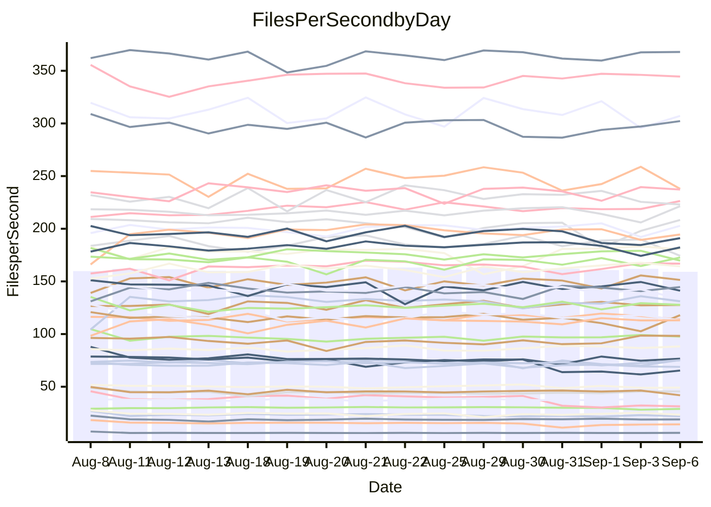

<!---
# This file is auto-generated. Do not edit.
# cspell:disable
--->
# Performance Report

## Daily Performance

```mermaid
xychart-beta
    title Files Per Second by Day
    y-axis Files per Second
    x-axis Date [Aug-8, Aug-11, Aug-12, Aug-13, Aug-18, Aug-19, Aug-20, Aug-21, Aug-22, Aug-25, Aug-29, Aug-30, Aug-31, Sep-1, Sep-3, Sep-6]
    bar [159.78, 161.87, 161.59, 160.12, 160.00, 162.54, 160.82, 162.11, 163.20, 161.31, 162.91, 160.67, 162.16, 160.72, 161.93, 159.14]
    line [22.54, 19.07, 18.54, 16.95, 19.10, 18.27, 18.74, 19.65, 18.80, 18.62, 18.45, 19.29, 19.08, 19.71, 18.88, 18.97]
    line [116.33, 116.04, 112.64, 113.43, 119.19, 111.93, 114.00, 116.17, 114.97, 113.11, 118.41, 118.01, 115.40, 119.50, 117.17, 113.82]
    line [209.23, 208.13, 206.12, 205.21, 210.46, 206.31, 208.96, 205.28, 201.48, 191.68, 200.76, 205.32, 205.73, 181.85, 198.01, 208.37]
    line [29.03, 29.67, 29.60, 30.33, 30.62, 30.06, 30.32, 30.71, 30.33, 30.41, 30.59, 30.45, 30.07, 29.95, 28.16, 28.93]
    line [126.61, 126.72, 128.04, 119.05, 131.02, 129.61, 123.08, 132.18, 124.93, 128.24, 131.60, 124.76, 128.19, 130.51, 127.29, 127.58]
    line [73.53, 74.78, 72.96, 75.57, 72.13, 74.31, 76.20, 74.98, 75.32, 73.98, 74.92, 67.44, 74.93, 71.42, 69.97, 75.42]
    line [211.22, 214.76, 212.79, 213.14, 217.00, 221.94, 220.45, 225.30, 218.11, 225.16, 221.13, 216.69, 219.64, 218.57, 218.78, 226.33]
    line [87.82, 77.70, 75.58, 76.94, 80.70, 76.26, 76.41, 76.73, 75.85, 74.38, 75.85, 75.82, 63.83, 64.49, 61.65, 65.35]
    line [85.77, 84.48, 86.21, 84.78, 87.25, 83.34, 85.16, 86.61, 89.19, 84.30, 84.25, 86.47, 88.91, 88.27, 86.74, 88.27]
    line [319.60, 305.87, 304.71, 313.08, 324.40, 300.37, 304.78, 324.68, 308.60, 296.98, 324.16, 313.60, 308.04, 321.08, 295.70, 307.18]
    line [308.97, 296.59, 300.81, 290.46, 298.69, 294.82, 300.68, 286.71, 300.74, 302.95, 303.29, 287.37, 286.48, 293.90, 297.13, 302.20]
    line [254.83, 253.26, 251.44, 230.32, 252.21, 237.84, 238.36, 257.03, 248.15, 250.39, 258.39, 253.25, 236.21, 242.44, 258.87, 237.91]
    line [183.70, 188.70, 193.07, 183.50, 178.10, 183.95, 192.12, 193.67, 185.05, 182.38, 185.55, 193.26, 183.54, 188.75, 189.86, 174.27]
    line [104.69, 93.74, 97.45, 98.22, 96.65, 95.35, 92.84, 95.49, 96.50, 97.40, 93.72, 97.65, 96.80, 96.99, 99.11, 97.63]
    line [139.04, 152.86, 154.13, 144.07, 152.10, 146.68, 148.87, 153.90, 141.45, 150.06, 146.03, 152.71, 150.80, 143.28, 155.69, 151.42]
    line [104.34, 135.34, 130.97, 132.26, 136.82, 135.16, 130.52, 133.31, 131.34, 132.85, 130.95, 124.42, 129.63, 128.97, 135.94, 131.09]
    line [45.66, 38.22, 37.79, 38.23, 41.09, 41.54, 38.59, 41.99, 40.85, 39.81, 40.28, 41.27, 31.95, 30.26, 32.20, 31.38]
    line [78.66, 78.35, 77.65, 75.86, 77.65, 74.07, 76.09, 68.93, 73.13, 75.35, 74.03, 75.97, 71.20, 78.69, 74.68, 76.60]
    line [182.66, 171.17, 182.41, 178.32, 178.57, 176.08, 180.57, 179.89, 180.99, 176.89, 156.76, 164.43, 180.88, 181.23, 183.21, 180.45]
    line [195.89, 203.57, 199.20, 201.23, 200.81, 196.78, 192.62, 201.64, 203.42, 203.18, 198.91, 200.77, 202.09, 205.14, 192.22, 202.84]
    line [7.47, 6.09, 6.22, 6.12, 6.05, 6.23, 6.09, 6.02, 6.19, 6.02, 6.20, 6.04, 6.23, 6.06, 6.09, 6.15]
    line [18.37, 15.99, 15.64, 15.11, 15.67, 15.78, 15.86, 15.35, 15.70, 15.41, 15.75, 15.00, 11.10, 13.64, 14.09, 14.29]
    line [231.94, 225.75, 230.29, 219.53, 238.65, 216.52, 236.75, 225.24, 241.21, 236.60, 228.23, 232.86, 232.26, 235.92, 225.53, 223.10]
    line [135.23, 122.44, 127.81, 121.17, 124.81, 124.18, 125.47, 127.40, 124.91, 126.98, 128.83, 125.51, 130.73, 123.39, 129.29, 127.79]
    line [120.85, 115.35, 116.69, 115.74, 111.39, 116.78, 113.71, 117.01, 115.75, 116.08, 119.18, 113.59, 115.52, 110.36, 102.65, 117.95]
    line [27.00, 22.24, 23.36, 22.81, 24.23, 23.27, 23.59, 24.08, 23.43, 23.40, 22.23, 21.90, 22.46, 21.60, 23.03, 22.08]
    line [355.56, 335.17, 325.27, 335.20, 340.52, 346.23, 347.14, 347.41, 338.20, 333.97, 334.12, 345.07, 342.66, 347.17, 346.14, 344.54]
    line [151.10, 147.11, 146.86, 146.10, 136.12, 147.29, 144.63, 149.12, 128.33, 145.05, 141.62, 149.48, 142.85, 145.28, 149.46, 141.20]
    line [27.59, 24.33, 24.19, 23.40, 25.07, 24.48, 24.64, 22.11, 24.14, 24.67, 21.16, 23.95, 23.30, 24.27, 25.24, 23.42]
    line [128.17, 119.97, 117.10, 115.21, 121.90, 112.74, 115.76, 112.80, 115.24, 121.46, 118.37, 119.80, 115.33, 116.38, 118.04, 113.09]
    line [362.02, 369.62, 366.45, 360.63, 368.14, 348.34, 354.65, 368.47, 364.63, 360.14, 369.32, 367.60, 361.65, 359.68, 367.46, 367.88]
    line [166.07, 194.86, 199.17, 196.17, 191.14, 199.41, 198.71, 204.15, 203.44, 198.55, 195.50, 193.96, 199.31, 199.53, 189.39, 194.52]
    line [48.90, 45.53, 44.69, 45.18, 40.85, 44.70, 45.09, 43.47, 44.07, 43.94, 43.35, 43.55, 44.33, 43.81, 45.60, 45.53]
    line [173.47, 171.46, 176.49, 170.50, 172.92, 180.52, 178.78, 177.41, 175.76, 170.70, 175.74, 172.74, 175.87, 178.56, 179.08, 169.75]
    line [96.32, 95.66, 97.25, 93.41, 90.83, 93.92, 83.91, 92.53, 93.93, 91.70, 90.17, 94.03, 90.40, 91.22, 98.55, 98.30]
    line [73.32, 70.77, 69.86, 70.01, 73.04, 72.36, 70.62, 73.83, 67.67, 69.68, 72.12, 68.00, 70.47, 70.89, 69.29, 68.85]
    line [157.48, 162.05, 151.08, 164.19, 163.52, 165.17, 164.35, 169.78, 168.65, 165.26, 166.00, 163.99, 156.90, 161.76, 167.23, 166.86]
    line [202.61, 193.89, 195.05, 196.60, 192.32, 200.16, 188.13, 196.57, 202.87, 192.16, 197.82, 199.85, 197.57, 186.50, 184.53, 191.07]
    line [51.68, 50.89, 50.88, 50.22, 49.59, 50.25, 50.03, 48.40, 49.47, 50.47, 51.15, 52.21, 48.60, 50.89, 48.97, 49.18]
    line [38.18, 37.54, 37.60, 36.71, 36.51, 39.25, 38.04, 36.06, 37.72, 38.63, 38.79, 37.24, 37.32, 37.33, 38.42, 37.98]
    line [131.06, 143.98, 142.41, 148.62, 143.28, 139.37, 140.53, 139.04, 144.69, 138.65, 139.89, 133.31, 145.80, 144.08, 140.79, 144.68]
    line [98.38, 112.00, 114.17, 108.57, 100.66, 108.77, 112.72, 106.20, 114.85, 112.98, 112.47, 111.83, 109.19, 115.12, 112.97, 113.11]
    line [218.55, 218.05, 216.13, 212.80, 213.27, 214.61, 217.28, 213.25, 217.17, 212.77, 217.16, 219.42, 220.41, 214.04, 205.97, 221.44]
    line [181.75, 171.06, 170.80, 168.18, 172.80, 168.69, 156.73, 170.52, 169.10, 161.12, 170.94, 170.42, 165.85, 172.14, 164.57, 172.71]
    line [49.80, 44.85, 44.73, 46.28, 42.85, 47.12, 44.69, 45.57, 45.49, 44.61, 45.50, 46.05, 46.44, 45.45, 46.41, 41.90]
    line [71.64, 71.63, 73.23, 72.55, 71.44, 73.71, 74.27, 72.25, 73.30, 71.82, 72.99, 72.24, 73.05, 70.19, 72.55, 75.17]
    line [234.59, 230.11, 226.13, 243.15, 239.31, 234.89, 241.23, 236.06, 238.56, 223.75, 237.91, 239.06, 235.45, 226.56, 239.54, 237.22]
    line [178.30, 186.48, 183.29, 179.27, 181.07, 184.49, 180.99, 187.99, 183.89, 182.41, 184.77, 186.94, 187.25, 183.77, 174.20, 182.27]
    line [152.64, 157.58, 166.90, 158.63, 158.95, 166.31, 162.23, 164.91, 160.87, 154.07, 164.02, 158.84, 162.35, 165.15, 167.75, 164.28]
    line [146.35, 145.37, 140.27, 142.62, 139.83, 147.55, 141.21, 140.96, 145.89, 146.30, 146.55, 142.25, 144.70, 138.76, 142.53, 133.23]
```

## Time to Process Files

| Repository                                      | Elapsed | Min/Avg/Max           |   SD | SD Graph                |
| ----------------------------------------------- | ------: | :-------------------: | ---: | ----------------------- |
| AdaDoom3/AdaDoom3                    |    3.56 | 3.3 /   3.4 /   3.7   | 0.08 | `    ┣━━┻━━╋━━┻●━┫    ` |
| alexiosc/megistos                    |    7.73 | 7.5 /   8.0 /   9.4   | 0.43 | `    ┣━━┻●━╋━━┻━━┫    ` |
| apollographql/apollo-server          |    2.56 | 2.6 /   2.7 /   3.3   | 0.15 | `    ┣━━●━━╋━━┻━━┫    ` |
| aspnetboilerplate/aspnetboilerplate  |   10.32 | 10.2 /  10.6 /  11.2  | 0.25 | `    ┣━━●━━╋━━┻━━┫    ` |
| aws-amplify/docs                     |   12.69 | 12.5 /  13.2 /  14.1  | 0.35 | `    ┣━●┻━━╋━━┻━━┫    ` |
| Azure/azure-rest-api-specs           |   10.25 | 9.4 /   9.9 /  11.3   | 0.45 | `    ┣━━┻━━╋━●┻━━┫    ` |
| bitjson/typescript-starter           |    1.05 | 0.9 /   1.1 /   1.3   | 0.06 | `     ┣━┻━━●━━┻━┫     ` |
| caddyserver/caddy                    |    3.72 | 3.6 /   3.8 /   4.3   | 0.17 | `    ┣━━┻━●╋━━┻━━┫    ` |
| canada-ca/open-source-logiciel-libre |    1.14 | 0.9 /   1.1 /   1.2   | 0.04 | `     ┣━┻━━●━━┻━┫     ` |
| chef/chef                            |    6.21 | 5.8 /   6.2 /   7.3   | 0.27 | `    ┣━━┻━━╋●━┻━━┫    ` |
| dart-lang/sdk                        |   65.84 | 63.3 /  66.9 /  70.7  | 1.99 | `  ┣━━━┻━●━╋━━━┻━━━┫  ` |
| django/django                        |   15.68 | 14.8 /  15.5 /  16.4  | 0.37 | `    ┣━━┻━━╋●━┻━━┫    ` |
| eslint/eslint                        |   11.99 | 10.6 /  11.1 /  12.1  | 0.41 | `    ┣━━┻━━╋━━┻━━┫●   ` |
| exonum/exonum                        |    3.57 | 3.5 /   3.7 /   4.1   | 0.14 | `    ┣━━┻●━╋━━┻━━┫    ` |
| flutter/samples                      |   16.59 | 16.3 /  17.2 /  19.7  | 0.69 | `   ┣━━━●━━╋━━┻━━━┫   ` |
| gitbucket/gitbucket                  |    3.63 | 3.4 /   3.6 /   3.9   | 0.12 | `    ┣━━┻━━╋●━┻━━┫    ` |
| googleapis/google-cloud-cpp          |  155.57 | 136.7 / 143.9 / 155.3 | 4.83 | `  ┣━━━┻━━━╋━━━┻━━━┫ ●` |
| graphql/express-graphql              |    1.18 | 1.0 /   1.1 /   1.3   | 0.05 | `     ┣━┻━━╋━●┻━┫     ` |
| graphql/graphql-js                   |    2.85 | 2.7 /   2.9 /   3.2   | 0.09 | `    ┣━━┻━●╋━━┻━━┫    ` |
| graphql/graphql-relay-js             |    1.20 | 1.0 /   1.2 /   1.3   | 0.06 | `     ┣━┻━━╋●━┻━┫     ` |
| graphql/graphql-spec                 |    1.26 | 0.9 /   1.1 /   1.5   | 0.14 | `     ┣━┻━━╋━━┻●┫     ` |
| iluwatar/java-design-patterns        |   13.16 | 12.6 /  13.4 /  15.2  | 0.54 | `    ┣━━┻━●╋━━┻━━┫    ` |
| ktaranov/sqlserver-kit               |    6.50 | 6.5 /   6.7 /   7.0   | 0.15 | `    ┣●━┻━━╋━━┻━━┫    ` |
| liriliri/licia                       |    4.17 | 4.0 /   4.2 /   4.6   | 0.11 | `    ┣━━┻●━╋━━┻━━┫    ` |
| MartinThoma/LaTeX-examples           |    6.95 | 6.7 /   7.0 /   7.5   | 0.18 | `    ┣━━┻●━╋━━┻━━┫    ` |
| mdx-js/mdx                           |    2.05 | 1.9 /   2.0 /   2.2   | 0.07 | `     ┣━┻━━╋━●┻━┫     ` |
| microsoft/TypeScript-Website         |    5.81 | 5.5 /   5.8 /   7.3   | 0.37 | `    ┣━━┻━━●━━┻━━┫    ` |
| MicrosoftDocs/PowerShell-Docs        |   23.94 | 23.2 /  24.5 /  27.5  | 0.99 | `   ┣━━━┻●━╋━━┻━━━┫   ` |
| neovim/nvim-lspconfig                |    4.46 | 4.1 /   4.3 /   4.5   | 0.11 | `    ┣━━┻━━╋━━┻●━┫    ` |
| pagekit/pagekit                      |    3.56 | 3.5 /   3.6 /   4.1   | 0.14 | `    ┣━━┻●━╋━━┻━━┫    ` |
| php/php-src                          |   25.84 | 25.3 /  26.5 /  28.9  | 0.81 | `   ┣━━━●━━╋━━┻━━━┫   ` |
| plasticrake/tplink-smarthome-api     |    1.48 | 1.2 /   1.4 /   1.4   | 0.04 | `     ┣━┻━━╋━━┻━┫  ●  ` |
| prettier/prettier                    |    7.44 | 7.0 /   7.4 /   8.1   | 0.25 | `    ┣━━┻━━●━━┻━━┫    ` |
| pycontribs/jira                      |    1.61 | 1.5 /   1.6 /   1.7   | 0.05 | `     ┣━┻━━╋━●┻━┫     ` |
| RustPython/RustPython                |    5.36 | 5.1 /   5.4 /   5.8   | 0.19 | `    ┣━━┻━━●━━┻━━┫    ` |
| shoelace-style/shoelace              |    3.11 | 2.9 /   3.0 /   3.7   | 0.16 | `    ┣━━┻━━╋●━┻━━┫    ` |
| slint-ui/slint                       |   12.43 | 12.0 /  12.7 /  15.5  | 0.82 | `   ┣━━━┻━●╋━━┻━━━┫   ` |
| SoftwareBrothers/admin-bro           |    2.55 | 2.4 /   2.6 /   3.0   | 0.11 | `    ┣━━┻●━╋━━┻━━┫    ` |
| sveltejs/svelte                      |   21.28 | 20.2 /  21.5 /  23.0  | 0.51 | `   ┣━━━┻━●╋━━┻━━━┫   ` |
| TheAlgorithms/Python                 |    5.88 | 5.6 /   5.9 /   6.9   | 0.32 | `    ┣━━┻━●╋━━┻━━┫    ` |
| twbs/bootstrap                       |    1.81 | 1.3 /   1.6 /   1.9   | 0.14 | `     ┣━┻━━╋━━┻●┫     ` |
| typescript-cheatsheets/react         |    1.40 | 1.3 /   1.4 /   1.5   | 0.04 | `     ┣━┻━●╋━━┻━┫     ` |
| typescript-eslint/typescript-eslint  |    4.23 | 4.1 /   4.3 /   4.7   | 0.13 | `    ┣━━┻●━╋━━┻━━┫    ` |
| vitest-dev/vitest                    |    9.89 | 9.1 /   9.5 /  11.1   | 0.41 | `    ┣━━┻━━╋━━●━━┫    ` |
| w3c/aria-practices                   |    3.62 | 3.2 /   3.5 /   3.8   | 0.11 | `    ┣━━┻━━╋━━●━━┫    ` |
| w3c/specberus                        |    2.03 | 1.9 /   2.1 /   2.2   | 0.07 | `     ┣━┻●━╋━━┻━┫     ` |
| webdeveric/webpack-assets-manifest   |    1.19 | 1.1 /   1.2 /   1.3   | 0.04 | `     ┣━┻●━╋━━┻━┫     ` |
| webpack/webpack                      |    5.85 | 5.4 /   5.7 /   6.2   | 0.19 | `    ┣━━┻━━╋━●┻━━┫    ` |
| wireapp/wire-desktop                 |    1.37 | 0.9 /   1.1 /   1.4   | 0.12 | `     ┣━┻━━╋━━┻━●     ` |
| wireapp/wire-webapp                  |   10.98 | 10.8 /  11.3 /  13.3  | 0.53 | `    ┣━━┻●━╋━━┻━━┫    ` |

Note:
- Elapsed time is in seconds.

## Files per Second over Time

| Repository                                      | Files |    Sec |    Fps |     Rel | Trend Fps              |    N |
| ----------------------------------------------- | ----: | -----: | -----: | ------: | ---------------------- | ---: |
| AdaDoom3/AdaDoom3                    |   103 |   3.56 |  28.93 |  -3.72% | `▇█▇▇▇▇█▇▇█▇██▇█▇▇▇▄▅` |   27 |
| alexiosc/megistos                    |   583 |   7.73 |  75.42 |   2.68% | `█▆▇▇██▇▇█▆█▇█▃▃▇█▆▆█` |   27 |
| apollographql/apollo-server          |   252 |   2.56 |  98.30 |   5.53% | `▆▆▇▇▂▆▇▇▇▆▇▆█▅█▆▆▆██` |   27 |
| aspnetboilerplate/aspnetboilerplate  |  2286 |  10.32 | 221.44 |   2.50% | `▄▆▇▆▆█▆▆▇▇▅▇▇▇█▇█▆▅█` |   27 |
| aws-amplify/docs                     |  2871 |  12.69 | 226.33 |   3.90% | `▅▆▇▇▇▆▇▆▆▇▇▇▆▅▇▅█▆▆█` |   27 |
| Azure/azure-rest-api-specs           |  2438 |  10.25 | 237.91 |  -3.84% | `▃▇█▄▆▅█▆▇▇▇█▇█▇▆▅▆█▆` |   27 |
| bitjson/typescript-starter           |    20 |   1.05 |  18.97 |   0.41% | `▃▇▅▇▆██▇▇▇▆▆██▇▇▇█▇▇` |   27 |
| caddyserver/caddy                    |   285 |   3.72 |  76.60 |   1.38% | `▇█▄█▇▇▄▅▆█▅▆█▆▆▇▃█▆▇` |   27 |
| canada-ca/open-source-logiciel-libre |     7 |   1.14 |   6.15 |  -0.35% | `▇▆▇█▇▆▆▇▇▆▆▇▆▆▆█▇▆▆▇` |   27 |
| chef/chef                            |  1208 |   6.21 | 194.52 |  -0.92% | `▇▆▇█▇▇█▇█▆█▇▇▇▅▇█▇▆▆` |   27 |
| dart-lang/sdk                        | 10816 |  65.84 | 164.28 |   1.92% | `▅▆█▇▆▇▇▆▇▅▄▇▇▄▆▇▆▇█▇` |   27 |
| django/django                        |  2858 |  15.68 | 182.27 |  -0.72% | `▄▆▅█▆▆▇▇▆▆▇▇▇▇█▇▇▆▄▆` |   27 |
| eslint/eslint                        |  2090 |  11.99 | 174.27 |  -7.11% | `▅▅▄██▇█▆▆▇▄▆▇▇█▄▇▇▇▄` |   27 |
| exonum/exonum                        |   421 |   3.57 | 117.95 |   2.55% | `█▆█▇▆▇█▇▇▇██▇▅▇▇█▆▃█` |   27 |
| flutter/samples                      |  2400 |  16.59 | 144.68 |   2.46% | `█▇▆▆▆▇▆▇█▆▆▆▆▃▆█▇▇▇▇` |   27 |
| gitbucket/gitbucket                  |   413 |   3.63 | 113.82 |  -1.26% | `▅█▅▆█▅▇█▆▄██▇█▇▇▇█▇▆` |   27 |
| googleapis/google-cloud-cpp          | 20726 | 155.57 | 133.23 |  -7.17% | `▇▅█▇▄█▆▆█▇▇▇▇▅▆▇▇▅▆▄` |   27 |
| graphql/express-graphql              |    26 |   1.18 |  22.08 |  -4.22% | `▆█▆▇▇██▇▇▇▇▅▆▃▅▅▆▅▇▅` |   27 |
| graphql/graphql-js                   |   364 |   2.85 | 127.79 |   1.39% | `▃▆▆▆▆▆▆▆▆▆▇▇▆▆▇█▆▅▇▇` |   27 |
| graphql/graphql-relay-js             |    28 |   1.20 |  23.42 |  -3.05% | `▆█▇▇▆█▄▆▇█▇▃▆▆▇▃█▇█▆` |   27 |
| graphql/graphql-spec                 |    18 |   1.26 |  14.29 |  -6.02% | `██████▇██▇██▅██▂▂▅▆▆` |   27 |
| iluwatar/java-design-patterns        |  1992 |  13.16 | 151.42 |   1.37% | `▆▇▇▆▆▇█▇▃▇▇▆▇█▇█▆▆█▇` |   27 |
| ktaranov/sqlserver-kit               |   489 |   6.50 |  75.17 |   3.57% | `█▆▇███▆▇▇▅█▇█▅▇█▆▅▇█` |   27 |
| liriliri/licia                       |  1437 |   4.17 | 344.54 |   1.40% | `▇▇█▇▇██▇▇▇▆▆█▇▇▇▇██▇` |   27 |
| MartinThoma/LaTeX-examples           |  1409 |   6.95 | 202.84 |   1.35% | `▇▆▆▅▆▄▇▆██▆▆▇▇▅▆▇▇▅▇` |   27 |
| mdx-js/mdx                           |   141 |   2.05 |  68.85 |  -2.16% | `▇█▇█▅██▅▆▆▇▇▅▆▅█▅▇▆▆` |   27 |
| microsoft/TypeScript-Website         |   761 |   5.81 | 131.09 |   0.38% | `███▇▆█▇▇▇▇▇▇█▆▄█▆▇█▇` |   27 |
| MicrosoftDocs/PowerShell-Docs        |  2708 |  23.94 | 113.11 |   2.01% | `▆▄▅▇▆█▅█▇█▇▇▆▇▇▅▇█▇▇` |   27 |
| neovim/nvim-lspconfig                |   757 |   4.46 | 169.75 |  -2.97% | `▅▆██▇█▇█▆▆▅▇▇▆▅▆█▇█▅` |   27 |
| pagekit/pagekit                      |   741 |   3.56 | 208.37 |   2.23% | `██▇███▇▇▆▇▃▆█▆██▇▃▆█` |   27 |
| php/php-src                          |  2281 |  25.84 |  88.27 |   2.65% | `▇▇▄▇▇▅▇▇█▆▆▆█▆▆█▇▇▇▇` |   27 |
| plasticrake/tplink-smarthome-api     |    62 |   1.48 |  41.90 |  -8.16% | `▇▄▇█▅▇▆▇▆▆▅▆▆█▆▇▇▆▇▃` |   27 |
| prettier/prettier                    |  2286 |   7.44 | 307.18 |  -0.62% | `██▄▇▆▆█▇▆▅▅█▇█▆▇▆█▅▆` |   27 |
| pycontribs/jira                      |    79 |   1.61 |  49.18 |  -2.40% | `█▆▇▅▆▆▅▇▅▆▇▇█▇▇▇▃▇▅▆` |   27 |
| RustPython/RustPython                |   684 |   5.36 | 127.58 |   0.60% | `▄█▇█▅▆█▄▇▆██▄▇▆▇▇█▇▇` |   27 |
| shoelace-style/shoelace              |   439 |   3.11 | 141.20 |  -2.54% | `▇▆▇█▇▇█▆▂▆█▇███▇▆▇█▆` |   27 |
| slint-ui/slint                       |  2243 |  12.43 | 180.45 |   2.27% | `█▇▆██▇▇█▇▇▇▄▆▇▃█████` |   27 |
| SoftwareBrothers/admin-bro           |   441 |   2.55 | 172.71 |   2.51% | `██▇█▃▇██▇▆▆███▇█▆█▇█` |   27 |
| sveltejs/svelte                      |  7828 |  21.28 | 367.88 |   1.29% | `▆▆▅▄▅▆▆▆▆▆▅▇█▆▅▆▅▆▆▆` |   27 |
| TheAlgorithms/Python                 |  1396 |   5.88 | 237.22 |   1.12% | `█▇▇▇▇█▇▇█▇▄▇▇█▇▆█▆▇▇` |   27 |
| twbs/bootstrap                       |   118 |   1.81 |  65.35 | -12.73% | `▇█▇▆▆▇▇█▆█▅▇██▄▃▃▃▂▃` |   27 |
| typescript-cheatsheets/react         |    53 |   1.40 |  37.98 |   0.76% | `▆▅██▆▇▅█▅█▇▇▆▅▇▇▄▆▇▇` |   27 |
| typescript-eslint/typescript-eslint  |  1278 |   4.23 | 302.20 |   2.05% | `▇▇█▆▇█▆▇████▆▄▇▄▇▇▇█` |   27 |
| vitest-dev/vitest                    |  2206 |   9.89 | 223.10 |  -3.12% | `▅█▃▇▇█▆███▇▆▇▇▇▆█▇▆▆` |   27 |
| w3c/aria-practices                   |   409 |   3.62 | 113.09 |  -3.91% | `▆█▄▆▅▇▅▆▅▇█▇▇█▇▅▆▆▇▅` |   27 |
| w3c/specberus                        |   198 |   2.03 |  97.63 |   1.10% | `▇▇▅█▇▄▆▇▇▇▇▆▇▆█▇▇▇█▇` |   27 |
| webdeveric/webpack-assets-manifest   |    54 |   1.19 |  45.53 |   2.28% | `█▄█▆▇█▆▇▇▇▆▆█▆▅▇▆▆██` |   27 |
| webpack/webpack                      |  1117 |   5.85 | 191.07 |  -2.33% | `▆▆█▇▇▄▇██▇▅▇█▇▇█▆▅▅▆` |   27 |
| wireapp/wire-desktop                 |    43 |   1.37 |  31.38 | -18.93% | `▅███▇▅█▇██▆▇██▇▃▃▂▃▃` |   27 |
| wireapp/wire-webapp                  |  1832 |  10.98 | 166.86 |   2.71% | `█▇█▇▇▇███▇▇▇██▆▆▆▇██` |   27 |

## Data Throughput

| Repository                                      | Files |    Sec |     Kps |     Rel | Trend Kps              |    N |
| ----------------------------------------------- | ----: | -----: | ------: | ------: | ---------------------- | ---: |
| AdaDoom3/AdaDoom3                    |   103 |   3.56 |  614.79 |  -3.72% | `▇█▇▇▇▇█▇▇█▇██▇█▇▇▇▄▅` |   27 |
| alexiosc/megistos                    |   583 |   7.73 |  592.60 |   2.68% | `█▆▇▇██▇▇█▆█▇█▃▃▇█▆▆█` |   27 |
| apollographql/apollo-server          |   252 |   2.56 |  790.70 |   5.53% | `▆▆▇▇▂▆▇▇▇▆▇▆█▅█▆▆▆██` |   27 |
| aspnetboilerplate/aspnetboilerplate  |  2286 |  10.32 |  538.79 |   2.51% | `▄▆▇▆▆█▆▆▇▇▅▇▇▇█▇█▆▅█` |   27 |
| aws-amplify/docs                     |  2871 |  12.69 |  790.30 |   3.90% | `▅▆▇▇▇▆▇▆▆▇▇▇▆▅▇▅█▆▆█` |   27 |
| Azure/azure-rest-api-specs           |  2438 |  10.25 |  631.47 |  -3.91% | `▃▇█▄▆▅█▇▇▇▇█▇█▇▆▅▆█▆` |   27 |
| bitjson/typescript-starter           |    20 |   1.05 |   75.86 |   0.41% | `▃▇▅▇▆██▇▇▇▆▆██▇▇▇█▇▇` |   27 |
| caddyserver/caddy                    |   285 |   3.72 |  654.44 |   1.58% | `▇▇▄█▇▇▄▅▆█▅▆█▆▆▇▃█▆▇` |   27 |
| canada-ca/open-source-logiciel-libre |     7 |   1.14 |   50.96 |  -0.35% | `▇▆▇█▇▆▆▇▇▆▆▇▆▆▆█▇▆▆▇` |   27 |
| chef/chef                            |  1208 |   6.21 |  898.22 |  -0.95% | `▇▆▇█▇▇█▇█▆█▇▇▇▅▇█▇▆▆` |   27 |
| dart-lang/sdk                        | 10816 |  65.84 | 1114.67 |   2.28% | `▅▆█▇▆▇▇▅▇▅▄▇▇▄▆▇▆▇█▇` |   27 |
| django/django                        |  2858 |  15.68 | 1142.73 |  -0.67% | `▄▆▅█▆▆▇▇▆▆▇▇▇▇█▇▇▆▄▆` |   27 |
| eslint/eslint                        |  2090 |  11.99 | 1266.45 |  -7.11% | `▅▅▄██▇█▆▆▇▄▆▇▇█▄▇▇▇▄` |   27 |
| exonum/exonum                        |   421 |   3.57 | 1128.28 |   2.55% | `█▆█▇▆▇█▇▇▇██▇▅▇▇█▆▃█` |   27 |
| flutter/samples                      |  2400 |  16.59 | 1291.10 |   3.28% | `█▇▆▆▆▇▆▇█▆▆▇▆▃▇███▇█` |   27 |
| gitbucket/gitbucket                  |   413 |   3.63 |  517.30 |  -1.26% | `▅█▅▆█▅▇█▆▄██▇█▇▇▇█▇▆` |   27 |
| googleapis/google-cloud-cpp          | 20726 | 155.57 | 1076.73 |  -7.09% | `▇▅█▇▄█▆▆█▇▇▇▇▅▆▇▇▅▆▄` |   27 |
| graphql/express-graphql              |    26 |   1.18 |  101.08 |  -4.22% | `▆█▆▇▇██▇▇▇▇▅▆▃▅▅▆▅▇▅` |   27 |
| graphql/graphql-js                   |   364 |   2.85 |  734.45 |   1.39% | `▃▆▆▆▆▆▆▆▆▆▇▇▆▆▇█▆▅▇▇` |   27 |
| graphql/graphql-relay-js             |    28 |   1.20 |   92.00 |  -3.05% | `▆█▇▇▆█▄▆▇█▇▃▆▆▇▃█▇█▆` |   27 |
| graphql/graphql-spec                 |    18 |   1.26 |  466.94 | -14.74% | `██████▇██▇██▅██▂▂▄▄▄` |   27 |
| iluwatar/java-design-patterns        |  1992 |  13.16 |  468.01 |   1.37% | `▆▇▇▆▆▇█▇▃▇▇▆▇█▇█▆▆█▇` |   27 |
| ktaranov/sqlserver-kit               |   489 |   6.50 | 1138.20 |   3.59% | `█▆▇███▆▇▇▅█▇█▅▇█▆▅▇█` |   27 |
| liriliri/licia                       |  1437 |   4.17 |  410.48 |   1.40% | `▇▇█▇▇██▇▇▇▆▆█▇▇▇▇██▇` |   27 |
| MartinThoma/LaTeX-examples           |  1409 |   6.95 |  418.93 |   1.35% | `▇▆▆▅▆▄▇▆██▆▆▇▇▅▆▇▇▅▇` |   27 |
| mdx-js/mdx                           |   141 |   2.05 |  320.32 |  -2.15% | `▇█▇█▅██▅▆▆▇▇▅▆▅█▅▇▆▆` |   27 |
| microsoft/TypeScript-Website         |   761 |   5.81 |  906.61 |   0.39% | `███▇▆█▇▇▇▇▇▇█▆▄█▆▇█▇` |   27 |
| MicrosoftDocs/PowerShell-Docs        |  2708 |  23.94 | 1163.19 |   2.04% | `▆▄▅▇▆█▅█▇█▇▇▆▇▇▅▇█▇▇` |   27 |
| neovim/nvim-lspconfig                |   757 |   4.46 |  279.40 |  -1.94% | `▅▆██▇█▇█▆▇▅▇▇▆▆▆███▆` |   27 |
| pagekit/pagekit                      |   741 |   3.56 |  434.45 |   2.23% | `██▇███▇▇▆▇▃▆█▆██▇▃▆█` |   27 |
| php/php-src                          |  2281 |  25.84 | 1537.23 |   2.71% | `▇▇▄▇▇▅▇▇█▆▆▆█▆▆█▇▇▇▇` |   27 |
| plasticrake/tplink-smarthome-api     |    62 |   1.48 |  226.37 |  -8.16% | `▇▄▇█▅▇▆▇▆▆▅▆▆█▆▇▇▆▇▃` |   27 |
| prettier/prettier                    |  2286 |   7.44 |  435.77 |  -0.63% | `██▄▇▆▆█▇▆▅▅█▇█▆▇▆█▅▆` |   27 |
| pycontribs/jira                      |    79 |   1.61 |  348.65 |  -2.40% | `█▆▇▅▆▆▅▇▅▆▇▇█▇▇▇▃▇▅▆` |   27 |
| RustPython/RustPython                |   684 |   5.36 | 1004.58 |   0.91% | `▄█▇█▅▆█▄▇▆██▄▇▆▇▇█▇▇` |   27 |
| shoelace-style/shoelace              |   439 |   3.11 |  682.19 |  -2.54% | `▇▆▇█▇▇█▆▂▆█▇███▇▆▇█▆` |   27 |
| slint-ui/slint                       |  2243 |  12.43 | 1177.71 |   2.36% | `█▇▆██▇▇█▇▇▇▄▆▇▃█████` |   27 |
| SoftwareBrothers/admin-bro           |   441 |   2.55 |  380.67 |   2.51% | `██▇█▃▇██▇▆▆███▇█▆█▇█` |   27 |
| sveltejs/svelte                      |  7828 |  21.28 |  246.12 |   1.22% | `▆▆▅▄▅▆▆▆▆▆▅▇█▆▅▆▅▆▆▆` |   27 |
| TheAlgorithms/Python                 |  1396 |   5.88 |  602.56 |   1.18% | `█▇▇▇▇█▇▇█▇▄▇▇█▇▆█▆▇▇` |   27 |
| twbs/bootstrap                       |   118 |   1.81 |  536.10 | -12.82% | `▇█▇▆▆▇▇█▆█▅▇██▄▃▃▃▂▃` |   27 |
| typescript-cheatsheets/react         |    53 |   1.40 |  280.90 |   1.57% | `▅▅█▇▆▇▄█▄█▇█▆▅▇█▅▆▇▇` |   27 |
| typescript-eslint/typescript-eslint  |  1278 |   4.23 | 1542.66 |   2.13% | `▇▇█▆▇█▆▇████▆▄▇▄▇▇▇█` |   27 |
| vitest-dev/vitest                    |  2206 |   9.89 |  499.19 |  -3.49% | `▅█▃▇▇█▆███▇▆▇▇▇▆█▇▆▆` |   27 |
| w3c/aria-practices                   |   409 |   3.62 | 1052.38 |  -3.90% | `▆█▄▆▅▇▅▆▅▇█▇▇█▇▅▆▆▇▅` |   27 |
| w3c/specberus                        |   198 |   2.03 |  306.70 |   1.40% | `▇▇▅█▇▄▆▇▇▇▇▆▇▆█▇▇▇█▇` |   27 |
| webdeveric/webpack-assets-manifest   |    54 |   1.19 |  107.09 |   2.28% | `█▄█▆▇█▆▇▇▇▆▆█▆▅▇▆▆██` |   27 |
| webpack/webpack                      |  1117 |   5.85 |  867.24 |  -2.28% | `▆▆█▇▇▄▇██▇▅▇█▇▇█▆▅▅▆` |   27 |
| wireapp/wire-desktop                 |    43 |   1.37 |  138.67 | -18.93% | `▅███▇▅█▇██▆▇██▇▃▃▂▃▃` |   27 |
| wireapp/wire-webapp                  |  1832 |  10.98 |  595.95 |   2.70% | `█▇█▇▇▇███▇▇▇██▆▆▆▇██` |   27 |

