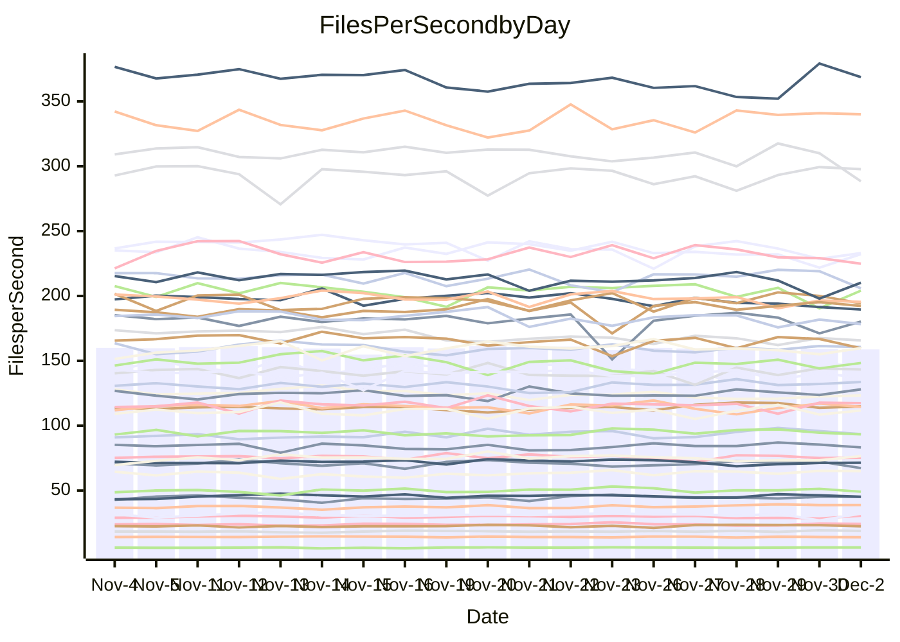

<!---
# This file is auto-generated. Do not edit.
# cspell:disable
--->
# Performance Report

## Daily Performance

```mermaid
xychart-beta
    title Files Per Second by Day
    y-axis Files per Second
    x-axis Date [Nov-4, Nov-5, Nov-11, Nov-12, Nov-13, Nov-14, Nov-15, Nov-16, Nov-19, Nov-20, Nov-21, Nov-22, Nov-23, Nov-26, Nov-27, Nov-28, Nov-29, Nov-30, Dec-2]
    bar [160.02, 159.72, 160.65, 161.35, 160.47, 159.54, 154.79, 160.46, 159.61, 161.30, 160.06, 161.07, 158.38, 160.01, 159.51, 160.85, 158.58, 159.25, 158.81]
    line [42.88, 45.37, 46.20, 44.50, 43.23, 40.60, 44.15, 43.48, 43.70, 44.83, 41.94, 45.87, 46.91, 45.25, 44.50, 44.73, 43.85, 45.20, 45.18]
    line [342.26, 331.64, 327.21, 343.58, 331.81, 327.76, 336.79, 342.94, 331.62, 322.15, 327.54, 347.69, 328.52, 335.50, 325.97, 342.99, 339.55, 340.91, 340.06]
    line [18.44, 18.38, 18.23, 18.67, 17.83, 17.56, 18.43, 19.15, 18.91, 18.65, 18.27, 18.52, 18.27, 18.83, 18.32, 19.02, 18.13, 19.36, 18.89]
    line [207.58, 199.26, 209.84, 202.01, 209.99, 206.66, 203.31, 199.00, 191.59, 206.65, 204.27, 207.11, 206.14, 207.83, 208.99, 199.30, 206.34, 190.41, 204.07]
    line [113.53, 112.85, 114.15, 114.65, 113.36, 112.62, 114.36, 114.33, 111.99, 110.22, 112.37, 113.80, 114.46, 111.80, 116.19, 117.82, 117.56, 113.82, 114.89]
    line [91.04, 92.11, 93.46, 89.53, 90.84, 91.64, 91.15, 95.31, 91.02, 97.72, 93.01, 95.37, 95.97, 90.32, 91.22, 95.22, 98.38, 95.87, 93.54]
    line [23.95, 24.20, 23.49, 24.08, 23.00, 23.06, 24.50, 24.34, 23.62, 23.53, 24.02, 24.23, 25.56, 24.09, 24.00, 22.97, 23.09, 24.60, 24.38]
    line [43.22, 43.49, 45.34, 46.46, 47.61, 46.36, 45.42, 47.07, 44.45, 46.03, 45.93, 46.58, 46.39, 45.62, 44.62, 44.61, 47.22, 46.33, 45.22]
    line [64.51, 61.69, 64.67, 63.79, 59.02, 62.70, 60.80, 59.91, 63.00, 61.76, 63.34, 63.78, 65.76, 61.80, 64.96, 64.67, 62.90, 65.22, 65.03]
    line [142.42, 149.63, 145.08, 140.78, 151.35, 139.20, 143.75, 147.85, 144.42, 140.89, 146.99, 147.16, 143.68, 142.26, 141.63, 133.10, 147.45, 147.90, 145.97]
    line [70.86, 69.37, 70.88, 73.81, 71.09, 69.11, 71.10, 66.81, 72.11, 73.56, 71.52, 70.73, 68.53, 69.45, 70.29, 72.76, 71.50, 72.49, 67.33]
    line [14.18, 14.33, 14.26, 14.23, 14.49, 14.71, 14.55, 14.39, 13.95, 14.60, 14.17, 14.18, 13.95, 14.61, 14.49, 13.79, 14.45, 14.21, 14.03]
    line [173.61, 171.18, 172.63, 173.35, 172.14, 176.09, 170.54, 174.05, 165.70, 164.60, 166.98, 168.69, 167.81, 163.00, 169.37, 167.40, 162.13, 167.55, 165.71]
    line [6.05, 5.91, 5.92, 6.05, 6.23, 5.47, 5.95, 5.52, 6.13, 6.21, 6.06, 6.00, 6.29, 6.16, 6.03, 5.90, 6.01, 6.16, 6.11]
    line [22.59, 22.34, 23.16, 21.54, 22.68, 21.85, 22.43, 22.45, 22.56, 23.60, 23.23, 21.70, 22.82, 21.29, 23.51, 23.57, 23.50, 23.32, 22.44]
    line [217.54, 217.64, 213.57, 213.32, 216.11, 216.43, 209.55, 217.83, 207.54, 213.34, 220.45, 208.25, 203.01, 216.67, 216.64, 214.89, 220.14, 219.09, 205.91]
    line [75.21, 76.09, 76.34, 76.58, 74.79, 76.80, 76.30, 73.76, 78.85, 74.91, 77.93, 75.92, 76.91, 75.07, 72.02, 77.23, 76.76, 75.06, 75.34]
    line [197.35, 200.31, 199.19, 197.63, 196.85, 205.77, 192.52, 197.76, 200.10, 202.32, 198.81, 202.16, 197.78, 192.08, 198.49, 194.68, 194.09, 191.43, 189.56]
    line [128.05, 124.13, 124.73, 125.27, 128.39, 131.06, 126.59, 126.76, 123.53, 124.94, 119.79, 123.77, 123.92, 126.14, 121.82, 120.62, 120.89, 122.51, 123.28]
    line [236.64, 241.81, 241.59, 241.14, 243.55, 247.17, 242.91, 239.70, 241.02, 227.21, 242.23, 236.13, 235.78, 220.97, 238.24, 242.33, 236.55, 228.65, 233.06]
    line [126.86, 123.18, 120.25, 124.45, 125.35, 124.99, 127.41, 122.93, 123.56, 118.96, 130.24, 124.88, 123.12, 123.27, 123.12, 128.04, 125.68, 123.73, 128.02]
    line [111.89, 115.01, 116.13, 115.22, 119.08, 113.54, 116.51, 115.21, 113.92, 114.16, 109.46, 116.44, 115.65, 119.47, 113.07, 108.78, 113.61, 117.05, 114.53]
    line [309.17, 313.73, 314.69, 307.18, 306.00, 312.70, 310.78, 315.06, 310.37, 312.90, 312.74, 307.69, 303.77, 306.69, 310.59, 299.95, 317.57, 310.02, 288.37]
    line [93.17, 96.79, 91.80, 95.95, 95.87, 94.48, 96.44, 92.65, 94.10, 91.76, 92.63, 92.88, 97.96, 96.91, 93.91, 96.71, 97.20, 94.57, 93.34]
    line [201.71, 188.42, 200.46, 201.07, 189.10, 190.06, 197.82, 199.09, 198.24, 196.06, 188.63, 196.64, 202.22, 187.96, 198.52, 194.49, 202.79, 200.07, 194.40]
    line [130.73, 132.76, 130.23, 128.16, 133.01, 129.97, 132.49, 129.80, 133.61, 130.16, 125.21, 125.92, 133.37, 131.47, 131.60, 135.88, 131.34, 132.15, 133.66]
    line [29.07, 29.19, 29.96, 30.60, 29.98, 29.13, 30.65, 29.20, 29.66, 30.68, 30.21, 29.67, 30.46, 29.86, 30.48, 28.76, 28.98, 28.47, 30.64]
    line [72.23, 71.32, 71.25, 71.08, 73.06, 72.16, 72.33, 73.39, 70.13, 74.26, 73.25, 72.41, 73.90, 73.49, 71.80, 68.80, 70.33, 71.28, 71.43]
    line [69.62, 72.93, 75.62, 73.39, 77.86, 75.46, 75.53, 74.48, 74.42, 80.12, 74.68, 76.58, 77.00, 75.69, 74.97, 72.54, 73.38, 73.35, 76.60]
    line [235.17, 233.67, 245.24, 236.50, 233.98, 229.39, 228.12, 237.34, 232.45, 241.31, 240.00, 234.88, 241.77, 233.01, 234.04, 231.90, 232.03, 221.81, 232.27]
    line [185.22, 182.14, 183.42, 176.89, 184.07, 179.92, 182.71, 181.97, 184.63, 178.93, 182.57, 185.79, 151.12, 180.91, 184.73, 187.07, 183.30, 171.17, 180.33]
    line [201.12, 199.63, 197.18, 194.05, 198.31, 204.17, 202.23, 197.34, 197.09, 203.42, 191.56, 201.26, 203.88, 197.62, 198.09, 199.18, 190.53, 196.53, 195.43]
    line [140.40, 143.02, 143.74, 136.69, 145.20, 142.11, 138.52, 142.01, 139.48, 148.36, 139.11, 138.55, 138.37, 142.22, 131.52, 144.79, 139.07, 144.20, 143.33]
    line [146.39, 151.10, 147.79, 148.60, 155.08, 157.59, 150.36, 154.26, 148.98, 139.01, 149.20, 150.38, 142.14, 139.88, 148.61, 147.55, 150.86, 144.17, 148.38]
    line [189.38, 187.47, 183.93, 189.93, 188.83, 183.53, 188.50, 187.66, 189.71, 197.63, 188.37, 194.96, 171.19, 192.32, 195.34, 189.35, 192.30, 195.25, 192.38]
    line [163.60, 155.05, 157.20, 162.55, 165.62, 162.61, 162.23, 156.96, 154.28, 159.13, 159.89, 158.58, 162.75, 157.87, 156.54, 160.15, 158.52, 161.43, 160.70]
    line [114.45, 114.87, 117.85, 109.38, 119.29, 116.46, 115.59, 118.49, 113.54, 123.36, 115.17, 111.11, 117.00, 116.48, 115.76, 116.91, 109.21, 117.71, 117.44]
    line [215.36, 210.66, 218.14, 212.13, 216.95, 216.28, 218.40, 219.59, 212.75, 216.58, 203.96, 211.74, 210.99, 212.04, 213.89, 218.50, 211.90, 198.01, 210.25]
    line [109.15, 112.48, 109.72, 110.55, 118.02, 109.29, 108.02, 112.93, 112.97, 105.44, 113.26, 114.47, 109.88, 112.40, 105.21, 111.47, 116.12, 108.62, 111.74]
    line [31.83, 29.14, 30.76, 32.43, 33.35, 30.87, 30.71, 30.55, 30.97, 31.56, 31.09, 31.75, 32.47, 31.60, 31.68, 30.55, 32.17, 27.01, 32.17]
    line [85.26, 84.18, 85.13, 86.07, 79.22, 86.18, 84.80, 82.10, 81.80, 85.25, 80.99, 81.28, 83.53, 86.46, 84.38, 84.35, 87.05, 85.49, 83.29]
    line [36.86, 36.50, 38.05, 38.19, 36.99, 35.25, 37.09, 37.76, 37.04, 38.77, 36.43, 36.55, 38.70, 37.18, 37.74, 38.63, 39.45, 38.80, 38.88]
    line [292.89, 299.81, 300.08, 293.90, 270.62, 297.75, 295.78, 293.19, 296.08, 277.37, 294.62, 298.41, 296.48, 286.19, 292.24, 281.16, 293.25, 299.40, 297.80]
    line [48.68, 50.03, 50.42, 49.00, 46.22, 50.88, 49.95, 51.56, 48.83, 49.01, 50.78, 50.67, 53.20, 51.79, 48.42, 50.26, 50.21, 51.36, 49.15]
    line [165.61, 166.70, 169.45, 169.81, 163.46, 172.46, 167.41, 168.34, 167.09, 161.78, 164.45, 166.41, 153.59, 165.34, 167.76, 159.74, 168.29, 166.84, 159.75]
    line [184.49, 185.72, 182.94, 188.28, 187.98, 181.73, 181.49, 184.66, 187.81, 191.42, 176.14, 182.60, 177.02, 183.57, 185.12, 185.03, 175.76, 181.77, 178.38]
    line [221.31, 234.75, 242.27, 242.37, 232.19, 225.67, 233.72, 226.18, 226.48, 228.27, 237.35, 230.05, 239.20, 229.08, 239.26, 235.89, 229.81, 229.18, 224.89]
    line [376.67, 367.68, 370.64, 374.87, 367.41, 370.51, 370.21, 374.24, 360.74, 357.55, 363.60, 364.19, 368.22, 360.42, 361.78, 353.39, 352.03, 379.23, 368.70]
    line [151.46, 156.36, 158.02, 161.56, 165.28, 150.34, 161.29, 153.65, 159.58, 164.91, 160.94, 159.52, 161.45, 166.78, 158.69, 159.56, 158.17, 155.13, 159.80]
    line [143.48, 140.52, 140.72, 142.75, 136.72, 140.92, 127.38, 142.26, 140.32, 141.64, 141.43, 143.12, 138.28, 138.39, 140.67, 142.96, 135.37, 140.89, 136.80]
```

## Time to Process Files

| Repository                                      | Elapsed | Min/Avg/Max           |    SD | SD Graph                |
| ----------------------------------------------- | ------: | :-------------------: | ----: | ----------------------- |
| AdaDoom3/AdaDoom3                    |    3.47 | 3.3 /   3.5 /   3.8   |  0.11 | `     ┣━┻━━●━━┻━┫     ` |
| alexiosc/megistos                    |    7.59 | 7.3 /   7.8 /   8.7   |  0.29 | `    ┣━━┻●━╋━━┻━━┫    ` |
| apollographql/apollo-server          |    2.81 | 2.6 /   2.7 /   3.2   |  0.12 | `     ┣━┻━━╋━●┻━┫     ` |
| aspnetboilerplate/aspnetboilerplate  |   10.81 | 10.3 /  10.7 /  11.8  |  0.36 | `    ┣━━┻━━╋●━┻━━┫    ` |
| aws-amplify/docs                     |   13.61 | 12.6 /  13.5 /  14.8  |  0.45 | `    ┣━━┻━━╋●━┻━━┫    ` |
| Azure/azure-rest-api-specs           |   10.45 | 9.6 /  10.2 /  11.2   |  0.39 | `    ┣━━┻━━╋━●┻━━┫    ` |
| bitjson/typescript-starter           |    1.03 | 1.0 /   1.1 /   1.2   |  0.04 | `     ┣━●┻━╋━┻━━┫     ` |
| caddyserver/caddy                    |    3.98 | 3.4 /   3.8 /   4.2   |  0.13 | `     ┣━┻━━╋━━┻●┫     ` |
| canada-ca/open-source-logiciel-libre |    1.15 | 1.1 /   1.2 /   1.3   |  0.05 | `     ┣━━┻●╋━┻━━┫     ` |
| chef/chef                            |    6.16 | 5.8 /   6.0 /   6.5   |  0.18 | `    ┣━━┻━━╋━●┻━━┫    ` |
| dart-lang/sdk                        |   65.77 | 64.2 /  67.7 /  72.3  |  1.90 | `   ┣━━●━━━╋━━━┻━━┫   ` |
| django/django                        |   16.90 | 14.9 /  15.9 /  19.1  |  0.71 | `    ┣━━┻━━╋━━┻━●┫    ` |
| eslint/eslint                        |   10.51 | 10.5 /  11.1 /  12.2  |  0.40 | `    ┣━●┻━━╋━━┻━━┫    ` |
| exonum/exonum                        |    3.58 | 3.4 /   3.7 /   4.0   |  0.12 | `     ┣━┻●━╋━━┻━┫     ` |
| flutter/samples                      |   16.78 | 16.0 /  17.1 /  21.1  |  0.85 | `    ┣━━┻━●╋━━┻━━┫    ` |
| gitbucket/gitbucket                  |    3.51 | 3.5 /   3.6 /   3.9   |  0.10 | `     ┣━●━━╋━━┻━┫     ` |
| googleapis/google-cloud-cpp          |  153.39 | 142.0 / 150.5 / 209.7 | 10.49 | `  ┣━━━┻━━━╋●━━┻━━━┫  ` |
| graphql/express-graphql              |    1.15 | 1.1 /   1.2 /   1.4   |  0.07 | `     ┣━┻━━●━━┻━┫     ` |
| graphql/graphql-js                   |    2.86 | 2.8 /   3.0 /   3.2   |  0.10 | `     ┣━●━━╋━━┻━┫     ` |
| graphql/graphql-relay-js             |    1.15 | 1.1 /   1.2 /   1.3   |  0.04 | `     ┣━━●━╋━┻━━┫     ` |
| graphql/graphql-spec                 |    1.33 | 1.3 /   1.3 /   1.5   |  0.04 | `     ┣━━┻━●━┻━━┫     ` |
| iluwatar/java-design-patterns        |   13.67 | 12.6 /  13.4 /  14.9  |  0.44 | `    ┣━━┻━━╋━●┻━━┫    ` |
| ktaranov/sqlserver-kit               |    6.80 | 6.5 /   6.8 /   7.3   |  0.19 | `    ┣━━┻━━●━━┻━━┫    ` |
| liriliri/licia                       |    4.23 | 4.1 /   4.3 /   4.6   |  0.12 | `     ┣━┻━●╋━━┻━┫     ` |
| MartinThoma/LaTeX-examples           |    7.06 | 6.8 /   7.1 /   7.9   |  0.23 | `    ┣━━┻━●╋━━┻━━┫    ` |
| mdx-js/mdx                           |    1.96 | 1.9 /   2.0 /   2.2   |  0.07 | `     ┣━┻━●╋━━┻━┫     ` |
| microsoft/TypeScript-Website         |    5.76 | 5.5 /   5.8 /   6.5   |  0.19 | `    ┣━━┻━●╋━━┻━━┫    ` |
| MicrosoftDocs/PowerShell-Docs        |   24.36 | 22.9 /  24.4 /  26.2  |  0.86 | `   ┣━━━┻━━●━━┻━━━┫   ` |
| neovim/nvim-lspconfig                |    4.47 | 4.3 /   4.5 /   4.9   |  0.12 | `     ┣━┻━●╋━━┻━┫     ` |
| pagekit/pagekit                      |    3.70 | 3.4 /   3.7 /   4.3   |  0.15 | `     ┣━┻━━╋●━┻━┫     ` |
| php/php-src                          |   26.90 | 25.5 /  27.0 /  29.3  |  0.89 | `   ┣━━━┻━━●━━┻━━━┫   ` |
| plasticrake/tplink-smarthome-api     |    1.37 | 1.3 /   1.4 /   1.5   |  0.05 | `     ┣━┻━━●━━┻━┫     ` |
| prettier/prettier                    |    8.31 | 7.6 /   7.8 /   8.4   |  0.18 | `    ┣━━┻━━╋━━┻━━┫ ●  ` |
| pycontribs/jira                      |    1.65 | 1.5 /   1.6 /   1.7   |  0.06 | `     ┣━┻━━╋━●┻━┫     ` |
| RustPython/RustPython                |    5.90 | 5.3 /   5.6 /   6.3   |  0.23 | `    ┣━━┻━━╋━━●━━┫    ` |
| shoelace-style/shoelace              |    2.97 | 2.9 /   3.1 /   3.7   |  0.14 | `     ┣━┻●━╋━━┻━┫     ` |
| slint-ui/slint                       |   14.80 | 13.4 /  14.0 /  15.0  |  0.36 | `    ┣━━┻━━╋━━┻━━┫●   ` |
| SoftwareBrothers/admin-bro           |    2.67 | 2.5 /   2.7 /   2.9   |  0.08 | `     ┣━┻━━●━━┻━┫     ` |
| sveltejs/svelte                      |   22.33 | 20.8 /  22.0 /  23.0  |  0.51 | `    ┣━━┻━━╋━●┻━━┫    ` |
| TheAlgorithms/Python                 |    6.09 | 5.6 /   5.9 /   6.4   |  0.18 | `    ┣━━┻━━╋━━●━━┫    ` |
| twbs/bootstrap                       |    1.85 | 1.8 /   1.9 /   2.4   |  0.10 | `     ┣━┻━━●━━┻━┫     ` |
| typescript-cheatsheets/react         |    1.39 | 1.3 /   1.4 /   1.6   |  0.06 | `     ┣━┻━●╋━━┻━┫     ` |
| typescript-eslint/typescript-eslint  |    4.34 | 4.2 /   4.4 /   4.7   |  0.13 | `     ┣━┻━●╋━━┻━┫     ` |
| vitest-dev/vitest                    |   10.64 | 9.2 /   9.9 /  10.9   |  0.38 | `    ┣━━┻━━╋━━┻━━●    ` |
| w3c/aria-practices                   |    3.77 | 3.4 /   3.6 /   3.9   |  0.12 | `     ┣━┻━━╋━━●━┫     ` |
| w3c/specberus                        |    2.15 | 2.0 /   2.1 /   2.2   |  0.06 | `     ┣━┻━━╋━━●━┫     ` |
| webdeveric/webpack-assets-manifest   |    1.22 | 1.2 /   1.2 /   1.4   |  0.05 | `     ┣━━┻●╋━┻━━┫     ` |
| webpack/webpack                      |    5.80 | 5.5 /   5.8 /   6.7   |  0.21 | `    ┣━━┻━━●━━┻━━┫    ` |
| wireapp/wire-desktop                 |    1.37 | 1.3 /   1.4 /   1.7   |  0.10 | `     ┣━┻●━╋━━┻━┫     ` |
| wireapp/wire-webapp                  |   10.78 | 10.6 /  11.2 /  12.6  |  0.51 | `    ┣━━●━━╋━━┻━━┫    ` |

Note:
- Elapsed time is in seconds.

## Files per Second over Time

| Repository                                      | Files |    Sec |    Fps |    Rel | Trend Fps              |    N |
| ----------------------------------------------- | ----: | -----: | -----: | -----: | ---------------------- | ---: |
| AdaDoom3/AdaDoom3                    |   103 |   3.47 |  29.66 | -0.63% | `▆▇▅▇▇▆▆▆▇▅▇▆▇▇▄▆▅▅█▆` |   38 |
| alexiosc/megistos                    |   583 |   7.59 |  76.82 |  3.00% | `▆▆▅█▆▆▆█▇▆▇▆▆▆▅▅▅▅▇▇` |   38 |
| apollographql/apollo-server          |   253 |   2.81 |  89.99 | -2.89% | `▆▇▆█▇▇█▇▇▅▇▆▅▇▇▇█▇█▆` |   38 |
| aspnetboilerplate/aspnetboilerplate  |  2286 |  10.81 | 211.39 | -1.10% | `▆▆▆▇██▆▆▅▇██▆██▆██▅▇` |   38 |
| aws-amplify/docs                     |  2871 |  13.61 | 210.96 | -1.08% | `▇▇▅▇▄▆▆▇▆▇▆▆▇▇█▇▆▄▆▆` |   38 |
| Azure/azure-rest-api-specs           |  2384 |  10.45 | 228.19 | -2.10% | `█▄█▆█▇█▅██▅████▇▆▆▅▆` |   38 |
| bitjson/typescript-starter           |    20 |   1.03 |  19.35 |  4.48% | `▆▇▇▇▆▆▆▇▆▇▇▃██▇█▆█▆█` |   38 |
| caddyserver/caddy                    |   288 |   3.98 |  72.45 | -4.85% | `▆▆█▅▆▆▅▆▆▄▆▃▃▆▆▆▆▅▆▄` |   38 |
| canada-ca/open-source-logiciel-libre |     7 |   1.15 |   6.07 |  1.07% | `▇▇█▇▆▇▆▇██▆▆▆▇▇▄▆▇▇▇` |   38 |
| chef/chef                            |  1191 |   6.16 | 193.32 | -2.15% | `▇█▇▇█▅▇▇▇▇▄█▇▆▅▇▆▅▄▆` |   38 |
| dart-lang/sdk                        | 10802 |  65.77 | 164.24 |  3.27% | `▇▇▇▇▇▆▆▇▇██▆▆▆▆▇▆▅▅▇` |   38 |
| django/django                        |  2887 |  16.90 | 170.81 | -6.12% | `██▆▇█▇▇█▃▇▇▇█▇██▇▅█▅` |   38 |
| eslint/eslint                        |  2062 |  10.51 | 196.28 |  3.66% | `█▅▆█▅▇▇█▃▆▇▇▇██▅▇▇▆█` |   38 |
| exonum/exonum                        |   421 |   3.58 | 117.64 |  2.15% | `▆▅▆█▆▆▄▅▆▆▇▅▆▆▇▆▄▇▆▇` |   38 |
| flutter/samples                      |  2400 |  16.78 | 143.01 |  1.87% | `▆▆▇█▇▆▇▆▆█▆▂▆▇▇█▇▇▇▇` |   38 |
| gitbucket/gitbucket                  |   413 |   3.51 | 117.66 |  3.39% | `▄▇▇▅▆▆▆▇▇▇▅▆██▇██▆▆█` |   38 |
| googleapis/google-cloud-cpp          | 20966 | 153.39 | 136.68 | -2.18% | `▇█▇██▇██▇▆███▇██▇▇▇▇` |   38 |
| graphql/express-graphql              |    26 |   1.15 |  22.67 |  0.32% | `█▆██▇▇▅▆▇█▂▇▇█▇█▇▇▆▇` |   38 |
| graphql/graphql-js                   |   368 |   2.86 | 128.61 |  3.29% | `▄▇▆▅▇█▇▆▆▇▅▄▇▇▇█▇▆▇▇` |   38 |
| graphql/graphql-relay-js             |    28 |   1.15 |  24.44 |  2.13% | `▄▇▆▆▆▆▇▆█▇▆▆▅▇▃▆▅▇▇▇` |   38 |
| graphql/graphql-spec                 |    19 |   1.33 |  14.26 | -0.06% | `▆▇▆█▇▇▇▆▆███▇██▄▇▇▆▇` |   38 |
| iluwatar/java-design-patterns        |  1992 |  13.67 | 145.67 | -1.98% | `█▇▇▅▇███▆▄▇▇▇▇█▆█▆█▇` |   38 |
| ktaranov/sqlserver-kit               |   489 |   6.80 |  71.96 |  0.36% | `▆▄▅█▇██▅█▇█▇▆▆▅▅▆▆▆▇` |   38 |
| liriliri/licia                       |  1437 |   4.23 | 339.77 |  1.51% | `▇▇▆▅▆▆██▆▇▆▇▄▆▇█▇▇▇▇` |   38 |
| MartinThoma/LaTeX-examples           |  1409 |   7.06 | 199.53 |  0.71% | `█▇▆██▄█▇█▆█▇▆█▇▇▆▇▆▇` |   38 |
| mdx-js/mdx                           |   141 |   1.96 |  71.89 |  1.53% | `█████▆▆▇▆▇▅▆▇▇██▇█▃▇` |   38 |
| microsoft/TypeScript-Website         |   761 |   5.76 | 132.09 |  0.66% | `▇▇█▆▄▆▅▅▇▆▇▆▅█▇█▇▇▇▇` |   38 |
| MicrosoftDocs/PowerShell-Docs        |  2638 |  24.36 | 108.28 | -2.48% | `▇█▇▅▆██▇▆▇▇▄▅▅▆██▆█▆` |   38 |
| neovim/nvim-lspconfig                |   760 |   4.47 | 170.07 |  0.50% | `▆▆▇▆▇▇█▇▇▇▄▆▇██▆▆▇▅█` |   38 |
| pagekit/pagekit                      |   741 |   3.70 | 200.38 | -1.38% | `▆▆▅▇▇▆▇▇▇▇▇▇█▇▅▆▇▅▇▆` |   38 |
| php/php-src                          |  2262 |  26.90 |  84.10 |  0.08% | `▆▅▇▇▅▅▅▅▆█▇▅█▆▅█▇▇▆▆` |   38 |
| plasticrake/tplink-smarthome-api     |    62 |   1.37 |  45.27 | -0.06% | `▆▇▆▇▆██▇▇▇▇▅▅▇▇▅█▇▆▇` |   38 |
| prettier/prettier                    |  2410 |   8.31 | 290.06 | -6.30% | `▇▇▇██▇▆█▆▇▆▇▇▇▅▆█▇▄▅` |   38 |
| pycontribs/jira                      |    79 |   1.65 |  47.98 | -3.83% | `▆█▃▅▆▇▆▆██▆▄▅▇▇▆▆▇▆▅` |   38 |
| RustPython/RustPython                |   710 |   5.90 | 120.44 | -3.19% | `▇▇█▇▆▆▇▇▇█▇▄██▇▅▆▇█▆` |   38 |
| shoelace-style/shoelace              |   439 |   2.97 | 147.79 |  2.55% | `▇█▆▇████▇▆██▇▆█▃██▇█` |   38 |
| slint-ui/slint                       |  2595 |  14.80 | 175.33 | -4.73% | `▆█▇█▄▆▇▆▅▆▇▇▇▆█▆▅▆▆▅` |   38 |
| SoftwareBrothers/admin-bro           |   441 |   2.67 | 165.32 | -0.45% | `▇▆▆▆█▅▇▆▄▇▆▇▇█▆▅▇▇▄▇` |   38 |
| sveltejs/svelte                      |  8211 |  22.33 | 367.79 |  0.39% | `▆▆▅▅▆▆█▅▇▆▆▆▅▆▅▅▅█▇▇` |   38 |
| TheAlgorithms/Python                 |  1399 |   6.09 | 229.80 | -3.77% | `▇█▇▅▇█▆▆▆▄▄█▄██▇▆▅▆▅` |   38 |
| twbs/bootstrap                       |   118 |   1.85 |  63.62 |  0.68% | `▇██▆▆█▇▇█▇▆▇██▇█▇██▇` |   38 |
| typescript-cheatsheets/react         |    53 |   1.39 |  38.02 |  1.46% | `▆▆▇▇▅▆▃█▇▆▆▇▆▆█▆█▇█▇` |   38 |
| typescript-eslint/typescript-eslint  |  1292 |   4.34 | 297.62 |  1.32% | `▇▇█▅▆█▇█▇▆▆▇▅█▄▆▇███` |   38 |
| vitest-dev/vitest                    |  2398 |  10.64 | 225.44 | -3.99% | `▆▄████▆██▆▇▇█▆▆▇▇▅█▆` |   38 |
| w3c/aria-practices                   |   414 |   3.77 | 109.85 | -4.22% | `█▅▆▆▅▅█▇▇███▄▇▅▄▆▇█▅` |   38 |
| w3c/specberus                        |   197 |   2.15 |  91.54 | -3.43% | `▇▅▇▅▄█▆▆█▇█▇▆▆▇██▇▇▅` |   38 |
| webdeveric/webpack-assets-manifest   |    55 |   1.22 |  45.24 |  1.79% | `▄▆▇▇▄▅█▇█▇▇▅█▆▅█▆▇▇▇` |   38 |
| webpack/webpack                      |  1141 |   5.80 | 196.69 |  0.32% | `█▇▇▇▆▅▆██▆▅▇▇▇▆▇█▇▆▇` |   38 |
| wireapp/wire-desktop                 |    43 |   1.37 |  31.46 |  1.16% | `█▄▇▇▇▆▇▇█▆█▇▇█▅▇█▃█▇` |   38 |
| wireapp/wire-webapp                  |  1785 |  10.78 | 165.63 |  4.27% | `█▃▅▇▇▇▅██▆▇█▄▇▇▇▇▇▆█` |   38 |

## Data Throughput

| Repository                                      | Files |    Sec |     Kps |     Rel | Trend Kps              |    N |
| ----------------------------------------------- | ----: | -----: | ------: | ------: | ---------------------- | ---: |
| AdaDoom3/AdaDoom3                    |   103 |   3.47 |  630.31 |  -0.63% | `▆▇▅▇▇▆▆▆▇▅▇▆▇▇▄▆▅▅█▆` |   38 |
| alexiosc/megistos                    |   583 |   7.59 |  603.62 |   3.00% | `▆▆▅█▆▆▆█▇▆▇▆▆▆▅▅▅▅▇▇` |   38 |
| apollographql/apollo-server          |   253 |   2.81 |  736.31 |  -2.75% | `▆▇▆█▇▇█▇▇▅▇▆▅▇▇▇█▇█▆` |   38 |
| aspnetboilerplate/aspnetboilerplate  |  2286 |  10.81 |  514.32 |  -1.10% | `▆▆▆▇██▆▆▅▇██▆██▆██▅▇` |   38 |
| aws-amplify/docs                     |  2871 |  13.61 |  736.20 |  -1.11% | `▇▇▅▇▄▆▆▇▆▇▆▆▇▇█▇▆▄▆▆` |   38 |
| Azure/azure-rest-api-specs           |  2384 |  10.45 |  618.90 |  -2.31% | `█▄█▆█▇█▅██▅████▇▆▆▅▆` |   38 |
| bitjson/typescript-starter           |    20 |   1.03 |   77.39 |   4.48% | `▆▇▇▇▆▆▆▇▆▇▇▃██▇█▆█▆█` |   38 |
| caddyserver/caddy                    |   288 |   3.98 |  629.63 |  -4.73% | `▆▆█▅▆▆▅▆▆▄▆▃▃▆▆▆▆▅▆▄` |   38 |
| canada-ca/open-source-logiciel-libre |     7 |   1.15 |   50.32 |   1.07% | `▇▇█▇▆▇▆▇██▆▆▆▇▇▄▆▇▇▇` |   38 |
| chef/chef                            |  1191 |   6.16 |  897.59 |  -2.06% | `▇█▇▇█▅▇▇▇▇▄█▇▆▅▇▆▅▄▆` |   38 |
| dart-lang/sdk                        | 10802 |  65.77 | 1116.62 |   2.82% | `▇▇▇▇▇▆▆▇▇██▆▆▆▆▇▆▅▅▇` |   38 |
| django/django                        |  2887 |  16.90 | 1073.44 |  -6.05% | `██▆▇█▇▇█▃▇▇▇█▇██▇▅█▅` |   38 |
| eslint/eslint                        |  2062 |  10.51 | 1346.82 |   2.02% | `█▅▆█▅▇▇█▃▆▇▇▇██▅▇▇▇█` |   38 |
| exonum/exonum                        |   421 |   3.58 | 1125.27 |   2.15% | `▆▅▆█▆▆▄▅▆▆▇▅▆▆▇▆▄▇▆▇` |   38 |
| flutter/samples                      |  2400 |  16.78 | 1276.18 |   1.87% | `▆▆▇█▇▆▇▆▆█▆▂▆▇▇█▇▇▇▇` |   38 |
| gitbucket/gitbucket                  |   413 |   3.51 |  534.75 |   3.39% | `▄▇▇▅▆▆▆▇▇▇▅▆██▇██▆▆█` |   38 |
| googleapis/google-cloud-cpp          | 20966 | 153.39 | 1113.60 |  -2.08% | `▇█▇██▇██▇▆███▇██▇▇▇▇` |   38 |
| graphql/express-graphql              |    26 |   1.15 |  103.77 |   0.32% | `█▆██▇▇▅▆▇█▂▇▇█▇█▇▇▆▇` |   38 |
| graphql/graphql-js                   |   368 |   2.86 |  746.49 |   3.29% | `▄▇▆▅▇█▇▆▆▇▅▄▇▇▇█▇▆▇▇` |   38 |
| graphql/graphql-relay-js             |    28 |   1.15 |   96.02 |   2.13% | `▄▇▆▆▆▆▇▆█▇▆▆▅▇▃▆▅▇▇▇` |   38 |
| graphql/graphql-spec                 |    19 |   1.33 |  475.79 |  -0.06% | `▆▇▆█▇▇▇▆▆███▇██▄▇▇▆▇` |   38 |
| iluwatar/java-design-patterns        |  1992 |  13.67 |  450.24 |  -1.98% | `█▇▇▅▇███▆▄▇▇▇▇█▆█▆█▇` |   38 |
| ktaranov/sqlserver-kit               |   489 |   6.80 | 1089.75 |   0.36% | `▆▄▅█▇██▅█▇█▇▆▆▅▅▆▆▆▇` |   38 |
| liriliri/licia                       |  1437 |   4.23 |  404.80 |   1.51% | `▇▇▆▅▆▆██▆▇▆▇▄▆▇█▇▇▇▇` |   38 |
| MartinThoma/LaTeX-examples           |  1409 |   7.06 |  412.09 |   0.71% | `█▇▆██▄█▇█▆█▇▆█▇▇▆▇▆▇` |   38 |
| mdx-js/mdx                           |   141 |   1.96 |  333.96 |   1.38% | `█████▆▆▇▆▇▅▆▇▇██▇█▃▇` |   38 |
| microsoft/TypeScript-Website         |   761 |   5.76 |  913.69 |   0.66% | `▇▇█▆▄▆▅▅▇▆▇▆▅█▇█▇▇▇▇` |   38 |
| MicrosoftDocs/PowerShell-Docs        |  2638 |  24.36 | 1129.06 |  -1.28% | `▇█▇▄▆██▇▆▇▇▄▄▅▅▇█▆█▆` |   38 |
| neovim/nvim-lspconfig                |   760 |   4.47 |  315.97 |   5.61% | `▇▆▇▆▇▇█▇▇▇▅▇███▆▆▇▆█` |   38 |
| pagekit/pagekit                      |   741 |   3.70 |  417.79 |  -1.38% | `▆▆▅▇▇▆▇▇▇▇▇▇█▇▅▆▇▅▇▆` |   38 |
| php/php-src                          |  2262 |  26.90 | 1474.33 |   0.14% | `▆▅▇▇▅▅▅▅▆█▇▅█▆▅█▇▇▆▆` |   38 |
| plasticrake/tplink-smarthome-api     |    62 |   1.37 |  244.61 |  -0.06% | `▆▇▆▇▆██▇▇▇▇▅▅▇▇▅█▇▆▇` |   38 |
| prettier/prettier                    |  2410 |   8.31 |  409.81 |  -4.65% | `▇▇▇▇█▇▆█▆▇▆▇▇▇▅▆█▇▅▅` |   38 |
| pycontribs/jira                      |    79 |   1.65 |  340.14 |  -3.83% | `▆█▃▅▆▇▆▆██▆▄▅▇▇▆▆▇▆▅` |   38 |
| RustPython/RustPython                |   710 |   5.90 | 1242.20 |   7.30% | `▇███▇▇█▇▇██▅███▆▇▇█▇` |   38 |
| shoelace-style/shoelace              |   439 |   2.97 |  714.02 |   2.55% | `▇█▆▇████▇▆██▇▆█▃██▇█` |   38 |
| slint-ui/slint                       |  2595 |  14.80 | 1090.76 |  -4.09% | `▆█▇█▄▆▇▆▅▆▇▇▇▆█▆▅▆▆▅` |   38 |
| SoftwareBrothers/admin-bro           |   441 |   2.67 |  364.37 |  -0.45% | `▇▆▆▆█▅▇▆▄▇▆▇▇█▆▅▇▇▄▇` |   38 |
| sveltejs/svelte                      |  8211 |  22.33 |  246.94 |   1.03% | `▆▆▅▅▆▆█▅▇▆▆▆▅▆▅▅▅█▇▇` |   38 |
| TheAlgorithms/Python                 |  1399 |   6.09 |  584.44 |  -3.77% | `▇█▇▅▇█▆▆▆▄▄█▄██▇▆▅▆▅` |   38 |
| twbs/bootstrap                       |   118 |   1.85 |  522.45 |   0.69% | `▇██▆▆█▇▇█▇▆▇██▇█▇██▇` |   38 |
| typescript-cheatsheets/react         |    53 |   1.39 |  281.23 |   1.46% | `▆▆▇▇▅▆▃█▇▆▆▇▆▆█▆█▇█▇` |   38 |
| typescript-eslint/typescript-eslint  |  1292 |   4.34 | 1545.23 |   1.99% | `▇▇█▅▆█▇█▇▆▆▇▅█▅▆▇███` |   38 |
| vitest-dev/vitest                    |  2398 |  10.64 |  488.58 |  -3.66% | `▆▄████▆██▆▇▇█▆▆▇▇▅█▆` |   38 |
| w3c/aria-practices                   |   414 |   3.77 | 1024.17 |  -4.22% | `█▅▆▆▅▅█▇▇███▄▇▅▄▆▇█▅` |   38 |
| w3c/specberus                        |   197 |   2.15 |  289.49 |  -3.43% | `▇▅▇▅▄█▆▆█▇█▇▆▆▇██▇▇▅` |   38 |
| webdeveric/webpack-assets-manifest   |    55 |   1.22 |  104.46 |   1.79% | `▄▆▇▇▄▅█▇█▇▇▅█▆▅█▆▇▇▇` |   38 |
| webpack/webpack                      |  1141 |   5.80 |  901.74 |   0.85% | `██▇▇▆▆▆██▆▅▇▇▇▆▇█▇▆▇` |   38 |
| wireapp/wire-desktop                 |    43 |   1.37 |  138.99 | -10.05% | `█▄▇▇▇▆▇▇█▆█▇▇█▅▇▇▃█▇` |   38 |
| wireapp/wire-webapp                  |  1785 |  10.78 |  613.23 |   4.35% | `█▃▅▇▇▇▅██▆▇█▄▇▇▇▇▇▆█` |   38 |

