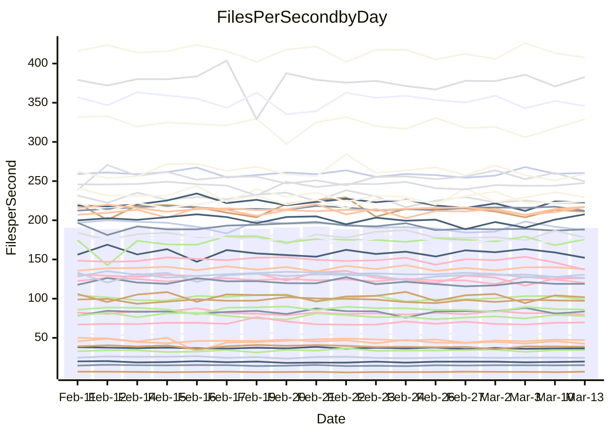

<!---
# This file is auto-generated. Do not edit.
# cspell:disable
--->
# Performance Report

Daily Performance

```mermaid
xychart-beta
    title Files Per Second by Day
    y-axis Files per Second
    x-axis Date [Feb-11, Feb-12, Feb-14, Feb-15, Feb-16, Feb-17, Feb-19, Feb-20, Feb-21, Feb-22, Feb-23, Feb-24, Feb-26, Feb-27, Mar-2, Mar-3, Mar-10, Mar-13]
    bar [190.54, 188.86, 190.65, 191.15, 192.54, 190.97, 189.21, 190.95, 191.93, 188.84, 190.95, 190.14, 188.86, 187.47, 189.15, 187.99, 188.38, 190.34]
    line [14.61, 15.64, 15.09, 14.85, 15.30, 15.16, 14.06, 14.46, 15.41, 14.08, 14.28, 13.96, 14.98, 14.69, 15.09, 15.05, 14.93, 15.11]
    line [50.07, 49.29, 45.43, 50.01, 33.04, 44.04, 44.67, 46.36, 48.18, 49.05, 48.06, 46.41, 47.91, 43.77, 46.60, 45.68, 47.70, 47.17]
    line [231.61, 222.35, 235.22, 226.17, 229.70, 226.87, 232.74, 235.31, 224.47, 238.32, 230.44, 216.76, 225.02, 229.69, 222.82, 225.14, 221.56, 221.95]
    line [104.26, 101.58, 98.06, 97.55, 103.52, 102.20, 104.64, 105.41, 96.15, 100.38, 103.85, 96.33, 99.09, 99.19, 100.48, 103.18, 103.33, 98.58]
    line [221.76, 200.54, 218.78, 219.30, 216.79, 209.78, 203.99, 220.72, 225.56, 229.20, 204.56, 214.62, 214.22, 215.21, 211.23, 203.79, 213.30, 211.06]
    line [259.10, 261.07, 258.76, 261.47, 267.24, 254.70, 257.67, 260.94, 258.83, 263.71, 255.40, 259.16, 257.65, 254.22, 257.02, 267.92, 259.39, 260.29]
    line [82.18, 80.51, 83.91, 83.57, 87.71, 81.51, 80.83, 78.91, 82.42, 80.37, 81.15, 79.72, 81.93, 80.10, 84.29, 81.35, 81.66, 79.70]
    line [38.10, 37.49, 36.82, 37.56, 36.77, 36.33, 37.40, 36.62, 38.51, 36.10, 37.37, 36.52, 37.66, 35.60, 37.02, 36.08, 36.38, 36.56]
    line [332.16, 332.97, 319.43, 324.88, 322.69, 320.99, 329.84, 297.30, 325.03, 331.76, 320.00, 316.72, 330.45, 317.84, 319.02, 305.87, 317.67, 329.02]
    line [175.80, 180.86, 176.28, 173.64, 175.63, 176.43, 178.51, 182.28, 170.09, 171.99, 177.77, 181.65, 177.93, 171.71, 171.61, 178.31, 176.56, 170.04]
    line [78.33, 84.47, 83.13, 83.66, 80.84, 83.02, 84.44, 80.37, 87.47, 84.08, 83.91, 75.76, 83.59, 84.08, 83.89, 88.30, 81.02, 83.66]
    line [135.67, 138.79, 139.27, 140.69, 136.31, 141.26, 136.95, 140.26, 134.61, 141.79, 137.76, 142.75, 135.42, 139.26, 136.06, 139.99, 140.01, 137.83]
    line [238.72, 270.54, 256.71, 261.76, 251.74, 255.44, 255.70, 246.95, 250.90, 244.70, 255.35, 256.03, 252.54, 255.82, 263.63, 252.65, 260.43, 249.43]
    line [85.89, 88.80, 88.35, 86.20, 79.88, 88.50, 88.86, 89.95, 85.47, 89.64, 87.93, 87.72, 85.68, 85.69, 83.26, 89.40, 86.73, 86.06]
    line [6.86, 6.86, 6.52, 6.16, 6.48, 6.78, 6.24, 6.45, 6.67, 5.92, 6.38, 6.30, 6.44, 6.78, 6.62, 6.55, 6.32, 6.77]
    line [196.64, 199.99, 198.18, 196.78, 191.66, 183.24, 198.97, 195.69, 196.29, 194.82, 190.50, 191.36, 189.34, 184.31, 185.47, 198.42, 191.68, 187.33]
    line [130.68, 129.17, 127.78, 130.44, 128.86, 131.22, 132.26, 123.16, 133.27, 135.57, 126.55, 124.20, 119.96, 129.35, 126.96, 116.50, 125.61, 126.14]
    line [218.83, 217.74, 220.20, 225.26, 234.21, 221.97, 226.10, 219.20, 223.30, 227.37, 223.02, 226.36, 218.81, 215.75, 221.50, 212.02, 224.11, 223.00]
    line [240.89, 231.65, 231.34, 231.21, 244.19, 223.55, 239.70, 229.90, 235.21, 223.87, 231.37, 229.84, 219.75, 240.64, 223.28, 229.19, 235.85, 229.49]
    line [23.32, 24.52, 23.95, 23.93, 26.14, 23.05, 24.64, 20.92, 22.32, 25.16, 23.04, 24.66, 23.19, 24.07, 21.50, 23.56, 24.56, 23.62]
    line [212.34, 214.45, 216.77, 218.28, 216.31, 214.05, 214.67, 213.49, 218.19, 216.61, 212.54, 214.33, 212.86, 215.99, 216.40, 215.81, 217.40, 212.11]
    line [207.17, 209.51, 213.52, 203.34, 215.88, 213.12, 205.73, 212.95, 211.55, 213.31, 213.15, 214.61, 215.98, 216.39, 213.20, 207.00, 210.46, 216.93]
    line [245.77, 245.71, 246.33, 249.20, 246.02, 244.24, 231.62, 249.13, 242.45, 246.48, 246.10, 248.98, 240.98, 239.52, 244.96, 243.99, 244.22, 247.62]
    line [32.76, 34.39, 34.12, 31.87, 32.51, 34.43, 31.35, 34.71, 33.66, 36.75, 33.50, 33.75, 33.98, 34.43, 34.99, 32.10, 34.36, 34.31]
    line [39.06, 40.44, 38.93, 40.19, 35.66, 39.21, 40.89, 39.79, 40.82, 39.75, 38.29, 38.55, 38.02, 38.35, 35.65, 38.90, 38.99, 38.71]
    line [24.73, 26.32, 25.72, 25.93, 26.65, 24.45, 25.52, 23.53, 25.65, 25.87, 24.49, 24.03, 24.62, 25.06, 24.45, 24.76, 24.74, 24.50]
    line [122.70, 126.21, 125.01, 121.92, 124.63, 126.05, 123.51, 125.30, 123.36, 124.67, 122.06, 125.40, 123.31, 123.27, 118.58, 127.90, 124.38, 120.24]
    line [156.17, 168.86, 156.43, 163.15, 147.05, 161.97, 157.72, 155.61, 153.59, 162.30, 157.06, 159.96, 153.79, 161.66, 159.28, 163.36, 159.01, 152.13]
    line [221.89, 211.43, 221.91, 216.06, 220.67, 225.17, 231.02, 220.24, 226.17, 215.58, 226.36, 225.70, 222.46, 230.96, 236.51, 222.64, 222.38, 224.25]
    line [56.27, 53.18, 53.98, 54.67, 55.62, 52.95, 56.33, 56.16, 52.87, 55.45, 55.44, 54.09, 53.55, 56.91, 50.34, 56.33, 53.77, 53.32]
    line [196.97, 181.19, 192.15, 188.44, 188.43, 193.17, 194.32, 195.93, 197.80, 193.32, 192.22, 196.28, 187.50, 189.10, 188.54, 189.19, 186.81, 188.50]
    line [45.64, 48.81, 44.68, 43.13, 46.03, 46.35, 45.95, 47.66, 45.50, 46.89, 43.13, 47.48, 43.86, 43.58, 44.95, 42.68, 45.79, 42.53]
    line [379.16, 371.95, 380.17, 380.03, 383.65, 403.62, 329.33, 387.65, 379.15, 375.70, 377.89, 371.33, 366.95, 377.92, 377.66, 385.69, 370.91, 382.73]
    line [78.44, 82.16, 76.45, 81.35, 81.75, 78.06, 74.92, 73.32, 81.29, 78.95, 76.37, 76.80, 73.75, 75.77, 77.40, 74.68, 79.36, 77.87]
    line [98.95, 99.68, 93.47, 96.18, 99.12, 97.35, 97.51, 101.87, 100.27, 99.76, 98.90, 95.69, 94.30, 98.50, 95.82, 98.55, 97.82, 97.19]
    line [128.37, 135.10, 130.41, 132.90, 121.26, 129.83, 131.86, 128.62, 131.04, 130.26, 129.44, 123.58, 128.31, 129.87, 130.27, 130.71, 127.81, 126.65]
    line [66.96, 67.81, 67.54, 69.24, 69.14, 67.84, 76.41, 70.89, 67.31, 66.82, 66.94, 70.88, 67.89, 70.56, 67.78, 66.98, 69.18, 69.72]
    line [19.96, 20.29, 18.59, 19.07, 20.25, 18.95, 19.76, 18.01, 18.46, 18.38, 19.68, 18.34, 19.60, 19.60, 19.63, 18.78, 19.22, 19.77]
    line [415.79, 423.61, 413.93, 415.75, 423.97, 415.82, 402.21, 417.90, 421.85, 402.15, 417.55, 417.69, 405.05, 412.32, 405.86, 426.09, 413.29, 407.80]
    line [357.06, 346.78, 363.25, 359.22, 355.34, 343.44, 363.00, 335.36, 339.22, 362.80, 356.26, 358.85, 353.61, 350.32, 358.90, 343.06, 352.21, 345.93]
    line [117.66, 126.41, 120.64, 118.92, 126.15, 122.12, 122.32, 119.71, 119.61, 127.43, 118.55, 121.57, 118.53, 115.70, 116.93, 121.24, 118.95, 118.90]
    line [215.55, 219.85, 215.87, 211.04, 214.14, 215.28, 213.09, 213.97, 220.46, 207.58, 214.51, 202.85, 211.79, 211.44, 214.66, 206.78, 214.22, 217.22]
    line [184.20, 174.99, 182.26, 184.13, 178.63, 177.91, 178.13, 170.26, 181.98, 177.56, 185.31, 187.50, 177.93, 177.54, 178.41, 174.58, 186.65, 178.15]
    line [174.76, 142.58, 173.78, 169.32, 168.80, 179.63, 179.91, 171.61, 176.10, 175.03, 175.02, 172.48, 176.50, 175.06, 173.05, 179.29, 168.17, 175.82]
    line [105.95, 95.68, 105.24, 108.38, 96.07, 105.42, 104.57, 104.52, 96.66, 102.79, 103.56, 108.60, 97.11, 104.32, 106.04, 94.30, 104.19, 101.76]
    line [133.33, 120.48, 131.69, 126.77, 128.95, 131.05, 132.77, 134.30, 133.46, 131.83, 132.27, 131.01, 131.00, 133.00, 131.45, 127.22, 127.60, 130.68]
    line [148.59, 146.97, 147.88, 152.57, 150.80, 149.13, 152.26, 152.78, 149.55, 148.15, 148.90, 152.11, 143.30, 150.41, 149.07, 153.47, 146.06, 136.98]
    line [199.89, 202.61, 200.63, 203.97, 207.62, 204.11, 196.35, 204.19, 205.00, 194.87, 203.28, 199.45, 200.84, 188.59, 197.81, 190.62, 200.86, 207.56]
    line [262.38, 253.84, 256.03, 271.88, 272.11, 262.81, 268.41, 258.56, 256.27, 284.25, 260.54, 263.62, 267.57, 257.62, 270.01, 257.62, 250.97, 258.96]
    line [176.92, 176.20, 178.74, 179.75, 180.11, 177.55, 173.68, 176.25, 178.32, 171.39, 176.96, 177.51, 175.27, 171.69, 175.82, 173.02, 172.27, 177.16]
```

Time to Process Files

| Repository                                      | Elapsed | Min/Avg/Max           |   SD | SD Graph                |
| ----------------------------------------------- | ------: | :-------------------: | ---: | ----------------------- |
| AdaDoom3/AdaDoom3                    |    2.76 | 2.7 /   2.8 /   3.0   | 0.08 | `    ┣━━┻━●╋━━┻━━┫    ` |
| alexiosc/megistos                    |    7.37 | 6.6 /   7.1 /   8.1   | 0.31 | `    ┣━━┻━━╋━●┻━━┫    ` |
| apollographql/apollo-server          |    2.54 | 2.4 /   2.5 /   2.9   | 0.12 | `    ┣━━┻━━●━━┻━━┫    ` |
| aspnetboilerplate/aspnetboilerplate  |    8.71 | 8.5 /   8.8 /   9.2   | 0.18 | `    ┣━━┻●━╋━━┻━━┫    ` |
| aws-amplify/docs                     |   11.58 | 11.4 /  11.7 /  12.4  | 0.21 | `    ┣━━┻●━╋━━┻━━┫    ` |
| Azure/azure-rest-api-specs           |    9.31 | 8.6 /   9.4 /  10.4   | 0.42 | `    ┣━━┻━●╋━━┻━━┫    ` |
| bitjson/typescript-starter           |    1.00 | 0.9 /   1.0 /   1.2   | 0.05 | `     ┣━┻●━╋━━┻━┫     ` |
| caddyserver/caddy                    |    3.48 | 3.2 /   3.4 /   3.7   | 0.12 | `    ┣━━┻━━╋━●┻━━┫    ` |
| canada-ca/open-source-logiciel-libre |    1.03 | 1.0 /   1.1 /   1.2   | 0.06 | `     ┣━●━━╋━━┻━┫     ` |
| chef/chef                            |    5.55 | 5.1 /   5.4 /   5.7   | 0.16 | `    ┣━━┻━━╋━━●━━┫    ` |
| dart-lang/sdk                        |   54.30 | 52.6 /  54.8 /  60.9  | 1.44 | `  ┣━━━┻━━●╋━━━┻━━━┫  ` |
| django/django                        |   13.34 | 12.9 /  13.5 /  14.8  | 0.39 | `   ┣━━━┻━●╋━━┻━━━┫   ` |
| eslint/eslint                        |    9.88 | 9.1 /   9.6 /  10.4   | 0.27 | `    ┣━━┻━━╋━━●━━┫    ` |
| exonum/exonum                        |    3.46 | 3.3 /   3.4 /   3.7   | 0.10 | `    ┣━━┻━━╋●━┻━━┫    ` |
| flutter/samples                      |   14.41 | 13.9 /  14.7 /  17.4  | 0.70 | `   ┣━━━┻━●╋━━┻━━━┫   ` |
| gitbucket/gitbucket                  |    3.11 | 3.0 /   3.2 /   3.7   | 0.14 | `    ┣━━┻●━╋━━┻━━┫    ` |
| googleapis/google-cloud-cpp          |  117.34 | 112.8 / 118.0 / 124.4 | 2.83 | `  ┣━━━┻━━●╋━━━┻━━━┫  ` |
| graphql/express-graphql              |    1.14 | 1.0 /   1.1 /   1.2   | 0.06 | `     ┣━┻━━╋━●┻━┫     ` |
| graphql/graphql-js                   |    2.70 | 2.5 /   2.7 /   2.9   | 0.09 | `    ┣━━┻━━╋●━┻━━┫    ` |
| graphql/graphql-relay-js             |    1.26 | 1.0 /   1.1 /   1.3   | 0.06 | `     ┣━┻━━╋━━┻━●     ` |
| graphql/graphql-spec                 |    1.23 | 1.2 /   1.3 /   1.5   | 0.06 | `     ┣━●━━╋━━┻━┫     ` |
| iluwatar/java-design-patterns        |   12.21 | 10.9 /  11.7 /  12.3  | 0.33 | `    ┣━━┻━━╋━━┻━●┫    ` |
| ktaranov/sqlserver-kit               |    5.74 | 5.5 /   5.9 /   6.9   | 0.29 | `    ┣━━┻●━╋━━┻━━┫    ` |
| liriliri/licia                       |    3.69 | 3.4 /   3.8 /   4.4   | 0.15 | `    ┣━━┻●━╋━━┻━━┫    ` |
| MartinThoma/LaTeX-examples           |    6.39 | 5.8 /   6.2 /   7.0   | 0.23 | `    ┣━━┻━━╋━━●━━┫    ` |
| mdx-js/mdx                           |    1.71 | 1.7 /   1.8 /   2.1   | 0.10 | `    ┣━━●━━╋━━┻━━┫    ` |
| microsoft/TypeScript-Website         |    5.72 | 4.9 /   5.1 /   5.7   | 0.20 | `    ┣━━┻━━╋━━┻━━┫  ● ` |
| MicrosoftDocs/PowerShell-Docs        |   20.17 | 19.6 /  20.3 /  22.0  | 0.57 | `   ┣━━━┻━●╋━━┻━━━┫   ` |
| neovim/nvim-lspconfig                |    4.18 | 3.8 /   4.0 /   4.6   | 0.16 | `    ┣━━┻━━╋━━●━━┫    ` |
| pagekit/pagekit                      |    3.48 | 3.2 /   3.5 /   4.7   | 0.23 | `    ┣━━┻━━●━━┻━━┫    ` |
| php/php-src                          |   23.20 | 22.3 /  23.4 /  28.7  | 0.98 | `   ┣━━┻━━●╋━━━┻━━┫   ` |
| plasticrake/tplink-smarthome-api     |    1.27 | 1.2 /   1.3 /   1.9   | 0.11 | `    ┣━━┻━●╋━━┻━━┫    ` |
| prettier/prettier                    |    7.46 | 7.2 /   7.5 /   8.1   | 0.21 | `    ┣━━┻━●╋━━┻━━┫    ` |
| pycontribs/jira                      |    1.48 | 1.3 /   1.5 /   1.7   | 0.08 | `     ┣━┻━━╋●━┻━┫     ` |
| RustPython/RustPython                |    6.17 | 5.9 /   6.3 /   6.9   | 0.22 | `    ┣━━┻●━╋━━┻━━┫    ` |
| shoelace-style/shoelace              |    3.02 | 2.6 /   2.8 /   3.1   | 0.11 | `    ┣━━┻━━╋━━┻━━●    ` |
| slint-ui/slint                       |   12.89 | 12.7 /  13.2 /  14.1  | 0.34 | `   ┣━━━●━━╋━━┻━━━┫   ` |
| SoftwareBrothers/admin-bro           |    2.38 | 2.3 /   2.4 /   2.6   | 0.09 | `    ┣━━┻●━╋━━┻━━┫    ` |
| sveltejs/svelte                      |   20.56 | 19.8 /  20.5 /  22.1  | 0.55 | `   ┣━━━┻━━●━━┻━━━┫   ` |
| TheAlgorithms/Python                 |    5.62 | 5.2 /   5.5 /   6.4   | 0.23 | `    ┣━━┻━━╋●━┻━━┫    ` |
| twbs/bootstrap                       |    1.72 | 1.5 /   1.7 /   2.0   | 0.08 | `    ┣━━┻━━●━━┻━━┫    ` |
| typescript-cheatsheets/react         |    1.29 | 1.2 /   1.4 /   1.6   | 0.08 | `     ┣━●━━╋━━┻━┫     ` |
| typescript-eslint/typescript-eslint  |    4.01 | 3.8 /   4.1 /   4.5   | 0.16 | `    ┣━━┻━●╋━━┻━━┫    ` |
| vitest-dev/vitest                    |   11.81 | 9.9 /  10.9 /  11.8   | 0.42 | `   ┣━━━┻━━╋━━┻━━━●   ` |
| w3c/aria-practices                   |    3.14 | 3.1 /   3.3 /   4.1   | 0.19 | `    ┣━━┻●━╋━━┻━━┫    ` |
| w3c/specberus                        |    1.89 | 1.8 /   1.9 /   2.3   | 0.10 | `    ┣━━┻━●╋━━┻━━┫    ` |
| webdeveric/webpack-assets-manifest   |    1.35 | 1.1 /   1.2 /   1.4   | 0.08 | `     ┣━┻━━╋━━┻●┫     ` |
| webpack/webpack                      |    5.06 | 4.8 /   5.1 /   5.6   | 0.19 | `    ┣━━┻━●╋━━┻━━┫    ` |
| wireapp/wire-desktop                 |    1.19 | 1.2 /   1.3 /   1.5   | 0.07 | `     ●━┻━━╋━━┻━┫     ` |
| wireapp/wire-webapp                  |   11.49 | 10.5 /  10.9 /  12.1  | 0.36 | `    ┣━━┻━━╋━━┻━●┫    ` |

Note:
- Elapsed time is in seconds.

Files per Second over Time

| Repository                                      | Files |    Sec |    Fps |     Rel | Trend Fps              |    N |
| ----------------------------------------------- | ----: | -----: | -----: | ------: | ---------------------- | ---: |
| AdaDoom3/AdaDoom3                    |   103 |   2.76 |  37.26 |   0.67% | `▆▆▆██▇▇▄▆▇▆█▆▆▆▅▅▅▆▇` |   45 |
| alexiosc/megistos                    |   583 |   7.37 |  79.07 |  -3.36% | `▄▇▆▇█▅▅▇█▆▆▆█▇▇▇▃▅▆▅` |   45 |
| apollographql/apollo-server          |   254 |   2.54 | 100.08 |  -1.03% | `█▃▆█▆▆▅▇▇▆▇▇█▇▇▇▇▆▅▆` |   45 |
| aspnetboilerplate/aspnetboilerplate  |  2286 |   8.71 | 262.47 |   1.55% | `▇▇█▅▆▇▆▆▇▆█▇▅█▆▆▇▆▇▇` |   45 |
| aws-amplify/docs                     |  2874 |  11.58 | 248.11 |   1.34% | `██▆▇▆▇▇▅▇█▇███▆▆▇█▇█` |   45 |
| Azure/azure-rest-api-specs           |  2441 |   9.31 | 262.24 |   0.47% | `▆▇▇▇██▅███▆▃▆█▅▄▅▄█▇` |   45 |
| bitjson/typescript-starter           |    20 |   1.00 |  20.08 |   4.06% | `▆▅▆▆█▇▇▇▇▇▆▆█▅▆▆▇▇▇▇` |   45 |
| caddyserver/caddy                    |   301 |   3.48 |  86.52 |  -0.41% | `▆█▇█▅▅▅▇▆▄█▆▇▇█▆▅█▅▆` |   45 |
| canada-ca/open-source-logiciel-libre |     7 |   1.03 |   6.83 |   5.26% | `▃█▃▇▆▇▇▇▆▇▆▇▅▄▃▇▆█▆█` |   45 |
| chef/chef                            |  1200 |   5.55 | 216.34 |  -2.64% | `█▆▅▇▇▄▄▆█▄▅▅▅▇▇▇█▇▇▅` |   45 |
| dart-lang/sdk                        | 11085 |  54.30 | 204.16 |   1.52% | `▆▆▇▆▇▆▃▆▇▆▅▆▇▇▆▇▇██▇` |   45 |
| django/django                        |  2897 |  13.34 | 217.19 |   1.12% | `▆▇▆▇▆▇▆▇▇▇▇█▇█▇▇▇█▄▇` |   45 |
| eslint/eslint                        |  2049 |   9.88 | 207.31 |  -3.13% | `▄▅▅▅▇▇▆▆▇▆▅▇▅▆▇▆██▇▅` |   45 |
| exonum/exonum                        |   421 |   3.46 | 121.52 |  -1.52% | `█▇▅█▇▇▇▆▆▄█▇▇▇▇▇▇▆▅▆` |   45 |
| flutter/samples                      |  2562 |  14.41 | 177.85 |   2.70% | `▆▇██▇▇█▇▇▇██▄█▃█▇▇██` |   45 |
| gitbucket/gitbucket                  |   415 |   3.11 | 133.38 |   3.46% | `▅▆▇█▄▇▆▇▇▇▇▃▇▇█▇▇▅▆█` |   45 |
| googleapis/google-cloud-cpp          | 20794 | 117.34 | 177.20 |   0.66% | `█▇▆▆██▆▆█▇▆▇▇▅▇▆▅█▇▇` |   45 |
| graphql/express-graphql              |    26 |   1.14 |  22.72 |  -3.74% | `▆▇▆▅▄▅▅▇▄▃▅█▆▇▆▅▆▆▆▅` |   45 |
| graphql/graphql-js                   |   371 |   2.70 | 137.63 |  -0.55% | `█▇▇▃▆▆▇▆▅▇▇▇▇▆▇█▆█▅▆` |   45 |
| graphql/graphql-relay-js             |    28 |   1.26 |  22.31 | -10.60% | `█▃▇▇▆▄▆▇▆▅▆▇▄▆▄▇▇▆▇▄` |   45 |
| graphql/graphql-spec                 |    19 |   1.23 |  15.46 |   4.64% | `▅▅▇▇▇▇▆▆▆█▇▇▆▇▇▇▇█▆█` |   45 |
| iluwatar/java-design-patterns        |  2060 |  12.21 | 168.77 |  -4.17% | `▅█▇▆▅▅▅▅▅▄▆▅▇▄▆▆▅▅▄▄` |   45 |
| ktaranov/sqlserver-kit               |   490 |   5.74 |  85.32 |   3.12% | `▄▅▇▇▆▆▇▆▇▆█▆▄▆▅▇▇▇▅▇` |   45 |
| liriliri/licia                       |  1437 |   3.69 | 388.92 |   3.27% | `▇▆▅▇▆▆▇█▇▇██▅▇▇▅█▇▇█` |   45 |
| MartinThoma/LaTeX-examples           |  1409 |   6.39 | 220.33 |  -3.09% | `▆▅▇▇█▅▇█▆▇▇▃▅▆██▆▆▇▆` |   45 |
| mdx-js/mdx                           |   141 |   1.71 |  82.55 |   6.71% | `█▅▅▄▇▆▇▅▆▇▆▇█▇▆█▇▄▇█` |   45 |
| microsoft/TypeScript-Website         |   756 |   5.72 | 132.06 | -10.86% | `█▇▆▄▄█▆█▇▇█▅▆██▃▇▃▆▃` |   45 |
| MicrosoftDocs/PowerShell-Docs        |  2648 |  20.17 | 131.30 |   0.41% | `▇▇▇█▇▆█▇█▆▆▄▆▇▇▇▅█▆▇` |   45 |
| neovim/nvim-lspconfig                |   772 |   4.18 | 184.82 |  -3.81% | `▆█▇█▇▄▇▅▅▇█▃▇████▇▆▆` |   45 |
| pagekit/pagekit                      |   741 |   3.48 | 213.00 |  -0.16% | `█▆▇▇█▆▇▇▆▇▆▇▆█▇▇▆▇▇▇` |   45 |
| php/php-src                          |  2274 |  23.20 |  98.02 |   0.62% | `▇▇▆█▆▇██▆███▇███▇▇▇█` |   45 |
| plasticrake/tplink-smarthome-api     |    62 |   1.27 |  48.72 |   3.76% | `▇▆▆▇▇▆▅▆▅█▆█▅▇▇▇▆▆▆▇` |   45 |
| prettier/prettier                    |  2665 |   7.46 | 357.04 |   0.99% | `▇█▇▆█▇▆██▇▆▆▇▆▇█▇▆▅▇` |   45 |
| pycontribs/jira                      |    79 |   1.48 |  53.53 |  -1.60% | `▆▇▇▅▆▇▇█▃▇▇▆▅▇▇▅█▇▅▆` |   45 |
| RustPython/RustPython                |   762 |   6.17 | 123.45 |   3.30% | `█▇█▄▇▆▄▇▅▇▇▆▆█▆▇▅▆▆█` |   45 |
| shoelace-style/shoelace              |   440 |   3.02 | 145.80 |  -7.65% | `▇▇▄▇▇▄▇▇█▅▇▇▆▇▆▅█▇▅▄` |   45 |
| slint-ui/slint                       |  2813 |  12.89 | 218.26 |   2.86% | `▇▇▇▆██▇▇▇▆▆▆█▆▆▅▇▇▇█` |   45 |
| SoftwareBrothers/admin-bro           |   441 |   2.38 | 185.53 |   2.14% | `▆█▄▄▆▆▅▆▄▆▅▇▇█▆▆▆▄▅▇` |   45 |
| sveltejs/svelte                      |  8554 |  20.56 | 416.01 |   0.51% | `█▇▆▅▆▇▆█▅▇█▆▇▄███▅▇▇` |   45 |
| TheAlgorithms/Python                 |  1406 |   5.62 | 250.30 |  -1.77% | `▆█▇▇▆▆▆▇█▇▆▇█▇█▇▇▇▅▆` |   45 |
| twbs/bootstrap                       |   118 |   1.72 |  68.75 |   0.48% | `█▇▅▆▆▇▇▇▆▆▆▇▇▇▇▆▆▇▇▇` |   45 |
| typescript-cheatsheets/react         |    53 |   1.29 |  40.97 |   5.89% | `▅█▅▇▅▇█▅▅▄▇█▇▅▇▇▇▇▅█` |   45 |
| typescript-eslint/typescript-eslint  |  1307 |   4.01 | 325.90 |   1.19% | `▅▇▇▆█▇▆▆▅▇▅▆▄▇▇▃▇▇▇▇` |   45 |
| vitest-dev/vitest                    |  2564 |  11.81 | 217.15 |  -6.32% | `▆▅▅▄▃▄▆█▅▄▅██▅▅▅▆▆▆▄` |   45 |
| w3c/aria-practices                   |   414 |   3.14 | 131.91 |   3.92% | `▇▆▇█▇▂▇██▇▅█▆▇▄██▇▆█` |   45 |
| w3c/specberus                        |   197 |   1.89 | 104.36 |   1.24% | `██▇▆▂▅▆▇▆█▅▇▅▇▇█▇▅▇▇` |   45 |
| webdeveric/webpack-assets-manifest   |    55 |   1.35 |  40.79 |  -9.02% | `▇▆▅▆▆▂▅▅▆▅▄▆▃█▆▆▆▆▄▃` |   45 |
| webpack/webpack                      |  1145 |   5.06 | 226.20 |   1.01% | `▇▆▅▇▇▅▇▇██▆█▅▇▇▄▄▆▆▇` |   45 |
| wireapp/wire-desktop                 |    44 |   1.19 |  36.88 |   9.27% | `▆█▃▅▆▆▆▆▅█▄▇▃▇▆▆▆▄▆█` |   44 |
| wireapp/wire-webapp                  |  2112 |  11.49 | 183.74 |  -3.85% | `▇█▇▇▇▄▆▇▇▆▆▆▇▅▇▆▆▇▇▅` |   45 |

Data Throughput

| Repository                                      | Files |    Sec |     Kps |     Rel | Trend Kps              |    N |
| ----------------------------------------------- | ----: | -----: | ------: | ------: | ---------------------- | ---: |
| AdaDoom3/AdaDoom3                    |   103 |   2.76 |  791.82 |   0.67% | `▆▆▆██▇▇▄▆▇▆█▆▆▆▅▅▅▆▇` |   45 |
| alexiosc/megistos                    |   583 |   7.37 |  621.30 |  -3.36% | `▄▇▆▇█▅▅▇█▆▆▆█▇▇▇▃▅▆▅` |   45 |
| apollographql/apollo-server          |   254 |   2.54 |  822.32 |  -1.03% | `█▃▆█▆▆▅▇▇▆▇▇█▇▇▇▇▆▅▆` |   45 |
| aspnetboilerplate/aspnetboilerplate  |  2286 |   8.71 |  638.60 |   1.55% | `▇▇█▅▆▇▆▆▇▆█▇▅█▆▆▇▆▇▇` |   45 |
| aws-amplify/docs                     |  2874 |  11.58 |  867.51 |   1.34% | `██▆▇▆▇▇▅▇█▇███▆▆▇█▇█` |   45 |
| Azure/azure-rest-api-specs           |  2441 |   9.31 |  767.28 |   9.54% | `▄▅▄▄▅▅▃▅▅▅▄▄▆█▆▅▆▅█▇` |   45 |
| bitjson/typescript-starter           |    20 |   1.00 |   80.30 |   4.06% | `▆▅▆▆█▇▇▇▇▇▆▆█▅▆▆▇▇▇▇` |   45 |
| caddyserver/caddy                    |   301 |   3.48 |  770.03 |   0.84% | `▆█▇▇▅▅▅▇▆▄▇▇▇██▇▅█▅▇` |   45 |
| canada-ca/open-source-logiciel-libre |     7 |   1.03 |   56.58 |   5.26% | `▃█▃▇▆▇▇▇▆▇▆▇▅▄▃▇▆█▆█` |   45 |
| chef/chef                            |  1200 |   5.55 | 1015.51 |  -2.62% | `█▆▅▇▇▄▄▆█▄▅▅▅▇▇▇█▇▇▅` |   45 |
| dart-lang/sdk                        | 11085 |  54.30 | 1383.54 |   1.20% | `▆▆▇▆▇▇▃▆▇▆▅▆▇▇▆▇▇██▇` |   45 |
| django/django                        |  2897 |  13.34 | 1374.22 |   1.24% | `▆▇▆▇▆▇▆▇▇▇▇█▇█▇▇▇█▄▇` |   45 |
| eslint/eslint                        |  2049 |   9.88 | 1439.93 |  -3.07% | `▄▅▅▅▇▇▆▆▇▆▅▇▅▆▇▆██▇▅` |   45 |
| exonum/exonum                        |   421 |   3.46 | 1162.33 |  -1.52% | `█▇▅█▇▇▇▆▆▄█▇▇▇▇▇▇▆▅▆` |   45 |
| flutter/samples                      |  2562 |  14.41 | 1501.70 |   2.03% | `▆▇██▇▇█▇▇▇█▇▄█▃█▇▇██` |   45 |
| gitbucket/gitbucket                  |   415 |   3.11 |  616.13 |   4.35% | `▄▆▇█▃▇▆▇▇▇▇▃▇██▇▇▅▆█` |   45 |
| googleapis/google-cloud-cpp          | 20794 | 117.34 | 1498.96 |   2.80% | `█▇▆▆▇█▆▆█▇▇▇▇▅▇▇▆███` |   45 |
| graphql/express-graphql              |    26 |   1.14 |  104.01 |  -3.74% | `▆▇▆▅▄▅▅▇▄▃▅█▆▇▆▅▆▆▆▅` |   45 |
| graphql/graphql-js                   |   371 |   2.70 |  806.46 |   0.03% | `▇▇▇▃▆▆▇▆▅▇▇▇▇▆▇█▆█▅▆` |   45 |
| graphql/graphql-relay-js             |    28 |   1.26 |   87.65 | -10.60% | `█▃▇▇▆▄▆▇▆▅▆▇▄▆▄▇▇▆▇▄` |   45 |
| graphql/graphql-spec                 |    19 |   1.23 |  515.82 |   4.64% | `▅▅▇▇▇▇▆▆▆█▇▇▆▇▇▇▇█▆█` |   45 |
| iluwatar/java-design-patterns        |  2060 |  12.21 |  520.14 |  -4.32% | `▅█▇▆▅▅▅▅▅▄▆▅▇▄▆▆▅▅▄▄` |   45 |
| ktaranov/sqlserver-kit               |   490 |   5.74 | 1289.66 |   3.12% | `▄▅▇▇▆▆▇▆▇▆█▆▄▆▅▇▇▇▅▇` |   45 |
| liriliri/licia                       |  1437 |   3.69 |  463.35 |   3.27% | `▇▆▅▇▆▆▇█▇▇██▅▇▇▅█▇▇█` |   45 |
| MartinThoma/LaTeX-examples           |  1409 |   6.39 |  455.05 |  -3.09% | `▆▅▇▇█▅▇█▆▇▇▃▅▆██▆▆▇▆` |   45 |
| mdx-js/mdx                           |   141 |   1.71 |  383.49 |   6.71% | `█▅▅▄▇▆▇▅▆▇▆▇█▇▆█▇▄▇█` |   45 |
| microsoft/TypeScript-Website         |   756 |   5.72 |  912.20 | -11.24% | `█▇▆▄▅█▆█▇▇█▅▆█▇▃▇▃▆▃` |   45 |
| MicrosoftDocs/PowerShell-Docs        |  2648 |  20.17 | 1373.19 |   0.44% | `▇▇▇█▇▆█▇█▆▆▄▆▇▇▇▅█▆▇` |   45 |
| neovim/nvim-lspconfig                |   772 |   4.18 |  352.40 |  -3.45% | `▆▇▇█▇▄▇▅▅▇█▃▇████▇▆▆` |   45 |
| pagekit/pagekit                      |   741 |   3.48 |  444.12 |  -0.16% | `█▆▇▇█▆▇▇▆▇▆▇▆█▇▇▆▇▇▇` |   45 |
| php/php-src                          |  2274 |  23.20 | 1709.08 |   0.76% | `▇▇▆█▆▇██▆███▇███▇█▇█` |   45 |
| plasticrake/tplink-smarthome-api     |    62 |   1.27 |  263.26 |   3.76% | `▇▆▆▇▇▆▅▆▅█▆█▅▇▇▇▆▆▆▇` |   45 |
| prettier/prettier                    |  2665 |   7.46 |  491.01 |   0.96% | `▇█▇▆█▇▆██▇▆▆▇▆▇█▇▆▅▇` |   45 |
| pycontribs/jira                      |    79 |   1.48 |  379.47 |  -1.60% | `▆▇▇▅▆▇▇█▃▇▇▆▅▇▇▅█▇▅▆` |   45 |
| RustPython/RustPython                |   762 |   6.17 | 1902.09 |   7.88% | `▇▅▇▃▆▅▄▅▅▆▇▇▆█▇▇▆▆▆█` |   45 |
| shoelace-style/shoelace              |   440 |   3.02 |  703.46 |  -7.71% | `▇▇▄▇▇▄▇▇█▅▇▇▆▇▆▅█▇▅▄` |   45 |
| slint-ui/slint                       |  2813 |  12.89 | 1362.80 |   3.21% | `▇▇▇▆██▇▇▇▇▆▆█▆▆▅██▇█` |   45 |
| SoftwareBrothers/admin-bro           |   441 |   2.38 |  408.92 |   2.14% | `▆█▄▄▆▆▅▆▄▆▅▇▇█▆▆▆▄▅▇` |   45 |
| sveltejs/svelte                      |  8554 |  20.56 |  281.69 |   0.87% | `█▇▆▅▆▇▆█▅▇█▆▇▄███▅▇▇` |   45 |
| TheAlgorithms/Python                 |  1406 |   5.62 |  639.28 |  -1.51% | `▆█▇▇▆▆▆▇█▇▆▇█▇██▇▇▅▆` |   45 |
| twbs/bootstrap                       |   118 |   1.72 |  564.54 |   0.48% | `█▇▅▆▆▇▇▇▆▆▆▇▇▇▇▆▆▇▇▇` |   45 |
| typescript-cheatsheets/react         |    53 |   1.29 |  303.83 |   5.95% | `▅█▅▇▅▇█▅▅▄▇█▇▅▇▇▇▇▅█` |   45 |
| typescript-eslint/typescript-eslint  |  1307 |   4.01 | 1721.74 |   1.32% | `▅▇▇▅█▇▆▆▅▇▅▆▄▇▇▃▇▇▇▇` |   45 |
| vitest-dev/vitest                    |  2564 |  11.81 |  660.00 |  -5.82% | `▆▅▅▄▃▄▆█▅▄▅██▅▅▅▆▆▆▄` |   45 |
| w3c/aria-practices                   |   414 |   3.14 | 1232.15 |   3.92% | `▇▆▇█▇▂▇██▇▅█▆▇▄██▇▆█` |   45 |
| w3c/specberus                        |   197 |   1.89 |  345.91 |   3.69% | `██▇▆▂▅▆▇▆█▅▇▆▇██▇▅▇▇` |   45 |
| webdeveric/webpack-assets-manifest   |    55 |   1.35 |   93.46 |  -9.02% | `▇▆▅▆▆▂▅▅▆▅▄▆▃█▆▆▆▆▄▃` |   45 |
| webpack/webpack                      |  1145 |   5.06 | 1060.68 |   1.36% | `▇▆▅▇▇▅▇▇██▆█▆▇▇▄▅▆▆▇` |   45 |
| wireapp/wire-desktop                 |    44 |   1.19 |  164.27 |   9.27% | `▆█▃▅▆▆▆▆▅█▄▇▃▇▆▆▆▄▆█` |   44 |
| wireapp/wire-webapp                  |  2112 |  11.49 |  721.28 |  -3.31% | `▇█▇▇▇▄▆▇▇▅▆▆▇▅▇▆▆▇▇▆` |   45 |

