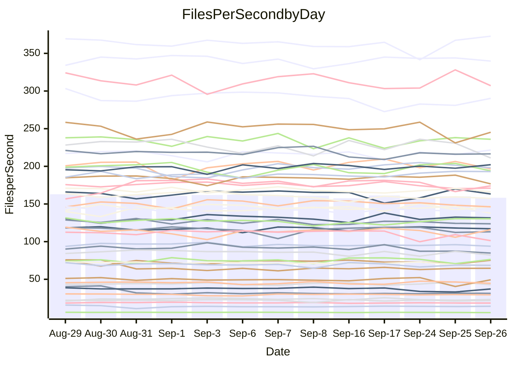

<!---
# This file is auto-generated. Do not edit.
# cspell:disable
--->
# Performance Report

## Daily Performance

```mermaid
xychart-beta
    title Files Per Second by Day
    y-axis Files per Second
    x-axis Date [Aug-29, Aug-30, Aug-31, Sep-1, Sep-3, Sep-6, Sep-7, Sep-8, Sep-16, Sep-17, Sep-24, Sep-25, Sep-26]
    bar [162.91, 160.67, 162.16, 160.72, 161.93, 162.34, 161.56, 160.97, 157.55, 161.35, 159.12, 160.20, 158.22]
    line [40.28, 41.27, 31.95, 30.26, 32.20, 30.88, 32.09, 31.08, 30.60, 31.19, 30.72, 31.67, 31.35]
    line [200.76, 205.32, 205.73, 181.85, 198.01, 203.39, 206.55, 195.11, 205.27, 209.68, 198.18, 206.47, 196.56]
    line [43.35, 43.55, 44.33, 43.81, 45.60, 43.01, 41.97, 44.80, 45.26, 42.13, 43.68, 46.57, 42.92]
    line [6.20, 6.04, 6.23, 6.06, 6.09, 6.20, 6.14, 6.11, 5.78, 6.14, 6.07, 5.98, 5.77]
    line [75.85, 75.82, 63.83, 64.49, 61.65, 64.50, 61.26, 64.86, 63.96, 65.83, 62.91, 64.44, 64.67]
    line [93.72, 97.65, 96.80, 96.99, 99.11, 93.19, 96.28, 94.70, 94.66, 95.59, 94.92, 96.04, 93.95]
    line [18.45, 19.29, 19.08, 19.71, 18.88, 18.65, 18.65, 19.33, 18.07, 18.42, 18.78, 18.52, 18.46]
    line [118.37, 119.80, 115.33, 116.38, 118.04, 111.85, 119.40, 118.51, 114.20, 118.71, 119.64, 118.05, 117.11]
    line [141.62, 149.48, 142.85, 145.28, 149.46, 148.18, 143.83, 145.01, 146.41, 140.36, 151.00, 142.17, 146.87]
    line [303.29, 287.37, 286.48, 293.90, 297.13, 298.52, 297.48, 293.09, 290.03, 272.63, 282.67, 280.96, 290.27]
    line [90.17, 94.03, 90.40, 91.22, 98.55, 92.55, 91.52, 92.79, 89.51, 95.95, 87.21, 87.42, 84.85]
    line [30.59, 30.45, 30.07, 29.95, 28.16, 27.92, 30.43, 29.89, 30.21, 29.92, 29.23, 29.70, 29.34]
    line [21.16, 23.95, 23.30, 24.27, 25.24, 24.42, 23.30, 24.35, 22.54, 25.54, 23.00, 22.21, 23.20]
    line [237.91, 239.06, 235.45, 226.56, 239.54, 233.61, 243.66, 223.35, 237.82, 223.98, 233.86, 238.09, 235.93]
    line [74.92, 67.44, 74.93, 71.42, 69.97, 74.43, 74.58, 74.02, 75.50, 72.83, 73.03, 70.23, 75.31]
    line [15.75, 15.00, 11.10, 13.64, 14.09, 13.63, 13.57, 13.40, 13.81, 14.35, 14.04, 13.83, 14.25]
    line [175.74, 172.74, 175.87, 178.56, 179.08, 174.59, 177.44, 173.15, 174.36, 179.74, 174.18, 170.43, 171.01]
    line [166.00, 163.99, 156.90, 161.76, 167.23, 165.73, 167.27, 165.39, 165.37, 151.18, 158.06, 170.07, 163.26]
    line [170.94, 170.42, 165.85, 172.14, 164.57, 168.71, 172.84, 167.97, 166.22, 164.57, 167.61, 170.71, 166.04]
    line [334.12, 345.07, 342.66, 347.17, 346.14, 336.60, 342.41, 329.55, 336.36, 345.01, 343.35, 343.97, 339.75]
    line [118.41, 118.01, 115.40, 119.50, 117.17, 114.93, 104.04, 116.42, 117.89, 118.96, 119.04, 112.27, 113.14]
    line [119.18, 113.59, 115.52, 110.36, 102.65, 114.46, 112.83, 115.47, 113.56, 117.79, 114.76, 105.80, 116.05]
    line [22.23, 21.90, 22.46, 21.60, 23.03, 22.85, 22.27, 19.18, 23.11, 21.10, 22.62, 21.27, 21.88]
    line [74.03, 75.97, 71.20, 78.69, 74.68, 74.33, 75.84, 70.78, 78.20, 78.52, 76.56, 70.74, 76.39]
    line [51.15, 52.21, 48.60, 50.89, 48.97, 49.35, 49.58, 48.85, 47.97, 51.02, 52.29, 40.48, 49.31]
    line [197.82, 199.85, 197.57, 186.50, 184.53, 195.23, 203.47, 198.25, 196.22, 201.98, 205.02, 201.39, 198.19]
    line [156.76, 164.43, 180.88, 181.23, 183.21, 177.43, 180.28, 172.77, 180.61, 181.38, 178.77, 166.50, 174.07]
    line [130.95, 124.42, 129.63, 128.97, 135.94, 133.80, 132.37, 129.87, 125.28, 138.07, 129.51, 132.51, 131.59]
    line [72.99, 72.24, 73.05, 70.19, 72.55, 71.94, 71.15, 71.34, 71.01, 71.23, 73.00, 69.32, 68.66]
    line [217.16, 219.42, 220.41, 214.04, 205.97, 219.44, 217.73, 216.08, 219.15, 208.36, 218.68, 215.66, 221.62]
    line [128.83, 125.51, 130.73, 123.39, 129.29, 124.27, 129.39, 122.55, 122.88, 127.08, 126.63, 124.32, 123.66]
    line [146.03, 152.71, 150.80, 143.28, 155.69, 153.87, 147.46, 154.39, 153.96, 150.40, 151.64, 148.32, 146.25]
    line [228.23, 232.86, 232.26, 235.92, 225.53, 217.15, 227.16, 213.82, 234.37, 222.15, 235.99, 230.67, 211.13]
    line [198.91, 200.77, 202.09, 205.14, 192.22, 184.22, 194.88, 202.40, 191.56, 190.37, 202.02, 203.87, 193.99]
    line [184.77, 186.94, 187.25, 183.77, 174.20, 186.05, 185.31, 184.47, 182.86, 186.84, 185.48, 188.32, 176.75]
    line [185.55, 193.26, 183.54, 188.75, 189.86, 184.03, 189.81, 189.01, 187.14, 185.91, 190.99, 193.37, 193.10]
    line [112.47, 111.83, 109.19, 115.12, 112.97, 114.35, 112.51, 113.70, 114.44, 114.03, 99.84, 109.30, 101.33]
    line [38.79, 37.24, 37.32, 37.33, 38.42, 37.82, 37.98, 39.62, 37.64, 38.51, 33.90, 33.12, 37.14]
    line [139.89, 133.31, 145.80, 144.08, 140.79, 141.02, 143.66, 145.59, 142.94, 143.60, 144.39, 146.81, 137.70]
    line [369.32, 367.60, 361.65, 359.68, 367.46, 363.32, 365.30, 359.11, 358.89, 364.75, 341.57, 367.34, 372.82]
    line [221.13, 216.69, 219.64, 218.57, 218.78, 215.63, 224.82, 226.65, 212.42, 209.15, 217.97, 216.10, 216.56]
    line [45.50, 46.05, 46.44, 45.45, 46.41, 42.91, 44.10, 47.18, 43.88, 43.41, 47.56, 46.43, 44.69]
    line [84.25, 86.47, 88.91, 88.27, 86.74, 86.90, 85.78, 86.18, 80.59, 86.98, 80.71, 87.03, 82.23]
    line [131.60, 124.76, 128.19, 130.51, 127.29, 128.13, 127.03, 120.72, 125.41, 122.07, 126.43, 130.53, 130.38]
    line [258.39, 253.25, 236.21, 242.44, 258.87, 252.44, 256.07, 255.58, 248.63, 249.79, 258.60, 231.14, 245.25]
    line [72.12, 68.00, 70.47, 70.89, 69.29, 68.94, 69.89, 64.77, 72.12, 70.50, 66.34, 68.88, 68.57]
    line [324.16, 313.60, 308.04, 321.08, 295.70, 309.43, 319.09, 322.91, 311.02, 303.26, 304.00, 328.11, 307.10]
    line [195.50, 193.96, 199.31, 199.53, 189.39, 201.97, 197.12, 203.70, 201.07, 195.90, 200.29, 197.49, 202.21]
    line [164.02, 158.84, 162.35, 165.15, 167.75, 162.42, 161.26, 158.45, 152.45, 160.47, 157.19, 159.48, 157.38]
    line [146.55, 142.25, 144.70, 138.76, 142.53, 146.03, 141.67, 142.57, 136.52, 144.05, 141.65, 140.89, 140.51]
```

## Time to Process Files

| Repository                                      | Elapsed | Min/Avg/Max           |   SD | SD Graph                |
| ----------------------------------------------- | ------: | :-------------------: | ---: | ----------------------- |
| AdaDoom3/AdaDoom3                    |    3.43 | 3.4 /   3.5 /   4.5   | 0.25 | `    ┣━━┻━●╋━━┻━━┫    ` |
| alexiosc/megistos                    |    7.86 | 7.5 /   8.0 /   9.4   | 0.45 | `    ┣━━┻━●╋━━┻━━┫    ` |
| apollographql/apollo-server          |    3.04 | 2.6 /   2.8 /   2.9   | 0.11 | `    ┣━━┻━━╋━━┻━━┫●   ` |
| aspnetboilerplate/aspnetboilerplate  |   10.36 | 10.2 /  10.5 /  11.1  | 0.22 | `    ┣━━┻●━╋━━┻━━┫    ` |
| aws-amplify/docs                     |   12.80 | 12.5 /  13.2 /  14.2  | 0.42 | `    ┣━━●━━╋━━┻━━┫    ` |
| Azure/azure-rest-api-specs           |    9.90 | 9.4 /   9.8 /  10.6   | 0.34 | `    ┣━━┻━━╋●━┻━━┫    ` |
| bitjson/typescript-starter           |    1.08 | 1.0 /   1.1 /   1.1   | 0.03 | `     ┣━━┻━╋●┻━━┫     ` |
| caddyserver/caddy                    |    3.84 | 3.6 /   3.8 /   4.3   | 0.16 | `    ┣━━┻━━╋●━┻━━┫    ` |
| canada-ca/open-source-logiciel-libre |    1.18 | 1.1 /   1.2 /   1.3   | 0.04 | `     ┣━┻━━╋●━┻━┫     ` |
| chef/chef                            |    6.16 | 5.8 /   6.1 /   6.6   | 0.18 | `    ┣━━┻━━╋●━┻━━┫    ` |
| dart-lang/sdk                        |   67.69 | 64.5 /  67.2 /  73.0  | 1.84 | `  ┣━━━┻━━━╋●━━┻━━━┫  ` |
| django/django                        |   17.50 | 14.9 /  15.5 /  16.4  | 0.35 | `      ┣━┻━╋━┻━┫     ●` |
| eslint/eslint                        |   10.76 | 10.7 /  11.1 /  11.9  | 0.30 | `    ┣━●┻━━╋━━┻━━┫    ` |
| exonum/exonum                        |    3.61 | 3.5 /   3.7 /   4.1   | 0.14 | `    ┣━━┻●━╋━━┻━━┫    ` |
| flutter/samples                      |   16.96 | 16.3 /  17.0 /  19.7  | 0.77 | `   ┣━━━┻━━●━━┻━━━┫   ` |
| gitbucket/gitbucket                  |    3.68 | 3.5 /   3.6 /   4.0   | 0.15 | `    ┣━━┻━━╋━●┻━━┫    ` |
| googleapis/google-cloud-cpp          |  145.46 | 139.0 / 145.8 / 163.3 | 5.12 | `  ┣━━━┻━━━●━━━┻━━━┫  ` |
| graphql/express-graphql              |    1.16 | 1.1 /   1.2 /   1.4   | 0.06 | `     ┣━┻━●╋━━┻━┫     ` |
| graphql/graphql-js                   |    2.95 | 2.7 /   2.9 /   3.1   | 0.09 | `     ┣━┻━━╋━●┻━┫     ` |
| graphql/graphql-relay-js             |    1.34 | 1.1 /   1.2 /   1.3   | 0.07 | `     ┣━┻━━╋━━┻━┫●    ` |
| graphql/graphql-spec                 |    1.33 | 1.0 /   1.3 /   1.5   | 0.13 | `     ┣━┻━━╋●━┻━┫     ` |
| iluwatar/java-design-patterns        |   12.78 | 12.8 /  13.3 /  14.9  | 0.49 | `    ┣━━●━━╋━━┻━━┫    ` |
| ktaranov/sqlserver-kit               |    7.54 | 6.6 /   6.8 /   7.1   | 0.16 | `     ┣━━┻━╋━┻━━┫    ●` |
| liriliri/licia                       |    4.17 | 4.1 /   4.2 /   4.4   | 0.08 | `    ┣━━┻●━╋━━┻━━┫    ` |
| MartinThoma/LaTeX-examples           |    7.12 | 6.9 /   7.2 /   7.8   | 0.26 | `    ┣━━┻━●╋━━┻━━┫    ` |
| mdx-js/mdx                           |    2.15 | 1.9 /   2.0 /   2.2   | 0.07 | `     ┣━┻━━╋━━┻━●     ` |
| microsoft/TypeScript-Website         |    5.92 | 5.5 /   5.8 /   6.5   | 0.28 | `    ┣━━┻━━╋●━┻━━┫    ` |
| MicrosoftDocs/PowerShell-Docs        |   33.69 | 23.3 /  24.2 /  27.1  | 0.81 | `        ┣┻╋┻┫       ●` |
| neovim/nvim-lspconfig                |    4.42 | 4.2 /   4.3 /   4.5   | 0.09 | `    ┣━━┻━━╋━━●━━┫    ` |
| pagekit/pagekit                      |    3.88 | 3.5 /   3.7 /   4.1   | 0.12 | `    ┣━━┻━━╋━━┻━●┫    ` |
| php/php-src                          |   27.81 | 25.3 /  26.8 /  29.3  | 1.05 | `   ┣━━━┻━━╋━━●━━━┫   ` |
| plasticrake/tplink-smarthome-api     |    1.36 | 1.3 /   1.4 /   1.6   | 0.07 | `     ┣━┻━●╋━━┻━┫     ` |
| prettier/prettier                    |    7.62 | 7.0 /   7.3 /   7.9   | 0.27 | `    ┣━━┻━━╋━━●━━┫    ` |
| pycontribs/jira                      |    1.57 | 1.5 /   1.6 /   2.0   | 0.10 | `     ┣━┻━●╋━━┻━┫     ` |
| RustPython/RustPython                |    5.27 | 5.2 /   5.4 /   5.7   | 0.15 | `    ┣━━┻●━╋━━┻━━┫    ` |
| shoelace-style/shoelace              |    2.96 | 2.9 /   3.0 /   3.1   | 0.07 | `     ┣━┻●━╋━━┻━┫     ` |
| slint-ui/slint                       |   12.73 | 12.2 /  12.9 /  15.5  | 0.77 | `   ┣━━━┻━●╋━━┻━━━┫   ` |
| SoftwareBrothers/admin-bro           |    2.61 | 2.5 /   2.6 /   2.8   | 0.06 | `     ┣━┻━━●━━┻━┫     ` |
| sveltejs/svelte                      |   21.64 | 20.2 /  21.6 /  23.2  | 0.57 | `   ┣━━━┻━━╋●━┻━━━┫   ` |
| TheAlgorithms/Python                 |    5.98 | 5.7 /   5.9 /   6.3   | 0.18 | `    ┣━━┻━━╋●━┻━━┫    ` |
| twbs/bootstrap                       |    1.85 | 1.5 /   1.8 /   2.0   | 0.13 | `     ┣━┻━━╋●━┻━┫     ` |
| typescript-cheatsheets/react         |    1.35 | 1.3 /   1.4 /   1.6   | 0.06 | `     ┣━●━━╋━━┻━┫     ` |
| typescript-eslint/typescript-eslint  |    4.41 | 4.2 /   4.4 /   4.7   | 0.15 | `    ┣━━┻━━●━━┻━━┫    ` |
| vitest-dev/vitest                    |   11.34 | 9.2 /   9.8 /  12.0   | 0.66 | `    ┣━━┻━━╋━━┻━━┫ ●  ` |
| w3c/aria-practices                   |    3.53 | 3.4 /   3.5 /   3.8   | 0.10 | `    ┣━━┻━━●━━┻━━┫    ` |
| w3c/specberus                        |    2.09 | 2.0 /   2.1 /   2.2   | 0.04 | `     ┣━┻━━╋●━┻━┫     ` |
| webdeveric/webpack-assets-manifest   |    1.27 | 1.2 /   1.2 /   1.3   | 0.04 | `     ┣━┻━━╋━●┻━┫     ` |
| webpack/webpack                      |    5.52 | 5.3 /   5.7 /   6.1   | 0.17 | `    ┣━━┻●━╋━━┻━━┫    ` |
| wireapp/wire-desktop                 |    1.39 | 1.0 /   1.3 /   1.4   | 0.13 | `     ┣━┻━━╋━●┻━┫     ` |
| wireapp/wire-webapp                  |   11.22 | 10.8 /  11.2 /  12.1  | 0.38 | `    ┣━━┻━━●━━┻━━┫    ` |

Note:
- Elapsed time is in seconds.

## Files per Second over Time

| Repository                                      | Files |    Sec |    Fps |     Rel | Trend Fps              |    N |
| ----------------------------------------------- | ----: | -----: | -----: | ------: | ---------------------- | ---: |
| AdaDoom3/AdaDoom3                    |   103 |   3.43 |  30.05 |   1.45% | `█████▆█▂███▇███▇▇▆██` |   21 |
| alexiosc/megistos                    |   583 |   7.86 |  74.19 |   1.58% | `▃▃▇█▆▆▇▇▇▇▇▇█▇▇▇▆█▇▇` |   21 |
| apollographql/apollo-server          |   252 |   3.04 |  82.99 |  -9.43% | `▇▄█▆▅▅█▆▆▅▄▇▆▄▅▇▄▄▄▂` |   20 |
| aspnetboilerplate/aspnetboilerplate  |  2286 |  10.36 | 220.74 |   1.41% | `▇█▇▇▆▅▇▇█▇▇▆▆█▅▇▆▇█▇` |   21 |
| aws-amplify/docs                     |  2871 |  12.80 | 224.26 |   3.18% | `▆▇▅█▆▆▇▄▇▇▇█▅▆▅▆▆▆▄▇` |   21 |
| Azure/azure-rest-api-specs           |  2459 |   9.90 | 248.27 |  -0.52% | `█▇▅▄▆█▇▇▇████▆▇█▄▅▆▇` |   21 |
| bitjson/typescript-starter           |    20 |   1.08 |  18.52 |  -1.39% | `▇▇▇▇█▆▆▆▆▆▆▇▄▆▆▆▆▆▅▆` |   21 |
| caddyserver/caddy                    |   286 |   3.84 |  74.46 |  -1.05% | `▇▆▇▃█▆▆▆▇▆█▅███▇▅█▇▆` |   21 |
| canada-ca/open-source-logiciel-libre |     7 |   1.18 |   5.93 |  -1.96% | `▇▆█▇▇▇█▇██▇▇▇▃▇▇▆▄▆▆` |   21 |
| chef/chef                            |  1208 |   6.16 | 195.99 |  -1.42% | `▇▄▆▇▇▅█▇▇█▅█▇▇▆▇▆██▆` |   21 |
| dart-lang/sdk                        | 10560 |  67.69 | 155.99 |  -2.64% | `▅▇▇▇██▇▆█▆▇▆▆▄▇▆▆▆▆▆` |   21 |
| django/django                        |  2874 |  17.50 | 164.22 | -11.20% | `▇█▇▇▆▄▆▇██▆▇▆▆▇▇▇▅▇▂` |   21 |
| eslint/eslint                        |  2093 |  10.76 | 194.56 |   3.15% | `▇█▄▇▇▇▄▆▇▇▆▇▅▇▆▇██▇█` |   21 |
| exonum/exonum                        |   421 |   3.61 | 116.61 |   2.65% | `▅█▇█▆▄▇▇▇▇▆▇▇▆█▇▄█▇█` |   21 |
| flutter/samples                      |  2400 |  16.96 | 141.51 |   0.24% | `▃▇███▇▆█▇▇██▇█▇██▄▇▇` |   21 |
| gitbucket/gitbucket                  |   413 |   3.68 | 112.14 |  -2.79% | `██▇▇█▇█▅█▄▄▇█▇██▆▇▆▆` |   21 |
| googleapis/google-cloud-cpp          | 20764 | 145.46 | 142.75 |   0.38% | `▅▇▇▇▆▇█▆█▇▆▇▃▇▇▆▆▆▆▇` |   21 |
| graphql/express-graphql              |    26 |   1.16 |  22.43 |   1.50% | `▄▆▆▇▆▇▇▇▇▆▇▃▆█▅▇▅▅▆▆` |   21 |
| graphql/graphql-js                   |   364 |   2.95 | 123.26 |  -2.14% | `▆▇█▆▅▇▄▆▇█▆▅▅▅▆▆▆▅▆▅` |   21 |
| graphql/graphql-relay-js             |    28 |   1.34 |  20.84 | -12.11% | `▆▇▃█▇█▇▆█▆▅▇▃▆█▅▄▇▆▃` |   21 |
| graphql/graphql-spec                 |    19 |   1.33 |  14.30 |   3.42% | `██▂▂▅▆▄▆▆▅▅▅▆▅▆▆▆▆▆▆` |   21 |
| iluwatar/java-design-patterns        |  1992 |  12.78 | 155.93 |   3.73% | `█▇█▆▅█▇██▅▇███▇▇▆▇▃█` |   21 |
| ktaranov/sqlserver-kit               |   489 |   7.54 |  64.88 |  -9.45% | `▅▇█▆▆▇▅▇█▇▅▆▆▆▆▇▅▅▇▂` |   21 |
| liriliri/licia                       |  1437 |   4.17 | 344.66 |   1.20% | `███▇██▇▇▆▇█▆▅████▇▆█` |   21 |
| MartinThoma/LaTeX-examples           |  1409 |   7.12 | 197.95 |   1.12% | `█▆▇██▆▄▄▅▆▇█▆▅▅██▆▅▇` |   21 |
| mdx-js/mdx                           |   141 |   2.15 |  65.71 |  -5.39% | `▆▄█▅▆▆▆▆▅▆▆▄▆█▆▄▆▇▅▄` |   21 |
| microsoft/TypeScript-Website         |   761 |   5.92 | 128.45 |  -1.60% | `▅▃▇▅▆██▇▇▇▇▆▇▃█▆▇▆█▆` |   21 |
| MicrosoftDocs/PowerShell-Docs        |  2708 |  33.69 |  80.38 | -28.23% | `▇▇▅▇█▇▇██▆█▇█▇▇▃▆▇▇ ` |   21 |
| neovim/nvim-lspconfig                |   760 |   4.42 | 172.13 |  -1.48% | `▆▅▆███▇▆█▇█▆▇▇█▇▆▅▆▆` |   21 |
| pagekit/pagekit                      |   741 |   3.88 | 190.91 |  -5.67% | `▆██▇▃▆▇█▇█▇▆█▇█▆▇▆▇▅` |   21 |
| php/php-src                          |  2296 |  27.81 |  82.55 |  -3.43% | `▆▆█▇▇▇▇▆█▇▆▇▅▄▇▄▇▆▄▅` |   21 |
| plasticrake/tplink-smarthome-api     |    62 |   1.36 |  45.52 |   1.02% | `█▇▇▇▇▇▃▆▆▆▆██▄▅█▇▇▅▇` |   21 |
| prettier/prettier                    |  2305 |   7.62 | 302.61 |  -3.18% | `█▆▇▅▇▄▆▄█▆██▆▆▅▅█▄█▅` |   21 |
| pycontribs/jira                      |    79 |   1.57 |  50.16 |   1.44% | `███▅▇▇▇█▆▆█▆▆▆██▂▆▇▇` |   21 |
| RustPython/RustPython                |   687 |   5.27 | 130.47 |   2.62% | `▇▆▆▇▇▆▇▇▇▇▆▄▅▇▅▆▇█▇▇` |   21 |
| shoelace-style/shoelace              |   439 |   2.96 | 148.10 |   1.42% | `█▇▆▅▆██▆█▇▅▆▇▇▅█▅▆▇▇` |   21 |
| slint-ui/slint                       |  2263 |  12.73 | 177.71 |   1.57% | `▇▃█████▇▇▇█▇▇██▇▆▇▆▇` |   21 |
| SoftwareBrothers/admin-bro           |   441 |   2.61 | 168.76 |   0.25% | `█▇▇▅█▆▇▇▇▇█▇▅▇▆▆▇▅▇▇` |   21 |
| sveltejs/svelte                      |  7920 |  21.64 | 365.94 |   0.51% | `▆▆▇▅▆▇▇▆▆▆▇▆▆▅▆▄▇█▇▇` |   21 |
| TheAlgorithms/Python                 |  1396 |   5.98 | 233.37 |  -0.99% | `█▆▅█▅▇▅█▅██▄▇▇▄▆▇▇▆▆` |   21 |
| twbs/bootstrap                       |   118 |   1.85 |  63.63 |  -3.82% | `█▅▄▄▄▃▃▄▄▄▂▄▃▄▄▃▄▄▄▄` |   21 |
| typescript-cheatsheets/react         |    53 |   1.35 |  39.12 |   4.93% | `▅▇▇▅▆▇▇▇▇█▆█▇▆▇▄▃▅▆█` |   21 |
| typescript-eslint/typescript-eslint  |  1279 |   4.41 | 290.11 |  -0.29% | `▅█▄█▇██████▇▆█▄▆▅▆█▇` |   21 |
| vitest-dev/vitest                    |  2215 |  11.34 | 195.31 | -13.98% | `█▇▇██▇▇▂█▆█▅▇█▆█▇▄█▄` |   21 |
| w3c/aria-practices                   |   414 |   3.53 | 117.34 |   0.40% | `██▅▇▆▇▄▆▄▇█▇▅▆▇▇▇▇▆▇` |   21 |
| w3c/specberus                        |   198 |   2.09 |  94.87 |  -0.69% | `▆█▆▇▇█▆▆▄▆▇▆▆▆▆▆▆▅▆▆` |   21 |
| webdeveric/webpack-assets-manifest   |    54 |   1.27 |  42.50 |  -2.90% | `▅▄▇▆▆▇▇▅▄▄▄▇▇▇▅▆█▅▅▅` |   21 |
| webpack/webpack                      |  1119 |   5.52 | 202.68 |   2.63% | `▆▆▇▅▄▄▆▅▆▆█▆▆▅▇▇▇▅▆▇` |   21 |
| wireapp/wire-desktop                 |    43 |   1.39 |  31.02 |  -6.44% | `█▇▃▃▂▃▂▂▃▃▃▃▂▂▃▂▃▂▃▃` |   21 |
| wireapp/wire-webapp                  |  1835 |  11.22 | 163.57 |   0.03% | `█▅▅▅▆▇▇▇▇▇█▇▇▇▄▅██▅▇` |   21 |

## Data Throughput

| Repository                                      | Files |    Sec |     Kps |     Rel | Trend Kps              |    N |
| ----------------------------------------------- | ----: | -----: | ------: | ------: | ---------------------- | ---: |
| AdaDoom3/AdaDoom3                    |   103 |   3.43 |  638.56 |   1.45% | `█████▆█▂███▇███▇▇▆██` |   21 |
| alexiosc/megistos                    |   583 |   7.86 |  582.98 |   1.58% | `▃▃▇█▆▆▇▇▇▇▇▇█▇▇▇▆█▇▇` |   21 |
| apollographql/apollo-server          |   252 |   3.04 |  667.58 |  -9.43% | `▇▄█▆▅▅█▆▆▅▄▇▆▄▅▇▄▄▄▂` |   20 |
| aspnetboilerplate/aspnetboilerplate  |  2286 |  10.36 |  537.08 |   1.41% | `▇█▇▇▆▅▇▇█▇▇▆▆█▅▇▆▇█▇` |   21 |
| aws-amplify/docs                     |  2871 |  12.80 |  783.08 |   3.18% | `▆▇▅█▆▆▇▄▇▇▇█▅▆▅▆▆▆▄▇` |   21 |
| Azure/azure-rest-api-specs           |  2459 |   9.90 |  654.56 |  -0.86% | `█▇▅▄▆█▇█▇██▇▇▅▆█▄▅▆▆` |   21 |
| bitjson/typescript-starter           |    20 |   1.08 |   74.07 |  -1.39% | `▇▇▇▇█▆▆▆▆▆▆▇▄▆▆▆▆▆▅▆` |   21 |
| caddyserver/caddy                    |   286 |   3.84 |  635.47 |  -1.09% | `▇▆▇▃█▆▆▆▇▆█▅███▇▅█▇▆` |   21 |
| canada-ca/open-source-logiciel-libre |     7 |   1.18 |   49.13 |  -1.96% | `▇▆█▇▇▇█▇██▇▇▇▃▇▇▆▄▆▆` |   21 |
| chef/chef                            |  1208 |   6.16 |  905.15 |  -1.44% | `▇▄▆▇▇▅█▇▇█▅█▇▇▆▇▆██▆` |   21 |
| dart-lang/sdk                        | 10560 |  67.69 | 1071.37 |  -1.66% | `▅▆▇▇██▇▆█▆▇▆▆▄▇▆▇▆▆▆` |   21 |
| django/django                        |  2874 |  17.50 | 1028.64 | -11.28% | `▇█▇▇▆▄▆▇██▆▇▇▆▇▇▇▅▇▂` |   21 |
| eslint/eslint                        |  2093 |  10.76 | 1397.78 |   2.37% | `▇█▄▇▇▇▄▆▇▇▆▇▅▇▆▇▇▇▇▇` |   21 |
| exonum/exonum                        |   421 |   3.61 | 1115.42 |   2.65% | `▅█▇█▆▄▇▇▇▇▆▇▇▆█▇▄█▇█` |   21 |
| flutter/samples                      |  2400 |  16.96 | 1262.78 |   0.24% | `▃▇███▇▆█▇▇██▇█▇██▄▇▇` |   21 |
| gitbucket/gitbucket                  |   413 |   3.68 |  509.67 |  -2.79% | `██▇▇█▇█▅█▄▄▇█▇██▆▇▆▆` |   21 |
| googleapis/google-cloud-cpp          | 20764 | 145.46 | 1157.93 |   0.62% | `▅▇▇▇▆▇█▆█▇▆▇▃█▇▇▆▆▆▇` |   21 |
| graphql/express-graphql              |    26 |   1.16 |  102.68 |   1.50% | `▄▆▆▇▆▇▇▇▇▆▇▃▆█▅▇▅▅▆▆` |   21 |
| graphql/graphql-js                   |   364 |   2.95 |  708.40 |  -2.14% | `▆▇█▆▅▇▄▆▇█▆▅▅▅▆▆▆▅▆▅` |   21 |
| graphql/graphql-relay-js             |    28 |   1.34 |   81.87 | -12.11% | `▆▇▃█▇█▇▆█▆▅▇▃▆█▅▄▇▆▃` |   21 |
| graphql/graphql-spec                 |    19 |   1.33 |  477.26 |   1.62% | `██▂▂▄▄▃▄▄▄▃▄▅▄▅▄▄▅▅▅` |   21 |
| iluwatar/java-design-patterns        |  1992 |  12.78 |  481.95 |   3.73% | `█▇█▆▅█▇██▅▇███▇▇▆▇▃█` |   21 |
| ktaranov/sqlserver-kit               |   489 |   7.54 |  982.39 |  -9.44% | `▅▇█▆▆▇▅▇█▇▅▆▆▆▆▇▅▅▇▂` |   21 |
| liriliri/licia                       |  1437 |   4.17 |  410.62 |   1.20% | `███▇██▇▇▆▇█▆▅████▇▆█` |   21 |
| MartinThoma/LaTeX-examples           |  1409 |   7.12 |  408.83 |   1.12% | `█▆▇██▆▄▄▅▆▇█▆▅▅██▆▅▇` |   21 |
| mdx-js/mdx                           |   141 |   2.15 |  305.71 |  -5.39% | `▆▄█▅▆▆▆▆▅▆▆▄▆█▆▄▆▇▅▄` |   21 |
| microsoft/TypeScript-Website         |   761 |   5.92 |  888.32 |  -1.60% | `▅▃▇▅▆██▇▇▇▇▆▇▃█▆▇▆█▆` |   21 |
| MicrosoftDocs/PowerShell-Docs        |  2708 |  33.69 |  826.71 | -28.22% | `▇▇▅▇█▇▇██▆█▇█▇▇▃▆▇▇ ` |   21 |
| neovim/nvim-lspconfig                |   760 |   4.42 |  285.16 |  -0.97% | `▆▅▆███▇▅▇▇█▆▇▇█▇▆▅▆▆` |   21 |
| pagekit/pagekit                      |   741 |   3.88 |  398.05 |  -5.67% | `▆██▇▃▆▇█▇█▇▆█▇█▆▇▆▇▅` |   21 |
| php/php-src                          |  2296 |  27.81 | 1434.88 |  -3.54% | `▆▆█▇▇▇▇▆█▇▆▆▅▃▇▄▇▆▄▅` |   21 |
| plasticrake/tplink-smarthome-api     |    62 |   1.36 |  245.94 |   1.02% | `█▇▇▇▇▇▃▆▆▆▆██▄▅█▇▇▅▇` |   21 |
| prettier/prettier                    |  2305 |   7.62 |  427.72 |  -3.42% | `█▆▇▅▇▄▆▄█▆██▆▆▅▅█▄▇▅` |   21 |
| pycontribs/jira                      |    79 |   1.57 |  355.57 |   1.44% | `███▅▇▇▇█▆▆█▆▆▆██▂▆▇▇` |   21 |
| RustPython/RustPython                |   687 |   5.27 | 1030.45 |   2.97% | `▇▆▆▇▇▆▇▇▇▇▆▄▅▆▅▆▇█▇▇` |   21 |
| shoelace-style/shoelace              |   439 |   2.96 |  715.52 |   1.42% | `█▇▆▅▆██▆█▇▅▆▇▇▅█▅▆▇▇` |   21 |
| slint-ui/slint                       |  2263 |  12.73 | 1161.91 |   1.67% | `▇▃█████▇▇▇█▇▇██▇▆▇▆▇` |   21 |
| SoftwareBrothers/admin-bro           |   441 |   2.61 |  371.97 |   0.25% | `█▇▇▅█▆▇▇▇▇█▇▅▇▆▆▇▅▇▇` |   21 |
| sveltejs/svelte                      |  7920 |  21.64 |  244.84 |   0.49% | `▆▆▇▅▆▇▇▆▆▆▇▆▆▅▆▄▇█▇▇` |   21 |
| TheAlgorithms/Python                 |  1396 |   5.98 |  593.12 |  -0.93% | `█▆▅█▅▇▅█▅██▄▇▇▄▆▇▇▆▆` |   21 |
| twbs/bootstrap                       |   118 |   1.85 |  522.01 |  -3.85% | `█▅▄▄▄▃▃▄▄▄▂▄▃▄▄▃▄▄▄▄` |   21 |
| typescript-cheatsheets/react         |    53 |   1.35 |  289.37 |   4.93% | `▅▇▇▅▆▇▇▇▇█▆█▇▆▇▄▃▅▆█` |   21 |
| typescript-eslint/typescript-eslint  |  1279 |   4.41 | 1485.01 |  -0.09% | `▅█▄█▇██████▇▆█▄▆▆▆█▇` |   21 |
| vitest-dev/vitest                    |  2215 |  11.34 |  440.88 | -13.54% | `█▇▇██▇▇▂█▆█▅▇█▆█▇▄█▄` |   21 |
| w3c/aria-practices                   |   414 |   3.53 | 1094.07 |   0.56% | `██▅▇▆▇▄▆▄▇█▇▅▆▇█▇█▆▇` |   21 |
| w3c/specberus                        |   198 |   2.09 |  298.02 |  -0.69% | `▆█▆▇▇█▆▆▄▆▇▆▆▆▆▆▆▅▆▆` |   21 |
| webdeveric/webpack-assets-manifest   |    54 |   1.27 |   99.94 |  -2.90% | `▅▄▇▆▆▇▇▅▄▄▄▇▇▇▅▆█▅▅▅` |   21 |
| webpack/webpack                      |  1119 |   5.52 |  918.66 |   2.50% | `▆▆▇▅▄▄▆▅▆▆█▆▆▅▇▇▇▅▆▇` |   21 |
| wireapp/wire-desktop                 |    43 |   1.39 |  143.54 |  -2.84% | `█▇▃▃▂▃▂▂▃▃▃▃▂▂▃▃▄▃▄▃` |   21 |
| wireapp/wire-webapp                  |  1835 |  11.22 |  587.26 |   0.40% | `█▅▅▅▆▇▇▇▇▇▇▇▇▇▄▅██▅▇` |   21 |

