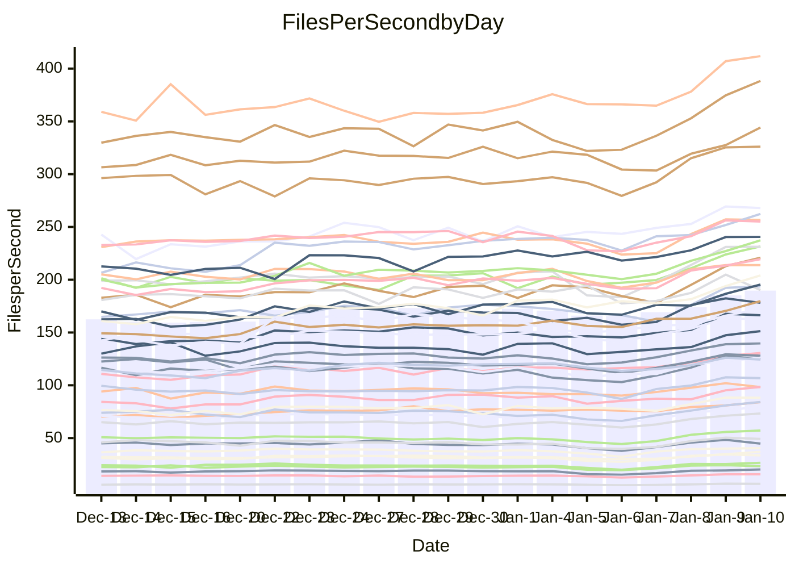

<!---
# This file is auto-generated. Do not edit.
# cspell:disable
--->
# Performance Report

Daily Performance

```mermaid
xychart-beta
    title Files Per Second by Day
    y-axis Files per Second
    x-axis Date [Dec-13, Dec-14, Dec-15, Dec-16, Dec-20, Dec-22, Dec-23, Dec-24, Dec-27, Dec-28, Dec-29, Dec-30, Jan-1, Jan-4, Jan-5, Jan-6, Jan-7, Jan-8, Jan-9, Jan-10]
    bar [162.46, 160.30, 159.32, 159.99, 160.32, 171.41, 173.30, 173.54, 170.88, 173.10, 172.87, 170.63, 172.55, 170.72, 165.99, 165.55, 169.22, 174.07, 185.19, 189.70]
    line [126.25, 125.99, 122.54, 125.77, 120.95, 129.07, 131.35, 128.71, 129.73, 130.21, 126.25, 125.32, 128.46, 125.36, 119.96, 121.55, 126.54, 132.92, 138.94, 139.65]
    line [94.05, 97.42, 87.40, 93.20, 92.02, 98.77, 95.06, 94.41, 95.55, 97.07, 96.22, 92.57, 92.92, 91.62, 91.70, 90.24, 93.64, 97.75, 101.99, 98.30]
    line [5.69, 6.12, 5.85, 6.27, 5.94, 6.19, 6.23, 6.06, 5.80, 6.19, 6.04, 6.09, 6.29, 6.13, 5.79, 5.41, 5.66, 6.15, 6.86, 6.71]
    line [201.42, 192.31, 202.71, 196.90, 201.49, 199.06, 199.67, 194.62, 190.28, 203.79, 203.98, 206.16, 191.99, 203.06, 195.28, 197.18, 199.76, 210.90, 223.95, 231.51]
    line [296.25, 298.40, 299.27, 280.90, 293.45, 278.89, 296.00, 294.23, 289.77, 295.71, 297.33, 290.64, 293.31, 297.11, 291.75, 279.45, 292.30, 315.14, 325.37, 326.01]
    line [164.74, 167.10, 169.90, 168.25, 171.20, 165.98, 169.49, 175.43, 173.51, 166.13, 173.69, 176.28, 174.86, 172.30, 168.35, 166.48, 160.20, 176.21, 192.32, 193.68]
    line [14.25, 14.42, 14.66, 14.20, 14.14, 14.58, 14.66, 13.81, 14.51, 13.39, 13.58, 14.12, 14.33, 14.46, 13.75, 12.60, 13.58, 14.59, 15.66, 15.67]
    line [144.49, 139.02, 141.78, 142.36, 140.50, 151.95, 150.33, 152.02, 150.72, 154.90, 153.82, 147.24, 149.99, 145.79, 146.47, 145.32, 149.61, 152.47, 167.66, 166.33]
    line [36.47, 38.38, 37.81, 37.32, 38.13, 39.99, 39.24, 39.22, 39.13, 37.99, 37.43, 37.30, 38.53, 37.44, 35.32, 32.27, 37.29, 39.53, 40.03, 40.48]
    line [242.80, 219.56, 233.62, 231.32, 236.32, 236.26, 240.94, 253.96, 249.85, 237.45, 249.30, 236.26, 250.59, 240.41, 245.35, 243.40, 249.06, 252.82, 269.41, 267.88]
    line [45.02, 45.75, 43.43, 44.94, 44.85, 45.35, 43.98, 45.75, 48.03, 44.47, 43.53, 43.39, 44.67, 43.92, 40.38, 37.83, 41.50, 45.72, 48.43, 44.73]
    line [70.10, 71.99, 68.96, 71.11, 72.00, 74.62, 76.21, 75.66, 76.28, 80.16, 75.45, 77.29, 76.83, 75.96, 77.04, 75.98, 75.37, 79.34, 80.97, 83.95]
    line [65.11, 62.93, 65.98, 63.02, 64.70, 64.39, 64.92, 64.92, 65.76, 63.97, 65.18, 60.36, 63.48, 65.17, 62.63, 59.94, 62.94, 68.03, 71.19, 73.31]
    line [24.27, 23.97, 21.89, 24.77, 24.75, 25.98, 24.78, 24.02, 24.07, 23.90, 24.05, 23.79, 23.47, 23.84, 21.71, 20.06, 22.54, 25.57, 25.37, 26.64]
    line [306.54, 308.67, 318.29, 308.47, 312.68, 311.01, 311.87, 322.19, 317.56, 317.24, 315.38, 325.99, 315.10, 321.37, 318.36, 304.42, 303.41, 319.39, 327.56, 344.23]
    line [99.56, 95.79, 93.99, 95.03, 91.66, 95.50, 94.32, 94.29, 94.73, 94.34, 95.29, 95.11, 98.41, 97.41, 93.11, 86.98, 96.48, 99.80, 107.59, 106.79]
    line [110.81, 107.51, 105.11, 109.29, 110.23, 118.20, 116.66, 113.51, 116.56, 110.18, 116.43, 113.57, 116.81, 116.74, 114.96, 116.34, 117.08, 121.26, 127.78, 130.56]
    line [169.99, 161.97, 169.28, 168.79, 164.45, 163.90, 173.08, 173.52, 171.67, 165.07, 170.82, 168.89, 168.46, 160.87, 163.97, 157.39, 159.96, 176.03, 182.37, 178.14]
    line [32.08, 31.89, 31.67, 31.01, 31.00, 31.79, 31.95, 32.72, 33.00, 31.56, 31.04, 31.19, 31.58, 30.98, 28.44, 27.47, 29.34, 33.19, 34.45, 33.60]
    line [70.99, 69.49, 68.20, 68.29, 71.18, 72.28, 72.81, 72.16, 72.22, 72.29, 71.63, 70.43, 69.31, 70.55, 65.48, 65.68, 67.02, 74.90, 75.80, 80.23]
    line [122.50, 124.97, 121.63, 124.44, 114.40, 117.66, 113.42, 116.57, 120.86, 116.04, 115.61, 111.25, 114.64, 107.26, 104.85, 102.99, 109.30, 116.77, 127.71, 124.88]
    line [230.85, 236.16, 237.46, 237.06, 237.81, 238.36, 240.26, 242.42, 235.97, 234.05, 235.94, 244.60, 237.90, 238.37, 234.19, 223.75, 225.18, 243.31, 257.18, 256.58]
    line [199.02, 199.50, 195.58, 198.56, 202.04, 205.76, 202.04, 203.32, 201.04, 202.44, 203.10, 195.80, 206.74, 207.91, 185.17, 183.38, 197.81, 213.96, 231.09, 231.18]
    line [22.48, 22.26, 24.16, 21.86, 22.99, 23.86, 22.95, 22.15, 22.59, 22.93, 22.71, 21.96, 22.43, 22.76, 19.93, 19.65, 21.35, 23.88, 24.29, 23.38]
    line [182.93, 185.74, 173.94, 185.68, 184.19, 188.28, 188.11, 196.54, 189.53, 183.55, 193.13, 194.30, 182.73, 194.72, 192.90, 184.51, 177.92, 195.10, 212.88, 220.91]
    line [206.57, 216.35, 210.81, 207.51, 213.81, 235.09, 232.12, 236.13, 235.71, 228.72, 232.65, 236.79, 238.66, 239.84, 237.65, 227.69, 241.17, 242.31, 251.84, 262.40]
    line [84.32, 82.91, 77.95, 81.87, 81.89, 89.30, 90.84, 89.17, 86.07, 86.04, 90.94, 91.20, 88.38, 89.72, 82.57, 85.29, 87.34, 86.74, 95.27, 98.39]
    line [129.94, 136.83, 140.59, 128.00, 132.13, 140.04, 140.36, 136.98, 135.57, 135.50, 134.25, 129.01, 139.25, 139.78, 129.55, 131.60, 134.11, 136.19, 147.37, 151.27]
    line [31.34, 29.78, 30.86, 29.89, 30.20, 33.22, 32.90, 33.40, 32.96, 33.38, 32.90, 31.64, 32.05, 31.87, 30.32, 30.13, 30.52, 32.45, 34.68, 37.03]
    line [142.44, 148.72, 148.74, 148.66, 145.81, 145.83, 151.65, 150.82, 149.41, 147.54, 148.32, 148.24, 148.81, 152.12, 144.06, 141.46, 148.01, 153.69, 163.45, 162.54]
    line [116.61, 109.61, 115.93, 113.66, 115.36, 122.68, 121.26, 119.81, 119.36, 122.21, 121.33, 118.71, 119.46, 120.59, 115.93, 111.61, 116.47, 122.24, 129.36, 128.06]
    line [205.14, 200.36, 207.64, 202.85, 200.31, 210.29, 210.04, 207.76, 200.78, 205.77, 199.55, 199.57, 206.34, 210.39, 198.78, 192.42, 197.28, 209.87, 213.91, 213.81]
    line [180.77, 185.77, 186.35, 184.33, 182.33, 191.53, 189.75, 189.98, 177.07, 192.83, 190.79, 182.79, 190.84, 188.67, 194.33, 177.58, 179.97, 187.56, 204.85, 190.23]
    line [50.78, 49.91, 50.66, 50.34, 50.02, 51.61, 51.21, 51.38, 49.64, 48.60, 49.52, 48.09, 50.03, 48.82, 46.25, 44.36, 47.22, 53.09, 55.75, 57.09]
    line [149.26, 148.44, 146.25, 144.57, 148.51, 160.26, 155.20, 157.30, 154.76, 157.76, 156.45, 156.97, 156.48, 161.27, 156.23, 155.16, 163.04, 163.18, 170.50, 179.76]
    line [73.95, 75.07, 76.77, 72.26, 69.84, 77.03, 74.27, 74.27, 73.83, 75.96, 75.41, 73.52, 70.94, 72.13, 67.68, 66.21, 71.65, 76.02, 80.93, 84.20]
    line [232.83, 233.41, 237.39, 235.87, 236.73, 241.85, 239.59, 240.67, 245.15, 245.04, 246.20, 235.52, 245.54, 241.43, 227.89, 226.93, 235.13, 241.29, 256.22, 255.11]
    line [162.41, 162.92, 155.61, 157.24, 162.25, 174.81, 169.46, 179.44, 172.82, 176.92, 167.34, 176.43, 176.94, 178.99, 168.22, 166.87, 176.13, 175.56, 186.67, 195.41]
    line [76.57, 75.62, 71.86, 75.70, 72.52, 79.52, 79.75, 79.57, 78.19, 78.53, 81.17, 72.47, 80.44, 78.06, 78.74, 77.69, 75.81, 82.18, 88.38, 88.17]
    line [113.85, 113.19, 111.86, 113.23, 116.22, 119.95, 116.76, 117.75, 118.71, 118.58, 117.32, 112.42, 116.77, 113.28, 107.29, 110.98, 110.70, 119.74, 122.80, 126.20]
    line [18.41, 18.71, 17.35, 18.44, 18.66, 19.39, 19.24, 18.95, 18.61, 19.20, 19.16, 18.64, 18.56, 18.69, 15.82, 15.37, 16.82, 19.06, 19.36, 20.32]
    line [359.05, 350.76, 385.22, 356.23, 361.41, 363.52, 371.74, 360.07, 349.58, 358.00, 357.09, 358.22, 365.46, 375.72, 366.42, 366.13, 364.89, 378.25, 407.03, 411.80]
    line [46.00, 48.05, 47.07, 45.85, 42.75, 47.52, 47.21, 45.81, 45.88, 45.34, 46.09, 44.04, 43.96, 44.61, 40.41, 39.77, 41.67, 47.14, 50.43, 49.16]
    line [200.18, 192.55, 195.85, 196.96, 197.31, 203.68, 215.88, 203.82, 209.47, 208.55, 206.80, 208.32, 210.94, 208.87, 204.66, 200.55, 205.66, 217.93, 227.16, 237.33]
    line [329.78, 336.28, 339.96, 335.03, 330.81, 346.52, 335.23, 343.48, 342.97, 326.49, 346.96, 341.41, 349.59, 332.44, 321.99, 323.13, 336.38, 352.94, 374.70, 388.34]
    line [114.58, 111.22, 109.33, 106.79, 113.91, 116.30, 113.89, 119.27, 121.25, 119.32, 118.60, 119.88, 120.18, 120.91, 116.77, 113.59, 115.36, 119.01, 126.14, 124.42]
    line [192.23, 185.43, 191.26, 188.26, 189.10, 196.56, 199.42, 199.83, 198.90, 201.82, 194.83, 201.20, 199.08, 201.68, 196.07, 191.44, 191.98, 208.77, 213.46, 219.49]
    line [212.61, 210.51, 204.56, 210.18, 211.34, 200.66, 223.22, 223.16, 220.54, 207.84, 221.69, 222.09, 227.69, 222.11, 226.42, 218.19, 221.48, 227.88, 240.46, 240.54]
    line [160.91, 157.90, 164.74, 161.04, 164.69, 164.20, 175.57, 172.74, 173.87, 177.24, 172.99, 166.08, 180.17, 181.21, 173.75, 179.71, 177.60, 181.52, 194.07, 204.11]
    line [146.06, 142.91, 137.61, 141.27, 139.39, 164.22, 164.25, 165.65, 160.55, 167.52, 164.35, 162.61, 160.21, 152.67, 150.17, 151.88, 156.83, 157.18, 166.03, 172.15]
```

Time to Process Files

| Repository                                      | Elapsed | Min/Avg/Max           |   SD | SD Graph                |
| ----------------------------------------------- | ------: | :-------------------: | ---: | ----------------------- |
| AdaDoom3/AdaDoom3                    |    2.77 | 2.8 /   3.2 /   3.6   | 0.18 | `   ●┣━━┻━━╋━━┻━━┫    ` |
| alexiosc/megistos                    |    6.92 | 6.9 /   8.0 /   9.9   | 0.54 | `    ●━━┻━━╋━━┻━━┫    ` |
| apollographql/apollo-server          |    2.65 | 2.4 /   2.7 /   3.1   | 0.13 | `     ┣━┻━●╋━━┻━┫     ` |
| aspnetboilerplate/aspnetboilerplate  |    8.55 | 8.8 /   9.9 /  12.5   | 0.65 | `   ●┣━━┻━━╋━━┻━━┫    ` |
| aws-amplify/docs                     |   11.89 | 11.8 /  13.1 /  15.9  | 0.67 | `    ●━━┻━━╋━━┻━━┫    ` |
| Azure/azure-rest-api-specs           |    9.52 | 9.1 /  10.3 /  11.7   | 0.50 | `    ┣●━┻━━╋━━┻━━┫    ` |
| bitjson/typescript-starter           |    0.93 | 1.0 /   1.1 /   1.4   | 0.10 | `     ●━┻━━╋━━┻━┫     ` |
| caddyserver/caddy                    |    3.25 | 3.2 /   3.7 /   4.3   | 0.21 | `    ●━━┻━━╋━━┻━━┫    ` |
| canada-ca/open-source-logiciel-libre |    1.07 | 1.0 /   1.2 /   1.4   | 0.08 | `     ┣━●━━╋━━┻━┫     ` |
| chef/chef                            |    5.11 | 5.2 /   5.9 /   6.8   | 0.33 | `   ●┣━━┻━━╋━━┻━━┫    ` |
| dart-lang/sdk                        |   53.45 | 53.4 /  62.6 /  70.9  | 3.80 | ` ●┣━━━┻━━━╋━━━┻━━━┫  ` |
| django/django                        |   13.03 | 13.1 /  15.2 /  17.0  | 0.82 | ` ●  ┣━━┻━━╋━━┻━━┫    ` |
| eslint/eslint                        |    9.34 | 9.4 /  10.5 /  11.3   | 0.46 | `   ●┣━━┻━━╋━━┻━━┫    ` |
| exonum/exonum                        |    3.43 | 3.2 /   3.6 /   4.1   | 0.17 | `    ┣━●┻━━╋━━┻━━┫    ` |
| flutter/samples                      |   14.35 | 14.3 /  16.4 /  17.9  | 0.83 | `  ● ┣━━┻━━╋━━┻━━┫    ` |
| gitbucket/gitbucket                  |    3.25 | 3.1 /   3.5 /   4.0   | 0.17 | `    ┣━●┻━━╋━━┻━━┫    ` |
| googleapis/google-cloud-cpp          |  118.49 | 123.1 / 135.3 / 155.9 | 8.74 | `  ●━━━┻━━━╋━━━┻━━━┫  ` |
| graphql/express-graphql              |    1.08 | 1.0 /   1.2 /   1.4   | 0.09 | `     ┣━●━━╋━━┻━┫     ` |
| graphql/graphql-js                   |    2.57 | 2.6 /   2.9 /   3.2   | 0.14 | `    ●┣━┻━━╋━━┻━┫     ` |
| graphql/graphql-relay-js             |    1.04 | 1.0 /   1.2 /   1.5   | 0.10 | `     ┣●┻━━╋━━┻━┫     ` |
| graphql/graphql-spec                 |    1.22 | 1.2 /   1.3 /   1.6   | 0.09 | `     ┣●┻━━╋━━┻━┫     ` |
| iluwatar/java-design-patterns        |   11.03 | 11.1 /  12.7 /  14.1  | 0.61 | ` ●  ┣━━┻━━╋━━┻━━┫    ` |
| ktaranov/sqlserver-kit               |    5.77 | 5.8 /   6.5 /   7.2   | 0.32 | `   ●┣━━┻━━╋━━┻━━┫    ` |
| liriliri/licia                       |    3.71 | 3.6 /   4.2 /   4.7   | 0.22 | `   ●┣━━┻━━╋━━┻━━┫    ` |
| MartinThoma/LaTeX-examples           |    6.12 | 6.1 /   7.0 /   8.5   | 0.48 | `    ┣●━┻━━╋━━┻━━┫    ` |
| mdx-js/mdx                           |    1.75 | 1.8 /   2.0 /   2.2   | 0.12 | `    ●┣━┻━━╋━━┻━┫     ` |
| microsoft/TypeScript-Website         |    4.97 | 5.0 /   5.6 /   6.2   | 0.26 | `   ●┣━━┻━━╋━━┻━━┫    ` |
| MicrosoftDocs/PowerShell-Docs        |   20.35 | 19.8 /  22.8 /  25.1  | 1.17 | `   ●━━━┻━━╋━━┻━━━┫   ` |
| neovim/nvim-lspconfig                |    4.02 | 3.9 /   4.4 /   4.9   | 0.21 | `    ●━━┻━━╋━━┻━━┫    ` |
| pagekit/pagekit                      |    3.56 | 3.4 /   3.6 /   4.0   | 0.15 | `    ┣━━┻━●╋━━┻━━┫    ` |
| php/php-src                          |   22.92 | 23.1 /  26.0 /  30.2  | 1.41 | `   ●━━━┻━━╋━━┻━━━┫   ` |
| plasticrake/tplink-smarthome-api     |    1.25 | 1.2 /   1.4 /   1.7   | 0.11 | `     ┣━●━━╋━━┻━┫     ` |
| prettier/prettier                    |    7.60 | 7.0 /   7.9 /   8.5   | 0.27 | `    ┣━━●━━╋━━┻━━┫    ` |
| pycontribs/jira                      |    1.37 | 1.4 /   1.6 /   1.9   | 0.11 | `     ●━┻━━╋━━┻━┫     ` |
| RustPython/RustPython                |    5.30 | 5.4 /   6.2 /   7.4   | 0.46 | `    ●━━┻━━╋━━┻━━┫    ` |
| shoelace-style/shoelace              |    2.71 | 2.7 /   2.9 /   3.3   | 0.13 | `     ●━┻━━╋━━┻━┫     ` |
| slint-ui/slint                       |   12.83 | 11.9 /  14.1 /  15.8  | 0.63 | `    ●━━┻━━╋━━┻━━┫    ` |
| SoftwareBrothers/admin-bro           |    2.41 | 2.4 /   2.6 /   2.9   | 0.13 | `     ●━┻━━╋━━┻━┫     ` |
| sveltejs/svelte                      |   19.85 | 19.9 /  22.5 /  24.7  | 1.03 | `  ●┣━━━┻━━╋━━┻━━━┫   ` |
| TheAlgorithms/Python                 |    5.51 | 5.4 /   5.9 /   6.7   | 0.26 | `    ┣━●┻━━╋━━┻━━┫    ` |
| twbs/bootstrap                       |    1.61 | 1.6 /   1.8 /   2.1   | 0.10 | `    ●┣━┻━━╋━━┻━┫     ` |
| typescript-cheatsheets/react         |    1.33 | 1.3 /   1.4 /   1.9   | 0.11 | `     ┣━┻●━╋━━┻━┫     ` |
| typescript-eslint/typescript-eslint  |    4.02 | 3.8 /   4.4 /   4.9   | 0.21 | `    ┣●━┻━━╋━━┻━━┫    ` |
| vitest-dev/vitest                    |    9.30 | 8.7 /   9.9 /  11.6   | 0.51 | `    ┣━●┻━━╋━━┻━━┫    ` |
| w3c/aria-practices                   |    3.48 | 3.2 /   3.5 /   4.0   | 0.19 | `    ┣━━┻━●╋━━┻━━┫    ` |
| w3c/specberus                        |    1.86 | 1.8 /   2.1 /   2.6   | 0.14 | `     ┣●┻━━╋━━┻━┫     ` |
| webdeveric/webpack-assets-manifest   |    1.20 | 1.1 /   1.3 /   1.6   | 0.10 | `     ┣━┻━●╋━━┻━┫     ` |
| webpack/webpack                      |    4.71 | 4.8 /   5.5 /   6.1   | 0.29 | `  ● ┣━━┻━━╋━━┻━━┫    ` |
| wireapp/wire-desktop                 |    1.27 | 1.2 /   1.4 /   1.7   | 0.10 | `     ┣●┻━━╋━━┻━┫     ` |
| wireapp/wire-webapp                  |    9.34 | 9.2 /  10.6 /  12.0   | 0.60 | `    ●━━┻━━╋━━┻━━┫    ` |

Note:
- Elapsed time is in seconds.

Files per Second over Time

| Repository                                      | Files |    Sec |    Fps |    Rel | Trend Fps              |    N |
| ----------------------------------------------- | ----: | -----: | -----: | -----: | ---------------------- | ---: |
| AdaDoom3/AdaDoom3                    |   103 |   2.77 |  37.23 | 16.67% | `▃▃▄▃▃▄▃▃▄▄▃▄▅▆▆▆▇▇██` |   54 |
| alexiosc/megistos                    |   583 |   6.92 |  84.21 | 14.85% | `▅▅▃▂▃▄▄▄▄▅▅▅▆▇█▇▇▇██` |   54 |
| apollographql/apollo-server          |   253 |   2.65 |  95.37 |  0.88% | `▃▅▅▅▅▄▅▅▆▅▆▆▇▇█▇███▆` |   54 |
| aspnetboilerplate/aspnetboilerplate  |  2286 |   8.55 | 267.49 | 15.58% | `▆▆▅▅▆▅▅▄▆▆▆▆▆▇▇▇▇▇▇█` |   54 |
| aws-amplify/docs                     |  2874 |  11.89 | 241.74 |  9.63% | `▆▇▇▆▅▅▆▆▆▆▆▆▇▇██████` |   54 |
| Azure/azure-rest-api-specs           |  2438 |   9.52 | 256.18 |  7.70% | `▅▆▄▃▃▄▆▅▃▄▄▅▆▇▇▇█▇▇▇` |   54 |
| bitjson/typescript-starter           |    20 |   0.93 |  21.58 | 18.17% | `▄▄▂▂▂▂▂▃▄▄▄▅▅▇▆▇▄█▆█` |   54 |
| caddyserver/caddy                    |   290 |   3.25 |  89.20 | 13.27% | `▃▅▅▅▅▅▅▅▅▄▅▅▆▇▇███▇█` |   54 |
| canada-ca/open-source-logiciel-libre |     7 |   1.07 |   6.53 |  7.86% | `▅▅▃▃▃▃▃▂▅▃▄▄▆▆█▇█▇▇▆` |   54 |
| chef/chef                            |  1196 |   5.11 | 234.25 | 16.35% | `▄▅▄▄▄▅▄▄▅▅▄▅▄██▇█▆██` |   54 |
| dart-lang/sdk                        | 10901 |  53.45 | 203.96 | 16.83% | `▅▄▆▅▅▆▅▅▅▅▅▅▅▆▇▇▇▇██` |   54 |
| django/django                        |  2891 |  13.03 | 221.86 | 16.41% | `▅▅▅▅▅▃▄▄▃▂▄▃▅▇▇▇▇▇██` |   54 |
| eslint/eslint                        |  2062 |   9.34 | 220.82 | 11.77% | `▅▅▄▅▄▄▄▄▄▆▃▇▅███▆▇██` |   54 |
| exonum/exonum                        |   421 |   3.43 | 122.68 |  5.96% | `▃▄▃▃▄▄▄▄▆▄▄▅▅█▇█▄██▇` |   54 |
| flutter/samples                      |  2441 |  14.35 | 170.10 | 13.85% | `▄▄▄▄▄▄▄▄▅▅▅▃▅██▇██▇█` |   54 |
| gitbucket/gitbucket                  |   413 |   3.25 | 127.22 |  7.23% | `▅▅▄▄▄▄▄▂▅▅▅▅▅█▇█▇▇▇▇` |   54 |
| googleapis/google-cloud-cpp          | 21013 | 118.49 | 177.35 | 13.78% | `▄▄▄▅▅▄▅▅▅▅▅▄▅▇▇▆▇▇▇█` |   54 |
| graphql/express-graphql              |    26 |   1.08 |  24.03 |  7.62% | `▄▅▂▃▃▃▃▂▅▄▅▆▇█▇█▆█▆▇` |   54 |
| graphql/graphql-js                   |   368 |   2.57 | 143.06 | 12.23% | `▅▅▃▃▄▄▄▄▅▅▅▆▄██▆██▇█` |   54 |
| graphql/graphql-relay-js             |    28 |   1.04 |  26.90 | 12.99% | `▅▅▃▃▂▃▃▂▄▅▅▇▇▇█▇▇▅██` |   54 |
| graphql/graphql-spec                 |    19 |   1.22 |  15.55 |  9.82% | `▅▇▄▃▃▄▄▂▅▄▆▆▆▇██████` |   54 |
| iluwatar/java-design-patterns        |  1992 |  11.03 | 180.68 | 15.34% | `▅▅▄▅▄▄▄▅▄▅▆▅▅▇▆▆▇▇██` |   54 |
| ktaranov/sqlserver-kit               |   489 |   5.77 |  84.69 | 11.86% | `▅▆▅▅▅▆▅▅▆▅▅▆▅█▆▇█▇██` |   54 |
| liriliri/licia                       |  1437 |   3.71 | 387.39 | 13.66% | `▂▅▂▄▃▄▄▃▄▄▄▅▅▆▆▇▆███` |   54 |
| MartinThoma/LaTeX-examples           |  1409 |   6.12 | 230.15 | 13.61% | `▆▅▂▂▃▃▃▄▆▅▅▅▆███████` |   54 |
| mdx-js/mdx                           |   141 |   1.75 |  80.77 | 14.22% | `▄▄▃▂▄▃▄▃▄▅▃▆▆▇██▇▃██` |   54 |
| microsoft/TypeScript-Website         |   761 |   4.97 | 153.21 | 12.78% | `▅▅▃▃▄▅▅▄▅▅▄▅▅▅▆▇▇█▇█` |   54 |
| MicrosoftDocs/PowerShell-Docs        |  2639 |  20.35 | 129.67 | 11.94% | `▄▅▄▃▅▅▅▅▅▄▆▅▅▇▇█▇▆█▇` |   54 |
| neovim/nvim-lspconfig                |   767 |   4.02 | 190.84 | 10.63% | `▅▅▄▄▅▅▃▄▅▃▄▅▄▇███▇█▇` |   54 |
| pagekit/pagekit                      |   741 |   3.56 | 208.00 |  1.92% | `▇▆▄▄▄▃▄▄▆▅▅▇▆█▇▆███▆` |   54 |
| php/php-src                          |  2265 |  22.92 |  98.84 | 13.13% | `▆▆▂▄▅▅▅▅▅▅▅▅▄▆██▆▇██` |   54 |
| plasticrake/tplink-smarthome-api     |    62 |   1.25 |  49.56 |  9.85% | `▄▅▂▃▄▄▃▂▄▅▃▅▆███▇█▇▇` |   54 |
| prettier/prettier                    |  2511 |   7.60 | 330.52 |  4.74% | `▅▅▅▃▄▃▄▄▄▄▄▅▄▆▆▆▅▅█▆` |   54 |
| pycontribs/jira                      |    79 |   1.37 |  57.70 | 15.55% | `▃▅▃▂▃▃▂▃▄▃▅▅▆███▆███` |   54 |
| RustPython/RustPython                |   719 |   5.30 | 135.55 | 17.41% | `▄▄▂▃▃▃▂▂▄▄▄▅▆▅█▅▇▇▅█` |   54 |
| shoelace-style/shoelace              |   439 |   2.71 | 162.04 |  8.51% | `▆▅▄▄▃▄▄▄▅▅▆▅▆▇█▇████` |   54 |
| slint-ui/slint                       |  2630 |  12.83 | 205.06 |  9.77% | `▅▆▄▄▃▃▄▄▄▃▄▄▅▅▆█▆▆▃▆` |   54 |
| SoftwareBrothers/admin-bro           |   441 |   2.41 | 183.13 |  8.86% | `▃▅▅▃▃▄▄▃▅▅▃▆▆▇██▇▇▆█` |   54 |
| sveltejs/svelte                      |  8245 |  19.85 | 415.29 | 13.00% | `▇▅▅▄▅▃▅▆▅▅▅▅▅▇▇█████` |   54 |
| TheAlgorithms/Python                 |  1400 |   5.51 | 254.16 |  6.13% | `▅▄▅▃▅▅▅▄▇▅▆▆▅███▇███` |   54 |
| twbs/bootstrap                       |   118 |   1.61 |  73.50 | 13.79% | `▄▅▄▄▄▃▄▃▅▅▅▆▆▇▇▇█▇██` |   54 |
| typescript-cheatsheets/react         |    53 |   1.33 |  39.99 |  6.13% | `▅▆▅▄▂▃▄▄▅▆▆▇▇████▇██` |   54 |
| typescript-eslint/typescript-eslint  |  1298 |   4.02 | 322.73 |  9.29% | `▅▅▄▄▃▄▃▄▄▅▄▅▆█▇██▇▇▇` |   54 |
| vitest-dev/vitest                    |  2436 |   9.30 | 261.97 |  6.82% | `▅▅▆▅▅▅▅▅▅▆▅▄▆▇██▆▇█▇` |   54 |
| w3c/aria-practices                   |   414 |   3.48 | 118.83 |  1.53% | `▆▆▅▅▄▅▄▄▆▅▅▆▅▆███▅█▆` |   54 |
| w3c/specberus                        |   197 |   1.86 | 105.80 | 10.47% | `▅▆▄▄▅▄▂▄▅▆▆▆▆███████` |   54 |
| webdeveric/webpack-assets-manifest   |    55 |   1.20 |  45.66 |  3.50% | `▅▅▄▂▄▄▃▄▄▅▅▆▇▆█▇▇█▆▆` |   54 |
| webpack/webpack                      |  1139 |   4.71 | 241.81 | 16.75% | `▅▅▃▄▄▄▃▃▅▄▅▅▅▇▄█▇▇▇█` |   54 |
| wireapp/wire-desktop                 |    44 |   1.27 |  34.73 | 10.91% | `▅▅▃▃▂▃▄▃▄▄▄▇▆▇▇█▆█▆█` |   54 |
| wireapp/wire-webapp                  |  1811 |   9.34 | 193.92 | 12.89% | `▆▄▅▄▄▅▅▄▅▆▅▄▅▇▆▇▇▇██` |   54 |

Data Throughput

| Repository                                      | Files |    Sec |     Kps |    Rel | Trend Kps              |    N |
| ----------------------------------------------- | ----: | -----: | ------: | -----: | ---------------------- | ---: |
| AdaDoom3/AdaDoom3                    |   103 |   2.77 |  791.31 | 16.67% | `▃▃▄▃▃▄▃▃▄▄▃▄▅▆▆▆▇▇██` |   54 |
| alexiosc/megistos                    |   583 |   6.92 |  661.69 | 14.85% | `▅▅▃▂▃▄▄▄▄▅▅▅▆▇█▇▇▇██` |   54 |
| apollographql/apollo-server          |   253 |   2.65 |  780.31 |  0.88% | `▃▅▅▅▅▄▅▅▆▅▆▆▇▇█▇███▆` |   54 |
| aspnetboilerplate/aspnetboilerplate  |  2286 |   8.55 |  650.83 | 15.58% | `▆▆▅▅▆▅▅▄▆▆▆▆▆▇▇▇▇▇▇█` |   54 |
| aws-amplify/docs                     |  2874 |  11.89 |  844.92 |  9.64% | `▆▇▇▆▅▅▆▆▆▆▆▆▇▇██████` |   54 |
| Azure/azure-rest-api-specs           |  2438 |   9.52 |  677.34 |  7.70% | `▅▆▄▃▃▄▆▅▃▄▄▅▆▇▇▇█▇▇▇` |   54 |
| bitjson/typescript-starter           |    20 |   0.93 |   86.34 | 18.17% | `▄▄▂▂▂▂▂▃▄▄▄▅▅▇▆▇▄█▆█` |   54 |
| caddyserver/caddy                    |   290 |   3.25 |  783.13 | 13.58% | `▃▅▅▅▅▅▅▅▅▄▅▅▆▇▇███▇█` |   54 |
| canada-ca/open-source-logiciel-libre |     7 |   1.07 |   54.11 |  7.86% | `▅▅▃▃▃▃▃▂▅▃▄▄▆▆█▇█▇▇▆` |   54 |
| chef/chef                            |  1196 |   5.11 | 1087.63 | 16.25% | `▄▄▄▄▄▅▄▄▅▅▄▅▄██▇█▆██` |   54 |
| dart-lang/sdk                        | 10901 |  53.45 | 1382.77 | 16.83% | `▅▄▆▅▅▆▅▅▅▅▅▅▅▆▇▇▇▇██` |   54 |
| django/django                        |  2891 |  13.03 | 1397.68 | 16.48% | `▅▅▅▅▅▃▄▄▃▂▄▃▅▇▇▇▇▇██` |   54 |
| eslint/eslint                        |  2062 |   9.34 | 1524.46 | 11.95% | `▅▅▄▅▄▄▄▄▄▆▃▇▅███▆▇██` |   54 |
| exonum/exonum                        |   421 |   3.43 | 1173.51 |  5.96% | `▃▄▃▃▄▄▄▄▆▄▄▅▅█▇█▄██▇` |   54 |
| flutter/samples                      |  2441 |  14.35 | 1494.52 | 13.73% | `▄▄▄▄▄▄▄▄▅▅▅▃▅██▇██▇█` |   54 |
| gitbucket/gitbucket                  |   413 |   3.25 |  578.80 |  7.24% | `▅▅▄▄▄▄▄▂▅▅▅▅▅█▇█▇▇▇▇` |   54 |
| googleapis/google-cloud-cpp          | 21013 | 118.49 | 1443.48 | 13.75% | `▄▄▄▅▅▄▅▅▅▅▅▄▅▇▇▆▇▇▇█` |   54 |
| graphql/express-graphql              |    26 |   1.08 |  109.96 |  7.62% | `▄▅▂▃▃▃▃▂▅▄▅▆▇█▇█▆█▆▇` |   54 |
| graphql/graphql-js                   |   368 |   2.57 |  830.39 | 12.23% | `▅▅▃▃▄▄▄▄▅▅▅▆▄██▆██▇█` |   54 |
| graphql/graphql-relay-js             |    28 |   1.04 |  105.66 | 12.99% | `▅▅▃▃▂▃▃▂▄▅▅▇▇▇█▇▇▅██` |   54 |
| graphql/graphql-spec                 |    19 |   1.22 |  518.72 |  9.82% | `▅▇▄▃▃▄▄▂▅▄▆▆▆▇██████` |   54 |
| iluwatar/java-design-patterns        |  1992 |  11.03 |  558.45 | 15.34% | `▅▅▄▅▄▄▄▅▄▅▆▅▅▇▆▆▇▇██` |   54 |
| ktaranov/sqlserver-kit               |   489 |   5.77 | 1282.41 | 11.86% | `▅▆▅▅▅▆▅▅▆▅▅▆▅█▆▇█▇██` |   54 |
| liriliri/licia                       |  1437 |   3.71 |  461.53 | 13.66% | `▂▅▂▄▃▄▄▃▄▄▄▅▅▆▆▇▆███` |   54 |
| MartinThoma/LaTeX-examples           |  1409 |   6.12 |  475.32 | 13.61% | `▆▅▂▂▃▃▃▄▆▅▅▅▆███████` |   54 |
| mdx-js/mdx                           |   141 |   1.75 |  375.19 | 14.22% | `▄▄▃▂▄▃▄▃▄▅▃▆▆▇██▇▃██` |   54 |
| microsoft/TypeScript-Website         |   761 |   4.97 | 1059.77 | 12.78% | `▅▅▃▃▄▅▅▄▅▅▄▅▅▅▆▇▇█▇█` |   54 |
| MicrosoftDocs/PowerShell-Docs        |  2639 |  20.35 | 1352.88 | 11.95% | `▄▅▄▃▅▅▅▅▅▄▆▅▅▇▇█▇▆█▇` |   54 |
| neovim/nvim-lspconfig                |   767 |   4.02 |  355.55 | 10.56% | `▅▅▄▄▅▅▃▄▅▃▄▅▄▇███▇█▇` |   54 |
| pagekit/pagekit                      |   741 |   3.56 |  433.69 |  1.92% | `▇▆▄▄▄▃▄▄▆▅▅▇▆█▇▆███▆` |   54 |
| php/php-src                          |  2265 |  22.92 | 1731.00 | 13.13% | `▆▆▂▄▅▅▅▅▅▅▅▅▄▆██▆▇██` |   54 |
| plasticrake/tplink-smarthome-api     |    62 |   1.25 |  267.79 |  9.85% | `▄▅▂▃▄▄▃▂▄▅▃▅▆███▇█▇▇` |   54 |
| prettier/prettier                    |  2511 |   7.60 |  471.76 |  4.72% | `▅▅▅▃▄▃▄▄▄▄▄▅▄▆▆▆▅▅█▆` |   54 |
| pycontribs/jira                      |    79 |   1.37 |  409.01 | 15.55% | `▃▅▃▂▃▃▂▃▄▃▅▅▆███▆███` |   54 |
| RustPython/RustPython                |   719 |   5.30 | 1580.64 | 21.80% | `▃▄▂▃▃▃▂▂▄▄▄▅▆▅█▅▇▇▅█` |   54 |
| shoelace-style/shoelace              |   439 |   2.71 |  782.89 |  8.51% | `▆▅▄▄▃▄▄▄▅▅▆▅▆▇█▇████` |   54 |
| slint-ui/slint                       |  2630 |  12.83 | 1266.14 |  9.68% | `▅▆▄▄▃▃▄▄▄▃▄▄▅▅▆█▆▆▃▆` |   54 |
| SoftwareBrothers/admin-bro           |   441 |   2.41 |  403.63 |  8.86% | `▃▅▅▃▃▄▄▃▅▅▃▆▆▇██▇▇▆█` |   54 |
| sveltejs/svelte                      |  8245 |  19.85 |  278.69 | 12.97% | `▇▅▅▄▅▃▅▆▅▅▅▅▅▇▇█████` |   54 |
| TheAlgorithms/Python                 |  1400 |   5.51 |  647.20 |  6.16% | `▅▄▅▃▅▅▅▄▇▅▆▆▅███▇███` |   54 |
| twbs/bootstrap                       |   118 |   1.61 |  603.54 | 13.79% | `▄▅▄▄▄▃▄▃▅▅▅▆▆▇▇▇█▇██` |   54 |
| typescript-cheatsheets/react         |    53 |   1.33 |  295.75 |  6.13% | `▅▆▅▄▂▃▄▄▅▆▆▇▇████▇██` |   54 |
| typescript-eslint/typescript-eslint  |  1298 |   4.02 | 1670.35 |  9.32% | `▅▅▄▄▃▄▃▄▄▅▄▅▆█▇██▇▇▇` |   54 |
| vitest-dev/vitest                    |  2436 |   9.30 |  569.42 |  6.70% | `▅▅▆▅▅▅▅▅▅▆▅▄▆▇██▆▇█▇` |   54 |
| w3c/aria-practices                   |   414 |   3.48 | 1107.93 |  1.53% | `▆▆▅▅▄▅▄▄▆▅▅▆▅▆███▅█▆` |   54 |
| w3c/specberus                        |   197 |   1.86 |  334.57 | 10.47% | `▅▆▄▄▅▄▂▄▅▆▆▆▆███████` |   54 |
| webdeveric/webpack-assets-manifest   |    55 |   1.20 |  104.60 |  3.50% | `▅▅▄▂▄▄▃▄▄▅▅▆▇▆█▇▇█▆▆` |   54 |
| webpack/webpack                      |  1139 |   4.71 | 1117.13 | 16.87% | `▅▅▄▄▄▅▃▃▅▄▅▅▅▇▄█▇▇▇█` |   54 |
| wireapp/wire-desktop                 |    44 |   1.27 |  154.70 | 11.04% | `▅▅▃▃▂▃▄▃▄▄▄▇▆▇▇█▆█▆█` |   54 |
| wireapp/wire-webapp                  |  1811 |   9.34 |  729.42 | 13.44% | `▆▄▅▄▄▅▅▄▅▆▅▅▅▇▆▇▇▇██` |   54 |

