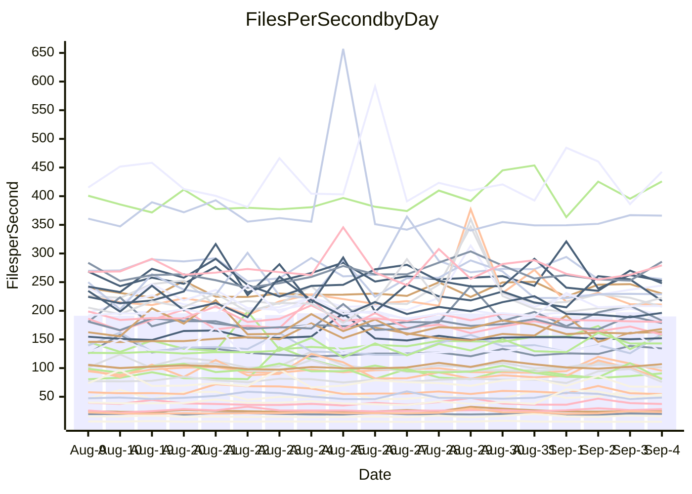

<!---
# This file is auto-generated. Do not edit.
# cspell:disable
--->
# Performance Report

Daily Performance

```mermaid
xychart-beta
    title Files Per Second by Day
    y-axis Files per Second
    x-axis Date [Aug-9, Aug-10, Aug-19, Aug-20, Aug-21, Aug-22, Aug-23, Aug-24, Aug-25, Aug-26, Aug-27, Aug-28, Aug-29, Aug-30, Aug-31, Sep-1, Sep-2, Sep-3, Sep-4]
    bar [191.27, 191.48, 199.45, 195.67, 198.22, 187.40, 192.61, 195.61, 200.69, 190.24, 185.15, 191.23, 195.37, 191.39, 193.00, 190.75, 190.15, 197.37, 190.11]
    line [19.76, 19.87, 23.15, 18.80, 21.30, 21.70, 20.11, 19.24, 18.97, 21.74, 19.44, 19.50, 19.20, 19.98, 20.35, 18.20, 18.80, 20.78, 20.15]
    line [94.45, 88.13, 97.66, 100.71, 101.93, 92.80, 92.11, 97.07, 92.83, 96.14, 97.78, 99.79, 92.99, 92.61, 91.86, 94.75, 119.70, 107.86, 95.29]
    line [106.66, 99.38, 103.80, 117.71, 112.47, 100.50, 103.30, 128.71, 104.89, 98.28, 96.78, 104.60, 101.13, 109.23, 99.73, 101.36, 109.96, 98.07, 107.18]
    line [80.61, 83.15, 92.81, 82.44, 81.86, 80.75, 136.22, 114.72, 99.92, 81.00, 98.60, 83.62, 80.81, 95.31, 95.53, 87.87, 82.74, 85.96, 90.81]
    line [239.79, 231.09, 223.10, 252.00, 224.60, 224.17, 230.06, 227.93, 228.22, 229.99, 225.97, 249.68, 224.12, 249.45, 250.62, 224.68, 245.58, 246.49, 230.05]
    line [269.81, 270.47, 289.77, 286.14, 291.59, 251.52, 256.69, 292.19, 260.02, 262.94, 364.38, 287.21, 267.07, 273.26, 272.63, 293.89, 254.88, 261.45, 255.29]
    line [39.52, 37.52, 44.46, 38.46, 37.42, 35.96, 35.65, 37.61, 34.82, 39.47, 36.12, 40.86, 48.01, 38.35, 36.34, 36.12, 46.76, 38.88, 37.35]
    line [268.54, 243.09, 257.77, 247.18, 276.72, 232.23, 252.08, 266.01, 283.94, 251.01, 260.27, 254.92, 257.60, 260.42, 243.47, 321.12, 238.92, 262.66, 252.11]
    line [6.78, 6.60, 7.51, 6.38, 6.72, 6.55, 6.77, 6.55, 6.58, 6.64, 6.06, 6.53, 6.57, 8.03, 6.52, 6.59, 6.44, 6.39, 6.44]
    line [240.17, 211.99, 227.00, 211.38, 205.51, 203.10, 206.43, 223.33, 206.89, 208.72, 201.20, 222.72, 313.85, 230.65, 207.01, 226.55, 228.01, 236.78, 243.96]
    line [125.68, 158.27, 127.25, 135.61, 133.76, 126.70, 123.28, 120.42, 121.90, 125.42, 125.26, 127.33, 120.64, 133.49, 122.01, 125.69, 124.63, 138.77, 134.29]
    line [225.24, 214.74, 210.02, 221.88, 213.58, 192.56, 216.27, 228.68, 220.47, 211.98, 216.89, 208.83, 377.28, 231.14, 271.29, 215.41, 231.46, 211.65, 210.98]
    line [225.91, 222.58, 246.74, 252.74, 209.47, 217.12, 212.13, 242.98, 195.81, 213.43, 211.78, 245.83, 346.89, 231.16, 212.83, 215.37, 228.66, 222.75, 207.38]
    line [145.75, 128.32, 148.05, 133.76, 130.09, 198.58, 132.66, 136.89, 133.84, 140.74, 138.14, 147.54, 146.55, 146.02, 154.94, 154.92, 173.52, 133.16, 158.05]
    line [24.65, 23.72, 23.68, 26.94, 25.51, 24.79, 23.76, 23.53, 22.75, 24.32, 26.78, 24.44, 32.43, 29.19, 26.35, 24.36, 24.17, 24.77, 24.70]
    line [139.45, 161.93, 128.87, 135.71, 136.66, 133.36, 161.38, 128.87, 127.62, 123.35, 123.11, 143.71, 157.94, 138.50, 140.06, 128.47, 140.20, 125.82, 159.94]
    line [25.95, 22.03, 24.86, 28.29, 26.21, 32.71, 26.20, 26.09, 26.00, 24.43, 25.37, 25.72, 26.51, 26.59, 24.79, 26.51, 29.88, 26.76, 28.42]
    line [154.75, 150.93, 149.02, 164.86, 165.64, 153.35, 152.64, 155.02, 195.52, 151.70, 148.17, 156.31, 149.39, 153.11, 153.94, 154.04, 151.51, 150.42, 152.16]
    line [15.80, 15.53, 17.25, 15.28, 15.49, 14.84, 15.46, 14.39, 15.01, 15.63, 14.69, 17.08, 14.10, 16.71, 20.24, 15.82, 15.08, 17.27, 15.66]
    line [196.97, 211.99, 246.59, 218.10, 236.31, 204.94, 201.38, 212.81, 200.01, 195.34, 186.50, 194.59, 201.00, 192.78, 193.23, 197.26, 194.56, 204.26, 192.75]
    line [180.75, 223.35, 172.94, 187.16, 177.68, 172.01, 170.49, 175.09, 173.22, 173.59, 180.48, 179.74, 243.56, 182.28, 198.12, 173.20, 197.43, 208.77, 182.82]
    line [96.93, 84.41, 106.12, 84.61, 114.12, 87.31, 89.99, 124.55, 110.24, 81.92, 82.24, 92.49, 81.67, 87.59, 83.98, 86.34, 113.37, 99.81, 81.62]
    line [77.16, 76.75, 77.91, 84.91, 78.76, 75.34, 81.46, 80.77, 74.97, 79.78, 75.90, 79.64, 81.40, 79.85, 79.89, 74.06, 94.44, 98.41, 75.84]
    line [400.74, 385.62, 371.65, 411.46, 377.61, 379.88, 377.18, 380.64, 396.91, 381.52, 374.08, 409.79, 391.59, 445.01, 453.72, 363.41, 425.43, 395.65, 425.79]
    line [145.79, 145.58, 147.10, 147.08, 151.07, 153.94, 150.27, 178.09, 152.08, 170.66, 160.71, 152.01, 148.28, 159.68, 156.83, 191.47, 145.84, 161.62, 162.87]
    line [249.96, 202.34, 263.67, 236.99, 228.06, 301.20, 226.40, 222.40, 289.06, 224.56, 256.87, 257.70, 287.97, 268.68, 222.58, 222.07, 229.04, 229.68, 228.71]
    line [186.27, 165.43, 184.07, 202.12, 167.51, 173.85, 169.85, 221.75, 167.75, 195.90, 170.00, 175.89, 161.05, 172.78, 181.80, 171.34, 164.16, 172.60, 158.42]
    line [224.37, 213.27, 217.89, 233.79, 316.48, 227.32, 281.23, 212.31, 293.11, 198.49, 245.94, 225.24, 218.17, 233.60, 214.50, 206.09, 260.46, 254.83, 217.24]
    line [47.00, 61.84, 45.89, 57.63, 58.67, 44.77, 49.92, 49.06, 57.90, 45.60, 46.71, 50.51, 48.37, 46.85, 59.90, 48.04, 50.57, 60.39, 49.96]
    line [127.47, 149.55, 129.16, 129.10, 170.99, 119.13, 167.47, 175.06, 125.57, 143.51, 123.67, 127.21, 130.16, 128.18, 136.84, 128.57, 138.89, 167.86, 126.21]
    line [181.18, 166.12, 186.93, 181.85, 181.88, 168.34, 171.35, 169.12, 211.70, 166.64, 168.34, 182.86, 173.63, 176.66, 185.43, 171.13, 167.67, 190.75, 178.47]
    line [57.90, 56.15, 56.35, 54.76, 71.89, 68.47, 68.09, 64.39, 54.76, 55.64, 55.71, 59.28, 54.85, 60.20, 59.04, 56.12, 68.78, 56.21, 54.65]
    line [101.07, 123.80, 99.87, 108.06, 107.98, 95.34, 94.96, 114.12, 97.84, 103.09, 93.25, 94.27, 95.28, 96.54, 94.13, 99.46, 106.04, 103.70, 101.24]
    line [98.84, 91.76, 103.43, 107.49, 93.08, 97.11, 107.90, 94.53, 94.47, 104.38, 94.67, 92.38, 93.95, 104.17, 91.62, 84.72, 84.00, 108.68, 80.42]
    line [162.48, 155.40, 204.32, 177.59, 218.64, 159.00, 159.79, 194.26, 164.45, 184.75, 158.60, 171.47, 169.60, 183.25, 175.44, 159.48, 161.70, 160.46, 168.23]
    line [360.76, 347.31, 389.41, 371.89, 392.82, 355.53, 361.83, 355.43, 657.12, 351.25, 341.51, 360.76, 340.11, 354.77, 349.07, 349.21, 351.71, 366.86, 366.00]
    line [198.91, 184.05, 187.41, 186.67, 207.48, 180.49, 185.92, 209.38, 182.67, 186.49, 182.43, 194.97, 183.27, 194.85, 191.03, 183.63, 183.06, 181.63, 180.80]
    line [242.10, 232.62, 273.32, 257.69, 290.62, 245.10, 224.83, 243.49, 245.36, 272.30, 280.33, 252.18, 242.64, 242.97, 290.78, 240.40, 234.87, 270.15, 247.94]
    line [73.60, 96.61, 68.89, 69.48, 73.38, 68.77, 97.84, 66.15, 69.59, 78.77, 75.57, 73.80, 69.15, 78.35, 81.24, 69.03, 86.32, 67.78, 67.41]
    line [415.14, 451.69, 458.22, 412.53, 400.53, 380.98, 466.37, 404.40, 403.18, 591.49, 390.96, 423.25, 409.89, 420.57, 392.45, 484.50, 460.60, 386.17, 442.51]
    line [283.77, 252.09, 262.36, 263.68, 253.37, 240.18, 248.22, 259.20, 278.18, 263.50, 263.68, 284.05, 303.63, 278.91, 256.34, 262.12, 254.81, 252.73, 285.68]
    line [22.84, 20.59, 20.47, 21.22, 20.90, 21.42, 21.40, 22.88, 21.36, 21.22, 21.19, 22.04, 29.75, 23.02, 22.87, 20.05, 21.21, 24.74, 23.06]
    line [205.56, 193.98, 216.67, 206.61, 230.20, 198.53, 213.69, 212.64, 179.07, 214.07, 290.22, 216.81, 359.94, 225.73, 203.55, 198.31, 204.42, 207.30, 222.94]
    line [126.64, 126.17, 128.45, 125.27, 127.94, 127.77, 130.20, 152.67, 118.34, 143.02, 122.15, 142.33, 130.77, 150.54, 129.50, 127.85, 161.72, 142.89, 143.04]
    line [105.46, 100.11, 102.43, 104.89, 103.21, 98.21, 97.36, 101.78, 100.00, 99.58, 101.28, 109.08, 102.06, 113.06, 106.63, 101.22, 99.00, 102.40, 106.91]
    line [47.26, 48.66, 46.00, 48.26, 51.42, 58.83, 56.30, 50.38, 45.97, 45.91, 59.43, 48.16, 47.53, 46.75, 48.25, 57.12, 55.04, 46.08, 48.61]
    line [268.09, 268.70, 290.78, 262.94, 266.60, 272.93, 267.45, 262.37, 345.57, 266.69, 244.68, 307.76, 255.74, 281.64, 288.18, 264.41, 254.46, 262.80, 279.31]
    line [234.76, 198.61, 243.75, 200.90, 213.71, 188.91, 259.37, 218.53, 190.79, 215.33, 194.36, 206.72, 199.24, 215.14, 225.49, 194.47, 193.04, 188.70, 196.37]
    line [39.98, 38.63, 38.64, 39.11, 45.24, 39.50, 39.66, 42.07, 38.23, 36.94, 35.58, 41.81, 37.53, 40.57, 37.73, 62.90, 58.74, 49.12, 53.80]
    line [192.03, 195.48, 194.87, 202.54, 193.62, 244.63, 196.70, 223.56, 194.58, 199.46, 185.25, 194.89, 191.72, 195.81, 191.06, 231.16, 206.13, 208.21, 208.38]
```

Time to Process Files

| Repository                                      | Elapsed | Min/Avg/Max          |    SD | SD Graph                |
| ----------------------------------------------- | ------: | :------------------: | ----: | ----------------------- |
| AdaDoom3/AdaDoom3                    |    2.89 | 2.1 /   2.7 /   3.2  |  0.28 | `    ┣━━┻━━╋━●┻━━┫    ` |
| alexiosc/megistos                    |    7.24 | 4.1 /   6.7 /   7.9  |  0.83 | `    ┣━━┻━━╋━●┻━━┫    ` |
| apollographql/apollo-server          |    2.75 | 1.8 /   2.4 /   2.8  |  0.25 | `    ┣━━┻━━╋━━┻●━┫    ` |
| aspnetboilerplate/aspnetboilerplate  |    8.87 | 4.9 /   8.4 /   9.8  |  0.97 | `    ┣━━┻━━╋●━┻━━┫    ` |
| aws-amplify/docs                     |   13.14 | 8.6 /  12.8 /  14.3  |  1.28 | `    ┣━━┻━━╋●━┻━━┫    ` |
| Azure/azure-rest-api-specs           |   10.29 | 7.2 /  10.0 /  11.6  |  0.80 | `    ┣━━┻━━╋●━┻━━┫    ` |
| bitjson/typescript-starter           |    1.09 | 0.6 /   1.0 /   1.1  |  0.09 | `     ┣━┻━━╋━●┻━┫     ` |
| caddyserver/caddy                    |    2.99 | 2.2 /   3.5 /   3.9  |  0.37 | `    ┣━●┻━━╋━━┻━━┫    ` |
| canada-ca/open-source-logiciel-libre |    1.10 | 0.6 /   1.0 /   1.3  |  0.11 | `     ┣━┻━━╋●━┻━┫     ` |
| chef/chef                            |    3.63 | 3.0 /   4.7 /   5.4  |  0.58 | `    ┣●━┻━━╋━━┻━━┫    ` |
| dart-lang/sdk                        |   58.46 | 34.3 /  58.0 /  65.4 |  5.64 | `  ┣━━━┻━━━●━━━┻━━━┫  ` |
| django/django                        |   14.36 | 7.5 /  13.0 /  15.1  |  1.64 | `   ┣━━━┻━━╋━━●━━━┫   ` |
| eslint/eslint                        |    9.97 | 5.4 /   9.4 /  10.8  |  1.06 | `    ┣━━┻━━╋━●┻━━┫    ` |
| exonum/exonum                        |    3.59 | 2.6 /   3.3 /   3.7  |  0.27 | `    ┣━━┻━━╋━━●━━┫    ` |
| flutter/samples                      |   11.37 | 7.1 /  11.9 /  14.0  |  1.51 | `    ┣━━┻━●╋━━┻━━┫    ` |
| gitbucket/gitbucket                  |    2.57 | 2.1 /   3.1 /   3.6  |  0.40 | `    ┣━●┻━━╋━━┻━━┫    ` |
| googleapis/google-cloud-cpp          |  126.41 | 83.3 / 122.5 / 142.3 | 12.33 | `  ┣━━━┻━━━╋●━━┻━━━┫  ` |
| graphql/express-graphql              |    1.11 | 0.7 /   1.0 /   1.2  |  0.12 | `     ┣━┻━━╋━●┻━┫     ` |
| graphql/graphql-js                   |    3.63 | 2.8 /   3.6 /   3.9  |  0.23 | `    ┣━━┻━━╋●━┻━━┫    ` |
| graphql/graphql-relay-js             |    1.13 | 0.7 /   1.1 /   1.3  |  0.11 | `     ┣━┻━━╋●━┻━┫     ` |
| graphql/graphql-spec                 |    1.27 | 0.8 /   1.2 /   1.4  |  0.15 | `     ┣━┻━━╋●━┻━┫     ` |
| iluwatar/java-design-patterns        |   11.99 | 8.8 /  11.9 /  13.3  |  1.15 | `    ┣━━┻━━●━━┻━━┫    ` |
| ktaranov/sqlserver-kit               |    6.08 | 3.1 /   5.4 /   6.2  |  0.91 | `    ┣━━┻━━╋━●┻━━┫    ` |
| liriliri/licia                       |    3.47 | 2.8 /   3.6 /   4.1  |  0.38 | `    ┣━━┻━●╋━━┻━━┫    ` |
| MartinThoma/LaTeX-examples           |    6.05 | 3.5 /   5.9 /   7.0  |  0.72 | `    ┣━━┻━━╋●━┻━━┫    ` |
| mdx-js/mdx                           |    1.78 | 1.1 /   1.7 /   2.0  |  0.18 | `     ┣━┻━━╋●━┻━┫     ` |
| microsoft/TypeScript-Website         |    5.25 | 3.7 /   5.0 /   5.6  |  0.48 | `    ┣━━┻━━╋━●┻━━┫    ` |
| MicrosoftDocs/PowerShell-Docs        |   24.31 | 13.9 /  23.3 /  28.2 |  3.06 | `   ┣━━━┻━━╋●━┻━━━┫   ` |
| neovim/nvim-lspconfig                |    5.53 | 3.7 /   5.0 /   5.8  |  0.55 | `    ┣━━┻━━╋━━●━━┫    ` |
| pagekit/pagekit                      |    3.51 | 1.9 /   3.2 /   4.1  |  0.43 | `    ┣━━┻━━╋━●┻━━┫    ` |
| php/php-src                          |   26.01 | 18.2 /  23.9 /  26.8 |  2.28 | `   ┣━━━┻━━╋━━●━━━┫   ` |
| plasticrake/tplink-smarthome-api     |    1.22 | 0.8 /   1.2 /   1.4  |  0.16 | `     ┣━┻━━●━━┻━┫     ` |
| prettier/prettier                    |    5.85 | 4.1 /   7.5 /   8.4  |  0.75 | `   ●┣━━┻━━╋━━┻━━┫    ` |
| pycontribs/jira                      |    1.42 | 0.8 /   1.4 /   1.8  |  0.16 | `     ┣━┻━━╋●━┻━┫     ` |
| RustPython/RustPython                |   10.87 | 5.6 /   9.3 /  12.6  |  1.28 | `    ┣━━┻━━╋━━┻●━┫    ` |
| shoelace-style/shoelace              |    2.17 | 1.8 /   2.6 /   3.0  |  0.33 | `    ┣━━●━━╋━━┻━━┫    ` |
| slint-ui/slint                       |   17.70 | 11.3 /  15.3 /  17.5 |  1.63 | `   ┣━━━┻━━╋━━┻━●━┫   ` |
| SoftwareBrothers/admin-bro           |    2.39 | 1.6 /   2.3 /   2.6  |  0.20 | `     ┣━┻━━╋●━┻━┫     ` |
| sveltejs/svelte                      |   17.62 | 12.5 /  21.5 /  24.2 |  2.34 | `   ┣●━━┻━━╋━━┻━━━┫   ` |
| TheAlgorithms/Python                 |    4.12 | 3.0 /   5.3 /   5.9  |  0.50 | `   ●┣━━┻━━╋━━┻━━┫    ` |
| twbs/bootstrap                       |    1.78 | 1.2 /   1.6 /   1.9  |  0.20 | `     ┣━┻━━╋━●┻━┫     ` |
| typescript-cheatsheets/react         |    1.13 | 0.7 /   1.1 /   1.3  |  0.11 | `     ┣━┻━━╋●━┻━┫     ` |
| typescript-eslint/typescript-eslint  |    4.06 | 2.4 /   4.0 /   4.9  |  0.43 | `    ┣━━┻━━●━━┻━━┫    ` |
| vitest-dev/vitest                    |   10.64 | 6.6 /  10.2 /  11.9  |  1.01 | `    ┣━━┻━━╋●━┻━━┫    ` |
| w3c/aria-practices                   |    3.22 | 2.1 /   3.1 /   3.6  |  0.37 | `    ┣━━┻━━╋●━┻━━┫    ` |
| w3c/specberus                        |    2.03 | 1.3 /   1.8 /   2.2  |  0.17 | `     ┣━┻━━╋━━●━┫     ` |
| webdeveric/webpack-assets-manifest   |    1.21 | 0.8 /   1.1 /   1.4  |  0.12 | `     ┣━┻━━╋━●┻━┫     ` |
| webpack/webpack                      |    6.08 | 3.7 /   6.5 /   7.6  |  0.90 | `    ┣━━┻●━╋━━┻━━┫    ` |
| wireapp/wire-desktop                 |    1.11 | 0.9 /   1.3 /   1.5  |  0.14 | `     ┣━●━━╋━━┻━┫     ` |
| wireapp/wire-webapp                  |   12.44 | 10.1 /  12.9 /  14.5 |  1.05 | `    ┣━━┻━●╋━━┻━━┫    ` |

Note:
- Elapsed time is in seconds.

Files per Second over Time

| Repository                                      | Files |    Sec |    Fps |     Rel | Trend Fps              |    N |
| ----------------------------------------------- | ----: | -----: | -----: | ------: | ---------------------- | ---: |
| AdaDoom3/AdaDoom3                    |   103 |   2.89 |  35.63 |  -9.32% | `▄▃▃▃▄▃▃▃██▇▄▄▄▅▃▃▇▂▃` |   56 |
| alexiosc/megistos                    |   583 |   7.24 |  80.51 |  -9.77% | `▃▆▃█▃█▃▃▃▂▃▃▃▃▃▃▇▃▃▂` |   56 |
| apollographql/apollo-server          |   256 |   2.75 |  92.97 | -12.95% | `▄▂█▃▂▃▃▃▃▇▃▃▂▂▃█▃▃▃▂` |   56 |
| aspnetboilerplate/aspnetboilerplate  |  2288 |   8.87 | 257.90 |  -6.82% | `█▃▄▄▆▃▃▅▄▂▃▃▄▄▃▂▃▃▄▃` |   56 |
| aws-amplify/docs                     |  3030 |  13.14 | 230.67 |  -3.59% | `▃▃▃▃▇▃▃▃▇▂▃█▂▃▃▃▃▃▂▃` |   56 |
| Azure/azure-rest-api-specs           |  2580 |  10.29 | 250.79 |  -2.99% | `▄▆▄▃▃▃▃█▄▂▃▅▄▄▄▄▃▂▆▄` |   56 |
| bitjson/typescript-starter           |    20 |   1.09 |  18.35 |  -8.68% | `▃▃▃▂▄▃▆▂▃▃▃▇▄▄▃▃▃█▃▃` |   56 |
| caddyserver/caddy                    |   339 |   2.99 | 113.27 |  15.81% | `▂▂▂▂▂▂▂▂▂▄▃█▅▄▂▄▂▂▂▄` |   55 |
| canada-ca/open-source-logiciel-libre |     7 |   1.10 |   6.37 |  -6.06% | `▄▃▄█▃▂▂▃▂▃▂▂▂▃▂▂▂▃▂▂` |   56 |
| chef/chef                            |  1035 |   3.63 | 285.49 |  26.92% | `▂▂▄▄▂▂▂▃▂▂▅▂▂▂█▄▂▅▂▆` |   56 |
| dart-lang/sdk                        | 11650 |  58.46 | 199.27 |  -1.93% | `▃▄▂▄▃▄▄▃▄▃▄▄█▃▄▂▄▄▂▄` |   55 |
| django/django                        |  2932 |  14.36 | 204.23 | -10.99% | `▃█▃▂▃▃▃▃▃▇▃▆▃▃▃▃▃▃▂▃` |   56 |
| eslint/eslint                        |  2082 |   9.97 | 208.89 |  -6.86% | `▂▂▄▂▂█▂▂▂▄▂▁▂▂▃▂▂▂▂▂` |   56 |
| exonum/exonum                        |   421 |   3.59 | 117.43 |  -9.56% | `▄▃█▃▃▃▃▃▃▄▃█▃▇▂▃▇▃▇▂` |   56 |
| flutter/samples                      |  1703 |  11.37 | 149.83 |   2.55% | `▂▂▃▂▄▂▃▃█▂▃▁▂▂▂▅▂▄▃▃` |   56 |
| gitbucket/gitbucket                  |   418 |   2.57 | 162.63 |  17.51% | `▃█▅▃█▂▂▃▂▂█▃▂▃▃█▇▂▆▆` |   56 |
| googleapis/google-cloud-cpp          | 22036 | 126.41 | 174.32 |  -2.83% | `▃▂▃▇▃▃▇▃▃▃▃▄█▄▄▅▅▃▃▃` |   56 |
| graphql/express-graphql              |    26 |   1.11 |  23.44 |  -8.23% | `▄█▄▂▆▂▂▂▂▂▂▂▂▂▄▂▂▂▄▂` |   56 |
| graphql/graphql-js                   |   551 |   3.63 | 151.91 |  -2.10% | `▆█▇▆█▇▇▇▇▆▇▇▇▅▆▇▇▇▆▇` |   56 |
| graphql/graphql-relay-js             |    28 |   1.13 |  24.76 |  -6.86% | `▃▇▃▃▃▂▃▄▇▆▂▆▂▃▃█▂▆▃▃` |   56 |
| graphql/graphql-spec                 |    19 |   1.27 |  14.96 |  -7.73% | `▂▂▂▃▃▅█▃▂▂▂▃▄▂▅▂▅▂▂▂` |   56 |
| iluwatar/java-design-patterns        |  2216 |  11.99 | 184.77 |  -0.37% | `▇▃▃▃█▃▃▃▃▃█▃█▃█▄▃▄▃▄` |   56 |
| ktaranov/sqlserver-kit               |   490 |   6.08 |  80.57 | -14.57% | `▁▂▂▂▂▂▂▂▁▇▄▂█▁▁▂▁▁▁▁` |   56 |
| liriliri/licia                       |  1442 |   3.47 | 415.62 |   2.29% | `███▃▅█▂▇▂▅▇▂▆▂▃▃▇▅▂▄` |   55 |
| MartinThoma/LaTeX-examples           |  1409 |   6.05 | 232.75 |  -5.01% | `▄█▅▄▄▃▄▄▅▅▄▆▄▄▄▃▅▅▅▅` |   56 |
| mdx-js/mdx                           |   139 |   1.78 |  78.07 |  -3.73% | `▁▆▂▂▃▂▂▂▁▆▄▂█▄▄▁▂▂▂▂` |   56 |
| microsoft/TypeScript-Website         |   765 |   5.25 | 145.67 |  -6.42% | `▅▃█▃▃▆▂▇▃▃▃▃▇▃▃▃▃▆▆▃` |   56 |
| MicrosoftDocs/PowerShell-Docs        |  3126 |  24.31 | 128.61 |  -6.17% | `▂▂▂▁▂▄▃▂▂▆▂▄▅▃█▃▂▂▂▂` |   56 |
| neovim/nvim-lspconfig                |   873 |   5.53 | 157.95 | -11.36% | `█▄▃▃▇▄▄▄▃▃▃▃▄▆▃▃▂▂▄▃` |   56 |
| pagekit/pagekit                      |   741 |   3.51 | 210.93 | -10.29% | `▃▂▂▃▂▂▂▂▅▃▄▃█▂▂▂▂▂▂▂` |   56 |
| php/php-src                          |  2390 |  26.01 |  91.88 |  -9.13% | `▃▄▃▃▂▃▃▄▃█▃▃▃█▃▇▃▄▃▂` |   56 |
| plasticrake/tplink-smarthome-api     |    62 |   1.22 |  50.63 |  -1.21% | `▂▃▃▂█▆▃▃▂▃▅██▃▄▃▂▂▅▃` |   56 |
| prettier/prettier                    |  2703 |   5.85 | 462.37 |  26.60% | `▄▄▄▃▃▃▃▃▄▃▃▃▂▃█▃▃▂▃█` |   56 |
| pycontribs/jira                      |    80 |   1.42 |  56.30 |  -5.20% | `▃▃▂▃▃▃▃▃█▃▂▄▂▂▃▄▂▂▁▃` |   55 |
| RustPython/RustPython                |   903 |  10.87 |  83.04 | -14.40% | `▃▅▃▃▃▃▃▂▂▃▃▄▃▄█▂▂▁▂▂` |   56 |
| shoelace-style/shoelace              |   440 |   2.17 | 202.94 |  16.41% | `▄█▃█▂▇▂▂▃▃▃▃▂▂▃▂▃▂▃▆` |   56 |
| slint-ui/slint                       |  4046 |  17.70 | 228.55 | -10.64% | `▃▃▃▃█▃▇▃▂▃▂▇▂▃▇▂▃▇▃▂` |   56 |
| SoftwareBrothers/admin-bro           |   441 |   2.39 | 184.82 |  -3.11% | `▅▅▄██▅▆▅▆▄▅▅▄▅▅▄▄▄▅▅` |   56 |
| sveltejs/svelte                      |  9081 |  17.62 | 515.40 |  21.34% | `▃▃▃▃▃▃▃▇▆▃█▃▂▃▂▃▃█▃█` |   56 |
| TheAlgorithms/Python                 |  1420 |   4.12 | 344.80 |  28.47% | `▃▇▃▂▃▃▃▃▃▃▂▃▃▂▃▇▃▃▂█` |   56 |
| twbs/bootstrap                       |   118 |   1.78 |  66.43 | -10.89% | `▃▂█▅▃▇▆▃▃█▃█▃▃▂▃▃▃▃▂` |   55 |
| typescript-cheatsheets/react         |    24 |   1.13 |  21.25 |  -5.02% | `▂▃▆▃▃▆▂▂▃▃▃▃▃█▅▆▆▂▃▃` |   56 |
| typescript-eslint/typescript-eslint  |   869 |   4.06 | 214.06 |  -1.89% | `▆▅▄▅▄▄▃▃▄▃▄▄▄▄▃▅▄▄█▅` |   56 |
| vitest-dev/vitest                    |  2799 |  10.64 | 263.01 |  -4.69% | `▂▃▃▄▄▃█▄▃▃▃▄▃▄▄▃▄█▄▄` |   56 |
| w3c/aria-practices                   |   417 |   3.22 | 129.38 |  -5.81% | `▂▃▄█▃▃▂▂▂█▅▅▃▂▅▄▂▂▇▂` |   56 |
| w3c/specberus                        |   190 |   2.03 |  93.46 | -11.17% | `▄▄▃█▃▇▃▄▄▃▄▄▄▄▄▃█▄▅▃` |   56 |
| webdeveric/webpack-assets-manifest   |    55 |   1.21 |  45.36 |  -7.63% | `▄▃▄▅▄▄▄▇▇▄▇▄▄▃▄█▃▄▃▃` |   56 |
| webpack/webpack                      |  1383 |   6.08 | 227.44 |   7.77% | `▃▃▂███▂▃▃▃▃▃▃▃▃▂▃▃▃▆` |   56 |
| wireapp/wire-desktop                 |    70 |   1.11 |  62.80 |  46.51% | `▂▂▂▂▂▂▁▆▄█▄▄▄▄▃▃▃▃▆▆` |   56 |
| wireapp/wire-webapp                  |  2592 |  12.44 | 208.30 |   4.25% | `▃▃▄▃▃▃▃▆▃▇▂▃█▃▃▃▃▃█▄` |   56 |

Data Throughput

| Repository                                      | Files |    Sec |     Kps |     Rel | Trend Kps              |    N |
| ----------------------------------------------- | ----: | -----: | ------: | ------: | ---------------------- | ---: |
| AdaDoom3/AdaDoom3                    |   103 |   2.89 |  757.20 |  -9.32% | `▄▃▃▃▄▃▃▃██▇▄▄▄▅▃▃▇▂▃` |   56 |
| alexiosc/megistos                    |   583 |   7.24 |  632.61 |  -9.77% | `▃▆▃█▃█▃▃▃▂▃▃▃▃▃▃▇▃▃▂` |   56 |
| apollographql/apollo-server          |   256 |   2.75 |  765.57 | -12.95% | `▄▂█▃▂▃▃▃▃▇▃▃▂▂▃█▃▃▃▂` |   56 |
| aspnetboilerplate/aspnetboilerplate  |  2288 |   8.87 |  630.77 |  -6.81% | `█▃▄▄▆▃▃▅▄▂▃▃▄▄▃▂▃▃▄▃` |   56 |
| aws-amplify/docs                     |  3030 |  13.14 |  901.74 |  -3.56% | `▃▃▃▃▇▃▃▃▇▂▃█▂▃▃▃▃▃▂▃` |   56 |
| Azure/azure-rest-api-specs           |  2580 |  10.29 |  770.75 |  -2.72% | `▄▆▄▃▃▃▃█▄▂▃▅▄▄▄▄▃▂▆▄` |   56 |
| bitjson/typescript-starter           |    20 |   1.09 |   73.42 |  -8.68% | `▃▃▃▂▄▃▆▂▃▃▃▇▄▄▃▃▃█▃▃` |   56 |
| caddyserver/caddy                    |   339 |   2.99 | 1032.15 |  15.97% | `▂▂▂▂▂▂▂▂▂▄▃█▅▄▂▄▂▂▂▄` |   55 |
| canada-ca/open-source-logiciel-libre |     7 |   1.10 |   52.75 |  -6.06% | `▄▃▄█▃▂▂▃▂▃▂▂▂▃▂▂▂▃▂▂` |   56 |
| chef/chef                            |  1035 |   3.63 | 1401.82 |  26.93% | `▂▂▄▄▂▂▂▃▂▂▅▂▂▂█▄▂▅▂▆` |   56 |
| dart-lang/sdk                        | 11650 |  58.46 | 1386.32 |  -1.76% | `▃▄▂▄▃▄▄▃▄▃▄▄█▃▄▂▄▄▂▄` |   55 |
| django/django                        |  2932 |  14.36 | 1315.36 | -10.99% | `▃█▃▂▃▃▃▃▃▇▃▆▃▃▃▃▃▃▂▃` |   56 |
| eslint/eslint                        |  2082 |   9.97 | 1470.04 |  -6.68% | `▂▂▄▂▂█▂▂▂▄▂▁▂▂▃▂▂▂▂▂` |   56 |
| exonum/exonum                        |   421 |   3.59 | 1123.23 |  -9.56% | `▄▃█▃▃▃▃▃▃▄▃█▃▇▂▃▇▃▇▂` |   56 |
| flutter/samples                      |  1703 |  11.37 |  893.11 |   2.50% | `▂▂▃▂▄▂▃▃█▂▃▁▂▂▂▅▂▄▃▃` |   56 |
| gitbucket/gitbucket                  |   418 |   2.57 |  804.58 |  17.68% | `▃█▅▃█▂▂▃▂▂█▃▂▃▃█▇▂▆▆` |   56 |
| googleapis/google-cloud-cpp          | 22036 | 126.41 | 1516.90 |  -2.75% | `▃▂▃▇▃▃▇▃▃▃▃▄█▄▄▅▅▃▃▃` |   56 |
| graphql/express-graphql              |    26 |   1.11 |  107.31 |  -8.23% | `▄█▄▂▆▂▂▂▂▂▂▂▂▂▄▂▂▂▄▂` |   56 |
| graphql/graphql-js                   |   551 |   3.63 | 1132.81 |  -2.10% | `▆█▇▆█▇▇▇▇▆▇▇▇▅▆▇▇▇▆▇` |   56 |
| graphql/graphql-relay-js             |    28 |   1.13 |   97.27 |  -6.86% | `▃▇▃▃▃▂▃▄▇▆▂▆▂▃▃█▂▆▃▃` |   56 |
| graphql/graphql-spec                 |    19 |   1.27 |  500.73 |  -7.73% | `▂▂▂▃▃▅█▃▂▂▂▃▄▂▅▂▅▂▂▂` |   56 |
| iluwatar/java-design-patterns        |  2216 |  11.99 |  570.41 |  -0.39% | `▇▃▃▃█▃▃▃▃▃█▃█▃█▄▃▄▃▄` |   56 |
| ktaranov/sqlserver-kit               |   490 |   6.08 | 1220.60 | -14.57% | `▁▂▂▂▂▂▂▂▁▇▄▂█▁▁▂▁▁▁▁` |   56 |
| liriliri/licia                       |  1442 |   3.47 |  498.35 |   2.36% | `███▃▅█▂▇▂▅▇▂▆▃▃▃▇▆▃▄` |   55 |
| MartinThoma/LaTeX-examples           |  1409 |   6.05 |  480.69 |  -5.01% | `▄█▅▄▄▃▄▄▅▅▄▆▄▄▄▃▅▅▅▅` |   56 |
| mdx-js/mdx                           |   139 |   1.78 |  367.87 |  -3.73% | `▁▆▂▂▃▂▂▂▁▆▄▂█▄▄▁▂▂▂▂` |   56 |
| microsoft/TypeScript-Website         |   765 |   5.25 | 1004.26 |  -6.43% | `▅▃█▃▃▆▂▇▃▃▃▃▇▃▃▃▃▆▆▃` |   56 |
| MicrosoftDocs/PowerShell-Docs        |  3126 |  24.31 | 1374.49 |  -6.13% | `▂▂▂▁▂▄▃▂▂▆▂▄▅▃█▃▂▂▂▂` |   56 |
| neovim/nvim-lspconfig                |   873 |   5.53 |  464.63 | -11.23% | `█▄▃▃▇▄▄▄▃▃▃▃▄▆▃▃▂▂▄▃` |   56 |
| pagekit/pagekit                      |   741 |   3.51 |  439.80 | -10.29% | `▃▂▂▃▂▂▂▂▅▃▄▃█▂▂▂▂▂▂▂` |   56 |
| php/php-src                          |  2390 |  26.01 | 1627.96 |  -9.04% | `▃▄▃▃▂▃▃▄▃█▃▃▃█▃▇▃▄▃▂` |   56 |
| plasticrake/tplink-smarthome-api     |    62 |   1.22 |  273.56 |  -1.21% | `▂▃▃▂█▆▃▃▂▃▅██▃▄▃▂▂▅▃` |   56 |
| prettier/prettier                    |  2703 |   5.85 |  651.72 |  26.38% | `▄▄▄▃▃▃▃▃▄▃▃▃▂▃█▃▃▂▃█` |   56 |
| pycontribs/jira                      |    80 |   1.42 |  397.63 |  -5.20% | `▃▃▂▃▃▃▃▃█▃▂▄▂▂▃▄▂▂▁▃` |   55 |
| RustPython/RustPython                |   903 |  10.87 | 2126.94 |  -3.70% | `▂▄▂▂▂▂▂▃▂▃▃▄▃▅█▃▃▂▃▃` |   56 |
| shoelace-style/shoelace              |   440 |   2.17 |  980.13 |  16.41% | `▄█▃█▂▇▂▂▃▃▃▃▂▂▃▂▃▂▃▆` |   56 |
| slint-ui/slint                       |  4046 |  17.70 | 1271.02 |  -8.36% | `▃▃▃▃█▃▇▃▃▃▃▇▃▄█▃▃▇▃▃` |   56 |
| SoftwareBrothers/admin-bro           |   441 |   2.39 |  407.35 |  -3.11% | `▅▅▄██▅▆▅▆▄▅▅▄▅▅▄▄▄▅▅` |   56 |
| sveltejs/svelte                      |  9081 |  17.62 |  355.46 |  21.60% | `▃▃▃▃▃▃▃▇▆▃█▃▂▃▂▃▃█▃█` |   56 |
| TheAlgorithms/Python                 |  1420 |   4.12 |  889.19 |  29.31% | `▃▇▃▂▃▃▃▃▃▃▂▃▃▂▃▇▃▃▃█` |   56 |
| twbs/bootstrap                       |   118 |   1.78 |  545.49 | -10.82% | `▃▂█▅▃▇▆▃▃█▃█▃▃▂▃▃▃▃▂` |   55 |
| typescript-cheatsheets/react         |    24 |   1.13 |  192.10 |  -5.02% | `▂▃▆▃▃▆▂▂▃▃▃▃▃█▅▆▆▂▃▃` |   56 |
| typescript-eslint/typescript-eslint  |   869 |   4.06 |  720.27 |  -1.78% | `▆▅▄▅▄▄▃▃▄▃▄▄▄▅▃▅▄▄█▅` |   56 |
| vitest-dev/vitest                    |  2799 |  10.64 |  763.37 |  -4.19% | `▂▃▃▄▄▃█▄▃▃▃▄▃▄▄▃▄█▄▄` |   56 |
| w3c/aria-practices                   |   417 |   3.22 | 1216.86 |  -5.81% | `▂▃▄█▃▃▂▂▂█▅▅▃▂▅▄▂▂▇▂` |   56 |
| w3c/specberus                        |   190 |   2.03 |  305.48 | -11.15% | `▄▄▃█▃▇▃▄▄▃▄▄▄▄▄▃█▄▅▃` |   56 |
| webdeveric/webpack-assets-manifest   |    55 |   1.21 |  104.74 |  -7.63% | `▄▃▄▅▄▄▄▇▇▄▇▄▄▃▄█▃▄▃▃` |   56 |
| webpack/webpack                      |  1383 |   6.08 | 1566.06 |  10.68% | `▄▄▂███▃▄▄▄▄▃▄▃▃▃▃▃▄▇` |   56 |
| wireapp/wire-desktop                 |    70 |   1.11 |  261.09 |  44.03% | `▂▂▂▂▂▂▁▆▃█▄▄▄▄▃▃▃▃▆▆` |   56 |
| wireapp/wire-webapp                  |  2592 |  12.44 |  892.66 |   5.12% | `▃▃▄▃▃▃▃▆▃▇▃▃█▃▃▃▃▃█▄` |   56 |

