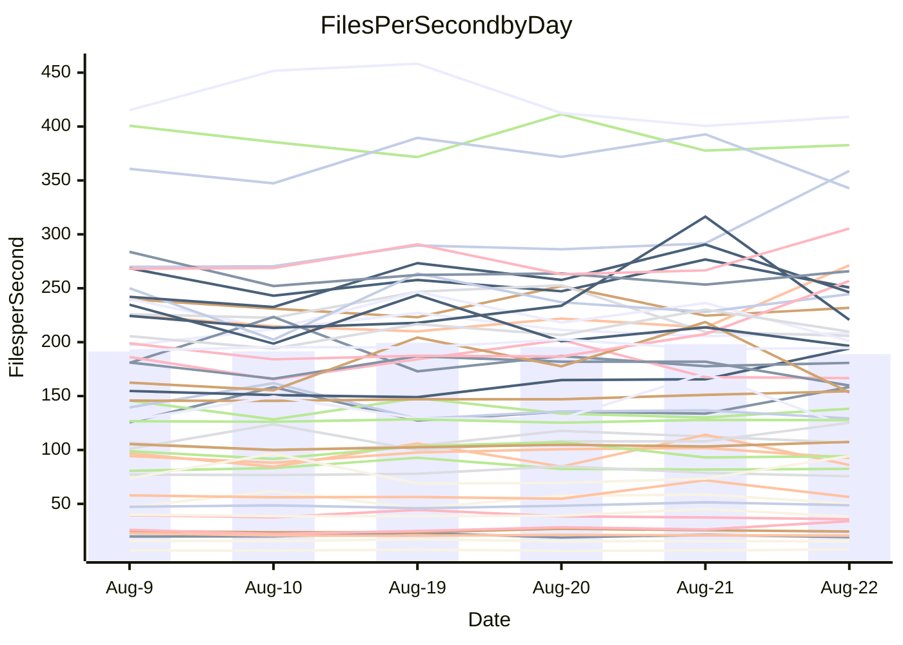

<!---
# This file is auto-generated. Do not edit.
# cspell:disable
--->
# Performance Report

Daily Performance

```mermaid
xychart-beta
    title Files Per Second by Day
    y-axis Files per Second
    x-axis Date [Aug-9, Aug-10, Aug-19, Aug-20, Aug-21, Aug-22]
    bar [191.27, 191.48, 199.45, 195.67, 198.22, 188.82]
    line [19.76, 19.87, 23.15, 18.80, 21.30, 19.20]
    line [94.45, 88.13, 97.66, 100.71, 101.93, 92.62]
    line [106.66, 99.38, 103.80, 117.71, 112.47, 106.73]
    line [80.61, 83.15, 92.81, 82.44, 81.86, 82.51]
    line [239.79, 231.09, 223.10, 252.00, 224.60, 231.79]
    line [269.81, 270.47, 289.77, 286.14, 291.59, 358.78]
    line [39.52, 37.52, 44.46, 38.46, 37.42, 35.71]
    line [268.54, 243.09, 257.77, 247.18, 276.72, 250.68]
    line [6.78, 6.60, 7.51, 6.38, 6.72, 7.86]
    line [240.17, 211.99, 227.00, 211.38, 205.51, 208.36]
    line [125.68, 158.27, 127.25, 135.61, 133.76, 158.30]
    line [225.24, 214.74, 210.02, 221.88, 213.58, 271.25]
    line [225.91, 222.58, 246.74, 252.74, 209.47, 205.83]
    line [145.75, 128.32, 148.05, 133.76, 130.09, 138.20]
    line [24.65, 23.72, 23.68, 26.94, 25.51, 24.45]
    line [139.45, 161.93, 128.87, 135.71, 136.66, 129.23]
    line [25.95, 22.03, 24.86, 28.29, 26.21, 33.96]
    line [154.75, 150.93, 149.02, 164.86, 165.64, 194.06]
    line [15.80, 15.53, 17.25, 15.28, 15.49, 15.26]
    line [196.97, 211.99, 246.59, 218.10, 236.31, 201.14]
    line [180.75, 223.35, 172.94, 187.16, 177.68, 180.76]
    line [96.93, 84.41, 106.12, 84.61, 114.12, 86.13]
    line [77.16, 76.75, 77.91, 84.91, 78.76, 75.63]
    line [400.74, 385.62, 371.65, 411.46, 377.61, 382.81]
    line [145.79, 145.58, 147.10, 147.08, 151.07, 154.46]
    line [249.96, 202.34, 263.67, 236.99, 228.06, 244.55]
    line [186.27, 165.43, 184.07, 202.12, 167.51, 166.66]
    line [224.37, 213.27, 217.89, 233.79, 316.48, 220.75]
    line [47.00, 61.84, 45.89, 57.63, 58.67, 50.31]
    line [127.47, 149.55, 129.16, 129.10, 170.99, 121.14]
    line [181.18, 166.12, 186.93, 181.85, 181.88, 159.74]
    line [57.90, 56.15, 56.35, 54.76, 71.89, 56.45]
    line [101.07, 123.80, 99.87, 108.06, 107.98, 125.18]
    line [98.84, 91.76, 103.43, 107.49, 93.08, 94.24]
    line [162.48, 155.40, 204.32, 177.59, 218.64, 153.34]
    line [360.76, 347.31, 389.41, 371.89, 392.82, 342.75]
    line [198.91, 184.05, 187.41, 186.67, 207.48, 256.72]
    line [242.10, 232.62, 273.32, 257.69, 290.62, 246.23]
    line [73.60, 96.61, 68.89, 69.48, 73.38, 94.44]
    line [415.14, 451.69, 458.22, 412.53, 400.53, 409.06]
    line [283.77, 252.09, 262.36, 263.68, 253.37, 265.78]
    line [22.84, 20.59, 20.47, 21.22, 20.90, 20.49]
    line [205.56, 193.98, 216.67, 206.61, 230.20, 209.73]
    line [126.64, 126.17, 128.45, 125.27, 127.94, 127.62]
    line [105.46, 100.11, 102.43, 104.89, 103.21, 107.49]
    line [47.26, 48.66, 46.00, 48.26, 51.42, 48.71]
    line [268.09, 268.70, 290.78, 262.94, 266.60, 305.36]
    line [234.76, 198.61, 243.75, 200.90, 213.71, 196.58]
    line [39.98, 38.63, 38.64, 39.11, 45.24, 38.19]
    line [192.03, 195.48, 194.87, 202.54, 193.62, 194.55]
```

Time to Process Files

| Repository                                      | Elapsed | Min/Avg/Max          |    SD | SD Graph                |
| ----------------------------------------------- | ------: | :------------------: | ----: | ----------------------- |
| AdaDoom3/AdaDoom3                    |    2.88 | 2.1 /   2.6 /   2.9  |  0.26 | `    ┣━━┻━━╋━━●━━┫    ` |
| alexiosc/megistos                    |    7.07 | 5.5 /   7.0 /   7.9  |  0.46 | `    ┣━━┻━━●━━┻━━┫    ` |
| apollographql/apollo-server          |    2.40 | 1.8 /   2.4 /   2.8  |  0.26 | `    ┣━━┻━━●━━┻━━┫    ` |
| aspnetboilerplate/aspnetboilerplate  |    6.38 | 6.3 /   8.3 /   9.1  |  1.02 | `    ●━━┻━━╋━━┻━━┫    ` |
| aws-amplify/docs                     |   13.07 | 9.6 /  12.9 /  14.0  |  1.10 | `    ┣━━┻━━●━━┻━━┫    ` |
| Azure/azure-rest-api-specs           |   10.22 | 7.2 /   9.9 /  11.2  |  0.94 | `    ┣━━┻━━╋●━┻━━┫    ` |
| bitjson/typescript-starter           |    1.04 | 0.6 /   1.0 /   1.1  |  0.11 | `     ┣━┻━━╋●━┻━┫     ` |
| caddyserver/caddy                    |    3.60 | 2.5 /   3.4 /   3.9  |  0.39 | `    ┣━━┻━━╋●━┻━━┫    ` |
| canada-ca/open-source-logiciel-libre |    0.89 | 0.8 /   1.0 /   1.3  |  0.11 | `     ┣━●━━╋━━┻━┫     ` |
| chef/chef                            |    4.96 | 3.0 /   4.7 /   5.3  |  0.56 | `    ┣━━┻━━╋●━┻━━┫    ` |
| dart-lang/sdk                        |   57.76 | 34.3 /  54.9 /  64.6 |  7.84 | `  ┣━━━┻━━━╋●━━┻━━━┫  ` |
| django/django                        |   14.24 | 10.2 /  12.8 /  15.0 |  1.56 | `   ┣━━━┻━━╋━━●━━━┫   ` |
| eslint/eslint                        |    7.68 | 7.6 /   9.6 /  10.3  |  0.76 | `  ● ┣━━┻━━╋━━┻━━┫    ` |
| exonum/exonum                        |    2.66 | 2.6 /   3.2 /   3.7  |  0.27 | `    ●━━┻━━╋━━┻━━┫    ` |
| flutter/samples                      |   12.32 | 8.0 /  12.3 /  14.0  |  1.30 | `    ┣━━┻━━●━━┻━━┫    ` |
| gitbucket/gitbucket                  |    3.23 | 2.5 /   3.1 /   3.4  |  0.32 | `    ┣━━┻━━╋●━┻━━┫    ` |
| googleapis/google-cloud-cpp          |  132.95 | 96.3 / 118.3 / 127.8 | 11.97 | `  ┣━━━┻━━━╋━━━┻●━━┫  ` |
| graphql/express-graphql              |    1.06 | 0.7 /   1.0 /   1.2  |  0.10 | `     ┣━┻━━●━━┻━┫     ` |
| graphql/graphql-js                   |    2.84 | 2.8 /   3.5 /   3.9  |  0.28 | `   ●┣━━┻━━╋━━┻━━┫    ` |
| graphql/graphql-relay-js             |    0.82 | 0.7 /   1.1 /   1.3  |  0.10 | `    ●┣━┻━━╋━━┻━┫     ` |
| graphql/graphql-spec                 |    1.24 | 0.8 /   1.2 /   1.3  |  0.14 | `     ┣━┻━━╋●━┻━┫     ` |
| iluwatar/java-design-patterns        |   12.08 | 8.8 /  11.8 /  12.8  |  1.12 | `    ┣━━┻━━╋●━┻━━┫    ` |
| ktaranov/sqlserver-kit               |    5.69 | 3.1 /   5.3 /   6.2  |  0.99 | `    ┣━━┻━━╋●━┻━━┫    ` |
| liriliri/licia                       |    3.77 | 2.9 /   3.7 /   4.1  |  0.33 | `    ┣━━┻━━╋●━┻━━┫    ` |
| MartinThoma/LaTeX-examples           |    5.76 | 4.5 /   5.9 /   7.0  |  0.68 | `    ┣━━┻━●╋━━┻━━┫    ` |
| mdx-js/mdx                           |    1.84 | 1.5 /   1.8 /   1.9  |  0.09 | `     ┣━┻━━╋━●┻━┫     ` |
| microsoft/TypeScript-Website         |    4.95 | 5.0 /   5.2 /   5.6  |  0.20 | `    ┣━●┻━━╋━━┻━━┫    ` |
| MicrosoftDocs/PowerShell-Docs        |   25.80 | 14.3 /  23.3 /  25.8 |  2.65 | `   ┣━━━┻━━╋━━●━━━┫   ` |
| neovim/nvim-lspconfig                |    5.21 | 3.7 /   4.8 /   5.6  |  0.59 | `    ┣━━┻━━╋━●┻━━┫    ` |
| pagekit/pagekit                      |    3.36 | 1.9 /   3.2 /   3.6  |  0.48 | `    ┣━━┻━━╋●━┻━━┫    ` |
| php/php-src                          |   19.08 | 18.3 /  23.0 /  26.1 |  2.47 | `   ┣●━━┻━━╋━━┻━━━┫   ` |
| plasticrake/tplink-smarthome-api     |    1.23 | 0.8 /   1.2 /   1.4  |  0.18 | `     ┣━┻━━●━━┻━┫     ` |
| prettier/prettier                    |    7.83 | 5.8 /   7.3 /   8.0  |  0.72 | `    ┣━━┻━━╋━●┻━━┫    ` |
| pycontribs/jira                      |    1.42 | 0.9 /   1.4 /   1.5  |  0.16 | `     ┣━┻━━╋●━┻━┫     ` |
| RustPython/RustPython                |    9.27 | 5.8 /   8.9 /  11.1  |  1.25 | `    ┣━━┻━━╋●━┻━━┫    ` |
| shoelace-style/shoelace              |    2.87 | 1.8 /   2.5 /   3.0  |  0.41 | `    ┣━━┻━━╋━━●━━┫    ` |
| slint-ui/slint                       |   15.49 | 11.3 /  14.8 /  16.1 |  1.55 | `   ┣━━━┻━━╋●━┻━━━┫   ` |
| SoftwareBrothers/admin-bro           |    1.72 | 1.6 /   2.3 /   2.6  |  0.25 | `    ●━━┻━━╋━━┻━━┫    ` |
| sveltejs/svelte                      |   21.89 | 16.9 /  21.4 /  23.0 |  1.93 | `   ┣━━━┻━━╋●━┻━━━┫   ` |
| TheAlgorithms/Python                 |    5.31 | 3.0 /   5.4 /   5.9  |  0.60 | `    ┣━━┻━━●━━┻━━┫    ` |
| twbs/bootstrap                       |    1.25 | 1.2 /   1.6 /   1.9  |  0.17 | `    ●┣━┻━━╋━━┻━┫     ` |
| typescript-cheatsheets/react         |    1.17 | 0.7 /   1.1 /   1.3  |  0.11 | `     ┣━┻━━╋●━┻━┫     ` |
| typescript-eslint/typescript-eslint  |    4.13 | 3.3 /   4.1 /   4.7  |  0.32 | `    ┣━━┻━━●━━┻━━┫    ` |
| vitest-dev/vitest                    |    9.07 | 8.2 /  10.3 /  10.8  |  0.67 | `    ●━━┻━━╋━━┻━━┫    ` |
| w3c/aria-practices                   |    3.27 | 3.1 /   3.3 /   3.5  |  0.10 | `     ┣━┻━●╋━━┻━┫     ` |
| w3c/specberus                        |    1.77 | 1.5 /   1.8 /   2.2  |  0.15 | `     ┣━┻━●╋━━┻━┫     ` |
| webdeveric/webpack-assets-manifest   |    1.13 | 0.9 /   1.2 /   1.4  |  0.11 | `     ┣━┻━●╋━━┻━┫     ` |
| webpack/webpack                      |    6.71 | 3.7 /   6.1 /   7.4  |  1.05 | `    ┣━━┻━━╋━●┻━━┫    ` |
| wireapp/wire-desktop                 |    1.34 | 1.0 /   1.3 /   1.5  |  0.13 | `     ┣━┻━━╋●━┻━┫     ` |
| wireapp/wire-webapp                  |   12.98 | 10.3 /  12.9 /  14.2 |  0.74 | `    ┣━━┻━━●━━┻━━┫    ` |

Note:
- Elapsed time is in seconds.

Files per Second over Time

| Repository                                      | Files |    Sec |    Fps |     Rel | Trend Fps             |    N |
| ----------------------------------------------- | ----: | -----: | -----: | ------: | --------------------- | ---: |
| AdaDoom3/AdaDoom3                    |   103 |   2.88 |  35.71 |  -9.93% | `▇▃▃▇▂▂▃▃▃█▇▃▃▆▃▃▃▃▂` |   18 |
| alexiosc/megistos                    |   583 |   7.07 |  82.51 |  -1.07% | `▃▄▃▃▃▂▄▄▄█▄▃▄▃▄▄▃▃▄` |   18 |
| apollographql/apollo-server          |   256 |   2.40 | 106.73 |  -2.27% | `▂▂▃▂▃▆▅▂▃▃▃█▃▅▃▃▆▃▃` |   18 |
| aspnetboilerplate/aspnetboilerplate  |  2288 |   6.38 | 358.78 |  27.94% | `▂▂▂▃▃▂▇▃█▂▂▃▂█▃▂█▂█` |   18 |
| aws-amplify/docs                     |  3030 |  13.07 | 231.79 |  -2.08% | `▂▂▃▂▃▆▅▃▃▂▃▃▃█▃▂▂▃▃` |   18 |
| Azure/azure-rest-api-specs           |  2561 |  10.22 | 250.68 |  -4.30% | `█▃▅▃▃▂▃▂▃▃▃▂▃▂▃▃▆▃▃` |   18 |
| bitjson/typescript-starter           |    20 |   1.04 |  19.20 |  -5.76% | `▄▃▃▃▂▂▂▃█▂▃▂▁▂▂▂▃▄▂` |   18 |
| caddyserver/caddy                    |   333 |   3.60 |  92.62 |  -4.78% | `▃▃▂▂▆▄▂▂▂▅▃▃▂▃█▆▃▃▃` |   18 |
| canada-ca/open-source-logiciel-libre |     7 |   0.89 |   7.86 |  15.68% | `▄▃▄▃▇▁▄▃█▄▃▂▄▄▃▃▄▃▆` |   18 |
| chef/chef                            |  1034 |   4.96 | 208.36 |  -7.08% | `▃▁▆▂▂▂█▂▂▂▄▂▂▂▂▂▂▂▂` |   18 |
| dart-lang/sdk                        | 11618 |  57.76 | 201.14 |  -7.45% | `▂▂▂▁▂▂▂▃▂█▂▅▂▂▂▂▇▂▂` |   18 |
| django/django                        |  2931 |  14.24 | 205.83 | -11.44% | `▂▃▃▂▆▃█▄▇▃▅█▃█▅▃▂▃▃` |   18 |
| eslint/eslint                        |  2082 |   7.68 | 271.25 |  23.61% | `▃▇█▂▃▂▃▃▃▃▂▆▃▃▃▃▃▃█` |   18 |
| exonum/exonum                        |   421 |   2.66 | 158.30 |  20.56% | `▂▃▃▅▄▃▄█▃▄▄▄█▄▃▄▃▇█` |   18 |
| flutter/samples                      |  1703 |  12.32 | 138.20 |  -1.21% | `▃▂▂▂█▃▂▂▂▄▄▂▂▂▂▁▂▂▃` |   18 |
| gitbucket/gitbucket                  |   418 |   3.23 | 129.23 |  -6.11% | `▃█▃▂▃▇▃▇▂▂▄▇▂▃▃▇▂▃▃` |   18 |
| googleapis/google-cloud-cpp          | 21238 | 132.95 | 159.74 | -12.02% | `█▇▂▂▃▃▃▂█▃▃▇▃▃▃▂▇▂▂` |   18 |
| graphql/express-graphql              |    26 |   1.06 |  24.45 |  -2.54% | `▃▆▂▃▂▂▃▃▃▂▂▃▃▃█▅▃▃▃` |   18 |
| graphql/graphql-js                   |   551 |   2.84 | 194.06 |  23.10% | `▄▃▃▂▃▇▃▃▃▃▃█▃▃▄▄▇▄█` |   18 |
| graphql/graphql-relay-js             |    28 |   0.82 |  33.96 |  30.02% | `▃▃▃▃▃▅▂▁▃▃▃▃▃█▃▃▃▃▇` |   18 |
| graphql/graphql-spec                 |    19 |   1.24 |  15.26 |  -3.76% | `▂▂▂█▂▂▂▃▇▂▃▃▃▂▂▂▄▂▂` |   18 |
| iluwatar/java-design-patterns        |  2183 |  12.08 | 180.76 |  -1.08% | `▃▃▂▃▂▄█▇▂▃▃▃▃▄▆▃▃▃▃` |   18 |
| ktaranov/sqlserver-kit               |   490 |   5.69 |  86.13 | -12.02% | `▂▁▂▇▁▄▂▂▂▇▂▁▂▂▂▃▂█▂` |   18 |
| liriliri/licia                       |  1442 |   3.77 | 382.81 |  -2.74% | `▃▂▃▂█▇▄▃▃▃▃▃█▄▄▃▃▃▃` |   18 |
| MartinThoma/LaTeX-examples           |  1409 |   5.76 | 244.55 |   0.61% | `▂▄█▄▇▃▃▂▃▇▅▃▃▆▃▃▃▃▄` |   18 |
| mdx-js/mdx                           |   139 |   1.84 |  75.63 |  -4.58% | `▆▄▃▅▃▅▃▄▅▅▃▅▆█▇▅▄▅▄` |   18 |
| microsoft/TypeScript-Website         |   765 |   4.95 | 154.46 |   4.96% | `▆█▇▅▄▆▇▆▇▄▇▇▄▇▇▇▇██` |   18 |
| MicrosoftDocs/PowerShell-Docs        |  3126 |  25.80 | 121.14 | -11.31% | `▂▂▂▁▂▂▂▃▂▂▂▂▂▂▂█▄▂▁` |   18 |
| neovim/nvim-lspconfig                |   869 |   5.21 | 166.66 |  -9.99% | `▂▂▅█▆▃▅▃▃▆▄▆▆█▃▃▃▃▃` |   18 |
| pagekit/pagekit                      |   741 |   3.36 | 220.75 |  -8.07% | `▂▂▁▂▁▄▂▂▂▂▂▅▂▁▂▆█▂▂` |   18 |
| php/php-src                          |  2389 |  19.08 | 125.18 |  19.41% | `▃▃▂▃▃▇▄▇▃▅▂▃▇▃▅█▃▂▇` |   18 |
| plasticrake/tplink-smarthome-api     |    62 |   1.23 |  50.31 |  -3.15% | `▂▂▂▂▂▁▂▅▁▂▂▅▃▂▇▂▃█▃` |   18 |
| prettier/prettier                    |  2685 |   7.83 | 342.75 |  -8.01% | `▃▂▃█▃▂▃▃▃█▃▇▃▃▃▇▄▄▃` |   18 |
| pycontribs/jira                      |    80 |   1.42 |  56.45 |  -5.02% | `▅▂▂▂▂▂▂▂▂▂▂▂▂▂█▂▅▂`  |   17 |
| RustPython/RustPython                |   874 |   9.27 |  94.24 |  -5.92% | `▁▂▂▃▃▆▅▃▃▃▅▃▃█▃▂▃▃▃` |   18 |
| shoelace-style/shoelace              |   440 |   2.87 | 153.34 | -15.64% | `▂▁▂▂▅▂▂▂▂█▆▂▂▂▇▇▇▄▂` |   18 |
| slint-ui/slint                       |  3815 |  15.49 | 246.23 |  -4.68% | `▃▃▂▂▂▃▂▂▃█▃▂▂▆▂▆█▂▃` |   18 |
| SoftwareBrothers/admin-bro           |   441 |   1.72 | 256.72 |  31.73% | `█▃▃▃▂▃▂▂▃▃▃▅▂▂▂▂▃▇▇` |   18 |
| sveltejs/svelte                      |  8954 |  21.89 | 409.06 |  -2.91% | `▂▂▂▂▃▃█▅█▅▂▅▂▃▃▃▂▃▃` |   18 |
| TheAlgorithms/Python                 |  1411 |   5.31 | 265.78 |  -1.16% | `▂▁▁▂▂█▂▂▂▂▂▂▂▂▂▁▂▂▂` |   18 |
| twbs/bootstrap                       |   118 |   1.25 |  94.44 |  29.12% | `▃▄▂▆▃▂▆█▃▃▃▃▃▄▃▆▃▂█` |   18 |
| typescript-cheatsheets/react         |    24 |   1.17 |  20.49 |  -5.30% | `▂▃█▁▃▂▃▂▂▂▂▃▂▃▃▂▂▃▂` |   18 |
| typescript-eslint/typescript-eslint  |   866 |   4.13 | 209.73 |  -0.66% | `▂▅▃▃▄▄▄▃▅▄▄▄▄▂▄█▅▄▄` |   18 |
| vitest-dev/vitest                    |  2769 |   9.07 | 305.36 |  12.88% | `▂▃▃▃▂▂▇▃▃█▃▃▂▄▃▃▃▃▆` |   18 |
| w3c/aria-practices                   |   417 |   3.27 | 127.62 |   0.63% | `█▇▄▆▄▇▇▆▇▆▆▅▆▇▅▇▇▅▆` |   18 |
| w3c/specberus                        |   190 |   1.77 | 107.49 |   3.20% | `█▅▄▄▄▃▅▄▄▅▄▂▇▄▅▅▄▅▅` |   18 |
| webdeveric/webpack-assets-manifest   |    55 |   1.13 |  48.71 |   1.37% | `▄▆▃▄▃▃▅▄▄▃▃▄█▄▂█▄▄▄` |   18 |
| webpack/webpack                      |  1319 |   6.71 | 196.58 | -11.93% | `▄▂▄▂▂█▂▂▂█▂▂▃▂▂▁▂▅▂` |   18 |
| wireapp/wire-desktop                 |    51 |   1.34 |  38.19 |  -5.41% | `▃▂█▄▄▃▇▄▄▃▄▃▄▄▅▄▇█▄` |   18 |
| wireapp/wire-webapp                  |  2526 |  12.98 | 194.55 |  -0.38% | `▄▃▃▃▃▄▄▄▄▃▄▄▂▃█▄▃▄▄` |   18 |

Data Throughput

| Repository                                      | Files |    Sec |     Kps |     Rel | Trend Kps             |    N |
| ----------------------------------------------- | ----: | -----: | ------: | ------: | --------------------- | ---: |
| AdaDoom3/AdaDoom3                    |   103 |   2.88 |  758.99 |  -9.93% | `▇▃▃▇▂▂▃▃▃█▇▃▃▆▃▃▃▃▂` |   18 |
| alexiosc/megistos                    |   583 |   7.07 |  648.33 |  -1.07% | `▃▄▃▃▃▂▄▄▄█▄▃▄▃▄▄▃▃▄` |   18 |
| apollographql/apollo-server          |   256 |   2.40 |  878.85 |  -2.27% | `▂▂▃▂▃▆▅▂▃▃▃█▃▅▃▃▆▃▃` |   18 |
| aspnetboilerplate/aspnetboilerplate  |  2288 |   6.38 |  877.35 |  27.94% | `▂▂▂▃▃▂▇▃█▂▂▃▂█▃▂█▂█` |   18 |
| aws-amplify/docs                     |  3030 |  13.07 |  906.12 |  -1.99% | `▂▂▃▂▃▆▅▃▃▂▃▃▃█▃▂▂▃▃` |   18 |
| Azure/azure-rest-api-specs           |  2561 |  10.22 |  767.98 |  -3.87% | `█▃▅▃▃▂▃▂▃▃▃▃▃▂▃▃▆▃▃` |   18 |
| bitjson/typescript-starter           |    20 |   1.04 |   76.80 |  -5.76% | `▄▃▃▃▂▂▂▃█▂▃▂▁▂▂▂▃▄▂` |   18 |
| caddyserver/caddy                    |   333 |   3.60 |  843.89 |  -4.87% | `▃▃▂▂▆▄▂▂▂▅▃▃▂▃█▆▃▃▃` |   18 |
| canada-ca/open-source-logiciel-libre |     7 |   0.89 |   65.11 |  15.68% | `▄▃▄▃▇▁▄▃█▄▃▂▄▄▃▃▄▃▆` |   18 |
| chef/chef                            |  1034 |   4.96 | 1023.06 |  -7.08% | `▃▁▆▂▂▂█▂▂▂▄▂▂▂▂▂▂▂▂` |   18 |
| dart-lang/sdk                        | 11618 |  57.76 | 1396.95 |  -7.19% | `▂▂▂▁▂▂▂▃▂█▂▅▂▂▂▂▇▂▂` |   18 |
| django/django                        |  2931 |  14.24 | 1327.52 | -11.34% | `▂▃▃▂▆▃█▄▇▃▅█▃█▅▃▂▃▃` |   18 |
| eslint/eslint                        |  2082 |   7.68 | 1904.22 |  23.62% | `▃▇█▂▃▂▃▃▃▃▂▆▃▃▃▃▃▃█` |   18 |
| exonum/exonum                        |   421 |   2.66 | 1514.19 |  20.56% | `▂▃▃▅▄▃▄█▃▄▄▄█▄▃▄▃▇█` |   18 |
| flutter/samples                      |  1703 |  12.32 |  823.78 |  -1.38% | `▃▂▂▂█▃▂▂▂▄▄▂▂▂▂▁▂▂▃` |   18 |
| gitbucket/gitbucket                  |   418 |   3.23 |  639.34 |  -5.69% | `▃█▃▂▂▇▃▇▂▂▄▇▂▃▃▇▃▃▃` |   18 |
| googleapis/google-cloud-cpp          | 21238 | 132.95 | 1387.79 | -11.98% | `█▇▂▂▃▃▃▂█▃▃▇▃▃▃▂▇▂▂` |   18 |
| graphql/express-graphql              |    26 |   1.06 |  111.91 |  -2.54% | `▃▆▂▃▂▂▃▃▃▂▂▃▃▃█▅▃▃▃` |   18 |
| graphql/graphql-js                   |   551 |   2.84 | 1447.17 |  23.10% | `▄▃▃▂▃▇▃▃▃▃▃█▃▃▄▄▇▄█` |   18 |
| graphql/graphql-relay-js             |    28 |   0.82 |  133.40 |  30.02% | `▃▃▃▃▃▅▂▁▃▃▃▃▃█▃▃▃▃▇` |   18 |
| graphql/graphql-spec                 |    19 |   1.24 |  510.87 |  -3.76% | `▂▂▂█▂▂▂▃▇▂▃▃▃▂▂▂▄▂▂` |   18 |
| iluwatar/java-design-patterns        |  2183 |  12.08 |  558.42 |  -0.97% | `▃▃▂▃▂▄█▇▃▃▃▃▃▄▆▃▃▃▃` |   18 |
| ktaranov/sqlserver-kit               |   490 |   5.69 | 1304.76 | -12.02% | `▂▁▂▇▁▄▂▂▂▇▂▁▂▂▂▃▂█▂` |   18 |
| liriliri/licia                       |  1442 |   3.77 |  459.00 |  -2.53% | `▃▂▃▂█▇▄▃▃▃▃▃█▄▄▃▃▄▃` |   18 |
| MartinThoma/LaTeX-examples           |  1409 |   5.76 |  505.07 |   0.61% | `▂▄█▄▇▃▃▂▃▇▅▃▃▆▃▃▃▃▄` |   18 |
| mdx-js/mdx                           |   139 |   1.84 |  356.37 |  -4.58% | `▆▄▃▅▃▅▃▄▅▅▃▅▆█▇▅▄▅▄` |   18 |
| microsoft/TypeScript-Website         |   765 |   4.95 | 1065.10 |   4.97% | `▆█▇▅▄▆▇▆▇▄▇▇▄▇▇▇▇██` |   18 |
| MicrosoftDocs/PowerShell-Docs        |  3126 |  25.80 | 1293.81 | -11.28% | `▂▂▂▁▂▂▂▃▂▂▂▂▂▂▂█▄▂▁` |   18 |
| neovim/nvim-lspconfig                |   869 |   5.21 |  488.85 | -10.06% | `▂▂▅█▆▃▅▃▃▆▄▆▆█▃▃▃▃▃` |   18 |
| pagekit/pagekit                      |   741 |   3.36 |  460.26 |  -8.07% | `▂▂▁▂▁▄▂▂▂▂▂▅▂▁▂▆█▂▂` |   18 |
| php/php-src                          |  2389 |  19.08 | 2214.74 |  19.43% | `▃▃▂▃▃▇▄▇▃▅▂▃▇▃▅█▃▂▇` |   18 |
| plasticrake/tplink-smarthome-api     |    62 |   1.23 |  271.85 |  -3.15% | `▂▂▂▂▂▁▂▅▁▂▂▅▃▂▇▂▃█▃` |   18 |
| prettier/prettier                    |  2685 |   7.83 |  484.45 |  -8.23% | `▃▂▃█▃▂▃▃▃█▃▇▃▃▃▇▄▄▂` |   18 |
| pycontribs/jira                      |    80 |   1.42 |  398.70 |  -5.02% | `▅▂▂▂▂▂▂▂▂▂▂▂▂▂█▂▅▂`  |   17 |
| RustPython/RustPython                |   874 |   9.27 | 2075.23 |  -5.78% | `▁▂▂▃▃▆▅▃▃▃▅▃▃█▃▂▃▃▃` |   18 |
| shoelace-style/shoelace              |   440 |   2.87 |  740.56 | -15.64% | `▂▁▂▂▅▂▂▂▂█▆▂▂▂▇▇▇▄▂` |   18 |
| slint-ui/slint                       |  3815 |  15.49 | 1324.81 |  -4.55% | `▃▃▂▂▂▃▂▂▃█▃▂▃▆▂▆█▂▃` |   18 |
| SoftwareBrothers/admin-bro           |   441 |   1.72 |  565.83 |  31.73% | `█▃▃▃▂▃▂▂▃▃▃▅▂▂▂▂▃▇▇` |   18 |
| sveltejs/svelte                      |  8954 |  21.89 |  280.91 |  -2.87% | `▂▂▂▂▃▃█▅█▅▂▅▂▃▃▃▂▃▃` |   18 |
| TheAlgorithms/Python                 |  1411 |   5.31 |  679.80 |  -1.16% | `▂▁▁▂▂█▂▂▂▂▂▂▂▂▂▁▂▂▂` |   18 |
| twbs/bootstrap                       |   118 |   1.25 |  774.70 |  29.12% | `▃▄▂▆▃▂▆█▃▃▃▃▃▄▃▆▃▂█` |   18 |
| typescript-cheatsheets/react         |    24 |   1.17 |  185.27 |  -5.30% | `▂▃█▁▃▂▃▂▂▂▂▃▂▃▃▂▂▃▂` |   18 |
| typescript-eslint/typescript-eslint  |   866 |   4.13 |  704.74 |  -0.69% | `▂▅▃▃▄▄▄▃▅▄▄▄▄▂▄█▅▄▄` |   18 |
| vitest-dev/vitest                    |  2769 |   9.07 |  882.56 |  14.11% | `▂▃▃▃▂▂▆▃▃█▄▃▃▄▃▃▃▄▆` |   18 |
| w3c/aria-practices                   |   417 |   3.27 | 1200.34 |   0.63% | `█▇▄▆▄▇▇▆▇▆▆▅▆▇▅▇▇▅▆` |   18 |
| w3c/specberus                        |   190 |   1.77 |  351.32 |   3.27% | `█▅▄▄▄▃▅▄▄▅▄▂▇▄▅▅▄▅▅` |   18 |
| webdeveric/webpack-assets-manifest   |    55 |   1.13 |  112.47 |   1.37% | `▄▆▃▄▃▃▅▄▄▃▃▄█▄▂█▄▄▄` |   18 |
| webpack/webpack                      |  1319 |   6.71 | 1342.56 |  -7.23% | `▃▁▃▁▁▇▂▁▂█▂▂▃▂▂▁▂▅▂` |   18 |
| wireapp/wire-desktop                 |    51 |   1.34 |  162.48 |  -5.41% | `▃▂█▄▄▃▇▄▄▃▄▃▄▄▅▄▇█▄` |   18 |
| wireapp/wire-webapp                  |  2526 |  12.98 |  821.18 |  -0.16% | `▃▃▃▃▃▄▄▄▄▃▄▄▂▃█▄▃▄▄` |   18 |

