<!---
# This file is auto-generated. Do not edit.
# cspell:disable
--->
# Performance Report

```mermaid
xychart-beta
    title Files Per Second by Day
    y-axis Files per Second
    x-axis Date [Jan-22, Jan-24, Jan-26, Jan-27, Jan-31, Feb-1, Feb-2, Feb-3, Feb-4, Feb-6, Feb-7, Feb-8, Feb-9, Feb-10, Feb-11, Feb-12, Feb-14, Feb-15, Feb-16, Feb-17, Feb-19, Feb-20, Feb-21]
    bar [191.82, 190.32, 191.51, 190.41, 192.01, 191.89, 188.72, 191.38, 188.90, 190.72, 190.17, 190.44, 190.91, 190.55, 190.54, 188.86, 190.65, 191.15, 192.54, 190.97, 189.21, 190.95, 190.73]
    line [39.45, 39.56, 40.89, 38.42, 41.91, 40.21, 40.30, 38.59, 39.97, 40.70, 38.75, 38.14, 39.24, 39.45, 39.06, 40.44, 38.93, 40.19, 35.66, 39.21, 40.89, 39.79, 40.70]
    line [24.42, 24.29, 23.65, 23.65, 21.57, 23.77, 24.71, 24.15, 24.26, 23.40, 25.18, 24.34, 21.29, 24.41, 23.32, 24.52, 23.95, 23.93, 26.14, 23.05, 24.64, 20.92, 21.16]
    line [127.22, 125.81, 130.48, 125.23, 130.52, 121.85, 125.25, 129.66, 129.52, 125.44, 125.65, 123.91, 126.45, 124.46, 122.70, 126.21, 125.01, 121.92, 124.63, 126.05, 123.51, 125.30, 124.06]
    line [68.71, 69.89, 68.59, 68.16, 64.96, 64.42, 71.54, 66.41, 68.48, 67.32, 68.66, 69.54, 66.78, 64.72, 66.96, 67.81, 67.54, 69.24, 69.14, 67.84, 76.41, 70.89, 67.84]
    line [385.33, 384.07, 389.49, 375.11, 344.39, 377.92, 368.78, 357.60, 388.25, 362.18, 363.07, 369.70, 375.89, 360.98, 379.16, 371.95, 380.17, 380.03, 383.65, 403.62, 329.33, 387.65, 378.43]
    line [163.50, 167.30, 165.36, 160.46, 164.87, 161.06, 158.29, 161.96, 164.85, 164.28, 164.40, 159.10, 159.22, 159.55, 156.17, 168.86, 156.43, 163.15, 147.05, 161.97, 157.72, 155.61, 165.21]
    line [48.82, 49.53, 48.99, 48.58, 48.96, 48.60, 48.80, 46.86, 44.78, 49.77, 46.58, 46.37, 48.10, 48.71, 50.07, 49.29, 45.43, 50.01, 33.04, 44.04, 44.67, 46.36, 50.68]
    line [34.93, 34.02, 34.09, 33.87, 34.29, 34.92, 32.72, 32.24, 34.39, 32.11, 29.25, 34.28, 34.27, 30.99, 32.76, 34.39, 34.12, 31.87, 32.51, 34.43, 31.35, 34.71, 33.90]
    line [81.35, 82.74, 85.67, 76.62, 69.80, 79.78, 83.19, 79.99, 81.38, 78.37, 78.87, 76.33, 81.76, 73.03, 78.44, 82.16, 76.45, 81.35, 81.75, 78.06, 74.92, 73.32, 79.42]
    line [18.93, 20.01, 19.80, 18.94, 17.77, 19.48, 18.59, 18.27, 20.00, 20.26, 18.55, 19.66, 20.05, 18.72, 19.96, 20.29, 18.59, 19.07, 20.25, 18.95, 19.76, 18.01, 17.59]
    line [142.05, 138.61, 141.46, 138.59, 143.14, 142.73, 142.84, 131.70, 135.60, 134.90, 137.77, 133.55, 139.08, 139.48, 135.67, 138.79, 139.27, 140.69, 136.31, 141.26, 136.95, 140.26, 131.42]
    line [84.27, 86.06, 83.34, 81.63, 80.82, 83.46, 83.98, 85.68, 83.63, 81.75, 82.99, 80.30, 81.36, 82.63, 82.18, 80.51, 83.91, 83.57, 87.71, 81.51, 80.83, 78.91, 84.16]
    line [221.54, 226.67, 217.21, 209.84, 210.58, 224.80, 219.16, 222.44, 214.46, 210.98, 218.39, 222.45, 224.30, 218.74, 221.76, 200.54, 218.78, 219.30, 216.79, 209.78, 203.99, 220.72, 225.33]
    line [265.39, 261.87, 267.56, 251.76, 251.39, 257.09, 256.60, 252.24, 257.13, 261.45, 265.63, 258.24, 253.80, 254.33, 238.72, 270.54, 256.71, 261.76, 251.74, 255.44, 255.70, 246.95, 249.81]
    line [90.36, 90.73, 88.98, 87.79, 92.24, 85.84, 87.34, 84.11, 87.49, 86.37, 87.72, 85.83, 80.71, 86.83, 85.89, 88.80, 88.35, 86.20, 79.88, 88.50, 88.86, 89.95, 83.57]
    line [192.03, 202.65, 197.73, 197.86, 185.13, 193.14, 197.96, 188.03, 184.87, 192.18, 186.89, 188.37, 189.97, 197.93, 196.64, 199.99, 198.18, 196.78, 191.66, 183.24, 198.97, 195.69, 195.01]
    line [15.02, 15.03, 15.29, 14.84, 15.62, 14.38, 14.96, 14.97, 15.27, 14.50, 15.88, 15.38, 15.78, 13.95, 14.61, 15.64, 15.09, 14.85, 15.30, 15.16, 14.06, 14.46, 15.60]
    line [338.34, 330.62, 332.64, 332.86, 330.58, 325.66, 323.17, 336.90, 335.91, 322.03, 323.49, 318.09, 297.24, 321.28, 332.16, 332.97, 319.43, 324.88, 322.69, 320.99, 329.84, 297.30, 318.28]
    line [235.68, 233.44, 228.13, 220.74, 229.98, 223.23, 220.66, 222.78, 222.35, 231.30, 222.88, 223.28, 209.50, 215.15, 218.83, 217.74, 220.20, 225.26, 234.21, 221.97, 226.10, 219.20, 227.15]
    line [105.87, 102.16, 102.14, 102.53, 103.49, 99.40, 99.16, 97.64, 98.18, 103.70, 106.20, 99.99, 97.22, 103.26, 104.26, 101.58, 98.06, 97.55, 103.52, 102.20, 104.64, 105.41, 98.64]
    line [195.01, 195.95, 192.00, 189.33, 196.17, 191.05, 192.93, 192.90, 193.43, 182.93, 188.24, 197.74, 194.04, 183.39, 196.97, 181.19, 192.15, 188.44, 188.43, 193.17, 194.32, 195.93, 196.59]
    line [232.15, 240.84, 231.74, 230.60, 238.25, 234.41, 226.71, 230.40, 229.74, 237.81, 232.23, 224.57, 237.26, 238.90, 231.61, 222.35, 235.22, 226.17, 229.70, 226.87, 232.74, 235.31, 226.71]
    line [218.30, 218.17, 216.51, 216.11, 223.69, 217.62, 221.92, 210.52, 217.06, 217.75, 221.18, 215.63, 217.27, 218.63, 215.55, 219.85, 215.87, 211.04, 214.14, 215.28, 213.09, 213.97, 223.84]
    line [352.62, 353.32, 354.47, 340.16, 355.36, 343.22, 341.35, 343.34, 343.75, 345.17, 341.37, 358.57, 359.43, 367.04, 357.06, 346.78, 363.25, 359.22, 355.34, 343.44, 363.00, 335.36, 326.88]
    line [37.40, 37.80, 38.01, 36.89, 36.96, 37.04, 36.98, 36.58, 36.57, 37.20, 37.62, 37.00, 38.62, 38.34, 38.10, 37.49, 36.82, 37.56, 36.77, 36.33, 37.40, 36.62, 38.54]
    line [47.51, 47.53, 47.48, 45.26, 47.60, 46.28, 48.66, 45.03, 44.68, 43.73, 45.57, 47.74, 41.63, 41.21, 45.64, 48.81, 44.68, 43.13, 46.03, 46.35, 45.95, 47.66, 49.01]
    line [180.40, 174.86, 177.54, 174.66, 177.76, 179.20, 178.55, 179.09, 179.41, 173.82, 171.95, 172.64, 171.28, 176.43, 175.80, 180.86, 176.28, 173.64, 175.63, 176.43, 178.51, 182.28, 174.25]
    line [135.32, 136.02, 132.00, 133.67, 130.01, 133.77, 131.00, 132.25, 127.77, 131.87, 132.83, 130.24, 129.37, 135.96, 133.33, 120.48, 131.69, 126.77, 128.95, 131.05, 132.77, 134.30, 133.82]
    line [209.26, 204.49, 217.13, 213.62, 216.87, 219.73, 217.00, 217.80, 206.42, 216.86, 217.40, 212.93, 213.99, 216.37, 207.17, 209.51, 213.52, 203.34, 215.88, 213.12, 205.73, 212.95, 218.01]
    line [191.17, 193.91, 185.17, 181.80, 175.63, 188.19, 178.84, 190.27, 179.88, 183.71, 188.14, 181.32, 186.40, 168.60, 184.20, 174.99, 182.26, 184.13, 178.63, 177.91, 178.13, 170.26, 184.21]
    line [422.87, 425.03, 422.04, 415.46, 422.79, 413.85, 411.47, 422.24, 425.96, 422.90, 426.77, 417.49, 413.10, 427.18, 415.79, 423.61, 413.93, 415.75, 423.97, 415.82, 402.21, 417.90, 418.67]
    line [244.90, 244.81, 248.38, 241.40, 249.14, 241.45, 239.07, 239.51, 243.53, 244.90, 249.62, 243.56, 245.16, 248.01, 245.77, 245.71, 246.33, 249.20, 246.02, 244.24, 231.62, 249.13, 245.54]
    line [264.80, 259.27, 265.80, 263.72, 257.16, 251.63, 250.02, 261.80, 245.30, 263.91, 261.35, 263.52, 260.14, 262.60, 262.38, 253.84, 256.03, 271.88, 272.11, 262.81, 268.41, 258.56, 271.02]
    line [6.67, 6.94, 6.67, 6.54, 6.62, 6.41, 6.91, 6.36, 6.58, 6.71, 6.80, 6.54, 6.62, 5.96, 6.86, 6.86, 6.52, 6.16, 6.48, 6.78, 6.24, 6.45, 7.17]
    line [55.20, 55.10, 53.59, 53.02, 57.11, 52.81, 55.66, 56.60, 51.29, 52.77, 57.05, 53.25, 56.05, 58.16, 56.27, 53.18, 53.98, 54.67, 55.62, 52.95, 56.33, 56.16, 47.18]
    line [104.26, 106.72, 105.14, 103.83, 105.85, 104.82, 108.27, 101.16, 101.71, 96.80, 105.17, 106.78, 104.49, 88.12, 105.95, 95.68, 105.24, 108.38, 96.07, 105.42, 104.57, 104.52, 91.15]
    line [132.80, 128.54, 132.65, 129.67, 126.00, 129.13, 135.02, 129.21, 131.37, 130.21, 127.48, 133.83, 127.77, 122.88, 128.37, 135.10, 130.41, 132.90, 121.26, 129.83, 131.86, 128.62, 131.59]
    line [25.80, 26.06, 26.20, 24.97, 23.09, 24.19, 23.67, 25.80, 25.02, 24.57, 25.83, 26.53, 27.12, 25.19, 24.73, 26.32, 25.72, 25.93, 26.65, 24.45, 25.52, 23.53, 25.44]
    line [130.75, 129.59, 130.75, 126.15, 128.28, 128.07, 127.23, 125.91, 129.12, 126.49, 131.65, 129.27, 131.48, 127.09, 130.68, 129.17, 127.78, 130.44, 128.86, 131.22, 132.26, 123.16, 133.25]
    line [231.97, 232.80, 236.05, 231.31, 219.07, 234.91, 232.08, 226.54, 219.34, 230.80, 225.22, 227.18, 223.96, 236.18, 221.89, 211.43, 221.91, 216.06, 220.67, 225.17, 231.02, 220.24, 232.89]
    line [153.12, 150.15, 146.49, 146.96, 143.93, 149.76, 150.71, 139.56, 149.35, 149.31, 151.26, 147.89, 143.35, 146.05, 148.59, 146.97, 147.88, 152.57, 150.80, 149.13, 152.26, 152.78, 148.62]
    line [255.35, 238.38, 229.34, 231.07, 215.86, 227.49, 237.43, 233.36, 227.18, 233.42, 233.14, 230.84, 225.21, 232.83, 240.89, 231.65, 231.34, 231.21, 244.19, 223.55, 239.70, 229.90, 225.16]
    line [203.60, 205.03, 203.50, 200.03, 203.99, 203.12, 208.67, 201.18, 195.78, 203.73, 196.42, 202.06, 200.13, 204.90, 199.89, 202.61, 200.63, 203.97, 207.62, 204.11, 196.35, 204.19, 203.64]
    line [127.06, 126.29, 124.09, 118.58, 122.01, 124.68, 121.40, 124.27, 121.00, 122.72, 124.94, 121.83, 120.56, 119.51, 117.66, 126.41, 120.64, 118.92, 126.15, 122.12, 122.32, 119.71, 119.31]
    line [266.61, 269.34, 261.80, 260.28, 260.12, 259.24, 266.03, 264.66, 253.81, 264.19, 262.88, 255.12, 259.81, 256.65, 259.10, 261.07, 258.76, 261.47, 267.24, 254.70, 257.67, 260.94, 252.13]
    line [215.62, 221.41, 212.75, 215.81, 222.32, 209.91, 217.01, 216.15, 212.32, 213.20, 215.93, 213.93, 215.54, 211.99, 212.34, 214.45, 216.77, 218.28, 216.31, 214.05, 214.67, 213.49, 217.63]
    line [175.77, 178.27, 178.37, 173.24, 175.53, 174.36, 175.31, 176.60, 177.03, 168.50, 172.68, 169.57, 174.00, 174.69, 174.76, 142.58, 173.78, 169.32, 168.80, 179.63, 179.91, 171.61, 175.88]
    line [97.82, 100.22, 98.35, 98.09, 97.24, 99.79, 99.21, 94.63, 98.63, 99.54, 99.93, 96.90, 95.85, 100.02, 98.95, 99.68, 93.47, 96.18, 99.12, 97.35, 97.51, 101.87, 100.42]
    line [85.64, 83.63, 82.99, 83.39, 81.99, 83.50, 81.95, 82.10, 83.95, 83.89, 81.23, 83.38, 84.02, 78.63, 78.33, 84.47, 83.13, 83.66, 80.84, 83.02, 84.44, 80.37, 85.67]
    line [172.80, 167.02, 174.50, 177.97, 180.67, 179.91, 166.82, 180.26, 174.86, 175.68, 174.32, 177.53, 181.20, 174.17, 176.92, 176.20, 178.74, 179.75, 180.11, 177.55, 173.68, 176.25, 173.63]
```

Daily Performance

Time to Process Files

| Repository                                      | Elapsed | Min/Avg/Max           |   SD | SD Graph                |
| ----------------------------------------------- | ------: | :-------------------: | ---: | ----------------------- |
| AdaDoom3/AdaDoom3                    |    2.67 | 2.6 /   2.8 /   2.9   | 0.07 | `    ┣━●┻━━╋━━┻━━┫    ` |
| alexiosc/megistos                    |    6.93 | 6.6 /   7.0 /   7.8   | 0.24 | `    ┣━━┻●━╋━━┻━━┫    ` |
| apollographql/apollo-server          |    2.58 | 2.3 /   2.5 /   2.9   | 0.12 | `    ┣━━┻━━╋━●┻━━┫    ` |
| aspnetboilerplate/aspnetboilerplate  |    9.07 | 8.3 /   8.8 /   9.9   | 0.24 | `    ┣━━┻━━╋━━┻●━┫    ` |
| aws-amplify/docs                     |   11.70 | 11.4 /  11.8 /  12.5  | 0.25 | `    ┣━━┻━●╋━━┻━━┫    ` |
| Azure/azure-rest-api-specs           |    9.02 | 8.6 /   9.4 /  11.2   | 0.46 | `    ┣━━●━━╋━━┻━━┫    ` |
| bitjson/typescript-starter           |    1.14 | 1.0 /   1.0 /   1.2   | 0.07 | `     ┣━┻━━╋━━┻●┫     ` |
| caddyserver/caddy                    |    3.53 | 3.1 /   3.3 /   3.7   | 0.14 | `    ┣━━┻━━╋━━┻●━┫    ` |
| canada-ca/open-source-logiciel-libre |    0.98 | 1.0 /   1.1 /   1.2   | 0.05 | `     ┣●┻━━╋━━┻━┫     ` |
| chef/chef                            |    5.28 | 5.0 /   5.4 /   5.9   | 0.20 | `    ┣━━┻━●╋━━┻━━┫    ` |
| dart-lang/sdk                        |   53.96 | 50.2 /  54.3 /  60.2  | 1.46 | `  ┣━━━┻━━●╋━━━┻━━━┫  ` |
| django/django                        |   13.28 | 12.8 /  13.5 /  14.4  | 0.36 | `    ┣━━┻●━╋━━┻━━┫    ` |
| eslint/eslint                        |    9.20 | 9.1 /   9.5 /  10.3   | 0.24 | `    ┣━●┻━━╋━━┻━━┫    ` |
| exonum/exonum                        |    3.39 | 3.2 /   3.3 /   3.6   | 0.10 | `    ┣━━┻━━╋●━┻━━┫    ` |
| flutter/samples                      |   14.56 | 13.4 /  14.2 /  17.4  | 0.59 | `   ┣━━━┻━━╋━●┻━━━┫   ` |
| gitbucket/gitbucket                  |    3.15 | 3.0 /   3.2 /   3.4   | 0.11 | `    ┣━━┻━●╋━━┻━━┫    ` |
| googleapis/google-cloud-cpp          |  121.90 | 115.2 / 119.5 / 135.3 | 3.82 | `  ┣━━━┻━━━╋━━●┻━━━┫  ` |
| graphql/express-graphql              |    1.23 | 1.0 /   1.1 /   1.3   | 0.07 | `     ┣━┻━━╋━━┻━●     ` |
| graphql/graphql-js                   |    2.80 | 2.5 /   2.7 /   3.1   | 0.10 | `    ┣━━┻━━╋━━┻●━┫    ` |
| graphql/graphql-relay-js             |    1.10 | 1.0 /   1.1 /   1.3   | 0.07 | `     ┣━┻━━●━━┻━┫     ` |
| graphql/graphql-spec                 |    1.22 | 1.2 /   1.3 /   1.4   | 0.05 | `     ┣━┻●━╋━━┻━┫     ` |
| iluwatar/java-design-patterns        |   11.70 | 10.8 /  11.4 /  12.1  | 0.34 | `    ┣━━┻━━╋━━●━━┫    ` |
| ktaranov/sqlserver-kit               |    5.72 | 5.5 /   5.9 /   6.9   | 0.22 | `    ┣━━●━━╋━━┻━━┫    ` |
| liriliri/licia                       |    3.80 | 3.4 /   3.8 /   4.4   | 0.17 | `    ┣━━┻━●╋━━┻━━┫    ` |
| MartinThoma/LaTeX-examples           |    6.21 | 5.8 /   6.1 /   6.7   | 0.19 | `    ┣━━┻━━╋━●┻━━┫    ` |
| mdx-js/mdx                           |    1.78 | 1.4 /   1.8 /   2.1   | 0.11 | `    ┣━━┻━━●━━┻━━┫    ` |
| microsoft/TypeScript-Website         |    5.12 | 4.9 /   5.1 /   5.9   | 0.19 | `    ┣━━┻━━●━━┻━━┫    ` |
| MicrosoftDocs/PowerShell-Docs        |   19.79 | 19.3 /  20.1 /  22.0  | 0.57 | `   ┣━━━┻●━╋━━┻━━━┫   ` |
| neovim/nvim-lspconfig                |    3.95 | 3.8 /   4.0 /   4.6   | 0.16 | `    ┣━━┻━━●━━┻━━┫    ` |
| pagekit/pagekit                      |    3.29 | 3.3 /   3.4 /   3.9   | 0.15 | `    ┣━━┻●━╋━━┻━━┫    ` |
| php/php-src                          |   22.65 | 22.1 /  23.2 /  28.7  | 0.93 | `   ┣━━━┻●━╋━━┻━━━┫   ` |
| plasticrake/tplink-smarthome-api     |    1.22 | 1.2 /   1.3 /   1.9   | 0.10 | `     ┣━┻●━╋━━┻━┫     ` |
| prettier/prettier                    |    8.15 | 7.1 /   7.5 /   8.1   | 0.25 | `    ┣━━┻━━╋━━┻━━┫ ●  ` |
| pycontribs/jira                      |    1.67 | 1.4 /   1.5 /   1.7   | 0.08 | `     ┣━┻━━╋━━┻━┫ ●   ` |
| RustPython/RustPython                |    6.32 | 5.6 /   6.1 /   7.1   | 0.25 | `    ┣━━┻━━╋━●┻━━┫    ` |
| shoelace-style/shoelace              |    2.66 | 2.6 /   2.7 /   3.0   | 0.10 | `    ┣━━┻●━╋━━┻━━┫    ` |
| slint-ui/slint                       |   12.78 | 12.0 /  12.8 /  14.1  | 0.47 | `   ┣━━━┻━━●━━┻━━━┫   ` |
| SoftwareBrothers/admin-bro           |    2.39 | 2.3 /   2.4 /   2.7   | 0.11 | `    ┣━━┻━━●━━┻━━┫    ` |
| sveltejs/svelte                      |   20.19 | 19.4 /  20.0 /  21.0  | 0.37 | `   ┣━━━┻━━╋━●┻━━━┫   ` |
| TheAlgorithms/Python                 |    5.61 | 5.2 /   5.5 /   6.4   | 0.22 | `    ┣━━┻━━╋━●┻━━┫    ` |
| twbs/bootstrap                       |    1.74 | 1.5 /   1.7 /   2.0   | 0.08 | `     ┣━┻━━●━━┻━┫     ` |
| typescript-cheatsheets/react         |    1.30 | 1.3 /   1.3 /   1.5   | 0.06 | `     ┣━┻●━╋━━┻━┫     ` |
| typescript-eslint/typescript-eslint  |    4.10 | 3.8 /   4.0 /   4.5   | 0.18 | `    ┣━━┻━━╋━●┻━━┫    ` |
| vitest-dev/vitest                    |   11.21 | 9.4 /  10.7 /  11.7   | 0.50 | `    ┣━━┻━━╋━━●━━┫    ` |
| w3c/aria-practices                   |    3.11 | 3.1 /   3.2 /   3.6   | 0.11 | `    ┣━━●━━╋━━┻━━┫    ` |
| w3c/specberus                        |    2.16 | 1.8 /   1.9 /   2.2   | 0.09 | `    ┣━━┻━━╋━━┻━━┫ ●  ` |
| webdeveric/webpack-assets-manifest   |    1.12 | 1.0 /   1.2 /   1.4   | 0.08 | `     ┣━●━━╋━━┻━┫     ` |
| webpack/webpack                      |    4.91 | 4.7 /   5.0 /   5.6   | 0.20 | `    ┣━━┻●━╋━━┻━━┫    ` |
| wireapp/wire-desktop                 |    1.30 | 1.2 /   1.3 /   1.6   | 0.09 | `     ┣━┻━●╋━━┻━┫     ` |
| wireapp/wire-webapp                  |   10.60 | 10.3 /  10.8 /  11.8  | 0.36 | `    ┣━━┻●━╋━━┻━━┫    ` |

Note:
- Elapsed time is in seconds.

Files per Second over Time

| Repository                                      | Files |    Sec |    Fps |     Rel | Trend Fps              |    N |
| ----------------------------------------------- | ----: | -----: | -----: | ------: | ---------------------- | ---: |
| AdaDoom3/AdaDoom3                    |   103 |   2.67 |  38.54 |   3.54% | `▆███▇▇█▇▅▇▆▆▇▇▆▅▆▇▆█` |   56 |
| alexiosc/megistos                    |   583 |   6.93 |  84.16 |   1.65% | `▅▆▅▆▅▆▆▅▇▆▇▇█▅█▅▇▆▅▇` |   56 |
| apollographql/apollo-server          |   254 |   2.58 |  98.64 |  -2.73% | `▅▆▅▇▇██▇▃█▅▆▇▄▇▇▇██▆` |   56 |
| aspnetboilerplate/aspnetboilerplate  |  2286 |   9.07 | 252.13 |  -3.29% | `▇▇▇▇▇▆▇▇▇▇▇▇▆██▆▇▇▇▆` |   56 |
| aws-amplify/docs                     |  2874 |  11.70 | 245.54 |   0.53% | `▆▆▇▇▇▇▇▇▇▇▇▆█▇▇▇▇▅▇▇` |   56 |
| Azure/azure-rest-api-specs           |  2444 |   9.02 | 271.02 |   3.92% | `▇█▅▇█▆▇▆▇▅▅▇███▇▇▇▆█` |   56 |
| bitjson/typescript-starter           |    20 |   1.14 |  17.59 |  -8.78% | `▇█▆▆▇█▇█▇▆▆▃█▅█▇▅▇▅▄` |   56 |
| caddyserver/caddy                    |   295 |   3.53 |  83.57 |  -4.18% | `▇▅▃▇▇▆▇▇█▆▇█▇▆▄▆█▇█▅` |   56 |
| canada-ca/open-source-logiciel-libre |     7 |   0.98 |   7.17 |   8.87% | `▅▅▇▃▆▇█▇▆▃▇▆▄▄▅▆▇▄▅█` |   56 |
| chef/chef                            |  1199 |   5.28 | 227.15 |   1.56% | `▇▄▅▅▆▅▇▆▇▆▆▆█▆█▅▇▇▆▇` |   56 |
| dart-lang/sdk                        | 10988 |  53.96 | 203.64 |   0.89% | `▇▇▇█▆█▆▇▆▇▇▇█▇█▇█▆█▇` |   56 |
| django/django                        |  2891 |  13.28 | 217.63 |   1.25% | `▇▇▇▆▇▇▄▆██▇▅█▆▇▇▅▇▆▇` |   56 |
| eslint/eslint                        |  2060 |   9.20 | 223.84 |   3.38% | `▇▆█▇▇▅▇▇█▆▇▆█▄▆▆█▆▆█` |   56 |
| exonum/exonum                        |   421 |   3.39 | 124.06 |  -1.40% | `█▇▇▇▇▅▆▇▇█▇▄▆▅▇█▆▆▇▆` |   56 |
| flutter/samples                      |  2561 |  14.56 | 175.88 |   1.28% | `▇▇▇▇▇▇█▃▇█▇▇▇▆▆███▇█` |   56 |
| gitbucket/gitbucket                  |   414 |   3.15 | 131.59 |   0.99% | `▇▄█▅▆▆▇█▆▇█▇▇█▄▇▆▇▆▇` |   56 |
| googleapis/google-cloud-cpp          | 21165 | 121.90 | 173.63 |  -1.61% | `▇██▇▇▇█▇▇█▇▇███▇▇▇▇▇` |   56 |
| graphql/express-graphql              |    26 |   1.23 |  21.16 | -11.16% | `▇▅▂▇▇▆▄▇▇█▅▅▇▆█▆▄▇▃▄` |   56 |
| graphql/graphql-js                   |   368 |   2.80 | 131.42 |  -5.03% | `▄▇▆▇▇▅▆▆▅▆▇█▇▇▆▇▇▆▇▅` |   56 |
| graphql/graphql-relay-js             |    28 |   1.10 |  25.44 |   0.30% | `▇▇█▆▆▄▆▇▆▅▆█▆▇▇▄▇▆▄▆` |   56 |
| graphql/graphql-spec                 |    19 |   1.22 |  15.60 |   3.98% | `██▇▄▇▃▆█▇▆▇▆▅▇▇▆▇▄▅▇` |   56 |
| iluwatar/java-design-patterns        |  2039 |  11.70 | 174.25 |  -1.14% | `▅▆▅▇▆▇▇█▇█▆▇▅▇▇▇▆▇█▆` |   56 |
| ktaranov/sqlserver-kit               |   490 |   5.72 |  85.67 |   3.32% | `▇▆▇▅▃▆▆▇▇▆▅█▆▆▆▇▆▇▅▇` |   56 |
| liriliri/licia                       |  1437 |   3.80 | 378.43 |   0.73% | `▅▅▆▅▄▆▇▅▅▆▆▆▆▅▆▆█▃▆▆` |   56 |
| MartinThoma/LaTeX-examples           |  1409 |   6.21 | 226.71 |  -2.16% | `▇▇███▇▆▅█▇█▆▆▆▆▆▆▇▇▆` |   56 |
| mdx-js/mdx                           |   141 |   1.78 |  79.42 |   0.36% | `▇▇█▅▇▇▆██▅▆▅█▇█▅▇▅▅▇` |   56 |
| microsoft/TypeScript-Website         |   761 |   5.12 | 148.62 |   0.26% | `▇▆▆▆█▆▇▇▇▇▆▇█▇▇▇▇██▇` |   56 |
| MicrosoftDocs/PowerShell-Docs        |  2648 |  19.79 | 133.82 |   1.48% | `▅█▅██▇▇▄▆█▇▇▄▇▆▇▇▇██` |   56 |
| neovim/nvim-lspconfig                |   770 |   3.95 | 195.01 |   0.69% | `▆▆▆▇▇▇▇▇▇██▆▇▇▆▆▅▇▇▇` |   56 |
| pagekit/pagekit                      |   741 |   3.29 | 225.33 |   3.71% | `███▇▇█▇▄█▅█▇█▆▇▄▇▅▇█` |   56 |
| php/php-src                          |  2274 |  22.65 | 100.42 |   2.60% | `▇▇▆██▇▇█▇▂▇█▇▆▇▇▇▇██` |   56 |
| plasticrake/tplink-smarthome-api     |    62 |   1.22 |  50.68 |   6.55% | `▅▇▆▇▇█▇▇▅▅▇▇█▇▂▅▆▆▆█` |   56 |
| prettier/prettier                    |  2664 |   8.15 | 326.88 |  -6.61% | `▆█▆█▇▆▇▆▇█▇█▇▇▇▅▆▇▅▄` |   56 |
| pycontribs/jira                      |    79 |   1.67 |  47.18 | -13.14% | `▇▇▇█▆█▇▆▇▆▅▇▅█▇▅▆▇▇▃` |   56 |
| RustPython/RustPython                |   754 |   6.32 | 119.31 |  -2.20% | `▆▇▇▆▅▇▆█▇▇▆▇▆▆█▇█▇▇▆` |   56 |
| shoelace-style/shoelace              |   439 |   2.66 | 165.21 |   2.51% | `▆▆▇▆▆▅▅█▄▆▅▇▆█▄▇▇▆▅▇` |   56 |
| slint-ui/slint                       |  2786 |  12.78 | 218.01 |   2.33% | `██▇██▇▄▇█▇█▇▇▅██▇▆▇█` |   56 |
| SoftwareBrothers/admin-bro           |   441 |   2.39 | 184.21 |   0.48% | `▇▇█▅▇▇█▆▇▅█▇▇▇▆█▄▆▅▇` |   56 |
| sveltejs/svelte                      |  8453 |  20.19 | 418.67 |   0.02% | `▇▆▇██▇▅█▇▇▆▇▇▇█▆▇▅▇▇` |   56 |
| TheAlgorithms/Python                 |  1401 |   5.61 | 249.81 |  -2.72% | `▆▆▇▆▃█▃█▆▇▆█▇▇▆▆▇▇▆▆` |   56 |
| twbs/bootstrap                       |   118 |   1.74 |  67.84 |  -0.46% | `▆▄▆▄▆▆▄▅▄▅▆▆▆▆▆▅▆█▆▅` |   56 |
| typescript-cheatsheets/react         |    53 |   1.30 |  40.70 |   3.32% | `▄▆▇▆▇▇▄▇▆▇▆▄▆█▃▆▇▇▇▇` |   56 |
| typescript-eslint/typescript-eslint  |  1306 |   4.10 | 318.28 |  -2.56% | `▃▄▄▆▆▆█▇▅▇▆▆▅█▆▇▅▇▄▆` |   56 |
| vitest-dev/vitest                    |  2525 |  11.21 | 225.16 |  -3.30% | `▆▅▄▆▆█▆▅▅▅▆▆▅▆▇▅▄▆▅▅` |   56 |
| w3c/aria-practices                   |   414 |   3.11 | 133.25 |   3.56% | `█▇▇▆▇▇▇▇▇▆▆▆█▆▇▇▇▇▅█` |   56 |
| w3c/specberus                        |   197 |   2.16 |  91.15 | -12.22% | `█▆▇▃▇▇▇▄▆▇▇▇▇█▅▇▇▇▇▃` |   56 |
| webdeveric/webpack-assets-manifest   |    55 |   1.12 |  49.01 |   7.06% | `▇▄▄▄█▃██▆▆▆▅▄▆▇▇▇▆▇█` |   56 |
| webpack/webpack                      |  1143 |   4.91 | 232.89 |   2.40% | `▇▆▇█▅▅█▅▆▇▅▆▇▃▆█▆▇▆█` |   56 |
| wireapp/wire-desktop                 |    44 |   1.30 |  33.90 |   1.16% | `▇▇▇▅▅▄█▇▅▇▇▇▄▆▆▇▆▅▇▆` |   56 |
| wireapp/wire-webapp                  |  2084 |  10.60 | 196.59 |   2.38% | `██▇▅███▅▇█▆▇▆▇▆▆█▇██` |   55 |

Data Throughput

| Repository                                      | Files |    Sec |     Kps |     Rel | Trend Kps              |    N |
| ----------------------------------------------- | ----: | -----: | ------: | ------: | ---------------------- | ---: |
| AdaDoom3/AdaDoom3                    |   103 |   2.67 |  819.10 |   3.54% | `▆███▇▇█▇▅▇▆▆▇▇▆▅▆▇▆█` |   56 |
| alexiosc/megistos                    |   583 |   6.93 |  661.32 |   1.65% | `▅▆▅▆▅▆▆▅▇▆▇▇█▅█▅▇▆▅▇` |   56 |
| apollographql/apollo-server          |   254 |   2.58 |  810.48 |  -2.48% | `▅▆▅▇▇██▇▃█▅▆▇▄▇▇▇██▆` |   56 |
| aspnetboilerplate/aspnetboilerplate  |  2286 |   9.07 |  613.45 |  -3.29% | `▇▇▇▇▇▆▇▇▇▇▇▇▆██▆▇▇▇▆` |   56 |
| aws-amplify/docs                     |  2874 |  11.70 |  858.53 |   0.56% | `▆▆▇▇▇▇▇▇▇▇▇▆█▇▇▇▇▅▇▇` |   56 |
| Azure/azure-rest-api-specs           |  2444 |   9.02 |  710.36 |   3.47% | `▇█▅▇█▆▇▆▇▅▅▇███▇▇▇▆▇` |   56 |
| bitjson/typescript-starter           |    20 |   1.14 |   70.35 |  -8.78% | `▇█▆▆▇█▇█▇▆▆▃█▅█▇▅▇▅▄` |   56 |
| caddyserver/caddy                    |   295 |   3.53 |  729.73 |  -4.48% | `▇▆▃▇▇▆▇▇█▆▇█▇▆▄▆█▇█▅` |   56 |
| canada-ca/open-source-logiciel-libre |     7 |   0.98 |   59.44 |   8.87% | `▅▅▇▃▆▇█▇▆▃▇▆▄▄▅▆▇▄▅█` |   56 |
| chef/chef                            |  1199 |   5.28 | 1065.64 |   1.66% | `▇▄▅▅▆▅▇▆▇▆▆▆█▆█▅▇▇▆▇` |   56 |
| dart-lang/sdk                        | 10988 |  53.96 | 1384.52 |   0.91% | `▆▇▇█▆█▆▇▇▇▇▇█▇█▇█▆█▇` |   56 |
| django/django                        |  2891 |  13.28 | 1375.10 |   1.39% | `▇▇▇▆▇▇▄▆██▇▆█▆▇▇▅▇▆▇` |   56 |
| eslint/eslint                        |  2060 |   9.20 | 1553.70 |   3.56% | `▆▆▇▇▇▅▇▇█▅▇▆█▄▆▆█▆▆█` |   56 |
| exonum/exonum                        |   421 |   3.39 | 1186.63 |  -1.40% | `█▇▇▇▇▅▆▇▇█▇▄▆▅▇█▆▆▇▆` |   56 |
| flutter/samples                      |  2561 |  14.56 | 1485.64 |  -1.74% | `██▇██▇█▃▇█▇█▇▆▆███▆▇` |   56 |
| gitbucket/gitbucket                  |   414 |   3.15 |  601.71 |   1.26% | `▇▄█▅▆▆▇█▆▇█▇▇█▄▇▆▇▆▇` |   56 |
| googleapis/google-cloud-cpp          | 21165 | 121.90 | 1410.84 |  -1.78% | `▇██▇▇▇█▇▇█▇▇███▇▇▇▇▇` |   56 |
| graphql/express-graphql              |    26 |   1.23 |   96.86 | -11.16% | `▇▅▂▇▇▆▄▇▇█▅▅▇▆█▆▄▇▃▄` |   56 |
| graphql/graphql-js                   |   368 |   2.80 |  765.32 |  -4.93% | `▅▇▆▇▇▅▆▆▅▆▇█▇▇▆▇▇▆▇▅` |   56 |
| graphql/graphql-relay-js             |    28 |   1.10 |   99.94 |   0.30% | `▇▇█▆▆▄▆▇▆▅▆█▆▇▇▄▇▆▄▆` |   56 |
| graphql/graphql-spec                 |    19 |   1.22 |  520.71 |   3.98% | `██▇▄▇▃▆█▇▆▇▆▅▇▇▆▇▄▅▇` |   56 |
| iluwatar/java-design-patterns        |  2039 |  11.70 |  539.09 |  -1.08% | `▅▆▅▇▆▇▇█▇█▆▇▅▇▇▇▆▇█▆` |   56 |
| ktaranov/sqlserver-kit               |   490 |   5.72 | 1294.95 |   3.25% | `▇▆▇▅▃▆▆▇▇▆▅█▆▆▆▇▆▇▅▇` |   56 |
| liriliri/licia                       |  1437 |   3.80 |  450.85 |   0.73% | `▅▅▆▅▄▆▇▅▅▆▆▆▆▅▆▆█▃▆▆` |   56 |
| MartinThoma/LaTeX-examples           |  1409 |   6.21 |  468.22 |  -2.16% | `▇▇███▇▆▅█▇█▆▆▆▆▆▆▇▇▆` |   56 |
| mdx-js/mdx                           |   141 |   1.78 |  368.92 |   0.36% | `▇▇█▅▇▇▆██▅▆▅█▇█▅▇▅▅▇` |   56 |
| microsoft/TypeScript-Website         |   761 |   5.12 | 1027.86 |   0.25% | `▇▆▆▆█▆▇▇▇▇▆▇█▇▇▇▇██▇` |   56 |
| MicrosoftDocs/PowerShell-Docs        |  2648 |  19.79 | 1399.14 |   1.49% | `▅█▅██▇▇▄▆█▇▇▄▇▆▇▇▇██` |   56 |
| neovim/nvim-lspconfig                |   770 |   3.95 |  371.27 |   2.18% | `▆▆▆▇▇▇▇▇▇██▆▇▇▇▆▅█▇▇` |   56 |
| pagekit/pagekit                      |   741 |   3.29 |  469.82 |   3.71% | `███▇▇█▇▄█▅█▇█▆▇▄▇▅▇█` |   56 |
| php/php-src                          |  2274 |  22.65 | 1747.67 |   2.40% | `▇▇▆██▇▇█▇▂▇█▇▆▇▇▇▇██` |   56 |
| plasticrake/tplink-smarthome-api     |    62 |   1.22 |  273.83 |   6.55% | `▅▇▆▇▇█▇▇▅▅▇▇█▇▂▅▆▆▆█` |   56 |
| prettier/prettier                    |  2664 |   8.15 |  449.70 |  -7.44% | `▅█▆█▇▆▇▆▆█▇█▇▇▆▄▆▇▄▄` |   56 |
| pycontribs/jira                      |    79 |   1.67 |  334.45 | -13.14% | `▇▇▇█▆█▇▆▇▆▅▇▅█▇▅▆▇▇▃` |   56 |
| RustPython/RustPython                |   754 |   6.32 | 1739.16 |   5.06% | `▅▇▇▇▆▇▇█▇▇▆▇▇▇█▇█▇▇▇` |   56 |
| shoelace-style/shoelace              |   439 |   2.66 |  798.19 |   2.51% | `▆▆▇▆▆▅▅█▄▆▅▇▆█▄▇▇▆▅▇` |   56 |
| slint-ui/slint                       |  2786 |  12.78 | 1352.97 |   2.00% | `██▇██▇▄▆█▇▇▇▆▅██▇▆▇█` |   56 |
| SoftwareBrothers/admin-bro           |   441 |   2.39 |  406.01 |   0.48% | `▇▇█▅▇▇█▆▇▅█▇▇▇▆█▄▆▅▇` |   56 |
| sveltejs/svelte                      |  8453 |  20.19 |  282.37 |   0.29% | `▇▆▇██▇▅█▇▇▆▇▇▇█▆█▅▇▇` |   56 |
| TheAlgorithms/Python                 |  1401 |   5.61 |  636.03 |  -2.72% | `▆▆▇▆▃█▃█▆▇▆█▇▇▆▆▇▇▆▆` |   56 |
| twbs/bootstrap                       |   118 |   1.74 |  557.11 |  -0.46% | `▆▄▆▄▆▆▄▅▄▅▆▆▆▆▆▅▆█▆▅` |   56 |
| typescript-cheatsheets/react         |    53 |   1.30 |  301.77 |   3.56% | `▄▆▇▆▇▇▄▇▆▇▆▄▆█▃▆▇█▇▇` |   56 |
| typescript-eslint/typescript-eslint  |  1306 |   4.10 | 1679.14 |  -2.32% | `▃▄▄▆▆▆█▇▅▇▆▆▅█▆▇▅▇▄▆` |   56 |
| vitest-dev/vitest                    |  2525 |  11.21 |  676.45 |  -1.88% | `▅▅▅▆▆█▆▆▅▅▆▆▅▆▇▅▄▆▅▅` |   56 |
| w3c/aria-practices                   |   414 |   3.11 | 1244.67 |   3.58% | `█▇▇▆▇▇▇▇▇▆▆▆█▆▇▇▇▇▅█` |   56 |
| w3c/specberus                        |   197 |   2.16 |  289.18 | -12.03% | `█▆█▃▇▇▇▅▆▇▇▇▇█▅▇▇▇▇▃` |   56 |
| webdeveric/webpack-assets-manifest   |    55 |   1.12 |  112.27 |   7.06% | `▇▄▄▄█▃██▆▆▆▅▄▆▇▇▇▆▇█` |   56 |
| webpack/webpack                      |  1143 |   4.91 | 1088.03 |   2.74% | `▇▆▇█▅▅█▅▆▇▅▆▇▃▆█▆▇▆█` |   56 |
| wireapp/wire-desktop                 |    44 |   1.30 |  151.00 |   1.16% | `▇▇▇▅▅▄█▇▅▇▇▇▄▆▆▇▆▅▇▆` |   56 |
| wireapp/wire-webapp                  |  2084 |  10.60 |  764.86 |   2.34% | `██▆▅██▇▅▇█▆▇▆▇▆▆█▇██` |   55 |

