<!---
# This file is auto-generated. Do not edit.
# cspell:disable
--->
# Performance Report

```mermaid
xychart-beta
    title Files Per Second by Day
    y-axis Files per Second
    x-axis Date [Jan-17, Jan-18, Jan-20, Jan-22, Jan-24, Jan-26, Jan-27, Jan-31, Feb-1, Feb-2, Feb-3, Feb-4, Feb-6, Feb-7, Feb-8, Feb-9, Feb-10, Feb-11, Feb-12, Feb-14, Feb-15, Feb-16]
    bar [191.94, 196.32, 194.86, 191.82, 190.32, 191.51, 190.41, 192.01, 191.89, 188.72, 191.38, 188.90, 190.72, 190.17, 190.44, 190.91, 190.55, 190.54, 188.86, 190.65, 191.15, 192.54]
    line [50.09, 48.39, 47.34, 47.51, 47.53, 47.48, 45.26, 47.60, 46.28, 48.66, 45.03, 44.68, 43.73, 45.57, 47.74, 41.63, 41.21, 45.64, 48.81, 44.68, 43.13, 46.03]
    line [33.32, 35.23, 35.39, 34.93, 34.02, 34.09, 33.87, 34.29, 34.92, 32.72, 32.24, 34.39, 32.11, 29.25, 34.28, 34.27, 30.99, 32.76, 34.39, 34.12, 31.87, 32.51]
    line [167.70, 160.91, 159.45, 163.50, 167.30, 165.36, 160.46, 164.87, 161.06, 158.29, 161.96, 164.85, 164.28, 164.40, 159.10, 159.22, 159.55, 156.17, 168.86, 156.43, 163.15, 147.05]
    line [49.92, 47.96, 48.91, 48.82, 49.53, 48.99, 48.58, 48.96, 48.60, 48.80, 46.86, 44.78, 49.77, 46.58, 46.37, 48.10, 48.71, 50.07, 49.29, 45.43, 50.01, 33.04]
    line [16.00, 15.45, 15.24, 15.02, 15.03, 15.29, 14.84, 15.62, 14.38, 14.96, 14.97, 15.27, 14.50, 15.88, 15.38, 15.78, 13.95, 14.61, 15.64, 15.09, 14.85, 15.30]
    line [106.20, 105.37, 102.12, 105.87, 102.16, 102.14, 102.53, 103.49, 99.40, 99.16, 97.64, 98.18, 103.70, 106.20, 99.99, 97.22, 103.26, 104.26, 101.58, 98.06, 97.55, 103.52]
    line [138.27, 139.82, 139.77, 142.05, 138.61, 141.46, 138.59, 143.14, 142.73, 142.84, 131.70, 135.60, 134.90, 137.77, 133.55, 139.08, 139.48, 135.67, 138.79, 139.27, 140.69, 136.31]
    line [128.08, 130.23, 129.79, 127.22, 125.81, 130.48, 125.23, 130.52, 121.85, 125.25, 129.66, 129.52, 125.44, 125.65, 123.91, 126.45, 124.46, 122.70, 126.21, 125.01, 121.92, 124.63]
    line [19.35, 20.14, 20.01, 18.93, 20.01, 19.80, 18.94, 17.77, 19.48, 18.59, 18.27, 20.00, 20.26, 18.55, 19.66, 20.05, 18.72, 19.96, 20.29, 18.59, 19.07, 20.25]
    line [131.64, 136.76, 137.40, 132.80, 128.54, 132.65, 129.67, 126.00, 129.13, 135.02, 129.21, 131.37, 130.21, 127.48, 133.83, 127.77, 122.88, 128.37, 135.10, 130.41, 132.90, 121.26]
    line [25.41, 25.96, 26.49, 25.80, 26.06, 26.20, 24.97, 23.09, 24.19, 23.67, 25.80, 25.02, 24.57, 25.83, 26.53, 27.12, 25.19, 24.73, 26.32, 25.72, 25.93, 26.65]
    line [249.00, 265.06, 266.25, 265.39, 261.87, 267.56, 251.76, 251.39, 257.09, 256.60, 252.24, 257.13, 261.45, 265.63, 258.24, 253.80, 254.33, 238.72, 270.54, 256.71, 261.76, 251.74]
    line [73.60, 68.98, 70.36, 68.71, 69.89, 68.59, 68.16, 64.96, 64.42, 71.54, 66.41, 68.48, 67.32, 68.66, 69.54, 66.78, 64.72, 66.96, 67.81, 67.54, 69.24, 69.14]
    line [320.94, 337.71, 314.28, 338.34, 330.62, 332.64, 332.86, 330.58, 325.66, 323.17, 336.90, 335.91, 322.03, 323.49, 318.09, 297.24, 321.28, 332.16, 332.97, 319.43, 324.88, 322.69]
    line [92.11, 92.40, 91.04, 90.36, 90.73, 88.98, 87.79, 92.24, 85.84, 87.34, 84.11, 87.49, 86.37, 87.72, 85.83, 80.71, 86.83, 85.89, 88.80, 88.35, 86.20, 79.88]
    line [130.68, 134.03, 132.53, 130.75, 129.59, 130.75, 126.15, 128.28, 128.07, 127.23, 125.91, 129.12, 126.49, 131.65, 129.27, 131.48, 127.09, 130.68, 129.17, 127.78, 130.44, 128.86]
    line [106.54, 108.37, 107.20, 104.26, 106.72, 105.14, 103.83, 105.85, 104.82, 108.27, 101.16, 101.71, 96.80, 105.17, 106.78, 104.49, 88.12, 105.95, 95.68, 105.24, 108.38, 96.07]
    line [135.76, 135.82, 124.24, 127.06, 126.29, 124.09, 118.58, 122.01, 124.68, 121.40, 124.27, 121.00, 122.72, 124.94, 121.83, 120.56, 119.51, 117.66, 126.41, 120.64, 118.92, 126.15]
    line [6.64, 6.91, 6.72, 6.67, 6.94, 6.67, 6.54, 6.62, 6.41, 6.91, 6.36, 6.58, 6.71, 6.80, 6.54, 6.62, 5.96, 6.86, 6.86, 6.52, 6.16, 6.48]
    line [37.79, 38.08, 37.68, 37.40, 37.80, 38.01, 36.89, 36.96, 37.04, 36.98, 36.58, 36.57, 37.20, 37.62, 37.00, 38.62, 38.34, 38.10, 37.49, 36.82, 37.56, 36.77]
    line [40.16, 40.57, 39.99, 39.45, 39.56, 40.89, 38.42, 41.91, 40.21, 40.30, 38.59, 39.97, 40.70, 38.75, 38.14, 39.24, 39.45, 39.06, 40.44, 38.93, 40.19, 35.66]
    line [25.34, 23.52, 24.93, 24.42, 24.29, 23.65, 23.65, 21.57, 23.77, 24.71, 24.15, 24.26, 23.40, 25.18, 24.34, 21.29, 24.41, 23.32, 24.52, 23.95, 23.93, 26.14]
    line [88.54, 87.62, 86.00, 85.64, 83.63, 82.99, 83.39, 81.99, 83.50, 81.95, 82.10, 83.95, 83.89, 81.23, 83.38, 84.02, 78.63, 78.33, 84.47, 83.13, 83.66, 80.84]
    line [218.45, 221.48, 225.59, 221.54, 226.67, 217.21, 209.84, 210.58, 224.80, 219.16, 222.44, 214.46, 210.98, 218.39, 222.45, 224.30, 218.74, 221.76, 200.54, 218.78, 219.30, 216.79]
    line [219.82, 216.50, 223.77, 218.30, 218.17, 216.51, 216.11, 223.69, 217.62, 221.92, 210.52, 217.06, 217.75, 221.18, 215.63, 217.27, 218.63, 215.55, 219.85, 215.87, 211.04, 214.14]
    line [177.33, 173.32, 178.23, 175.77, 178.27, 178.37, 173.24, 175.53, 174.36, 175.31, 176.60, 177.03, 168.50, 172.68, 169.57, 174.00, 174.69, 174.76, 142.58, 173.78, 169.32, 168.80]
    line [195.66, 200.40, 198.68, 192.03, 202.65, 197.73, 197.86, 185.13, 193.14, 197.96, 188.03, 184.87, 192.18, 186.89, 188.37, 189.97, 197.93, 196.64, 199.99, 198.18, 196.78, 191.66]
    line [345.00, 356.14, 349.54, 352.62, 353.32, 354.47, 340.16, 355.36, 343.22, 341.35, 343.34, 343.75, 345.17, 341.37, 358.57, 359.43, 367.04, 357.06, 346.78, 363.25, 359.22, 355.34]
    line [86.11, 85.86, 86.06, 84.27, 86.06, 83.34, 81.63, 80.82, 83.46, 83.98, 85.68, 83.63, 81.75, 82.99, 80.30, 81.36, 82.63, 82.18, 80.51, 83.91, 83.57, 87.71]
    line [59.24, 56.01, 55.67, 55.20, 55.10, 53.59, 53.02, 57.11, 52.81, 55.66, 56.60, 51.29, 52.77, 57.05, 53.25, 56.05, 58.16, 56.27, 53.18, 53.98, 54.67, 55.62]
    line [238.38, 239.45, 235.23, 231.97, 232.80, 236.05, 231.31, 219.07, 234.91, 232.08, 226.54, 219.34, 230.80, 225.22, 227.18, 223.96, 236.18, 221.89, 211.43, 221.91, 216.06, 220.67]
    line [222.50, 222.49, 221.50, 215.62, 221.41, 212.75, 215.81, 222.32, 209.91, 217.01, 216.15, 212.32, 213.20, 215.93, 213.93, 215.54, 211.99, 212.34, 214.45, 216.77, 218.28, 216.31]
    line [139.07, 151.18, 153.74, 153.12, 150.15, 146.49, 146.96, 143.93, 149.76, 150.71, 139.56, 149.35, 149.31, 151.26, 147.89, 143.35, 146.05, 148.59, 146.97, 147.88, 152.57, 150.80]
    line [176.54, 181.96, 178.88, 180.40, 174.86, 177.54, 174.66, 177.76, 179.20, 178.55, 179.09, 179.41, 173.82, 171.95, 172.64, 171.28, 176.43, 175.80, 180.86, 176.28, 173.64, 175.63]
    line [256.94, 266.46, 233.73, 255.35, 238.38, 229.34, 231.07, 215.86, 227.49, 237.43, 233.36, 227.18, 233.42, 233.14, 230.84, 225.21, 232.83, 240.89, 231.65, 231.34, 231.21, 244.19]
    line [231.51, 240.11, 237.40, 232.15, 240.84, 231.74, 230.60, 238.25, 234.41, 226.71, 230.40, 229.74, 237.81, 232.23, 224.57, 237.26, 238.90, 231.61, 222.35, 235.22, 226.17, 229.70]
    line [81.07, 83.41, 80.33, 81.35, 82.74, 85.67, 76.62, 69.80, 79.78, 83.19, 79.99, 81.38, 78.37, 78.87, 76.33, 81.76, 73.03, 78.44, 82.16, 76.45, 81.35, 81.75]
    line [261.59, 266.80, 267.02, 266.61, 269.34, 261.80, 260.28, 260.12, 259.24, 266.03, 264.66, 253.81, 264.19, 262.88, 255.12, 259.81, 256.65, 259.10, 261.07, 258.76, 261.47, 267.24]
    line [199.18, 198.97, 206.74, 209.26, 204.49, 217.13, 213.62, 216.87, 219.73, 217.00, 217.80, 206.42, 216.86, 217.40, 212.93, 213.99, 216.37, 207.17, 209.51, 213.52, 203.34, 215.88]
    line [99.56, 100.21, 102.10, 97.82, 100.22, 98.35, 98.09, 97.24, 99.79, 99.21, 94.63, 98.63, 99.54, 99.93, 96.90, 95.85, 100.02, 98.95, 99.68, 93.47, 96.18, 99.12]
    line [236.32, 249.26, 244.81, 244.90, 244.81, 248.38, 241.40, 249.14, 241.45, 239.07, 239.51, 243.53, 244.90, 249.62, 243.56, 245.16, 248.01, 245.77, 245.71, 246.33, 249.20, 246.02]
    line [405.88, 422.55, 417.95, 422.87, 425.03, 422.04, 415.46, 422.79, 413.85, 411.47, 422.24, 425.96, 422.90, 426.77, 417.49, 413.10, 427.18, 415.79, 423.61, 413.93, 415.75, 423.97]
    line [232.51, 236.40, 229.96, 235.68, 233.44, 228.13, 220.74, 229.98, 223.23, 220.66, 222.78, 222.35, 231.30, 222.88, 223.28, 209.50, 215.15, 218.83, 217.74, 220.20, 225.26, 234.21]
    line [183.93, 185.28, 191.50, 191.17, 193.91, 185.17, 181.80, 175.63, 188.19, 178.84, 190.27, 179.88, 183.71, 188.14, 181.32, 186.40, 168.60, 184.20, 174.99, 182.26, 184.13, 178.63]
    line [255.66, 262.96, 271.72, 264.80, 259.27, 265.80, 263.72, 257.16, 251.63, 250.02, 261.80, 245.30, 263.91, 261.35, 263.52, 260.14, 262.60, 262.38, 253.84, 256.03, 271.88, 272.11]
    line [366.20, 389.54, 377.40, 385.33, 384.07, 389.49, 375.11, 344.39, 377.92, 368.78, 357.60, 388.25, 362.18, 363.07, 369.70, 375.89, 360.98, 379.16, 371.95, 380.17, 380.03, 383.65]
    line [192.23, 197.19, 192.71, 195.01, 195.95, 192.00, 189.33, 196.17, 191.05, 192.93, 192.90, 193.43, 182.93, 188.24, 197.74, 194.04, 183.39, 196.97, 181.19, 192.15, 188.44, 188.43]
    line [203.06, 207.16, 206.41, 203.60, 205.03, 203.50, 200.03, 203.99, 203.12, 208.67, 201.18, 195.78, 203.73, 196.42, 202.06, 200.13, 204.90, 199.89, 202.61, 200.63, 203.97, 207.62]
    line [138.33, 137.42, 133.67, 135.32, 136.02, 132.00, 133.67, 130.01, 133.77, 131.00, 132.25, 127.77, 131.87, 132.83, 130.24, 129.37, 135.96, 133.33, 120.48, 131.69, 126.77, 128.95]
    line [175.50, 183.23, 181.65, 172.80, 167.02, 174.50, 177.97, 180.67, 179.91, 166.82, 180.26, 174.86, 175.68, 174.32, 177.53, 181.20, 174.17, 176.92, 176.20, 178.74, 179.75, 180.11]
```

Daily Performance

Time to Process Files

| Repository                                      | Elapsed | Min/Avg/Max           |   SD | SD Graph                |
| ----------------------------------------------- | ------: | :-------------------: | ---: | ----------------------- |
| AdaDoom3/AdaDoom3                    |    2.80 | 2.6 /   2.8 /   2.9   | 0.07 | `    ┣━━┻━━╋━●┻━━┫    ` |
| alexiosc/megistos                    |    6.65 | 6.6 /   7.0 /   7.8   | 0.24 | `    ┣━●┻━━╋━━┻━━┫    ` |
| apollographql/apollo-server          |    2.45 | 2.3 /   2.5 /   2.9   | 0.12 | `    ┣━━┻━●╋━━┻━━┫    ` |
| aspnetboilerplate/aspnetboilerplate  |    8.55 | 8.3 /   8.7 /   9.9   | 0.24 | `    ┣━━┻●━╋━━┻━━┫    ` |
| aws-amplify/docs                     |   11.68 | 11.3 /  11.8 /  12.5  | 0.26 | `    ┣━━┻━●╋━━┻━━┫    ` |
| Azure/azure-rest-api-specs           |    8.98 | 8.6 /   9.4 /  11.2   | 0.47 | `    ┣━━●━━╋━━┻━━┫    ` |
| bitjson/typescript-starter           |    0.99 | 1.0 /   1.0 /   1.2   | 0.07 | `     ┣━┻●━╋━━┻━┫     ` |
| caddyserver/caddy                    |    3.69 | 3.1 /   3.3 /   3.7   | 0.14 | `    ┣━━┻━━╋━━┻━━┫ ●  ` |
| canada-ca/open-source-logiciel-libre |    1.08 | 1.0 /   1.1 /   1.2   | 0.05 | `     ┣━┻━━╋●━┻━┫     ` |
| chef/chef                            |    5.12 | 5.0 /   5.3 /   5.9   | 0.21 | `    ┣━━●━━╋━━┻━━┫    ` |
| dart-lang/sdk                        |   52.92 | 50.2 /  54.1 /  60.2  | 1.51 | `  ┣━━━┻●━━╋━━━┻━━━┫  ` |
| django/django                        |   13.36 | 12.6 /  13.4 /  14.4  | 0.39 | `    ┣━━┻━━●━━┻━━┫    ` |
| eslint/eslint                        |    9.62 | 9.0 /   9.5 /  10.3   | 0.27 | `    ┣━━┻━━╋━●┻━━┫    ` |
| exonum/exonum                        |    3.38 | 3.2 /   3.3 /   3.6   | 0.10 | `    ┣━━┻━━╋●━┻━━┫    ` |
| flutter/samples                      |   15.17 | 13.4 /  14.2 /  17.4  | 0.58 | `   ┣━━━┻━━╋━━┻━━●┫   ` |
| gitbucket/gitbucket                  |    3.41 | 3.0 /   3.2 /   3.4   | 0.12 | `    ┣━━┻━━╋━━┻━━●    ` |
| googleapis/google-cloud-cpp          |  117.51 | 113.8 / 118.9 / 135.3 | 3.97 | `  ┣━━━┻━●━╋━━━┻━━━┫  ` |
| graphql/express-graphql              |    0.99 | 1.0 /   1.1 /   1.3   | 0.07 | `     ┣●┻━━╋━━┻━┫     ` |
| graphql/graphql-js                   |    2.70 | 2.5 /   2.7 /   3.1   | 0.10 | `    ┣━━┻━━╋●━┻━━┫    ` |
| graphql/graphql-relay-js             |    1.05 | 1.0 /   1.1 /   1.3   | 0.06 | `     ┣━┻●━╋━━┻━┫     ` |
| graphql/graphql-spec                 |    1.24 | 1.2 /   1.3 /   1.4   | 0.06 | `     ┣━┻━●╋━━┻━┫     ` |
| iluwatar/java-design-patterns        |   11.61 | 10.8 /  11.3 /  12.1  | 0.35 | `    ┣━━┻━━╋━●┻━━┫    ` |
| ktaranov/sqlserver-kit               |    6.06 | 5.5 /   5.9 /   6.9   | 0.23 | `    ┣━━┻━━╋━━●━━┫    ` |
| liriliri/licia                       |    3.75 | 3.6 /   3.8 /   4.2   | 0.16 | `    ┣━━┻●━╋━━┻━━┫    ` |
| MartinThoma/LaTeX-examples           |    6.13 | 5.8 /   6.1 /   6.7   | 0.20 | `    ┣━━┻━━╋●━┻━━┫    ` |
| mdx-js/mdx                           |    1.72 | 1.4 /   1.8 /   2.1   | 0.11 | `    ┣━━┻━●╋━━┻━━┫    ` |
| microsoft/TypeScript-Website         |    5.05 | 4.9 /   5.1 /   5.9   | 0.20 | `    ┣━━┻━●╋━━┻━━┫    ` |
| MicrosoftDocs/PowerShell-Docs        |   20.54 | 19.1 /  20.0 /  22.0  | 0.63 | `   ┣━━━┻━━╋━━●━━━┫   ` |
| neovim/nvim-lspconfig                |    4.02 | 3.8 /   4.0 /   4.6   | 0.15 | `    ┣━━┻━━╋●━┻━━┫    ` |
| pagekit/pagekit                      |    3.42 | 3.2 /   3.4 /   3.9   | 0.14 | `    ┣━━┻━━●━━┻━━┫    ` |
| php/php-src                          |   22.94 | 21.7 /  23.1 /  28.7  | 0.96 | `   ┣━━━┻━●╋━━┻━━━┫   ` |
| plasticrake/tplink-smarthome-api     |    1.88 | 1.2 /   1.3 /   1.5   | 0.06 | `        ┣┻╋┻┫       ●` |
| prettier/prettier                    |    7.50 | 7.0 /   7.5 /   8.1   | 0.27 | `    ┣━━┻━━●━━┻━━┫    ` |
| pycontribs/jira                      |    1.42 | 1.3 /   1.5 /   1.7   | 0.08 | `     ┣━┻━●╋━━┻━┫     ` |
| RustPython/RustPython                |    5.98 | 5.2 /   6.0 /   7.1   | 0.32 | `    ┣━━┻━●╋━━┻━━┫    ` |
| shoelace-style/shoelace              |    2.99 | 2.6 /   2.7 /   3.0   | 0.09 | `    ┣━━┻━━╋━━┻━━┫ ●  ` |
| slint-ui/slint                       |   12.91 | 12.0 /  12.8 /  14.1  | 0.46 | `   ┣━━━┻━━╋●━┻━━━┫   ` |
| SoftwareBrothers/admin-bro           |    2.47 | 2.3 /   2.4 /   2.7   | 0.10 | `    ┣━━┻━━╋━●┻━━┫    ` |
| sveltejs/svelte                      |   19.94 | 19.3 /  19.9 /  20.9  | 0.35 | `   ┣━━━┻━━●━━┻━━━┫   ` |
| TheAlgorithms/Python                 |    5.57 | 5.2 /   5.4 /   6.4   | 0.22 | `    ┣━━┻━━╋━●┻━━┫    ` |
| twbs/bootstrap                       |    1.71 | 1.6 /   1.7 /   2.0   | 0.08 | `     ┣━┻━●╋━━┻━┫     ` |
| typescript-cheatsheets/react         |    1.49 | 1.3 /   1.3 /   1.5   | 0.06 | `     ┣━┻━━╋━━┻━┫ ●   ` |
| typescript-eslint/typescript-eslint  |    4.05 | 3.8 /   4.0 /   5.0   | 0.21 | `    ┣━━┻━━╋●━┻━━┫    ` |
| vitest-dev/vitest                    |   10.34 | 9.1 /  10.6 /  11.7   | 0.60 | `   ┣━━━┻━●╋━━┻━━━┫   ` |
| w3c/aria-practices                   |    3.21 | 3.1 /   3.2 /   3.6   | 0.11 | `    ┣━━┻━━●━━┻━━┫    ` |
| w3c/specberus                        |    2.05 | 1.8 /   1.9 /   2.2   | 0.09 | `     ┣━┻━━╋━━┻━●     ` |
| webdeveric/webpack-assets-manifest   |    1.19 | 1.0 /   1.2 /   1.4   | 0.09 | `     ┣━┻━━●━━┻━┫     ` |
| webpack/webpack                      |    5.18 | 4.7 /   5.0 /   5.6   | 0.20 | `    ┣━━┻━━╋━━●━━┫    ` |
| wireapp/wire-desktop                 |    1.35 | 1.2 /   1.3 /   1.6   | 0.09 | `     ┣━┻━━╋●━┻━┫     ` |
| wireapp/wire-webapp                  |   11.06 | 10.3 /  10.8 /  11.8  | 0.38 | `    ┣━━┻━━╋━●┻━━┫    ` |

Note:
- Elapsed time is in seconds.

Files per Second over Time

| Repository                                      | Files |    Sec |    Fps |     Rel | Trend Fps              |    N |
| ----------------------------------------------- | ----: | -----: | -----: | ------: | ---------------------- | ---: |
| AdaDoom3/AdaDoom3                    |   103 |   2.80 |  36.77 |  -1.57% | `▅█▆▆▅▆█▇▇▇▆▇▆▅▇▆▅▇▆▆` |   60 |
| alexiosc/megistos                    |   583 |   6.65 |  87.71 |   5.25% | `▇▆▃▆▆▅▆▅▆▅▆▆▅▇▆▇▇█▅█` |   60 |
| apollographql/apollo-server          |   254 |   2.45 | 103.52 |   1.92% | `██▇▅▇▅▆▅▇▇██▇▃█▅▆▇▄▇` |   60 |
| aspnetboilerplate/aspnetboilerplate  |  2286 |   8.55 | 267.24 |   2.12% | `▇▇▃█▇▇▇▇▇▇▆▇▇▇▇▇▇▆██` |   60 |
| aws-amplify/docs                     |  2874 |  11.68 | 246.02 |   0.61% | `█▇▇▇▆▆▆▇▇▇▇▇▇▇▇▇▆█▇▇` |   60 |
| Azure/azure-rest-api-specs           |  2444 |   8.98 | 272.11 |   4.10% | `▆▆▆█▅▆▇▅▆▇▅▆▅▆▅▅▆▇▇▇` |   60 |
| bitjson/typescript-starter           |    20 |   0.99 |  20.25 |   4.41% | `▇▄▇▅█▇█▆▆▇█▇█▇▆▆▃█▅█` |   60 |
| caddyserver/caddy                    |   295 |   3.69 |  79.88 |  -9.10% | `█▆▅▆█▇▆▃▇▇▆▇▇█▆▇█▇▆▄` |   60 |
| canada-ca/open-source-logiciel-libre |     7 |   1.08 |   6.48 |  -2.14% | `█▆▆▇▆▅▅▇▃▇▇█▇▆▃▇▇▄▄▆` |   60 |
| chef/chef                            |  1199 |   5.12 | 234.21 |   4.15% | `▆▇▆▇▆▇▄▅▅▆▅▇▆▇▆▆▆█▆█` |   60 |
| dart-lang/sdk                        | 10988 |  52.92 | 207.62 |   2.59% | `▇▅██▆▇▇▇█▆█▆▇▆▇▇▇█▇█` |   60 |
| django/django                        |  2891 |  13.36 | 216.31 |   0.13% | `▇▆█▄▆▇▇▇▆▇▇▄▆██▇▅█▆▇` |   60 |
| eslint/eslint                        |  2060 |   9.62 | 214.14 |  -1.48% | `▇█▇▆▇▇▆█▇█▅▇▇█▆▇▆█▄▆` |   60 |
| exonum/exonum                        |   421 |   3.38 | 124.63 |  -1.44% | `▇▇▄▇▆█▇▇▇▇▅▆▇▇█▇▄▆▅▇` |   60 |
| flutter/samples                      |  2561 |  15.17 | 168.80 |  -2.93% | `▇█▆▇▇██▇██▇█▃▇█▇█▇▆▇` |   60 |
| gitbucket/gitbucket                  |   414 |   3.41 | 121.26 |  -7.72% | `▆▆██▇▇▄█▅▆▆▇█▆▆▇▇▇█▄` |   60 |
| googleapis/google-cloud-cpp          | 21165 | 117.51 | 180.11 |   1.65% | `▆▇▇▇█▇██▇▇▇█▇▇█▇▇███` |   60 |
| graphql/express-graphql              |    26 |   0.99 |  26.14 |   9.14% | `█▇▇▇▆▇▅▂▇▇▆▄▇▇█▅▅▇▆█` |   60 |
| graphql/graphql-js                   |   368 |   2.70 | 136.31 |  -1.57% | `▆▆▅▅▇▄▇▆▇▇▅▆▆▅▆▇█▇▇▆` |   60 |
| graphql/graphql-relay-js             |    28 |   1.05 |  26.65 |   4.41% | `▇▆▇▆▇▇▇█▆▆▄▆▇▆▅▆█▆▇▇` |   60 |
| graphql/graphql-spec                 |    19 |   1.24 |  15.30 |   1.44% | `███▆▆██▇▄▇▃▆▇▇▆▇▆▅▇▇` |   60 |
| iluwatar/java-design-patterns        |  2039 |  11.61 | 175.63 |  -0.57% | `▆▆▆▆▇▅▆▅▇▆▇▇█▇█▆▇▅█▇` |   60 |
| ktaranov/sqlserver-kit               |   490 |   6.06 |  80.84 |  -3.23% | `▅▇▆▆▆▇▆▇▅▃▆▆▇▇▆▅█▆▆▆` |   60 |
| liriliri/licia                       |  1437 |   3.75 | 383.65 |   2.07% | `▄▇▄▆█▆▆█▅▅▇█▆▆█▇▇▇▇▇` |   60 |
| MartinThoma/LaTeX-examples           |  1409 |   6.13 | 229.70 |  -1.31% | `▆█▆▆▄▇▇███▇▆▅█▇█▆▆▆▆` |   60 |
| mdx-js/mdx                           |   141 |   1.72 |  81.75 |   2.65% | `▇▆█▄▄▇▇█▄▆▇▆██▅▆▅█▇▇` |   60 |
| microsoft/TypeScript-Website         |   761 |   5.05 | 150.80 |   1.57% | `▇▇▅▆█▆▅▆▆█▅▇▆▆▆▆▇█▇▇` |   60 |
| MicrosoftDocs/PowerShell-Docs        |  2648 |  20.54 | 128.95 |  -2.63% | `▇▇▆██▅█▅██▇▇▄▆█▇▇▄▇▆` |   60 |
| neovim/nvim-lspconfig                |   770 |   4.02 | 191.66 |  -1.57% | `▅▆▆▄▇▆▆▆▇▇▇▇▇▇██▆▇▇▆` |   60 |
| pagekit/pagekit                      |   741 |   3.42 | 216.79 |  -0.83% | `▇▇█▇▇███▇▇█▇▄█▅█▇█▆▇` |   60 |
| php/php-src                          |  2274 |  22.94 |  99.12 |   0.84% | `█▇▇▇▆▇▇▆██▇▇█▇▂▇█▇▆▇` |   60 |
| plasticrake/tplink-smarthome-api     |    62 |   1.88 |  33.04 | -31.40% | `▆▄▆▄▇▄▇▅▇▇█▇▇▄▄▆▆█▇ ` |   60 |
| prettier/prettier                    |  2664 |   7.50 | 355.34 |   1.42% | `▅▆▇▇▇▆█▆█▇▆▇▆▇█▇█▇▇▇` |   60 |
| pycontribs/jira                      |    79 |   1.42 |  55.62 |   1.95% | `▇█▆▆▃▇▇▇█▆█▇▆▇▆▅▇▅█▇` |   60 |
| RustPython/RustPython                |   754 |   5.98 | 126.15 |   2.51% | `▇██▇▆▆▆▇▆▅▆▆█▇▇▆▇▆▆█` |   60 |
| shoelace-style/shoelace              |   439 |   2.99 | 147.05 |  -8.93% | `▇▇▆▆▇▆▆▇▆▆▅▅█▄▆▅▇▆█▄` |   60 |
| slint-ui/slint                       |  2786 |  12.91 | 215.88 |   1.99% | `█▇▅▇███▇▇█▆▄▆▇▇▇▇▆▄▇` |   60 |
| SoftwareBrothers/admin-bro           |   441 |   2.47 | 178.63 |  -3.28% | `███▅▆▇▇█▄▆▇█▆▇▅█▇▇▇▆` |   60 |
| sveltejs/svelte                      |  8453 |  19.94 | 423.97 |   1.23% | `█▇▆▇▇▇▅▇██▇▅▇▇▇▅▆▇▆▇` |   60 |
| TheAlgorithms/Python                 |  1401 |   5.57 | 251.74 |  -2.50% | `▇█▇█▇▆▆▇▆▃█▃█▆▇▆█▇▇▆` |   60 |
| twbs/bootstrap                       |   118 |   1.71 |  69.14 |   1.25% | `█▆▇▇██▆▇▆▇▇▅▇▄▆██▇▇▇` |   60 |
| typescript-cheatsheets/react         |    53 |   1.49 |  35.66 |  -9.84% | `▅▇▅▆▆▄▆▇▆▇▇▄▇▆▇▆▄▆█▃` |   60 |
| typescript-eslint/typescript-eslint  |  1306 |   4.05 | 322.69 |  -1.24% | `▅██▆▇▄▅▅▇▇▇█▇▆▇▇▆▆█▇` |   60 |
| vitest-dev/vitest                    |  2525 |  10.34 | 244.19 |   3.88% | `▆▆▆▅▄▆▅▄▆▆█▆▅▅▅▆▆▅▆▇` |   60 |
| w3c/aria-practices                   |   414 |   3.21 | 128.86 |  -0.29% | `▇▇▅▇▇█▇▇▆▇▇▇▇▇▆▆▆█▆▇` |   60 |
| w3c/specberus                        |   197 |   2.05 |  96.07 |  -8.02% | `▇▆▇▇▇█▆▇▃▇▇▇▄▆▇▇▇▇█▅` |   60 |
| webdeveric/webpack-assets-manifest   |    55 |   1.19 |  46.03 |  -0.03% | `▅█▇██▇▄▄▄█▃██▆▆▆▅▄▆▇` |   60 |
| webpack/webpack                      |  1143 |   5.18 | 220.67 |  -3.69% | `█▅▇▅▇▇▆▇█▅▅█▅▆▇▅▆▇▃▆` |   60 |
| wireapp/wire-desktop                 |    44 |   1.35 |  32.51 |  -3.66% | `▂▅▇▇▆▇▇▇▅▅▄█▇▅▇▇▇▄▆▆` |   60 |
| wireapp/wire-webapp                  |  2084 |  11.06 | 188.43 |  -1.99% | `▅▇█████▇▅███▅▇█▆▇▆▇▆` |   59 |

Data Throughput

| Repository                                      | Files |    Sec |     Kps |     Rel | Trend Kps              |    N |
| ----------------------------------------------- | ----: | -----: | ------: | ------: | ---------------------- | ---: |
| AdaDoom3/AdaDoom3                    |   103 |   2.80 |  781.51 |  -1.57% | `▅█▆▆▅▆█▇▇▇▆▇▆▅▇▆▅▇▆▆` |   60 |
| alexiosc/megistos                    |   583 |   6.65 |  689.20 |   5.25% | `▇▆▃▆▆▅▆▅▆▅▆▆▅▇▆▇▇█▅█` |   60 |
| apollographql/apollo-server          |   254 |   2.45 |  850.53 |   2.24% | `██▇▅▇▅▆▅▇▇██▇▃█▅▆▇▄▇` |   60 |
| aspnetboilerplate/aspnetboilerplate  |  2286 |   8.55 |  650.22 |   2.12% | `▇▇▃█▇▇▇▇▇▇▆▇▇▇▇▇▇▆██` |   60 |
| aws-amplify/docs                     |  2874 |  11.68 |  860.20 |   0.65% | `█▇▇▇▆▆▆▇▇▇▇▇▇▇▇▇▆█▇▇` |   60 |
| Azure/azure-rest-api-specs           |  2444 |   8.98 |  713.22 |   3.61% | `▆▆▆█▅▆▇▅▆▇▅▆▆▆▅▅▆▇▇▇` |   60 |
| bitjson/typescript-starter           |    20 |   0.99 |   80.99 |   4.41% | `▇▄▇▅█▇█▆▆▇█▇█▇▆▆▃█▅█` |   60 |
| caddyserver/caddy                    |   295 |   3.69 |  697.55 |  -9.42% | `█▆▅▆█▇▆▃▇▇▆▇▇█▆▇█▇▆▄` |   60 |
| canada-ca/open-source-logiciel-libre |     7 |   1.08 |   53.69 |  -2.14% | `█▆▆▇▆▅▅▇▃▇▇█▇▆▃▇▇▄▄▆` |   60 |
| chef/chef                            |  1199 |   5.12 | 1098.76 |   4.41% | `▆▇▆▇▆▇▄▅▅▆▅▇▆▇▆▆▆█▆█` |   60 |
| dart-lang/sdk                        | 10988 |  52.92 | 1411.60 |   2.64% | `▇▅██▆▆▇▇█▆█▆▇▇▇▇▇█▇█` |   60 |
| django/django                        |  2891 |  13.36 | 1366.79 |   0.30% | `▇▆█▄▆▇▇▇▆▇▇▄▆██▇▆█▆▇` |   60 |
| eslint/eslint                        |  2060 |   9.62 | 1486.38 |  -1.27% | `▇█▇▆▇▇▆█▇█▅▇▇█▆▇▆█▄▇` |   60 |
| exonum/exonum                        |   421 |   3.38 | 1192.16 |  -1.44% | `▇▇▄▇▆█▇▇▇▇▅▆▇▇█▇▄▆▅▇` |   60 |
| flutter/samples                      |  2561 |  15.17 | 1425.83 |  -6.19% | `▇█▆▇▇██▇██▇█▃▇█▇█▇▆▆` |   60 |
| gitbucket/gitbucket                  |   414 |   3.41 |  554.48 |  -7.45% | `▆▆██▇▇▄█▅▆▆▇█▆▇█▇▇█▄` |   60 |
| googleapis/google-cloud-cpp          | 21165 | 117.51 | 1463.53 |   1.45% | `▆▇▇▇█▇██▇▇▇█▇▇█▇▇███` |   60 |
| graphql/express-graphql              |    26 |   0.99 |  119.62 |   9.14% | `█▇▇▇▆▇▅▂▇▇▆▄▇▇█▅▅▇▆█` |   60 |
| graphql/graphql-js                   |   368 |   2.70 |  793.81 |  -1.45% | `▆▆▅▅█▅▇▆▇▇▅▆▆▅▆▇█▇▇▆` |   60 |
| graphql/graphql-relay-js             |    28 |   1.05 |  104.70 |   4.41% | `▇▆▇▆▇▇▇█▆▆▄▆▇▆▅▆█▆▇▇` |   60 |
| graphql/graphql-spec                 |    19 |   1.24 |  510.45 |   1.44% | `███▆▆██▇▄▇▃▆▇▇▆▇▆▅▇▇` |   60 |
| iluwatar/java-design-patterns        |  2039 |  11.61 |  543.35 |  -0.50% | `▆▆▆▆▇▅▆▅▇▆▇▇█▇█▆▇▅█▇` |   60 |
| ktaranov/sqlserver-kit               |   490 |   6.06 | 1222.07 |  -3.32% | `▅▇▆▆▆▇▆▇▅▃▆▆▇▇▆▅█▆▆▆` |   60 |
| liriliri/licia                       |  1437 |   3.75 |  457.06 |   2.07% | `▄▇▄▆█▆▆█▅▅▇█▆▆█▇▇▇▇▇` |   60 |
| MartinThoma/LaTeX-examples           |  1409 |   6.13 |  474.39 |  -1.31% | `▆█▆▆▄▇▇███▇▆▅█▇█▆▆▆▆` |   60 |
| mdx-js/mdx                           |   141 |   1.72 |  379.76 |   2.65% | `▇▆█▄▄▇▇█▄▆▇▆██▅▆▅█▇▇` |   60 |
| microsoft/TypeScript-Website         |   761 |   5.05 | 1042.91 |   1.55% | `▇▇▅▆█▆▅▆▆█▅▇▆▆▆▆▇█▇▇` |   60 |
| MicrosoftDocs/PowerShell-Docs        |  2648 |  20.54 | 1348.19 |  -2.62% | `▇▇▆██▅█▅██▇▇▄▆█▇▇▄▇▆` |   60 |
| neovim/nvim-lspconfig                |   770 |   4.02 |  364.89 |   0.11% | `▅▆▆▄▇▆▆▆▇▇▇▇▇▇██▆▇▇▇` |   60 |
| pagekit/pagekit                      |   741 |   3.42 |  452.01 |  -0.83% | `▇▇█▇▇███▇▇█▇▄█▅█▇█▆▇` |   60 |
| php/php-src                          |  2274 |  22.94 | 1725.18 |   0.58% | `█▇▇▇▆▇▇▆██▇▇█▇▂▇█▇▆▇` |   60 |
| plasticrake/tplink-smarthome-api     |    62 |   1.88 |  178.51 | -31.40% | `▆▄▆▄▇▄▇▅▇▇█▇▇▄▄▆▆█▇ ` |   60 |
| prettier/prettier                    |  2664 |   7.50 |  488.86 |   0.11% | `▄▆▇▇▇▆█▆█▇▆▇▆▇█▇█▇▇▇` |   60 |
| pycontribs/jira                      |    79 |   1.42 |  394.26 |   1.95% | `▇█▆▆▃▇▇▇█▆█▇▆▇▆▅▇▅█▇` |   60 |
| RustPython/RustPython                |   754 |   5.98 | 1838.86 |  12.33% | `▆▆▆▆▅▅▇▇▇▆▇▇█▇▇▆▇▇▇█` |   60 |
| shoelace-style/shoelace              |   439 |   2.99 |  710.46 |  -8.93% | `▇▇▆▆▇▆▆▇▆▆▅▅█▄▆▅▇▆█▄` |   60 |
| slint-ui/slint                       |  2786 |  12.91 | 1339.77 |   1.72% | `█▇▅▇██▇▆▇▇▆▄▆▇▇▇▆▆▄▇` |   60 |
| SoftwareBrothers/admin-bro           |   441 |   2.47 |  393.72 |  -3.28% | `███▅▆▇▇█▄▆▇█▆▇▅█▇▇▇▆` |   60 |
| sveltejs/svelte                      |  8453 |  19.94 |  285.94 |   1.54% | `█▇▆▇▇▇▅▇█▇▇▅▇▇▆▅▆▆▆█` |   60 |
| TheAlgorithms/Python                 |  1401 |   5.57 |  640.93 |  -2.50% | `▇█▇█▇▆▆▇▆▃█▃█▆▇▆█▇▇▆` |   60 |
| twbs/bootstrap                       |   118 |   1.71 |  567.73 |   1.25% | `█▆▇▇██▆▇▆▇▇▅▇▄▆██▇▇▇` |   60 |
| typescript-cheatsheets/react         |    53 |   1.49 |  264.39 |  -9.61% | `▅▇▅▆▆▄▆▇▆▇▇▄▇▆▇▆▄▆█▃` |   60 |
| typescript-eslint/typescript-eslint  |  1306 |   4.05 | 1702.42 |  -0.84% | `▅██▆▇▄▅▅▇▇▇█▇▆▇▇▆▆█▇` |   60 |
| vitest-dev/vitest                    |  2525 |  10.34 |  733.62 |   7.89% | `▆▆▆▆▅▆▆▅▆▆█▇▆▆▅▇▆▆▆▇` |   60 |
| w3c/aria-practices                   |   414 |   3.21 | 1203.58 |  -0.25% | `▇▇▅▇▇█▇▇▆▇▇▇▇▇▆▆▆█▆▇` |   60 |
| w3c/specberus                        |   197 |   2.05 |  304.79 |  -7.79% | `▇▆▇▇▇█▆█▃▇▇▇▅▆▇▇▇▇█▅` |   60 |
| webdeveric/webpack-assets-manifest   |    55 |   1.19 |  105.46 |  -0.03% | `▅█▇██▇▄▄▄█▃██▆▆▆▅▄▆▇` |   60 |
| webpack/webpack                      |  1143 |   5.18 | 1030.94 |  -3.27% | `█▅▇▅▇▇▆▇█▅▅█▅▆▇▅▆▇▃▆` |   60 |
| wireapp/wire-desktop                 |    44 |   1.35 |  144.82 |  -3.66% | `▂▅▇▇▆▇▇▇▅▅▄█▇▅▇▇▇▄▆▆` |   60 |
| wireapp/wire-webapp                  |  2084 |  11.06 |  733.10 |  -1.89% | `▅▇█████▇▅███▅▇█▆▇▆▇▆` |   59 |

